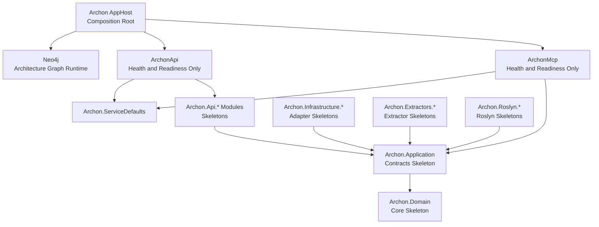

# Implementation Plan - WP001 Solution Foundation, Onion Boundaries, and Host Bootstrap

## Document Control

| Field | Value |
| --- | --- |
| Work Package | WP001 - Solution Foundation, Onion Boundaries, and Host Bootstrap |
| Target Output Path | `docs/001-Solution-Foundation/plan-wp001-solution-foundation.md` |
| Source Specification | `docs/001-Solution-Foundation/spec-wp001-solution-foundation.md` |
| Mandatory Wiki Guidance | `./.github/instructions/wiki.instructions.md` |
| Mandatory Documentation-Pass Guidance | `./.github/instructions/documentation-pass.instructions.md` |
| Required Aspire SDK | `13.3.3` |
| Status | Draft |

## Planning Principles

This plan translates the WP001 specification into executable work items. The work is intentionally foundational, but each work item still produces a runnable or verifiable capability: a buildable solution, health-probed hosts, Aspire composition, enforceable architecture boundaries, and documented manual verification.

Implementation must follow these repository standards as hard gates, not optional cleanup:

- `./.github/instructions/wiki.instructions.md` must be followed for every work item. Wiki review is mandatory for the work package, and wiki updates are required whenever developer-facing behavior, architecture, setup workflows, terminology, or contributor guidance changes or is materially clarified.
- `./.github/instructions/documentation-pass.instructions.md` must be followed for every work item that creates, updates, reviews, or plans source code. Code is not acceptable unless the documentation-pass standard is met for the code touched by that work item.
- Source code must follow the repository coding standards: Allman braces, block-scoped namespaces, no top-level statements, one public type per C# file, nullable reference types, underscore-prefixed private fields, and explicit `Program` or host bootstrap classes for executable entry points.
- Active work-item execution must be uninterrupted. Once implementation starts for a work item, the executor must continue through implementation, validation, documentation/wiki review, and plan-record updates. The executor must not stop for status-only messages, ordinary fixable build/test failures, or confirmation prompts. The only allowed stops are full work-item completion, explicit user interruption or direction change, or a true blocker that cannot be resolved from the specification, this plan, codebase evidence, or repository guidance.
- The Aspire AppHost must not be run by automated validation as a blocking process. Manual verification instructions must be provided instead.

## Overall Project Structure

The implementation will create or align this structure:

```text
docs/
  001-Solution-Foundation/
	spec-wp001-solution-foundation.md
	plan-wp001-solution-foundation.md
	implementation-notes-wp001.md

src/
  Archon/
  Archon.ServiceDefaults/
  ArchonApi/
  ArchonMcp/
  Archon.Domain/
  Archon.Application/
  Archon.Api.Extraction/
  Archon.Api.Query/
  Archon.Api.Management/
  Archon.Roslyn/
  Archon.Roslyn.CSharp/
  Archon.Roslyn.VisualBasic/
  Archon.Roslyn.Legacy/
  Archon.Extractors.Projects/
  Archon.Extractors.AspNet/
  Archon.Extractors.Ui/
  Archon.Extractors.Blazor/
  Archon.Extractors.Razor/
  Archon.Extractors.WinForms/
  Archon.Extractors.Wpf/
  Archon.Extractors.WinUI/
  Archon.Extractors.Maui/
  Archon.Extractors.Avalonia/
  Archon.Extractors.DependencyInjection/
  Archon.Extractors.Configuration/
  Archon.Extractors.DataAccess/
  Archon.Extractors.LinqToSql/
  Archon.Extractors.EntityFramework/
  Archon.Extractors.AdoNet/
  Archon.Extractors.LegacyWeb/
  Archon.Extractors.Hotlist/
  Archon.Infrastructure.Roslyn/
  Archon.Infrastructure.Neo4j/
  Archon.Infrastructure.Markdown/

test/
  Archon.Tests/
  Archon.ServiceDefaults.Tests/
  ArchonApi.Tests/
  ArchonMcp.Tests/
  Archon.Domain.Tests/
  Archon.Application.Tests/
  Archon.Api.Extraction.Tests/
  Archon.Api.Query.Tests/
  Archon.Api.Management.Tests/
  Archon.Roslyn.Tests/
  Archon.Roslyn.CSharp.Tests/
  Archon.Roslyn.VisualBasic.Tests/
  Archon.Roslyn.Legacy.Tests/
  Archon.Extractors.Projects.Tests/
  Archon.Extractors.AspNet.Tests/
  Archon.Extractors.Ui.Tests/
  Archon.Extractors.Blazor.Tests/
  Archon.Extractors.Razor.Tests/
  Archon.Extractors.WinForms.Tests/
  Archon.Extractors.Wpf.Tests/
  Archon.Extractors.WinUI.Tests/
  Archon.Extractors.Maui.Tests/
  Archon.Extractors.Avalonia.Tests/
  Archon.Extractors.DependencyInjection.Tests/
  Archon.Extractors.Configuration.Tests/
  Archon.Extractors.DataAccess.Tests/
  Archon.Extractors.LinqToSql.Tests/
  Archon.Extractors.EntityFramework.Tests/
  Archon.Extractors.AdoNet.Tests/
  Archon.Extractors.LegacyWeb.Tests/
  Archon.Extractors.Hotlist.Tests/
  Archon.Infrastructure.Roslyn.Tests/
  Archon.Infrastructure.Neo4j.Tests/
  Archon.Infrastructure.Markdown.Tests/
```

No `ArchonUi` or `ArchonUi.Tests` project will be created in WP001 because the specification explicitly excludes Discovery UI implementation.

## Work Items

## 1. Foundation Solution Skeleton

- [x] Work Item 1: Create the buildable Archon solution and complete project skeleton - Completed
  - **Completion Summary**: Created or aligned `Archon.slnx`, 34 production projects under `./src`, and 34 corresponding xUnit test projects under `./test`. Production projects target `net10.0`, enable nullable reference types, use explicit non-top-level entry points for executable skeletons, and include documented marker types for compile-safe library identities. Test projects reference their matching production projects and include documented smoke tests proving project wiring. Validation succeeded with `dotnet restore .\Archon.slnx`, `dotnet build .\Archon.slnx --no-restore`, and `dotnet test .\Archon.slnx --no-build --filter FullyQualifiedName~ProjectReferenceTests` with 34 passed tests. Wiki review result: no `./wiki` directory exists in the workspace, so no wiki pages could be updated; the explicit no-wiki-workspace result and rationale are recorded in `docs/001-Solution-Foundation/implementation-notes-wp001.md`.
  - **Purpose**: Establish the solution-wide executable and library structure required by the complete API-first and MCP-first work-package sequence, with every production and test project present before later behavior is implemented.
  - **Acceptance Criteria**:
	- `Archon.slnx` exists at the repository root.
	- All WP001 production projects listed in the specification exist under `./src`.
	- All corresponding test projects exist under `./test`.
	- No `ArchonUi` or `ArchonUi.Tests` project exists as a WP001 deliverable.
	- Each project restores and compiles with nullable reference types enabled.
	- Package references and project references are separated into distinct `.csproj` `ItemGroup` blocks.
  - **Definition of Done**:
	- Solution, production projects, and test projects are created or aligned.
	- Source code written in this work item complies with `./.github/instructions/documentation-pass.instructions.md`, including developer-level comments for every class, method, and constructor, including internal and other non-public code.
	- Public methods and constructors document every parameter; properties whose meaning is not obvious from their names are commented.
	- Code follows Allman braces, block-scoped namespaces, no top-level statements, one public type per file, and underscore-prefixed private fields where fields are needed.
	- Targeted build validation succeeds for the solution skeleton.
	- Wiki review is performed for structure and terminology impact; relevant wiki or repository guidance is updated, or an explicit no-change result is recorded.
	- Foundational documentation uses book-like narrative depth where it explains architecture or setup concepts, defines technical terms on first use, and includes examples or walkthrough support when useful.
	- Can execute end-to-end via: `dotnet restore .\Archon.slnx` followed by `dotnet build .\Archon.slnx`.
	- Executor must not stop mid-work-item unless the work item is complete, the user explicitly interrupts, or a true blocker prevents further autonomous progress.
	- [x] Task 1: Inspect repository baseline - Completed
	- [x] Confirm whether `Archon.slnx`, `src`, or `test` already exist.
	- [x] Confirm available .NET SDK versions and restore compatibility with Aspire SDK `13.3.3`.
	- [x] Record any environment mismatch as an implementation note rather than changing the WP001 requirement.
	- **Task Summary**: Confirmed `Archon.slnx` existed as a folder-only `.slnx`, `src` existed, and `test` did not exist. Confirmed installed SDKs `8.0.100` and `10.0.300`; `dotnet restore .\Archon.slnx` later proved restore compatibility with Aspire SDK `13.3.3`. No SDK mismatch was found.
  - [x] Task 2: Create solution and production project skeletons - Completed
	- [x] Create `Archon.slnx` at the repository root.
	- [x] Create SDK-style projects under `./src` for all required host, core, API module, Roslyn, extractor, and infrastructure projects.
	- [x] Ensure executable projects use explicit entry point classes and do not use top-level statements.
	- [x] Add minimal compile-safe project marker types only where necessary.
	- [x] Apply required comments to every created class, method, and constructor according to `documentation-pass.instructions.md`.
	- **Task Summary**: Aligned the existing root `Archon.slnx`, created all 34 required production projects, configured nullable `net10.0`, applied Aspire AppHost SDK `13.3.3` to `Archon`, and added documented explicit entry point or marker code with no top-level statements.
  - [x] Task 3: Create test project skeletons - Completed
	- [x] Create xUnit test projects under `./test` corresponding to every production project.
	- [x] Add project references from test projects to their production projects where applicable.
	- [x] Add minimal smoke tests only where needed to prove project wiring in this first slice.
	- [x] Apply documentation-pass comments to handwritten test fixtures and test methods.
	- **Task Summary**: Created all 34 corresponding xUnit test projects, separated package and project reference `ItemGroup` blocks, and added documented smoke tests that reference each production assembly.
  - [x] Task 4: Organize solution folders - Completed
	- [x] Add projects to `Archon.slnx` using solution folders with numeric prefixes that reflect the Onion structure.
	- [x] Keep host projects, core projects, API modules, Roslyn projects, extractor projects, infrastructure projects, and test projects easy to discover.
	- **Task Summary**: Added all 68 production and test projects to `Archon.slnx` and organized production projects into numeric solution folders for host/composition, core, API modules, Roslyn, extractors, and infrastructure, with tests under `/test/`.
  - [x] Task 5: Validate buildability - Completed
	- [x] Restore the solution.
	- [x] Build the solution.
	- [x] Fix ordinary restore or compile issues without stopping unless a true external dependency blocker is encountered.
	- **Task Summary**: Restored and built successfully. Fixed generated test files by adding explicit `using Xunit;` directives after an initial compile failure. Ran targeted project-reference smoke tests successfully: 34 passed, 0 failed, 0 skipped.
  - **Files**:
	- `Archon.slnx`: Root solution file for WP001 and later work packages.
	- `src/**/**/*.csproj`: Production project files.
	- `src/**/**/*.cs`: Minimal compile-safe project marker or host bootstrap code.
	- `test/**/**/*.csproj`: Test project files.
	- `test/**/**/*.cs`: Minimal smoke tests and test fixtures.
	- `docs/001-Solution-Foundation/implementation-notes-wp001.md`: Implementation notes, decisions, and validation record.
  - **Work Item Dependencies**: None.
  - **Run / Verification Instructions**:
	- `dotnet restore .\Archon.slnx`
	- `dotnet build .\Archon.slnx`
  - **User Instructions**:
	- None expected unless the required .NET SDK or Aspire SDK restore support is unavailable in the environment.

## 2. Shared Service Defaults and Minimal Host Health Slice

- [x] Work Item 2: Implement shared service defaults and host health/readiness endpoints - Completed
  - **Completion Summary**: Implemented `Archon.ServiceDefaults` with Aspire-style shared host defaults for health checks, OpenTelemetry-compatible logging/metrics/tracing, service discovery, and HTTP client resilience. Replaced `ArchonApi` and `ArchonMcp` skeleton entry points with explicit ASP.NET Core bootstraps that consume service defaults, map only `/health` and `/alive`, and expose testable `BuildApplication` seams. Added targeted tests for service-default registration, in-memory health/readiness probes, API excluded endpoints, and MCP excluded endpoints. Validation succeeded with `dotnet restore .\Archon.slnx`, `dotnet build .\Archon.slnx --no-restore`, and targeted `dotnet test` runs for `Archon.ServiceDefaults.Tests`, `ArchonApi.Tests`, and `ArchonMcp.Tests`. Wiki review result: updated `wiki/home.md` to explain service defaults, readiness, liveness, manual host verification, and intentionally absent API/MCP feature endpoints.
  - **Purpose**: Provide the smallest runnable end-to-end host path: start API or MCP host, route through shared runtime defaults, and receive health/readiness responses without extraction, query, MCP tools, or UI behavior.
  - **Acceptance Criteria**:
	- `Archon.ServiceDefaults` exposes shared host configuration used by both `ArchonApi` and `ArchonMcp`.
	- Service defaults configure liveness/readiness health checks, OpenTelemetry-compatible telemetry defaults, service discovery, and HTTP client resilience defaults where applicable.
	- `ArchonApi` exposes health/readiness only.
	- `ArchonMcp` exposes health/readiness or equivalent probe behavior only.
	- `ArchonApi` does not expose extraction, query, management, or UI endpoints.
	- `ArchonMcp` does not expose MCP tools, MCP resources, or MCP prompts.
	- Tests verify health/readiness mapping without launching the Aspire AppHost.
  - **Definition of Done**:
	- API and MCP hosts can be started independently for local verification.
	- Shared service defaults are consumed by both hosts.
	- Unit or integration tests verify endpoint availability through in-memory or test-host seams.
	- Logging uses `ILogger` abstractions and avoids custom logging callbacks.
	- Source code written in this work item complies with `./.github/instructions/documentation-pass.instructions.md` for all classes, methods, constructors, parameters, and non-obvious properties.
	- Wiki review is performed for runtime foundation, health endpoint terminology, and setup impact; relevant wiki or repository guidance is updated, or an explicit no-change result is recorded.
	- Foundational runtime documentation explains terms such as service defaults, liveness, readiness, telemetry, and resilience when first introduced.
	- Can execute end-to-end by running each host and calling its health/readiness endpoint.
	- Executor must not stop mid-work-item unless the work item is complete, the user explicitly interrupts, or a true blocker prevents further autonomous progress.
	- [x] Task 1: Implement service-default extensions - Completed
	- [x] Add a shared extension class or bootstrap helper in `Archon.ServiceDefaults`.
	- [x] Configure health checks and map liveness/readiness endpoints consistently.
	- [x] Configure OpenTelemetry-compatible telemetry defaults in the Aspire service-defaults pattern.
	- [x] Configure service discovery and HTTP client resilience defaults where applicable.
	- [x] Comment every class, method, constructor, and relevant parameter according to `documentation-pass.instructions.md`.
	- **Task Summary**: Added `Extensions` and `ServiceDefaultEndpointNames` in `Archon.ServiceDefaults`, registered health checks, mapped `/health` and `/alive`, configured OpenTelemetry, service discovery, and HTTP client resilience, and documented all new public APIs and implementation flow.
  - [x] Task 2: Implement explicit API host bootstrap - Completed
	- [x] Add an explicit `Program` or host bootstrap class for `ArchonApi` with no top-level statements.
	- [x] Consume `Archon.ServiceDefaults`.
	- [x] Map health/readiness only.
	- [x] Add structured startup logging where useful.
	- [x] Ensure no extraction, query, management, Swagger UI, Scalar, or UI endpoint is added in WP001.
	- **Task Summary**: Updated `ArchonApi.Program` with documented `Main` and `BuildApplication` methods, service-default consumption, startup logging through `ILogger`, and only default probe endpoint mapping.
  - [x] Task 3: Implement explicit MCP host bootstrap - Completed
	- [x] Add an explicit `Program` or host bootstrap class for `ArchonMcp` with no top-level statements.
	- [x] Consume `Archon.ServiceDefaults`.
	- [x] Map health/readiness or equivalent probe behavior.
	- [x] Ensure no MCP tools, resources, prompts, or architecture-query behavior is added in WP001.
	- **Task Summary**: Updated `ArchonMcp.Program` with documented `Main` and `BuildApplication` methods, service-default consumption, startup logging through `ILogger`, and only default probe endpoint mapping.
  - [x] Task 4: Test host health/readiness behavior - Completed
	- [x] Add API host tests that verify the health/readiness endpoints return successful probe responses.
	- [x] Add MCP host tests that verify the health/readiness endpoint or equivalent probe returns successful responses.
	- [x] Add service-default tests that verify expected health and runtime services are registered.
	- [x] Avoid AppHost process startup in all automated tests.
	- **Task Summary**: Added in-memory TestServer coverage for service-default endpoints, API probe endpoints, MCP probe endpoints, and representative excluded API/MCP feature paths. Tests validate host behavior without starting the Aspire AppHost.
  - **Files**:
	- `src/Archon.ServiceDefaults/**`: Service-default registration and endpoint mapping helpers.
	- `src/ArchonApi/**`: API host bootstrap and health/readiness endpoint wiring.
	- `src/ArchonMcp/**`: MCP host bootstrap and health/readiness endpoint wiring.
	- `test/Archon.ServiceDefaults.Tests/**`: Service-default tests.
	- `test/ArchonApi.Tests/**`: API host bootstrap tests.
	- `test/ArchonMcp.Tests/**`: MCP host bootstrap tests.
	- `docs/001-Solution-Foundation/implementation-notes-wp001.md`: Runtime verification notes.
  - **Work Item Dependencies**: Work Item 1.
  - **Run / Verification Instructions**:
	- `dotnet test .\test\Archon.ServiceDefaults.Tests\Archon.ServiceDefaults.Tests.csproj`
	- `dotnet test .\test\ArchonApi.Tests\ArchonApi.Tests.csproj`
	- `dotnet test .\test\ArchonMcp.Tests\ArchonMcp.Tests.csproj`
	- Manual host check, if needed: run `dotnet run --project .\src\ArchonApi\ArchonApi.csproj` and browse the documented health endpoint.
	- Manual host check, if needed: run `dotnet run --project .\src\ArchonMcp\ArchonMcp.csproj` and browse the documented health endpoint.
  - **User Instructions**:
	- Stop manually run host processes after verification.

## 3. Aspire Composition Slice

- [x] Work Item 3: Compose Neo4j, API host, and MCP host through Aspire - Completed
  - **Completion Summary**: Implemented the `Archon` Aspire AppHost composition root with project references to `ArchonApi` and `ArchonMcp`, Neo4j container composition using Aspire's generic container resource support, API/MCP project resources, `/health` checks, dependency ordering, and explicit exclusion of Discovery UI. A dedicated `Aspire.Hosting.Neo4j` package was attempted but NuGet reported no available versions, so the implementation uses the official `neo4j:latest` container. The Neo4j container now starts in secured mode by reading `neo4j-username` and secret `neo4j-password` Aspire parameters from `src/Archon/appsettings.json` and using them to set `NEO4J_AUTH`. The AppHost binds Neo4j Browser to `localhost:7474`, binds Bolt to `localhost:7687`, and advertises those host-reachable addresses so the Neo4j Browser can connect with `bolt://localhost:7687` instead of triggering routing discovery errors. Added safe static metadata tests in `Archon.Tests` that verify the AppHost SDK, project references, Neo4j/API/MCP composition text, Neo4j parameter-backed authentication, stable Neo4j endpoint bindings, health-check declarations, and absence of `ArchonUi` without starting the AppHost. Validation succeeded with `dotnet restore .\Archon.slnx`, `dotnet build .\Archon.slnx --no-restore`, `dotnet test .\test\Archon.Tests\Archon.Tests.csproj --no-build`, and later Neo4j validation with `dotnet test D:\Dev\Archon\test\Archon.Tests\Archon.Tests.csproj --filter FullyQualifiedName~AppHostCompositionMetadataTests` plus `dotnet build D:\Dev\Archon\Archon.slnx`. Wiki review result: updated `wiki/home.md` with AppHost, composition root, secured Neo4j container parameters, stable Browser/Bolt endpoints, dashboard expectations, and manual verification guidance.
  - **Purpose**: Provide the WP001 distributed application path: the Aspire AppHost composes Neo4j, `ArchonApi`, and `ArchonMcp` for local development while deliberately excluding Discovery UI.
  - **Acceptance Criteria**:
	- `src/Archon/Archon.csproj` uses Aspire SDK `13.3.3`.
	- The AppHost composes Neo4j as the graph runtime dependency.
	- The AppHost composes `ArchonApi` and `ArchonMcp` as project resources.
	- The AppHost does not compose `ArchonUi` or any UI resource.
	- AppHost project code contains no domain, extraction, persistence, API endpoint, or MCP tool logic.
	- Tests or safe metadata checks verify the expected AppHost composition without launching the AppHost as a blocking process.
  - **Definition of Done**:
	- Aspire AppHost composition code is implemented with comments required by `./.github/instructions/documentation-pass.instructions.md`.
	- AppHost validation avoids blocking execution of `dotnet run --project .\src\Archon\Archon.csproj`.
	- Manual verification instructions are added or updated so a developer can run the AppHost and confirm Neo4j, API, and MCP resources.
	- Wiki review is performed for setup, runtime foundation, Aspire composition, Neo4j terminology, and manual verification impact; relevant wiki or repository guidance is updated, or an explicit no-change result is recorded.
	- Documentation explaining this runtime foundation uses narrative prose, defines technical terms such as AppHost, composition root, and service discovery, and includes a practical walkthrough where useful.
	- Can execute end-to-end manually via: `dotnet run --project .\src\Archon\Archon.csproj`.
	- Executor must not stop mid-work-item unless the work item is complete, the user explicitly interrupts, or a true blocker prevents further autonomous progress.
	- [x] Task 1: Implement Aspire AppHost project - Completed
	- [x] Configure `Archon` as the Aspire AppHost with SDK `13.3.3`.
	- [x] Add project references to `ArchonApi` and `ArchonMcp`.
	- [x] Add Neo4j resource composition using the selected Aspire resource package or container integration.
	- [x] Configure health checks for project resources where applicable.
	- [x] Ensure no Archon Discovery UI project or resource is referenced.
	- **Task Summary**: Confirmed `Aspire.AppHost.Sdk/13.3.3`, added API/MCP project references, composed Neo4j as a generic container resource after `Aspire.Hosting.Neo4j` proved unavailable, added `/health` checks for API/MCP resources, and did not reference any UI resource.
  - [x] Task 2: Keep AppHost as composition root only - Completed
	- [x] Review AppHost code for accidental domain logic.
	- [x] Review AppHost code for accidental extraction, graph persistence, API endpoint, or MCP tool behavior.
	- [x] Add comments explaining the AppHost responsibility and why it must remain a composition root.
	- **Task Summary**: Kept `src/Archon/Program.cs` limited to resource composition and dependency ordering, with comments explaining that the AppHost must not contain domain, extraction, graph persistence, API endpoint, or MCP behavior.
  - [x] Task 3: Test or inspect composition safely - Completed
	- [x] Add tests or metadata checks that assert `Archon`, `ArchonApi`, `ArchonMcp`, and Neo4j composition expectations.
	- [x] Assert `ArchonUi` is absent from the solution and AppHost composition.
	- [x] Ensure tests do not start the AppHost as a long-running process.
	- **Task Summary**: Added `AppHostCompositionMetadataTests` to inspect AppHost project/source metadata and UI absence without starting the AppHost, Neo4j, or any long-running process.
  - [x] Task 4: Document manual Aspire verification - Completed
	- [x] Add manual verification instructions to `docs/001-Solution-Foundation/implementation-notes-wp001.md`.
	- [x] State that automated validation must not run the AppHost as a blocking process.
	- [x] Include expected success indicators in the Aspire dashboard.
	- [x] Include a reminder to stop the AppHost after manual verification.
	- **Task Summary**: Updated implementation notes with manual `dotnet run --project .\src\Archon\Archon.csproj` guidance, container runtime prerequisite, expected `neo4j`, `ArchonApi`, and `ArchonMcp` dashboard resources, no-UI expectation, and reminder to stop the AppHost.
  - **Files**:
	- `src/Archon/Archon.csproj`: Aspire AppHost project using SDK `13.3.3`.
	- `src/Archon/**`: AppHost bootstrap and composition code.
	- `test/Archon.Tests/**`: AppHost composition tests or safe metadata checks.
	- `docs/001-Solution-Foundation/implementation-notes-wp001.md`: Manual AppHost verification instructions.
  - **Work Item Dependencies**: Work Items 1 and 2.
  - **Run / Verification Instructions**:
	- Automated: `dotnet test .\test\Archon.Tests\Archon.Tests.csproj`
	- Manual only: `dotnet run --project .\src\Archon\Archon.csproj`
	- In the Aspire dashboard, confirm Neo4j, `ArchonApi`, and `ArchonMcp` appear and no Discovery UI resource appears.
  - **User Instructions**:
	- Ensure local container support is available for Neo4j before manual Aspire verification.
	- Do not leave the AppHost running after the manual check.

## 4. Onion Boundary and Project Identity Verification Slice

- [x] Work Item 4: Enforce project identity and Onion Architecture dependency boundaries - Completed
  - **Completion Summary**: Added cross-cutting project catalog support in `test/Archon.Tests` to locate the repository root, discover projects under `src` and `test`, normalize repository-root-relative project identities, parse `.csproj` project references, and classify projects by WP001 architecture layer. Added `ProjectIdentityTests` for expected production/test project identities, machine-independent path normalization, and absence of `ArchonUi`/`ArchonUi.Tests`. Added `OnionBoundaryTests` for domain isolation, application allowed inward references, API module and infrastructure no-host rules, host composition endpoint rules, no production-to-test references, and the intentionally allowed AppHost references to `ArchonApi` and `ArchonMcp`. Validation succeeded with `dotnet test .\test\Archon.Tests\Archon.Tests.csproj --filter FullyQualifiedName~Boundary`, `dotnet test .\test\Archon.Tests\Archon.Tests.csproj --filter FullyQualifiedName~ProjectIdentity`, and `dotnet build .\Archon.slnx --no-restore`. Wiki review result: updated `wiki/home.md` with Onion Architecture, inward dependency direction, normalized project identity, and boundary-test guidance.
  - **Purpose**: Convert architecture rules into executable tests so later work packages cannot accidentally violate dependency direction or machine-independent project identity.
  - **Acceptance Criteria**:
	- Tests verify project paths are normalized relative to the repository root for stable identity.
	- Tests verify domain projects do not reference application, API module, infrastructure, extractor, Roslyn implementation, or host projects.
	- Tests verify application projects do not reference infrastructure or host projects.
	- Tests verify API module projects do not reference host projects.
	- Tests verify infrastructure projects do not reference host projects.
	- Tests verify host projects remain delivery/composition projects and do not become inward dependencies.
	- Tests verify no `ArchonUi` or `ArchonUi.Tests` project exists for WP001.
  - **Definition of Done**:
	- Boundary tests are implemented and pass.
	- Boundary-test support code complies with `./.github/instructions/documentation-pass.instructions.md`, including comments for internal helper types, constructors, methods, and non-obvious properties.
	- Boundary-test failure messages are clear enough to guide a future contributor to the offending reference.
	- Wiki review is performed for architecture-layer terminology and contributor guidance impact; relevant wiki or repository guidance is updated, or an explicit no-change result is recorded.
	- Architecture documentation uses narrative explanation for Onion Architecture, dependency direction, host boundaries, and project identity normalization.
	- Can execute end-to-end via the boundary test project.
	- Executor must not stop mid-work-item unless the work item is complete, the user explicitly interrupts, or a true blocker prevents further autonomous progress.
	- [x] Task 1: Create project catalog test support - Completed
	- [x] Implement test helper code that locates repository root deterministically.
	- [x] Implement project discovery from `Archon.slnx` or the `src` and `test` folders.
	- [x] Normalize project paths relative to the repository root.
	- [x] Add developer-level comments explaining the identity normalization logic.
	- **Task Summary**: Added documented `ProjectCatalog`, `ProjectDescriptor`, `ProjectReferenceDescriptor`, and `ProjectLayer` support for root discovery, project discovery, normalized identity, reference parsing, and layer classification.
  - [x] Task 2: Implement boundary rule tests - Completed
	- [x] Define project categories for domain, application, API modules, Roslyn, extractor, infrastructure, and hosts.
	- [x] Read project references from `.csproj` files.
	- [x] Assert forbidden reference directions with clear failure messages.
	- [x] Assert expected host and test project presence.
	- [x] Assert `ArchonUi` and `ArchonUi.Tests` are absent.
	- **Task Summary**: Added project identity and Onion boundary tests with clear failure messages for invalid project identities, forbidden references, host boundary drift, and accidental UI project creation.
  - [x] Task 3: Validate against actual project files - Completed
	- [x] Run the boundary tests.
	- [x] Fix incorrect references or categorization until tests represent the WP001 architecture accurately.
	- [x] Record any intentionally allowed host composition reference in implementation notes.
	- **Task Summary**: Ran boundary and identity test filters successfully against the actual project files. No project-reference fixes were required. Recorded the intentionally allowed `Archon` AppHost references to `ArchonApi` and `ArchonMcp` as host composition references in implementation notes.
  - **Files**:
	- `test/Archon.Tests/**`: Cross-cutting project identity and boundary tests.
	- `docs/001-Solution-Foundation/implementation-notes-wp001.md`: Boundary rules explanation and validation record.
  - **Work Item Dependencies**: Work Items 1, 2, and 3.
  - **Run / Verification Instructions**:
	- `dotnet test .\test\Archon.Tests\Archon.Tests.csproj --filter FullyQualifiedName~Boundary`
	- `dotnet test .\test\Archon.Tests\Archon.Tests.csproj --filter FullyQualifiedName~ProjectIdentity`
  - **User Instructions**:
	- None expected.

## 5. Foundation Documentation and Manual Verification Slice

- [x] Work Item 5: Create implementation notes and developer verification documentation - Completed
  - **Completion Summary**: Expanded `docs/001-Solution-Foundation/implementation-notes-wp001.md` into long-form contributor documentation covering WP001 purpose, project families, why full skeleton projects exist before behavior, normalized project identity, Discovery UI exclusion, restore/build commands, targeted test commands, expected success signals, documentation-pass requirements, manual AppHost verification, non-blocking AppHost warning, container runtime prerequisites, dashboard success indicators, and later-capability assignment. Updated `wiki/home.md` to mirror current setup and verification guidance with restore/build commands, targeted test commands, non-blocking validation guidance, and later-capability assignment. Validation succeeded for all documented automated commands: `dotnet restore .\Archon.slnx`, `dotnet build .\Archon.slnx --no-restore`, service-default/API/MCP targeted tests, and `Archon.Tests` AppHost composition, boundary, and project identity filters. Wiki review result: updated `wiki/home.md`; no pages were retired or left stale.
  - **Purpose**: Give contributors enough narrative context and practical commands to understand, build, test, and manually verify the WP001 foundation without confusing it with future extraction or UI work.
  - **Acceptance Criteria**:
	- `docs/001-Solution-Foundation/implementation-notes-wp001.md` exists.
	- Documentation explains the created solution structure and why each major project family exists.
	- Documentation explains how to restore and build the solution.
	- Documentation explains how to run targeted tests for host bootstrap, service defaults, AppHost composition checks, and boundary tests.
	- Documentation explains how to manually start the Aspire AppHost and confirm Neo4j, API, and MCP resources.
	- Documentation explicitly states that automated validation must not start the AppHost as a blocking process.
	- Documentation explicitly states that Discovery UI is not implemented in WP001.
	- Documentation identifies later capabilities as assigned to later numbered work packages, not deferred optional work.
  - **Definition of Done**:
	- Implementation notes are written in long-form, book-like narrative prose where architecture, runtime foundation, setup flow, or contributor workflow concepts are explained.
	- Technical terms such as AppHost, service defaults, readiness, liveness, service discovery, composition root, and Onion Architecture are defined on first use or linked to glossary-style explanation.
	- Relevant examples or walkthroughs are included where they materially improve understanding.
	- Documentation-pass requirements for source comments are cross-referenced as mandatory for code work performed in WP001.
	- Wiki review is performed for overlap between implementation notes and repository wiki guidance; relevant wiki or repository guidance is updated, or an explicit no-change result is recorded.
	- Can execute end-to-end by following the documented build, test, and manual verification commands.
	- Executor must not stop mid-work-item unless the work item is complete, the user explicitly interrupts, or a true blocker prevents further autonomous progress.
	- [x] Task 1: Document the foundation structure - Completed
	- [x] Explain the purpose of each project family.
	- [x] Explain why all skeleton projects are created in WP001 before behavior is implemented.
	- [x] Explain why `ArchonUi` is absent.
	- **Task Summary**: Added narrative documentation explaining host/composition, service defaults, core, API module, Roslyn, extractor, infrastructure, and test project families, plus the rationale for complete skeleton creation and explicit no-UI scope.
  - [x] Task 2: Document build and test commands - Completed
	- [x] Add solution restore and build commands.
	- [x] Add targeted test commands for service defaults, API host, MCP host, AppHost composition checks, and boundary tests.
	- [x] Explain expected success signals and common environment prerequisites.
	- **Task Summary**: Documented restore/build commands, targeted tests for service defaults, API, MCP, AppHost composition, boundary, and project identity checks, expected success signals, .NET 10 SDK expectation, and documentation-pass requirements.
  - [x] Task 3: Document manual AppHost verification - Completed
	- [x] Add the manual AppHost start command.
	- [x] Explain expected Aspire dashboard resources.
	- [x] Explain expected API and MCP probe checks.
	- [x] Explain how and when to stop the AppHost.
	- [x] Warn that automated validation must not run the AppHost as a blocking process.
	- **Task Summary**: Added manual AppHost walkthrough with `dotnet run --project .\src\Archon\Archon.csproj`, container runtime prerequisite, expected `neo4j`, `ArchonApi`, and `ArchonMcp` dashboard resources, `/health` and `/alive` probe checks, stop guidance, and blocking automation warning.
  - [x] Task 4: Document later-capability assignment - Completed
	- [x] State that extraction, query, graph persistence, MCP tools, markdown export, findings, and UI capability are implemented by later work packages.
	- [x] Avoid language that treats those capabilities as optional, deferred, or unspecified future work.
	- **Task Summary**: Added explicit later-capability assignment for extraction, query, management, graph persistence, markdown export, MCP tools/resources/prompts, findings, hotlist behavior, and Discovery UI as later numbered work rather than optional future work.
  - **Files**:
	- `docs/001-Solution-Foundation/implementation-notes-wp001.md`: Main WP001 implementation and verification notes.
	- `docs/001-Solution-Foundation/spec-wp001-solution-foundation.md`: Update only if implementation discovers a specification correction is required.
  - **Work Item Dependencies**: Work Items 1 through 4.
  - **Run / Verification Instructions**:
	- Follow all commands documented in `docs/001-Solution-Foundation/implementation-notes-wp001.md`.
  - **User Instructions**:
	- Manual Aspire verification may require local container support for Neo4j.

## 6. Targeted Validation and Work-Package Completion Record

- [x] Work Item 6: Validate WP001 and record completion evidence - Completed
  - **Completion Summary**: Completed final WP001 automated validation without starting the Aspire AppHost as a blocking process. `dotnet restore D:\Dev\Archon\Archon.slnx` succeeded, `dotnet build D:\Dev\Archon\Archon.slnx` succeeded, and targeted test projects succeeded for `Archon.ServiceDefaults.Tests`, `ArchonApi.Tests`, `ArchonMcp.Tests`, and `Archon.Tests`; the final visible `Archon.Tests` summary reported 14 passed, 0 failed, and 0 skipped. Confirmed implementation notes and `wiki/home.md` contain manual Aspire verification instructions, the non-blocking AppHost automation warning, `ArchonUi` exclusion, and later numbered work-package assignment for capabilities outside WP001. Manual AppHost verification was not performed by the executor because it is intentionally a developer-run long-running orchestration check. Wiki review result: reviewed `wiki/home.md` and the implementation record; no additional wiki update was required because Work Item 5 guidance already matches the final validated foundation.
  - **Purpose**: Prove the foundation is complete, buildable, and tested before later work packages depend on it.
  - **Acceptance Criteria**:
	- Solution restore succeeds.
	- Solution build succeeds.
	- Targeted WP001 tests pass.
	- Validation does not run the Aspire AppHost as a blocking process.
	- Completion record states build, test, documentation, and manual-verification status.
	- Any failed validation is fixed and rerun unless a true blocker exists.
  - **Definition of Done**:
	- Restore, build, and targeted tests are complete.
	- Failures are fixed and validations rerun until they pass or are clearly documented as unrelated/pre-existing true blockers.
	- Documentation and wiki review outcomes are recorded.
	- Final completion record identifies manual steps the user may run for Aspire verification.
	- Executor must not stop mid-work-item unless the work item is complete, the user explicitly interrupts, or a true blocker prevents further autonomous progress.
	- [x] Task 1: Run restore and build validation - Completed
	- [x] Run `dotnet restore .\Archon.slnx`.
	- [x] Run `dotnet build .\Archon.slnx`.
	- [x] Fix and rerun on ordinary restore/build failures.
	- **Task Summary**: Restore and build both succeeded for `D:\Dev\Archon\Archon.slnx`; no restore or build fixes were required in the final validation pass.
  - [x] Task 2: Run targeted tests - Completed
	- [x] Run `dotnet test .\test\Archon.ServiceDefaults.Tests\Archon.ServiceDefaults.Tests.csproj`.
	- [x] Run `dotnet test .\test\ArchonApi.Tests\ArchonApi.Tests.csproj`.
	- [x] Run `dotnet test .\test\ArchonMcp.Tests\ArchonMcp.Tests.csproj`.
	- [x] Run `dotnet test .\test\Archon.Tests\Archon.Tests.csproj`.
	- [x] Run any additional targeted test project needed because implementation placed WP001 tests elsewhere.
	- **Task Summary**: All targeted WP001 test projects succeeded. No additional targeted project was required beyond the documented service-default, API, MCP, and cross-cutting Archon test projects.
  - [x] Task 3: Verify documentation completion - Completed
	- [x] Confirm manual Aspire verification instructions exist.
	- [x] Confirm the documentation states not to automate blocking AppHost execution.
	- [x] Confirm `ArchonUi` exclusion is documented.
	- [x] Confirm later capabilities are assigned to later work packages, not optional future work.
	- **Task Summary**: Confirmed `docs/001-Solution-Foundation/implementation-notes-wp001.md` and `wiki/home.md` contain the manual AppHost walkthrough, non-blocking AppHost automation warning, explicit no-UI scope, and later numbered work-package assignment.
  - [x] Task 4: Record completion evidence - Completed
	- [x] Update `docs/001-Solution-Foundation/implementation-notes-wp001.md` with executed commands and outcomes.
	- [x] Record any manual verification that was not performed by the executor and why.
	- [x] Include the wiki review outcome or reference the final wiki work item result.
	- **Task Summary**: Added the final Work Item 6 completion record to implementation notes, including command outcomes, manual AppHost verification status, and final wiki review result.
  - **Files**:
	- `docs/001-Solution-Foundation/implementation-notes-wp001.md`: Validation and completion record.
  - **Work Item Dependencies**: Work Items 1 through 5.
  - **Run / Verification Instructions**:
	- `dotnet restore .\Archon.slnx`
	- `dotnet build .\Archon.slnx`
	- `dotnet test .\test\Archon.ServiceDefaults.Tests\Archon.ServiceDefaults.Tests.csproj`
	- `dotnet test .\test\ArchonApi.Tests\ArchonApi.Tests.csproj`
	- `dotnet test .\test\ArchonMcp.Tests\ArchonMcp.Tests.csproj`
	- `dotnet test .\test\Archon.Tests\Archon.Tests.csproj`
  - **User Instructions**:
	- Perform the manual Aspire AppHost verification if it was not run by the implementation executor.

## 7. Mandatory Wiki Review and Update Gate

- [x] Work Item 7: Complete final wiki review and record wiki outcome - Completed
  - **Completion Summary**: Completed the final mandatory wiki review for WP001 according to `./.github/instructions/wiki.instructions.md`. Reviewed the final implementation record, this plan, the wiki-maintenance instruction file, and every wiki page present in the workspace. The only wiki page present is `wiki/home.md`. No additional wiki page update was required because `wiki/home.md` already provides current-state narrative guidance for WP001 solution structure, service defaults, probe endpoints, AppHost composition, Neo4j runtime seam, automated validation commands, manual AppHost verification, non-blocking AppHost automation, Onion Architecture boundaries, project identity, `ArchonUi` exclusion, and later numbered work-package assignment. Recorded the explicit no-change wiki outcome in `docs/001-Solution-Foundation/implementation-notes-wp001.md`. Validation succeeded with `dotnet build D:\Dev\Archon\Archon.slnx` after the documentation-only updates.
  - **Purpose**: Satisfy the repository-wide wiki maintenance requirement and ensure contributor-facing guidance remains aligned with the WP001 foundation.
  - **Acceptance Criteria**:
	- Relevant wiki pages, appendix pages, glossary entries, and repository guidance files are reviewed for WP001 impact.
	- Wiki updates are made if WP001 changes or materially clarifies architecture, runtime composition, setup workflows, commands, terminology, or contributor guidance.
	- If no wiki update is required, the no-change decision is recorded with the pages or guidance reviewed and the reason existing guidance remains sufficient.
	- Final execution record states which wiki or repository guidance pages were updated, created, retired, or intentionally left unchanged.
	- Any wiki or guidance updates for architecture, runtime foundations, setup flows, or workflow-heavy topics use long-form, book-like narrative prose, define technical terms, and include examples or walkthrough material where useful.
  - **Definition of Done**:
	- `./.github/instructions/wiki.instructions.md` has been followed in full.
	- Wiki review result is recorded explicitly in `docs/001-Solution-Foundation/implementation-notes-wp001.md`.
	- Relevant wiki or repository guidance pages are updated if required.
	- Final work-package report includes the wiki review result in one of the accepted explicit reporting forms from `wiki.instructions.md`.
	- Executor must not stop mid-work-item unless the work item is complete, the user explicitly interrupts, or a true blocker prevents further autonomous progress.
	- [x] Task 1: Identify wiki impact - Completed
	- [x] Review WP001 changes for developer-facing behavior, architecture, runtime composition, setup, workflows, terminology, and contributor guidance.
	- [x] Identify candidate wiki pages or guidance pages that may need updates.
	- **Task Summary**: Reviewed WP001's developer-facing changes and confirmed the review scope included the implementation notes, this plan, wiki instructions, and the only wiki page present: `wiki/home.md`.
  - [x] Task 2: Apply required wiki or guidance updates - Completed
	- [x] Update relevant wiki or repository guidance pages when WP001 changes or clarifies contributor-facing information.
	- [x] Use narrative depth for foundational architecture and runtime topics.
	- [x] Define technical terms when first introduced.
	- [x] Include examples or walkthrough material where it improves understanding.
	- **Task Summary**: No additional wiki edit was required because `wiki/home.md` already contains the required current-state narrative depth, definitions, command examples, manual verification walkthrough, and WP001 boundary explanations.
  - [x] Task 3: Record wiki review outcome - Completed
	- [x] Record updated, created, retired, or unchanged wiki/guidance pages in `implementation-notes-wp001.md`.
	- [x] Include a concise reason if no wiki page update was needed.
	- [x] Ensure the final completion message carries this outcome forward.
	- **Task Summary**: Recorded the final no-change wiki review outcome in implementation notes and included the reason existing `wiki/home.md` guidance remained sufficient.
  - **Files**:
	- `docs/001-Solution-Foundation/implementation-notes-wp001.md`: Wiki review result.
	- `wiki/**` or repository guidance files: Updated only if review determines changes are required.
  - **Work Item Dependencies**: Work Items 1 through 6.
  - **Run / Verification Instructions**:
	- Review the final recorded wiki outcome in `docs/001-Solution-Foundation/implementation-notes-wp001.md`.
  - **User Instructions**:
	- None expected unless wiki location or access is unavailable in the workspace.

## Appendix A - Architecture

### Overall Technical Approach

WP001 establishes Archon as an Aspire-orchestrated .NET solution. Aspire is the local orchestration framework: it defines how development-time resources such as the API host, MCP host, and Neo4j graph database are started and connected. The AppHost is the composition root, meaning it wires runtime resources together but does not own business logic.

The solution follows Onion Architecture. Onion Architecture is a dependency-direction model where inward layers hold stable domain and application concepts, while outward layers provide delivery and infrastructure details. In WP001 this is enforced primarily by project references and tests. The domain layer must not depend on outer layers. Application contracts may depend inward but must not depend on infrastructure or hosts. Hosts sit at the edge and compose the system.

Neo4j is included as the graph database resource because later work packages persist extracted architecture facts as a native graph. WP001 composes Neo4j but does not create graph constraints, indexes, Cypher queries, or persistence behavior.



The diagram should be read from runtime composition at the top toward inward architectural dependencies at the bottom. It is intentionally limited to WP001 behavior. It does not imply extraction, query, persistence, MCP tools, or UI features are implemented.

### Frontend

WP001 has no frontend architecture. The Archon Discovery UI is explicitly excluded by the controlling work-package sequence and by the WP001 specification. No UI host, page, component, static asset, graph view, dashboard, evidence viewer, hotlist viewer, or prompt panel is part of this plan.

The absence of frontend work is itself an architectural decision for WP001. Archon must complete API-first and MCP-first capability before a human-facing UI is considered. Backend extraction of UI technologies in target repositories remains part of later architecture-intelligence work, but that is not the same as building Archon's own frontend.

### Backend

The backend foundation consists of three runnable host concerns and several compile-safe library families.

`Archon` is the Aspire AppHost. Its responsibility is orchestration: it composes Neo4j, `ArchonApi`, and `ArchonMcp` for local development. It should remain thin and should never become a place for domain decisions, extraction algorithms, graph persistence, or API endpoint implementation.

`Archon.ServiceDefaults` centralizes cross-host runtime defaults. Service defaults are shared host configuration conventions, such as health probes, telemetry, service discovery, and resilience. Liveness means the process is running and can be probed. Readiness means the service is ready to handle intended work. In WP001 these probes are the only external behavior exposed by the API and MCP hosts.

`ArchonApi` is the HTTP host. In WP001 it exposes health/readiness only. Later work packages attach extraction, query, and management modules to this host, but those endpoints are excluded here.

`ArchonMcp` is the AI-facing host. In WP001 it exposes health/readiness only. Later work packages add MCP tools, resources, prompts, and evidence-backed architecture query behavior.

The library projects provide future landing zones. `Archon.Domain` and `Archon.Application` form the inward core. `Archon.Api.*` modules represent use-case slices consumed by the API host. `Archon.Roslyn.*` and `Archon.Extractors.*` represent future deterministic extraction capabilities. `Archon.Infrastructure.*` projects represent outer adapters for Roslyn, Neo4j, and markdown generation.

### Data Flow

WP001 has no architecture-fact data flow. The only runtime flow is health and readiness probing:

1. A developer or test host sends a request to an API or MCP health/readiness endpoint.
2. The host uses shared service-default configuration to process the probe.
3. The host returns a health result.

Manual Aspire verification adds a development-time orchestration flow:

1. A developer starts `src/Archon/Archon.csproj` manually.
2. Aspire starts or composes Neo4j, `ArchonApi`, and `ArchonMcp`.
3. The developer confirms those resources are visible and healthy in the Aspire dashboard.
4. The developer confirms no Discovery UI resource exists.
5. The developer stops the AppHost manually.

### Security and Operational Notes

WP001 does not implement authentication, authorization, secrets handling beyond normal local development configuration, or external API behavior. It must still avoid hardcoded secrets and must not embed Neo4j credentials in source code unless they are development-only values generated or managed through Aspire-supported local resource configuration.

The AppHost manual verification may require local container support because Neo4j is a runtime dependency. This requirement should be documented clearly, including what success looks like and how to stop the local environment after verification.

## Summary

This plan delivers WP001 as a sequence of runnable foundation slices: create the buildable solution skeleton, add shared service defaults and host probes, compose the local Aspire runtime with Neo4j, enforce Onion Architecture boundaries through tests, document the developer workflow, validate the foundation, and complete the mandatory wiki review gate.

The key implementation considerations are strict exclusion of Discovery UI, use of Aspire SDK `13.3.3`, avoidance of blocking AppHost execution during automated validation, exhaustive creation of planned API/MCP production and test skeletons, mandatory developer-level source comments for all code written, and mandatory wiki maintenance before the work package can be considered complete.
