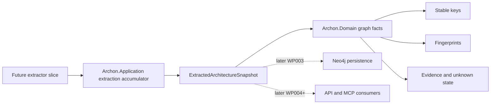
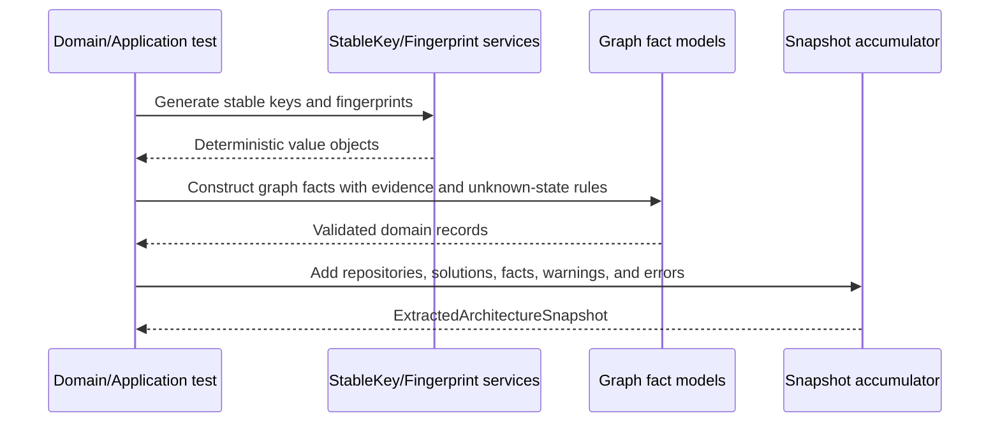

# Implementation Plan - WP002 Architecture Graph Domain Model and Shared Contracts

## Document Control

| Field | Value |
| --- | --- |
| Work Package | WP002 - Architecture Graph Domain Model and Shared Contracts |
| Target Output Path | `docs/002-Architecture-Graph-Domain-Model/plan-wp002-architecture-graph-domain-model.md` |
| Source Specification | `docs/002-Architecture-Graph-Domain-Model/spec-wp002-architecture-graph-domain-model.md` |
| Mandatory Wiki Guidance | `./.github/instructions/wiki.instructions.md` |
| Mandatory Documentation-Pass Guidance | `./.github/instructions/documentation-pass.instructions.md` |
| Status | Draft |

## Planning Principles

This plan translates the WP002 specification into sequential, runnable, and verifiable implementation work items. WP002 is a domain-and-contract work package rather than a user-interface or host-runtime package, so each vertical slice is expressed as a usable developer-facing capability: controlled values that serialize and parse, stable-key and fingerprint services that can be exercised through tests, graph fact contracts that enforce evidence and unknown-state rules, and an extraction accumulator that can build a complete in-memory snapshot from representative facts.

Implementation must follow these repository standards as hard gates, not optional cleanup:

- `./.github/instructions/wiki.instructions.md` must be followed for every work item. Wiki review is mandatory for the work package, and wiki updates are required whenever developer-facing behavior, architecture, workflows, terminology, or contributor guidance changes or is materially clarified.
- `./.github/instructions/documentation-pass.instructions.md` must be followed for every work item that creates, updates, reviews, or plans source code. Code is not acceptable unless the documentation-pass standard is met for the code touched by that work item.
- Source code must follow the repository coding standards: Allman braces, block-scoped namespaces, no top-level statements, one public type per file, nullable reference types, underscore-prefixed private fields, and explicit documentation on public and non-public types, methods, constructors, and parameters.
- Active work-item execution must be uninterrupted. Once implementation starts for a work item, the executor must continue through implementation, validation, documentation/wiki review, and plan-record updates. The executor must not stop for status-only messages, ordinary fixable build/test failures, or confirmation prompts. The only allowed stops are full work-item completion, explicit user interruption or direction change, or a true blocker that cannot be resolved from the specification, this plan, codebase evidence, or repository guidance.
- WP002 must not implement Neo4j persistence, Roslyn workspace loading, extractor behavior, API extraction endpoints, MCP tools/resources/prompts, markdown export, or Discovery UI behavior.

## Overall Project Structure

WP002 implementation is expected to work primarily in the existing WP001 project structure:

```text
docs/
  002-Architecture-Graph-Domain-Model/
	spec-wp002-architecture-graph-domain-model.md
	plan-wp002-architecture-graph-domain-model.md
	implementation-notes-wp002.md

src/
  Archon.Domain/
	Graph/
	  ControlledValues/
	  Identity/
	  Metadata/
	  Model/
  Archon.Application/
	Extraction/
	  Accumulation/
	  Contracts/

test/
  Archon.Domain.Tests/
	Graph/
	  ControlledValues/
	  Identity/
	  Metadata/
	  Model/
  Archon.Application.Tests/
	Extraction/
	  Accumulation/
	  Contracts/
```

The exact folder names may be adjusted to match existing repository conventions discovered during implementation, but the architectural placement must remain unchanged: pure graph concepts and invariants belong in `Archon.Domain`; cross-module extraction snapshot and accumulation contracts belong in `Archon.Application`.

## Naming and Design Conventions

- Controlled value sets such as `NodeKind`, `EdgeKind`, `EvidenceKind`, `RuleCategory`, `FindingSeverity`, `FindingStatus`, `KnowledgeKind`, metric scope, and summary kind must use smart-enum/value-object style rather than ordinary numeric C# enums.
- Each controlled value must expose a stable external string identity suitable for JSON, Neo4j persistence, API responses, MCP responses, markdown export, and tests.
- Stable keys must be represented by a dedicated value object and generated by one shared component.
- Fingerprints must be represented by a dedicated value object and generated from canonical, deterministic input.
- Metadata must have a deterministic canonical representation so fingerprinting is stable across executions.
- Unknown state and confidence must be explicit in the model and cannot be bypassed for nodes, edges, evidence, or findings.
- Implementation notes must record design decisions, validation commands, wiki review outcome, and any intentionally deferred capabilities that are out of scope for WP002.

## Work Items

## 1. Domain Controlled Values and Developer-Facing Serialization Slice

- [x] Work Item 1: Implement smart-enum/value-object controlled values with deterministic string serialization - Completed
  - **Completion Summary**: Implemented documented controlled-value infrastructure and concrete WP002 graph classification value sets in `src/Archon.Domain/Graph/ControlledValues`, added focused xUnit coverage in `test/Archon.Domain.Tests/Graph/ControlledValues/ControlledValueTests.cs`, recorded design decisions and validation in `docs/002-Architecture-Graph-Domain-Model/implementation-notes-wp002.md`, and updated `wiki/home.md` for controlled-value terminology and domain-model impact. Validation performed: `dotnet test .\test\Archon.Domain.Tests\Archon.Domain.Tests.csproj --filter FullyQualifiedName~ControlledValue` passed with 136 tests. Wiki review result: updated `wiki/home.md` with current-state guidance for controlled values, smart-enum-style stable external strings, numeric enum drift, and the pure-domain scope of this slice.
  - **Purpose**: Provide the first runnable domain capability for WP002: developers can create, parse, serialize, and validate graph classification values without numeric enum drift. This proves the smart-enum/value-object pattern before other graph contracts depend on it.
  - **Acceptance Criteria**:
	- `NodeKind`, `EdgeKind`, `EvidenceKind`, `RuleCategory`, `FindingSeverity`, `FindingStatus`, `KnowledgeKind`, metric scope kind, and summary kind exist as smart-enum/value-object controlled values.
	- Every required `NodeKind` and `EdgeKind` listed in the WP002 specification exists.
	- Every required evidence kind, rule category, finding severity, finding status, and knowledge kind listed in the WP002 specification exists.
	- Controlled values expose stable external string values and round-trip through parsing.
	- Controlled values do not depend on numeric enum ordinals.
	- Tests demonstrate representative serialization and parsing behavior.
  - **Definition of Done**:
	- Code implemented in `Archon.Domain`.
	- Tests passing in `Archon.Domain.Tests` for controlled value existence, parsing, equality, and string serialization.
	- Source code complies with `./.github/instructions/documentation-pass.instructions.md`, including developer-level comments for every class, method, constructor, and non-public type touched in this work item.
	- Public methods and constructors document every parameter; properties whose meaning is not obvious from their names are commented.
	- Logging is not required because this slice is pure domain behavior with no runtime side effects.
	- Wiki review is performed for terminology and domain-model impact; relevant wiki or repository guidance is updated, or an explicit no-change result is recorded in the implementation notes.
	- Foundational documentation explains terms such as controlled value, smart enum, stable external string identity, and numeric enum drift when they are first introduced.
	- Can execute end-to-end via: `dotnet test .\test\Archon.Domain.Tests\Archon.Domain.Tests.csproj --filter FullyQualifiedName~ControlledValue`.
	- Executor must not stop mid-work-item; execution continues through implementation, validation, documentation/wiki review, and plan-record updates unless the work item is complete, the user explicitly interrupts, or a true blocker prevents further autonomous progress.
	- [x] Task 1: Inspect existing domain and test project layout - Completed
	- [x] Confirm current files in `src/Archon.Domain` and `test/Archon.Domain.Tests`.
	- [x] Identify existing marker types or namespace conventions from WP001.
	- [x] Preserve block-scoped namespaces and Allman braces.
	- **Task Summary**: Confirmed `Archon.Domain` and `Archon.Domain.Tests` started from WP001 marker/test skeletons, retained block-scoped namespaces and Allman braces, and used `Archon.Domain.Graph.ControlledValues` plus matching test namespace placement.
  - [x] Task 2: Implement the base controlled-value abstraction - Completed
	- [x] Create a reusable base type or pattern for controlled string values.
	- [x] Ensure equality, comparison where useful, string conversion, and parse or try-parse behavior are deterministic.
	- [x] Avoid reflection-heavy behavior unless it is simple, deterministic, and covered by tests.
	- [x] Add XML/developer comments required by `documentation-pass.instructions.md`.
	- **Task Summary**: Added `ControlledValue<TValue>`, `ControlledValueJsonConverterFactory`, and `ControlledValueJsonConverter<TValue>` with stable string registration, deterministic `All` ordering, strict `Parse`, non-throwing `TryParse`, value-object equality, and JSON string serialization. The small converter-factory reflection path is covered by JSON round-trip tests.
  - [x] Task 3: Implement graph controlled value sets - Completed
	- [x] Add `NodeKind` with all required values from FR-011 through FR-050.
	- [x] Add `EdgeKind` with all required values from FR-051 through FR-086.
	- [x] Add `EvidenceKind`, `RuleCategory`, `FindingSeverity`, `FindingStatus`, `KnowledgeKind`, metric scope kind, and summary kind.
	- [x] Keep each public type in its own C# file.
	- **Task Summary**: Added one public type per file for `NodeKind`, `EdgeKind`, `EvidenceKind`, `RuleCategory`, `FindingSeverity`, `FindingStatus`, `KnowledgeKind`, `MetricScopeKind`, and `SummaryKind`, with documented stable external string values.
  - [x] Task 4: Implement tests for controlled values - Completed
	- [x] Verify all required values exist.
	- [x] Verify stable external string values.
	- [x] Verify parse and try-parse behavior.
	- [x] Verify equality does not depend on object reference identity.
	- [x] Verify representative JSON serialization if JSON converter support is included in this slice.
	- **Task Summary**: Added `ControlledValueTests` covering required values, stable strings, parsing, invalid input, equality, deterministic declaration ordering, and representative System.Text.Json serialization/deserialization.
  - [x] Task 5: Update implementation notes and wiki review result - Completed
	- [x] Create or update `docs/002-Architecture-Graph-Domain-Model/implementation-notes-wp002.md`.
	- [x] Record controlled-value design decisions and validation commands.
	- [x] Record wiki review result with either exact pages updated or a grounded no-change explanation.
	- **Task Summary**: Created implementation notes for Work Item 1 and recorded the mandatory wiki review outcome. Updated `wiki/home.md` because the work item introduced contributor-facing graph vocabulary and terminology.
  - **Files**:
	- `src/Archon.Domain/Graph/ControlledValues/*.cs`: Controlled-value base and concrete value sets.
	- `test/Archon.Domain.Tests/Graph/ControlledValues/*.cs`: Controlled-value tests.
	- `docs/002-Architecture-Graph-Domain-Model/implementation-notes-wp002.md`: Implementation record and wiki outcome.
  - **Work Item Dependencies**: WP001 project skeleton exists.
  - **Run / Verification Instructions**:
	- `dotnet test .\test\Archon.Domain.Tests\Archon.Domain.Tests.csproj --filter FullyQualifiedName~ControlledValue`
  - **User Instructions**:
	- None expected.

## 2. Stable-Key Generation Slice

- [x] Work Item 2: Implement deterministic stable-key value objects and shared generation service - Completed
  - **Completion Summary**: Implemented documented stable-key identity support in `src/Archon.Domain/Graph/Identity` with `StableKey`, `RepositoryRelativePath`, and the shared `StableKeyGenerator`; added focused xUnit coverage in `test/Archon.Domain.Tests/Graph/Identity/StableKeyTests.cs`; updated implementation notes; and updated `wiki/home.md` for stable-key terminology and repository-relative path guidance. Validation performed: `dotnet test .\test\Archon.Domain.Tests\Archon.Domain.Tests.csproj --filter FullyQualifiedName~StableKey` passed with 40 tests. Wiki review result: updated `wiki/home.md` with current-state guidance for stable keys, why they are not database identifiers, cross-machine repository-relative path determinism, and shared generator usage.
  - **Purpose**: Provide a usable identity capability for all later graph facts. Developers can generate stable keys for repositories, solutions, projects, symbols, artifacts, rules, findings, metrics, and summaries through one shared component.
  - **Acceptance Criteria**:
	- `StableKey` rejects null, empty, and whitespace-only values.
	- One shared stable-key generation component exists in `Archon.Domain`.
	- Every required stable-key prefix from the WP002 specification is generated and tested.
	- Repository-relative paths are normalized consistently and do not depend on machine-specific root paths.
	- Stable-key generation is deterministic for equivalent logical input.
  - **Definition of Done**:
	- Code implemented in `Archon.Domain`.
	- Tests passing in `Archon.Domain.Tests` for all required prefixes, determinism, validation, and path normalization.
	- Source code complies with `./.github/instructions/documentation-pass.instructions.md` for all touched classes, methods, constructors, parameters, properties, and internal helpers.
	- Wiki review is performed for stable-key terminology and architecture identity impact; relevant wiki or repository guidance is updated, or an explicit no-change result is recorded.
	- Documentation or implementation notes explain stable key, repository-relative path, and why keys must not depend on database IDs.
	- Can execute end-to-end via: `dotnet test .\test\Archon.Domain.Tests\Archon.Domain.Tests.csproj --filter FullyQualifiedName~StableKey`.
	- Executor must not stop mid-work-item; execution continues through implementation, validation, documentation/wiki review, and plan-record updates unless the work item is complete, the user explicitly interrupts, or a true blocker prevents further autonomous progress.
	- [x] Task 1: Implement identity value objects - Completed
	- [x] Create `StableKey` and any supporting identifier value objects required by the specification.
	- [x] Enforce validation for null, empty, and whitespace-only input.
	- [x] Add clear comments explaining the difference between a stable key and a database identifier.
	- **Task Summary**: Added `StableKey` as a documented value object that rejects blank values and explicitly explains that stable keys are deterministic graph identities rather than database IDs.
  - [x] Task 2: Implement path normalization helpers - Completed
	- [x] Normalize directory separators.
	- [x] Normalize repository-relative paths without embedding developer machine root paths.
	- [x] Preserve meaningful case rules according to the chosen deterministic convention.
	- **Task Summary**: Added `RepositoryRelativePath` to normalize backslashes to forward slashes, remove leading `./`, collapse repeated separators, preserve meaningful case, and reject absolute/rooted machine-specific paths.
  - [x] Task 3: Implement the stable-key generator - Completed
	- [x] Add generation methods for `repository://`, `solution://`, `project://`, `package://`, `namespace://`, `type://`, `method://`, `property://`, `field://`, `endpoint://`, `controller://`, `hostedservice://`, `config://`, `dbcontext://`, `linqtosql://`, `entity://`, `dbtable://`, `dbcolumn://`, `storedprocedure://`, `externalservice://`, `queue://`, `topic://`, `file://`, `pipeline://`, `rule://`, `finding://`, `metric://`, and `summary://`.
	- [x] Ensure generation method names make each intended input shape clear.
	- [x] Ensure graph fact contracts can consume generated `StableKey` instances without stringly typed duplication.
	- **Task Summary**: Added `StableKeyGenerator` with explicit methods for every required prefix, path-based methods for repository artifacts, endpoint normalization, versioned rule keys, and snapshot-scoped finding/metric/summary key shapes.
  - [x] Task 4: Implement stable-key tests - Completed
	- [x] Verify every required prefix.
	- [x] Verify deterministic output for repeated equivalent input.
	- [x] Verify path normalization across Windows and forward-slash input forms.
	- [x] Verify invalid input is rejected.
	- **Task Summary**: Added `StableKeyTests` covering value validation/equality, path normalization and absolute-path rejection, every required prefix, deterministic equivalent input handling, and invalid generator input failures.
  - [x] Task 5: Update implementation notes and wiki review result - Completed
	- [x] Record stable-key decisions and validation commands.
	- [x] Record wiki pages updated or no-change rationale.
	- **Task Summary**: Updated `implementation-notes-wp002.md` with stable-key design and validation details. Updated `wiki/home.md` because stable keys and repository-relative paths are developer-facing identity concepts.
  - **Files**:
	- `src/Archon.Domain/Graph/Identity/*.cs`: Stable-key value objects and generator.
	- `test/Archon.Domain.Tests/Graph/Identity/*.cs`: Stable-key tests.
	- `docs/002-Architecture-Graph-Domain-Model/implementation-notes-wp002.md`: Implementation record and wiki outcome.
  - **Work Item Dependencies**: Work Item 1.
  - **Run / Verification Instructions**:
	- `dotnet test .\test\Archon.Domain.Tests\Archon.Domain.Tests.csproj --filter FullyQualifiedName~StableKey`
  - **User Instructions**:
	- None expected.

## 3. Metadata and Fingerprint Slice

- [x] Work Item 3: Implement deterministic metadata and fingerprint generation - Completed
  - **Completion Summary**: Implemented deterministic metadata and fingerprint support in `Archon.Domain` with `GraphMetadata`, `Fingerprint`, `FingerprintInput`, and `FingerprintGenerator`; added focused xUnit coverage in `test/Archon.Domain.Tests/Graph/Metadata/GraphMetadataTests.cs` and `test/Archon.Domain.Tests/Graph/Identity/FingerprintTests.cs`; updated implementation notes with a metadata fingerprint example; and updated `wiki/home.md` for metadata and fingerprint terminology. Validation performed: `dotnet test .\test\Archon.Domain.Tests\Archon.Domain.Tests.csproj --filter "FullyQualifiedName~Metadata|FullyQualifiedName~Fingerprint"` passed with 22 tests. Wiki review result: updated `wiki/home.md` with current-state guidance for metadata, normalized graph fields, canonical metadata, stable-key-vs-fingerprint semantics, and diff-relevant fingerprint behavior.
  - **Purpose**: Provide diff-ready graph fact support. Developers can create metadata payloads and compute stable fingerprints for graph records without depending on machine-local values, dictionary order, or database IDs.
  - **Acceptance Criteria**:
	- `Fingerprint` rejects null, empty, and whitespace-only values.
	- Metadata has an explicit empty state and deterministic canonical serialization.
	- Fingerprint generation exists for nodes, edges, evidence, findings, metrics, and generated summaries.
	- Fingerprints are deterministic for equivalent logical input.
	- Fingerprints change when normalized diff-relevant content changes.
	- Fingerprints exclude database IDs, machine-local values, process-local values, and other non-diff inputs.
  - **Definition of Done**:
	- Code implemented in `Archon.Domain`.
	- Tests passing in `Archon.Domain.Tests` for metadata canonicalization, fingerprint determinism, and fingerprint change detection.
	- Source code complies with `./.github/instructions/documentation-pass.instructions.md`.
	- Wiki review is performed for fingerprint and metadata terminology; relevant wiki or repository guidance is updated, or an explicit no-change result is recorded.
	- Documentation or implementation notes define fingerprint, canonical metadata, and diff-relevant content with examples.
	- Can execute end-to-end via: `dotnet test .\test\Archon.Domain.Tests\Archon.Domain.Tests.csproj --filter "FullyQualifiedName~Metadata|FullyQualifiedName~Fingerprint"`.
	- Executor must not stop mid-work-item; execution continues through implementation, validation, documentation/wiki review, and plan-record updates unless the work item is complete, the user explicitly interrupts, or a true blocker prevents further autonomous progress.
	- [x] Task 1: Implement metadata value object - Completed
	- [x] Provide an explicit empty metadata instance.
	- [x] Store JSON-compatible metadata in a deterministic representation.
	- [x] Preserve normalized properties outside metadata as required by the specification.
	- [x] Add comments explaining when metadata should and should not be used.
	- **Task Summary**: Added `GraphMetadata.Empty` and canonical JSON support with recursive property ordering, array order preservation, JSON-compatible value validation, and reserved normalized graph property rejection.
  - [x] Task 2: Implement fingerprint value object - Completed
	- [x] Add validation for invalid fingerprint strings.
	- [x] Use a deterministic hash or equivalent stable representation.
	- [x] Avoid process-local or database-local input.
	- **Task Summary**: Added `Fingerprint` validation and SHA-256 fingerprint generation through `FingerprintGenerator`, with canonical input APIs that include only caller-supplied diff-relevant fields.
  - [x] Task 3: Implement fingerprint generation contracts - Completed
	- [x] Define methods or helpers for node fingerprint inputs.
	- [x] Define methods or helpers for edge fingerprint inputs.
	- [x] Define methods or helpers for evidence, finding, metric, and generated summary fingerprint inputs.
	- [x] Ensure canonical metadata is included consistently where it is diff-relevant.
	- **Task Summary**: Added `FingerprintInput` and category-specific helpers for nodes, edges, evidence, findings, metrics, and generated summaries. Each helper includes canonical metadata consistently as diff-relevant input.
  - [x] Task 4: Implement metadata and fingerprint tests - Completed
	- [x] Verify canonical metadata ordering.
	- [x] Verify equivalent content produces equivalent fingerprints.
	- [x] Verify changed diff-relevant content produces different fingerprints.
	- [x] Verify excluded values do not affect fingerprints.
	- **Task Summary**: Added `GraphMetadataTests` and `FingerprintTests` covering deterministic canonical metadata, invalid/reserved metadata, fingerprint validation, equivalent fingerprints, changed content, metadata changes, excluded non-input values, and required helper coverage.
  - [x] Task 5: Update implementation notes and wiki review result - Completed
	- [x] Record fingerprint and metadata decisions.
	- [x] Include at least one example showing how metadata affects a fingerprint.
	- [x] Record wiki pages updated or no-change rationale.
	- **Task Summary**: Updated `implementation-notes-wp002.md` with metadata and fingerprint decisions plus a metadata fingerprint example. Updated `wiki/home.md` because metadata and fingerprints are developer-facing graph-domain concepts.
  - **Files**:
	- `src/Archon.Domain/Graph/Metadata/*.cs`: Metadata value object and canonicalization support.
	- `src/Archon.Domain/Graph/Identity/*.cs`: Fingerprint value object and generator.
	- `test/Archon.Domain.Tests/Graph/Metadata/*.cs`: Metadata tests.
	- `test/Archon.Domain.Tests/Graph/Identity/*.cs`: Fingerprint tests.
	- `docs/002-Architecture-Graph-Domain-Model/implementation-notes-wp002.md`: Implementation record and wiki outcome.
  - **Work Item Dependencies**: Work Items 1 and 2.
  - **Run / Verification Instructions**:
	- `dotnet test .\test\Archon.Domain.Tests\Archon.Domain.Tests.csproj --filter "FullyQualifiedName~Metadata|FullyQualifiedName~Fingerprint"`
  - **User Instructions**:
	- None expected.

## 4. Evidence-First Graph Fact Model Slice

- [x] Work Item 4: Implement snapshot-scoped graph fact models with confidence and unknown-state invariants - Completed
  - **Completion Summary**: Implemented the WP002 graph fact domain contract layer in `src/Archon.Domain/Graph/Model`, including `Confidence`, `UnknownState`, repository, solution, snapshot header, architecture node, architecture edge, evidence, rule, finding, metric, and generated summary models. Added focused coverage in `test/Archon.Domain.Tests/Graph/Model/GraphFactModelTests.cs` for construction, validation, unknown invariants, edge endpoint requirements, finding rule identity requirements, metric value requirements, representative JSON serialization, and absence of Neo4j database IDs. Updated `docs/002-Architecture-Graph-Domain-Model/implementation-notes-wp002.md` with graph model decisions, validation commands, and narrative examples of node, edge, evidence, and finding contracts. Validation performed: `dotnet test .\test\Archon.Domain.Tests\Archon.Domain.Tests.csproj --filter "FullyQualifiedName~GraphFact|FullyQualifiedName~Unknown|FullyQualifiedName~Evidence"` passed with 36 tests, and workspace build validation passed. Wiki review result: updated `wiki/home.md` with current-state narrative guidance for graph facts, evidence-first modeling, confidence, knowledge kind, unknown state, rules/findings/metrics/summaries, and why Neo4j IDs are excluded from domain contracts.
  - **Purpose**: Provide the complete domain contract model for architecture facts. Developers can construct repositories, solutions, snapshots, nodes, edges, evidence, rules, findings, metrics, and generated summaries with stable keys, fingerprints, metadata, confidence, and explicit unknown state.
  - **Acceptance Criteria**:
	- Repository, solution, snapshot header, architecture node, architecture edge, evidence, rule, finding, metric, and generated summary models exist.
	- Nodes, edges, evidence, and findings require knowledge classification, confidence, and unknown-state data.
	- Unknown knowledge or unknown data requires a non-empty unknown reason.
	- Edge records require source and target node stable keys.
	- Finding records require rule code and rule version.
	- Metric records satisfy the specification's value requirements.
	- Models do not require Neo4j database IDs.
  - **Definition of Done**:
	- Code implemented in `Archon.Domain`.
	- Tests passing in `Archon.Domain.Tests` for model construction, validation, unknown invariants, and representative serialization.
	- Source code complies with `./.github/instructions/documentation-pass.instructions.md`, including comments for every class, method, constructor, public parameter, internal helper, and non-obvious property.
	- Wiki review is performed for graph fact, evidence, confidence, and unknown terminology; relevant wiki or repository guidance is updated, or an explicit no-change result is recorded.
	- Documentation or implementation notes explain evidence-first modeling, confidence, knowledge kind, unknown state, and why Neo4j IDs are excluded from the domain contract.
	- Can execute end-to-end via: `dotnet test .\test\Archon.Domain.Tests\Archon.Domain.Tests.csproj --filter "FullyQualifiedName~GraphFact|FullyQualifiedName~Unknown|FullyQualifiedName~Evidence"`.
	- Executor must not stop mid-work-item; execution continues through implementation, validation, documentation/wiki review, and plan-record updates unless the work item is complete, the user explicitly interrupts, or a true blocker prevents further autonomous progress.
	- [x] Task 1: Implement confidence and unknown-state value objects - Completed
	- [x] Create confidence representation with deterministic comparison and serialization support.
	- [x] Create unknown-state representation with explicit `HasUnknownData` and optional reason semantics.
	- [x] Enforce non-empty unknown reason when knowledge kind or unknown state requires it.
	- **Task Summary**: Added documented `Confidence`, `UnknownState`, and `GraphFactValidation` support for bounded decimal confidence, explicit unknown data state, and non-empty unknown reasons when either unknown data or `KnowledgeKind.Unknown` is present.
  - [x] Task 2: Implement repository, solution, and snapshot models - Completed
	- [x] Add repository contract model.
	- [x] Add solution contract model.
	- [x] Add snapshot header contract model.
	- [x] Ensure snapshot warnings and errors are represented without requiring persistence.
	- **Task Summary**: Added documented `RepositoryModel`, `SolutionModel`, and `SnapshotHeader` contracts with stable keys, repository-relative paths, metadata, branch/commit/version/status fields, and immutable warning/error diagnostics.
  - [x] Task 3: Implement architecture node, edge, and evidence models - Completed
	- [x] Add node model with all required fields from FR-090.
	- [x] Add edge model with all required fields from FR-091.
	- [x] Add evidence model with all required fields from FR-092.
	- [x] Ensure evidence-first fields are explicit and testable.
	- **Task Summary**: Added documented `ArchitectureNode`, `ArchitectureEdge`, and `EvidenceRecord` contracts with snapshot scope, stable keys, controlled values, primary evidence links, confidence, unknown-state invariants, metadata, fingerprints, edge endpoint validation, and evidence line-range validation.
  - [x] Task 4: Implement rule, finding, metric, and generated summary models - Completed
	- [x] Add rule model with version and catalog fields.
	- [x] Add finding model with rule code, rule version, status, severity, confidence, and suppression fields.
	- [x] Add metric model with scope and value requirements.
	- [x] Add generated summary model with snapshot and target fields.
	- **Task Summary**: Added documented `RuleDefinition`, `FindingRecord`, `MetricRecord`, and `GeneratedSummary` contracts with rule version provenance, finding state and suppression fields, required metric numeric/text values, generated content fields, metadata, and fingerprints.
  - [x] Task 5: Implement graph fact model tests - Completed
	- [x] Verify successful construction of representative facts.
	- [x] Verify unknown-state invariants cannot be bypassed.
	- [x] Verify edge source and target validation.
	- [x] Verify finding rule code and version validation.
	- [x] Verify representative JSON serialization preserves stable string values and nullability.
	- **Task Summary**: Added `GraphFactModelTests` covering confidence comparison and validation, unknown-state reason enforcement, representative construction for all graph models, edge endpoint validation, finding rule identity validation, metric value validation, JSON serialization, and no public Neo4j-style `Id` properties.
  - [x] Task 6: Update implementation notes and wiki review result - Completed
	- [x] Record graph model decisions and validation commands.
	- [x] Include narrative examples of a node, edge, evidence record, and finding.
	- [x] Record wiki pages updated or no-change rationale.
	- **Task Summary**: Updated `implementation-notes-wp002.md` with Work Item 4 decisions, examples, targeted validation results, and wiki outcome. Updated `wiki/home.md` with current-state contributor guidance for graph facts, evidence-first modeling, confidence, unknown state, and no-Neo4j-ID domain boundaries.
  - **Files**:
	- `src/Archon.Domain/Graph/Model/*.cs`: Graph fact models.
	- `src/Archon.Domain/Graph/Identity/*.cs`: Supporting identifiers such as rule code and version if needed.
	- `test/Archon.Domain.Tests/Graph/Model/*.cs`: Graph fact model tests.
	- `docs/002-Architecture-Graph-Domain-Model/implementation-notes-wp002.md`: Implementation record and wiki outcome.
  - **Work Item Dependencies**: Work Items 1, 2, and 3.
  - **Run / Verification Instructions**:
	- `dotnet test .\test\Archon.Domain.Tests\Archon.Domain.Tests.csproj --filter "FullyQualifiedName~GraphFact|FullyQualifiedName~Unknown|FullyQualifiedName~Evidence"`
  - **User Instructions**:
	- None expected.

## 5. Application Snapshot Accumulation Slice

- [x] Work Item 5: Implement extracted architecture snapshot and accumulation contracts - Completed
  - **Completion Summary**: Implemented application-layer snapshot assembly contracts in `src/Archon.Application/Extraction/Contracts/ExtractedArchitectureSnapshot.cs` and accumulation behavior in `src/Archon.Application/Extraction/Accumulation/ArchitectureSnapshotAccumulator.cs`. Added focused xUnit coverage in `test/Archon.Application.Tests/Extraction/Accumulation/ArchitectureSnapshotAccumulatorTests.cs` for representative snapshot assembly, deterministic latest-wins duplicate stable-key replacement, stable-key output ordering, warning/error preservation, snapshot merge behavior, and absence of persistence, host, Roslyn, Neo4j, or infrastructure dependencies. Updated `docs/002-Architecture-Graph-Domain-Model/implementation-notes-wp002.md` with design decisions, validation, and a future extractor walkthrough. Validation performed: `dotnet test .\test\Archon.Application.Tests\Archon.Application.Tests.csproj --filter FullyQualifiedName~Accumulation` passed with 5 tests, and workspace build validation passed. Wiki review result: updated `wiki/home.md` with current-state narrative guidance for snapshot assembly, extraction accumulator terminology, latest-wins duplicate policy, warning/error diagnostics, and the application-layer no-I/O boundary.
  - **Purpose**: Provide the first application-layer, end-to-end in-memory snapshot assembly capability. Future extractor slices can contribute repositories, solutions, nodes, edges, evidence, findings, metrics, generated summaries, warnings, and errors into one snapshot contract without owning separate persistence models.
  - **Acceptance Criteria**:
	- `ExtractedArchitectureSnapshot` or equivalent authoritative snapshot assembly contract exists in `Archon.Application`.
	- The contract contains repositories, solutions, snapshot header data, nodes, edges, evidence, findings, metrics, generated summaries, warnings, and errors.
	- Accumulation APIs expose clear add or merge operations for every snapshot section.
	- Duplicate stable-key behavior is deterministic and documented by tests.
	- Warnings and errors are preserved.
	- Accumulation has no hidden I/O, persistence, Roslyn, host, or Neo4j dependency.
  - **Definition of Done**:
	- Code implemented in `Archon.Application` using `Archon.Domain` contracts.
	- Tests passing in `Archon.Application.Tests` for accumulation across all snapshot sections, duplicate behavior, and warnings/errors.
	- Source code complies with `./.github/instructions/documentation-pass.instructions.md` for every class, method, constructor, parameter, property, and internal helper touched in this work item.
	- Wiki review is performed for extraction accumulation terminology and workflow impact; relevant wiki or repository guidance is updated, or an explicit no-change result is recorded.
	- Documentation or implementation notes define extraction accumulator, snapshot assembly, duplicate stable-key policy, warning, and error in developer-facing terms.
	- Can execute end-to-end via: `dotnet test .\test\Archon.Application.Tests\Archon.Application.Tests.csproj --filter FullyQualifiedName~Accumulation`.
	- Executor must not stop mid-work-item; execution continues through implementation, validation, documentation/wiki review, and plan-record updates unless the work item is complete, the user explicitly interrupts, or a true blocker prevents further autonomous progress.
	- [x] Task 1: Inspect application project dependencies - Completed
	- [x] Confirm `Archon.Application` references `Archon.Domain` and does not reference infrastructure or hosts.
	- [x] Confirm `Archon.Application.Tests` references the application and domain projects as needed.
	- **Task Summary**: Confirmed `Archon.Application` already references `Archon.Domain` only, `Archon.Application.Tests` references the application project, and the test project can access domain graph contracts transitively through the application project.
  - [x] Task 2: Implement snapshot contract - Completed
	- [x] Add `ExtractedArchitectureSnapshot` or equivalent contract.
	- [x] Include all required collections from FR-157 through FR-167.
	- [x] Keep the contract independent of Neo4j, Roslyn, API hosting, and filesystem-specific implementation details.
	- **Task Summary**: Added documented `ExtractedArchitectureSnapshot` with snapshot header, repositories, solutions, nodes, edges, evidence, findings, metrics, generated summaries, warnings, and errors, with constructor copying to read-only lists and diagnostic normalization.
  - [x] Task 3: Implement accumulation API - Completed
	- [x] Add an accumulator or builder that can add or merge repositories.
	- [x] Add operations for solutions, nodes, edges, evidence, findings, metrics, generated summaries, warnings, and errors.
	- [x] Define deterministic duplicate stable-key behavior.
	- [x] Ensure final snapshot output has predictable ordering where required by tests and fingerprinting.
	- **Task Summary**: Added documented `ArchitectureSnapshotAccumulator` with explicit add and merge APIs, latest-wins duplicate stable-key replacement, ordinal stable-key output ordering, blank diagnostic filtering, and insertion-ordered warning/error streams.
  - [x] Task 4: Implement accumulation tests - Completed
	- [x] Build a representative snapshot with one repository, one solution, one node, one edge, one evidence record, one finding, one metric, one generated summary, one warning, and one error.
	- [x] Verify all sections are preserved in output.
	- [x] Verify duplicate stable-key behavior.
	- [x] Verify no persistence or host dependency is required.
	- **Task Summary**: Added `ArchitectureSnapshotAccumulatorTests` covering representative accumulation, duplicate replacement and deterministic ordering, warning/error preservation, merge behavior, and assembly dependency boundaries.
  - [x] Task 5: Update implementation notes and wiki review result - Completed
	- [x] Record accumulator design decisions and validation commands.
	- [x] Include a walkthrough of a future extractor contributing facts into the accumulator.
	- [x] Record wiki pages updated or no-change rationale.
	- **Task Summary**: Updated `implementation-notes-wp002.md` with Work Item 5 design decisions, validation, and extractor walkthrough, and updated `wiki/home.md` with contributor-facing guidance for snapshot assembly, accumulation, duplicate policy, diagnostics, and no-I/O boundaries.
  - **Files**:
	- `src/Archon.Application/Extraction/Contracts/*.cs`: Snapshot assembly contracts.
	- `src/Archon.Application/Extraction/Accumulation/*.cs`: Accumulator or builder implementation.
	- `test/Archon.Application.Tests/Extraction/Accumulation/*.cs`: Accumulation tests.
	- `docs/002-Architecture-Graph-Domain-Model/implementation-notes-wp002.md`: Implementation record and wiki outcome.
  - **Work Item Dependencies**: Work Items 1 through 4.
  - **Run / Verification Instructions**:
	- `dotnet test .\test\Archon.Application.Tests\Archon.Application.Tests.csproj --filter FullyQualifiedName~Accumulation`
  - **User Instructions**:
	- None expected.

## 6. Cross-Slice Validation and Documentation Completion Slice

- [x] Work Item 6: Validate WP002 domain and application behavior and complete repository documentation - Completed
  - **Completion Summary**: Completed cross-slice WP002 validation across domain and application contracts, verified documentation-pass compliance for representative touched production and test files, and updated `docs/002-Architecture-Graph-Domain-Model/implementation-notes-wp002.md` with validation results, design decisions, out-of-scope boundaries, and wiki review outcome. Validation performed: targeted `Archon.Domain.Tests` command passed with 218 tests after retrying a terminal-split command, targeted `Archon.Application.Tests` accumulation command passed with 5 tests, and `dotnet build .\Archon.slnx` succeeded. Wiki review result: reviewed `wiki/home.md` and implementation notes; no additional wiki update was required because Work Items 1 through 5 had already updated `wiki/home.md` with current-state narrative guidance for WP002 concepts and boundaries, and the review confirmed no documentation presents Neo4j persistence, Roslyn extraction, API orchestration, MCP tools, markdown export, or UI behavior as complete in WP002.
  - **Purpose**: Prove the WP002 implementation works as a coherent developer-facing capability across domain and application projects, then finalize documentation and plan records.
  - **Acceptance Criteria**:
	- Targeted domain tests pass.
	- Targeted application tests pass.
	- The solution builds.
	- Implementation notes summarize completed work, validation commands, design decisions, and out-of-scope boundaries.
	- Documentation explains stable keys, fingerprints, unknowns, confidence, controlled values, metadata, and accumulation behavior.
	- No code or documentation presents Neo4j persistence, Roslyn extraction, API orchestration, MCP tools, markdown export, or UI behavior as complete in WP002.
  - **Definition of Done**:
	- `dotnet build .\Archon.slnx` succeeds.
	- Targeted test commands for `Archon.Domain.Tests` and `Archon.Application.Tests` succeed.
	- Documentation-pass obligations have been completed for all code touched in WP002.
	- Wiki review is performed and recorded for the full work package.
	- Foundational documentation uses book-like narrative depth for architecture and model concepts, defines technical terms, and includes examples or walkthroughs where useful.
	- Can execute end-to-end via the validation commands listed below.
	- Executor must not stop mid-work-item; execution continues through implementation, validation, documentation/wiki review, and plan-record updates unless the work item is complete, the user explicitly interrupts, or a true blocker prevents further autonomous progress.
	- [x] Task 1: Run targeted validation - Completed
	- [x] Run domain project tests for controlled values, stable keys, metadata, fingerprints, graph facts, unknowns, and evidence.
	- [x] Run application project tests for snapshot accumulation.
	- [x] Fix ordinary failures and rerun relevant commands until successful or a true blocker is identified.
	- **Task Summary**: Ran the targeted domain validation command and targeted application accumulation validation command. The first domain command attempt was split by the terminal into `d` and `otnet`, failed before tests ran, and was retried successfully through an explicit PowerShell command string. Final results: 218 domain tests passed and 5 application tests passed.
  - [x] Task 2: Run solution build - Completed
	- [x] Run `dotnet build .\Archon.slnx`.
	- [x] Fix ordinary compile or analyzer failures and rerun until successful or a true blocker is identified.
	- **Task Summary**: Ran `dotnet build .\Archon.slnx`; the full solution build succeeded without requiring code changes.
  - [x] Task 3: Complete implementation notes - Completed
	- [x] Summarize each completed work item.
	- [x] Record all validation commands and outcomes.
	- [x] Record key design decisions, including smart-enum/value-object controlled values.
	- [x] Record out-of-scope boundaries preserved by WP002.
	- **Task Summary**: Added Work Item 6 notes summarizing validated slices, validation commands and outcomes, design decisions, and preserved WP002 out-of-scope boundaries.
  - [x] Task 4: Review source documentation-pass compliance - Completed
	- [x] Inspect touched production files for required comments on all classes, methods, constructors, parameters, and non-obvious properties.
	- [x] Inspect touched test files for scenario, setup, action, assertion, and behavioral-significance comments.
	- [x] Correct documentation gaps without changing behavior.
	- **Task Summary**: Reviewed representative touched source and test files in `Archon.Domain`, `Archon.Application`, `Archon.Domain.Tests`, and `Archon.Application.Tests`; no documentation-only corrections were required.
  - **Files**:
	- `docs/002-Architecture-Graph-Domain-Model/implementation-notes-wp002.md`: Final implementation notes and validation record.
	- `src/Archon.Domain/**/*.cs`: Documentation-pass review scope for touched files.
	- `src/Archon.Application/**/*.cs`: Documentation-pass review scope for touched files.
	- `test/Archon.Domain.Tests/**/*.cs`: Documentation-pass review scope for touched tests.
	- `test/Archon.Application.Tests/**/*.cs`: Documentation-pass review scope for touched tests.
  - **Work Item Dependencies**: Work Items 1 through 5.
  - **Run / Verification Instructions**:
	- `dotnet test .\test\Archon.Domain.Tests\Archon.Domain.Tests.csproj --filter "FullyQualifiedName~ControlledValue|FullyQualifiedName~StableKey|FullyQualifiedName~Metadata|FullyQualifiedName~Fingerprint|FullyQualifiedName~GraphFact|FullyQualifiedName~Unknown|FullyQualifiedName~Evidence"`
	- `dotnet test .\test\Archon.Application.Tests\Archon.Application.Tests.csproj --filter FullyQualifiedName~Accumulation`
	- `dotnet build .\Archon.slnx`
  - **User Instructions**:
	- None expected.

## 7. Final Mandatory Wiki Review or Wiki Update Slice

- [x] Work Item 7: Complete final wiki review and record the work-package documentation outcome - Completed
  - **Completion Summary**: Completed the final mandatory WP002 wiki review, identified `wiki/home.md` as the active workspace wiki page, reviewed WP002 architecture graph terminology and contributor guidance, and recorded the final outcome in `docs/002-Architecture-Graph-Domain-Model/implementation-notes-wp002.md`. Wiki review result: no additional wiki page update was required for Work Item 7 because `wiki/home.md` already contains current-state, book-like narrative guidance for controlled values, stable keys, fingerprints, metadata, evidence-first graph facts, confidence, unknown state, extraction accumulation, duplicate stable-key behavior, diagnostic preservation, and WP002 no-I/O/out-of-scope boundaries. No wiki pages were created, split, renamed, retired, or left stale.
  - **Purpose**: Satisfy the mandatory repository wiki-maintenance gate for the complete WP002 work package. This work item ensures contributor-facing architecture, terminology, and workflow documentation either reflects the new graph domain model or has an explicit reviewed no-change rationale.
  - **Acceptance Criteria**:
	- `./.github/instructions/wiki.instructions.md` has been followed for the full work package.
	- Relevant wiki pages, appendix pages, glossary entries, and reader paths have been reviewed for WP002 impact.
	- Wiki updates are made if the work changes or materially clarifies developer-facing behavior, architecture, workflows, terminology, or contributor guidance.
	- If no wiki update is needed, the exact reviewed scope and rationale are recorded.
	- The final execution record states which wiki or repository guidance pages were updated, created, retired, left unchanged, or why no wiki page update was needed.
  - **Definition of Done**:
	- Wiki review outcome is recorded in `docs/002-Architecture-Graph-Domain-Model/implementation-notes-wp002.md`.
	- Any required wiki update uses book-like narrative depth for conceptually dense model or architecture content.
	- Technical terms such as architecture graph, stable key, fingerprint, controlled value, evidence, confidence, unknown state, and extraction accumulator are defined on first use or linked to an explicit glossary entry where applicable.
	- Relevant examples or walkthroughs are included when they materially improve understanding.
	- The final implementation summary includes the wiki review result in the specific reporting format required by `wiki.instructions.md`.
	- Executor must not stop mid-work-item; execution continues through review, edits, validation of documentation placement, and plan-record updates unless the work item is complete, the user explicitly interrupts, or a true blocker prevents further autonomous progress.
	- [x] Task 1: Identify wiki scope - Completed
	- [x] Locate the repository wiki directory or wiki documentation location if present.
	- [x] Identify pages covering architecture, domain model, contributor workflow, glossary, setup, or extraction concepts.
	- [x] If no wiki directory exists, record that fact and review repository documentation alternatives that act as contributor guidance.
	- **Task Summary**: Located the workspace wiki documentation area at `wiki/` and identified `wiki/home.md` as the available repository wiki page for WP002 contributor-facing architecture and domain guidance.
  - [x] Task 2: Review WP002 impact - Completed
	- [x] Determine whether WP002 changes or materially clarifies architecture graph terminology.
	- [x] Determine whether stable keys, fingerprints, unknowns, confidence, metadata, or accumulation behavior require wiki guidance.
	- [x] Determine whether existing pages are stale, absent, or sufficient.
	- **Task Summary**: Reviewed WP002 impact on architecture graph terminology, controlled values, stable keys, fingerprints, metadata, evidence, confidence, unknown state, accumulation, diagnostics, and boundaries; existing `wiki/home.md` guidance was sufficient and current.
  - [x] Task 3: Update wiki or record no-change rationale - Completed
	- [x] Update or create wiki guidance when required by the review.
	- [x] Preserve current-state wording rather than roadmap-style wording.
	- [x] Use long-form explanatory prose for dense architecture concepts.
	- [x] If no update is needed or no wiki location exists, record the reviewed scope and rationale explicitly.
	- **Task Summary**: No additional wiki edit was required because `wiki/home.md` already uses current-state long-form narrative guidance for WP002 concepts and explicitly preserves WP002 out-of-scope boundaries.
  - [x] Task 4: Record final wiki outcome - Completed
	- [x] Add the final wiki review result to implementation notes.
	- [x] Ensure the final execution summary can state exactly what was updated, created, retired, or left unchanged.
	- **Task Summary**: Added the final Work Item 7 wiki scope, impact review, and no-additional-change result to `implementation-notes-wp002.md`; no wiki pages were created, split, renamed, retired, or left stale.
  - **Files**:
	- `wiki/**/*.md`: Wiki pages if a wiki directory exists and updates are required.
	- `docs/002-Architecture-Graph-Domain-Model/implementation-notes-wp002.md`: Required final wiki review record.
	- Repository guidance markdown files if they are acting as wiki substitutes and updates are required.
  - **Work Item Dependencies**: Work Items 1 through 6.
  - **Run / Verification Instructions**:
	- Review `docs/002-Architecture-Graph-Domain-Model/implementation-notes-wp002.md` and any updated wiki or repository guidance files for the required wiki review result.
  - **User Instructions**:
	- None expected unless the repository wiki is external and not available in the workspace.

## Validation Strategy

The implementation should validate each slice immediately after it is completed, then perform cross-slice validation at the end.

Recommended command sequence:

```powershell
dotnet test .\test\Archon.Domain.Tests\Archon.Domain.Tests.csproj --filter FullyQualifiedName~ControlledValue
dotnet test .\test\Archon.Domain.Tests\Archon.Domain.Tests.csproj --filter FullyQualifiedName~StableKey
dotnet test .\test\Archon.Domain.Tests\Archon.Domain.Tests.csproj --filter "FullyQualifiedName~Metadata|FullyQualifiedName~Fingerprint"
dotnet test .\test\Archon.Domain.Tests\Archon.Domain.Tests.csproj --filter "FullyQualifiedName~GraphFact|FullyQualifiedName~Unknown|FullyQualifiedName~Evidence"
dotnet test .\test\Archon.Application.Tests\Archon.Application.Tests.csproj --filter FullyQualifiedName~Accumulation
dotnet build .\Archon.slnx
```

If a filter does not match because final test names differ, use the closest project-level targeted command for `Archon.Domain.Tests` and `Archon.Application.Tests`, then record the actual command in implementation notes.

## Documentation and Wiki Requirements

WP002 creates foundational developer-facing architecture terminology. Implementation documentation and any required wiki updates must be written as durable contributor guidance rather than a short checklist.

The documentation must explain:

- what a controlled value is and why Archon uses smart-enum/value-object style instead of ordinary numeric enums;
- what a stable key is, why it must be deterministic, and why it must not depend on Neo4j database IDs;
- what a fingerprint is and how it enables later snapshot diff;
- what metadata is, which fields should remain normalized, and why deterministic canonicalization matters;
- what evidence-first modeling means;
- what confidence and unknown state mean in Archon;
- what the extraction accumulator does and how future extractor slices use it.

Wiki or repository guidance updates must follow `./.github/instructions/wiki.instructions.md`. For conceptually dense content, use book-like narrative prose, define terms on first use, and include examples or walkthroughs when they improve understanding.

## Out-of-Scope Guardrails

During WP002 implementation, do not add:

- Neo4j persistence or Cypher behavior;
- graph constraints, indexes, or database schema management;
- Roslyn workspace loading or semantic extraction;
- API-triggered extraction request handling;
- API query endpoints;
- MCP tools, resources, or prompts;
- markdown export generation;
- Discovery UI projects, pages, components, assets, or user-facing flows;
- disk-backed rule loading or rule evaluation.

## Appendix A - Architecture

### Overall Technical Approach

WP002 extends the Archon foundation with a pure domain and application contract model. The design follows Onion Architecture: `Archon.Domain` remains the inward layer that owns stable graph semantics, while `Archon.Application` owns cross-module extraction snapshot and accumulation contracts that coordinate future extractor contributions without depending on infrastructure.

The core architectural idea is that Archon does not persist Roslyn syntax trees directly. Later work packages will project Roslyn, project files, configuration, UI artifacts, data-access artifacts, and other repository facts into an Architecture Semantic Graph. WP002 defines the language of that graph before persistence or extraction behavior exists. A stable key is the deterministic identity of a graph concept. A fingerprint is the deterministic summary of diff-relevant content. Evidence is the source explanation for a claim. Unknown state is an explicit representation of incomplete knowledge rather than a silent omission.



The dashed arrows show later work packages. WP002 stops at in-memory domain and application contracts.

### Frontend

WP002 has no frontend architecture and must not introduce Archon Discovery UI behavior. There are no pages, components, assets, browser flows, or UI tests in this work package. User-facing Discovery UI remains explicitly out of scope for the current work-package sequence.

### Backend

WP002 backend work is limited to domain and application libraries:

- `Archon.Domain` contains graph controlled values, identity value objects, metadata, fingerprinting, confidence, unknown state, and graph fact models.
- `Archon.Application` contains extraction snapshot contracts and accumulation behavior that future API and extractor modules will use.
- Test projects verify the backend library behavior without starting Aspire, host processes, Neo4j, Roslyn workspaces, or API/MCP endpoints.

The backend data flow for this package is intentionally in-memory:



This flow gives a runnable developer demonstration for each slice while preserving WP002 boundaries.

## Summary of Approach and Key Considerations

This plan implements WP002 through small developer-facing vertical slices: controlled values first, then stable identities, deterministic fingerprints, evidence-first graph models, and finally application-level snapshot accumulation. Each work item includes tests, documentation-pass compliance, wiki review, implementation notes, and explicit run instructions.

The most important implementation considerations are determinism, explicit unknowns, stable external strings, and Onion Architecture boundaries. The plan deliberately avoids Neo4j, Roslyn, API endpoints, MCP tools, markdown export, and UI behavior so later work packages can build on a clean, well-tested contract model.

End of File.
