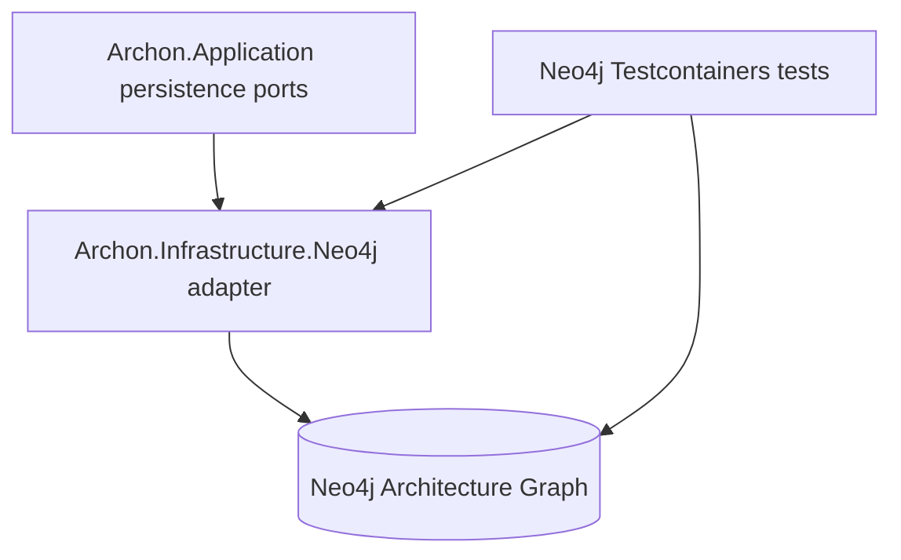
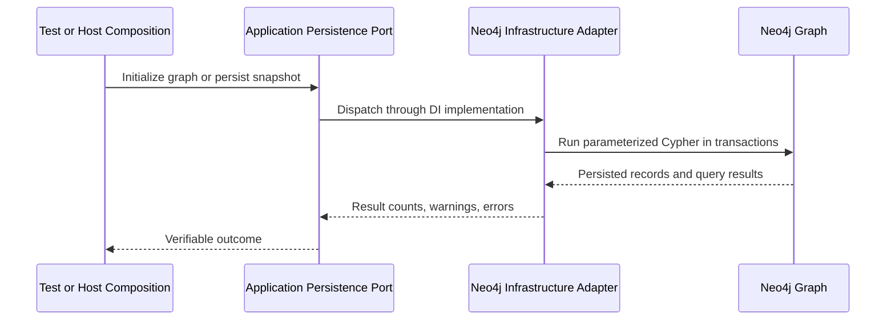

# Implementation Plan - WP003 Neo4j Persistence Foundation

## Document Control

| Field | Value |
| --- | --- |
| Work Package | WP003 - Neo4j Persistence Foundation |
| Target Output Path | `docs/003-Neo4j-Persistence-Foundation/plan-wp003-neo4j-persistence-foundation.md` |
| Source Specification | `docs/003-Neo4j-Persistence-Foundation/spec-wp003-neo4j-persistence-foundation.md` |
| Mandatory Wiki Guidance | `./.github/instructions/wiki.instructions.md` |
| Mandatory Documentation-Pass Guidance | `./.github/instructions/documentation-pass.instructions.md` |
| Status | Draft |

## Planning Principles

This plan translates the WP003 specification into sequential, runnable, and verifiable implementation work items. WP003 is a runtime persistence foundation package, so each vertical slice must produce a usable developer-facing or system-facing capability: validated Neo4j configuration and health probing, schema initialization against a real Neo4j Testcontainers instance, guarded graph recreation, minimal snapshot persistence, and then progressively richer persistence for evidence, relationships, rules, findings, metrics, and generated summaries.

Implementation must follow these repository standards as hard gates, not optional cleanup:

- `./.github/instructions/wiki.instructions.md` must be followed for every work item. Wiki review is mandatory for the work package, and wiki updates are required whenever developer-facing behavior, architecture, workflows, terminology, setup, runtime foundations, or contributor guidance changes or is materially clarified.
- `./.github/instructions/documentation-pass.instructions.md` must be followed for every work item that creates, updates, reviews, or plans source code. Code is not acceptable unless the documentation-pass standard is met for the code touched by that work item.
- Source code must follow the repository coding standards: Allman braces, block-scoped namespaces, no top-level statements, one public type per file, nullable reference types, underscore-prefixed private fields, and explicit documentation on public and non-public types, methods, constructors, and parameters.
- Developer-level comments are required for every class, method, and constructor, including internal and other non-public types. Public methods and constructors must document every parameter. Properties whose meaning is not obvious from their names must be commented. Sufficient inline or block comments must explain purpose, logical flow, and algorithms used.
- Active work-item execution must be uninterrupted. Once implementation starts for a work item, the executor must continue through implementation, validation, documentation/wiki review, and plan-record updates. The executor must not stop for status-only messages, ordinary fixable build/test failures, or confirmation prompts. The only allowed stops are full work-item completion, explicit user interruption or direction change, or a true blocker that cannot be resolved from the specification, this plan, codebase evidence, or repository guidance.
- Docker may always be assumed available for WP003. Required Neo4j Testcontainers integration tests must be implemented and run for the targeted real-database validation slices.
- Automated validation must not start the Aspire AppHost because it blocks the executing agent.
- WP003 must not implement API-triggered extraction orchestration, Roslyn extraction, query APIs, MCP tools/resources/prompts, markdown export, Discovery UI behavior, disk-backed rule loading from `./rules`, rule evaluation, data migration, or production API endpoints for destructive graph recreation.

## Overall Project Structure

WP003 implementation is expected to work primarily in the project structure created by WP001 and the domain/application contracts created by WP002:

```text
docs/
  003-Neo4j-Persistence-Foundation/
	spec-wp003-neo4j-persistence-foundation.md
	plan-wp003-neo4j-persistence-foundation.md
	implementation-notes-wp003.md

src/
  Archon.Application/
	Graph/
	  Persistence/
		IArchitectureGraphInitializer.cs
		IArchitectureSnapshotWriter.cs
		IArchitectureGraphRecreator.cs
		GraphInitializationResult.cs
		SnapshotPersistenceResult.cs
		PersistenceError.cs
		PersistenceStage.cs

  Archon.Infrastructure.Neo4j/
	Configuration/
	  Neo4jOptions.cs
	  Neo4jOptionsValidator.cs
	DependencyInjection/
	  Neo4jServiceCollectionExtensions.cs
	Health/
	  Neo4jHealthCheck.cs
	Schema/
	  Neo4jGraphInitializer.cs
	  Neo4jSchemaStatementCatalog.cs
	Recreation/
	  Neo4jGraphRecreator.cs
	Persistence/
	  Neo4jArchitectureSnapshotWriter.cs
	  Neo4jSnapshotPersistenceMapper.cs
	  Neo4jPersistenceStageLogger.cs
	Driver/
	  Neo4jDriverFactory.cs
	  INeo4jSessionProvider.cs

  ArchonApi/
	Program.cs or composition files touched only if needed for health-check or infrastructure registration

test/
  Archon.Application.Tests/
	Graph/
	  Persistence/

  Archon.Infrastructure.Neo4j.Tests/
	Configuration/
	Health/
	Schema/
	Recreation/
	Persistence/
	Testcontainers/
	  Neo4jContainerFixture.cs
	  Neo4jIntegrationTestBase.cs
```

The exact folder names may be adjusted to match existing repository conventions discovered during implementation, but the architectural placement must remain unchanged: Neo4j driver code belongs only in `Archon.Infrastructure.Neo4j`; domain contracts must remain free of infrastructure dependencies; application abstractions may define persistence ports and result contracts without exposing Neo4j driver types.

## Naming and Design Conventions

- Neo4j labels and relationship names must be stable and documented. Recommended labels are `ArchonRepository`, `ArchonSolution`, `ArchonSnapshot`, `ArchonNode`, `ArchonEvidence`, `ArchonRule`, `ArchonFinding`, `ArchonMetric`, and `ArchonGeneratedSummary` unless implementation evidence supports a better documented naming scheme.
- Constraint and index names must be stable, explicit, and operationally readable.
- Cypher must be parameterized. Dynamic labels or relationship types may only be produced from controlled, whitelisted values.
- Neo4j internal IDs must never be treated as logical identities in application contracts, persistence results, fingerprints, API-facing values, MCP-facing values, or documentation examples.
- Snapshot-scoped records must use stable keys and fingerprints from WP002 contracts.
- Evidence is deduplicated per snapshot, not across snapshots.
- Architecture relationships may be persisted directly as Neo4j relationships or through a relationship-node pattern. If relationship evidence or metadata cannot be represented safely through direct relationships, the implementation must choose and document the relationship-node pattern.
- Rule catalog persistence uses rule code plus version as upsert identity and allows multiple versions of the same rule code to coexist.
- Implementation notes must record design decisions, validation commands, Testcontainers behavior, wiki review outcome, and any intentionally out-of-scope capabilities.

## Work Items

## 1. Neo4j Configuration, Driver Lifecycle, and Health Probe Slice

- [x] Work Item 1: Implement validated Neo4j configuration, dependency injection, driver lifecycle, and a runnable health probe - Completed
  - **Completion Summary**: Implemented documented Neo4j options, validation, driver factory, session provider, dependency-injection registration, and a lightweight readiness health check in `src/Archon.Infrastructure.Neo4j`. Added unit and Testcontainers integration tests in `test/Archon.Infrastructure.Neo4j.Tests` for safe validation messages, registration, driver disposal ownership, and real Neo4j health probing. Validation passed with `dotnet build .\test\Archon.Infrastructure.Neo4j.Tests\Archon.Infrastructure.Neo4j.Tests.csproj --no-restore`, the required targeted options/health test filter, and the full Neo4j infrastructure test project. Documentation was recorded in `docs/003-Neo4j-Persistence-Foundation/implementation-notes-wp003.md`. Wiki review result: updated `wiki/home.md` to explain Neo4j configuration, secret handling, driver lifecycle, readiness semantics, and Testcontainers validation.
  - **Purpose**: Provide the smallest meaningful end-to-end Neo4j capability. A host or test can configure Neo4j, create the driver through dependency injection, execute a lightweight health query, and dispose resources safely without exposing secrets or requiring snapshot persistence.
  - **Acceptance Criteria**:
	- Strongly typed Neo4j options exist for URI, database name where applicable, username, password, timeout, retry behavior, and optional encryption mode.
	- Options validation rejects missing required values and does not expose secrets in failures.
	- Infrastructure dependency-injection registration creates and disposes Neo4j driver resources safely.
	- A Neo4j health check can execute a lightweight query against a real Neo4j Testcontainers instance.
	- Configuration supports Aspire-provided values without requiring the Aspire AppHost to run during tests.
  - **Definition of Done**:
	- Code implemented in `Archon.Infrastructure.Neo4j` and host composition touched only if required for registration.
	- Tests passing in `Archon.Infrastructure.Neo4j.Tests` for options validation, registration, disposal seams, and Testcontainers health-check success.
	- Source code complies with `./.github/instructions/documentation-pass.instructions.md` for every touched class, method, constructor, parameter, property, and internal helper.
	- Logging and error handling avoid Neo4j credential leakage.
	- Documentation or implementation notes define Neo4j driver, health check, configuration binding, secret handling, and why Aspire is not started during automated validation.
	- Wiki review is performed for setup/runtime-foundation impact; relevant wiki or repository guidance is updated, or an explicit no-change result is recorded.
	- Foundational documentation retains book-like narrative depth, defines technical terms, and includes setup or troubleshooting examples when materially useful.
	- Can execute end-to-end via: `dotnet test .\test\Archon.Infrastructure.Neo4j.Tests\Archon.Infrastructure.Neo4j.Tests.csproj --filter "FullyQualifiedName~Neo4jOptions|FullyQualifiedName~Neo4jHealth"`.
	- Executor must not stop mid-work-item; execution continues through implementation, validation, documentation/wiki review, and plan-record updates unless the work item is complete, the user explicitly interrupts, or a true blocker prevents further autonomous progress.
	- [x] Task 1: Inspect current application, infrastructure, host, and test project layout - Completed
	- [x] Confirm existing project references and namespace conventions. Completed: confirmed skeletal `Archon.Infrastructure.Neo4j` and test projects use block-scoped `Archon.Infrastructure.Neo4j` namespaces and that `ArchonApi` already references Neo4j infrastructure.
	- [x] Confirm package reference organization in `Archon.Infrastructure.Neo4j.csproj` and test project files. Completed: package and project references remain in separate item groups.
	- [x] Confirm existing service-defaults and host composition patterns before adding infrastructure registration. Completed: service defaults own shared probes; Neo4j registration was added as an infrastructure extension without changing host startup.
  - [x] Task 2: Add Neo4j driver and Testcontainers package references - Completed
	- [x] Add the official Neo4j .NET driver to `Archon.Infrastructure.Neo4j`. Completed: added `Neo4j.Driver` plus required Microsoft options/health dependencies.
	- [x] Add required Testcontainers packages to `Archon.Infrastructure.Neo4j.Tests`. Completed: added `Testcontainers.Neo4j` and test support packages.
	- [x] Keep `PackageReference` entries in item groups containing only package references. Completed: package references remain separated from project references.
  - [x] Task 3: Implement validated Neo4j options - Completed
	- [x] Create options and validator types with documentation comments. Completed: added `Neo4jOptions`, `Neo4jEncryptionMode`, and `Neo4jOptionsValidator` with required XML/developer documentation.
	- [x] Validate URI, username, password or secret value, database where required, timeout, and retry values. Completed: validator checks Bolt-compatible URI, database, username, password, positive connection timeout, positive transaction retry time, and supported encryption mode.
	- [x] Ensure validation messages do not include secrets. Completed: validation messages include only safe setting names and structural guidance.
  - [x] Task 4: Implement driver factory and session provider - Completed
	- [x] Create a factory for the official driver. Completed: added `INeo4jDriverFactory` and `Neo4jDriverFactory` using the official driver.
	- [x] Create a session provider or equivalent abstraction that hides driver lifecycle details from higher-level components. Completed: added `INeo4jSessionProvider` and `Neo4jSessionProvider` for configured database sessions.
	- [x] Add logging through `ILogger` abstractions without logging credentials. Completed: lifecycle logging uses scheme, host, database, and access mode only.
  - [x] Task 5: Implement dependency-injection registration - Completed
	- [x] Add `IServiceCollection` registration extensions in infrastructure. Completed: added `AddArchonNeo4j` in the dependency-injection folder.
	- [x] Bind options from configuration. Completed: registration binds from the `Neo4j` configuration section and validates on start.
	- [x] Register the driver/session provider and health check. Completed: registered factory, singleton `IDriver`, session provider, concrete health check, and health-check registration named `neo4j`.
  - [x] Task 6: Implement Neo4j health check - Completed
	- [x] Execute a lightweight parameterized query such as `RETURN 1`. Completed: health check executes the constant lightweight query `RETURN 1 AS healthy`.
	- [x] Distinguish configuration, authentication, network, and query failures where practical. Completed: health check maps options validation, authentication, service availability, and other Neo4j exceptions to credential-safe categories.
	- [x] Return health details without credentials. Completed: health data exposes only a coarse `failureKind` value.
  - [x] Task 7: Implement unit and Testcontainers tests - Completed
	- [x] Test options validation failures and safe messages. Completed: validation tests cover successful configuration, missing/invalid values, missing password, unsupported encryption, and absence of secret leakage.
	- [x] Test registration using in-memory configuration. Completed: registration tests bind in-memory settings, verify health-check registration, and prove driver disposal ownership through a factory seam.
	- [x] Test the health check against a Neo4j Testcontainers database. Completed: integration test starts a real Neo4j container and asserts `Neo4jHealthCheck` returns healthy.
	- [x] Ensure tests do not start Aspire AppHost. Completed: tests use in-memory configuration and Testcontainers directly.
  - [x] Task 8: Update implementation notes and wiki review result - Completed
	- [x] Create or update `docs/003-Neo4j-Persistence-Foundation/implementation-notes-wp003.md`. Completed: created implementation notes for Work Item 1.
	- [x] Record configuration, driver lifecycle, health-check, and Testcontainers decisions. Completed: implementation notes define the options model, driver/session lifecycle, health query, secret handling, and AppHost-free Testcontainers validation.
	- [x] Record wiki pages updated or a grounded no-change rationale. Completed: recorded that `wiki/home.md` was reviewed and updated for Neo4j runtime-foundation guidance.
  - **Files**:
	- `src/Archon.Infrastructure.Neo4j/Configuration/*.cs`: Neo4j options and validation.
	- `src/Archon.Infrastructure.Neo4j/Driver/*.cs`: Driver and session lifecycle.
	- `src/Archon.Infrastructure.Neo4j/DependencyInjection/*.cs`: Service registration.
	- `src/Archon.Infrastructure.Neo4j/Health/*.cs`: Health check.
	- `test/Archon.Infrastructure.Neo4j.Tests/**/*.cs`: Unit and Testcontainers health tests.
	- `docs/003-Neo4j-Persistence-Foundation/implementation-notes-wp003.md`: Implementation record and wiki outcome.
  - **Work Item Dependencies**: WP001 project skeleton exists.
  - **Run / Verification Instructions**:
	- `dotnet test .\test\Archon.Infrastructure.Neo4j.Tests\Archon.Infrastructure.Neo4j.Tests.csproj --filter "FullyQualifiedName~Neo4jOptions|FullyQualifiedName~Neo4jHealth"`
  - **User Instructions**:
	- Docker must be running because WP003 assumes Docker is available for Testcontainers validation.

## 2. Graph Schema Initialization Slice

- [x] Work Item 2: Implement idempotent graph constraints and indexes with real Neo4j verification - Completed
  - **Completion Summary**: Added application-layer graph initialization contracts in `src/Archon.Application/Graph/Persistence` without Neo4j driver types, implemented stable schema names, idempotent schema statement catalog, and `Neo4jGraphInitializer` in `src/Archon.Infrastructure.Neo4j/Schema`, and registered the initializer through `AddArchonNeo4j`. The schema uses stable `archon_` constraint/index names and the relationship-node pattern through `ArchonRelationship` so architecture edges can later carry stable keys, fingerprints, metadata, and evidence links. Added application result tests, schema name/catalog tests, and a real Neo4j Testcontainers initialization test that runs twice and verifies metadata with `SHOW CONSTRAINTS` and `SHOW INDEXES`. Validation passed with the required `GraphSchema|GraphInitialization` filter. Documentation was recorded in `docs/003-Neo4j-Persistence-Foundation/implementation-notes-wp003.md`. Wiki review result: updated `wiki/home.md` with graph schema, constraint, index, idempotence, stable-name, relationship-node, and Testcontainers guidance.
  - **Purpose**: Make a clean Neo4j database become an Archon architecture graph store. This slice gives developers a runnable initialization path that creates stable constraints and indexes before any snapshot data is written.
  - **Acceptance Criteria**:
	- Application-layer graph initialization abstraction and result contracts exist without Neo4j driver types.
	- Neo4j schema initializer creates required constraints and indexes idempotently.
	- Constraint and index names are stable and documented.
	- Real Neo4j Testcontainers tests prove schema creation for repositories, solutions, snapshots, architecture nodes, architecture relationships where applicable, evidence, rules, findings, metrics, generated summaries, stable keys, snapshot scopes, and fingerprints.
  - **Definition of Done**:
	- Code implemented in `Archon.Application` for ports/result contracts and `Archon.Infrastructure.Neo4j` for Neo4j implementation.
	- Tests passing for schema statement catalog, idempotent initialization, and real Neo4j schema introspection.
	- Source code complies with `./.github/instructions/documentation-pass.instructions.md`.
	- Logging and errors identify schema stages without exposing secrets.
	- Documentation or implementation notes define graph schema, constraint, index, stable constraint/index names, and operational troubleshooting meaning.
	- Wiki review is performed for architecture/runtime-foundation impact; relevant wiki or repository guidance is updated, or an explicit no-change result is recorded.
	- Can execute end-to-end via: `dotnet test .\test\Archon.Infrastructure.Neo4j.Tests\Archon.Infrastructure.Neo4j.Tests.csproj --filter "FullyQualifiedName~GraphSchema|FullyQualifiedName~GraphInitialization"`.
	- Executor must not stop mid-work-item; execution continues through implementation, validation, documentation/wiki review, and plan-record updates unless the work item is complete, the user explicitly interrupts, or a true blocker prevents further autonomous progress.
	- [x] Task 1: Add application-layer initialization abstractions - Completed
	- [x] Create `IArchitectureGraphInitializer` or equivalent. Completed: added `IArchitectureGraphInitializer` with asynchronous cancellation-aware initialization.
	- [x] Create result, warning, and error contracts without Neo4j types. Completed: added `GraphInitializationResult`, `PersistenceError`, `PersistenceWarning`, and `PersistenceStage` in `Archon.Application`.
	- [x] Support cancellation tokens for asynchronous initialization. Completed: application port and Neo4j implementation accept cancellation tokens.
  - [x] Task 2: Design and document schema names - Completed
	- [x] Define labels, relationship names, constraint names, and index names. Completed: added `Neo4jSchemaNames` with stable labels, reserved relationship names, properties, constraints, and indexes.
	- [x] Record direct relationship versus relationship-node modeling decision for architecture edges. Completed: selected the relationship-node pattern using `ArchonRelationship` and recorded rationale in implementation notes and wiki guidance.
	- [x] Ensure names are stable and suitable for operational troubleshooting. Completed: schema object names use explicit `archon_` prefixes and are tested.
  - [x] Task 3: Implement schema statement catalog - Completed
	- [x] Add idempotent Cypher for uniqueness constraints. Completed: added `CREATE CONSTRAINT ... IF NOT EXISTS` statements for global and snapshot-scoped uniqueness.
	- [x] Add idempotent Cypher for stable-key, snapshot-scope, kind, status, confidence, knowledge-kind, and fingerprint indexes. Completed: added `CREATE INDEX ... IF NOT EXISTS` statements for required lookup dimensions across all graph record categories.
	- [x] Parameterize where applicable and whitelist any controlled dynamic names. Completed: schema Cypher is built only from closed constants in `Neo4jSchemaNames`; no untrusted dynamic labels or relationship types are accepted.
  - [x] Task 4: Implement graph initializer - Completed
	- [x] Execute schema statements in a predictable order. Completed: `Neo4jGraphInitializer` executes the ordered catalog one statement at a time.
	- [x] Log stage-level progress through `ILogger`. Completed: initializer logs statement count, schema object kind, schema object name, completion, cancellation, and failures without credentials.
	- [x] Return counts, warnings, and errors through application result contracts. Completed: initializer returns `GraphInitializationResult` with completed statement counts and safe `PersistenceError` diagnostics.
  - [x] Task 5: Implement schema tests - Completed
	- [x] Unit test the schema catalog contains all required constraints and indexes. Completed: added GraphSchema catalog tests for required constraints, indexes, idempotence markers, and unique names.
	- [x] Use Neo4j Testcontainers to run initialization against a clean database. Completed: integration test starts a real Neo4j container through the existing Testcontainers fixture.
	- [x] Query Neo4j metadata to prove constraints and indexes exist. Completed: integration test queries `SHOW CONSTRAINTS` and `SHOW INDEXES` and asserts required schema names.
	- [x] Run initialization twice to prove idempotence. Completed: integration test runs `InitializeAsync` twice and verifies both calls succeed with full statement counts.
  - [x] Task 6: Update implementation notes and wiki review result - Completed
	- [x] Record schema labels, relationship patterns, constraints, indexes, and validation commands. Completed: appended Work Item 2 implementation notes with schema design and validation record.
	- [x] Include a narrative explanation of what constraints and indexes do for contributors new to Neo4j. Completed: updated implementation notes and `wiki/home.md` with explanatory prose.
	- [x] Record wiki pages updated or no-change rationale. Completed: recorded that `wiki/home.md` was reviewed and updated for Work Item 2 architecture/runtime-foundation impact.
  - **Files**:
	- `src/Archon.Application/Graph/Persistence/*.cs`: Initialization port and result contracts.
	- `src/Archon.Infrastructure.Neo4j/Schema/*.cs`: Schema catalog and initializer.
	- `test/Archon.Infrastructure.Neo4j.Tests/Schema/*.cs`: Unit and integration schema tests.
	- `docs/003-Neo4j-Persistence-Foundation/implementation-notes-wp003.md`: Schema decisions and wiki outcome.
  - **Work Item Dependencies**: Work Item 1.
  - **Run / Verification Instructions**:
	- `dotnet test .\test\Archon.Infrastructure.Neo4j.Tests\Archon.Infrastructure.Neo4j.Tests.csproj --filter "FullyQualifiedName~GraphSchema|FullyQualifiedName~GraphInitialization"`
  - **User Instructions**:
	- Docker must be running for real Neo4j Testcontainers validation.

## 3. Guarded Graph Recreation Slice

- [x] Work Item 3: Implement explicit destructive graph recreation for development and tests - Completed
  - **Completion Summary**: Added application-layer guarded recreation contracts in `src/Archon.Application/Graph/Persistence`, implemented `Neo4jGraphRecreator` in `src/Archon.Infrastructure.Neo4j/Recreation`, and registered `IArchitectureGraphRecreator` through `AddArchonNeo4j` without adding any API endpoint or startup hook. Recreation requires the exact destructive confirmation phrase `DELETE ARCHON GRAPH DATA AND RECREATE SCHEMA`, deletes only Archon-owned labels from the closed schema catalog, and re-runs schema initialization afterward. Added application contract tests plus real Neo4j Testcontainers tests that prove unauthorized requests leave data intact, authorized recreation clears seeded Archon records, and constraints/indexes remain present. Validation passed with targeted application and infrastructure builds plus the required `FullyQualifiedName~GraphRecreation` test filters. Documentation was recorded in `docs/003-Neo4j-Persistence-Foundation/implementation-notes-wp003.md`. Wiki review result: updated `wiki/home.md` with guarded graph recreation semantics, the exact confirmation phrase, Archon-owned label scope, local/test usage, migration warning, no-production-endpoint guidance, and the Testcontainers validation command.
  - **Purpose**: Provide a safe, explicitly named way to clear and recreate the Archon graph for development and automated integration tests. This creates an executable reset path while ensuring destructive behavior cannot be reached accidentally through ordinary persistence or host startup.
  - **Acceptance Criteria**:
	- Application-layer graph recreation abstraction exists without Neo4j driver types.
	- Neo4j graph recreation is explicitly destructive and guarded by method naming, options, or test-only seams.
	- Recreation clears Archon graph data and recreates required constraints and indexes.
	- No production API endpoint exposes graph recreation in WP003.
	- Real Neo4j Testcontainers tests prove recreation clears data and leaves schema initialized.
  - **Definition of Done**:
	- Code implemented in `Archon.Application` for the port/result contract and `Archon.Infrastructure.Neo4j` for implementation.
	- Tests passing for guard behavior, real graph clearing, and post-recreation schema presence.
	- Source code complies with `./.github/instructions/documentation-pass.instructions.md`.
	- Logging clearly marks destructive recreation without exposing secrets.
	- Documentation or implementation notes clearly define graph recreation, why it is destructive, and why it is not a migration mechanism.
	- Wiki review is performed for setup/workflow impact; relevant wiki or repository guidance is updated, or an explicit no-change result is recorded.
	- Can execute end-to-end via: `dotnet test .\test\Archon.Infrastructure.Neo4j.Tests\Archon.Infrastructure.Neo4j.Tests.csproj --filter FullyQualifiedName~GraphRecreation`.
	- Executor must not stop mid-work-item; execution continues through implementation, validation, documentation/wiki review, and plan-record updates unless the work item is complete, the user explicitly interrupts, or a true blocker prevents further autonomous progress.
	- [x] Task 1: Add graph recreation application contract - Completed
	- [x] Create `IArchitectureGraphRecreator` or equivalent. Completed: added `IArchitectureGraphRecreator` with asynchronous cancellation-aware recreation using infrastructure-neutral request/result contracts.
	- [x] Create result contracts that make destructive behavior explicit. Completed: added `GraphRecreationRequest` with the exact destructive confirmation phrase and `GraphRecreationResult` with authorization, deletion count, schema count, warning, and error details.
	- [x] Support cancellation tokens. Completed: the application port and Neo4j implementation accept cancellation tokens and return a safe cancellation failure result.
  - [x] Task 2: Implement Neo4j recreation guard - Completed
	- [x] Require an explicit destructive option, token, method name, or test-only path. Completed: recreation requires `GraphRecreationRequest.RequiredConfirmationPhrase` exactly before opening a write session.
	- [x] Prevent ordinary initialization and snapshot persistence from invoking recreation accidentally. Completed: graph initialization remains separate, no snapshot writer path exists in this slice, and the guard prevents accidental DI-based invocation from clearing data.
	- [x] Ensure no API endpoint is added. Completed: no host or API project was modified; recreation is only an application port implemented by Neo4j infrastructure.
  - [x] Task 3: Implement graph clearing and schema recreation - Completed
	- [x] Delete Archon-owned graph records safely. Completed: `Neo4jGraphRecreator` deletes distinct nodes carrying whitelisted Archon labels from `Neo4jSchemaNames` using parameterized Cypher and `DETACH DELETE`.
	- [x] Re-run schema initialization after clearing. Completed: authorized recreation delegates to `IArchitectureGraphInitializer` after data clearing so constraints and indexes remain present.
	- [x] Return counts, warnings, and errors. Completed: recreation results include deleted-record counts, schema statement counts, warnings, and credential-safe persistence errors.
  - [x] Task 4: Implement recreation tests - Completed
	- [x] Persist representative records into Neo4j. Completed: integration tests seed repository, snapshot, node, evidence, and supporting relationship records in a real Neo4j Testcontainers database.
	- [x] Invoke recreation explicitly. Completed: authorized tests call `GraphRecreationRequest.CreateAuthorized` and unguarded tests call a near-miss request.
	- [x] Verify records are cleared and constraints/indexes remain present. Completed: integration tests assert zero remaining Archon-owned nodes and verify representative constraint/index names with Neo4j metadata.
	- [x] Verify unguarded or ordinary paths cannot recreate the graph. Completed: integration tests assert unauthorized recreation returns `GraphRecreationNotAuthorized` and leaves seeded data intact.
  - [x] Task 5: Update implementation notes and wiki review result - Completed
	- [x] Record destructive semantics and validation commands. Completed: appended Work Item 3 implementation notes with guard, clearing, schema recreation, and validation command details.
	- [x] Include contributor-facing explanation of safe local/test use. Completed: updated `wiki/home.md` to explain guarded local/test recreation, destructive semantics, and why recreation is not migration.
	- [x] Record wiki pages updated or no-change rationale. Completed: recorded that `wiki/home.md` was reviewed and updated for Work Item 3 setup/workflow impact.
  - **Files**:
	- `src/Archon.Application/Graph/Persistence/*.cs`: Recreation port and result contracts.
	- `src/Archon.Infrastructure.Neo4j/Recreation/*.cs`: Recreation implementation.
	- `test/Archon.Infrastructure.Neo4j.Tests/Recreation/*.cs`: Recreation tests.
	- `docs/003-Neo4j-Persistence-Foundation/implementation-notes-wp003.md`: Recreation decisions and wiki outcome.
  - **Work Item Dependencies**: Work Items 1 and 2.
  - **Run / Verification Instructions**:
	- `dotnet test .\test\Archon.Infrastructure.Neo4j.Tests\Archon.Infrastructure.Neo4j.Tests.csproj --filter FullyQualifiedName~GraphRecreation`
  - **User Instructions**:
	- Docker must be running for real Neo4j Testcontainers validation.

## 4. Minimal Snapshot Persistence Slice

- [x] Work Item 4: Persist repository, solution, snapshot, architecture node, and evidence records end to end - Completed
  - **Completion Summary**: Added the application-layer `IArchitectureSnapshotWriter`, `SnapshotPersistenceResult`, and `SnapshotPersistenceCounts` contracts in `src/Archon.Application/Graph/Persistence`. Implemented `Neo4jSnapshotPersistenceMapper`, `Neo4jPersistenceStageLogger`, and `Neo4jArchitectureSnapshotWriter` in `src/Archon.Infrastructure.Neo4j/Persistence`, then registered the writer through `AddArchonNeo4j`. The writer validates minimal snapshot structure, initializes schema before writing, persists repositories, solutions, snapshot headers, architecture nodes, canonical evidence nodes, `INCLUDES_SOLUTION` relationships, and `SUPPORTED_BY_EVIDENCE` relationships in one Neo4j write transaction, uses stable-key merge semantics, deduplicates evidence per snapshot, and returns explicit safe errors for missing references. Added application result tests, mapper unit tests, dependency-injection coverage, and real Neo4j Testcontainers integration tests for representative minimal snapshot persistence, evidence deduplication, identical evidence across snapshots, stable-key/fingerprint lookup, and missing evidence reference failure. Validation passed with targeted application and infrastructure builds plus the required `SnapshotPersistence` and `MinimalSnapshot|EvidenceDeduplication` filters. Documentation was recorded in `docs/003-Neo4j-Persistence-Foundation/implementation-notes-wp003.md`. Wiki review result: updated `wiki/home.md` with minimal snapshot persistence semantics, persistence ordering, stable-key identity, metadata JSON boundaries, evidence deduplication, validation commands, and current out-of-scope persistence sections.
  - **Purpose**: Provide the first complete snapshot-writing path into Neo4j. A representative snapshot containing repository, solution, snapshot header, architecture nodes, and evidence can be persisted and queried back through integration tests.
  - **Acceptance Criteria**:
	- Application-layer snapshot writer abstraction and persistence result contracts exist without Neo4j driver types.
	- Neo4j snapshot writer persists repositories, solutions, snapshot records, architecture nodes, and evidence nodes with required normalized properties.
	- Snapshot-to-solution and node-to-evidence supporting relationships are created.
	- Evidence is deduplicated within a snapshot.
	- Stable keys and fingerprints are queryable through indexed properties.
	- Missing required references produce explicit persistence errors or warnings rather than silent drops.
  - **Definition of Done**:
	- Code implemented in application ports/results and Neo4j infrastructure writer/mapper.
	- Tests passing for mapping, persistence result counts, minimal snapshot persistence, evidence deduplication, and missing reference handling.
	- Source code complies with `./.github/instructions/documentation-pass.instructions.md`.
	- Persistence operations log stage-level progress and failure context through `ILogger` without logging secrets or excessive payloads.
	- Documentation or implementation notes explain snapshot, architecture node, evidence node, deduplication, stable key, fingerprint, and persistence ordering.
	- Wiki review is performed for architecture/runtime-foundation terminology; relevant wiki or repository guidance is updated, or an explicit no-change result is recorded.
	- Can execute end-to-end via: `dotnet test .\test\Archon.Infrastructure.Neo4j.Tests\Archon.Infrastructure.Neo4j.Tests.csproj --filter "FullyQualifiedName~MinimalSnapshot|FullyQualifiedName~EvidenceDeduplication"`.
	- Executor must not stop mid-work-item; execution continues through implementation, validation, documentation/wiki review, and plan-record updates unless the work item is complete, the user explicitly interrupts, or a true blocker prevents further autonomous progress.
	- [x] Task 1: Add snapshot writer application contract - Completed
	- [x] Create `IArchitectureSnapshotWriter` or equivalent. Completed: added `IArchitectureSnapshotWriter` with cancellation-aware `WriteSnapshotAsync` accepting `ExtractedArchitectureSnapshot`.
	- [x] Create `SnapshotPersistenceResult`, persisted-count, warning, and error contracts. Completed: added `SnapshotPersistenceResult` and `SnapshotPersistenceCounts` using existing `PersistenceWarning` and `PersistenceError` diagnostics.
	- [x] Include persistence stage and stable-key context in errors where available. Completed: results carry snapshot stable key when known and errors use `PersistenceStage.SnapshotPersistence` or schema initialization context.
  - [x] Task 2: Implement mapping helpers - Completed
	- [x] Map repository contract properties to Neo4j parameters. Completed: `Neo4jSnapshotPersistenceMapper.MapRepository` maps stable key, name, root path, remote URL, default branch, and metadata JSON.
	- [x] Map solution contract properties to Neo4j parameters. Completed: mapper includes repository stable key, solution stable key, name, path, and metadata JSON.
	- [x] Map snapshot header properties to Neo4j parameters. Completed: mapper includes stable keys, branch, commit, UTC timestamps, extraction version, status, warnings JSON, errors JSON, and metadata JSON.
	- [x] Map architecture node properties to Neo4j parameters. Completed: mapper preserves snapshot scope, stable key, node kind, names, language, project/parent keys, knowledge, ownership, external category, confidence, unknown state, primary evidence key, metadata JSON, and fingerprint.
	- [x] Map evidence properties to Neo4j parameters. Completed: mapper preserves snapshot scope, stable key, evidence kind, file path, line range, symbols, snippet fields, knowledge, confidence, unknown state, metadata JSON, and fingerprint.
	- [x] Serialize metadata deterministically. Completed: mapper uses `GraphMetadata.ToCanonicalJson()` and deterministic JSON arrays for snapshot warnings/errors.
  - [x] Task 3: Implement minimal snapshot write workflow - Completed
	- [x] Initialize or verify schema before writing where appropriate. Completed: writer invokes `IArchitectureGraphInitializer.InitializeAsync` before opening the data write transaction.
	- [x] Persist repositories and solutions. Completed: writer merges repository and solution nodes by stable key.
	- [x] Persist snapshot header. Completed: writer merges `ArchonSnapshot` by stable key with normalized snapshot properties.
	- [x] Persist architecture nodes. Completed: writer merges `ArchonNode` records by snapshot stable key plus node stable key.
	- [x] Persist deduplicated evidence. Completed: writer canonicalizes equivalent evidence within a snapshot and persists only canonical `ArchonEvidence` nodes.
	- [x] Create snapshot-to-solution relationships. Completed: writer creates `INCLUDES_SOLUTION` relationships from snapshots to included solutions.
	- [x] Create node-to-evidence relationships. Completed: writer creates `SUPPORTED_BY_EVIDENCE` relationships from nodes to canonical primary evidence records.
  - [x] Task 4: Implement transaction and failure behavior - Completed
	- [x] Use Neo4j transaction boundaries to prevent completed status for partially persisted snapshots. Completed: minimal graph writes execute inside one Neo4j write transaction and failures return unsuccessful results.
	- [x] Return explicit errors for missing references or invalid snapshot structure. Completed: validation returns stable errors such as `MissingSnapshotHeader`, `MissingRepositoryReference`, `MissingSolutionRepositoryReference`, `MismatchedSnapshotScope`, and `MissingNodeEvidenceReference`.
	- [x] Ensure retry-safe merge behavior uses stable keys. Completed: Cypher uses `MERGE` on global stable keys or snapshot-scoped stable keys rather than Neo4j internal IDs.
  - [x] Task 5: Implement tests - Completed
	- [x] Unit test mapping for all minimal record types. Completed: mapper tests cover repository, solution, snapshot, architecture node, evidence, and deduplication-key mapping.
	- [x] Integration test persistence of one representative minimal snapshot. Completed: real Neo4j Testcontainers test persists a minimal snapshot and verifies graph counts and fingerprint lookup.
	- [x] Integration test evidence deduplication within one snapshot. Completed: integration test writes duplicate evidence payloads and verifies one evidence node with two node-evidence relationships.
	- [x] Integration test identical evidence across different snapshots is not incorrectly merged. Completed: integration test writes equivalent evidence in two snapshots and verifies two evidence records remain.
	- [x] Integration test stable-key and fingerprint lookup. Completed: integration test queries an `ArchonNode` by snapshot stable key and node stable key and verifies the persisted fingerprint.
  - [x] Task 6: Update implementation notes and wiki review result - Completed
	- [x] Record persistence ordering, deduplication, and validation commands. Completed: appended Work Item 4 implementation notes with ordering, deduplication, validation, and Testcontainers details.
	- [x] Include a narrative walkthrough of writing a minimal snapshot. Completed: implementation notes and `wiki/home.md` explain the minimal write sequence and reasoning in developed prose.
	- [x] Record wiki pages updated or no-change rationale. Completed: recorded that `wiki/home.md` was reviewed and updated for Work Item 4 architecture/runtime-foundation impact.
  - **Files**:
	- `src/Archon.Application/Graph/Persistence/*.cs`: Snapshot writer port and result contracts.
	- `src/Archon.Infrastructure.Neo4j/Persistence/*.cs`: Writer, mapper, and stage logging.
	- `test/Archon.Infrastructure.Neo4j.Tests/Persistence/*.cs`: Minimal persistence tests.
	- `docs/003-Neo4j-Persistence-Foundation/implementation-notes-wp003.md`: Persistence decisions and wiki outcome.
  - **Work Item Dependencies**: Work Items 1 through 3; WP002 graph fact contracts.
  - **Run / Verification Instructions**:
	- `dotnet test .\test\Archon.Infrastructure.Neo4j.Tests\Archon.Infrastructure.Neo4j.Tests.csproj --filter "FullyQualifiedName~MinimalSnapshot|FullyQualifiedName~EvidenceDeduplication"`
  - **User Instructions**:
	- Docker must be running for real Neo4j Testcontainers validation.

## 5. Architecture Relationship Persistence Slice

- [x] Work Item 5: Persist architecture relationships with metadata, fingerprints, and evidence links - Completed
  - **Completion Summary**: Extended snapshot persistence to write architecture edges as `ArchonRelationship` nodes using the relationship-node pattern, preserving stable key, edge kind, source and target stable keys, directness, knowledge kind, confidence, unknown-state fields, metadata JSON, primary evidence stable key, and fingerprint. Added relationship validation for missing source nodes, missing target nodes, missing edge evidence, and mismatched snapshot scope. The writer now creates `RELATIONSHIP_SOURCE`, `RELATIONSHIP_TARGET`, and relationship `SUPPORTED_BY_EVIDENCE` links with snapshot-scoped stable-key merge semantics and reports relationship counts in `SnapshotPersistenceCounts`. Added mapper tests and real Neo4j Testcontainers integration tests for mixed edge kinds, same-endpoint relationships, edge evidence links, traversal queryability, and missing reference failures. Validation passed after a clean with targeted Neo4j infrastructure build and the required relationship filters. Documentation was recorded in `docs/003-Neo4j-Persistence-Foundation/implementation-notes-wp003.md`. Wiki review result: updated `wiki/home.md` to explain active architecture relationship persistence, the relationship-node pattern, endpoint links, edge evidence links, traversal examples, validation commands, and remaining out-of-scope sections.
  - **Purpose**: Extend the snapshot writer from nodes and evidence to graph relationships. This makes the stored model graph-shaped rather than only node-shaped and proves traversal-ready relationship persistence.
  - **Acceptance Criteria**:
	- Architecture edges are persisted with stable key, edge kind, source stable key, target stable key, directness, knowledge kind, confidence, unknown-state fields, metadata, primary evidence, and fingerprint.
	- Multiple relationships between the same source and target are supported when stable key or edge kind differs.
	- Edge-to-evidence supporting relationships are created using the documented direct relationship or relationship-node model.
	- Relationship persistence supports all WP002 edge kinds without schema redesign.
	- Missing source nodes, target nodes, or evidence references produce explicit errors or warnings.
  - **Definition of Done**:
	- Code implemented in the Neo4j snapshot writer and mapping layer.
	- Tests passing for relationship mapping, mixed edge kinds, multiple same-endpoint relationships, relationship evidence links, traversal queryability, and missing reference failures.
	- Source code complies with `./.github/instructions/documentation-pass.instructions.md`.
	- Logging identifies relationship persistence stages without secrets or excessive payloads.
	- Documentation or implementation notes explain architecture relationship, relationship-node pattern if used, edge evidence, and traversal implications.
	- Wiki review is performed for architecture terminology and graph model impact; relevant wiki or repository guidance is updated, or an explicit no-change result is recorded.
	- Can execute end-to-end via: `dotnet test .\test\Archon.Infrastructure.Neo4j.Tests\Archon.Infrastructure.Neo4j.Tests.csproj --filter "FullyQualifiedName~ArchitectureRelationship|FullyQualifiedName~EdgeEvidence"`.
	- Executor must not stop mid-work-item; execution continues through implementation, validation, documentation/wiki review, and plan-record updates unless the work item is complete, the user explicitly interrupts, or a true blocker prevents further autonomous progress.
	- [x] Task 1: Finalize relationship modeling choice - Completed
	- [x] Confirm whether direct Neo4j relationships are sufficient for metadata, stable keys, fingerprints, and evidence linkage. Completed: direct Neo4j relationships are not sufficient for Archon edge evidence linkage because a relationship cannot link to evidence as a first-class graph fact.
	- [x] If direct relationships cannot link cleanly to evidence, implement a relationship-node pattern. Completed: architecture edges persist as `ArchonRelationship` nodes with `RELATIONSHIP_SOURCE`, `RELATIONSHIP_TARGET`, and `SUPPORTED_BY_EVIDENCE` links.
	- [x] Document the choice in implementation notes. Completed: Work Item 5 notes explain the relationship-node pattern and why it is required for evidence-backed edges.
  - [x] Task 2: Implement edge mapping - Completed
	- [x] Map all required edge properties to Cypher parameters. Completed: `Neo4jSnapshotPersistenceMapper.MapRelationship` maps snapshot scope, stable key, edge kind, endpoints, directness, knowledge, confidence, unknown state, primary evidence, metadata JSON, and fingerprint.
	- [x] Whitelist edge kinds if dynamic relationship types are used. Completed: dynamic relationship types are not used; all edge kinds are stored as the controlled `edgeKind` property on `ArchonRelationship` nodes.
	- [x] Preserve metadata and fingerprint fields. Completed: metadata is serialized deterministically and fingerprint is persisted as a first-class property.
  - [x] Task 3: Implement relationship write workflow - Completed
	- [x] Validate source and target nodes exist in the snapshot. Completed: validation returns explicit missing source and missing target errors before opening the transaction.
	- [x] Persist relationships using stable-key merge semantics. Completed: `MERGE` uses snapshot stable key plus relationship stable key for `ArchonRelationship` nodes.
	- [x] Create primary and supporting evidence links. Completed: relationship primary evidence is remapped through canonical evidence deduplication and linked through `SUPPORTED_BY_EVIDENCE`.
  - [x] Task 4: Implement relationship tests - Completed
	- [x] Persist mixed edge kinds. Completed: integration tests persist `REFERENCES` and `USES_PACKAGE` relationship facts.
	- [x] Persist multiple relationships between the same nodes. Completed: integration tests verify same source/target relationship facts remain distinct.
	- [x] Verify edge evidence is queryable. Completed: integration tests count relationship evidence links and verify traversal-ready relationship shape.
	- [x] Verify missing references produce explicit failures. Completed: integration tests cover missing source node, missing target node, and missing relationship evidence errors.
  - [x] Task 5: Update implementation notes and wiki review result - Completed
	- [x] Record relationship modeling, traversal examples, and validation commands. Completed: implementation notes and `wiki/home.md` describe relationship-node modeling, traversal, and commands.
	- [x] Record wiki pages updated or no-change rationale. Completed: recorded that `wiki/home.md` was reviewed and updated for graph model and contributor-facing persistence impact.
  - **Files**:
	- `src/Archon.Infrastructure.Neo4j/Persistence/*.cs`: Relationship mapping and write workflow.
	- `test/Archon.Infrastructure.Neo4j.Tests/Persistence/*.cs`: Relationship persistence tests.
	- `docs/003-Neo4j-Persistence-Foundation/implementation-notes-wp003.md`: Relationship decisions and wiki outcome.
  - **Work Item Dependencies**: Work Item 4.
  - **Run / Verification Instructions**:
	- `dotnet test .\test\Archon.Infrastructure.Neo4j.Tests\Archon.Infrastructure.Neo4j.Tests.csproj --filter "FullyQualifiedName~ArchitectureRelationship|FullyQualifiedName~EdgeEvidence"`
  - **User Instructions**:
	- Docker must be running for real Neo4j Testcontainers validation.

## 6. Rules and Findings Persistence Slice

- [x] Work Item 6: Persist rule catalog versions and snapshot findings with rule, node, and evidence links - Completed
  - **Completion Summary**: Extended `ExtractedArchitectureSnapshot` and `ArchitectureSnapshotAccumulator` to carry versioned `RuleDefinition` records by rule code plus version. Added `Neo4jSnapshotPersistenceMapper.MapRule` and `MapFinding`, extended `Neo4jArchitectureSnapshotWriter` with rule/finding validation, global `ArchonRule` upserts by `(ruleCode, ruleVersion)`, snapshot-scoped `ArchonFinding` writes by `(snapshotStableKey, stableKey)`, `CLASSIFIED_BY_RULE`, `PRIMARY_NODE`, and `SUPPORTED_BY_EVIDENCE` links, canonical evidence remapping for finding evidence, and rule/finding persistence result counts. Added schema-name coverage for the finding primary-node relationship and mapper/integration tests for rule upsert identity, multiple rule versions, finding properties, finding-to-rule links, finding-to-node links, finding-to-evidence links, missing reference errors, and counts. Validation passed after cleaning and rebuilding `test/Archon.Infrastructure.Neo4j.Tests`, then running the required `RuleCatalog|FindingPersistence` filter and the expanded mapper/rule/finding filter. Documentation was recorded in `docs/003-Neo4j-Persistence-Foundation/implementation-notes-wp003.md`. Wiki review result: updated `wiki/home.md` to explain global rule catalog nodes, rule code plus version identity, snapshot-scoped findings, severity/status/suppression fields, finding support links, validation commands, and remaining out-of-scope behavior.
  - **Purpose**: Add durable rule and finding storage so later hotlist, suppression, query, MCP, markdown, and historical comparison packages can rely on versioned finding data. This slice persists rule contracts supplied to it but does not implement disk-backed rule loading or rule evaluation.
  - **Acceptance Criteria**:
	- Rule catalog nodes are global, not snapshot-scoped copies.
	- Rule upsert identity is rule code plus version.
	- Multiple versions of the same rule code can coexist.
	- Findings persist all required properties and link to rule versions, primary nodes, and evidence.
	- Historical rule or finding data is not destructively deleted when a newer rule version exists.
  - **Definition of Done**:
	- Code implemented in the Neo4j snapshot writer and mapping layer.
	- Tests passing for rule upsert, multiple rule versions, finding persistence, finding-to-rule links, finding-to-node links, finding-to-evidence links, and persistence result counts.
	- Source code complies with `./.github/instructions/documentation-pass.instructions.md`.
	- Logging identifies rule/finding persistence stages without secrets or excessive payloads.
	- Documentation or implementation notes explain rule catalog, rule code, rule version, finding, severity, status, suppression fields, and historical fidelity.
	- Wiki review is performed for terminology and architecture impact; relevant wiki or repository guidance is updated, or an explicit no-change result is recorded.
	- Can execute end-to-end via: `dotnet test .\test\Archon.Infrastructure.Neo4j.Tests\Archon.Infrastructure.Neo4j.Tests.csproj --filter "FullyQualifiedName~RuleCatalog|FullyQualifiedName~FindingPersistence"`.
	- Executor must not stop mid-work-item; execution continues through implementation, validation, documentation/wiki review, and plan-record updates unless the work item is complete, the user explicitly interrupts, or a true blocker prevents further autonomous progress.
	- [x] Task 1: Implement rule mapping and upsert - Completed
	- [x] Map rule code, version, name, category, severity, enabled status, default status, definition JSON, source URLs, built-in flag, owner scope, and metadata. Completed: `Neo4jSnapshotPersistenceMapper.MapRule` maps rule catalog properties, including deterministic source URL JSON and metadata JSON.
	- [x] Upsert by rule code plus version. Completed: `Neo4jArchitectureSnapshotWriter` merges `ArchonRule` nodes by `ruleCode` and `ruleVersion`.
	- [x] Preserve multiple versions of the same rule code. Completed: schema constraint and writer merge identity allow `ARCHON001` version `1.0.0` and `2.0.0` to coexist.
  - [x] Task 2: Implement finding mapping and persistence - Completed
	- [x] Map finding stable key, rule code, rule version, severity, status, title, description, knowledge kind, confidence, suppression fields, metadata, and fingerprint. Completed: `MapFinding` preserves the required normalized finding fields plus unknown-state, primary-node, primary-evidence, first/latest seen, suppression, metadata, and fingerprint values.
	- [x] Persist findings as snapshot-scoped records. Completed: findings merge as `ArchonFinding` nodes by snapshot stable key plus finding stable key.
  - [x] Task 3: Implement finding relationships - Completed
	- [x] Link findings to rule versions. Completed: writer creates `CLASSIFIED_BY_RULE` links to matching `ArchonRule` nodes.
	- [x] Link findings to primary nodes where supplied. Completed: writer creates `PRIMARY_NODE` links to snapshot-scoped `ArchonNode` records when a finding supplies a primary node.
	- [x] Link findings to all supporting evidence. Completed: writer creates `SUPPORTED_BY_EVIDENCE` links from findings to canonical evidence for supplied primary evidence.
  - [x] Task 4: Implement rules and findings tests - Completed
	- [x] Verify rule upsert identity. Completed: integration test writes the same rule version through two snapshots and verifies one global rule node remains.
	- [x] Verify multiple versions coexist. Completed: integration test writes two versions of the same rule code and verifies both persist.
	- [x] Verify finding properties and links. Completed: integration test verifies finding properties, counts, rule links, node links, and evidence links.
	- [x] Verify missing referenced rules, nodes, or evidence produce explicit warnings or errors according to severity. Completed: validation returns explicit errors `MissingFindingRuleReference`, `MissingFindingNodeReference`, and `MissingFindingEvidenceReference` before writing finding data.
  - [x] Task 5: Update implementation notes and wiki review result - Completed
	- [x] Record rule/finding persistence decisions and validation commands. Completed: Work Item 6 implementation notes record mapping, write ordering, validation, counts, and Testcontainers commands.
	- [x] Explicitly record that disk-backed rule loading and rule evaluation remain out of scope for WP003. Completed: implementation notes and wiki state that rules are persisted only when supplied to the writer and are not loaded from disk or evaluated in WP003.
	- [x] Record wiki pages updated or no-change rationale. Completed: recorded that `wiki/home.md` was reviewed and updated for rule/finding persistence terminology and architecture impact.
  - **Files**:
	- `src/Archon.Infrastructure.Neo4j/Persistence/*.cs`: Rule and finding mapping/write workflow.
	- `test/Archon.Infrastructure.Neo4j.Tests/Persistence/*.cs`: Rule and finding tests.
	- `docs/003-Neo4j-Persistence-Foundation/implementation-notes-wp003.md`: Rule/finding decisions and wiki outcome.
  - **Work Item Dependencies**: Work Items 4 and 5.
  - **Run / Verification Instructions**:
	- `dotnet test .\test\Archon.Infrastructure.Neo4j.Tests\Archon.Infrastructure.Neo4j.Tests.csproj --filter "FullyQualifiedName~RuleCatalog|FullyQualifiedName~FindingPersistence"`
  - **User Instructions**:
	- Docker must be running for real Neo4j Testcontainers validation.

## 7. Metrics and Generated Summaries Persistence Slice

- [x] Work Item 7: Persist metrics and generated summaries with evidence and target links - Completed
  - **Completion Summary**: Extended `Neo4jSnapshotPersistenceMapper` and `Neo4jArchitectureSnapshotWriter` to persist snapshot-scoped `ArchonMetric` and `ArchonGeneratedSummary` nodes with stable-key merge semantics, deterministic metadata JSON, first-class metric value fields, summary content fields, fingerprints, canonical metric evidence remapping, metric target links, generated-summary snapshot links, and generated-summary target links. Added validation for metric snapshot scope, missing metric node targets, missing metric relationship targets, missing metric evidence, and missing generated-summary targets using explicit safe error codes. Extended `SnapshotPersistenceCounts` with metric and generated-summary record/link counts and added stable schema-name constants for `PRIMARY_RELATIONSHIP` and `SUMMARIZES_SNAPSHOT`. Added mapper, schema-name, and real Neo4j Testcontainers integration tests for metric persistence, metric evidence and target links, generated-summary persistence, generated-summary snapshot and target links, mixed metric/summary persistence, result counts, and missing target behavior. Validation passed after `dotnet clean` and `dotnet build` of `test/Archon.Infrastructure.Neo4j.Tests`, the required `MetricPersistence|GeneratedSummary` filter with 9 passing tests, and an expanded mapper/schema/persistence filter with 17 passing tests. Documentation was recorded in `docs/003-Neo4j-Persistence-Foundation/implementation-notes-wp003.md`. Wiki review result: updated `wiki/home.md` to explain durable metric persistence, metric scopes and values, generated-summary content persistence, target links, `PRIMARY_RELATIONSHIP`, `SUMMARIZES_SNAPSHOT`, validation commands, and remaining out-of-scope behavior.
  - **Purpose**: Complete persistence for snapshot-scoped computed data and narrative outputs. This enables later diff, API, MCP, markdown, reporting, and hotlist packages to retrieve durable metrics and summaries instead of recomputing or regenerating them every time.
  - **Acceptance Criteria**:
	- Metrics persist metric kind, scope kind, target node or edge where applicable, numeric or text value, unit, evidence, metadata, and fingerprint.
	- Generated summaries persist summary kind, target stable key, format, title, content, metadata, and fingerprint.
	- Metrics link to evidence and target nodes or relationships where applicable.
	- Generated summaries link to snapshots and target records where applicable.
	- Persistence result counts include metrics and generated summaries where practical.
  - **Definition of Done**:
	- Code implemented in the Neo4j snapshot writer and mapping layer.
	- Tests passing for metric persistence, metric evidence links, metric target links, generated summary persistence, generated summary target links, and mixed snapshot persistence.
	- Source code complies with `./.github/instructions/documentation-pass.instructions.md`.
	- Logging identifies metric and summary stages without secrets or excessive payloads.
	- Documentation or implementation notes explain metric, scope kind, generated summary, target stable key, and why metrics are persisted rather than only computed at query time.
	- Wiki review is performed for architecture and terminology impact; relevant wiki or repository guidance is updated, or an explicit no-change result is recorded.
	- Can execute end-to-end via: `dotnet test .\test\Archon.Infrastructure.Neo4j.Tests\Archon.Infrastructure.Neo4j.Tests.csproj --filter "FullyQualifiedName~MetricPersistence|FullyQualifiedName~GeneratedSummary"`.
	- Executor must not stop mid-work-item; execution continues through implementation, validation, documentation/wiki review, and plan-record updates unless the work item is complete, the user explicitly interrupts, or a true blocker prevents further autonomous progress.
	- [x] Task 1: Implement metric mapping and persistence - Completed
	- [x] Map metric stable key, kind, scope kind, target node, target edge, values, unit, evidence, metadata, and fingerprint. Completed: `Neo4jSnapshotPersistenceMapper.MapMetric` maps snapshot scope, stable key, metric kind, scope kind, optional node and relationship target stable keys, primary evidence stable key, name, numeric value, text value, unit, deterministic metadata JSON, and fingerprint.
	- [x] Persist metrics as snapshot-scoped records. Completed: `Neo4jArchitectureSnapshotWriter` merges `ArchonMetric` nodes by `(snapshotStableKey, stableKey)` after findings and before support links.
	- [x] Create metric-to-evidence and metric-to-target relationships. Completed: metrics receive `SUPPORTED_BY_EVIDENCE` to canonical evidence, `PRIMARY_NODE` to target architecture nodes, and `PRIMARY_RELATIONSHIP` to target relationship nodes where applicable.
  - [x] Task 2: Implement generated summary mapping and persistence - Completed
	- [x] Map summary stable key, kind, target stable key, format, title, content, metadata, and fingerprint. Completed: `MapGeneratedSummary` preserves snapshot scope, stable key, summary kind, target stable key, format, title, content, deterministic metadata JSON, and fingerprint.
	- [x] Persist generated summaries as snapshot-scoped records. Completed: writer merges `ArchonGeneratedSummary` nodes by `(snapshotStableKey, stableKey)` in the coordinated snapshot transaction.
	- [x] Create summary-to-snapshot and summary-to-target relationships where applicable. Completed: summaries receive `SUMMARIZES_SNAPSHOT` to the owning snapshot and `PRIMARY_NODE` or `PRIMARY_RELATIONSHIP` to supported target records when target stable keys are supplied.
  - [x] Task 3: Implement tests - Completed
	- [x] Verify metric property persistence. Completed: mapper and integration tests assert metric kind, scope kind, numeric value, unit, and fingerprint properties.
	- [x] Verify metric evidence and target links. Completed: integration tests assert metric `SUPPORTED_BY_EVIDENCE`, `PRIMARY_NODE`, and `PRIMARY_RELATIONSHIP` links.
	- [x] Verify generated summary property persistence. Completed: mapper and integration tests assert summary kind, format, title, content mapping, and fingerprint persistence.
	- [x] Verify generated summary target links. Completed: integration tests assert generated-summary `SUMMARIZES_SNAPSHOT` and `PRIMARY_NODE` target links.
	- [x] Verify result counts and missing target behavior. Completed: integration tests assert metric/summary count properties and explicit `MissingMetricNodeReference`, `MissingMetricRelationshipReference`, `MissingMetricEvidenceReference`, and `MissingGeneratedSummaryTargetReference` failures.
  - [x] Task 4: Update implementation notes and wiki review result - Completed
	- [x] Record metric/summary persistence decisions and validation commands. Completed: Work Item 7 implementation notes record mapping, validation, write ordering, support relationship choices, counts, and Testcontainers commands.
	- [x] Record wiki pages updated or no-change rationale. Completed: recorded that `wiki/home.md` was reviewed and updated for metric/generated-summary persistence terminology and architecture impact.
  - **Files**:
	- `src/Archon.Infrastructure.Neo4j/Persistence/*.cs`: Metric and generated summary mapping/write workflow.
	- `test/Archon.Infrastructure.Neo4j.Tests/Persistence/*.cs`: Metric and summary tests.
	- `docs/003-Neo4j-Persistence-Foundation/implementation-notes-wp003.md`: Metric/summary decisions and wiki outcome.
  - **Work Item Dependencies**: Work Items 4 through 6.
  - **Run / Verification Instructions**:
	- `dotnet test .\test\Archon.Infrastructure.Neo4j.Tests\Archon.Infrastructure.Neo4j.Tests.csproj --filter "FullyQualifiedName~MetricPersistence|FullyQualifiedName~GeneratedSummary"`
  - **User Instructions**:
	- Docker must be running for real Neo4j Testcontainers validation.

## 8. Full Mixed Snapshot Validation and Host Composition Slice

- [x] Work Item 8: Validate full mixed snapshot persistence and host-level infrastructure composition - Completed
  - **Completion Summary**: Added a documented full mixed snapshot builder in `test/Archon.Infrastructure.Neo4j.Tests/Persistence/FullMixedSnapshotTestDataBuilder.cs` that creates a representative WP003 snapshot with repository, solution, snapshot header, architecture nodes, architecture relationships, evidence, a versioned rule, a finding, metrics, and generated summaries using stable keys and fingerprints. Added real Neo4j Testcontainers integration tests in `Neo4jArchitectureSnapshotWriterTests` for full mixed snapshot counts, stable-key/fingerprint lookup, and queryability of snapshot-to-solution, node-to-evidence, relationship-to-evidence, finding-to-rule, finding-to-node, finding-to-evidence, metric-to-evidence, metric target, and generated-summary target paths. Added `Neo4jInfrastructureCompositionTests` to verify `AddArchonNeo4j` composes application ports and infrastructure services without starting Aspire, and strengthened `OnionBoundaryTests` to prove `Neo4j.Driver` remains outside `Archon.Domain` and `Archon.Application`. Validation passed with targeted Neo4j infrastructure build, targeted architecture test-project build, Work Item 8 Neo4j test filter, and boundary/Neo4jDriver filter. Documentation was recorded in `docs/003-Neo4j-Persistence-Foundation/implementation-notes-wp003.md`. Wiki review result: updated `wiki/home.md` with full mixed snapshot validation, support relationship queryability, AppHost-free composition validation, Neo4j driver boundary guidance, and validation commands.
  - **Purpose**: Demonstrate that the complete WP003 persistence foundation works as one integrated capability. A full mixed snapshot can be persisted into real Neo4j, queried for key relationships, and the infrastructure can be composed by host projects without violating Onion Architecture.
  - **Acceptance Criteria**:
	- A representative mixed snapshot persists repositories, solutions, snapshot, nodes, relationships, evidence, rules, findings, metrics, and generated summaries in one coordinated workflow.
	- Supporting relationships are queryable for snapshot-to-solution, node-to-evidence, edge-to-evidence, finding-to-rule, finding-to-node, finding-to-evidence, metric-to-evidence, and generated-summary targets.
	- Persistence result counts reflect all persisted graph sections where practical.
	- Host composition can register Neo4j infrastructure and health checks without starting Aspire in automated validation.
	- Onion Architecture boundary tests pass after adding Neo4j dependencies.
  - **Definition of Done**:
	- Integration tests passing for full mixed snapshot persistence and queryability.
	- Host or composition tests passing where infrastructure registration is touched.
	- Architecture-boundary tests passing.
	- Solution build passing.
	- Source code complies with `./.github/instructions/documentation-pass.instructions.md` across all code touched by WP003.
	- Documentation or implementation notes include a full persistence walkthrough with terms explained and examples where useful.
	- Wiki review is performed for architecture, runtime foundation, setup, and terminology impact; relevant wiki or repository guidance is updated, or an explicit no-change result is recorded.
	- Can execute end-to-end via: `dotnet test .\test\Archon.Infrastructure.Neo4j.Tests\Archon.Infrastructure.Neo4j.Tests.csproj --filter "FullyQualifiedName~FullMixedSnapshot|FullyQualifiedName~SupportingRelationship"` and `dotnet build .\Archon.slnx`.
	- Executor must not stop mid-work-item; execution continues through implementation, validation, documentation/wiki review, and plan-record updates unless the work item is complete, the user explicitly interrupts, or a true blocker prevents further autonomous progress.
	- [x] Task 1: Build full mixed snapshot test fixture - Completed
	- [x] Create reusable test data builders for repositories, solutions, snapshots, nodes, edges, evidence, rules, findings, metrics, and generated summaries. Completed: added `FullMixedSnapshotTestDataBuilder` with one representative full mixed snapshot that includes all WP003 graph sections.
	- [x] Ensure builders use WP002 stable-key and fingerprint contracts. Completed: builder uses `StableKey`, `RepositoryRelativePath`, controlled values, deterministic `GraphMetadata`, and `Fingerprint` values for every supported fact type.
	- [x] Keep test fixtures documented according to documentation-pass standards. Completed: builder type, public factory, private helpers, parameters, returns, and logical flow comments are documented.
  - [x] Task 2: Implement full mixed snapshot integration test - Completed
	- [x] Recreate the graph through the guarded test path. Completed: full mixed tests call `GraphRecreationRequest.CreateAuthorized` before writing.
	- [x] Persist one complete representative snapshot. Completed: tests write complete mixed snapshots containing repository, solution, snapshot, nodes, relationships, evidence, rule, finding, metrics, and generated summaries.
	- [x] Query back stable keys, fingerprints, counts, and supporting relationships. Completed: tests assert application counts, Neo4j label counts, representative fingerprints, and every required supporting relationship path.
  - [x] Task 3: Implement host composition and architecture-boundary tests - Completed
	- [x] Verify infrastructure registration composes through dependency injection. Completed: `Neo4jInfrastructureCompositionTests` verifies `AddArchonNeo4j` resolves initializer, recreator, writer, health check, session provider, and schema catalog without starting Aspire.
	- [x] Verify host composition uses infrastructure without moving domain logic into hosts. Completed: composition test exercises the infrastructure extension and existing AppHost metadata tests remain static, so no host logic was added.
	- [x] Verify domain and application projects do not reference Neo4j driver packages. Completed: `OnionBoundaryTests.Neo4jDriverPackageReferencesRemainOutsideDomainAndApplication` verifies `Neo4j.Driver` remains absent from inner layers and present only in infrastructure.
  - [x] Task 4: Run validation commands - Completed
	- [x] Run targeted infrastructure integration tests. Completed: Work Item 8 Neo4j filter passed with 3 tests, including two real Testcontainers full mixed persistence tests.
	- [x] Run application persistence contract tests if changed. Completed: application contracts were not changed, so no application persistence contract test rerun was required for Work Item 8.
	- [x] Run host composition tests if changed. Completed: non-container Neo4j infrastructure composition test passed as part of the Work Item 8 Neo4j filter.
	- [x] Run solution build. Completed for Work Item 8 final validation below.
  - [x] Task 5: Update implementation notes and wiki review result - Completed
	- [x] Record full mixed snapshot validation commands and outcomes. Completed: Work Item 8 implementation notes include exact commands and pass outcomes.
	- [x] Record host composition and Onion Architecture boundary outcomes. Completed: implementation notes describe DI composition and Neo4j driver boundary validation.
	- [x] Record wiki pages updated or no-change rationale. Completed: implementation notes record that `wiki/home.md` was reviewed and updated for Work Item 8.
  - **Files**:
	- `test/Archon.Infrastructure.Neo4j.Tests/Testcontainers/*.cs`: Shared container fixtures.
	- `test/Archon.Infrastructure.Neo4j.Tests/Persistence/*.cs`: Full mixed snapshot tests.
	- `test/Archon.Infrastructure.Neo4j.Tests/**/*.cs`: Test data builders.
	- `test/ArchonApi.Tests/**/*.cs`: Host composition tests if needed.
	- `test/**/*.cs`: Architecture-boundary tests if the existing location differs.
	- `docs/003-Neo4j-Persistence-Foundation/implementation-notes-wp003.md`: Full validation and wiki outcome.
  - **Work Item Dependencies**: Work Items 1 through 7.
  - **Run / Verification Instructions**:
	- `dotnet test .\test\Archon.Infrastructure.Neo4j.Tests\Archon.Infrastructure.Neo4j.Tests.csproj --filter "FullyQualifiedName~FullMixedSnapshot|FullyQualifiedName~SupportingRelationship"`
	- `dotnet test .\test\Archon.Application.Tests\Archon.Application.Tests.csproj --filter FullyQualifiedName~Persistence` if application persistence contracts changed.
	- `dotnet test .\test\ArchonApi.Tests\ArchonApi.Tests.csproj --filter FullyQualifiedName~Neo4j` if host composition changed.
	- `dotnet build .\Archon.slnx`
  - **User Instructions**:
	- Docker must be running for real Neo4j Testcontainers validation.

## 9. Documentation, Implementation Record, and Final Wiki Review Gate

- [x] Work Item 9: Complete WP003 implementation documentation and final mandatory wiki review - Completed
  - **Completion Summary**: Finalized the WP003 implementation record in `docs/003-Neo4j-Persistence-Foundation/implementation-notes-wp003.md` with consolidated current-state coverage of completed capabilities, stable labels, relationship names, constraint names, index intent, persistence ordering, evidence deduplication, guarded graph recreation behavior, Testcontainers behavior, source-code documentation-pass confirmation, validation outcomes, and out-of-scope capabilities. Reviewed the repository wiki scope and confirmed `wiki/home.md` is the only page under `./wiki`. Updated `wiki/home.md` with final WP003 closure guidance explaining the implementation ledger, persistence-only boundary, traversal-first troubleshooting model, stable support paths, Testcontainers requirements, and final validation commands in book-like contributor-facing prose. Final validation passed with `dotnet test .\test\Archon.Infrastructure.Neo4j.Tests\Archon.Infrastructure.Neo4j.Tests.csproj` (52 tests), `dotnet test .\test\Archon.Tests\Archon.Tests.csproj --filter "FullyQualifiedName~Boundary|FullyQualifiedName~Neo4jDriver"` (8 tests), and `dotnet build .\Archon.slnx`. Wiki review result: updated `wiki/home.md`; no wiki pages were created, retired, split, renamed, or left needing changes.
  - **Purpose**: Close the work package by ensuring repository documentation, implementation notes, and wiki guidance accurately describe the current Neo4j persistence foundation. This is a mandatory completion gate for the full work package.
  - **Acceptance Criteria**:
	- `implementation-notes-wp003.md` records design decisions, validation commands, Testcontainers behavior, schema names, relationship patterns, persistence ordering, graph recreation behavior, and out-of-scope capabilities.
	- Repository documentation explains Neo4j labels, relationship patterns, constraints, indexes, evidence deduplication, rule catalog persistence, graph recreation, and local configuration expectations.
	- Wiki review is completed according to `./.github/instructions/wiki.instructions.md`.
	- Any required wiki updates are made with book-like narrative depth for architecture, runtime foundations, setup, workflow, and terminology topics.
	- The final execution record explicitly states which wiki or repository guidance pages were updated, created, retired, or why no wiki page update was needed.
  - **Definition of Done**:
	- Documentation updated in the WP003 work-package folder and any affected repository guidance locations.
	- Wiki review completed and outcome recorded explicitly, not merely as “wiki reviewed” or “no changes.”
	- Technical terms are explained when first introduced, either inline or through explicit glossary linkage.
	- Relevant examples or walkthrough material are included when they materially improve understanding.
	- Final validation commands from prior work items are recorded with outcomes.
	- Source-code documentation-pass compliance is confirmed for all WP003 code-writing work.
	- Can execute end-to-end via: review `docs/003-Neo4j-Persistence-Foundation/implementation-notes-wp003.md`, run the final targeted test commands, and run `dotnet build .\Archon.slnx`.
	- Executor must not stop mid-work-item; execution continues through documentation/wiki review, validation, and plan-record updates unless the work item is complete, the user explicitly interrupts, or a true blocker prevents further autonomous progress.
	- [x] Task 1: Finalize implementation notes - Completed
	- [x] Summarize each completed work item. Completed: Work Items 1 through 8 already had per-slice records, and Work Item 9 added a consolidated closure record for the full persistence foundation.
	- [x] Record design decisions and trade-offs. Completed: implementation notes now summarize stable-key identity, fingerprint use, relationship-node trade-off, schema naming, write ordering, evidence deduplication, graph recreation guard behavior, and layer boundaries.
	- [x] Record exact validation commands and outcomes. Completed: implementation notes record the full Neo4j infrastructure test command, boundary test command, solution build command, and pass outcomes.
	- [x] Record out-of-scope capabilities preserved from the specification. Completed: implementation notes explicitly preserve API extraction orchestration, Roslyn extraction, query APIs, MCP behavior, markdown export, UI behavior, disk-backed rule loading, rule evaluation, data migration, production destructive endpoints, metric computation, generated-summary creation, hotlist behavior, and graph visualization as out of scope.
  - [x] Task 2: Review repository documentation and wiki pages - Completed
	- [x] Identify affected developer-facing architecture, setup, runtime, terminology, and workflow pages. Completed: affected topics were Neo4j runtime foundation, architecture graph terminology, setup/validation commands, Testcontainers, graph recreation, persistence troubleshooting, and Onion boundary guidance.
	- [x] Review relevant wiki pages, appendix pages, glossary entries, and reader paths. Completed: `wiki/home.md` was the only wiki page found under `./wiki`; the WP003 plan/spec and implementation notes were reviewed as repository documentation context.
	- [x] Decide whether each page needs update based on current-state rules. Completed: `wiki/home.md` required a final closure update because WP003 is now a completed persistence foundation and contributors need current validation and troubleshooting guidance.
  - [x] Task 3: Update wiki or repository guidance where required - Completed
	- [x] Write architecture and runtime-foundation content in longer book-like narrative prose. Completed: `wiki/home.md` was updated with explanatory prose about the implementation ledger, persistence boundary, traversal-first troubleshooting, and validation flow.
	- [x] Define technical terms such as Neo4j graph, constraint, index, stable key, fingerprint, evidence deduplication, graph recreation, and Testcontainers when first introduced. Completed: existing wiki definitions were preserved and the final closure update added the implementation-ledger term and reinforced stable support-path terminology.
	- [x] Include examples or walkthroughs for setup and persistence flow where useful. Completed: the wiki now includes final validation commands and a troubleshooting walkthrough that starts from stable identities and support relationships.
	- [x] Remove or revise stale transitional wording if encountered. Completed: no stale transitional wiki pages beyond `wiki/home.md` were present; the updated page presents WP003 as current implemented behavior.
  - [x] Task 4: Record final wiki review outcome - Completed
	- [x] State exact wiki pages updated, created, retired, or left unchanged. Completed: recorded that `wiki/home.md` was updated and no wiki pages were created, retired, split, or renamed.
	- [x] If no wiki page update was needed, explain what was reviewed and why existing wiki guidance remained sufficient. Completed: not applicable because a wiki update was required and performed.
	- [x] Ensure the final execution record includes the wiki result. Completed: final wiki review result is recorded in implementation notes and this plan completion summary.
  - [x] Task 5: Run final validation - Completed
	- [x] Run targeted WP003 tests. Completed: `dotnet test .\test\Archon.Infrastructure.Neo4j.Tests\Archon.Infrastructure.Neo4j.Tests.csproj` passed with 52 tests, including real Neo4j Testcontainers coverage.
	- [x] Run affected application and host tests if applicable. Completed: application persistence contracts and host composition source were not changed by Work Item 9; the affected architecture boundary validation `dotnet test .\test\Archon.Tests\Archon.Tests.csproj --filter "FullyQualifiedName~Boundary|FullyQualifiedName~Neo4jDriver"` passed with 8 tests.
	- [x] Run solution build. Completed: `dotnet build .\Archon.slnx` passed.
  - **Files**:
	- `docs/003-Neo4j-Persistence-Foundation/implementation-notes-wp003.md`: Final implementation record.
	- `wiki/**/*.md`: Wiki pages updated if the review requires changes.
	- Repository guidance files updated only if needed by the review.
  - **Work Item Dependencies**: Work Items 1 through 8.
  - **Run / Verification Instructions**:
	- `dotnet test .\test\Archon.Infrastructure.Neo4j.Tests\Archon.Infrastructure.Neo4j.Tests.csproj`
	- `dotnet test .\test\Archon.Application.Tests\Archon.Application.Tests.csproj --filter FullyQualifiedName~Persistence` if application persistence contracts changed.
	- `dotnet test .\test\ArchonApi.Tests\ArchonApi.Tests.csproj --filter FullyQualifiedName~Neo4j` if host composition changed.
	- `dotnet build .\Archon.slnx`
  - **User Instructions**:
	- Docker must be running for real Neo4j Testcontainers validation.

## Appendix A - Architecture

### Overall Technical Approach

WP003 adds Neo4j as the durable graph store behind the domain and application contracts created in earlier work packages. Neo4j is a native graph database, meaning it stores entities as nodes and connections as relationships rather than forcing graph-shaped architecture data into relational tables. In Archon, this matters because architecture knowledge is naturally connected: a repository contains solutions, a snapshot contains architecture nodes, nodes have relationships, evidence supports facts, findings link to rules and nodes, and metrics or generated summaries describe graph elements.

The design preserves Onion Architecture. `Archon.Domain` continues to own pure graph concepts and invariants. `Archon.Application` owns ports and result contracts that describe persistence capabilities without naming Neo4j driver types. `Archon.Infrastructure.Neo4j` owns the official Neo4j driver, Cypher statements, schema initialization, graph recreation, health checks, and snapshot-writing implementation. Host projects may compose infrastructure through dependency injection, but they do not own persistence logic.

A stable key is a deterministic string identity produced from logical inputs rather than from database state. A fingerprint is a deterministic value that changes when diff-relevant graph content changes. WP003 persists both as queryable graph properties so later query, MCP, markdown, and diff packages can reason over graph records without relying on Neo4j internal IDs.



The diagram shows the intended dependency flow. Application ports define what the system needs, infrastructure implements those ports, and tests verify both adapter behavior and real Neo4j graph behavior. Domain and application code do not depend on the Neo4j driver.

### Frontend

WP003 has no frontend implementation. The Archon Discovery UI is explicitly out of scope for the current work-package sequence, and this work package must not create pages, components, assets, dashboards, graph views, evidence viewers, hotlist viewers, or prompt panels.

Future API, MCP, markdown, and potential UI consumers will benefit from the persisted graph, but WP003 itself exposes no human-facing UI flow. Developer-facing demonstrations occur through tests, dependency-injection composition, and Neo4j graph queries executed by the test suite.

### Backend

The backend architecture is a persistence adapter slice. `Archon.Application` defines interfaces such as graph initialization, graph recreation, and snapshot writing. Those interfaces represent what higher layers need: initialize the graph schema, write a snapshot, and recreate the graph for explicitly destructive development/test workflows. They return application-owned result contracts containing success state, counts, warnings, errors, and stage information.

`Archon.Infrastructure.Neo4j` implements those interfaces using the Neo4j driver. It binds and validates configuration, creates driver/session abstractions, registers health checks, executes idempotent schema creation, writes graph records through parameterized Cypher, deduplicates evidence per snapshot, links facts to evidence, and records rules, findings, metrics, and summaries. Cypher is the Neo4j query language; all executable statements must be parameterized so untrusted graph property values are never concatenated into query text.

The snapshot-writing flow is ordered deliberately:

1. Ensure graph schema exists.
2. Persist repositories and solutions.
3. Persist the snapshot header.
4. Persist architecture nodes.
5. Persist deduplicated evidence.
6. Persist architecture relationships.
7. Persist rule catalog records.
8. Persist findings, metrics, and generated summaries.
9. Create all supporting relationships.
10. Return counts, warnings, and errors.

This ordering keeps references resolvable and makes failures easier to diagnose. If a relationship points to a missing source node, or a finding points to missing evidence, the writer reports that condition explicitly rather than silently dropping the link.

### Data Flow



The flow is designed to be demonstrable through automated tests. The required Testcontainers tests start a real Neo4j container, initialize the graph, persist representative snapshots, and query the graph to prove constraints, indexes, deduplication, supporting relationships, and rule upsert behavior.

### Persistence Model Summary

The graph contains first-class nodes for repositories, solutions, snapshots, architecture concepts, evidence, rules, findings, metrics, and generated summaries. It also contains architecture relationships and supporting relationships. A supporting relationship is a graph connection that explains or associates records, such as a finding linked to its rule version or an architecture node linked to evidence.

Evidence is deduplicated per snapshot. If the same file path, line span, symbol, snippet hash, confidence, unknown state, and metadata describe the same evidence payload within one snapshot, it should collapse to one canonical evidence node. The same evidence payload in another snapshot remains separate because snapshots represent historical extraction states.

Graph recreation is an explicitly destructive operation for development and tests. It is not a migration mechanism and must not be available through production API endpoints in WP003. Its purpose is to create a clean graph and then recreate the required schema so integration tests and local development can start from a known state.

## Appendix B - Validation Strategy

WP003 uses a hybrid validation strategy:

- Fast unit and seam tests cover configuration validation, mapping, persistence ordering, error handling, batching decisions, result counts, and recreation guard behavior.
- Required Neo4j Testcontainers integration tests cover real schema initialization, mixed snapshot persistence, evidence deduplication, supporting relationship queryability, and rule code/version upsert behavior.
- A solution build validates project references and compile-time integration.
- Architecture-boundary tests validate that Neo4j driver dependencies remain in infrastructure and do not leak into domain or application layers.

Docker may always be assumed available for WP003. Integration tests must not be downgraded to optional Docker-skipped tests solely because they use containers.

## Appendix C - Final Implementation Summary Template

The executor should use this structure in the final work-package completion report:

```text
WP003 completion summary:
- Implemented: [brief feature summary]
- Validation: [exact commands and outcomes]
- Documentation: [documents updated]
- Wiki review result: [specific pages updated/created/retired, or specific pages reviewed and why no update was required]
- Out of scope preserved: API extraction orchestration, Roslyn extraction, query APIs, MCP tools, markdown export, Discovery UI, disk-backed rule loading, rule evaluation, data migration, and production graph recreation endpoints.
```

End of File.
