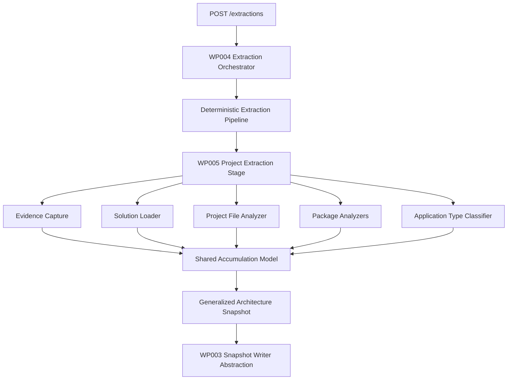

# Implementation Plan - WP005 Repository, Solution, Project, and Package Extraction

## Document Control

| Field | Value |
| --- | --- |
| Work Package | WP005 - Repository, Solution, Project, and Package Extraction |
| Related Specification | `docs/005-Repository-Solution-Project-and-Package-Extraction/spec-wp005-repository-solution-project-and-package-extraction.md` |
| Target Output Path | `docs/005-Repository-Solution-Project-and-Package-Extraction/implementation-plan-wp005-repository-solution-project-and-package-extraction.md` |
| Plan Type | Single implementation plan document with architecture appendix |
| Planning Basis | `spec.plan.prompt.md`, `.github/instructions/wiki.instructions.md`, `.github/instructions/documentation-pass.instructions.md`, repository coding standards, and WP005 specification |
| Status | Draft |

## Planning Standards and Non-Negotiable Gates

This implementation plan is governed by `.github/copilot-instructions.md`, `.github/instructions/wiki.instructions.md`, and `.github/instructions/documentation-pass.instructions.md`. The executor must treat those files as active requirements, not optional guidance.

For every Work Item below, once implementation starts, execution must continue uninterrupted through implementation, validation, documentation review, wiki review, and plan-record updates until that Work Item is complete. The executor must not stop for step announcements, progress-only handoffs, ordinary fixable failures, build failures, test failures, or confirmation prompts. The only allowed stops during an active Work Item are full Work Item completion, explicit user interruption or change of direction, or a true blocker that cannot be resolved from the specification, this plan, repository guidance, or the codebase.

Any Work Item that creates or updates source code must comply fully with `.github/instructions/documentation-pass.instructions.md`. This includes developer-level comments for every class, method, and constructor, including internal and other non-public types and members; parameter comments for every public method and constructor parameter; comments for every property whose purpose is not obvious from its name; and enough inline or block comments for a developer to understand the purpose, logical flow, and any algorithms used. The documentation-pass requirements apply to production and test code. They are Definition of Done criteria, not polish.

Every Work Item must include wiki review under `.github/instructions/wiki.instructions.md`. The executor must update the wiki when developer-facing behavior, architecture, workflows, terminology, setup, validation, or contributor guidance changes or is materially clarified. If no wiki update is needed for a slice, the executor must record the specific pages reviewed and why no update was required. Contributor-facing explanation must go to the correct `./wiki` topic page, not to standalone implementation notes, implementation ledgers, architecture notes, or `wiki/home.md` as a dumping ground.

Foundational documentation and wiki updates for architecture, runtime foundations, extraction workflows, setup flows, validation workflows, terminology, and other conceptually dense subjects must use longer, book-like narrative prose. Technical terms must be explained when first introduced, either inline or by explicit glossary linkage. Examples or walkthrough material must be included when they materially improve contributor understanding.

## Overall Project Structure

The implementation must preserve the Onion Architecture dependency direction already established in the repository:

```text
Hosts/API -> Infrastructure -> Application/Services -> Domain
```

The exact project names and folders must be confirmed from the existing solution before implementation. WP005 work is expected to be organized around these areas, adjusted to match the repository's actual project names and conventions:

```text
src/
  Archon.Application/
	Extraction/
	  Pipeline/
	  Projects/
	  Snapshots/
  Archon.Roslyn.Abstractions/
	Solutions/
	Projects/
  Archon.Extractors.Projects/ or existing equivalent extraction slice
	Solutions/
	Projects/
	Packages/
	Classification/
	Evidence/
  Archon.Infrastructure/ or existing equivalent adapters
	ProjectSystem/
  Archon.Api.Extraction/ or ArchonApi extraction module
	Existing extraction endpoint registration only if required for dependency wiring

test/
  Archon.Application.Tests/
	Extraction/
  Archon.Roslyn.Abstractions.Tests/
	Solutions/
	Projects/
  Archon.Extractors.Projects.Tests/ or existing equivalent
	Solutions/
	Projects/
	Packages/
	Classification/
	Evidence/
  Archon.Api.Extraction.Tests/ or ArchonApi.Tests
	Extraction/

wiki/
  api-extraction-workflow.md
  graph-domain-model.md
  runtime-foundation.md
  validation-and-test-workflows.md
  glossary.md
  home.md
  <new project extraction topic page if wiki review determines one is needed>
```

Naming must follow current repository conventions discovered during implementation. C# source must use block-scoped namespaces, Allman braces, one public type per file, underscore-prefixed private fields, nullable reference types where enabled, and no top-level statements. `.csproj` edits must keep `PackageReference` entries in `ItemGroup` blocks that contain only package references. If package additions or version changes are required, use the repository-approved NuGet update tooling path and do not perform manual package changes outside that process.

## Vertical Slice Strategy

WP005 must be delivered as incremental runnable slices rather than disconnected horizontal layers. Each Work Item below produces a demonstrable capability that can be exercised through the existing WP004 extraction entry point, application-level orchestration tests, or focused test seams without starting the Aspire AppHost.

The first slice replaces placeholder extraction with the smallest real graph contribution: repository and solution facts derived from submitted solution files. Later slices deepen the same end-to-end path by adding project metadata, project references, package references, legacy package support, evidence precision, analyzer/imported-file facts, and application type classification. Each slice must leave the system runnable and must preserve all previous slice behavior.

The term project extraction slice means the WP005 pipeline stage that reads submitted solution and project artifacts and contributes architecture graph facts to the shared WP004 accumulation model. The term evidence means a persisted source record that explains where a graph fact came from, such as a solution-file project declaration, a project XML element, or a `packages.config` entry. The term stable key means a deterministic logical identifier for a graph fact that does not depend on database-generated IDs.

## Work Items

## Slice 1 - Repository and Solution Fact Extraction

- [ ] Work Item 1: Extract repository and solution graph facts through the shared extraction path
  - **Purpose**: Replace the WP004 placeholder boundary with the first real WP005 extraction capability by contributing repository and submitted-solution facts from the existing extraction API/orchestrator path into the generalized snapshot contract.
  - **Acceptance Criteria**:
	- A valid WP004 extraction request for one repository root and one or more submitted solution paths runs the WP005 project extraction stage.
	- The stage creates one repository node and one solution node per submitted solution path.
	- Repository-to-solution `CONTAINS` relationships are contributed to the shared accumulation model.
	- Solution-file evidence is captured for each submitted solution and for visible project declarations where feasible.
	- Multi-solution requests preserve each submitted solution as a distinct solution node.
	- The stage does not scan for unsubmitted solutions.
	- The stage does not write directly to Neo4j and uses the existing WP004 snapshot persistence handoff.
  - **Definition of Done**:
	- Code implemented for the WP005 extraction stage registration, repository fact contribution, solution fact contribution, solution-file evidence capture, and controlled warning/error handling.
	- Tests pass for repository node creation, solution node creation, multi-solution preservation, no unsubmitted solution scanning, solution evidence, and snapshot persistence handoff shape.
	- Logging and error handling are added with credential-safe structured data and without exposing raw stack traces, secrets, or sensitive metadata values.
	- All source-code work follows `.github/instructions/documentation-pass.instructions.md` in full, including developer-level comments on every class, method, constructor, internal type, non-public member requiring explanation, and test scenario.
	- Wiki review is completed under `.github/instructions/wiki.instructions.md`; relevant extraction workflow, graph model, validation, or glossary pages are updated, or a specific no-change review result is recorded.
	- Foundational wiki content uses book-like narrative depth where this slice changes extraction architecture or workflow understanding; technical terms are defined on first use or linked to glossary guidance.
	- No standalone implementation notes, implementation ledgers, architecture-note files, or `wiki/home.md` detail dumping are created for contributor-facing explanation.
	- Can execute end-to-end through focused extraction application/API tests without starting the Aspire AppHost.
	- Executor must not stop mid-Work Item; execution continues through implementation, validation, documentation/wiki review, and plan-record updates unless the Work Item is complete, the user explicitly interrupts, or a true blocker prevents further autonomous progress.
  - [ ] Task 1: Discover existing WP004 extraction pipeline and snapshot contracts
	- [ ] Identify the current extraction stage registration mechanism, accumulation model, snapshot assembler, and persistence writer abstraction.
	- [ ] Identify existing stable-key, metadata, confidence, unknown-state, node, edge, and evidence contracts from WP002/WP003.
	- [ ] Identify existing test fixture style and targeted test commands used by WP004.
  - [ ] Task 2: Add the WP005 project extraction stage shell
	- [ ] Create or align the project extraction stage in the appropriate extractor/application project.
	- [ ] Register the stage in the existing extraction pipeline without changing public API endpoint shapes.
	- [ ] Ensure stage ordering remains deterministic and future extractor stages can be added without redesign.
  - [ ] Task 3: Contribute repository facts
	- [ ] Create deterministic repository stable keys using existing stable-key helpers.
	- [ ] Populate repository node metadata from the resolved extraction input without leaking unsafe metadata values into logs.
	- [ ] Capture repository evidence where supported by existing contracts.
  - [ ] Task 4: Parse submitted solution files for solution facts
	- [ ] Read only submitted solution files resolved by WP004 validation.
	- [ ] Create deterministic solution stable keys from repository identity and repository-relative solution path.
	- [ ] Capture solution-file evidence, including project declaration spans where feasible.
  - [ ] Task 5: Contribute graph relationships and warnings
	- [ ] Add repository-to-solution `CONTAINS` relationships.
	- [ ] Convert malformed or unreadable solution content into controlled run errors or warnings according to the specification's unsupported project policy.
	- [ ] Preserve all warnings/errors in run status and snapshot output.
  - [ ] Task 6: Add tests and validation
	- [ ] Add focused unit tests for repository and solution fact contribution.
	- [ ] Add orchestration/persistence handoff tests proving the generalized snapshot receives repository, solution, relationship, and evidence contributions.
	- [ ] Run targeted project builds and tests only; do not run the full test suite and do not start Aspire AppHost.
  - [ ] Task 7: Perform documentation and wiki review for the slice
	- [ ] Apply documentation-pass comments to all changed production and test code.
	- [ ] Review `wiki/api-extraction-workflow.md`, `wiki/graph-domain-model.md`, `wiki/validation-and-test-workflows.md`, `wiki/glossary.md`, and `wiki/home.md` for required updates.
	- [ ] Decide whether a new `wiki/project-extraction-workflow.md` or equivalent topic page is needed; do not place detailed content in `wiki/home.md`.
	- [ ] Record pages reviewed, pages updated, pages intentionally unchanged, and page-structure decision in the Work Item completion record.
  - **Files**:
	- `src/Archon.Application/Extraction/Projects/*`: Project extraction stage contracts or application-level contribution models if this is the existing location.
	- `src/Archon.Extractors.Projects/*` or existing equivalent: Repository and solution fact extraction implementation.
	- `test/Archon.Application.Tests/Extraction/*`: Orchestration and snapshot contribution tests.
	- `test/Archon.Extractors.Projects.Tests/*` or existing equivalent: Repository and solution extraction tests.
	- `wiki/*`: Topic pages selected by mandatory wiki review.
  - **Work Item Dependencies**: Existing WP004 extraction orchestration and persistence handoff.
  - **Run / Verification Instructions**:
	- Run targeted project builds for changed production and test projects.
	- Run focused tests for repository/solution extraction and extraction orchestration handoff.
	- Do not start the Aspire AppHost.
  - **User Instructions**: None expected.

## Slice 2 - C# and VB.NET Project Metadata Extraction

- [ ] Work Item 2: Extract C# and VB.NET project nodes with core build metadata
  - **Purpose**: Add the first project-level inventory capability by loading submitted solutions, identifying supported C# and VB.NET projects, and contributing project nodes with target frameworks, output type, assembly name, root namespace, SDK-style/old-style status, nullable setting, and implicit-usings metadata.
  - **Acceptance Criteria**:
	- C# `.csproj` projects declared in submitted solutions are extracted as project nodes.
	- VB.NET `.vbproj` projects declared in submitted solutions are extracted as project nodes.
	- Mixed-language solutions are supported.
	- Project nodes include project name, repository-relative path, language, target framework data, output type, assembly name, root namespace, SDK-style status, old-style status, nullable setting, implicit-usings setting, confidence/unknown state where appropriate, and project-file evidence.
	- Unsupported project declarations produce evidence-backed warnings without failing the entire run unless no supported projects can be extracted.
	- The implementation uses the resolved hybrid loading approach from the specification: Roslyn/MSBuildWorkspace for solution/project context and deterministic XML/MSBuild evaluation for project metadata.
  - **Definition of Done**:
	- Code implemented for solution loading, supported project discovery, project metadata extraction, unsupported project warning behavior, project node contribution, and project-file evidence.
	- Tests pass for C# projects, VB.NET projects, mixed-language solutions, SDK-style projects, old-style projects, target frameworks, output type, assembly name, root namespace, nullable setting, implicit usings, unsupported project warnings, and no Visual Studio automation requirement.
	- Logging and error handling are added with credential-safe structured data.
	- All source-code work follows `.github/instructions/documentation-pass.instructions.md` in full for production and test code.
	- Wiki review is completed under `.github/instructions/wiki.instructions.md`; project extraction workflow, graph domain model, validation workflow, glossary, or related pages are updated or explicitly left unchanged with justification.
	- Any conceptually dense wiki updates use long-form narrative prose, define terms such as SDK-style project, old-style project, target framework, and project node, and include examples where helpful.
	- No standalone implementation notes or `wiki/home.md` dumping are created.
	- Can execute end-to-end through focused tests that start extraction for fixture solutions and inspect snapshot contributions.
	- Executor must not stop mid-Work Item except for full completion, explicit user interruption, or a true blocker.
  - [ ] Task 1: Implement the project-system abstraction
	- [ ] Define interfaces for loading submitted solutions and project metadata behind repository-specific abstractions.
	- [ ] Ensure abstractions do not expose Visual Studio automation, Neo4j driver types, or host-specific types to inward layers.
	- [ ] Add documented cancellation and error behavior.
  - [ ] Task 2: Implement hybrid solution/project loading
	- [ ] Use `MSBuildWorkspace` or repository-approved Roslyn loading where project context is needed.
	- [ ] Use deterministic project XML/MSBuild evaluation for metadata extraction from `.csproj`, `.vbproj`, `.props`, and `.targets` where safe.
	- [ ] Avoid executing arbitrary build targets, repository scripts, package restore, or external feed calls.
  - [ ] Task 3: Extract C# and VB.NET project nodes
	- [ ] Map `.csproj` and `.vbproj` files to project nodes with stable keys based on repository identity and repository-relative project path.
	- [ ] Deduplicate project nodes within a snapshot when a project appears through more than one submitted solution.
	- [ ] Preserve solution-to-project membership using `CONTAINS` relationships.
  - [ ] Task 4: Extract core build metadata
	- [ ] Extract `TargetFramework`, `TargetFrameworks`, legacy target framework declarations, output type, assembly name, root namespace, SDK value, nullable setting, and implicit-usings setting.
	- [ ] Apply documented defaults only when those defaults are deterministic and evidence-supported.
	- [ ] Represent missing or unresolved values as unknown rather than omitting them.
  - [ ] Task 5: Capture project-file evidence
	- [ ] Capture evidence for each project node and each metadata group.
	- [ ] Include XML element line spans where practical and file-level evidence fallback where spans are unavailable.
	- [ ] Avoid storing full file contents in metadata.
  - [ ] Task 6: Add tests and validation
	- [ ] Add fixture solutions for C#, VB.NET, mixed-language, SDK-style, and old-style project cases.
	- [ ] Add tests for metadata extraction, unknown handling, evidence capture, and unsupported project warnings.
	- [ ] Run targeted builds and focused tests only; do not start Aspire AppHost.
  - [ ] Task 7: Perform documentation and wiki review for the slice
	- [ ] Apply documentation-pass comments to all changed code.
	- [ ] Review and update selected wiki pages, creating a dedicated project extraction page if the Slice 1 review did not already create one and the detail now warrants it.
	- [ ] Record the wiki impact matrix or equivalent Work Item completion result.
  - **Files**:
	- `src/Archon.Roslyn.Abstractions/Solutions/*`: Solution/project loading abstractions if this project exists.
	- `src/Archon.Extractors.Projects/Projects/*`: Project metadata extraction implementation.
	- `src/Archon.Extractors.Projects/Evidence/*`: Project evidence helpers.
	- `test/Archon.Extractors.Projects.Tests/Projects/*`: Project metadata tests and fixtures.
	- `wiki/*`: Relevant topic pages selected by wiki review.
  - **Work Item Dependencies**: Work Item 1.
  - **Run / Verification Instructions**:
	- Run targeted tests for project loading and metadata extraction.
	- Run changed project builds.
	- Do not start the Aspire AppHost.
  - **User Instructions**: None expected.

## Slice 3 - Project Reference Extraction and Multi-Solution Deduplication

- [ ] Work Item 3: Extract project references and preserve multi-solution membership
  - **Purpose**: Make project-level dependency structure visible by contributing `REFERENCES` relationships between projects while preserving explicit solution membership and deterministic deduplication across multi-solution repositories.
  - **Acceptance Criteria**:
	- Project references declared by C# and VB.NET projects are extracted.
	- Resolved project references create `REFERENCES` relationships from the referencing project node to the referenced project node.
	- Projects shared across submitted solutions are represented once as project nodes while each solution membership remains explicit.
	- References to repository-contained projects outside the submitted solution set are represented according to existing graph capabilities, with evidence and warnings when unresolved.
	- Duplicate project references are deduplicated deterministically within a snapshot.
	- Project-reference evidence identifies source project file and referenced path where practical.
  - **Definition of Done**:
	- Code implemented for project-reference extraction, relationship contribution, deduplication, unresolved reference warning behavior, and evidence capture.
	- Tests pass for resolved references, unresolved references, duplicate references, cross-solution shared projects, and repository-contained references outside the submitted solution set.
	- Logging and error handling are credential-safe.
	- All source-code work follows `.github/instructions/documentation-pass.instructions.md` in full.
	- Wiki review is completed under `.github/instructions/wiki.instructions.md`; dependency terminology, graph relationship explanation, validation commands, and examples are updated where needed.
	- No standalone implementation notes or `wiki/home.md` detail dumping are created.
	- Can execute end-to-end through fixture extraction tests that inspect `REFERENCES` edges in the assembled snapshot.
	- Executor must not stop mid-Work Item except for full completion, explicit user interruption, or a true blocker.
  - [ ] Task 1: Extract project reference declarations
	- [ ] Read `ProjectReference` items from SDK-style and old-style project files.
	- [ ] Normalize referenced paths relative to the declaring project file.
	- [ ] Preserve raw declared path metadata where useful for evidence and troubleshooting.
  - [ ] Task 2: Resolve referenced projects
	- [ ] Resolve references to project nodes already included in the submitted solution set.
	- [ ] Represent repository-contained but non-submitted referenced projects according to available graph contracts.
	- [ ] Capture unresolved reference warnings with evidence.
  - [ ] Task 3: Contribute reference relationships
	- [ ] Create deterministic `REFERENCES` edge stable keys.
	- [ ] Preserve directness, confidence, unknown-state, and evidence metadata.
	- [ ] Deduplicate duplicate references deterministically.
  - [ ] Task 4: Add multi-solution tests
	- [ ] Add fixtures where two submitted solutions share one project.
	- [ ] Add fixtures where projects reference each other across solution boundaries.
	- [ ] Verify project node deduplication and multiple solution-to-project `CONTAINS` relationships.
  - [ ] Task 5: Perform documentation and wiki review for the slice
	- [ ] Update code comments under the documentation-pass standard.
	- [ ] Review graph-domain and project-extraction wiki guidance for dependency terminology and examples.
	- [ ] Record pages reviewed, updated, created, intentionally unchanged, and page-structure decision.
  - **Files**:
	- `src/Archon.Extractors.Projects/Projects/*`: Project reference extraction.
	- `src/Archon.Extractors.Projects/Evidence/*`: Reference evidence capture.
	- `test/Archon.Extractors.Projects.Tests/Projects/*`: Reference and multi-solution tests.
	- `wiki/*`: Relevant graph and workflow pages.
  - **Work Item Dependencies**: Work Items 1 and 2.
  - **Run / Verification Instructions**:
	- Run focused project-reference and multi-solution tests.
	- Run changed project builds.
	- Do not start the Aspire AppHost.
  - **User Instructions**: None expected.

## Slice 4 - PackageReference and Central Package Management Extraction

- [ ] Work Item 4: Extract SDK-style package references and deterministic central package versions
  - **Purpose**: Make NuGet package dependencies visible for SDK-style projects by contributing package nodes and `USES_PACKAGE` relationships, including local deterministic central package management support without restore or external feed calls.
  - **Acceptance Criteria**:
	- SDK-style `PackageReference` items are extracted with package ID, declared version, version-source state, private assets, include assets, exclude assets, aliases, confidence, and evidence where available.
	- Local deterministic central package versions from `Directory.Packages.props` are resolved when available.
	- Versions that cannot be resolved without package restore or external feed access are represented as centrally managed, inherited, or unknown with evidence.
	- Package nodes and `USES_PACKAGE` relationships are contributed to the generalized snapshot contract.
	- Imported repository-contained `.props` and `.targets` package declarations are extracted when safely visible through the chosen evaluation approach.
	- WP005 does not call NuGet feeds, perform package restore, download packages, or perform vulnerability/license analysis.
  - **Definition of Done**:
	- Code implemented for `PackageReference` extraction, local central package management resolution, package node contribution, `USES_PACKAGE` relationship contribution, and evidence capture.
	- Tests pass for direct versions, central versions, inherited/unknown versions, asset metadata, imported repository-contained package declarations, duplicate references, and no restore/feed behavior.
	- Logging and error handling are credential-safe and avoid logging sensitive metadata values.
	- All source-code work follows `.github/instructions/documentation-pass.instructions.md` in full.
	- Wiki review is completed under `.github/instructions/wiki.instructions.md`; package extraction behavior, central package management terminology, no-restore policy, and validation commands are updated where needed.
	- Long-form wiki explanation defines `PackageReference`, central package management, and `USES_PACKAGE` relationships when first introduced or links to glossary entries.
	- No standalone implementation notes or `wiki/home.md` detail dumping are created.
	- Can execute end-to-end through fixture extraction tests that inspect package nodes and `USES_PACKAGE` edges.
	- Executor must not stop mid-Work Item except for full completion, explicit user interruption, or a true blocker.
  - [ ] Task 1: Extract direct `PackageReference` items
	- [ ] Read package ID, version, asset metadata, and aliases from project XML or evaluated metadata.
	- [ ] Normalize package IDs for identity while preserving display casing where useful.
	- [ ] Capture exact XML evidence spans where practical.
  - [ ] Task 2: Resolve local central package versions
	- [ ] Detect repository-contained `Directory.Packages.props` files in applicable project directory hierarchy.
	- [ ] Resolve deterministic locally declared versions without package restore.
	- [ ] Represent unresolved central versions as centrally managed, inherited, or unknown with evidence.
  - [ ] Task 3: Contribute package graph facts
	- [ ] Create deterministic package node stable keys.
	- [ ] Create `USES_PACKAGE` relationships from project nodes to package nodes.
	- [ ] Preserve version source, directness, confidence, unknown-state, and evidence metadata.
  - [ ] Task 4: Handle imported package declarations
	- [ ] Inspect only local, repository-contained `.props` and `.targets` imports where safe and visible.
	- [ ] Do not traverse external SDK/package import chains beyond safely evaluated metadata.
	- [ ] Do not execute targets.
  - [ ] Task 5: Add tests and validation
	- [ ] Add fixtures for direct package versions, central package versions, unknown versions, asset metadata, imported references, and duplicate references.
	- [ ] Add tests proving no external package feed or restore behavior is required.
	- [ ] Run targeted builds and focused tests only.
  - [ ] Task 6: Perform documentation and wiki review for the slice
	- [ ] Apply documentation-pass comments to all changed code.
	- [ ] Update package extraction wiki guidance and glossary entries if needed.
	- [ ] Record wiki impact matrix or equivalent completion result.
  - **Files**:
	- `src/Archon.Extractors.Projects/Packages/*`: Package reference extraction and central version resolution.
	- `src/Archon.Extractors.Projects/Evidence/*`: Package evidence helpers.
	- `test/Archon.Extractors.Projects.Tests/Packages/*`: PackageReference and central package tests.
	- `wiki/*`: Package extraction and validation topic pages.
  - **Work Item Dependencies**: Work Items 1 and 2.
  - **Run / Verification Instructions**:
	- Run focused package extraction tests.
	- Run changed project builds.
	- Do not start the Aspire AppHost.
  - **User Instructions**: None expected.

## Slice 5 - Legacy `packages.config` Extraction

- [ ] Work Item 5: Extract legacy `packages.config` dependencies
  - **Purpose**: Support legacy .NET Framework estates by extracting NuGet dependencies from `packages.config` files associated with old-style projects and contributing them to the same package graph model used for SDK-style projects.
  - **Acceptance Criteria**:
	- `packages.config` files associated with old-style projects are detected.
	- Package ID, version, and target framework are extracted from package entries.
	- Package nodes and `USES_PACKAGE` relationships are contributed for `packages.config` dependencies.
	- `packages.config` dependencies are distinguishable from SDK-style `PackageReference` dependencies in metadata.
	- Malformed `packages.config` files produce controlled warnings or errors with evidence rather than unhandled exceptions.
	- Evidence identifies package entry location where practical.
  - **Definition of Done**:
	- Code implemented for `packages.config` discovery, parsing, package graph contribution, malformed file handling, and evidence capture.
	- Tests pass for valid legacy packages, target framework values, malformed package files, missing package files, relationship contribution, source-type metadata, and evidence spans.
	- Logging and error handling are credential-safe.
	- All source-code work follows `.github/instructions/documentation-pass.instructions.md` in full.
	- Wiki review is completed under `.github/instructions/wiki.instructions.md`; legacy package guidance, old-style project terminology, examples, and validation commands are updated where needed.
	- No standalone implementation notes or `wiki/home.md` detail dumping are created.
	- Can execute end-to-end through fixture extraction tests that inspect package nodes and `USES_PACKAGE` edges for legacy projects.
	- Executor must not stop mid-Work Item except for full completion, explicit user interruption, or a true blocker.
  - [ ] Task 1: Detect associated `packages.config` files
	- [ ] Determine association rules for old-style projects using project directory and project metadata.
	- [ ] Represent missing associated files as warnings only when a project explicitly expects one.
  - [ ] Task 2: Parse package entries
	- [ ] Extract package ID, version, target framework, and supported metadata.
	- [ ] Convert malformed XML or invalid entries into controlled diagnostics.
	- [ ] Preserve line spans and snippet data where available.
  - [ ] Task 3: Contribute package graph facts
	- [ ] Reuse package node identity and `USES_PACKAGE` relationship behavior from Work Item 4.
	- [ ] Mark source type as `packages.config` or equivalent metadata.
	- [ ] Preserve confidence and unknown state for incomplete entries.
  - [ ] Task 4: Add tests and validation
	- [ ] Add old-style project fixtures with valid and malformed `packages.config` files.
	- [ ] Add tests for target framework extraction and source-type distinction.
	- [ ] Run targeted builds and focused tests only.
  - [ ] Task 5: Perform documentation and wiki review for the slice
	- [ ] Apply documentation-pass comments to all changed code.
	- [ ] Update legacy package extraction wiki guidance if needed.
	- [ ] Record wiki review result and page-structure decision.
  - **Files**:
	- `src/Archon.Extractors.Projects/Packages/*`: Legacy package extraction.
	- `test/Archon.Extractors.Projects.Tests/Packages/*`: `packages.config` tests and fixtures.
	- `wiki/*`: Legacy project/package guidance pages.
  - **Work Item Dependencies**: Work Items 2 and 4.
  - **Run / Verification Instructions**:
	- Run focused `packages.config` extraction tests.
	- Run changed project builds.
	- Do not start the Aspire AppHost.
  - **User Instructions**: None expected.

## Slice 6 - Analyzer References, FilePath Nodes, Imported Build Artifacts, and Evidence Precision

- [ ] Work Item 6: Extract analyzer references and strengthen file/evidence modeling
  - **Purpose**: Complete WP005 artifact-level extraction by representing analyzer references, relevant `FilePath` nodes, repository-contained imported build artifacts, and precise evidence spans across solution, project, package, and reference facts.
  - **Acceptance Criteria**:
	- Analyzer references declared by project files are extracted and represented according to existing graph contract capabilities.
	- Analyzer paths, package-derived identities, or unresolved identities are preserved where available.
	- Relevant `FilePath` nodes are contributed for solution files, project files, `packages.config`, `Directory.Packages.props`, `Directory.Build.props`, `Directory.Build.targets`, and explicitly imported repository-contained `.props`/`.targets` files that support extracted facts.
	- Imported build file inspection stays within local repository-contained imports and does not execute targets.
	- Evidence spans are captured for XML elements where practical, with file-level fallback plus stable snippet hash or preview where supported.
	- Evidence capture avoids storing large full-file contents in metadata.
  - **Definition of Done**:
	- Code implemented for analyzer reference extraction, file-path node contribution, imported artifact contribution, evidence span helpers, and fallback evidence behavior.
	- Tests pass for analyzer references, unresolved analyzer paths, file-path nodes, imported local build files, no external import traversal, exact XML spans where available, and fallback evidence behavior.
	- Logging and error handling are credential-safe.
	- All source-code work follows `.github/instructions/documentation-pass.instructions.md` in full.
	- Wiki review is completed under `.github/instructions/wiki.instructions.md`; evidence terminology, file-path node guidance, imported build file policy, and validation workflow are updated where needed.
	- Dense wiki content defines analyzer reference, file-path node, imported build artifact, and evidence span or links to glossary entries.
	- No standalone implementation notes or `wiki/home.md` detail dumping are created.
	- Can execute end-to-end through fixture extraction tests that inspect analyzer facts, file-path nodes, and evidence records.
	- Executor must not stop mid-Work Item except for full completion, explicit user interruption, or a true blocker.
  - [ ] Task 1: Extract analyzer references
	- [ ] Read analyzer declarations from supported project files.
	- [ ] Preserve paths or package-derived identities where available.
	- [ ] Represent unresolved analyzers as warnings or unknown metadata when relevant.
  - [ ] Task 2: Contribute file-path nodes
	- [ ] Create deterministic file-path node stable keys using repository-relative paths for files inside the repository.
	- [ ] Contribute nodes for relevant solution, project, package, and imported build artifacts.
	- [ ] Link file-path nodes to facts where existing graph contracts support such relationships.
  - [ ] Task 3: Implement imported build artifact policy
	- [ ] Include `Directory.Build.props`, `Directory.Build.targets`, `Directory.Packages.props`, and explicitly imported repository-contained `.props`/`.targets` files.
	- [ ] Exclude external SDK/package import chains unless safely exposed by evaluated metadata.
	- [ ] Preserve warnings for inaccessible or malformed local imports.
  - [ ] Task 4: Strengthen evidence span handling
	- [ ] Implement reusable XML line-span capture where supported by the parser.
	- [ ] Add file-level fallback evidence with snippet hash/preview where supported.
	- [ ] Ensure evidence stable keys and fingerprints remain deterministic.
  - [ ] Task 5: Add tests and validation
	- [ ] Add fixtures for analyzer references, file-path nodes, local imports, external import exclusions, and evidence span fallback.
	- [ ] Run targeted builds and focused tests only.
  - [ ] Task 6: Perform documentation and wiki review for the slice
	- [ ] Apply documentation-pass comments to all changed code.
	- [ ] Update evidence and artifact modeling wiki guidance if needed.
	- [ ] Record wiki review outcome and page-structure decision.
  - **Files**:
	- `src/Archon.Extractors.Projects/Projects/*`: Analyzer reference extraction.
	- `src/Archon.Extractors.Projects/Evidence/*`: Evidence span and snippet helpers.
	- `src/Archon.Extractors.Projects/Solutions/*`: Solution evidence enhancements if needed.
	- `test/Archon.Extractors.Projects.Tests/Evidence/*`: Evidence and artifact tests.
	- `wiki/*`: Evidence, graph model, and project extraction topic pages.
  - **Work Item Dependencies**: Work Items 1 through 5 as applicable.
  - **Run / Verification Instructions**:
	- Run focused analyzer/file-path/evidence tests.
	- Run changed project builds.
	- Do not start the Aspire AppHost.
  - **User Instructions**: None expected.

## Slice 7 - Application Type Classification

- [ ] Work Item 7: Classify project application types with evidence and confidence
  - **Purpose**: Provide architecture consumers with deterministic high-level project categories while avoiding unsupported guesses by classifying supported application types from project metadata, package indicators, project type GUIDs, output type, and safe repository-contained artifact indicators.
  - **Acceptance Criteria**:
	- Classification covers ASP.NET Core Web App, ASP.NET Core Web API, Classic ASP.NET Web App, Web Forms App, MVC App, Web API 2 App, Console App, Worker Service, Class Library, Test Project, Tooling Project, and Unknown.
	- Direct SDK, project type GUID, output type, or explicit package indicators are high confidence.
	- Strong source/configuration artifact indicators are medium confidence.
	- Naming conventions or weak heuristics are low confidence.
	- Insufficient or contradictory evidence results in `Unknown`, and `Unknown` is preferred over low-confidence guessing where classification affects downstream behavior.
	- Classification is evidence-backed and deterministic for the same project inputs.
	- The classifier is designed so later runtime and UI extraction packages can refine evidence without changing project node identity.
  - **Definition of Done**:
	- Code implemented for application type classification rules, confidence assignment, contradictory indicator handling, evidence links, and metadata contribution.
	- Tests pass for every required application type, Unknown behavior, contradictory evidence, confidence levels, deterministic repeat behavior, and non-interference with later WP006 semantic extraction.
	- Logging and error handling are credential-safe.
	- All source-code work follows `.github/instructions/documentation-pass.instructions.md` in full.
	- Wiki review is completed under `.github/instructions/wiki.instructions.md`; classification rules, confidence terminology, Unknown behavior, examples, and glossary terms are updated where needed.
	- Wiki content for classification uses narrative explanation and examples because classification rules affect contributor reasoning and future extractor behavior.
	- No standalone implementation notes or `wiki/home.md` detail dumping are created.
	- Can execute end-to-end through fixture extraction tests that inspect project nodes with classification values and evidence.
	- Executor must not stop mid-Work Item except for full completion, explicit user interruption, or a true blocker.
  - [ ] Task 1: Define classifier inputs and outputs
	- [ ] Align classifier result with existing project node metadata, confidence, unknown-state, and evidence contracts.
	- [ ] Define deterministic rule priority and contradiction handling.
	- [ ] Document the rule order in source comments under the documentation-pass standard.
  - [ ] Task 2: Implement high-confidence classification rules
	- [ ] Classify direct SDK, project type GUID, output type, and explicit package indicators.
	- [ ] Capture evidence for each high-confidence decision.
  - [ ] Task 3: Implement medium- and low-confidence rules
	- [ ] Add safe source/configuration artifact indicators available within WP005 scope.
	- [ ] Add naming or weak heuristic handling only where justified and clearly low confidence.
	- [ ] Preserve `Unknown` when evidence is insufficient or contradictory.
  - [ ] Task 4: Add classification tests
	- [ ] Add fixture projects for every required application type.
	- [ ] Add tests for confidence levels, contradictory evidence, and deterministic results.
	- [ ] Run targeted builds and focused tests only.
  - [ ] Task 5: Perform documentation and wiki review for the slice
	- [ ] Apply documentation-pass comments to classifier and tests.
	- [ ] Update classification rules and glossary documentation if needed.
	- [ ] Record wiki review outcome and page-structure decision.
  - **Files**:
	- `src/Archon.Extractors.Projects/Classification/*`: Application type classifier.
	- `test/Archon.Extractors.Projects.Tests/Classification/*`: Classification fixtures and tests.
	- `wiki/*`: Project extraction, graph model, validation, and glossary pages.
  - **Work Item Dependencies**: Work Items 2, 4, 5, and 6.
  - **Run / Verification Instructions**:
	- Run focused classification tests.
	- Run changed project builds.
	- Do not start the Aspire AppHost.
  - **User Instructions**: None expected.

## Slice 8 - End-to-End WP005 Validation, Hardening, and Documentation Pass

- [ ] Work Item 8: Validate and harden the complete WP005 extraction slice
  - **Purpose**: Prove that WP005 functions as one coherent runnable feature through the existing extraction path, with repository, solution, project, package, reference, analyzer, file-path, evidence, warning, and classification facts flowing into the generalized snapshot contract.
  - **Acceptance Criteria**:
	- A representative fixture extraction produces repository, solution, project, package, and file-path nodes.
	- The same fixture extraction produces `CONTAINS`, `REFERENCES`, and `USES_PACKAGE` relationships.
	- The snapshot includes evidence, warnings, unknowns, confidence, and metadata for incomplete or inferred facts.
	- Persistence handoff receives the complete generalized snapshot and project extraction does not directly write to Neo4j.
	- Targeted validation covers multi-solution repositories, mixed C#/VB.NET solutions, project references, package references, old-style projects, SDK-style projects, application type classifications, and evidence spans.
	- No Archon Discovery UI, semantic extraction, runtime extraction, configuration extraction beyond WP005 build artifacts, data-access extraction, integration extraction, markdown generation, MCP behavior, package restore, external NuGet feed calls, vulnerability analysis, or arbitrary build target execution is introduced.
  - **Definition of Done**:
	- Code hardening completed for diagnostic consistency, deterministic ordering, deduplication, stable keys, metadata serialization, and safe logging.
	- Targeted tests pass for every WP005 acceptance area and changed projects build successfully.
	- Full test suite is not run unless repository guidance is later changed; if a full run is required by an instruction update, record the reason and outcome.
	- Aspire AppHost is not started during automated validation.
	- All changed source and test code passes `.github/instructions/documentation-pass.instructions.md` requirements.
	- Wiki review is completed under `.github/instructions/wiki.instructions.md`; all developer-facing behavior, architecture, workflow, validation, and terminology changes from WP005 are reflected in the correct topic pages or explicitly recorded as no-change decisions.
	- Contributor-facing design rationale and walkthrough material are in `./wiki`, not standalone implementation notes or `wiki/home.md` detail sections.
	- Can execute end-to-end through focused extraction tests and snapshot assertions.
	- Executor must not stop mid-Work Item except for full completion, explicit user interruption, or a true blocker.
  - [ ] Task 1: Add representative end-to-end fixtures
	- [ ] Create or align test fixtures for multi-solution, mixed-language, SDK-style, old-style, direct packages, central packages, `packages.config`, project references, analyzer references, and classification cases.
	- [ ] Keep fixtures under appropriate test fixture directories, not the repository root.
  - [ ] Task 2: Add end-to-end snapshot assertions
	- [ ] Assert node collections include repository, solution, project, package, and file-path nodes.
	- [ ] Assert edge collections include `CONTAINS`, `REFERENCES`, and `USES_PACKAGE` relationships.
	- [ ] Assert evidence, warning, unknown, confidence, and metadata behavior.
	- [ ] Assert persistence handoff receives the generalized snapshot.
  - [ ] Task 3: Harden deterministic behavior
	- [ ] Review stable-key generation inputs for repository-relative identity and database-ID avoidance.
	- [ ] Review ordering and deduplication for multi-solution, project-reference, and package-reference cases.
	- [ ] Review metadata serialization for deterministic assertions.
  - [ ] Task 4: Harden diagnostics and logging
	- [ ] Ensure unsupported project, malformed package, unresolved reference, unresolved analyzer, and unresolved version diagnostics are controlled and user-actionable.
	- [ ] Ensure logs do not expose secrets, raw stack traces, unsafe metadata values, or unnecessary absolute paths.
  - [ ] Task 5: Perform final documentation-pass review for changed code
	- [ ] Inspect all hand-maintained changed C# files in the WP005 scope.
	- [ ] Ensure every class, method, constructor, public parameter, relevant property, test fixture, and test method meets `.github/instructions/documentation-pass.instructions.md`.
	- [ ] Improve weak or inconsistent comments directly in source where needed.
  - [ ] Task 6: Run targeted validation
	- [ ] Run changed production project builds.
	- [ ] Run changed test project builds.
	- [ ] Run focused WP005 unit and integration tests.
	- [ ] Record validation commands and outcomes in the Work Item completion record without duplicating contributor-facing guidance that belongs in the wiki.
  - [ ] Task 7: Perform package-level documentation and wiki review
	- [ ] Review all wiki pages affected by WP005 behavior and validation.
	- [ ] Update pages needing current-state guidance and examples.
	- [ ] Record pages reviewed, updated, created, intentionally unchanged, and page-structure decision.
  - **Files**:
	- `src/Archon.Extractors.Projects/*`: Cross-slice hardening.
	- `src/Archon.Application/Extraction/*`: Orchestration integration adjustments if needed.
	- `test/Archon.Extractors.Projects.Tests/*`: End-to-end fixtures and assertions.
	- `test/Archon.Application.Tests/Extraction/*`: Snapshot handoff tests if needed.
	- `wiki/*`: Current-state contributor guidance.
  - **Work Item Dependencies**: Work Items 1 through 7.
  - **Run / Verification Instructions**:
	- Run targeted WP005 extraction tests and changed project builds.
	- Do not start the Aspire AppHost.
	- Do not run the full test suite unless repository guidance changes.
  - **User Instructions**: None expected.

## Slice 9 - Final Wiki Review and Work Package Completion Record

- [ ] Work Item 9: Complete the mandatory full-work-package wiki review and final execution record
  - **Purpose**: Close WP005 by performing the mandatory full-work-package wiki information-architecture review, ensuring contributor-facing guidance is current, and recording the final outcome without creating standalone implementation notes or duplicating wiki content in the plan.
  - **Acceptance Criteria**:
	- Wiki review covers all WP005 affected concepts: project extraction workflow, solution loading, project metadata extraction, package extraction, `packages.config`, central package management, project references, analyzer references, file-path nodes, evidence spans, application type classification, warning/error behavior, validation commands, and terminology.
	- The correct topic page structure is documented, including whether a dedicated project extraction page exists or why existing pages are sufficient.
	- `wiki/home.md` remains a concise landing page and table of contents, not a catch-all page for WP005 details.
	- Relevant topic pages contain current-state guidance in book-like narrative prose where the subject matter is conceptually dense.
	- Technical terms are defined inline or linked through `wiki/glossary.md`.
	- Examples or walkthrough material are included where they materially improve contributor understanding.
	- Stale standalone implementation-note-style artifacts are not created; if any are discovered, current guidance is moved to the wiki and the artifact is retired according to repository rules.
	- The final completion record states which wiki or repository guidance pages were updated, created, retired, intentionally left unchanged, or why no wiki update was needed.
  - **Definition of Done**:
	- Full-work-package wiki review completed under `.github/instructions/wiki.instructions.md`.
	- Wiki impact matrix or equivalent prose is recorded in this plan's Work Item completion section, covering affected concepts, pages reviewed, pages updated, pages created, pages retired, pages intentionally unchanged, and page-structure decision.
	- Final validation outcomes from Work Item 8 are referenced concisely without duplicating contributor-facing guidance that belongs in wiki pages.
	- No source code changes are made in this Work Item unless required to correct a discovered documentation-pass issue; if code comments are touched, `.github/instructions/documentation-pass.instructions.md` remains mandatory and targeted validation is rerun.
	- No approval gate, confirmation pause, or status-only stopping point is introduced before full Work Item completion.
  - [ ] Task 1: Review wiki information architecture
	- [ ] Review `wiki/home.md` to confirm it remains concise and links to the correct topic pages.
	- [ ] Review `wiki/api-extraction-workflow.md`, `wiki/graph-domain-model.md`, `wiki/runtime-foundation.md`, `wiki/validation-and-test-workflows.md`, `wiki/glossary.md`, and any project-extraction topic page created during WP005.
	- [ ] Decide whether pages need splitting, cross-linking, glossary updates, or retirement of stale content.
  - [ ] Task 2: Update wiki pages as needed
	- [ ] Write current-state contributor guidance in the correct topic page.
	- [ ] Use long-form explanatory prose for architecture, runtime, workflow, setup, validation, and dense extraction concepts.
	- [ ] Include relevant examples or walkthrough fragments when helpful.
  - [ ] Task 3: Check prohibited substitute artifacts
	- [ ] Confirm no standalone implementation notes, implementation ledgers, architecture notes, or completion-record documents were created for contributor-facing detail.
	- [ ] If any existing implementation-note-style artifacts are discovered in the WP005 scope, move still-current guidance into the wiki and retire the redundant artifact before completion.
  - [ ] Task 4: Record final wiki impact matrix
	- [ ] Record affected concepts.
	- [ ] Record pages reviewed.
	- [ ] Record pages updated or created.
	- [ ] Record pages intentionally unchanged and why.
	- [ ] Record page-structure decision and why the selected structure remains readable.
  - **Files**:
	- `wiki/home.md`: Landing page only if links need updating.
	- `wiki/api-extraction-workflow.md`: Extraction orchestration and workflow links as needed.
	- `wiki/graph-domain-model.md`: Graph concept and evidence guidance as needed.
	- `wiki/validation-and-test-workflows.md`: Targeted validation commands as needed.
	- `wiki/glossary.md`: Technical terms as needed.
	- `wiki/project-extraction-workflow.md` or equivalent: Dedicated page if created by wiki review.
	- `docs/005-Repository-Solution-Project-and-Package-Extraction/implementation-plan-wp005-repository-solution-project-and-package-extraction.md`: Concise completion status and wiki impact record only.
  - **Work Item Dependencies**: Work Items 1 through 8.
  - **Run / Verification Instructions**:
	- Review rendered markdown for changed wiki and plan pages.
	- If only markdown changes are made, no code build is required unless repository guidance changes.
	- If source comments are changed while correcting documentation-pass findings, rerun targeted builds/tests for affected projects.
  - **User Instructions**: None expected.

## Cross-Cutting Test Strategy

WP005 validation should be focused and project-level. The full test suite must not be run for this work package unless repository guidance changes. Automated validation must not start the Aspire AppHost because it blocks the executing agent.

The test suite for WP005 should include:

- Unit tests for solution parsing, project metadata extraction, package extraction, legacy package parsing, analyzer extraction, evidence span capture, and classification rules.
- Application or integration-style tests that run the WP005 extraction stage through the WP004 pipeline and assert the generalized snapshot contribution.
- Persistence handoff tests using existing seams to prove the complete generalized snapshot reaches the WP003 writer abstraction.
- Fixture-based tests for multi-solution repositories, mixed C#/VB.NET solutions, SDK-style projects, old-style projects, project references, direct package references, central package management, `packages.config`, analyzer references, imported local build files, malformed artifacts, and unsupported project warnings.

## Cross-Cutting Documentation and Wiki Strategy

Every code-writing Work Item must perform source-code documentation under `.github/instructions/documentation-pass.instructions.md`. The implementation must document every class, method, and constructor, including internal and other non-public types; every public method and constructor parameter; non-obvious properties; and algorithmic or multi-step flows. Test code must explain scenario, setup, action, assertion intent, and behavioral significance.

Every Work Item must perform wiki review under `.github/instructions/wiki.instructions.md`. The likely wiki information architecture is:

- `wiki/project-extraction-workflow.md` or similarly named dedicated page if WP005 introduces enough current-state detail to warrant a new topic page.
- `wiki/api-extraction-workflow.md` for how WP005 plugs into the existing start/status/history workflow.
- `wiki/graph-domain-model.md` for repository, solution, project, package, file-path, edge, evidence, stable-key, confidence, and unknown-state modeling guidance.
- `wiki/validation-and-test-workflows.md` for targeted WP005 validation commands and no-AppHost constraints.
- `wiki/glossary.md` for terms such as project extraction stage, SDK-style project, old-style project, central package management, packages.config, analyzer reference, file-path node, evidence span, application type classification, confidence, and unknown.
- `wiki/home.md` only as a landing page and table of contents; it must not carry detailed WP005 guidance.

The final Work Item must record a wiki impact matrix or equivalent prose covering affected concepts, pages reviewed, pages updated, pages created, pages retired, pages intentionally unchanged, and the page-structure decision.

## Appendix A - Architecture

### Overall Technical Approach

WP005 extends the existing WP004 extraction workflow with a real project metadata extraction stage. The API request and run lifecycle remain unchanged: consumers submit extraction through the existing extraction endpoint, the application orchestrator validates and schedules work, the pipeline executes stages, the snapshot assembler builds the generalized architecture snapshot, and the persistence handoff sends that snapshot to the WP003 writer abstraction.

The project extraction stage should use a hybrid project-system approach. Roslyn or `MSBuildWorkspace` provides solution and project context for C# and VB.NET compatibility. Deterministic XML/MSBuild evaluation extracts project-file metadata from `.csproj`, `.vbproj`, repository-contained `.props`, repository-contained `.targets`, `Directory.Build.props`, `Directory.Build.targets`, `Directory.Packages.props`, and `packages.config`. The implementation must not execute arbitrary build targets, run repository scripts, perform package restore, call NuGet feeds, or require Visual Studio automation.



The key architectural principle is that project extraction contributes facts; it does not own persistence. Nodes, relationships, evidence, warnings, errors, confidence, unknown-state, stable keys, and fingerprints must flow through the shared accumulation and snapshot contracts. Neo4j remains the system of record only through the existing persistence writer abstraction.

### Frontend

WP005 has no frontend or Archon Discovery UI scope. The work package must not introduce UI pages, dashboards, explorers, evidence viewers, graph views, hotlist views, prompt panels, or front-end assets. Human-facing behavior remains limited to existing API contracts, test fixtures, and contributor documentation.

If a later work package introduces frontend behavior, it must consume the graph facts produced by WP005 through API/MCP/query surfaces rather than reaching into project extraction internals.

### Backend

Backend work is centered on the existing API extraction workflow and application-layer extraction pipeline:

- The API host remains responsible only for HTTP translation and existing extraction endpoint registration.
- The application orchestrator remains responsible for validation, run lifecycle, pipeline execution, snapshot assembly, and persistence handoff.
- The WP005 project extraction stage reads resolved repository/solution inputs and contributes facts to the shared accumulation model.
- Project-system adapters remain behind abstractions so inward layers do not depend on Visual Studio automation, host-specific objects, or infrastructure details.
- Persistence remains behind the WP003 snapshot writer abstraction.

The backend data flow is:

1. API consumer submits a repository root and explicit solution paths through the existing extraction endpoint.
2. WP004 validation resolves the input and schedules extraction work.
3. The pipeline invokes the WP005 project extraction stage in deterministic order.
4. WP005 loads submitted solutions, extracts project/package/reference/classification facts, captures evidence, and contributes warnings/errors.
5. Snapshot assembly produces the generalized architecture snapshot with repository, solution, project, package, file-path, relationship, evidence, warning, and error collections.
6. The WP003 persistence writer receives the complete snapshot.
7. Run status and history expose terminal state and diagnostics through existing API surfaces.

### Persistence and Data Model

WP005 must use the architecture-wide graph concepts from earlier packages. It must contribute `Repository`, `Solution`, `Project`, `Package`, and relevant `FilePath` nodes; `CONTAINS`, `REFERENCES`, and `USES_PACKAGE` relationships; evidence records; warnings; errors; confidence data; and unknown-state data.

Stable keys must be deterministic and independent of database IDs. Repository-relative paths should be preferred for solution, project, and file-path identity so extraction results remain stable across developer machines. Package identity should normalize package IDs consistently while preserving display casing where useful. Version state must distinguish declared versions, centrally managed versions, inherited versions, and unknown versions.

### Security and Operational Constraints

WP005 must be conservative and side-effect-aware. It must not execute arbitrary repository scripts or build targets, perform package restore, call external package feeds, download packages, perform package vulnerability/license analysis, or require Visual Studio automation. Logs and errors must avoid secrets, raw stack traces, connection strings, tokens, unsafe metadata values, and unnecessary disclosure of sensitive paths.

Warnings and unknowns are preferred over silent omission. Unsupported project types, unresolved project references, unresolved package versions, unresolved analyzer paths, malformed package files, and inaccessible local imports should produce controlled diagnostics with evidence where practical.

### Testing and Validation Architecture

Tests should use focused fixture repositories and solution/project files stored in suitable test fixture directories. They should validate the extraction stage and snapshot contribution without starting Aspire AppHost and without requiring Visual Studio automation. Test fixtures should cover both modern SDK-style and legacy old-style project patterns so WP005 remains useful for mixed modern/legacy .NET estates.

## Summary

This plan delivers WP005 as a sequence of runnable vertical slices. It starts with repository and solution fact extraction, then adds project metadata, project references, package references, legacy package support, analyzer/file/evidence detail, and application type classification before final hardening and wiki review. Each slice integrates through the existing WP004 extraction path and WP003 persistence handoff, keeps Neo4j as the system of record, preserves deterministic evidence-backed graph facts, and maintains the repository's mandatory code documentation and wiki maintenance standards.
