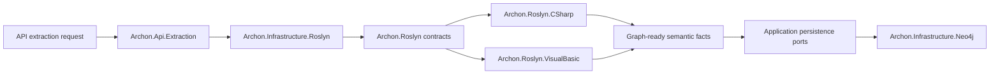

# Implementation Plan - WP006 Roslyn Semantic Extraction for C# and VB.NET

## Document Control

| Field | Value |
| --- | --- |
| Work Package | WP006 - Roslyn Semantic Extraction for C# and VB.NET |
| Target Output Path | `docs/006-Roslyn-Semantic-Extraction/plan-wp006-roslyn-semantic-extraction.md` |
| Source Specification | `docs/006-Roslyn-Semantic-Extraction/spec-wp006-roslyn-semantic-extraction.md` |
| Mandatory Wiki Guidance | `./.github/instructions/wiki.instructions.md` |
| Mandatory Documentation-Pass Guidance | `./.github/instructions/documentation-pass.instructions.md` |
| Status | Draft |

## Planning Principles

This plan translates the WP006 specification into executable vertical work items. The implementation must keep the system runnable after each work item by delivering a demonstrable semantic extraction capability through the shared extraction path and test harness, rather than building all abstractions first without executable behavior.

Implementation must follow these repository standards as hard gates, not optional cleanup:

- `./.github/instructions/wiki.instructions.md` must be followed for every work item. Wiki review is mandatory for WP006, and wiki updates are required whenever developer-facing behavior, architecture, runtime workflow, terminology, validation guidance, or contributor guidance changes or is materially clarified.
- `./.github/instructions/documentation-pass.instructions.md` must be followed in full for every task that creates, updates, reviews, or plans source code. Code is not acceptable unless the documentation-pass standard is met for every touched class, method, constructor, public parameter, and non-obvious property, including internal and other non-public types.
- Every code-writing task must include developer-level comments on every class, method, and constructor. Public methods and constructors must document every parameter. Properties whose purpose is not obvious from their names must be commented. Inline or block comments must explain purpose, logical flow, and algorithms where they materially help a developer understand the code.
- Source code must follow the repository coding standards: Allman braces, block-scoped namespaces, no top-level statements, one public type per file, nullable reference types, underscore-prefixed private fields, and separated `PackageReference` and `ProjectReference` `.csproj` item groups.
- Active work-item execution must be uninterrupted. Once implementation starts for a work item, the executor must continue through implementation, validation, documentation/wiki review, and plan-record updates. The executor must not stop for status-only messages, ordinary fixable build/test failures, or confirmation prompts. The only allowed stops are full work-item completion, explicit user interruption or direction change, or a true blocker that cannot be resolved from the specification, this plan, codebase evidence, or repository guidance.
- The Aspire AppHost must not be run by automated validation as a blocking process. WP006 validation must use targeted tests, fixture projects, in-memory Roslyn sources, repository-local test projects, and solution builds.
- Standalone implementation notes, implementation ledgers, architecture notes, or similar contributor-facing narrative records are prohibited. Current-state contributor guidance, design rationale, validation workflows, troubleshooting guidance, terminology, and extension guidance must be written into `./wiki` according to `./.github/instructions/wiki.instructions.md`.
- `wiki/home.md` must remain a landing page and must not become the default destination for detailed Roslyn extraction guidance. Detailed contributor-facing guidance must go to the correct topic page, such as `wiki/solution-architecture.md`, `wiki/api-extraction-workflow.md`, `wiki/graph-domain-model.md`, `wiki/validation-and-test-workflows.md`, `wiki/glossary.md`, or a new dedicated Roslyn semantic extraction topic page if the wiki information architecture review determines one is needed.

## Overall Project Structure

WP006 implementation is expected to work primarily in these project areas:

```text
docs/
  006-Roslyn-Semantic-Extraction/
	spec-wp006-roslyn-semantic-extraction.md
	plan-wp006-roslyn-semantic-extraction.md

src/
  Archon.Application/
  Archon.Api.Extraction/
  Archon.Roslyn/
  Archon.Roslyn.CSharp/
  Archon.Roslyn.VisualBasic/
  Archon.Roslyn.Legacy/
  Archon.Infrastructure.Roslyn/
  Archon.Infrastructure.Neo4j/

test/
  Archon.Application.Tests/
  Archon.Api.Extraction.Tests/
  Archon.Roslyn.Tests/
  Archon.Roslyn.CSharp.Tests/
  Archon.Roslyn.VisualBasic.Tests/
  Archon.Roslyn.Legacy.Tests/
  Archon.Infrastructure.Roslyn.Tests/
  Archon.Infrastructure.Neo4j.Tests/

wiki/
  home.md
  solution-architecture.md
  api-extraction-workflow.md
  graph-domain-model.md
  validation-and-test-workflows.md
  glossary.md
  roslyn-semantic-extraction.md          # create only if the wiki IA review selects a dedicated page
```

The plan assumes WP001 through WP005 have already provided the solution skeleton, core graph contracts, Neo4j persistence seams, API extraction contract, snapshot orchestration, and repository/solution/project/package extraction foundation. If implementation discovers those prerequisites are incomplete, record the discovery and adapt the implementation sequence without bypassing Onion Architecture.

## Work Items

## 1. Minimal C# Semantic Extraction Slice

- [x] Work Item 1: Deliver an end-to-end C# declaration extraction path - Completed
  - **Purpose**: Establish the smallest meaningful semantic extraction capability: a C# source document is loaded through the Roslyn infrastructure seam, processed by language-agnostic contracts and the C# extractor, accumulated as graph-ready declaration facts, and verified through tests.
  - **Acceptance Criteria**:
	- A C# fixture or in-memory source containing a namespace, type, constructor, method, property, and field can be extracted through the WP006 semantic extraction entry point.
	- `Namespace`, `Type`, `Method`, `Property`, and `Field` facts are produced with deterministic stable keys.
	- `CONTAINS` relationships connect the extracted declaration hierarchy.
	- Evidence includes repository-relative file path, line span, symbol name, containing symbol, snippet preview, and snippet hash where source text is available.
	- The slice does not require Neo4j, Aspire AppHost startup, API HTTP endpoints, MCP tools, or Discovery UI.
  - **Definition of Done**:
	- C# declaration extraction is implemented end to end through shared contracts, C# extraction code, accumulation, and tests.
	- Logging and ordinary error handling are added where the execution path has meaningful runtime decisions.
	- Source code written in this work item complies with `./.github/instructions/documentation-pass.instructions.md` in full, including comments for every class, method, constructor, public parameter, and non-obvious property, including internal and non-public code.
	- Wiki review is performed for semantic extraction terminology and architecture impact; relevant wiki or repository guidance is updated, or an explicit no-change result is recorded.
	- Foundational documentation uses book-like narrative depth for Roslyn, semantic model, stable key, and evidence concepts, defines technical terms on first use, and includes a small walkthrough where useful.
	- Can execute end to end via targeted C# Roslyn tests.
	- Executor must not stop mid-work-item unless the work item is complete, the user explicitly interrupts, or a true blocker prevents further autonomous progress.
	- [x] Task 1: Inspect existing extraction and graph contracts - Completed
	- [x] Review `Archon.Application`, `Archon.Api.Extraction`, `Archon.Roslyn`, `Archon.Infrastructure.Roslyn`, and Neo4j persistence seams created by earlier work packages.
	- [x] Identify existing node, relationship, evidence, confidence, unknown, and snapshot accumulation models.
	- [x] Record whether extension is needed for WP006 semantic facts before adding new contracts.
  - [x] Task 2: Add shared semantic extraction contracts - Completed
	- [x] Define or extend language-agnostic interfaces and request/response models for semantic document extraction.
	- [x] Add models for source language, symbol identity, declaration kind, semantic fact, relationship fact, and extraction result if not already present.
	- [x] Ensure all new source files use block-scoped namespaces, Allman braces, one public type per file, nullable reference types, and documentation-pass comments.
  - [x] Task 3: Add stable key and evidence helpers - Completed
	- [x] Implement repository-relative path normalization for semantic evidence.
	- [x] Implement deterministic stable key composition for symbols and declaration facts without using database IDs or absolute developer paths.
	- [x] Implement snippet preview and snippet hash helpers with safe handling for missing source text.
	- [x] Add unit tests for path normalization, stable key determinism, snippet preview limits, and snippet hash determinism.
  - [x] Task 4: Implement C# declaration extraction - Completed
	- [x] Use Roslyn semantic model and symbols to extract namespaces, types, constructors, methods, properties, and fields.
	- [x] Produce declaration nodes with evidence, source language, containing symbol, display name, fully qualified name, and project context.
	- [x] Produce `CONTAINS` relationships for the declaration hierarchy.
	- [x] Avoid text-only declaration discovery when compiler symbols are available.
  - [x] Task 5: Add fixture-based C# extraction tests - Completed
	- [x] Create focused C# fixture source or test project containing the required declaration shapes.
	- [x] Assert node kinds, stable keys, display names, fully qualified names, and containment relationships.
	- [x] Assert evidence file path, line span, symbol name, containing symbol, snippet preview, and snippet hash.
  - [x] Task 6: Perform documentation and wiki review for the slice - Completed
	- [x] Review whether `wiki/graph-domain-model.md`, `wiki/api-extraction-workflow.md`, `wiki/solution-architecture.md`, `wiki/glossary.md`, or a new `wiki/roslyn-semantic-extraction.md` page is the correct home for Roslyn extraction guidance.
	- [x] Update the selected wiki page if the implementation materially clarifies semantic extraction, evidence, or stable-key behavior.
	- [x] Record the wiki review result in this plan after implementation.
  - **Files**:
	- `src/Archon.Roslyn/**`: Shared semantic extraction contracts, identity, evidence, and helper logic.
	- `src/Archon.Roslyn.CSharp/**`: C# declaration extraction implementation.
	- `src/Archon.Application/**`: Shared accumulation or graph-ready fact contracts if needed.
	- `src/Archon.Infrastructure.Roslyn/**`: Workspace/document adapter seams if needed.
	- `test/Archon.Roslyn.Tests/**`: Shared helper tests.
	- `test/Archon.Roslyn.CSharp.Tests/**`: C# declaration extraction tests.
	- `wiki/**`: Topic pages selected by the mandatory wiki review.
  - **Work Item Dependencies**: WP001 through WP005 foundation outputs.
  - **Run / Verification Instructions**:
	- `dotnet test .\test\Archon.Roslyn.Tests\Archon.Roslyn.Tests.csproj`
	- `dotnet test .\test\Archon.Roslyn.CSharp.Tests\Archon.Roslyn.CSharp.Tests.csproj`
	- `dotnet build .\Archon.slnx --no-restore`
  - **User Instructions**:
	- None expected unless the required .NET SDK or Roslyn package restore support is unavailable.

  - **Completion Summary**:
	- Added shared semantic extraction contracts and helpers in `src/Archon.Roslyn/**`, including semantic requests/results, source language and declaration/relationship models, symbol identity, evidence, repository-relative path normalization, semantic stable-key generation, snippet preview creation, and snippet hashing.
	- Added `CSharpSemanticDocumentExtractor` in `src/Archon.Roslyn.CSharp/**` using Roslyn semantic model symbol resolution for namespaces, types, constructors, methods, properties, and fields, with deterministic declaration facts and direct `CONTAINS` relationship facts.
	- Added focused tests in `test/Archon.Roslyn.Tests/**` and `test/Archon.Roslyn.CSharp.Tests/**` for helper determinism, evidence behavior, declaration coverage, containment relationships, and stable-key repeatability.
	- Validation performed: `dotnet test .\test\Archon.Roslyn.Tests\Archon.Roslyn.Tests.csproj --no-restore` passed with 10 tests; `dotnet test .\test\Archon.Roslyn.CSharp.Tests\Archon.Roslyn.CSharp.Tests.csproj --no-restore` passed with 4 tests; `dotnet build .\Archon.slnx --no-restore` passed.
	- Wiki review result and impact matrix: affected concepts were Roslyn semantic model, semantic declaration fact, semantic evidence, semantic stable key, repository-relative source evidence, and C# containment extraction. Reviewed `wiki/home.md`, `wiki/solution-architecture.md`, `wiki/api-extraction-workflow.md`, `wiki/graph-domain-model.md`, `wiki/validation-and-test-workflows.md`, and `wiki/glossary.md`. Created `wiki/roslyn-semantic-extraction.md` as the dedicated topic page because the concept is foundational and too dense for `home.md`. Updated `wiki/home.md`, `wiki/solution-architecture.md`, `wiki/graph-domain-model.md`, `wiki/validation-and-test-workflows.md`, and `wiki/glossary.md`. Intentionally left `wiki/api-extraction-workflow.md` unchanged because this slice is validated directly through Roslyn tests and is not yet integrated into the API extraction workflow. Page-structure decision: `home.md` remains a concise landing page with a link to the new dedicated Roslyn page; detailed Roslyn guidance belongs in `wiki/roslyn-semantic-extraction.md` with cross-links to architecture, graph model, validation, and glossary pages.

## 2. C# Relationship, Dependency, and Attribute Slice

- [ ] Work Item 2: Extend C# semantic extraction to relationships and dependencies
  - **Purpose**: Add demonstrable C# architecture intelligence beyond declarations by extracting method calls, property access, object creation, constructor injection, inheritance, interface implementation, attributes, parameters, and return types with evidence and confidence.
  - **Acceptance Criteria**:
	- C# fixture code produces `CALLS`, `IMPLEMENTS`, `INHERITS`, `INJECTS`, and `DEPENDS_ON` relationships.
	- Attributes on assemblies, types, members, parameters, and return values are captured where relevant to architecture facts.
	- Parameters, return types, generic type parameters, and constraints are represented where the graph contract supports them.
	- Relationship facts include confidence, evidence, source symbol identity, and target symbol identity where resolved.
	- Duplicate relationships are de-duplicated deterministically.
  - **Definition of Done**:
	- C# relationship extraction is runnable through the same semantic extraction entry point as Work Item 1.
	- Unit and integration-style tests cover direct calls, constructor calls, extension methods, static calls, property access, object creation, constructor dependencies, inheritance, implementations, and attributes.
	- Logging and error handling cover meaningful degraded semantic conditions without inventing targets.
	- Source code complies with `./.github/instructions/documentation-pass.instructions.md` in full for all touched code.
	- Wiki review is performed for relationship vocabulary and dependency semantics; relevant pages are updated or an explicit no-change result is recorded.
	- Can execute end to end via targeted C# Roslyn relationship tests.
	- Executor must not stop mid-work-item unless the work item is complete, the user explicitly interrupts, or a true blocker prevents further autonomous progress.
  - [ ] Task 1: Extend relationship fact contracts if needed
	- [ ] Confirm existing relationship fact models can carry relationship kind, source identity, target identity, confidence, evidence links, metadata, and unknown reason.
	- [ ] Add missing metadata fields only where required by the WP006 specification.
	- [ ] Document every new or changed contract according to the documentation-pass standard.
  - [ ] Task 2: Implement C# symbol relationship visitors
	- [ ] Extract method calls, constructor calls, object creation, property access, and member access using semantic model APIs.
	- [ ] Extract inheritance, interface implementation, overridden member, and implemented member facts from symbols.
	- [ ] Extract constructor injection from constructor parameters with conservative confidence classification.
	- [ ] Extract attributes and related symbol dependencies.
  - [ ] Task 3: Add confidence and duplicate handling
	- [ ] Assign high confidence to compiler-resolved relationships.
	- [ ] Assign lower confidence to deterministic inferred facts where inference is required.
	- [ ] Implement deterministic de-duplication for repeated syntax, partial declarations, and accessor-related relationships.
  - [ ] Task 4: Add targeted relationship tests
	- [ ] Test direct calls, constructor calls, object creation, extension methods, static calls, property access, and delegate invocations where feasible.
	- [ ] Test base class inheritance, interface implementation, generic relationships, and overridden members.
	- [ ] Test constructor injection detection and relationship confidence.
	- [ ] Test attribute extraction and attribute-driven dependencies.
  - [ ] Task 5: Perform documentation and wiki review for relationship semantics
	- [ ] Review graph relationship vocabulary in `wiki/graph-domain-model.md`.
	- [ ] Review extraction workflow explanation in `wiki/api-extraction-workflow.md` or a dedicated Roslyn page if created.
	- [ ] Update cross-links and glossary entries for terms such as semantic model, symbol, relationship fact, confidence, and constructor injection where needed.
  - **Files**:
	- `src/Archon.Roslyn/**`: Relationship, confidence, identity, and evidence helpers.
	- `src/Archon.Roslyn.CSharp/**`: C# relationship extraction implementation.
	- `src/Archon.Application/**`: Relationship accumulation contracts if needed.
	- `test/Archon.Roslyn.Tests/**`: Shared relationship helper tests.
	- `test/Archon.Roslyn.CSharp.Tests/**`: C# relationship extraction tests.
	- `wiki/**`: Topic pages selected by the mandatory wiki review.
  - **Work Item Dependencies**: Work Item 1.
  - **Run / Verification Instructions**:
	- `dotnet test .\test\Archon.Roslyn.Tests\Archon.Roslyn.Tests.csproj`
	- `dotnet test .\test\Archon.Roslyn.CSharp.Tests\Archon.Roslyn.CSharp.Tests.csproj`
	- `dotnet build .\Archon.slnx --no-restore`
  - **User Instructions**:
	- None expected.

## 3. VB.NET Semantic Extraction Slice

- [ ] Work Item 3: Deliver VB.NET declaration and relationship extraction parity
  - **Purpose**: Make VB.NET a first-class semantic extraction target by projecting VB.NET declarations and relationships into the same graph vocabulary and evidence model as C#.
  - **Acceptance Criteria**:
	- A VB.NET fixture or test project containing namespaces, modules, classes, structures, interfaces, constructors, methods, properties, fields, events, inheritance, implementations, and method calls can be extracted through the WP006 semantic extraction entry point.
	- VB.NET facts use the same `Namespace`, `Type`, `Method`, `Property`, `Field`, `CONTAINS`, `CALLS`, `IMPLEMENTS`, `INHERITS`, `INJECTS`, and `DEPENDS_ON` vocabulary as C#.
	- VB.NET project-root namespace effects are handled where determinable.
	- VB.NET evidence, stable keys, confidence, and unknown handling match the shared model.
  - **Definition of Done**:
	- VB.NET extraction is implemented end to end through shared contracts, Visual Basic extraction code, accumulation, and tests.
	- Tests cover declaration extraction, relationship extraction, root namespace effects, default properties, modules, shared members, and constructor injection where applicable.
	- Source code complies with `./.github/instructions/documentation-pass.instructions.md` in full for all touched code.
	- Wiki review is performed for VB.NET parity and terminology; relevant pages are updated or an explicit no-change result is recorded.
	- Can execute end to end via targeted VB.NET Roslyn tests.
	- Executor must not stop mid-work-item unless the work item is complete, the user explicitly interrupts, or a true blocker prevents further autonomous progress.
  - [ ] Task 1: Implement VB.NET declaration extraction
	- [ ] Extract namespaces and project-root namespace effects where available.
	- [ ] Extract classes, structures, interfaces, enums, delegates, modules, nested types, generic types, and partial types.
	- [ ] Extract constructors, shared constructors, methods, properties, default properties, fields, events, constants, parameters, and return types.
	- [ ] Project VB.NET facts into the shared declaration graph model.
  - [ ] Task 2: Implement VB.NET relationship extraction
	- [ ] Extract method calls, shared/static calls, object creation, property access, member access, and extension-method calls where Roslyn supports resolution.
	- [ ] Extract inheritance, interface implementation, constructor dependencies, attributes, generic relationships, and relevant member dependencies.
	- [ ] Assign confidence and evidence using shared helpers.
  - [ ] Task 3: Add VB.NET tests
	- [ ] Create VB.NET fixture source or test project covering the required declaration forms.
	- [ ] Create relationship tests covering calls, inheritance, implementation, attributes, and constructor dependencies.
	- [ ] Assert that VB.NET and C# project into compatible graph vocabulary and metadata fields.
  - [ ] Task 4: Review language parity and edge cases
	- [ ] Compare C# and VB.NET extraction results for analogous fixture code.
	- [ ] Record unsupported or language-specific differences as explicit metadata, confidence reductions, or unknowns rather than hiding them.
  - [ ] Task 5: Perform documentation and wiki review for VB.NET parity
	- [ ] Review whether wiki guidance explains why VB.NET support is first-class.
	- [ ] Update glossary or Roslyn extraction guidance for terms such as module, default property, shared member, and root namespace where needed.
  - **Files**:
	- `src/Archon.Roslyn.VisualBasic/**`: VB.NET semantic extraction implementation.
	- `src/Archon.Roslyn/**`: Shared helpers extended for VB.NET if needed.
	- `test/Archon.Roslyn.VisualBasic.Tests/**`: VB.NET extraction tests.
	- `test/Archon.Roslyn.Tests/**`: Shared parity tests if needed.
	- `wiki/**`: Topic pages selected by the mandatory wiki review.
  - **Work Item Dependencies**: Work Items 1 and 2.
  - **Run / Verification Instructions**:
	- `dotnet test .\test\Archon.Roslyn.VisualBasic.Tests\Archon.Roslyn.VisualBasic.Tests.csproj`
	- `dotnet test .\test\Archon.Roslyn.Tests\Archon.Roslyn.Tests.csproj`
	- `dotnet build .\Archon.slnx --no-restore`
  - **User Instructions**:
	- None expected.

## 4. Diagnostics, Unknowns, Generated Code, Partial Types, and Metadata Symbols

- [ ] Work Item 4: Complete degraded and advanced semantic extraction handling
  - **Purpose**: Make semantic extraction robust for real-world modern and legacy repositories by handling compiler diagnostics, unresolved symbols, generated code, partial types, metadata-only symbols, dynamic dispatch, reflection, and missing references without losing deterministic output.
  - **Acceptance Criteria**:
	- Compiler diagnostics are collected and represented as evidence or extraction metadata linked to project, document, span, or symbol context where available.
	- Unresolved symbols, ambiguous overloads, missing references, unsupported syntax, dynamic dispatch, reflection targets, and late-bound calls produce explicit unknown records.
	- Generated-code files are detected by deterministic signals and marked in metadata.
	- Partial declarations merge into stable identities while preserving evidence for each contributing declaration.
	- Metadata-symbol dependencies are represented without inventing repository source nodes.
  - **Definition of Done**:
	- The extraction path continues to return resolvable facts when compilations contain diagnostics or missing references.
	- Tests cover degraded C# and VB.NET compilations, generated-code detection, partial types, metadata symbols, dynamic dispatch, reflection, and unknown records.
	- Confidence classification distinguishes compiler-resolved, inferred, generated, metadata-only, partially resolved, and unresolved facts.
	- Source code complies with `./.github/instructions/documentation-pass.instructions.md` in full for all touched code.
	- Wiki review is performed for diagnostics, unknowns, generated-code, partial-type, and metadata-symbol concepts; relevant pages are updated or an explicit no-change result is recorded.
	- Can execute end to end via targeted degraded-compilation tests.
	- Executor must not stop mid-work-item unless the work item is complete, the user explicitly interrupts, or a true blocker prevents further autonomous progress.
  - [ ] Task 1: Implement diagnostics capture
	- [ ] Collect diagnostics from C# and VB.NET compilations.
	- [ ] Normalize diagnostic ID, severity, message, file path, line span, and compiler source where available.
	- [ ] Link diagnostics to evidence or extraction metadata without blocking partial extraction.
  - [ ] Task 2: Implement unknown and confidence classification
	- [ ] Add explicit unknown records for unresolved symbols, ambiguous overloads, dynamic dispatch, reflection, missing references, and unsupported semantic forms.
	- [ ] Add confidence values and unknown reasons to affected nodes and relationships.
	- [ ] Ensure unknowns are queryable through the graph-ready accumulation model.
  - [ ] Task 3: Implement generated-code handling
	- [ ] Detect generated files using filename patterns, generated headers, generator metadata, and project conventions.
	- [ ] Mark generated facts in metadata.
	- [ ] Prevent generated facts from being double-counted when paired with hand-maintained partial declarations.
  - [ ] Task 4: Implement partial-type and partial-member merging
	- [ ] Use Roslyn symbol identity to merge partial type declarations into stable graph identities.
	- [ ] Preserve evidence for each contributing declaration.
	- [ ] Merge partial methods and partial members where Roslyn identity supports it.
  - [ ] Task 5: Implement metadata-symbol handling
	- [ ] Identify dependencies on referenced assemblies and packages where source declarations are unavailable.
	- [ ] Preserve metadata identity for later rules and external dependency analysis.
	- [ ] Prevent creation of false repository source nodes for metadata-only symbols.
  - [ ] Task 6: Add advanced handling tests
	- [ ] Test degraded C# and VB.NET compilations with missing references.
	- [ ] Test dynamic and reflection patterns produce unknowns.
	- [ ] Test generated-code detection and metadata flags.
	- [ ] Test partial type evidence aggregation and relationship de-duplication.
	- [ ] Test metadata-symbol dependencies and confidence values.
  - [ ] Task 7: Perform documentation and wiki review for degraded extraction concepts
	- [ ] Update or create wiki guidance explaining diagnostics, unknowns, confidence, generated-code handling, partial declarations, and metadata symbols in narrative form.
	- [ ] Define technical terms at first use or link to `wiki/glossary.md`.
	- [ ] Add examples or walkthroughs where they improve understanding of degraded extraction behavior.
  - **Files**:
	- `src/Archon.Roslyn/**`: Diagnostics, unknown, confidence, generated-code, partial-type, and metadata-symbol contracts/helpers.
	- `src/Archon.Roslyn.CSharp/**`: C# advanced handling integration.
	- `src/Archon.Roslyn.VisualBasic/**`: VB.NET advanced handling integration.
	- `src/Archon.Roslyn.Legacy/**`: Legacy/generated/degraded semantic interpretation helpers.
	- `test/Archon.Roslyn.Tests/**`: Shared advanced handling tests.
	- `test/Archon.Roslyn.CSharp.Tests/**`: C# degraded extraction tests.
	- `test/Archon.Roslyn.VisualBasic.Tests/**`: VB.NET degraded extraction tests.
	- `test/Archon.Roslyn.Legacy.Tests/**`: Generated-code and legacy interpretation tests.
	- `wiki/**`: Topic pages selected by the mandatory wiki review.
  - **Work Item Dependencies**: Work Items 1, 2, and 3.
  - **Run / Verification Instructions**:
	- `dotnet test .\test\Archon.Roslyn.Tests\Archon.Roslyn.Tests.csproj`
	- `dotnet test .\test\Archon.Roslyn.CSharp.Tests\Archon.Roslyn.CSharp.Tests.csproj`
	- `dotnet test .\test\Archon.Roslyn.VisualBasic.Tests\Archon.Roslyn.VisualBasic.Tests.csproj`
	- `dotnet test .\test\Archon.Roslyn.Legacy.Tests\Archon.Roslyn.Legacy.Tests.csproj`
	- `dotnet build .\Archon.slnx --no-restore`
  - **User Instructions**:
	- None expected.

## 5. Snapshot Persistence Integration and API Extraction Orchestration Slice

- [ ] Work Item 5: Connect semantic extraction to snapshot-scoped graph persistence seams
  - **Purpose**: Make WP006 facts flow through the same application extraction orchestration and graph persistence seams as earlier work packages so semantic facts are snapshot-scoped and usable by later API and MCP query work.
  - **Acceptance Criteria**:
	- Semantic extraction can be invoked from the shared API extraction orchestration path using repository root and explicit solution path inputs.
	- Graph-ready semantic nodes, relationships, evidence, diagnostics, confidence metadata, and unknowns are handed to application-layer persistence ports.
	- Neo4j-specific implementation remains outside `Archon.Roslyn`, `Archon.Roslyn.CSharp`, and `Archon.Roslyn.VisualBasic`.
	- Repeated extraction of unchanged semantic inputs produces deterministic stable keys and relationship identities.
	- Integration tests prove semantic facts reach the persistence seam or Neo4j adapter test double without running the Aspire AppHost.
  - **Definition of Done**:
	- API extraction orchestration includes WP006 semantic extraction in the appropriate sequence after project/solution loading.
	- Persistence seam tests cover nodes, relationships, evidence, diagnostics, unknowns, confidence, and snapshot association.
	- Error handling preserves partial extraction results and records degraded semantic outcomes.
	- Source code complies with `./.github/instructions/documentation-pass.instructions.md` in full for all touched code.
	- Wiki review is performed for the extraction workflow and persistence flow; relevant pages are updated or an explicit no-change result is recorded.
	- Can execute end to end via targeted API extraction and persistence-seam tests.
	- Executor must not stop mid-work-item unless the work item is complete, the user explicitly interrupts, or a true blocker prevents further autonomous progress.
  - [ ] Task 1: Wire semantic extraction into orchestration
	- [ ] Identify the existing extraction workflow sequence from WP004/WP005.
	- [ ] Add semantic extraction invocation after solution/project context is available.
	- [ ] Ensure repository root and explicit solution path list remain the entry contract.
  - [ ] Task 2: Extend accumulation-to-persistence mapping
	- [ ] Map semantic declaration facts to graph node persistence contracts.
	- [ ] Map semantic relationship facts to graph relationship persistence contracts.
	- [ ] Map evidence, diagnostics, confidence, and unknowns to snapshot-scoped persistence data.
	- [ ] Keep Neo4j-specific details inside infrastructure adapters only.
  - [ ] Task 3: Add orchestration and persistence seam tests
	- [ ] Test extraction orchestration invokes semantic extraction for C# and VB.NET projects.
	- [ ] Test graph-ready semantic facts are passed to the persistence seam with the correct snapshot association.
	- [ ] Test deterministic output across repeated extraction of unchanged inputs.
	- [ ] Test ordinary semantic failures do not prevent persistence of resolvable facts.
  - [ ] Task 4: Add logging and error handling
	- [ ] Log extraction start, completion, and degraded semantic conditions through `ILogger` abstractions.
	- [ ] Avoid custom logging callbacks.
	- [ ] Ensure exceptions that should become extraction failures are clearly distinguished from unknowns or diagnostics.
  - [ ] Task 5: Perform documentation and wiki review for workflow integration
	- [ ] Review `wiki/api-extraction-workflow.md` for semantic extraction sequence impact.
	- [ ] Review `wiki/neo4j-persistence-foundation.md` and `wiki/graph-domain-model.md` for semantic fact persistence impact.
	- [ ] Update topic pages or cross-links as needed, avoiding `wiki/home.md` as a detail dump.
  - **Files**:
	- `src/Archon.Api.Extraction/**`: Semantic extraction orchestration.
	- `src/Archon.Application/**`: Accumulation and persistence contracts if needed.
	- `src/Archon.Infrastructure.Roslyn/**`: Roslyn workspace/document loading integration.
	- `src/Archon.Infrastructure.Neo4j/**`: Persistence adapter mapping if needed.
	- `test/Archon.Api.Extraction.Tests/**`: Orchestration tests.
	- `test/Archon.Infrastructure.Neo4j.Tests/**`: Persistence seam tests if required.
	- `test/Archon.Infrastructure.Roslyn.Tests/**`: Roslyn adapter integration tests if required.
	- `wiki/**`: Topic pages selected by the mandatory wiki review.
  - **Work Item Dependencies**: Work Items 1 through 4.
  - **Run / Verification Instructions**:
	- `dotnet test .\test\Archon.Api.Extraction.Tests\Archon.Api.Extraction.Tests.csproj`
	- `dotnet test .\test\Archon.Infrastructure.Roslyn.Tests\Archon.Infrastructure.Roslyn.Tests.csproj`
	- `dotnet test .\test\Archon.Infrastructure.Neo4j.Tests\Archon.Infrastructure.Neo4j.Tests.csproj`
	- `dotnet build .\Archon.slnx --no-restore`
  - **User Instructions**:
	- None expected.

## 6. WP006 Validation, Documentation Pass, and Wiki Completion Gate

- [ ] Work Item 6: Complete final WP006 validation, documentation pass, and wiki impact record
  - **Purpose**: Close the work package by validating all WP006 slices together, enforcing source-code documentation requirements, updating contributor-facing wiki guidance, and recording the mandatory wiki impact matrix.
  - **Acceptance Criteria**:
	- All targeted WP006 tests pass.
	- The solution builds successfully.
	- A documentation-pass review has been completed for all source code touched by WP006 according to `./.github/instructions/documentation-pass.instructions.md`.
	- Wiki review has been completed according to `./.github/instructions/wiki.instructions.md`.
	- The final plan record states which wiki or repository guidance pages were updated, created, retired, or intentionally left unchanged, and why.
	- The final wiki impact matrix covers affected concepts, pages reviewed, pages updated, pages created, pages intentionally unchanged, and the page-structure decision.
  - **Definition of Done**:
	- Final validation commands have been run and recorded in this plan.
	- Any ordinary build, test, documentation, or wiki issues discovered during validation are fixed without stopping unless a true blocker is encountered.
	- Wiki pages updated for WP006 use book-like narrative depth for conceptually dense Roslyn, semantic extraction, evidence, confidence, unknown, and validation topics.
	- Technical terms are defined when first introduced or linked to `wiki/glossary.md`.
	- Relevant examples or walkthrough material is included where it materially improves understanding.
	- `wiki/home.md` remains a concise landing page and does not contain detailed Roslyn extraction guidance.
	- No standalone implementation notes, implementation ledgers, architecture notes, or substitute contributor-facing markdown artifacts are created.
	- Executor must not stop mid-work-item unless the work item is complete, the user explicitly interrupts, or a true blocker prevents further autonomous progress.
  - [ ] Task 1: Run targeted WP006 validation
	- [ ] Run `Archon.Roslyn.Tests`.
	- [ ] Run `Archon.Roslyn.CSharp.Tests`.
	- [ ] Run `Archon.Roslyn.VisualBasic.Tests`.
	- [ ] Run `Archon.Roslyn.Legacy.Tests`.
	- [ ] Run `Archon.Api.Extraction.Tests`.
	- [ ] Run `Archon.Infrastructure.Roslyn.Tests`.
	- [ ] Run `Archon.Infrastructure.Neo4j.Tests` if semantic persistence adapter code was changed.
  - [ ] Task 2: Run final build validation
	- [ ] Run `dotnet build .\Archon.slnx --no-restore` after targeted tests are passing.
	- [ ] Fix ordinary build failures caused by WP006 changes and rerun validation.
  - [ ] Task 3: Perform final documentation-pass audit
	- [ ] Inspect every hand-maintained `.cs` file touched by WP006.
	- [ ] Confirm every public API surface has local XML documentation with parameter and type-parameter documentation where applicable.
	- [ ] Confirm internal and non-public types, constructors, and methods have developer-level comments.
	- [ ] Confirm method comments explain purpose, logical flow, and non-obvious algorithms.
	- [ ] Confirm test code comments explain scenario, setup, action, assertion intent, and behavioral significance.
  - [ ] Task 4: Perform final wiki information-architecture review
	- [ ] Identify affected concepts: Roslyn semantic extraction, semantic model, symbol identity, stable keys, evidence spans, confidence, unknowns, diagnostics, generated code, partial types, metadata symbols, and validation workflow.
	- [ ] Review existing wiki pages: `wiki/home.md`, `wiki/solution-architecture.md`, `wiki/api-extraction-workflow.md`, `wiki/graph-domain-model.md`, `wiki/neo4j-persistence-foundation.md`, `wiki/validation-and-test-workflows.md`, and `wiki/glossary.md`.
	- [ ] Decide whether a new `wiki/roslyn-semantic-extraction.md` topic page is needed to keep the wiki readable.
	- [ ] Ensure detailed content is not placed in `wiki/home.md`.
	- [ ] Add or update cross-links and glossary entries where needed.
  - [ ] Task 5: Update wiki guidance or record no-change decision
	- [ ] Write current-state contributor guidance into the selected topic pages if updates are needed.
	- [ ] Use long-form narrative prose for foundational semantic extraction concepts.
	- [ ] Include examples or walkthrough fragments for extraction flow, evidence interpretation, and degraded-compilation behavior where useful.
	- [ ] If no wiki update is needed, record the pages reviewed and the reason existing guidance remains sufficient.
  - [ ] Task 6: Record final WP006 plan outcome
	- [ ] Update this plan with concise completion summaries and validation outcomes.
	- [ ] Add the final wiki impact matrix covering affected concepts, pages reviewed, pages updated, pages created, pages intentionally unchanged, and page-structure decision.
	- [ ] Link to wiki guidance instead of duplicating contributor-facing explanations in this plan.
  - **Files**:
	- `docs/006-Roslyn-Semantic-Extraction/plan-wp006-roslyn-semantic-extraction.md`: Final validation and wiki impact record.
	- `wiki/**`: Wiki pages updated, created, or reviewed by the final gate.
	- `src/**`: Source files touched by WP006 for documentation-pass review.
	- `test/**`: Test files touched by WP006 for documentation-pass review.
  - **Work Item Dependencies**: Work Items 1 through 5.
  - **Run / Verification Instructions**:
	- `dotnet test .\test\Archon.Roslyn.Tests\Archon.Roslyn.Tests.csproj`
	- `dotnet test .\test\Archon.Roslyn.CSharp.Tests\Archon.Roslyn.CSharp.Tests.csproj`
	- `dotnet test .\test\Archon.Roslyn.VisualBasic.Tests\Archon.Roslyn.VisualBasic.Tests.csproj`
	- `dotnet test .\test\Archon.Roslyn.Legacy.Tests\Archon.Roslyn.Legacy.Tests.csproj`
	- `dotnet test .\test\Archon.Api.Extraction.Tests\Archon.Api.Extraction.Tests.csproj`
	- `dotnet test .\test\Archon.Infrastructure.Roslyn.Tests\Archon.Infrastructure.Roslyn.Tests.csproj`
	- `dotnet test .\test\Archon.Infrastructure.Neo4j.Tests\Archon.Infrastructure.Neo4j.Tests.csproj` if Neo4j adapter code changed.
	- `dotnet build .\Archon.slnx --no-restore`
  - **User Instructions**:
	- Do not run the Aspire AppHost as automated validation for WP006.

## Final Wiki Impact Matrix Template

The executor must complete this matrix in Work Item 6 before WP006 is considered complete.

| Area | Result |
| --- | --- |
| Affected concepts | To be completed during Work Item 6. |
| Pages reviewed | To be completed during Work Item 6. |
| Pages updated | To be completed during Work Item 6. |
| Pages created | To be completed during Work Item 6. |
| Pages retired or split | To be completed during Work Item 6. |
| Pages intentionally unchanged | To be completed during Work Item 6. |
| Page-structure decision | To be completed during Work Item 6, including why `wiki/home.md` remains concise and why selected topic pages are the right home for detailed guidance. |
| Glossary and cross-link decision | To be completed during Work Item 6. |

## Appendix A - Architecture

### Overall Technical Approach

WP006 adds semantic source-code extraction to the existing Archon extraction pipeline. A semantic extraction is an analysis pass that uses compiler knowledge, rather than only text or syntax, to identify declarations and relationships. In Roslyn terminology, a syntax tree represents parsed source structure, a semantic model answers compiler questions about symbols and types in that tree, and a compilation represents the compiler's view of a project and its references.

The approach is to keep Roslyn-specific mechanics separated from graph persistence and host delivery. `Archon.Infrastructure.Roslyn` loads or adapts Roslyn workspaces, projects, compilations, documents, and semantic models. `Archon.Roslyn` defines language-neutral extraction contracts and helpers. `Archon.Roslyn.CSharp` and `Archon.Roslyn.VisualBasic` implement language-specific extraction and project their results into the same graph-ready vocabulary. `Archon.Api.Extraction` orchestrates the extraction sequence and hands the accumulated facts to application-layer persistence ports. `Archon.Infrastructure.Neo4j` remains responsible for Neo4j-specific persistence behavior.



The graph-ready facts include declaration nodes, relationship edges, evidence, diagnostics, confidence, and unknowns. Evidence is the traceable source for a fact, such as a source file path and line span. Confidence is a deterministic classification of how certain Archon is about a fact. An unknown is an explicit recorded gap, such as an unresolved reflection target or missing metadata reference, and is treated as useful architecture knowledge rather than a failure to hide.

### Frontend

WP006 has no frontend implementation. The work-package sequence explicitly excludes Archon Discovery UI delivery, and this plan does not create UI pages, components, front-end assets, dashboards, graph views, evidence views, or prompt panels. The consumer integration for this package is the extraction pipeline and testable graph-ready output that later API and MCP packages can expose.

### Backend

The backend architecture follows Onion Architecture. Domain and application contracts remain inward. Roslyn extraction projects depend on shared contracts and produce application-level semantic facts. Infrastructure projects provide outer adapters for Roslyn workspace loading and Neo4j persistence. Host projects remain thin and are not the home for semantic extraction behavior.

The data flow is:

1. The API extraction workflow receives a repository root and explicit solution path list from the established extraction contract.
2. The Roslyn infrastructure adapter loads project documents, compilations, semantic models, and diagnostics.
3. The shared Roslyn layer coordinates language-neutral identity, evidence, confidence, and unknown handling.
4. C# and VB.NET extractors produce declarations and relationships using Roslyn compiler APIs.
5. The extraction accumulator de-duplicates facts and attaches snapshot context.
6. Application persistence ports receive graph-ready semantic facts.
7. Neo4j infrastructure persists those facts without leaking database details back into Roslyn extraction projects.

This architecture preserves deterministic evidence-backed extraction while keeping later work packages free to build runtime extraction, data-access extraction, rules, metrics, API queries, and MCP workflows on top of the same semantic foundation.

## Summary

WP006 should be delivered as a sequence of vertical semantic extraction slices: first C# declarations, then C# relationships, then VB.NET parity, then degraded real-world handling, then snapshot persistence orchestration, and finally mandatory validation plus wiki completion. Each work item leaves the system runnable through targeted tests and a solution build. The most important implementation considerations are deterministic stable keys, compiler-resolved facts over text matching, explicit unknowns instead of invented relationships, strict Onion Architecture boundaries, full source-code documentation compliance, and mandatory wiki maintenance with detailed contributor guidance routed to the right topic pages rather than standalone notes or `wiki/home.md`.
