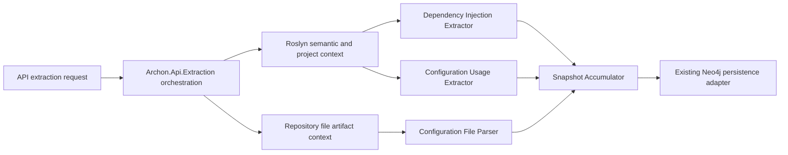

# Implementation Plan - WP007 Configuration and Dependency Injection Extraction

## Document Control

| Field | Value |
| --- | --- |
| Work Package | WP007 - Configuration and Dependency Injection Extraction |
| Target Output Path | `docs/007-Configuration-and-Dependency-Injection-Extraction/plan-wp007-configuration-and-dependency-injection-extraction.md` |
| Source Specification | `docs/007-Configuration-and-Dependency-Injection-Extraction/spec-wp007-configuration-and-dependency-injection-extraction.md` |
| WP002 Contract Source | `docs/002-Architecture-Graph-Domain-Model/spec-wp002-architecture-graph-domain-model.md` |
| Mandatory Wiki Guidance | `./.github/instructions/wiki.instructions.md` |
| Mandatory Documentation-Pass Guidance | `./.github/instructions/documentation-pass.instructions.md` |
| Status | Draft |

## Planning Principles

This plan translates the WP007 specification into executable vertical work items. Each work item must preserve a runnable system state and must deliver a demonstrable extraction capability through the established extraction or extractor test path. The plan deliberately avoids a horizontal-only sequence that builds every model first without a usable slice.

Implementation must follow these repository standards as hard gates, not optional cleanup:

- `./.github/instructions/wiki.instructions.md` must be followed for every work item. Wiki review is mandatory for WP007, and wiki updates are required whenever developer-facing behavior, architecture, runtime workflow, extraction terminology, validation guidance, or contributor guidance changes or is materially clarified.
- `./.github/instructions/documentation-pass.instructions.md` must be followed in full for every task that creates, updates, reviews, or plans source code. Code is not acceptable unless the documentation-pass standard is met for every touched class, method, constructor, public parameter, and non-obvious property, including internal and other non-public types.
- Every code-writing task must include developer-level comments on every class, method, and constructor. Public methods and constructors must document every parameter. Properties whose purpose is not obvious from their names must be commented. Inline or block comments must explain purpose, logical flow, and algorithms where they materially help a developer understand the code.
- Source code must follow repository coding standards: Allman braces, block-scoped namespaces, no top-level statements, one public type per file, nullable reference types, underscore-prefixed private fields, and separated `PackageReference` and `ProjectReference` `.csproj` item groups.
- Active work-item execution must be uninterrupted. Once implementation starts for a work item, the executor must continue through implementation, validation, documentation/wiki review, and plan-record updates. The executor must not stop for status-only messages, ordinary fixable build/test failures, or confirmation prompts. The only allowed stops are full work-item completion, explicit user interruption or direction change, or a true blocker that cannot be resolved from the specification, this plan, codebase evidence, or repository guidance.
- The Aspire AppHost must not be run by automated validation as a blocking process. WP007 validation must use targeted tests, fixture projects, application-layer extraction seams, and solution builds.
- Standalone implementation notes, implementation ledgers, architecture notes, or similar contributor-facing narrative records are prohibited. Current-state contributor guidance, design rationale, validation workflows, troubleshooting guidance, terminology, and extension guidance must be written into `./wiki` according to `./.github/instructions/wiki.instructions.md`.
- `wiki/home.md` must remain a landing page and must not become the default destination for detailed configuration or dependency-injection extraction guidance. Detailed contributor-facing guidance must go to the correct topic page or a newly created topic page selected by the mandatory wiki information-architecture review.

## Overall Project Structure

WP007 implementation is expected to work primarily in these project areas:

```text
docs/
  007-Configuration-and-Dependency-Injection-Extraction/
	spec-wp007-configuration-and-dependency-injection-extraction.md
	plan-wp007-configuration-and-dependency-injection-extraction.md

src/
  Archon.Application/
  Archon.Api.Extraction/
  Archon.Roslyn/
  Archon.Roslyn.CSharp/
  Archon.Roslyn.VisualBasic/
  Archon.Extractors.DependencyInjection/
  Archon.Extractors.Configuration/

test/
  Archon.Application.Tests/
  Archon.Api.Extraction.Tests/
  Archon.Roslyn.Tests/
  Archon.Roslyn.CSharp.Tests/
  Archon.Roslyn.VisualBasic.Tests/
  Archon.Extractors.DependencyInjection.Tests/
  Archon.Extractors.Configuration.Tests/

wiki/
  home.md
  solution-architecture.md
  api-extraction-workflow.md
  graph-domain-model.md
  roslyn-semantic-extraction.md
  validation-and-test-workflows.md
  glossary.md
  configuration-and-dependency-injection-extraction.md   # create only if the wiki IA review selects a dedicated page
```

The plan assumes WP001 through WP006 have already provided the solution skeleton, graph domain contracts, Neo4j persistence foundation, API extraction contract, repository/project extraction, and Roslyn semantic extraction foundation. If implementation discovers those prerequisites are incomplete, record the discovery and adapt the implementation sequence without bypassing Onion Architecture.

## WP002 Contract Alignment Requirements

Before adding or changing extraction contracts, each work item must verify the current WP002-derived code contracts rather than inventing a parallel model. The WP002 specification identifies these relevant contract requirements:

- `NodeKind.ConfigurationKey` exists for configuration keys.
- Reusable graph node kinds include `Project`, `Type`, `Method`, and `FilePath` for source, symbol, and artifact attachment.
- Relevant edge kinds include `USES_CONFIG`, `REGISTERED_AS_SERVICE`, `INJECTS`, and `DEPENDS_ON`.
- Evidence records can represent configuration files, source code, project files, compiler symbols, diagnostics, inferences, and generated artifacts.
- Stable-key generation is centralized and includes the `config://` prefix for configuration-key nodes.
- Snapshot accumulation accepts nodes, edges, evidence, warnings, and errors and defines deterministic duplicate handling.
- Metadata supports DI registration details, configuration provider names, connection string names, options binding details, and extraction-specific classification annotations.
- Nodes, edges, evidence, and findings require knowledge classification, confidence, and explicit unknown-state representation.

If the implemented WP002 contracts differ from the specification wording, the implementation must follow actual compiled contracts first, then update this plan's execution record and wiki guidance with the exact current behavior.

## Work Items

## 1. Minimal Microsoft DI Registration Slice

- [x] Work Item 1: Deliver an end-to-end direct `IServiceCollection` registration extraction path - Completed
  - **Completion Summary**: Implemented the minimal direct Microsoft DI registration slice in `src/Archon.Extractors.DependencyInjection` with documented request/result contracts, Roslyn-bound detection of `AddSingleton<TService, TImplementation>()`, `AddScoped<TService, TImplementation>()`, and `AddTransient<TService, TImplementation>()`, graph-ready `Type` nodes, implementation-to-service `REGISTERED_AS_SERVICE` edges, deterministic DI/evidence stable keys, lifetime metadata, confidence/unknown-state fields, and source-code evidence. Added focused tests in `test/Archon.Extractors.DependencyInjection.Tests` for relationship direction, metadata, evidence, confidence, deterministic keys, and duplicate-free accumulation. Validation performed: `dotnet test .\test\Archon.Extractors.DependencyInjection.Tests\Archon.Extractors.DependencyInjection.Tests.csproj` and `dotnet build .\Archon.slnx --no-restore` both succeeded. Wiki review result: created `wiki/configuration-and-dependency-injection-extraction.md`; updated `wiki/home.md`, `wiki/graph-domain-model.md`, `wiki/roslyn-semantic-extraction.md`, `wiki/validation-and-test-workflows.md`, and `wiki/glossary.md`; intentionally left `wiki/api-extraction-workflow.md` structurally unchanged because Work Item 1 adds the extractor slice and tests but does not yet compose it into the API orchestration path. Wiki impact matrix: affected concepts were DI registration extraction, `REGISTERED_AS_SERVICE` direction, lifetime metadata, Roslyn evidence, stable keys, and validation commands; pages reviewed were `home.md`, `graph-domain-model.md`, `roslyn-semantic-extraction.md`, `api-extraction-workflow.md`, `validation-and-test-workflows.md`, and `glossary.md`; pages updated were `home.md`, `graph-domain-model.md`, `roslyn-semantic-extraction.md`, `validation-and-test-workflows.md`, and `glossary.md`; page created was `configuration-and-dependency-injection-extraction.md`; pages intentionally unchanged were `api-extraction-workflow.md` beyond review because API pipeline behavior is unchanged; page-structure decision was to create a dedicated topic page and keep `home.md` as a concise landing page.
  - **Purpose**: Establish the smallest meaningful WP007 vertical slice: a C# fixture containing direct Microsoft DI registrations is analyzed through the dependency-injection extractor, projected into WP002 graph contracts, accumulated into snapshot output, and verified with tests.
  - **Acceptance Criteria**:
	- Direct `AddSingleton<TService, TImplementation>()`, `AddScoped<TService, TImplementation>()`, and `AddTransient<TService, TImplementation>()` calls are detected in a C# fixture.
	- `REGISTERED_AS_SERVICE` relationships are emitted using the established graph relationship direction from compiled WP002/domain contracts.
	- Lifetime metadata uses `Singleton`, `Scoped`, `Transient`, or `Unknown` exactly as the WP007 specification requires.
	- Registration evidence includes repository-relative file path, line span where available, symbol name, containing symbol, snippet hash, and snippet preview.
	- The slice runs without Neo4j direct writes, Aspire AppHost startup, API query endpoints, MCP tools, or Discovery UI.
  - **Definition of Done**:
	- Direct Microsoft DI extraction is implemented end to end through shared contracts, extractor code, accumulation, and tests.
	- WP002 graph contracts are used or extended only through the correct application/domain contract seams.
	- Logging and ordinary error handling are added where the execution path has meaningful runtime decisions.
	- Source code written in this work item complies with `./.github/instructions/documentation-pass.instructions.md` in full, including comments for every class, method, constructor, public parameter, and non-obvious property, including internal and non-public code.
	- Wiki review is performed for DI extraction terminology and graph relationship semantics; relevant wiki or repository guidance is updated, or an explicit no-change result is recorded.
	- Foundational documentation uses book-like narrative depth for dependency injection, service registration, graph facts, stable keys, evidence, and confidence concepts; technical terms are defined on first use or linked to glossary entries.
	- Can execute end to end via targeted dependency-injection extractor tests.
	- Executor must not stop mid-work-item unless the work item is complete, the user explicitly interrupts, or a true blocker prevents further autonomous progress.
	- [x] Task 1: Inspect existing WP002 and WP006 contracts - Completed
	- [x] Step 1: Locate compiled domain/application types for node kinds, edge kinds, evidence kinds, knowledge classification, confidence, unknown state, metadata, stable keys, fingerprints, and snapshot accumulation. Completed by inspecting compiled graph/domain/application contracts including `NodeKind`, `EdgeKind`, `EvidenceKind`, `KnowledgeKind`, graph models, identity helpers, metadata, fingerprints, and `ArchitectureSnapshotAccumulator`.
	- [x] Step 2: Confirm relationship direction for `REGISTERED_AS_SERVICE`, `INJECTS`, `DEPENDS_ON`, and `USES_CONFIG` from code or tests. Completed by confirming compiled edge kinds and using WP007 FR-050's implementation-to-service direction because no compiled tests contradicted that direction.
	- [x] Step 3: Confirm how Roslyn semantic facts expose invocation, symbol identity, source spans, and containing-symbol evidence. Completed by inspecting Roslyn semantic request/evidence/result contracts and C# semantic extractor behavior.
  - [x] Task 2: Add or align DI extraction entry contracts - Completed
	- [x] Step 1: Define the smallest extractor-facing request and result model required to process a semantic document or project context. Added `DependencyInjectionExtractionRequest` and `DependencyInjectionExtractionResult`.
	- [x] Step 2: Reuse existing snapshot accumulation models for nodes, edges, evidence, warnings, and errors. Used `ArchitectureSnapshotAccumulator` and `ExtractedArchitectureSnapshot` directly.
	- [x] Step 3: Document every new or changed contract according to the mandatory documentation-pass standard. Added XML/developer-level comments to new production contracts and extractor code.
  - [x] Task 3: Implement direct registration detection - Completed
	- [x] Step 1: Detect direct `IServiceCollection` registration calls using Roslyn symbol identity where available. Implemented Roslyn-bound detection against `Microsoft.Extensions.DependencyInjection.ServiceCollectionServiceExtensions`.
	- [x] Step 2: Extract service type, implementation type, lifetime, registration method, registration source file, containing method, and confidence. Extracted compiler-resolved generic type arguments, lifetime, method/source metadata, repository-relative file evidence, containing method evidence, and certain confidence.
	- [x] Step 3: Emit graph-ready registration relationships with metadata and evidence. Emitted type nodes, source-code evidence, and direct `REGISTERED_AS_SERVICE` edges with deterministic metadata and fingerprints.
  - [x] Task 4: Add focused tests - Completed
	- [x] Step 1: Create fixture code containing direct singleton, scoped, and transient registrations. Added in-memory C# fixture in `DirectMicrosoftDependencyInjectionExtractorTests`.
	- [x] Step 2: Assert relationship kind, source/target stable keys, metadata, confidence, and evidence. Added assertions for `REGISTERED_AS_SERVICE`, implementation-to-service endpoints, lifetime metadata, certain confidence, known unknown-state, and evidence details.
	- [x] Step 3: Assert repeated extraction produces deterministic keys and no duplicate relationships. Added repeated extraction assertions for stable node, edge, and evidence keys and duplicate-free edge output.
  - [x] Task 5: Perform documentation and wiki review for the slice - Completed
	- [x] Step 1: Review `wiki/graph-domain-model.md`, `wiki/roslyn-semantic-extraction.md`, `wiki/api-extraction-workflow.md`, `wiki/validation-and-test-workflows.md`, `wiki/glossary.md`, and whether a new DI/configuration extraction page is needed. Completed review and selected a dedicated new topic page.
	- [x] Step 2: Update selected wiki pages if the implementation materially clarifies service registration facts, DI terminology, or validation workflow. Created `wiki/configuration-and-dependency-injection-extraction.md` and updated selected cross-links, graph/Roslyn explanation, validation workflow, and glossary terms.
	- [x] Step 3: Record the wiki review result in this plan after implementation. Recorded the wiki impact matrix and page-structure decision in this Work Item 1 completion summary.
  - **Files**:
	- `src/Archon.Extractors.DependencyInjection/**`: Direct DI registration extraction implementation.
	- `src/Archon.Application/**`: Shared extraction or accumulation contracts only if needed.
	- `src/Archon.Roslyn/**`: Shared invocation/evidence helper extensions only if needed.
	- `test/Archon.Extractors.DependencyInjection.Tests/**`: Direct DI registration tests.
	- `wiki/**`: Topic pages selected by mandatory wiki review.
  - **Work Item Dependencies**: WP001 through WP006 foundation outputs.
  - **Run / Verification Instructions**:
	- `dotnet test .\test\Archon.Extractors.DependencyInjection.Tests\Archon.Extractors.DependencyInjection.Tests.csproj`
	- `dotnet build .\Archon.slnx --no-restore`
  - **User Instructions**:
	- None expected unless package restore or the required .NET SDK is unavailable.

## 2. Complete Microsoft DI, Hosted Service, and HttpClient Slice

- [x] Work Item 2: Expand Microsoft DI extraction to factory, `TryAdd`, hosted-service, and `HttpClient` registrations - Completed
  - **Completion Summary**: Expanded `DirectMicrosoftDependencyInjectionExtractor` while preserving the Work Item 1 entry point. Added documented descriptor classification for standard Microsoft DI overloads, service-only generic registrations, `typeof(...)` registrations, factory registrations with explicit unknown implementation state, descriptor-based `TryAdd`, `TryAddEnumerable`, and `Replace`, `AddHostedService<T>()`, hosted-service/background-service assignability metadata, and default/named/typed/typed-implementation `AddHttpClient` registrations with explicit unknown target metadata. Added `AdvancedMicrosoftDependencyInjectionExtractorTests` covering advanced Microsoft DI overloads, hosted services, background services, named clients, typed clients, metadata, confidence, unknowns, and evidence-bearing graph output. Validation performed: `dotnet test .\test\Archon.Extractors.DependencyInjection.Tests\Archon.Extractors.DependencyInjection.Tests.csproj` succeeded with 6 tests passing; `dotnet build .\Archon.slnx --no-restore` succeeded. Wiki review result: updated `wiki/configuration-and-dependency-injection-extraction.md`, `wiki/validation-and-test-workflows.md`, and `wiki/glossary.md`; reviewed the existing page structure and kept the dedicated DI/configuration topic page as the correct home. Wiki impact matrix: affected concepts were advanced Microsoft DI overloads, factory unknowns, descriptor-based registration families, hosted services, background services, HttpClientFactory, named clients, typed clients, and unknown external targets; pages reviewed were `configuration-and-dependency-injection-extraction.md`, `validation-and-test-workflows.md`, `glossary.md`, and `home.md`; pages updated were `configuration-and-dependency-injection-extraction.md`, `validation-and-test-workflows.md`, and `glossary.md`; pages created were none; pages intentionally unchanged included `home.md` because the existing reader path remained sufficient; page-structure decision was to keep detailed guidance on the dedicated topic page and keep `home.md` as a concise landing page.
  - **Purpose**: Extend the proven DI extraction path to cover the complete modern Microsoft DI registration set required by WP007, including service factories, hosted services, background services, typed clients, named clients, and related metadata.
  - **Acceptance Criteria**:
	- `AddSingleton<TService>()`, `AddScoped<TService>()`, `AddTransient<TService>()`, `typeof(...)` overloads, factory overloads, `TryAdd`, `TryAddEnumerable`, and `Replace` are detected where symbol analysis supports them.
	- `AddHostedService<T>()`, `IHostedService`, and `BackgroundService` registration facts are detected with hosted-service metadata.
	- Named and typed `AddHttpClient` registrations are detected with client kind, client name, typed client type, implementation type, configuration delegate evidence, and unknown target metadata where needed.
	- Factory registrations with unresolved concrete implementations produce explicit unknowns rather than invented implementations.
	- Tests verify C# coverage and any shared helper behavior needed for VB.NET parity later.
  - **Definition of Done**:
	- Modern Microsoft DI registration extraction remains runnable through the same entry point as Work Item 1.
	- Unit and integration-style tests cover each supported registration family and confidence outcome.
	- Logging and error handling cover unresolved implementation types and unsupported overload shapes without failing the whole extraction slice.
	- Source code complies with `./.github/instructions/documentation-pass.instructions.md` in full for all touched code.
	- Wiki review is performed for hosted service, background service, factory registration, and `HttpClientFactory` terminology; relevant pages are updated or an explicit no-change result is recorded.
	- Can execute end to end via targeted dependency-injection extractor tests.
	- Executor must not stop mid-work-item unless the work item is complete, the user explicitly interrupts, or a true blocker prevents further autonomous progress.
	- [x] Task 1: Extend registration pattern catalog - Completed
	- [x] Step 1: Add symbol-based descriptors for remaining Microsoft DI registration APIs. Added owner-type based descriptor dispatch for standard, descriptor-based, hosted-service, and HttpClientFactory extension methods.
	- [x] Step 2: Add descriptor metadata for lifetime, registration family, hosted-service flag, and `HttpClient` client kind. Added metadata for lifetime, registration family, hosted/background flags, HttpClient kind, client name, typed client type, configuration delegate preview, and unknown target.
	- [x] Step 3: Ensure descriptor code is documented according to the documentation-pass standard. Expanded XML and developer-level comments across the descriptor catalog and helper methods.
  - [x] Task 2: Implement advanced DI registration extraction - Completed
	- [x] Step 1: Extract service-only registrations and map implementation-to-service according to Microsoft DI semantics. Implemented service-only generic overloads as self-registrations.
	- [x] Step 2: Extract factory registrations and unresolved implementation unknowns. Implemented factory registrations with explicit unknown implementation state and medium confidence.
	- [x] Step 3: Extract `TryAdd`, `TryAddEnumerable`, and `Replace` metadata. Implemented descriptor-based extraction from nested `ServiceDescriptor` factory calls with family metadata.
  - [x] Task 3: Implement hosted-service extraction - Completed
	- [x] Step 1: Detect `AddHostedService<T>()` calls. Implemented `AddHostedService<T>()` detection mapped to `IHostedService`.
	- [x] Step 2: Detect registrations assignable to `IHostedService` and derived from `BackgroundService` where semantic resolution is available. Added Roslyn interface and base-type checks for hosted/background metadata.
	- [x] Step 3: Preserve hosted-service-specific metadata for later runtime extraction and query work. Added `hostedService` and `backgroundService` metadata flags.
  - [x] Task 4: Implement `HttpClient` registration extraction - Completed
	- [x] Step 1: Detect unnamed, named, typed, and implementation-based `AddHttpClient` registrations. Implemented default, named, typed, and typed-implementation descriptor creation.
	- [x] Step 2: Capture configuration delegate source evidence and base-address configuration clues where detectable. Captured compact configuration delegate previews for registrations with delegates.
	- [x] Step 3: Emit unknown target details when the external target cannot be resolved deterministically. Added explicit unknown state and `unknownTarget` metadata for named and typed HttpClient registrations.
  - [x] Task 5: Add tests and validation - Completed
	- [x] Step 1: Add fixtures for advanced Microsoft DI overloads, hosted services, background services, named clients, and typed clients. Added `AdvancedMicrosoftDependencyInjectionExtractorTests` with in-memory Roslyn fixture stubs.
	- [x] Step 2: Assert metadata, confidence, unknowns, and evidence. Added assertions for registration family, hosted/background flags, HttpClient metadata, unknown state, and existing evidence behavior.
	- [x] Step 3: Validate deterministic de-duplication across repeated detection paths. Existing deterministic key tests remained passing under the expanded extractor, and all targeted DI tests passed.
  - [x] Task 6: Perform documentation and wiki review - Completed
	- [x] Step 1: Review whether wiki guidance defines hosted service, background service, factory registration, typed client, named client, and unknown target. Reviewed the dedicated DI/configuration topic page, validation page, glossary, and landing page reader path.
	- [x] Step 2: Update selected topic pages and glossary entries if needed. Updated the dedicated DI/configuration topic page, validation workflow, and glossary.
	- [x] Step 3: Record the wiki review result in this plan after implementation. Recorded the wiki impact matrix and page-structure decision in this Work Item 2 completion summary.
  - **Files**:
	- `src/Archon.Extractors.DependencyInjection/**`: Advanced Microsoft DI, hosted-service, and `HttpClient` extraction.
	- `src/Archon.Roslyn/**`: Shared helper changes only if needed.
	- `test/Archon.Extractors.DependencyInjection.Tests/**`: Advanced DI and `HttpClient` registration tests.
	- `wiki/**`: Topic pages selected by mandatory wiki review.
  - **Work Item Dependencies**: Work Item 1.
  - **Run / Verification Instructions**:
	- `dotnet test .\test\Archon.Extractors.DependencyInjection.Tests\Archon.Extractors.DependencyInjection.Tests.csproj`
	- `dotnet build .\Archon.slnx --no-restore`
  - **User Instructions**:
	- None expected.

## 3. Registration Wrapper and Constructor Correlation Slice

- [x] Work Item 3: Detect registration wrapper methods and correlate services with constructor dependencies - Completed
  - **Completion Summary**: Implemented wrapper-aware Microsoft DI extraction in `src/Archon.Extractors.DependencyInjection/DirectMicrosoftDependencyInjectionExtractor.cs` so the existing dependency-injection entry point now follows compiler-bound methods that accept `IServiceCollection`, analyzes wrapper bodies for supported registrations, preserves wrapper invocation evidence alongside inner registration evidence, records invocation-chain and wrapper-depth metadata, emits warnings for recursion-depth limits, wrapper cycles, unavailable wrapper source bodies, and unsupported dynamic invocation, and correlates registered implementation constructors into deterministic `INJECTS` and `DEPENDS_ON` edges with constructor-parameter metadata. Added `test/Archon.Extractors.DependencyInjection.Tests/WrapperMicrosoftDependencyInjectionExtractorTests.cs` covering wrapper traversal, module-like registration methods, cycle/depth/missing-source/dynamic safeguards, constructor dependency correlation, and duplicate-stable relationship keys. Validation performed: `dotnet test .\test\Archon.Extractors.DependencyInjection.Tests\Archon.Extractors.DependencyInjection.Tests.csproj --no-restore` succeeded with 9 tests passed, and `dotnet build .\Archon.slnx --no-restore` succeeded. Wiki review result: updated `wiki/configuration-and-dependency-injection-extraction.md` with wrapper traversal, invocation-chain, safeguard, constructor-correlation, evidence, and stable-key guidance; updated `wiki/glossary.md` for registration wrapper and constructor correlation terminology; updated `wiki/validation-and-test-workflows.md` for WP007 wrapper and constructor-correlation validation coverage. Wiki impact matrix: affected concepts were registration wrappers, invocation chains, wrapper evidence, traversal safeguards, constructor injection correlation, `INJECTS`/`DEPENDS_ON` duplicate semantics, and DI validation commands; pages reviewed were `wiki/configuration-and-dependency-injection-extraction.md`, `wiki/glossary.md`, `wiki/validation-and-test-workflows.md`, and `wiki/home.md`; pages updated were `configuration-and-dependency-injection-extraction.md`, `glossary.md`, and `validation-and-test-workflows.md`; no pages were created or retired; `home.md` was intentionally unchanged because the existing dedicated WP007 topic page remains the correct destination and `home.md` remains only a landing page.
  - **Purpose**: Make DI extraction useful for real-world systems where startup code delegates service registration to extension methods or modules, and connect registration facts to constructor dependency facts produced by Roslyn semantic extraction.
  - **Acceptance Criteria**:
	- Extension methods that accept `IServiceCollection` and invoke registration APIs inside their body are detected.
	- Startup or module calls into wrapper methods preserve invocation-chain metadata where practical.
	- Unresolvable wrapper implementations produce warnings or unknown registration-source facts instead of invented registrations.
	- Registered implementation types are correlated with existing constructor dependency facts where symbol identity is available.
	- Duplicate `INJECTS` and `DEPENDS_ON` relationships are avoided when WP006 semantic extraction already emitted equivalent facts.
  - **Definition of Done**:
	- Wrapper traversal and constructor correlation run through the same dependency-injection extraction entry point.
	- Recursion depth, cycle detection, missing source, partial compilation failure, and unsupported dynamic invocation safeguards are implemented and tested.
	- Source code complies with `./.github/instructions/documentation-pass.instructions.md` in full for all touched code.
	- Wiki review is performed for wrapper registration, invocation chain, constructor correlation, and duplicate graph fact semantics; relevant pages are updated or an explicit no-change result is recorded.
	- Can execute end to end via targeted dependency-injection extractor tests.
	- Executor must not stop mid-work-item unless the work item is complete, the user explicitly interrupts, or a true blocker prevents further autonomous progress.
	- [x] Task 1: Implement wrapper method discovery
	- [x] Step 1: Identify extension methods accepting `IServiceCollection`.
	- [x] Step 2: Analyze wrapper method bodies for supported DI registration calls.
	- [x] Step 3: Preserve both wrapper invocation evidence and inner registration evidence.
  - [x] Task 2: Implement traversal safeguards
	- [x] Step 1: Add recursion depth limits.
	- [x] Step 2: Add wrapper cycle detection.
	- [x] Step 3: Emit warnings or unknowns for missing source, partial compilation failure, and unsupported dynamic invocation.
  - [x] Task 3: Correlate service registrations with constructor dependencies
	- [x] Step 1: Match registered implementation type symbols to constructor dependency facts from WP006 semantic extraction where available.
	- [x] Step 2: Emit or reuse `INJECTS` and `DEPENDS_ON` relationships according to WP002 graph contracts.
	- [x] Step 3: Deduplicate equivalent relationships by stable key and fingerprint.
  - [x] Task 4: Add tests
	- [x] Step 1: Add fixtures for nested wrappers, module registration methods, missing wrapper source, and wrapper cycles.
	- [x] Step 2: Add fixtures for constructor dependency correlation and duplicate semantic/DI facts.
	- [x] Step 3: Assert warnings, unknowns, evidence links, and stable metadata.
  - [x] Task 5: Perform documentation and wiki review
	- [x] Step 1: Review whether selected wiki pages explain wrapper registration and constructor correlation clearly.
	- [x] Step 2: Add a short walkthrough if it materially improves contributor understanding.
	- [x] Step 3: Record the wiki review result in this plan after implementation.
  - **Files**:
	- `src/Archon.Extractors.DependencyInjection/**`: Wrapper traversal, safeguards, constructor correlation, and deduplication.
	- `src/Archon.Application/**`: Accumulation or duplicate-handling integration only if needed.
	- `test/Archon.Extractors.DependencyInjection.Tests/**`: Wrapper and constructor-correlation tests.
	- `wiki/**`: Topic pages selected by mandatory wiki review.
  - **Work Item Dependencies**: Work Items 1 and 2; WP006 constructor dependency facts.
  - **Run / Verification Instructions**:
	- `dotnet test .\test\Archon.Extractors.DependencyInjection.Tests\Archon.Extractors.DependencyInjection.Tests.csproj`
	- `dotnet build .\Archon.slnx --no-restore`
  - **User Instructions**:
	- None expected.

## 4. Modern Configuration File, Key, Options, and Redaction Slice

- [x] Work Item 4: Deliver modern `appsettings` and options binding extraction with secret redaction - Completed
  - **Completion Summary**: Implemented the modern configuration extraction vertical slice in `src/Archon.Extractors.Configuration` with documented request/result contracts and `ModernConfigurationExtractor`. The extractor discovers `appsettings.json` and `appsettings.*.json` files as data artifacts, parses nested JSON into normalized colon-delimited configuration keys, emits `ConfigurationKey` nodes using centralized `config://` stable keys, creates redacted configuration evidence, detects modern Roslyn-bound `IConfiguration` indexer usage, `GetSection`, `Bind`, `Get<T>`, `Configure<TOptions>`, and `IOptions<T>`/`IOptionsMonitor<T>`/`IOptionsSnapshot<T>` injection, emits `USES_CONFIG` relationships to configuration keys, models dynamic keys as medium-confidence explicit unknowns, and redacts secret-like values before snippets, metadata, diagnostics, or tests can expose them. Added `test/Archon.Extractors.Configuration.Tests/ModernConfigurationExtractorTests.cs` and updated project references/package references for Roslyn-based tests. Validation performed: `dotnet test .\test\Archon.Extractors.Configuration.Tests\Archon.Extractors.Configuration.Tests.csproj --no-restore` succeeded with 4 tests passed, and `dotnet build .\Archon.slnx --no-restore` succeeded. Wiki review result: updated `wiki/configuration-and-dependency-injection-extraction.md` with modern appsettings, options binding, dynamic unknown-key, stable-key, evidence, and redaction guidance; updated `wiki/glossary.md` for configuration key and secret redaction terminology; updated `wiki/validation-and-test-workflows.md` with the configuration extractor validation path; updated `wiki/home.md` only with concise reader-path and capability-summary wording while preserving it as a landing page. Wiki impact matrix: affected concepts were modern appsettings parsing, configuration key normalization, `config://` stable keys, `USES_CONFIG` relationships, options binding and options injection, dynamic configuration-key unknowns, secret redaction, and targeted configuration validation; pages reviewed were `configuration-and-dependency-injection-extraction.md`, `glossary.md`, `validation-and-test-workflows.md`, and `home.md`; pages updated were all four reviewed pages; no pages were created or retired; page-structure decision was to keep the dedicated WP007 topic page as the correct home for detailed guidance and keep `home.md` concise.
  - **Purpose**: Establish the configuration extraction vertical path by parsing modern configuration files and code usage into `ConfigurationKey` nodes, `USES_CONFIG` relationships, evidence, metadata, confidence, unknowns, and redacted snippets.
  - **Acceptance Criteria**:
	- `appsettings.json` and `appsettings.*.json` files are detected and parsed as data files without executing target application code.
	- Hierarchical JSON keys are normalized deterministically using the repository-established configuration key format.
	- `IConfiguration`, `GetSection`, indexer access, `Bind`, `Get<T>`, `Configure<TOptions>`, `IOptions<T>`, `IOptionsMonitor<T>`, and `IOptionsSnapshot<T>` usage is detected where semantic evidence exists.
	- `ConfigurationKey` nodes use centralized stable-key generation with the WP002 `config://` prefix.
	- `USES_CONFIG` relationships connect relevant projects, types, methods, or options types to configuration keys according to compiled graph contracts.
	- Secret-like values are redacted before evidence, metadata, warnings, errors, logs, or test output can expose them.
  - **Definition of Done**:
	- Modern configuration extraction is runnable through targeted configuration extractor tests and, where available, the application extraction seam.
	- Secret redaction behavior is deterministic and tested.
	- Dynamic or constructed configuration keys produce lower confidence and explicit unknowns where appropriate.
	- Source code complies with `./.github/instructions/documentation-pass.instructions.md` in full for all touched code.
	- Wiki review is performed for configuration key, options binding, provider, redaction, and unknown key terminology; relevant pages are updated or an explicit no-change result is recorded.
	- Can execute end to end via targeted configuration extractor tests.
	- Executor must not stop mid-work-item unless the work item is complete, the user explicitly interrupts, or a true blocker prevents further autonomous progress.
	- [x] Task 1: Implement JSON configuration artifact discovery and parsing
	- [x] Step 1: Discover `appsettings.json` and `appsettings.*.json` files from repository artifact context.
	- [x] Step 2: Parse nested JSON paths and environment suffix metadata.
	- [x] Step 3: Produce file evidence with source path, line span where available, key path, snippet hash, and redacted snippet preview.
  - [x] Task 2: Implement key normalization and stable-key generation
	- [x] Step 1: Normalize hierarchical JSON keys deterministically.
	- [x] Step 2: Use the centralized stable-key component and `config://` prefix.
	- [x] Step 3: Add tests for equivalent key normalization and repository-relative path independence.
  - [x] Task 3: Implement modern configuration API usage detection
	- [x] Step 1: Detect `IConfiguration` injection and usage.
	- [x] Step 2: Detect `GetSection`, indexer access, `Bind`, `Get<T>`, and `Configure<TOptions>`.
	- [x] Step 3: Detect options injection and map options types to configuration sections where the binding source is deterministic.
  - [x] Task 4: Implement secret redaction
	- [x] Step 1: Add deterministic secret-like key and value detection for password-like keys, connection-string secrets, tokens, API keys, private keys, certificates, and client secrets.
	- [x] Step 2: Redact before adding snippets, metadata, warnings, or errors to snapshot output.
	- [x] Step 3: Test that sensitive values do not appear in evidence previews, metadata, warnings, errors, logs, or test failure messages.
  - [x] Task 5: Add tests
	- [x] Step 1: Add fixtures for nested appsettings files, environment-specific variants, options binding, dynamic keys, and secret-like values.
	- [x] Step 2: Assert `ConfigurationKey` nodes, `USES_CONFIG` relationships, evidence, confidence, metadata, redaction, and unknowns.
	- [x] Step 3: Assert no target application configuration code is executed.
  - [x] Task 6: Perform documentation and wiki review
	- [x] Step 1: Review whether the selected wiki pages explain configuration key normalization, options binding, and redaction.
	- [x] Step 2: Add examples or walkthroughs if they materially improve contributor understanding.
	- [x] Step 3: Record the wiki review result in this plan after implementation.
  - **Files**:
	- `src/Archon.Extractors.Configuration/**`: Modern configuration parsing, API detection, key normalization, options binding, and redaction.
	- `src/Archon.Roslyn/**`: Shared invocation or evidence helpers only if needed.
	- `test/Archon.Extractors.Configuration.Tests/**`: Modern configuration and redaction tests.
	- `wiki/**`: Topic pages selected by mandatory wiki review.
  - **Work Item Dependencies**: WP002 graph contracts; WP006 semantic invocation and evidence support.
  - **Run / Verification Instructions**:
	- `dotnet test .\test\Archon.Extractors.Configuration.Tests\Archon.Extractors.Configuration.Tests.csproj`
	- `dotnet build .\Archon.slnx --no-restore`
  - **User Instructions**:
	- None expected.

## 5. Legacy Configuration Slice

- [x] Work Item 5: Extract `.config`, `ConfigurationManager`, custom sections, binding redirects, and connection strings - Completed
  - **Completion Summary**: Implemented legacy extraction in dedicated `src/Archon.Extractors.Configuration/LegacyConfigurationExtractor.cs` for `.config` discovery and XML parsing of `appSettings`, `connectionStrings`, declared custom sections, custom section payload evidence, binding redirects, malformed XML warnings, category-prefixed legacy configuration keys, source-defined key correlation, `ConfigurationManager.AppSettings` and `ConfigurationManager.ConnectionStrings` usage detection, unknown-source-provider facts, connection-string/custom-section redaction, and legacy metadata classification. `src/Archon.Extractors.Configuration/ModernConfigurationExtractor.cs` is corrected to remain focused on modern appsettings/options extraction only. Added `src/Archon.Extractors.Configuration/ConfigurationExtractor.cs` as the higher-level composition entry point that runs the modern and legacy slices and merges their snapshots through `ArchitectureSnapshotAccumulator`. Added `test/Archon.Extractors.Configuration.Tests/LegacyConfigurationExtractorTests.cs` covering app settings, connection strings, custom sections, binding redirects, malformed XML, redaction, known and missing `ConfigurationManager` references, confidence, unknowns, warnings, and deterministic graph facts; also added modern boundary coverage proving `ModernConfigurationExtractor` ignores legacy `.config`/`ConfigurationManager` facts and composed extractor coverage proving `ConfigurationExtractor` returns both modern and legacy facts. Validation performed after composition correction: `dotnet test .\test\Archon.Extractors.Configuration.Tests\Archon.Extractors.Configuration.Tests.csproj --no-restore` succeeded with 9 tests, and `dotnet build .\Archon.slnx --no-restore` succeeded. Documentation-pass review result: touched production and test code includes XML/developer comments for the added classes, methods, parameters, and implementation flow. Wiki review result: updated `wiki/configuration-and-dependency-injection-extraction.md`, `wiki/glossary.md`, and `wiki/validation-and-test-workflows.md` for legacy `.config`, `ConfigurationManager`, binding redirects, connection-string redaction, custom section redaction, malformed XML warnings, unknown-source-provider terminology, the explicit `ModernConfigurationExtractor`/`LegacyConfigurationExtractor` responsibility boundary, and the top-level `ConfigurationExtractor` composition layer. Wiki impact matrix: affected concepts were legacy XML configuration artifacts, extractor responsibility boundaries, composed configuration extraction, `ConfigurationManager` usage, connection-string names as configuration facts, custom sections, binding redirects, malformed XML diagnostics, machine-level configuration assumptions, secret redaction, and validation commands; pages reviewed were `configuration-and-dependency-injection-extraction.md`, `glossary.md`, `validation-and-test-workflows.md`, and `home.md`; pages updated were `configuration-and-dependency-injection-extraction.md`, `glossary.md`, and `validation-and-test-workflows.md`; pages created or retired were none; pages intentionally unchanged included `home.md` because it remains a landing page and the existing dedicated WP007 topic link remains the correct reader path. Page-structure decision: the existing dedicated WP007 topic page remains the correct home for detailed DI/configuration extraction guidance, with glossary and validation pages carrying supporting terminology and command updates.
  - **Purpose**: Extend configuration extraction to legacy .NET configuration models that are common in enterprise estates and required by WP007.
  - **Acceptance Criteria**:
	- `app.config` and `web.config` artifacts are detected and parsed as XML data files.
	- `appSettings`, `connectionStrings`, custom XML configuration sections, binding redirects, and machine-level configuration assumptions are detected where evidence exists.
	- `ConfigurationManager.AppSettings` and `ConfigurationManager.ConnectionStrings` usages are detected in C# and VB.NET where Roslyn supports semantic detection.
	- Connection-string names become configuration facts with metadata identifying them as connection strings while values remain redacted.
	- Malformed or unreadable XML produces warnings and partial facts where possible instead of silent omission.
  - **Definition of Done**:
	- Legacy configuration extraction is runnable through the same configuration extractor test path as Work Item 4.
	- XML evidence includes file path, element path, line span where available, snippet hash, and redacted snippet preview.
	- Source code complies with `./.github/instructions/documentation-pass.instructions.md` in full for all touched code.
	- Wiki review is performed for legacy configuration, binding redirect, connection-string redaction, and machine-level assumption terminology; relevant pages are updated or an explicit no-change result is recorded.
	- Can execute end to end via targeted configuration extractor tests.
	- Executor must not stop mid-work-item unless the work item is complete, the user explicitly interrupts, or a true blocker prevents further autonomous progress.
	- [x] Task 1: Implement XML configuration artifact parsing - Completed
	- [x] Step 1: Discover `app.config` and `web.config` files from repository artifact context.
	- [x] Step 2: Parse `appSettings`, `connectionStrings`, custom sections, and binding redirects.
	- [x] Step 3: Preserve XML evidence and warning details for malformed files.
  - [x] Task 2: Implement `ConfigurationManager` usage detection - Completed
	- [x] Step 1: Detect `ConfigurationManager.AppSettings` usage.
	- [x] Step 2: Detect `ConfigurationManager.ConnectionStrings` usage.
	- [x] Step 3: Match code-referenced keys to file-defined keys where exact evidence exists.
  - [x] Task 3: Implement legacy key normalization and unknown handling - Completed
	- [x] Step 1: Normalize app setting keys without changing semantic casing.
	- [x] Step 2: Normalize connection-string names as configuration keys with connection-string metadata.
	- [x] Step 3: Represent code-referenced keys with no discovered definition as explicit unknown-source-provider facts.
  - [x] Task 4: Add tests - Completed
	- [x] Step 1: Add fixtures for app settings, connection strings, custom sections, binding redirects, and malformed XML.
	- [x] Step 2: Add C# and VB.NET usage fixtures where feasible.
	- [x] Step 3: Assert redaction, evidence, confidence, unknowns, and warnings.
  - [x] Task 5: Perform documentation and wiki review - Completed
	- [x] Step 1: Review whether selected wiki pages define legacy configuration concepts.
	- [x] Step 2: Update glossary and walkthrough guidance if needed.
	- [x] Step 3: Record the wiki review result in this plan after implementation.
  - **Files**:
	- `src/Archon.Extractors.Configuration/**`: Legacy configuration parsing and usage detection.
	- `src/Archon.Roslyn.CSharp/**`, `src/Archon.Roslyn.VisualBasic/**`: Shared detection helper extensions only if needed.
	- `test/Archon.Extractors.Configuration.Tests/**`: Legacy configuration tests.
	- `wiki/**`: Topic pages selected by mandatory wiki review.
  - **Work Item Dependencies**: Work Item 4.
  - **Run / Verification Instructions**:
	- `dotnet test .\test\Archon.Extractors.Configuration.Tests\Archon.Extractors.Configuration.Tests.csproj`
	- `dotnet build .\Archon.slnx --no-restore`
  - **User Instructions**:
	- None expected.

## 6. Legacy Container, Service Locator, and Manual Factory Slice

- [x] Work Item 6: Detect legacy containers, service locators, and manual factories with confidence and unknowns - Completed
  - **Completion Summary**: Completed legacy dependency-injection coverage in `src/Archon.Extractors.DependencyInjection/DirectMicrosoftDependencyInjectionExtractor.cs` by adding a documented legacy container catalog for Unity `RegisterType`, Autofac `RegisterType().As`, Castle Windsor `Register(Component.For)`, StructureMap `For().Use`, Ninject `Bind().To`, SimpleInjector `Register`, unsupported Unity/Autofac assembly-scanning forms, CommonServiceLocator `GetInstance<TService>()`, and deterministic manual factory methods. The extractor now emits `REGISTERED_AS_SERVICE` facts through the existing WP002 graph contracts with container-kind, registration method/source, detection-mode, lifetime, confidence, heuristic, unknown-registration, and unknown-state metadata; unsupported scanning forms produce explicit unknown facts and warnings instead of guessed mappings. Existing `test/Archon.Extractors.DependencyInjection.Tests/LegacyDependencyInjectionExtractorTests.cs` now passes and validates required container families, service locator and manual factory heuristics, unsupported unknowns, warnings, confidence, metadata, evidence, and repository-relative source spans. Validation performed: `dotnet test .\test\Archon.Extractors.DependencyInjection.Tests\Archon.Extractors.DependencyInjection.Tests.csproj --no-restore --filter LegacyDependencyInjectionExtractorTests` succeeded with 4 tests; `dotnet test .\test\Archon.Extractors.DependencyInjection.Tests\Archon.Extractors.DependencyInjection.Tests.csproj --no-restore` succeeded with 13 tests. Wiki review result: updated `wiki/configuration-and-dependency-injection-extraction.md`, `wiki/glossary.md`, `wiki/validation-and-test-workflows.md`, and concise reader-path/capability-summary wording in `wiki/home.md`. Wiki impact matrix: affected concepts were legacy containers, Unity, Autofac, Castle Windsor, StructureMap, Ninject, SimpleInjector, CommonServiceLocator, service locator, manual factory, unsupported assembly scanning, confidence bands, heuristic detection, explicit unknown registration facts, warning semantics, evidence, and validation commands; pages reviewed were `configuration-and-dependency-injection-extraction.md`, `glossary.md`, `validation-and-test-workflows.md`, and `home.md`; pages updated were all four reviewed pages; no pages were created or retired; page-structure decision was to keep detailed Work Item 6 guidance on the existing dedicated WP007 topic page, update glossary and validation supporting pages, and keep `home.md` as a concise landing page only.
  - **Purpose**: Complete the DI technology coverage required by WP007 by detecting legacy composition patterns without overclaiming precision.
  - **Acceptance Criteria**:
	- Unity, Autofac, Castle Windsor, StructureMap, Ninject, SimpleInjector, CommonServiceLocator, custom service locators, and manual factories are detected where evidence exists.
	- Container name, registration method, service type, implementation type, lifetime where available, source location, and confidence are captured.
	- Unsupported or partially understood container forms produce explicit unknowns with evidence and unknown reason.
	- Custom service-locator and manual factory detections use conservative confidence and metadata identifying the heuristic detection mode.
  - **Definition of Done**:
	- Legacy container extraction is runnable through targeted dependency-injection extractor tests.
	- Confidence levels distinguish symbol-resolved, syntax-supported, heuristic, and unknown cases.
	- Source code complies with `./.github/instructions/documentation-pass.instructions.md` in full for all touched code.
	- Wiki review is performed for legacy container, service locator, manual factory, confidence, and unknown terminology; relevant pages are updated or an explicit no-change result is recorded.
	- Can execute end to end via targeted dependency-injection extractor tests.
	- Executor must not stop mid-work-item unless the work item is complete, the user explicitly interrupts, or a true blocker prevents further autonomous progress.
	- [x] Task 1: Build legacy container detection catalog - Completed
	- [x] Step 1: Add package, namespace, type, and method identity descriptors for the required legacy containers. Added compiler-bound owner/method/type-argument recognition for Unity, Autofac, Castle Windsor, StructureMap, Ninject, and SimpleInjector representative registration APIs.
	- [x] Step 2: Record supported registration shapes and confidence expectations per container. Recorded container kind, detection mode, registration method/source, lifetime, high confidence for symbol-resolved mappings, and medium confidence for unsupported/heuristic forms.
	- [x] Step 3: Document descriptor responsibilities according to the documentation-pass standard. Added XML/developer comments for new descriptor helpers, metadata properties, and legacy detection methods.
  - [x] Task 2: Implement symbol-aware legacy registration extraction - Completed
	- [x] Step 1: Detect supported registration calls and container configuration methods. Implemented direct, fluent chained, and nested invocation detection for supported legacy container registrations.
	- [x] Step 2: Extract service, implementation, lifetime, container kind, and registration source metadata. Extracted endpoint symbols where deterministic and carried container/lifetime/source/detection metadata into graph edges.
	- [x] Step 3: Emit graph-ready facts using the same relationship vocabulary as Microsoft DI extraction. Reused the existing implementation-to-service `REGISTERED_AS_SERVICE` graph emission path and evidence model.
  - [x] Task 3: Implement custom service locator and manual factory heuristics - Completed
	- [x] Step 1: Detect CommonServiceLocator and project-local locator patterns where evidence exists. Implemented CommonServiceLocator `IServiceLocator.GetInstance<TService>()` recognition with conservative heuristic metadata.
	- [x] Step 2: Detect static resolver or global container access patterns conservatively. Covered CommonServiceLocator global/current service-location access through compiler-bound `GetInstance<TService>()` resolution without text-only guessing.
	- [x] Step 3: Detect manual factories that create service implementations behind abstractions where evidence is deterministic enough. Implemented a narrow manual factory heuristic for source methods returning interfaces and directly constructing implementations of those interfaces.
  - [x] Task 4: Implement unknown handling for unsupported forms - Completed
	- [x] Step 1: Emit unknowns for dynamic registration, reflection-based registration, assembly scanning without resolved targets, and unsupported container APIs. Implemented explicit unknown registration facts for supported legacy assembly-scanning APIs without resolved endpoints; existing dynamic wrapper safeguards remain in place.
	- [x] Step 2: Attach evidence and unknown reasons. Unknown legacy facts use source evidence, medium confidence, `unknownRegistration` metadata, and explicit unknown-state reasons.
	- [x] Step 3: Add warnings for unsupported but detected container use. Added warnings for unsupported legacy container registration methods that prove container use but not deterministic mappings.
  - [x] Task 5: Add tests - Completed
	- [x] Step 1: Add one or more fixtures per required legacy container family. Existing legacy fixture covers Unity, Autofac, Castle Windsor, StructureMap, Ninject, and SimpleInjector.
	- [x] Step 2: Add custom service locator and manual factory fixtures. Existing fixture covers CommonServiceLocator resolution and a deterministic manual factory method.
	- [x] Step 3: Assert container metadata, confidence, unknowns, warnings, and evidence. Targeted tests assert container metadata, confidence bands, heuristic markers, unknown registration state, warnings, and repository-relative evidence.
  - [x] Task 6: Perform documentation and wiki review - Completed
	- [x] Step 1: Review selected wiki pages and glossary entries for legacy container vocabulary. Reviewed the dedicated WP007 topic page, glossary, validation workflows, and home reader path.
	- [x] Step 2: Update guidance with long-form explanation and examples if a dedicated DI/configuration page exists or is created. Updated the existing dedicated WP007 page with narrative guidance and examples for legacy containers, service locators, manual factories, confidence, and unknowns; updated glossary, validation, and concise home reader path.
	- [x] Step 3: Record the wiki review result in this plan after implementation. Recorded the wiki impact matrix and page-structure decision in this Work Item 6 completion summary.
  - **Files**:
	- `src/Archon.Extractors.DependencyInjection/**`: Legacy container, service locator, manual factory extraction.
	- `test/Archon.Extractors.DependencyInjection.Tests/**`: Legacy container and service-locator tests.
	- `wiki/**`: Topic pages selected by mandatory wiki review.
  - **Work Item Dependencies**: Work Items 1 through 3.
  - **Run / Verification Instructions**:
	- `dotnet test .\test\Archon.Extractors.DependencyInjection.Tests\Archon.Extractors.DependencyInjection.Tests.csproj`
	- `dotnet build .\Archon.slnx --no-restore`
  - **User Instructions**:
	- None expected.

## 7. API Extraction Orchestration, Deduplication, and Cross-Slice Validation Slice

- [x] Work Item 7: Compose WP007 extractors into the API extraction workflow and validate complete snapshot output - Completed
  - **Completion Summary**: Implemented the API-orchestrated WP007 composition slice by adding `Wp007ExtractionStage` in `src/Archon.Api.Extraction`, registering it after repository/project and Roslyn semantic extraction in `AddArchonExtractionApi()`, and adding project references from the API extraction module to the configuration and dependency-injection extractor projects. The stage loads semantic documents from explicitly submitted solution/project context, runs the existing DI extractor for C# semantic documents, runs the composed `ConfigurationExtractor` for repository configuration artifacts and semantic usage, merges both outputs into the shared `ArchitectureSnapshotAccumulator`, flows cancellation, preserves non-blocking warnings and explicit unknowns, and keeps persistence behind the existing `IArchitectureSnapshotWriter` seam. Added API integration coverage in `test/Archon.Api.Extraction.Tests` for stage registration order and an end-to-end accepted extraction run containing direct Microsoft DI, wrapper DI, Autofac legacy-container evidence, constructor correlation, modern appsettings, legacy `.config`, redacted secrets, duplicate-free relationships, warnings, and snapshot-writer handoff. Validation performed: `dotnet test .\test\Archon.Api.Extraction.Tests\Archon.Api.Extraction.Tests.csproj --no-restore` succeeded with 14/14 tests; `dotnet test .\test\Archon.Extractors.DependencyInjection.Tests\Archon.Extractors.DependencyInjection.Tests.csproj --no-restore` succeeded with 13/13 tests; `dotnet test .\test\Archon.Extractors.Configuration.Tests\Archon.Extractors.Configuration.Tests.csproj --no-restore` succeeded with 11/11 tests; `dotnet build .\Archon.slnx --no-restore` succeeded. Wiki review result: updated `wiki/configuration-and-dependency-injection-extraction.md` with the API orchestration-stage model, cross-slice accumulation, diagnostics, and validation command; updated `wiki/api-extraction-workflow.md` to include the `wp007-configuration-dependency-injection` stage in the current pipeline and snapshot assembly narrative; updated `wiki/validation-and-test-workflows.md` with API-stage validation guidance; updated `wiki/home.md` only with concise landing-page capability references; reviewed `wiki/glossary.md` and intentionally left it unchanged because existing terms already cover the new stage vocabulary. Wiki impact matrix: affected concepts were WP007 API pipeline composition, explicit solution/project source boundary, shared accumulator merge behavior, warning/error propagation, redaction, snapshot-writer handoff, no-AppHost automation, and Onion Architecture separation; pages reviewed were `home.md`, `api-extraction-workflow.md`, `configuration-and-dependency-injection-extraction.md`, `validation-and-test-workflows.md`, `glossary.md`, and relevant architecture/semantic pages through existing cross-links; pages updated were `configuration-and-dependency-injection-extraction.md`, `api-extraction-workflow.md`, `validation-and-test-workflows.md`, and `home.md`; pages created or retired were none; pages intentionally unchanged included `glossary.md` because existing entries for extraction stage, pipeline, accumulator, configuration key, dependency injection, service registration, warnings/unknowns, and persistence handoff remained sufficient. Page-structure decision: the dedicated WP007 topic page remains the correct home for detailed DI/configuration behavior, the API workflow page is the correct home for pipeline sequencing and orchestration behavior, the validation page is the correct home for commands, and `home.md` remained a concise landing page rather than carrying detailed WP007 guidance.
  - **Purpose**: Make the DI and configuration slices demonstrable through the established extraction orchestration path, ensure deduplication and warning/error propagation work across both extractors, and validate that output is shaped for later API, MCP, rule, markdown, and diff work packages.
  - **Acceptance Criteria**:
	- Configuration and dependency-injection extractors are registered with the existing extraction orchestration path.
	- Extractors run only from API-triggered extraction context with repository root and explicit solution paths.
	- Snapshot output includes `ConfigurationKey`, `USES_CONFIG`, `REGISTERED_AS_SERVICE`, `INJECTS`, and `DEPENDS_ON` facts with evidence, metadata, confidence, and unknowns.
	- Duplicate facts from semantic extraction, DI extraction, and configuration extraction are handled deterministically.
	- Warnings and errors from unreadable files, malformed config, unsupported containers, unresolved wrappers, and redacted values are preserved in the snapshot result.
	- The full solution builds and targeted WP007 tests pass.
  - **Definition of Done**:
	- WP007 is integrated into the API extraction orchestration seam without direct Neo4j writes from extractor projects.
	- Integration tests demonstrate a representative repository flowing from extraction context through DI/configuration extractors into snapshot accumulation.
	- Logging and error handling are present for recoverable and blocking extraction outcomes.
	- Source code complies with `./.github/instructions/documentation-pass.instructions.md` in full for all touched code.
	- Wiki review is performed for extraction workflow integration, validation commands, warning/error semantics, and no-AppHost automation constraints; relevant pages are updated or an explicit no-change result is recorded.
	- Can execute end to end via targeted extractor and API extraction tests.
	- Executor must not stop mid-work-item unless the work item is complete, the user explicitly interrupts, or a true blocker prevents further autonomous progress.
	- [x] Task 1: Register extractors with orchestration - Completed
	- [x] Step 1: Identify the existing extractor registration and invocation pattern from WP004 through WP006. Confirmed the API module composes ordered `IExtractionStage` registrations consumed by `ExtractionPipelineRunner` and persisted through `ExtractionOrchestrator`.
	- [x] Step 2: Register DI and configuration extractors without adding host-layer business logic. Added a WP007 `IExtractionStage` in the API extraction module that delegates to extractor projects and registered it through `AddArchonExtractionApi()`.
	- [x] Step 3: Ensure cancellation tokens flow into both extractors. Propagated the pipeline cancellation token through semantic document loading, DI extraction, and configuration extraction.
  - [x] Task 2: Implement cross-slice accumulation behavior - Completed
	- [x] Step 1: Verify stable-key and fingerprint generation for WP007 nodes, edges, and evidence. Reused extractor-owned stable keys and scoped them with the same logical snapshot key shape used by existing orchestration.
	- [x] Step 2: Verify duplicate handling for equivalent keys and relationships. Merged DI and configuration snapshots through `ArchitectureSnapshotAccumulator.Merge()` and asserted duplicate-free relationship stable keys in API integration coverage.
	- [x] Step 3: Preserve warnings and errors from both extractor slices. Preserved extractor warnings/errors through the shared accumulator and validated unsupported legacy-container warning propagation.
  - [x] Task 3: Add representative integration tests - Completed
	- [x] Step 1: Build a fixture repository containing direct DI, wrapper DI, modern config, legacy config, and a legacy container signal. Added fixture helpers in API extraction tests for combined C# source, `appsettings.json`, and `app.config` artifacts.
	- [x] Step 2: Run the fixture through the API extraction module seam or equivalent application orchestration test seam. Exercised `POST /extractions` and status polling through the in-memory API host with a recording snapshot writer.
	- [x] Step 3: Assert combined snapshot output, warnings, errors, redaction, and absence of direct persistence dependencies. Asserted configuration nodes, config usage, DI registrations, legacy-container metadata, constructor edges, warnings, redaction, no errors, and duplicate-free edges.
  - [x] Task 4: Validate Onion Architecture boundaries - Completed
	- [x] Step 1: Confirm extractors do not reference host projects. The new composition depends from the API module outward to extractor projects; extractor projects were not changed to depend on host projects.
	- [x] Step 2: Confirm domain and application projects do not reference infrastructure or hosts. The change did not add references to domain or application projects and keeps persistence behind the application writer port.
	- [x] Step 3: Add or update architecture-boundary tests only where needed. Existing boundaries were preserved by project-reference shape and solution build; no additional boundary test was required for this composition-only stage.
  - [x] Task 5: Perform documentation and wiki review - Completed
	- [x] Step 1: Review `wiki/api-extraction-workflow.md`, `wiki/validation-and-test-workflows.md`, `wiki/solution-architecture.md`, and any dedicated DI/configuration extraction page. Reviewed relevant workflow, validation, home, glossary, and WP007 topic guidance.
	- [x] Step 2: Update workflow and validation guidance if the integration materially changes contributor behavior. Updated WP007 topic, API workflow, validation workflows, and concise home references.
	- [x] Step 3: Record the wiki review result in this plan after implementation. Recorded the wiki impact matrix and page-structure decision in this Work Item 7 completion summary.
  - **Files**:
	- `src/Archon.Api.Extraction/**`: Extractor registration and orchestration integration.
	- `src/Archon.Application/**`: Shared orchestration or accumulation contracts only if needed.
	- `src/Archon.Extractors.DependencyInjection/**`: Final integration adjustments.
	- `src/Archon.Extractors.Configuration/**`: Final integration adjustments.
	- `test/Archon.Api.Extraction.Tests/**`: Cross-slice extraction integration tests.
	- `test/Archon.Extractors.DependencyInjection.Tests/**`: Targeted regression tests.
	- `test/Archon.Extractors.Configuration.Tests/**`: Targeted regression tests.
	- `wiki/**`: Topic pages selected by mandatory wiki review.
  - **Work Item Dependencies**: Work Items 1 through 6.
  - **Run / Verification Instructions**:
	- `dotnet test .\test\Archon.Extractors.DependencyInjection.Tests\Archon.Extractors.DependencyInjection.Tests.csproj`
	- `dotnet test .\test\Archon.Extractors.Configuration.Tests\Archon.Extractors.Configuration.Tests.csproj`
	- `dotnet test .\test\Archon.Api.Extraction.Tests\Archon.Api.Extraction.Tests.csproj`
	- `dotnet build .\Archon.slnx --no-restore`
  - **User Instructions**:
	- Do not run the Aspire AppHost as automated validation for this work item.

## 8. Final Documentation, Wiki Impact, and Work-Package Closure Gate

- [ ] Work Item 8: Complete mandatory documentation, wiki impact review, and final validation record
  - **Purpose**: Close WP007 by ensuring source-code documentation, contributor-facing wiki guidance, validation commands, and plan traceability are complete and do not leave a parallel implementation-notes artifact.
  - **Acceptance Criteria**:
	- Every code-writing task completed in WP007 has followed `./.github/instructions/documentation-pass.instructions.md`.
	- The mandatory wiki review required by `./.github/instructions/wiki.instructions.md` is complete.
	- The final execution record states which wiki or repository guidance pages were updated, created, retired, or intentionally left unchanged and why.
	- A wiki impact matrix or equivalent final record covers affected concepts, pages reviewed, pages updated, pages created, pages intentionally unchanged, and the page-structure decision.
	- `wiki/home.md` remains a concise landing page and is not used as a catch-all destination for detailed WP007 guidance.
	- No standalone implementation notes, implementation ledgers, architecture notes, or similar contributor-facing narrative records are created.
	- Targeted WP007 tests and the solution build complete successfully, or unrelated environment failures are documented with evidence.
  - **Definition of Done**:
	- Documentation-pass compliance is verified for all touched code.
	- Wiki guidance is current-state, book-like where conceptually dense, defines technical terms on first use or through glossary links, and includes examples or walkthroughs where useful.
	- The final plan record links to wiki guidance rather than duplicating contributor-facing explanation.
	- The final plan record includes validation commands and outcomes.
	- Executor must not stop mid-work-item unless the work item is complete, the user explicitly interrupts, or a true blocker prevents further autonomous progress.
  - [ ] Task 1: Perform source-code documentation-pass verification
	- [ ] Step 1: Review touched production and test C# files against `./.github/instructions/documentation-pass.instructions.md`.
	- [ ] Step 2: Ensure every class, method, constructor, public parameter, non-obvious property, internal type, non-public method, and meaningful logic block has required developer-level comments.
	- [ ] Step 3: Correct documentation gaps without changing behavior.
  - [ ] Task 2: Perform final wiki information-architecture review
	- [ ] Step 1: Identify affected concepts, including dependency injection, service registration, configuration key, options binding, redaction, legacy configuration, legacy container, service locator, unknown state, confidence, and extraction warnings.
	- [ ] Step 2: Review `wiki/home.md`, `wiki/solution-architecture.md`, `wiki/api-extraction-workflow.md`, `wiki/graph-domain-model.md`, `wiki/roslyn-semantic-extraction.md`, `wiki/validation-and-test-workflows.md`, `wiki/glossary.md`, and any dedicated `wiki/configuration-and-dependency-injection-extraction.md` page.
	- [ ] Step 3: Decide whether existing pages remain the correct homes, whether a new page is needed, whether cross-links and glossary entries are sufficient, and whether `home.md` remains concise.
  - [ ] Task 3: Update wiki pages or record explicit no-change result
	- [ ] Step 1: Add or revise current-state contributor guidance in the selected topic pages when required.
	- [ ] Step 2: Use long-form, book-like narrative prose for conceptually dense architecture, runtime, workflow, setup, validation, extension, and extraction topics.
	- [ ] Step 3: Define technical terms on first use or link to glossary entries.
	- [ ] Step 4: Include examples or walkthrough material where they materially improve understanding.
  - [ ] Task 4: Run final targeted validation
	- [ ] Step 1: Run dependency-injection extractor tests.
	- [ ] Step 2: Run configuration extractor tests.
	- [ ] Step 3: Run API extraction integration tests touched by WP007.
	- [ ] Step 4: Build the solution without running the Aspire AppHost as a blocking process.
  - [ ] Task 5: Record final closure information in this plan
	- [ ] Step 1: Record validation commands and outcomes concisely.
	- [ ] Step 2: Record a wiki impact matrix covering affected concepts, pages reviewed, pages updated, pages created, pages intentionally unchanged, and page-structure decision.
	- [ ] Step 3: Record any intentionally unresolved non-product environmental issue with evidence.
  - **Files**:
	- `src/**`: Documentation-pass-only corrections for WP007-touched source files if needed.
	- `test/**`: Documentation-pass-only corrections for WP007-touched test files if needed.
	- `wiki/**`: Topic pages selected by mandatory wiki review.
	- `docs/007-Configuration-and-Dependency-Injection-Extraction/plan-wp007-configuration-and-dependency-injection-extraction.md`: Concise completion and validation record.
  - **Work Item Dependencies**: Work Items 1 through 7.
  - **Run / Verification Instructions**:
	- `dotnet test .\test\Archon.Extractors.DependencyInjection.Tests\Archon.Extractors.DependencyInjection.Tests.csproj`
	- `dotnet test .\test\Archon.Extractors.Configuration.Tests\Archon.Extractors.Configuration.Tests.csproj`
	- `dotnet test .\test\Archon.Api.Extraction.Tests\Archon.Api.Extraction.Tests.csproj`
	- `dotnet build .\Archon.slnx --no-restore`
  - **User Instructions**:
	- Manual Aspire verification is not required for WP007 and should not be used as automated validation.

## Appendix A - Architecture

### Overall Technical Approach

WP007 adds two backend extraction slices to Archon: dependency-injection extraction and configuration extraction. Both slices must operate inside the existing API-triggered extraction pipeline, consume Roslyn and repository artifact context, and emit graph-ready facts through the WP002 snapshot accumulation contracts. A graph-ready fact is an extracted node, edge, evidence record, warning, or error that has stable identity, confidence, knowledge classification, unknown-state representation where needed, and metadata sufficient for Neo4j persistence and later API/MCP consumption.

The implementation should use Roslyn semantic analysis for source-code patterns and data-file parsing for configuration artifacts. Roslyn semantic analysis means using compiler symbols and semantic models to understand what an invocation, type, or member reference means, rather than relying only on text. Data-file parsing means reading JSON and XML configuration artifacts as inert documents; target application startup code must not be executed.



The diagram shows responsibility flow rather than direct project references. Extractor projects contribute facts to the snapshot accumulator. Persistence remains the responsibility of the established infrastructure adapter and must not be embedded in the extractor projects.

### Frontend

WP007 has no frontend architecture and must not introduce Archon Discovery UI behavior. There are no pages, components, routes, assets, dashboard surfaces, evidence viewers, graph views, or prompt panels in this work package. The only consumer integration for this package is backend extraction output shaped for later API and MCP work packages.

### Backend

The backend architecture follows Onion Architecture. Domain and application contracts remain inward. Extractor projects depend on application contracts and Roslyn abstractions as allowed by existing project structure. API extraction orchestration coordinates extractor execution but does not absorb DI or configuration extraction implementation details. Infrastructure remains responsible for Neo4j persistence and must not be referenced directly from extractor logic except through existing application-layer ports if such references already exist by design.

Expected data flow for dependency-injection extraction:

1. The extraction orchestration provides project and semantic context.
2. The dependency-injection extractor scans symbol-resolved invocations and selected syntax fallback forms.
3. Supported registrations are normalized into service registration facts.
4. Wrapper method traversal expands registration facts while preserving invocation-chain evidence.
5. Legacy container and service-locator patterns are detected conservatively with confidence and unknown-state data.
6. Facts are emitted as `REGISTERED_AS_SERVICE`, `INJECTS`, and `DEPENDS_ON` relationships with metadata and evidence.

Expected data flow for configuration extraction:

1. The extraction orchestration provides file artifact context and semantic source context.
2. The configuration extractor parses JSON and XML configuration files without executing target code.
3. Configuration keys are normalized and emitted as `ConfigurationKey` nodes using the centralized stable-key component and `config://` prefix.
4. Source-code usage of `IConfiguration`, options APIs, and `ConfigurationManager` is detected through Roslyn semantic analysis.
5. Usage is emitted as `USES_CONFIG` relationships with evidence, confidence, metadata, and unknowns.
6. Secret-like values are redacted before any evidence, metadata, warning, error, log, test output, API-ready DTO, or generated output can expose them.

### Persistence and Data Contracts

WP007 must use the WP002 graph contracts instead of creating DI-specific or configuration-specific persistence models. Configuration keys are represented as `ConfigurationKey` nodes. DI and configuration relationships use existing edge kinds: `USES_CONFIG`, `REGISTERED_AS_SERVICE`, `INJECTS`, and `DEPENDS_ON`. Metadata carries extractor-specific details such as registration lifetime, registration source, container kind, configuration provider, connection-string indicator, options type identity, detection mode, confidence reason, redaction indicator, and unknown reason.

Unknown state is a first-class contract requirement. An unresolved service implementation, unknown external target, unsupported legacy container shape, dynamic configuration key, or unknown configuration provider must not be silently omitted if deterministic evidence can represent the uncertainty. The extractor should emit a lower-confidence fact, warning, or unknown record as appropriate.

### Testing and Validation Architecture

Testing should be fixture-driven and should avoid long-running host processes. Unit tests validate pattern recognition, key normalization, evidence creation, confidence classification, redaction, unknown-state behavior, and duplicate handling. Integration-style tests validate that DI and configuration extractors participate in the API extraction orchestration seam and contribute combined snapshot output. The Aspire AppHost must not be started by automated validation for WP007.

### Documentation and Wiki Architecture

Contributor-facing explanation belongs in the wiki, not in standalone implementation notes. The mandatory wiki information-architecture review must decide whether WP007 needs a dedicated `wiki/configuration-and-dependency-injection-extraction.md` page or whether existing pages can hold the guidance cleanly. Detailed guidance must not be dumped into `wiki/home.md`; `home.md` remains an orientation and table-of-contents page. Conceptually dense guidance must use book-like narrative prose, define technical terms on first use or via glossary links, and include examples or walkthrough material where useful.

## Summary

The WP007 plan delivers configuration and dependency-injection extraction incrementally. It starts with a minimal direct Microsoft DI registration slice, expands to hosted services and `HttpClient`, adds wrapper traversal and constructor correlation, implements modern and legacy configuration extraction, covers legacy containers and service locators, integrates both extractors into the API extraction workflow, and closes with mandatory documentation and wiki review. The key implementation considerations are strict reuse of WP002 graph contracts, deterministic stable keys and fingerprints, evidence-first output, explicit unknowns, secret redaction before output, no direct Neo4j writes from extractors, no Archon Discovery UI, and uninterrupted completion of each active work item through validation and documentation/wiki closure.
