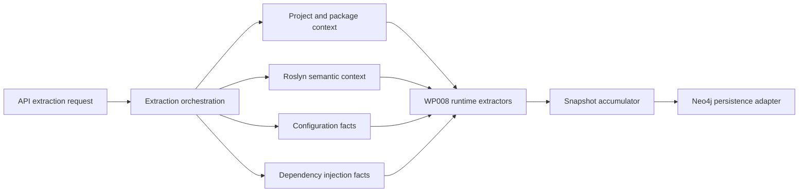

# Implementation Plan - WP008 ASP.NET, Worker, Console, and Runtime Extraction

## Document Control

| Field | Value |
| --- | --- |
| Work Package | WP008 - ASP.NET, Worker, Console, and Runtime Extraction |
| Target Output Path | `docs/008-ASP.NET-Worker-Console-and-Runtime-Extraction/plan-wp008-aspnet-worker-console-and-runtime-extraction.md` |
| Source Specification | `docs/008-ASP.NET-Worker-Console-and-Runtime-Extraction/spec-wp008-aspnet-worker-console-and-runtime-extraction.md` |
| Source Work Package | `docs/foundation/work-packages.md` WP008 |
| Mandatory Wiki Guidance | `./.github/instructions/wiki.instructions.md` |
| Mandatory Documentation-Pass Guidance | `./.github/instructions/documentation-pass.instructions.md` |
| Status | Draft |

## Planning Principles

This plan translates the WP008 specification into executable vertical work items. Each work item must preserve a runnable system state and must deliver a demonstrable runtime extraction capability through the established extraction or extractor test path. The plan avoids a horizontal-only sequence that builds every model before any usable extraction path exists.

Implementation must follow these repository standards as hard gates, not optional cleanup:

- `./.github/instructions/wiki.instructions.md` must be followed for every work item. Wiki review is mandatory for WP008, and wiki updates are required whenever developer-facing behavior, architecture, runtime workflow, extraction terminology, validation guidance, or contributor guidance changes or is materially clarified.
- `./.github/instructions/documentation-pass.instructions.md` must be followed in full for every task that creates, updates, reviews, or plans source code. Code is not acceptable unless the documentation-pass standard is met for every touched class, method, constructor, public parameter, and non-obvious property, including internal and other non-public types.
- Every code-writing task must include developer-level comments on every class, method, and constructor. Public methods and constructors must document every parameter. Properties whose purpose is not obvious from their names must be commented. Inline or block comments must explain purpose, logical flow, and algorithms where they materially help a developer understand the code.
- Source code must follow repository coding standards: Allman braces, block-scoped namespaces, no top-level statements, one public type per file, nullable reference types, underscore-prefixed private fields, and separated `PackageReference` and `ProjectReference` `.csproj` item groups.
- Active work-item execution must be uninterrupted. Once implementation starts for a work item, the executor must continue through implementation, validation, documentation/wiki review, and plan-record updates. The executor must not stop for status-only messages, ordinary fixable build/test failures, or confirmation prompts. The only allowed stops are full work-item completion, explicit user interruption or direction change, or a true blocker that cannot be resolved from the specification, this plan, codebase evidence, or repository guidance.
- The Aspire AppHost must not be run by automated validation as a blocking process. WP008 validation must use targeted tests, fixture projects, application-layer extraction seams, and solution builds.
- Standalone implementation notes, implementation ledgers, architecture notes, or similar contributor-facing narrative records are prohibited. Current-state contributor guidance, design rationale, validation workflows, troubleshooting guidance, terminology, and extension guidance must be written into `./wiki` according to `./.github/instructions/wiki.instructions.md`.
- `wiki/home.md` must remain a landing page and must not become the default destination for detailed runtime extraction guidance. Detailed contributor-facing guidance must go to the correct topic page or a newly created topic page selected by the mandatory wiki information-architecture review.
- Conceptually dense wiki content about runtime extraction, ASP.NET endpoint discovery, classic ASP.NET discovery, hosted services, queue consumers, evidence, confidence, unknowns, and validation must use longer book-like narrative prose. Technical terms must be defined on first use or linked to glossary entries, and examples or walkthrough material must be added when they materially improve contributor understanding.

## Overall Project Structure

WP008 implementation is expected to work primarily in these project areas:

```text
docs/
  008-ASP.NET-Worker-Console-and-Runtime-Extraction/
	spec-wp008-aspnet-worker-console-and-runtime-extraction.md
	plan-wp008-aspnet-worker-console-and-runtime-extraction.md

src/
  Archon.Application/
  Archon.Api.Extraction/
  Archon.Roslyn/
  Archon.Roslyn.CSharp/
  Archon.Roslyn.VisualBasic/
  Archon.Extractors.Projects/
  Archon.Extractors.DependencyInjection/
  Archon.Extractors.Configuration/
  Archon.Extractors.AspNet/
  Archon.Extractors.LegacyWeb/

test/
  Archon.Application.Tests/
  Archon.Api.Extraction.Tests/
  Archon.Roslyn.Tests/
  Archon.Roslyn.CSharp.Tests/
  Archon.Roslyn.VisualBasic.Tests/
  Archon.Extractors.Projects.Tests/
  Archon.Extractors.DependencyInjection.Tests/
  Archon.Extractors.Configuration.Tests/
  Archon.Extractors.AspNet.Tests/
  Archon.Extractors.LegacyWeb.Tests/

wiki/
  home.md
  solution-architecture.md
  api-extraction-workflow.md
  graph-domain-model.md
  roslyn-semantic-extraction.md
  configuration-and-dependency-injection-extraction.md
  validation-and-test-workflows.md
  glossary.md
  runtime-extraction.md                    # create only if the wiki IA review selects a dedicated page
```

The plan assumes WP001 through WP007 have already provided the solution skeleton, graph domain contracts, Neo4j persistence foundation, API extraction contract, repository/project extraction, Roslyn semantic extraction foundation, and configuration/dependency-injection extraction context. If implementation discovers those prerequisites are incomplete, record the discovery and adapt the implementation sequence without bypassing Onion Architecture.

## Contract Alignment Requirements

Before adding or changing extraction contracts, each work item must verify the current compiled contracts rather than inventing a parallel model. The WP008 specification identifies these relevant contract requirements:

- Runtime facts use the core graph node kinds `Endpoint`, `Controller`, `HostedService`, `Queue`, and `Topic`, plus existing `Project`, `Type`, `Method`, `ConfigurationKey`, and `FilePath` nodes.
- Runtime relationships use `DECLARES_ENDPOINT`, `EXPOSES`, `HANDLES`, `DEPENDS_ON`, `USES_CONFIG`, and related relationships already established in the graph model.
- Stable keys are deterministic and must not depend on database IDs, absolute developer machine paths, or enumeration order.
- Endpoint stable keys use project key, route template, HTTP method, and handler identity.
- Controller stable keys use project key and fully qualified controller type name.
- Hosted service stable keys use project key and fully qualified implementation type name.
- Queue and topic consumer stable keys use project key, transport kind, queue or topic name or configuration key, and handler identity.
- Entry point stable keys use project key plus fully qualified method identity or normalized top-level-statement file path.
- Runtime relationship direction follows the WP008 decisions: project or runtime application nodes declare/expose endpoints, controllers declare endpoints, handlers handle queues/topics/message targets, runtime nodes use configuration keys, and runtime nodes depend on dependency nodes.
- Runtime metadata field names use stable lower camel case, including `runtimeKind`, `framework`, `targetFramework`, `routeTemplate`, `httpMethod`, `controllerName`, `actionName`, `handlerSymbol`, `authorizationPolicy`, `allowsAnonymous`, `middlewareType`, `middlewareOrder`, `openApiEnabled`, `queueName`, `topicName`, `subscriptionName`, `transportKind`, `scheduleExpression`, `configurationKey`, `detectionMode`, `confidenceReason`, and `unknownReason`.
- Runtime subtypes are metadata values, not new graph node kinds. Examples include `Endpoint.runtimeKind`, `HostedService.runtimeKind`, `Queue.transportKind`, and `Controller.framework`.
- Evidence records must support source code, markup, configuration, project files, line spans, snippet hashes, snippet previews with secret redaction, confidence, detection mode, and unknown reasons.
- Snapshot accumulation accepts nodes, edges, evidence, warnings, and errors and defines deterministic duplicate handling.

If the implemented contracts differ from the specification wording, the implementation must follow actual compiled contracts first, then update this plan's execution record and wiki guidance with the exact current behavior.

## Work Items

## 1. Minimal ASP.NET Core Endpoint Slice

- [x] Work Item 1: Deliver an end-to-end ASP.NET Core minimal API endpoint extraction path - Completed
  - **Purpose**: Establish the smallest meaningful WP008 vertical slice: a C# fixture containing an ASP.NET Core `Program.cs` with a direct minimal API mapping is analyzed through the runtime extractor, projected into graph contracts, accumulated into snapshot output, and verified with tests.
  - **Acceptance Criteria**:
	- `Program.cs`, `WebApplication.CreateBuilder`, and direct `MapGet` endpoint mappings are detected in a C# fixture.
	- `Endpoint` nodes and `DECLARES_ENDPOINT` or `EXPOSES` relationships are emitted using the established graph relationship direction.
	- Endpoint metadata includes `runtimeKind`, `framework`, `routeTemplate`, `httpMethod`, `handlerSymbol`, `detectionMode`, and `confidenceReason` where available.
	- Source evidence includes repository-relative file path, line span where available, symbol or containing symbol where available, snippet hash, and snippet preview.
	- The slice runs without Neo4j direct writes, Aspire AppHost startup, API query endpoints, MCP tools, markdown export, snapshot diff, or Discovery UI.
  - **Definition of Done**:
	- ASP.NET Core minimal API extraction is implemented end to end through shared contracts, extractor code, accumulation, and tests.
	- WP002/WP008 graph contracts are used or extended only through the correct application/domain contract seams.
	- Logging and ordinary error handling are added where the execution path has meaningful runtime decisions.
	- Source code written in this work item complies with `./.github/instructions/documentation-pass.instructions.md` in full, including comments for every class, method, constructor, public parameter, and non-obvious property, including internal and non-public code.
	- Wiki review is performed for runtime extraction, endpoint, route template, evidence, confidence, and unknown terminology; relevant wiki or repository guidance is updated, or an explicit no-change result is recorded.
	- Foundational documentation uses book-like narrative depth for runtime extraction, endpoint graph facts, stable keys, evidence, confidence, and unknown concepts; technical terms are defined on first use or linked to glossary entries.
	- Can execute end to end via targeted ASP.NET extractor tests.
	- Executor must not stop mid-work-item unless the work item is complete, the user explicitly interrupts, or a true blocker prevents further autonomous progress.
	- [x] Task 1: Inspect existing runtime and graph contracts - Completed
	- [x] Step 1: Located compiled node kinds, edge kinds, evidence kinds, confidence, unknown-state, metadata, stable-key, fingerprint, and snapshot accumulation contracts.
	- [x] Step 2: Confirmed `DECLARES_ENDPOINT`, `EXPOSES`, `HANDLES`, `DEPENDS_ON`, and `USES_CONFIG` relationship kinds from domain contracts; Work Item 1 uses project-to-endpoint `DECLARES_ENDPOINT`.
	- [x] Step 3: Confirmed Roslyn semantic request shape, syntax-tree source spans, handler symbol access, repository-relative evidence paths, and snapshot merge behavior.
  - [x] Task 2: Add or align runtime extraction entry contracts - Completed
	- [x] Step 1: Added `MinimalApiEndpointExtractionRequest` and `MinimalApiEndpointExtractionResult` as the smallest extractor-facing runtime endpoint contracts.
	- [x] Step 2: Reused `ExtractedArchitectureSnapshot`, `ArchitectureSnapshotAccumulator`, `ArchitectureNode`, `ArchitectureEdge`, `EvidenceRecord`, metadata, confidence, unknown-state, stable-key, and fingerprint contracts.
	- [x] Step 3: Documented new and changed contracts according to the mandatory documentation-pass standard.
  - [x] Task 3: Implement direct minimal API detection - Completed
	- [x] Step 1: Implemented static detection for direct `MapGet` calls in C# `Program.cs` files loaded from submitted solution project context.
	- [x] Step 2: Extracted route template, HTTP method, handler identity, repository-relative source file, `Program.cs` containing symbol, confidence, and explicit unknowns for computed routes.
	- [x] Step 3: Emitted graph-ready `Endpoint` nodes, project-to-endpoint `DECLARES_ENDPOINT` relationships, runtime metadata, source evidence, snippet hashes, snippet previews, and fallback project nodes for extractor-only output.
  - [x] Task 4: Add focused tests - Completed
	- [x] Step 1: Added fixture code containing direct literal `MapGet` endpoint mappings and computed-route mappings.
	- [x] Step 2: Asserted node kind, relationship kind, source/target stable keys, metadata, confidence, unknown state, evidence, and source snippets.
	- [x] Step 3: Added API orchestration coverage proving stage registration and snapshot-writer persistence through the established extraction path; duplicate handling remains delegated to the stable-keyed accumulator.
  - [x] Task 5: Perform documentation and wiki review for the slice - Completed
	- [x] Step 1: Reviewed `wiki/runtime-foundation.md`, `wiki/api-extraction-workflow.md`, `wiki/glossary.md`, and `wiki/home.md`; runtime extraction guidance already has a correct topic home in `runtime-foundation.md`, so no new page was needed.
	- [x] Step 2: Updated selected wiki pages for runtime endpoint facts, route terminology, graph relationship direction, unknown handling, evidence behavior, and pipeline placement.
	- [x] Step 3: Wiki review result recorded below with page-structure decision and impact matrix.
  - **Files**:
	- `src/Archon.Extractors.AspNet/**`: ASP.NET Core runtime extraction implementation.
	- `src/Archon.Application/**`: Shared extraction or accumulation contracts only if needed.
	- `src/Archon.Roslyn/**`: Shared invocation/evidence helper extensions only if needed.
	- `test/Archon.Extractors.AspNet.Tests/**`: Minimal API endpoint extraction tests.
	- `wiki/**`: Topic pages selected by mandatory wiki review.
  - **Work Item Dependencies**: WP001 through WP007 foundation outputs.
  - **Run / Verification Instructions**:
	- `dotnet test .\test\Archon.Extractors.AspNet.Tests\Archon.Extractors.AspNet.Tests.csproj`
	- `dotnet build .\Archon.slnx --no-restore`
  - **User Instructions**:
	- None expected unless package restore or the required .NET SDK is unavailable.
  - **Completion Summary**:
	- Implemented `src/Archon.Extractors.AspNet/MinimalApis/**` with a documented ASP.NET Core minimal API endpoint extractor for direct C# `Program.cs` `MapGet` invocations, literal route extraction, handler identity metadata, computed-route unknown handling, endpoint/project/evidence graph projection, and deterministic stable keys/hashes.
	- Implemented `src/Archon.Api.Extraction/Wp008AspNetCoreMinimalApiExtractionStage.cs`, registered it after WP007 in `ExtractionApiServiceCollectionExtensions`, and added the `Archon.Extractors.AspNet` project reference to the API extraction module.
	- Added focused extractor tests in `test/Archon.Extractors.AspNet.Tests/AspNetCoreMinimalApiEndpointExtractorTests.cs` and API orchestration coverage in `test/Archon.Api.Extraction.Tests/ExtractionEndpointTests.cs`.
	- Validation performed: `dotnet test D:\Dev\Archon\test\Archon.Extractors.AspNet.Tests\Archon.Extractors.AspNet.Tests.csproj --no-restore` passed 3/3; `dotnet test D:\Dev\Archon\test\Archon.Api.Extraction.Tests\Archon.Api.Extraction.Tests.csproj --no-restore` passed 15/15.
	- Wiki impact matrix: affected concepts were runtime extraction slices, ASP.NET Core minimal API endpoint facts, route templates, handler identity, `DECLARES_ENDPOINT` direction, evidence, confidence, and unknown state. Pages reviewed: `wiki/runtime-foundation.md`, `wiki/api-extraction-workflow.md`, `wiki/glossary.md`, and `wiki/home.md`. Pages updated: `wiki/runtime-foundation.md`, `wiki/api-extraction-workflow.md`, and `wiki/glossary.md`. Pages created: none. Pages intentionally unchanged: `wiki/home.md`, because it remains a concise landing page and already links to runtime and workflow topic pages. Page-structure decision: `wiki/runtime-foundation.md` is the correct home for the runtime extraction mental model, while `wiki/api-extraction-workflow.md` is the correct home for stage ordering and orchestration behavior.

## 2. ASP.NET Core Controller, Routing, Middleware, and OpenAPI Slice

- [x] Work Item 2: Expand ASP.NET Core extraction to controllers, routing, authorization, middleware, filters, MVC setup, and OpenAPI setup - Completed
  - **Purpose**: Add the primary modern web application runtime surfaces after the minimal endpoint path has proven the graph projection pattern.
  - **Acceptance Criteria**:
	- ASP.NET Core controllers and action methods are detected.
	- Controller-level and action-level route metadata is combined when deterministic.
	- HTTP verb attributes, authorization attributes, anonymous access attributes, filters, middleware registrations, MVC setup, conventional routing, endpoint groups, and OpenAPI/Swagger setup are detected where evidence exists.
	- Dynamic routes, unresolved middleware targets, and unsupported pipeline shapes are represented with explicit unknowns and confidence metadata.
	- Existing minimal endpoint extraction remains passing and duplicate endpoint facts are avoided.
  - **Definition of Done**:
	- Controller and ASP.NET Core runtime extraction runs through the same extractor entry path as Work Item 1.
	- Tests cover controllers, actions, route attributes, verb attributes, endpoint groups, middleware, filters, authorization, MVC setup, OpenAPI setup, dynamic routes, unknowns, and deterministic de-duplication.
	- Source code complies with `./.github/instructions/documentation-pass.instructions.md` in full for all touched code.
	- Wiki review is performed for controller, action, route attribute, middleware, filter, OpenAPI, and endpoint-group terminology; relevant pages are updated or an explicit no-change result is recorded.
	- Can execute end to end via targeted ASP.NET extractor tests.
	- Executor must not stop mid-work-item unless the work item is complete, the user explicitly interrupts, or a true blocker prevents further autonomous progress.
	- [x] Task 1: Extend ASP.NET Core pattern catalog - Completed
	- [x] Step 1: Add descriptors for controller base types, MVC setup calls, controller mapping calls, and route attributes.
	- [x] Step 2: Add descriptors for HTTP verb attributes, authorization attributes, anonymous access attributes, and filters.
	- [x] Step 3: Add descriptors for middleware calls, custom middleware types, middleware ordering, endpoint groups, and OpenAPI setup.
  - [x] Task 2: Implement controller and action extraction - Completed
	- [x] Step 1: Detect controller types and action methods using semantic information where available.
	- [x] Step 2: Compute deterministic route metadata from controller and action attributes where possible.
	- [x] Step 3: Emit `Controller`, `Endpoint`, and `DECLARES_ENDPOINT` graph facts with evidence.
  - [x] Task 3: Implement pipeline metadata extraction - Completed
	- [x] Step 1: Detect middleware registration order from source order where deterministic.
	- [x] Step 2: Detect filters and authorization metadata attached to controllers, actions, endpoint groups, and minimal APIs.
	- [x] Step 3: Emit metadata and unknowns for unresolved middleware, filters, or dynamic route components.
  - [x] Task 4: Add tests and validation - Completed
	- [x] Step 1: Add fixture projects for controllers, endpoint groups, middleware, filters, authorization, MVC setup, and OpenAPI setup.
	- [x] Step 2: Assert graph facts, metadata fields, evidence, confidence, and unknown-state output.
	- [x] Step 3: Run targeted ASP.NET extractor tests and API extraction tests.
  - [x] Task 5: Perform documentation and wiki review - Completed
	- [x] Step 1: Review whether wiki guidance explains controller/action routing, endpoint groups, middleware, filters, and OpenAPI runtime facts.
	- [x] Step 2: Update selected topic pages and glossary entries if needed.
	- [x] Step 3: Record the wiki review result in this plan after implementation.
  - **Files**:
	- `src/Archon.Extractors.AspNet/**`: ASP.NET Core controller, route, middleware, filter, authorization, and OpenAPI extraction.
	- `src/Archon.Roslyn/**`: Shared attribute or invocation helpers only if needed.
	- `test/Archon.Extractors.AspNet.Tests/**`: ASP.NET Core controller and pipeline tests.
	- `wiki/**`: Topic pages selected by mandatory wiki review.
  - **Work Item Dependencies**: Work Item 1.
  - **Run / Verification Instructions**:
	- `dotnet test .\test\Archon.Extractors.AspNet.Tests\Archon.Extractors.AspNet.Tests.csproj`
	- `dotnet build .\Archon.slnx --no-restore`
  - **User Instructions**:
	- None expected.
  - **Completion Summary**:
	- Expanded `src/Archon.Extractors.AspNet/MinimalApis/AspNetCoreMinimalApiEndpointExtractor.cs` from the Work Item 1 minimal `MapGet` slice into a documented ASP.NET Core runtime extractor that recognizes minimal API verbs, literal endpoint groups, computed-route unknowns, controllers, actions, route attributes, HTTP verb attributes, authorization policy attributes, anonymous access attributes, filter attributes, MVC setup calls, controller mapping calls, middleware ordering, generic `UseMiddleware<T>()` targets, and OpenAPI/Swagger setup.
	- Added Work Item 2 coverage in `test/Archon.Extractors.AspNet.Tests/AspNetCoreMinimalApiEndpointExtractorTests.cs` for attributed controllers/actions, deterministic controller/action route composition, endpoint groups, additional minimal API verbs, computed group unknown state, middleware metadata, custom middleware metadata, MVC setup, controller mapping, OpenAPI setup, evidence, and minimal endpoint regression behavior.
	- Validation performed: `dotnet test D:\Dev\Archon\test\Archon.Extractors.AspNet.Tests\Archon.Extractors.AspNet.Tests.csproj --no-restore` passed 6/6; `dotnet test D:\Dev\Archon\test\Archon.Api.Extraction.Tests\Archon.Api.Extraction.Tests.csproj --no-restore` passed 15/15.
	- Wiki impact matrix: affected concepts were ASP.NET Core endpoint extraction, minimal API verbs, endpoint groups, controller/action routing, route token replacement, authorization metadata, anonymous access metadata, filter metadata, middleware registration order, custom middleware targets, MVC setup, controller mapping, OpenAPI/Swagger setup, evidence, confidence, and unknown state. Pages reviewed: `wiki/runtime-foundation.md`, `wiki/api-extraction-workflow.md`, `wiki/glossary.md`, and `wiki/home.md`. Pages updated: `wiki/runtime-foundation.md`, `wiki/api-extraction-workflow.md`, and `wiki/glossary.md`. Pages created: none. Pages intentionally unchanged: `wiki/home.md`, because it remains a concise landing page and already links to runtime and workflow topic pages. Page-structure decision: `wiki/runtime-foundation.md` is the correct home for book-like runtime extraction concepts, `wiki/api-extraction-workflow.md` is the correct home for stage orchestration behavior, and `wiki/glossary.md` is the correct home for short central term definitions.

## 3. Classic ASP.NET, Web Forms, MVC 5, and Web API 2 Slice

- [x] Work Item 3: Deliver classic ASP.NET runtime extraction for legacy web applications - Completed
  - **Purpose**: Make WP008 useful for legacy .NET estates by extracting `System.Web`, `Global.asax`, Web Forms, HTTP handlers, HTTP modules, MVC 5, Web API 2, `web.config`, and route-configuration facts.
  - **Acceptance Criteria**:
	- Classic ASP.NET applications are detected through `System.Web`, project metadata, package references, configuration artifacts, and source artifacts.
	- `Global.asax`, code-behind files, lifecycle methods, `web.config`, Web Forms pages, user controls, handlers, modules, MVC 5 controllers, Web API 2 controllers, and route configuration are detected where evidence exists.
	- Convention-based or dynamic routes are represented as explicit unknowns rather than invented route templates.
	- Classic runtime facts emit `Endpoint`, `Controller`, `Type`, `Method`, `FilePath`, and related relationships according to established graph contracts.
  - **Definition of Done**:
	- Classic ASP.NET extraction runs through the established extraction path and does not execute target application code.
	- Tests cover classic application detection, Web Forms markers, handlers, modules, MVC 5, Web API 2, route configuration, evidence, confidence, and unknowns.
	- Source code complies with `./.github/instructions/documentation-pass.instructions.md` in full for all touched code.
	- Wiki review is performed for classic ASP.NET, Web Forms, `Global.asax`, handler, module, MVC 5, Web API 2, and route-configuration terminology; relevant pages are updated or an explicit no-change result is recorded.
	- Can execute end to end via targeted legacy web extractor tests.
	- Executor must not stop mid-work-item unless the work item is complete, the user explicitly interrupts, or a true blocker prevents further autonomous progress.
	- [x] Task 1: Implement classic ASP.NET application detection - Completed
	- [x] Step 1: Detect `System.Web` references, project indicators, package references, `web.config`, and classic source artifacts.
	- [x] Step 2: Detect `Global.asax`, code-behind files, and lifecycle hooks.
	- [x] Step 3: Emit application/runtime metadata with evidence and confidence.
  - [x] Task 2: Implement Web Forms, handler, and module extraction - Completed
	- [x] Step 1: Detect `.aspx`, `.ascx`, and code-behind relationships.
	- [x] Step 2: Detect HTTP handlers and modules from source code and configuration.
	- [x] Step 3: Emit endpoint or handler facts with virtual path, handler type, module type, evidence, and unknowns.
  - [x] Task 3: Implement MVC 5 and Web API 2 extraction - Completed
	- [x] Step 1: Detect MVC 5 and Web API 2 controllers and actions.
	- [x] Step 2: Detect route attributes, HTTP verb attributes, route tables, and route registration setup.
	- [x] Step 3: Emit controller, endpoint, route, and unknown-route facts.
  - [x] Task 4: Add tests and validation - Completed
	- [x] Step 1: Add fixture projects for `Global.asax`, Web Forms, handlers, modules, MVC 5, Web API 2, and route configuration.
	- [x] Step 2: Assert metadata, evidence, confidence, unknowns, and duplicate handling.
	- [x] Step 3: Run targeted legacy web extractor tests, ASP.NET Core regression tests, and solution build.
  - [x] Task 5: Perform documentation and wiki review - Completed
	- [x] Step 1: Review whether wiki guidance explains classic ASP.NET runtime artifacts and how they differ from ASP.NET Core facts.
	- [x] Step 2: Update selected topic pages and glossary entries if needed.
	- [x] Step 3: Record the wiki review result in this plan after implementation.
  - **Files**:
	- `src/Archon.Extractors.LegacyWeb/**`: Classic ASP.NET extraction implementation.
	- `src/Archon.Extractors.AspNet/**`: Shared web runtime contracts only if appropriate.
	- `test/Archon.Extractors.LegacyWeb.Tests/**`: Classic ASP.NET extraction tests.
	- `wiki/**`: Topic pages selected by mandatory wiki review.
  - **Work Item Dependencies**: Work Items 1 and 2.
  - **Run / Verification Instructions**:
	- `dotnet test .\test\Archon.Extractors.LegacyWeb.Tests\Archon.Extractors.LegacyWeb.Tests.csproj`
	- `dotnet test .\test\Archon.Extractors.AspNet.Tests\Archon.Extractors.AspNet.Tests.csproj --no-restore`
	- `dotnet build .\Archon.slnx --no-restore`
  - **User Instructions**:
	- None expected.
  - **Completion Summary**:
	- Added `ClassicAspNetRuntimeExtractionRequest`, `ClassicAspNetRuntimeExtractionResult`, and `ClassicAspNetRuntimeExtractor` in `src/Archon.Extractors.LegacyWeb` to statically extract classic ASP.NET runtime facts from repository-contained old-style project files, `web.config`, `Global.asax`, Web Forms markup, HTTP handler/module source and configuration, MVC 5 controllers/actions, Web API 2 controllers/actions, and route configuration without executing target code or invoking MSBuild.
	- Added `test/Archon.Extractors.LegacyWeb.Tests/ClassicAspNetRuntimeExtractorTests.cs` covering classic application metadata, `System.Web`/MVC/Web API indicators, `Global.asax` evidence, lifecycle method facts, Web Forms page endpoint facts, user-control file facts, HTTP handler and module facts, MVC 5 action endpoints, Web API 2 action endpoints, handler `HANDLES` relationships, controller `DECLARES_ENDPOINT` relationships, route-table unknowns, source/configuration evidence, confidence, and current evidence-kind constraints.
	- Validation performed: `dotnet test D:\Dev\Archon\test\Archon.Extractors.LegacyWeb.Tests\Archon.Extractors.LegacyWeb.Tests.csproj --no-restore` passed 4/4; `dotnet test D:\Dev\Archon\test\Archon.Extractors.AspNet.Tests\Archon.Extractors.AspNet.Tests.csproj --no-restore` passed 6/6; workspace build passed.
	- Wiki impact matrix: affected concepts were classic ASP.NET application detection, `System.Web`, `Global.asax`, lifecycle hooks, `web.config`, Web Forms pages, Web Forms user controls, HTTP handlers, HTTP modules, MVC 5, Web API 2, route-configuration unknowns, static artifact evidence, current markup evidence-kind mapping, and classic graph projection. Pages reviewed: `wiki/runtime-foundation.md`, `wiki/glossary.md`, and `wiki/home.md`. Pages updated: `wiki/runtime-foundation.md` and `wiki/glossary.md`. Pages created: none. Pages intentionally unchanged: `wiki/home.md`, because it remains a concise landing page and already links to runtime topic guidance. Page-structure decision: `wiki/runtime-foundation.md` remains the correct book-like topic page for runtime extraction concepts, while `wiki/glossary.md` is the correct page for central classic ASP.NET terminology; a new `runtime-extraction.md` page was not created because the existing runtime foundation page is still coherent and not overloaded.

## 4. Console Entry Point Slice

- [x] Work Item 4: Deliver console entry-point extraction for C# and VB.NET target repositories - Completed
  - **Purpose**: Identify runtime entry points for console applications and provide graph facts that later query, MCP, and markdown surfaces can use to explain where execution begins.
  - **Acceptance Criteria**:
	- Console application projects are detected from output type, SDK metadata, source structure, and entry-point symbols where evidence exists.
	- C# and VB.NET `static Main` or equivalent entry points are detected where Roslyn supports symbol resolution.
	- C# top-level statements in analyzed target repositories are detected and distinguished from Archon host code and test harness code.
	- Ambiguous or generated entry points are represented with confidence and unknown reason metadata.
  - **Definition of Done**:
	- Console entry-point extraction runs through a runtime extractor entry point and emits graph-compatible `Project`, `Type`, `Method`, and metadata facts.
	- Tests cover C# `Main`, VB.NET entry points where feasible, top-level statements, ambiguous entry points, evidence, stable keys, confidence, and unknowns.
	- Source code complies with `./.github/instructions/documentation-pass.instructions.md` in full for all touched code.
	- Wiki review is performed for entry point, top-level statements, target repository context, and runtime classification terminology; relevant pages are updated or an explicit no-change result is recorded.
	- Can execute end to end via targeted runtime extractor tests.
	- Executor must not stop mid-work-item unless the work item is complete, the user explicitly interrupts, or a true blocker prevents further autonomous progress.
	- [x] Task 1: Implement entry-point candidate detection - Completed
	- [x] Step 1: Detected console project indicators from submitted target repository project/source context.
	- [x] Step 2: Detected C# `static Main` and VB.NET `Sub Main` or `Function Main` entry-point methods through Roslyn symbols with source fallback identity.
	- [x] Step 3: Detected C# top-level statements only from semantic documents loaded from submitted solution/project inputs.
  - [x] Task 2: Emit entry-point facts - Completed
	- [x] Step 1: Built deterministic stable keys for entry-point facts using project key and method identity or normalized top-level-statement file path.
	- [x] Step 2: Emitted project, type, method, containment, metadata, confidence, evidence, and unknown-state information.
	- [x] Step 3: Avoided duplicate overlap by projecting one runtime method fact per source candidate and marking multiple project candidates as explicit ambiguity unknowns instead of choosing a winner.
  - [x] Task 3: Add tests and validation - Completed
	- [x] Step 1: Added fixture coverage for C# `Main`, C# top-level statements, VB.NET `Sub Main`, and ambiguous entry points.
	- [x] Step 2: Asserted graph output, evidence, stable keys, confidence, and unknowns.
	- [x] Step 3: Ran targeted runtime extractor tests, API extraction tests, and project build validation; full solution build was attempted but cancelled by the user/environment before completion.
  - [x] Task 4: Perform documentation and wiki review - Completed
	- [x] Step 1: Reviewed whether wiki guidance defines entry point, top-level statement, runtime classification, and target repository context.
	- [x] Step 2: Updated selected topic pages and glossary entries.
	- [x] Step 3: Recorded the wiki review result in this plan after implementation.
  - **Files**:
	- `src/Archon.Extractors.AspNet/**` or a shared runtime area selected by existing project structure: Console entry-point runtime extraction.
	- `src/Archon.Roslyn.CSharp/**`, `src/Archon.Roslyn.VisualBasic/**`: Shared entry-point helpers only if needed.
	- `test/Archon.Extractors.AspNet.Tests/**` or selected runtime test project: Console entry-point tests.
	- `wiki/**`: Topic pages selected by mandatory wiki review.
  - **Work Item Dependencies**: Work Item 1 and existing WP006 Roslyn semantic support.
  - **Run / Verification Instructions**:
	- `dotnet test .\test\Archon.Extractors.AspNet.Tests\Archon.Extractors.AspNet.Tests.csproj`
	- `dotnet build .\Archon.slnx --no-restore`
  - **User Instructions**:
	- No manual action required. Re-run the full solution build if desired because the attempted `dotnet build D:\Dev\Archon\Archon.slnx --no-restore` validation was cancelled before completion by the user/environment.
  - **Completion Summary**:
	- Added `src/Archon.Extractors.AspNet/Runtime/ConsoleEntryPointExtractionRequest.cs`, `ConsoleEntryPointExtractionResult.cs`, and `ConsoleEntryPointRuntimeExtractor.cs` to statically extract C# `static Main`, VB.NET `Sub Main` or `Function Main`, and C# top-level statement entry points from submitted target repository semantic documents without executing target code.
	- Extended `src/Archon.Api.Extraction/Wp008AspNetCoreMinimalApiExtractionStage.cs` to run console entry-point extraction after ASP.NET Core runtime extraction, load `.vbproj` source documents for runtime entry-point extraction, and keep ASP.NET Core endpoint extraction scoped to C# documents.
	- Added `test/Archon.Extractors.AspNet.Tests/ConsoleEntryPointRuntimeExtractorTests.cs` covering C# explicit entry points, C# top-level statements, VB.NET entry points, ambiguity unknown state, project/type/method nodes, `CONTAINS` relationships, stable-key shape, metadata, source evidence, snippet hashes, and confidence.
	- Validation performed: `Archon.Extractors.AspNet.Tests` passed 10/10; `Archon.Api.Extraction.Tests` passed 15/15; `dotnet build D:\Dev\Archon\src\Archon.Api.Extraction\Archon.Api.Extraction.csproj --no-restore` passed. The full solution build command `dotnet build D:\Dev\Archon\Archon.slnx --no-restore` was attempted but cancelled by the user/environment before completion, so it did not produce a pass/fail result.
	- Wiki impact matrix: affected concepts were console entry points, C# top-level statements, VB.NET `Main`, target repository context, runtime classification, console stable keys, entry-point evidence, confidence, and ambiguity unknowns. Pages reviewed: `wiki/runtime-foundation.md`, `wiki/glossary.md`, and `wiki/home.md`. Pages updated: `wiki/runtime-foundation.md`, `wiki/glossary.md`, and the concise capability summary in `wiki/home.md`. Pages created: none. Pages intentionally unchanged beyond concise landing-page summary: `wiki/home.md`, because detailed console runtime guidance belongs in `wiki/runtime-foundation.md`. Page-structure decision: `wiki/runtime-foundation.md` remains the correct book-like topic page for runtime extraction concepts; `wiki/glossary.md` remains the correct central terminology page; no new `runtime-extraction.md` page was created because the existing runtime topic remains coherent and not overloaded.

## 5. Worker Service and Hosted Service Slice

- [x] Work Item 5: Deliver worker, hosted-service, and background-service extraction with WP007 correlation - Completed
  - **Purpose**: Extract background runtime components and connect them to dependency-injection facts so contributors can understand services that run outside request/response HTTP flows.
  - **Acceptance Criteria**:
	- Worker service projects, generic host setup, `IHostedService` implementations, and `BackgroundService` derived classes are detected.
	- Hosted-service facts are correlated with `AddHostedService<T>()` and related registration facts emitted by WP007 where available.
	- Hosted-service facts emit `HostedService`, `Type`, `Method`, `REGISTERED_AS_SERVICE` correlation metadata where appropriate, `DEPENDS_ON`, and evidence-backed runtime metadata.
	- Hosted-service facts are emitted even when registration is not found if source evidence proves the runtime role.
  - **Definition of Done**:
	- Worker and hosted-service extraction runs through the established extraction path and does not start background services.
	- Tests cover worker project detection, `IHostedService`, `BackgroundService`, host builders, DI registration correlation, missing registration, evidence, confidence, unknowns, and duplicate handling.
	- Source code complies with `./.github/instructions/documentation-pass.instructions.md` in full for all touched code.
	- Wiki review is performed for worker service, hosted service, background service, generic host, and DI/runtime correlation terminology; relevant pages are updated or an explicit no-change result is recorded.
	- Can execute end to end via targeted runtime and DI extractor tests.
	- Executor must not stop mid-work-item unless the work item is complete, the user explicitly interrupts, or a true blocker prevents further autonomous progress.
	- [x] Task 1: Implement worker and hosted-service detection - Completed
	- [x] Step 1: Detected worker project indicators and generic host setup through static C# invocation analysis.
	- [x] Step 2: Detected `IHostedService` implementations and `BackgroundService` derived classes using Roslyn semantic analysis with conservative source-text fallback.
	- [x] Step 3: Detected execution methods such as `StartAsync`, `StopAsync`, and `ExecuteAsync` where available.
  - [x] Task 2: Correlate with WP007 DI facts - Completed
	- [x] Step 1: Read available hosted-service `REGISTERED_AS_SERVICE` facts from the accumulated prior snapshot.
	- [x] Step 2: Linked hosted-service runtime facts to registration evidence and metadata where exactly one registration match is available.
	- [x] Step 3: Emitted unknown state and warnings for missing or conflicting registration evidence.
  - [x] Task 3: Add tests and validation - Completed
	- [x] Step 1: Added fixture projects for worker services, hosted services, background services, and missing registration cases.
	- [x] Step 2: Asserted `HostedService` facts, registration correlation, metadata, evidence, confidence, unknowns, execution methods, and generic host setup metadata.
	- [x] Step 3: Ran targeted ASP.NET/runtime, API extraction, and solution build validation.
  - [x] Task 4: Perform documentation and wiki review - Completed
	- [x] Step 1: Reviewed whether wiki guidance defines hosted service, background service, worker service, and generic host.
	- [x] Step 2: Updated selected topic pages and glossary entries.
	- [x] Step 3: Recorded the wiki review result in this plan after implementation.
  - **Files**:
	- `src/Archon.Extractors.AspNet/**` or selected runtime extractor area: Worker and hosted-service extraction.
	- `src/Archon.Extractors.DependencyInjection/**`: Correlation helper changes only if needed.
	- `test/Archon.Extractors.AspNet.Tests/**`: Worker and hosted-service tests.
	- `test/Archon.Extractors.DependencyInjection.Tests/**`: Correlation regression tests if needed.
	- `wiki/**`: Topic pages selected by mandatory wiki review.
  - **Work Item Dependencies**: Work Items 1 and 4, plus WP007 DI facts.
  - **Run / Verification Instructions**:
	- `dotnet test .\test\Archon.Extractors.AspNet.Tests\Archon.Extractors.AspNet.Tests.csproj`
	- `dotnet test .\test\Archon.Extractors.DependencyInjection.Tests\Archon.Extractors.DependencyInjection.Tests.csproj --no-restore`
	- `dotnet build .\Archon.slnx --no-restore`
  - **User Instructions**:
	- None expected.
  - **Completion Summary**:
	- Added `src/Archon.Extractors.AspNet/Runtime/WorkerHostedServiceExtractionRequest.cs`, `WorkerHostedServiceExtractionResult.cs`, and `WorkerHostedServiceRuntimeExtractor.cs` to statically extract C# worker hosted-service facts from submitted target repository semantic documents without starting the target host or background services.
	- Implemented hosted-service detection for `IHostedService` implementations and `BackgroundService` derived classes, project-level generic host setup metadata, lifecycle execution method facts for `StartAsync`, `StopAsync`, and `ExecuteAsync`, source evidence, deterministic stable keys, confidence, explicit unknown state, and warnings for missing or conflicting registration evidence.
	- Correlated hosted-service runtime facts with prior WP007 `REGISTERED_AS_SERVICE` edges carrying hosted-service metadata. `src/Archon.Api.Extraction/Wp008AspNetCoreMinimalApiExtractionStage.cs` now passes the accumulated prior snapshot into worker extraction after minimal API and console entry-point extraction and merges worker results back into the shared accumulator.
	- Added `test/Archon.Extractors.AspNet.Tests/WorkerHostedServiceRuntimeExtractorTests.cs` covering background-service source detection, generic host setup metadata, execution method facts, missing registration warnings, and prior `AddHostedService` registration correlation.
	- Validation performed: `Archon.Extractors.AspNet.Tests` passed 12/12; `Archon.Api.Extraction.Tests` passed 15/15; workspace build passed through Visual Studio build validation.
	- Wiki impact matrix: affected concepts were worker services, generic host setup, hosted services, background services, lifecycle execution methods, hosted-service DI correlation, registration evidence, missing-registration unknowns, evidence, confidence, and runtime non-goals. Pages reviewed: `wiki/runtime-foundation.md`, `wiki/glossary.md`, and `wiki/home.md`. Pages updated: `wiki/runtime-foundation.md` and `wiki/glossary.md`. Pages created: none. Pages intentionally unchanged: `wiki/home.md`, because it remains a concise landing page and already links to runtime topic guidance. Page-structure decision: `wiki/runtime-foundation.md` remains the correct book-like topic page for runtime extraction concepts; `wiki/glossary.md` remains the correct central terminology page; no new `runtime-extraction.md` page was created because the existing runtime topic remains coherent.

## 6. Scheduled Job, Queue Consumer, Message Handler, Windows Service, and Custom Host Loop Slice

- [x] Work Item 6: Deliver non-HTTP runtime consumer extraction - Completed
  - **Purpose**: Capture runtime behavior that is not represented by HTTP endpoints: scheduled jobs, queue consumers, topic/subscription consumers, message handlers, Windows-service-style hosts, Topshelf services, and custom host loops.
  - **Acceptance Criteria**:
	- Scheduled job patterns are detected from source, configuration, package references, or known scheduler APIs where evidence exists.
	- Queue consumers, topic consumers, subscription consumers, message handlers, transport hints, and configuration-key references are detected where evidence exists.
	- Windows-service-style hosting, Topshelf-style services, and custom host loops are detected with conservative confidence.
	- Computed queue names, topic names, subscriptions, schedule expressions, handler targets, and custom-loop classifications are represented as explicit unknowns where unresolved.
  - **Definition of Done**:
	- Non-HTTP runtime consumer extraction runs through the established extraction path and does not connect to queues, brokers, scheduler services, Windows services, databases, or external services.
	- Tests cover scheduled jobs, queue consumers, topic/subscription consumers, message handlers, configuration-driven names, unknowns, Windows-service-style hosting, Topshelf patterns, custom loops, evidence, confidence, and stable keys.
	- Source code complies with `./.github/instructions/documentation-pass.instructions.md` in full for all touched code.
	- Wiki review is performed for scheduled job, queue, topic, subscription, message handler, transport, Windows service, Topshelf, custom host loop, and unknown-target terminology; relevant pages are updated or an explicit no-change result is recorded.
	- Can execute end to end via targeted runtime extractor tests.
	- Executor must not stop mid-work-item unless the work item is complete, the user explicitly interrupts, or a true blocker prevents further autonomous progress.
	- [x] Task 1: Implement scheduled job extraction - Completed
	- [x] Step 1: Detected known scheduler registration APIs where supported by source evidence, including Hangfire-style recurring jobs and Quartz-style scheduler calls.
	- [x] Step 2: Extracted schedule expression, job method, scheduler technology, evidence, confidence, and runtime metadata where deterministic.
	- [x] Step 3: Emitted explicit unknowns and warnings for unresolved scheduled job targets.
  - [x] Task 2: Implement queue/topic consumer and message handler extraction - Completed
	- [x] Step 1: Detected queue, topic, subscription, and message handler patterns from source and known messaging API shapes.
	- [x] Step 2: Emitted `Queue`, `Topic`, `HANDLES`, and handler facts with transport metadata.
	- [x] Step 3: Emitted explicit unknowns and warnings for computed queue or topic names and partial transport detection.
  - [x] Task 3: Implement Windows-service-style and host-loop extraction - Completed
	- [x] Step 1: Detected Windows-service-style, systemd-style, and Topshelf host setup patterns from source calls.
	- [x] Step 2: Detected custom long-running loops and polling loops with conservative loop-plus-delay-or-cancellation heuristics.
	- [x] Step 3: Assigned medium confidence and confidence-reason metadata for heuristic custom-loop facts.
  - [x] Task 4: Add tests and validation - Completed
	- [x] Step 1: Added fixture projects for scheduled jobs, queue consumers, message handlers, Windows services, custom loops, and dynamic names.
	- [x] Step 2: Asserted graph facts, stable keys, metadata, evidence, confidence, unknowns, and duplicate handling through accumulator behavior.
	- [x] Step 3: Ran targeted runtime extractor tests, configuration tests, API extraction tests, and workspace build validation.
  - [x] Task 5: Perform documentation and wiki review - Completed
	- [x] Step 1: Reviewed whether wiki guidance defines non-HTTP runtime consumers, transports, scheduled jobs, and custom host loops.
	- [x] Step 2: Updated selected topic pages and glossary entries.
	- [x] Step 3: Recorded the wiki review result in this plan after implementation.
  - **Files**:
	- `src/Archon.Extractors.AspNet/**` or selected runtime extractor area: Non-HTTP runtime consumer extraction.
	- `src/Archon.Extractors.Configuration/**`: Configuration-key correlation helper changes only if needed.
	- `test/Archon.Extractors.AspNet.Tests/**`: Scheduled job, queue consumer, and host-loop tests.
	- `wiki/**`: Topic pages selected by mandatory wiki review.
  - **Work Item Dependencies**: Work Items 4 and 5, plus WP007 configuration/DI facts.
  - **Run / Verification Instructions**:
	- `dotnet test .\test\Archon.Extractors.AspNet.Tests\Archon.Extractors.AspNet.Tests.csproj`
	- `dotnet test .\test\Archon.Extractors.Configuration.Tests\Archon.Extractors.Configuration.Tests.csproj --no-restore`
	- `dotnet build .\Archon.slnx --no-restore`
  - **User Instructions**:
	- None expected.
  - **Completion Summary**:
	- Added `src/Archon.Extractors.AspNet/Runtime/NonHttpRuntimeConsumerExtractionRequest.cs`, `NonHttpRuntimeConsumerExtractionResult.cs`, and `NonHttpRuntimeConsumerExtractor.cs` to statically extract non-HTTP runtime consumer facts from submitted C# semantic documents without connecting to brokers, schedulers, Windows services, or external runtime resources.
	- Implemented scheduled-job detection for Hangfire-style recurring jobs and Quartz-style scheduler registration shapes, queue/topic consumer detection for known messaging API source shapes, message-handler event subscription correlation, Windows-service/systemd/Topshelf host setup detection, and conservative custom host-loop detection.
	- Integrated non-HTTP runtime consumer extraction into `src/Archon.Api.Extraction/Wp008AspNetCoreMinimalApiExtractionStage.cs` after worker hosted-service extraction so facts merge into the shared accumulator through the established API-triggered extraction path.
	- Added `test/Archon.Extractors.AspNet.Tests/NonHttpRuntimeConsumerExtractorTests.cs` covering scheduled jobs, Azure Service Bus queue handlers, computed queue-name unknown state, Windows-service-style setup, custom-loop facts, metadata, evidence, confidence, and warnings.
	- Validation performed: `Archon.Extractors.AspNet.Tests` passed 16/16; `Archon.Extractors.Configuration.Tests` passed 11/11; `Archon.Api.Extraction.Tests` passed 15/15; workspace build passed.
	- Wiki impact matrix: affected concepts were non-HTTP runtime consumers, scheduled jobs, scheduler technology, queue consumers, topic consumers, message handlers, messaging transport, computed target unknowns, Windows-service-style hosts, systemd-style hosts, Topshelf hosts, custom host loops, evidence, confidence, and runtime non-goals. Pages reviewed: `wiki/runtime-foundation.md`, `wiki/glossary.md`, and `wiki/home.md`. Pages updated: `wiki/runtime-foundation.md` and `wiki/glossary.md`. Pages created: none. Pages intentionally unchanged: `wiki/home.md`, because it remains a concise landing page and already links to runtime topic guidance. Page-structure decision: `wiki/runtime-foundation.md` remains the correct book-like topic page for runtime extraction concepts; `wiki/glossary.md` remains the correct central terminology page; no new `runtime-extraction.md` page was created because the existing runtime topic remains coherent after the non-HTTP consumer section.

## 7. Extraction Orchestration Integration Slice

- [x] Work Item 7: Wire WP008 runtime extractors into the API-triggered extraction orchestration path - Completed
  - **Purpose**: Move runtime extraction from isolated extractor tests into the shared extraction workflow so API-triggered extraction can produce runtime facts in snapshot output.
  - **Acceptance Criteria**:
	- Runtime extractors are registered with the existing extraction orchestration path.
	- API-triggered extraction uses repository root and explicit solution path list and never performs independent arbitrary scans.
	- Runtime extraction receives prior project, semantic, configuration, and dependency-injection context where available.
	- Runtime warnings and errors flow into extraction run output and snapshot accumulation.
	- The orchestration path remains runnable without starting the Aspire AppHost as a blocking process.
  - **Definition of Done**:
	- Runtime extraction is integrated through the application/API extraction seam without direct Neo4j writes from extractor projects.
	- Integration tests cover orchestration order, context handoff, snapshot accumulation, warnings, errors, cancellation, and invalid or partial project behavior.
	- Source code complies with `./.github/instructions/documentation-pass.instructions.md` in full for all touched code.
	- Wiki review is performed for API extraction workflow changes, runtime extraction stage ordering, validation commands, and troubleshooting; relevant pages are updated or an explicit no-change result is recorded.
	- Can execute end to end via targeted API extraction integration tests.
	- Executor must not stop mid-work-item unless the work item is complete, the user explicitly interrupts, or a true blocker prevents further autonomous progress.
	- [x] Task 1: Register runtime extractors - Completed
	- [x] Step 1: Add extractor registrations through existing dependency-injection or orchestration extension points.
	- [x] Step 2: Ensure extraction order receives project, semantic, configuration, and DI context before runtime extraction.
	- [x] Step 3: Ensure no host, infrastructure, or persistence layer absorbs runtime extraction logic.
  - [x] Task 2: Integrate warnings, errors, and cancellation - Completed
	- [x] Step 1: Flow runtime warnings and errors into the existing extraction run lifecycle and snapshot accumulator.
	- [x] Step 2: Honor cancellation tokens from the extraction orchestration path.
	- [x] Step 3: Ensure partial runtime failures do not corrupt other snapshot facts.
  - [x] Task 3: Add orchestration tests - Completed
	- [x] Step 1: Add fixture extraction requests that exercise ASP.NET Core, classic web, console, worker, and queue consumer facts through orchestration seams.
	- [x] Step 2: Assert runtime facts are present in the generalized snapshot contract.
	- [x] Step 3: Assert AppHost is not required and direct Neo4j writes are not used by extractor projects.
  - [x] Task 4: Perform documentation and wiki review - Completed
	- [x] Step 1: Review `wiki/api-extraction-workflow.md`, `wiki/validation-and-test-workflows.md`, runtime extraction topic pages, and glossary entries.
	- [x] Step 2: Update selected pages if runtime extraction stage ordering or validation workflow changed.
	- [x] Step 3: Record the wiki review result in this plan after implementation.
  - **Files**:
	- `src/Archon.Api.Extraction/**`: Runtime extractor orchestration registration and context handoff.
	- `src/Archon.Application/**`: Shared orchestration contracts only if needed.
	- `src/Archon.Extractors.AspNet/**`: Runtime extractor registration hooks.
	- `src/Archon.Extractors.LegacyWeb/**`: Legacy web extractor registration hooks.
	- `test/Archon.Api.Extraction.Tests/**`: API extraction orchestration tests.
	- `wiki/**`: Topic pages selected by mandatory wiki review.
  - **Work Item Dependencies**: Work Items 1 through 6.
  - **Run / Verification Instructions**:
	- `dotnet test .\test\Archon.Api.Extraction.Tests\Archon.Api.Extraction.Tests.csproj`
	- `dotnet test .\test\Archon.Extractors.AspNet.Tests\Archon.Extractors.AspNet.Tests.csproj --no-restore`
	- `dotnet test .\test\Archon.Extractors.LegacyWeb.Tests\Archon.Extractors.LegacyWeb.Tests.csproj --no-restore`
	- `dotnet build .\Archon.slnx --no-restore`
  - **User Instructions**:
	- None expected.
  - **Completion Summary**:
	- Confirmed the existing API extraction composition registers `Wp008AspNetCoreMinimalApiExtractionStage` after project, semantic, and WP007 extraction stages, preserving context handoff through the shared accumulator and keeping extractor logic out of host, infrastructure, and persistence projects.
	- Added `GetExtractionStatus_WhenWp008RuntimeExtractionRuns_ShouldPersistRuntimeFactsThroughSnapshotWriter` and `CreateRuntimeProgramFile` in `test/Archon.Api.Extraction.Tests/ExtractionEndpointTests.cs` so an API-triggered in-memory extraction request now proves minimal API, console entry-point, worker hosted-service, Azure Service Bus queue consumer, message-handler, scheduled-job, evidence, warning, and empty-error facts flow through the public start/status orchestration path and recording snapshot writer seam.
	- Validation performed: `Archon.Api.Extraction.Tests` passed 16/16; `Archon.Extractors.AspNet.Tests` passed 16/16; `Archon.Extractors.LegacyWeb.Tests` passed 4/4; workspace build passed.
	- Wiki impact matrix: affected concepts were API-triggered WP008 runtime orchestration, stage ordering after project/semantic/WP007 extraction, explicit submitted solution boundaries, prior snapshot context handoff, runtime warning/unknown accumulation, no-AppHost validation, no direct Neo4j writes from extractor projects, and targeted WP008 validation commands. Pages reviewed: `wiki/api-extraction-workflow.md`, `wiki/validation-and-test-workflows.md`, `wiki/runtime-foundation.md`, `wiki/glossary.md`, and `wiki/home.md`. Pages updated: `wiki/api-extraction-workflow.md`, `wiki/validation-and-test-workflows.md`, `wiki/glossary.md`, and concise orientation text in `wiki/home.md`. Pages created: none. Pages intentionally unchanged: `wiki/runtime-foundation.md`, because its current runtime mental model already covered the extractor concepts added by Work Items 5 and 6 and Work Item 7 only clarified orchestration; no standalone implementation-note or ledger artifact was created. Page-structure decision: `wiki/api-extraction-workflow.md` remains the correct home for orchestration ordering and persistence-seam behavior, `wiki/validation-and-test-workflows.md` remains the correct home for commands, `wiki/runtime-foundation.md` remains the correct book-like runtime concept page, `wiki/glossary.md` remains the central terminology page, and `wiki/home.md` remains a concise landing page rather than a detailed runtime extraction destination.

## 8. WP008 Documentation, Fixture, and Validation Hardening Slice

- [x] Work Item 8: Complete WP008 documentation pass, fixture coverage, and validation hardening - Completed
  - **Purpose**: Ensure the full runtime extraction capability is documented, testable, deterministic, safe, and ready for later query, MCP, rules, metrics, and markdown work packages.
  - **Acceptance Criteria**:
	- Documentation covers supported ASP.NET Core, classic ASP.NET, Web Forms, MVC 5, Web API 2, console, worker, hosted-service, scheduled-job, queue-consumer, message-handler, Windows-service-style, Topshelf, and custom host-loop extraction patterns.
	- Documentation covers confidence, unknown-state behavior, stable-key inputs, relationship direction, metadata field names, secret redaction, fixture guidance, and validation commands.
	- Tests include or reference fixtures for every WP008 required test area.
	- Full targeted WP008 validation and solution build succeed, or unrelated environment failures are documented with evidence.
  - **Definition of Done**:
	- Source-code documentation for all WP008-touched code complies with `./.github/instructions/documentation-pass.instructions.md` in full.
	- Test fixtures are named and organized so future contributors can understand which runtime scenario each fixture covers.
	- Logging, warnings, errors, confidence, unknowns, stable keys, evidence, and redaction behavior are validated across representative fixtures.
	- Wiki review is performed for final runtime extraction guidance; relevant wiki pages are updated with book-like narrative depth, glossary links, examples, and walkthrough material where needed.
	- Can execute end to end through the complete targeted WP008 validation command set.
	- Executor must not stop mid-work-item unless the work item is complete, the user explicitly interrupts, or a true blocker prevents further autonomous progress.
	- [x] Task 1: Complete source documentation pass - Completed
	- [x] Step 1: Inspect every hand-maintained `.cs` file touched by WP008 and apply `./.github/instructions/documentation-pass.instructions.md`.
	- [x] Step 2: Ensure every class, method, constructor, public parameter, non-obvious property, test fixture, and test method is documented at the required developer level.
	- [x] Step 3: Add inline or block comments where runtime classification, route normalization, stable-key generation, evidence projection, unknown handling, or redaction logic would otherwise be hard to follow.
  - [x] Task 2: Harden fixtures and tests - Completed
	- [x] Step 1: Review fixture names, folder structure, and scenario coverage against WP008 section 9.
	- [x] Step 2: Add missing edge-case fixtures for dynamic routes, generated or ambiguous entry points, computed queue names, computed schedules, unsupported runtime artifacts, and partial compilation failures.
	- [x] Step 3: Run all targeted WP008 test projects and resolve fixable failures.
  - [x] Task 3: Verify no excluded surfaces were introduced - Completed
	- [x] Step 1: Confirm no Archon Discovery UI host, pages, components, front-end assets, dashboard, endpoint explorer, worker explorer, graph view, MCP tool, markdown export, snapshot diff, rule engine, or API query surface was introduced by WP008.
	- [x] Step 2: Confirm extractor projects do not write directly to Neo4j.
	- [x] Step 3: Confirm analyzed repository code is never executed.
  - [x] Task 4: Perform documentation and wiki review - Completed
	- [x] Step 1: Review runtime extraction topic pages, `wiki/api-extraction-workflow.md`, `wiki/graph-domain-model.md`, `wiki/validation-and-test-workflows.md`, `wiki/glossary.md`, and `wiki/home.md` for completeness and page structure.
	- [x] Step 2: Update selected pages with current-state guidance, narrative explanations, examples, walkthroughs, and glossary links where needed.
	- [x] Step 3: Record the wiki review result in this plan after implementation.
  - **Files**:
	- `src/Archon.Extractors.AspNet/**`: Documentation pass and final hardening.
	- `src/Archon.Extractors.LegacyWeb/**`: Documentation pass and final hardening.
	- `src/Archon.Api.Extraction/**`: Orchestration documentation pass if touched.
	- `test/**`: WP008 fixture and test hardening.
	- `wiki/**`: Topic pages selected by mandatory wiki review.
  - **Work Item Dependencies**: Work Items 1 through 7.
  - **Run / Verification Instructions**:
	- `dotnet test .\test\Archon.Extractors.AspNet.Tests\Archon.Extractors.AspNet.Tests.csproj`
	- `dotnet test .\test\Archon.Extractors.LegacyWeb.Tests\Archon.Extractors.LegacyWeb.Tests.csproj`
	- `dotnet test .\test\Archon.Api.Extraction.Tests\Archon.Api.Extraction.Tests.csproj --no-restore`
	- `dotnet build .\Archon.slnx --no-restore`
  - **User Instructions**:
	- None expected.
  - **Completion Summary**:
	- Reviewed WP008 extractor and test coverage across ASP.NET Core endpoint/controller/pipeline extraction, classic ASP.NET extraction, console entry-point extraction, worker hosted-service extraction, non-HTTP scheduled-job/queue/topic/message-handler extraction, and API orchestration coverage. Existing fixtures already covered dynamic routes, endpoint groups, ambiguous console entry points, uncorrelated hosted services, computed queue names, Windows-service-style hosts, custom loops, Web Forms artifacts, handlers/modules, MVC 5, Web API 2, and classic conventional-route unknowns.
	- Added focused fixture hardening in `test/Archon.Extractors.AspNet.Tests/NonHttpRuntimeConsumerExtractorTests.cs` for computed scheduled-job schedule expressions and Azure Service Bus topic/subscription consumers. Fixed `src/Archon.Extractors.AspNet/Runtime/NonHttpRuntimeConsumerExtractor.cs` so `scheduleExpression` metadata is emitted only from a deterministic scheduler expression argument and is omitted when the schedule is computed, while preserving the scheduled method fact.
	- Documentation-pass result: touched source and test code includes XML/developer comments for the new test methods, fixture helpers, and scheduler schedule helper; reviewed WP008-touched extractor/test files for required comments without broad unrelated churn.
	- Excluded-surface review result: workspace searches found no Archon Discovery UI host/pages/components/assets/dashboard, endpoint explorer, worker explorer, graph view, MCP tool, markdown export behavior, snapshot diff, rule engine, API query surface, direct Neo4j writes from extractor projects, AppHost startup in automated validation, or target application execution introduced by WP008 hardening.
	- Validation performed: `Archon.Extractors.AspNet.Tests` passed 18/18; `Archon.Extractors.LegacyWeb.Tests` passed 4/4; `Archon.Api.Extraction.Tests` passed 16/16; final workspace build passed.
	- Wiki impact matrix: affected concepts were WP008 fixture naming and coverage, computed schedule handling, topic/subscription consumers, runtime graph accumulation, evidence-first runtime facts, validation commands, excluded automation boundaries, confidence, unknowns, stable metadata, and no-AppHost/no-Neo4j/no-target-execution safety. Pages reviewed: `wiki/runtime-foundation.md`, `wiki/api-extraction-workflow.md`, `wiki/graph-domain-model.md`, `wiki/validation-and-test-workflows.md`, `wiki/glossary.md`, and `wiki/home.md`. Pages updated: `wiki/runtime-foundation.md`, `wiki/validation-and-test-workflows.md`, `wiki/graph-domain-model.md`, and `wiki/glossary.md`. Pages created: none. Pages intentionally unchanged: `wiki/api-extraction-workflow.md`, because Work Item 7 already documented orchestration ordering and Work Item 8 did not change it; `wiki/home.md`, because reader paths remained sufficient and detailed runtime guidance belongs on topic pages. Page-structure decision: `wiki/runtime-foundation.md` remains the correct book-like runtime concept page, `wiki/validation-and-test-workflows.md` remains the command and fixture-validation page, `wiki/graph-domain-model.md` remains the graph vocabulary page, `wiki/glossary.md` remains the term lookup page, and no dedicated `runtime-extraction.md` or standalone implementation-note artifact was needed.

## 9. Final Mandatory Wiki Review and Work-Package Closure Slice

- [x] Work Item 9: Record final WP008 wiki impact matrix and close the work package - Completed
  - **Purpose**: Satisfy the mandatory wiki maintenance gate for the full work package and ensure contributor-facing guidance is current, correctly structured, and not replaced by standalone implementation notes.
  - **Acceptance Criteria**:
	- A final wiki information-architecture review is completed for all WP008-affected concepts.
	- The final execution record states which wiki or repository guidance pages were updated, created, split, renamed, retired, intentionally unchanged, or why no wiki page update was needed.
	- The final execution record includes a wiki impact matrix or equivalent prose covering affected concepts, pages reviewed, pages updated, pages created, pages intentionally unchanged, and the page-structure decision.
	- `wiki/home.md` remains a concise landing page and does not become a catch-all page for runtime extraction detail.
	- No standalone implementation notes, implementation ledgers, architecture notes, or similar contributor-facing substitute artifacts are created or retained for WP008 behavior.
  - **Definition of Done**:
	- `./.github/instructions/wiki.instructions.md` has been followed in full for WP008.
	- Any required wiki updates are complete before WP008 is considered complete.
	- Runtime extraction wiki guidance uses current-state wording, book-like narrative depth for dense concepts, first-use technical-term definitions or glossary links, and examples or walkthrough material where useful.
	- The final work-package record links to wiki guidance instead of duplicating contributor-facing architecture or runtime behavior detail.
	- All targeted WP008 tests and solution build have been run after the final documentation/wiki update, or unrelated failures are documented with evidence.
	- Executor must not stop mid-work-item unless the work item is complete, the user explicitly interrupts, or a true blocker prevents further autonomous progress.
	- [x] Task 1: Perform final wiki information-architecture review - Completed
	- [x] Step 1: Identify affected concepts: ASP.NET Core runtime extraction, classic ASP.NET runtime extraction, console entry points, worker services, hosted services, scheduled jobs, queue consumers, message handlers, Windows-service-style hosts, stable keys, metadata, evidence, confidence, unknowns, and validation.
	- [x] Step 2: Review `wiki/home.md`, runtime extraction topic pages, `wiki/api-extraction-workflow.md`, `wiki/graph-domain-model.md`, `wiki/roslyn-semantic-extraction.md`, `wiki/configuration-and-dependency-injection-extraction.md`, `wiki/validation-and-test-workflows.md`, and `wiki/glossary.md`.
	- [x] Step 3: Decide whether the selected topic page structure remains readable, whether any page should be split, whether any new page is needed, and whether cross-links and glossary entries are sufficient.
  - [x] Task 2: Apply final wiki updates - Completed
	- [x] Step 1: Update topic pages with current-state contributor guidance where needed.
	- [x] Step 2: Add or adjust glossary entries for runtime extraction terms that are not obvious to new contributors.
	- [x] Step 3: Keep `wiki/home.md` limited to orientation and links.
  - [x] Task 3: Retire prohibited substitute artifacts if discovered - Completed
	- [x] Step 1: Search for WP008 implementation-note-style artifacts.
	- [x] Step 2: Move any still-current contributor guidance into the appropriate wiki topic page.
	- [x] Step 3: Remove or retire redundant substitute artifacts according to repository guidance.
  - [x] Task 4: Record final wiki impact matrix and validation outcome - Completed
	- [x] Step 1: Record affected concepts, pages reviewed, pages updated, pages created, pages intentionally unchanged, and page-structure decision in the final work-package record.
	- [x] Step 2: Record final validation commands and outcomes.
	- [x] Step 3: Confirm no open WP008 implementation questions remain.
  - **Files**:
	- `wiki/**`: Final wiki review and updates.
	- `docs/008-ASP.NET-Worker-Console-and-Runtime-Extraction/plan-wp008-aspnet-worker-console-and-runtime-extraction.md`: Concise completion status and final wiki impact matrix if execution records are maintained in this plan.
  - **Work Item Dependencies**: Work Items 1 through 8.
  - **Run / Verification Instructions**:
	- `dotnet test .\test\Archon.Extractors.AspNet.Tests\Archon.Extractors.AspNet.Tests.csproj`
	- `dotnet test .\test\Archon.Extractors.LegacyWeb.Tests\Archon.Extractors.LegacyWeb.Tests.csproj`
	- `dotnet test .\test\Archon.Api.Extraction.Tests\Archon.Api.Extraction.Tests.csproj --no-restore`
	- `dotnet build .\Archon.slnx --no-restore`
  - **User Instructions**:
	- None expected.
  - **Completion Summary**:
	- Performed the final WP008 wiki information-architecture review across `wiki/home.md`, `wiki/runtime-foundation.md`, `wiki/api-extraction-workflow.md`, `wiki/graph-domain-model.md`, `wiki/roslyn-semantic-extraction.md`, `wiki/configuration-and-dependency-injection-extraction.md`, `wiki/validation-and-test-workflows.md`, and `wiki/glossary.md`. The selected topic structure remains readable: runtime concepts live in `wiki/runtime-foundation.md`, orchestration details live in `wiki/api-extraction-workflow.md`, graph vocabulary lives in `wiki/graph-domain-model.md`, Roslyn and WP007 prerequisites stay on their dedicated topic pages, validation commands live in `wiki/validation-and-test-workflows.md`, terminology lives in `wiki/glossary.md`, and `wiki/home.md` stays a concise landing page.
	- Applied final wiki cleanup by removing a duplicate runtime-foundation reader-path entry from `wiki/home.md` and adding a `Handler identity` glossary entry for the stable-key term used across endpoint, controller action, scheduled-job, queue/topic handler, and entry-point facts. No page split or new `runtime-extraction.md` topic page was needed because `wiki/runtime-foundation.md` still presents the runtime model as one coherent, book-like topic with current-state wording, first-use term explanations, and fixture examples.
	- Prohibited substitute artifact review result: searched for WP008 implementation-note-style artifacts and found no standalone implementation notes, implementation records, ledgers, architecture notes, or completion-record substitutes requiring retirement. Contributor-facing guidance is in `./wiki`; concise historical status remains in this plan.
	- Final wiki impact matrix: affected concepts were ASP.NET Core endpoint/controller/pipeline extraction, classic ASP.NET runtime extraction, console entry points, worker services, hosted services, scheduled jobs, queue consumers, topic consumers, message handlers, Windows-service-style/systemd/Topshelf/custom-loop hosts, stable keys, handler identity, metadata, evidence, confidence, unknowns, validation, no-AppHost automation, no direct Neo4j writes, and no target application execution. Pages reviewed: `wiki/home.md`, `wiki/runtime-foundation.md`, `wiki/api-extraction-workflow.md`, `wiki/graph-domain-model.md`, `wiki/roslyn-semantic-extraction.md`, `wiki/configuration-and-dependency-injection-extraction.md`, `wiki/validation-and-test-workflows.md`, and `wiki/glossary.md`. Pages updated: `wiki/home.md` and `wiki/glossary.md` in this final slice; earlier WP008 work also updated `wiki/runtime-foundation.md`, `wiki/api-extraction-workflow.md`, `wiki/graph-domain-model.md`, and `wiki/validation-and-test-workflows.md`. Pages created, split, renamed, or retired: none. Pages intentionally unchanged in this final slice: `wiki/runtime-foundation.md`, `wiki/api-extraction-workflow.md`, `wiki/graph-domain-model.md`, `wiki/roslyn-semantic-extraction.md`, `wiki/configuration-and-dependency-injection-extraction.md`, and `wiki/validation-and-test-workflows.md` because they already contained current-state WP008 guidance after Work Items 1 through 8.
	- Final validation performed after wiki updates: `Archon.Extractors.AspNet.Tests` passed 18/18; `Archon.Extractors.LegacyWeb.Tests` passed 4/4; `Archon.Api.Extraction.Tests` passed 16/16; workspace build passed.
	- No open WP008 implementation questions remain for this plan. Later query APIs, MCP graph tools, markdown export, snapshot diff, rule/metric behavior, and Discovery UI surfaces remain intentionally outside WP008 and assigned to later work packages.

## Appendix A - Architecture

### Overall Technical Approach

WP008 adds a static runtime extraction layer to Archon. Static extraction means Archon reads project files, source code, markup, configuration files, and Roslyn semantic information without executing the analyzed repository. The runtime extraction layer contributes evidence-backed graph facts to the same snapshot accumulator used by earlier work packages. Neo4j remains the system of record after persistence, but extractor projects do not write directly to Neo4j.

The implementation should treat runtime extraction as a family of vertical slices. The first slice proves a minimal ASP.NET Core endpoint path from source fixture to graph-ready snapshot facts. Later slices add controllers, classic web applications, console entry points, hosted services, queue consumers, and orchestration integration without breaking earlier slices.



The diagram shows data flow only. Runtime extractors consume context from earlier slices and emit graph facts into the snapshot accumulator. They must not call the persistence adapter directly and must not execute analyzed application code.

### Frontend

WP008 has no frontend architecture. The work package must not create an Archon Discovery UI host, UI page, endpoint explorer, worker explorer, graph view, frontend asset, or UI test. Runtime facts produced by WP008 are for later API, MCP, rule, metric, diff, and markdown surfaces, but those surfaces are outside this work package unless explicitly listed as orchestration or validation seams.

### Backend

The backend architecture follows the existing Onion Architecture direction. Domain and application contracts define graph facts, evidence, confidence, unknowns, stable keys, fingerprints, and snapshot accumulation. Runtime extractor projects depend on those inward contracts and on Roslyn abstractions. API extraction orchestration composes extractors through application seams. Infrastructure and hosts remain outside the runtime extraction logic.

The main backend components are:

- `Archon.Extractors.AspNet`, which owns ASP.NET Core endpoint, controller, middleware, OpenAPI, console, worker, hosted-service, scheduled-job, queue-consumer, and host-loop extraction unless the existing codebase has a more specific shared runtime project.
- `Archon.Extractors.LegacyWeb`, which owns classic ASP.NET, `Global.asax`, Web Forms, HTTP handler, HTTP module, MVC 5, Web API 2, and route-configuration extraction.
- `Archon.Roslyn`, `Archon.Roslyn.CSharp`, and `Archon.Roslyn.VisualBasic`, which provide syntax, semantic, symbol, invocation, attribute, source-span, and evidence helpers.
- `Archon.Application`, which provides extraction request/result, snapshot accumulation, warnings, errors, evidence, stable-key, confidence, and unknown contracts.
- `Archon.Api.Extraction`, which wires runtime extractors into the API-triggered extraction workflow without absorbing runtime extraction logic.

Runtime fact ownership should remain explicit. ASP.NET Core and classic ASP.NET concerns should not be merged into a generic helper until at least one vertical slice proves the extraction and graph projection pattern. Shared helpers should be introduced only when duplication between implemented slices is clear and the abstraction preserves evidence, confidence, unknowns, cancellation, and deterministic stable-key behavior.

### Persistence and Data Flow

WP008 emits graph-ready facts, not direct database writes. Each extractor contributes nodes, relationships, evidence records, warnings, errors, confidence values, unknown-state values, metadata, and fingerprints to the shared snapshot accumulator. The existing Neo4j persistence adapter persists the accumulated snapshot later in the established orchestration flow.

Endpoint facts should use route templates, HTTP methods, project keys, and handler identities as stable-key inputs. Controller facts should use project keys and fully qualified controller type names. Hosted-service facts should use project keys and fully qualified implementation type names. Queue and topic consumer facts should use project keys, transport kind, queue or topic name or configuration key, and handler identity. Entry-point facts should use project keys plus fully qualified method identity or normalized top-level-statement file path.

### Error Handling, Confidence, and Unknowns

WP008 must distinguish between extraction errors, warnings, low-confidence facts, and explicit unknowns. An extraction error is reserved for a failure that prevents the runtime slice from completing for a project or solution. A warning describes a recoverable condition such as an unreadable runtime artifact, malformed configuration artifact, unsupported runtime framework, unresolvable wrapper, or partial compilation failure. A low-confidence fact is still a fact with evidence but weaker certainty. An unknown records a known gap, such as a computed route template, unresolved middleware target, computed queue name, computed schedule expression, or unresolved handler target.

This distinction is important because later API and MCP consumers must be able to explain what Archon knows, why it knows it, and what it could not determine without inventing facts.

### Validation Strategy

Validation must remain targeted and non-blocking. The Aspire AppHost must not be launched during automated validation because it can block the executing agent. Each work item must include extractor-level tests and, when orchestration changes are made, API extraction seam tests. The final validation set should include targeted ASP.NET extractor tests, legacy web extractor tests, API extraction integration tests, and a solution build.

## Summary

This plan delivers WP008 as a sequence of runnable vertical slices. It starts with the smallest ASP.NET Core endpoint extraction path, expands through modern and legacy web runtime facts, adds console and worker runtime entry points, captures non-HTTP runtime consumers, integrates everything into the API-triggered extraction workflow, and closes with documentation, validation, and mandatory wiki review.

Key implementation considerations are static analysis safety, deterministic stable keys, evidence-backed graph facts, explicit confidence and unknown handling, no Discovery UI work, no direct Neo4j writes from extractors, no AppHost execution during automated validation, mandatory source-code documentation compliance, and mandatory wiki maintenance with clear page-structure reporting.
