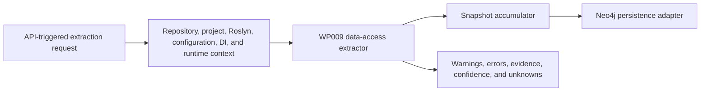

# Implementation Plan - WP009 Data Access Extraction

## Document Control

| Field | Value |
| --- | --- |
| Work Package | WP009 - Data Access Extraction |
| Target Output Path | `docs/009-Data-Access-Extraction/plan-wp009-data-access-extraction.md` |
| Source Specification | `docs/009-Data-Access-Extraction/spec-wp009-data-access-extraction.md` |
| Source Work Package | `docs/foundation/work-packages.md` WP009 |
| Mandatory Wiki Guidance | `./.github/instructions/wiki.instructions.md` |
| Mandatory Documentation-Pass Guidance | `./.github/instructions/documentation-pass.instructions.md` |
| Status | Completed |

## Planning Principles

This plan translates the WP009 specification into executable vertical work items. Each work item must preserve a runnable system state and must deliver a demonstrable data-access extraction capability through the established extraction or extractor test path. The plan avoids a horizontal-only sequence that builds every graph model before any usable extraction path exists.

Implementation must follow these repository standards as hard gates, not optional cleanup:

- `./.github/instructions/wiki.instructions.md` must be followed for every work item. Wiki review is mandatory for WP009, and wiki updates are required whenever developer-facing behavior, architecture, extraction workflow, data-access terminology, validation guidance, or contributor guidance changes or is materially clarified.
- `./.github/instructions/documentation-pass.instructions.md` must be followed in full for every task that creates, updates, reviews, or plans source code. Code is not acceptable unless the documentation-pass standard is met for every touched class, method, constructor, public parameter, and non-obvious property, including internal and other non-public types.
- Every code-writing task must include developer-level comments on every class, method, and constructor. Public methods and constructors must document every parameter. Properties whose purpose is not obvious from their names must be commented. Inline or block comments must explain purpose, logical flow, and algorithms where they materially help a developer understand the code.
- Source code must follow repository coding standards: Allman braces, block-scoped namespaces, no top-level statements, one public type per file, nullable reference types, underscore-prefixed private fields, and separated `PackageReference` and `ProjectReference` `.csproj` item groups.
- Active work-item execution must be uninterrupted. Once implementation starts for a work item, the executor must continue through implementation, validation, documentation/wiki review, and plan-record updates. The executor must not stop for status-only messages, ordinary fixable build/test failures, or confirmation prompts. The only allowed stops are full work-item completion, explicit user interruption or direction change, or a true blocker that cannot be resolved from the specification, this plan, codebase evidence, or repository guidance.
- The Aspire AppHost must not be run by automated validation as a blocking process. WP009 validation must use targeted tests, fixture projects, application-layer extraction seams, and solution builds.
- Standalone implementation notes, implementation ledgers, architecture notes, or similar contributor-facing narrative records are prohibited. Current-state contributor guidance, design rationale, validation workflows, troubleshooting guidance, terminology, and extension guidance must be written into `./wiki` according to `./.github/instructions/wiki.instructions.md`.
- `wiki/home.md` must remain a landing page and must not become the default destination for detailed data-access extraction guidance. Detailed contributor-facing guidance must go to the correct topic page or a newly created topic page selected by the mandatory wiki information-architecture review.
- Conceptually dense wiki content about data-access extraction, LINQ to SQL, DBML, EF6, EF Core, ADO.NET, typed DataSets, raw SQL, stored procedures, graph facts, evidence, confidence, unknowns, and validation must use longer book-like narrative prose. Technical terms must be defined on first use or linked to glossary entries, and examples or walkthrough material must be added when they materially improve contributor understanding.

## Overall Project Structure

WP009 implementation is expected to work primarily in these project areas:

```text
docs/
  009-Data-Access-Extraction/
	spec-wp009-data-access-extraction.md
	plan-wp009-data-access-extraction.md

src/
  Archon.Application/
  Archon.Api.Extraction/
  Archon.Roslyn/
  Archon.Roslyn.CSharp/
  Archon.Roslyn.VisualBasic/
  Archon.Extractors.Projects/
  Archon.Extractors.Configuration/
  Archon.Extractors.DependencyInjection/
  Archon.Extractors.DataAccess/

test/
  Archon.Application.Tests/
  Archon.Api.Extraction.Tests/
  Archon.Roslyn.Tests/
  Archon.Roslyn.CSharp.Tests/
  Archon.Roslyn.VisualBasic.Tests/
  Archon.Extractors.Projects.Tests/
  Archon.Extractors.Configuration.Tests/
  Archon.Extractors.DependencyInjection.Tests/
  Archon.Extractors.DataAccess.Tests/

wiki/
  home.md
  solution-architecture.md
  api-extraction-workflow.md
  graph-domain-model.md
  roslyn-semantic-extraction.md
  configuration-and-dependency-injection-extraction.md
  runtime-foundation.md
  validation-and-test-workflows.md
  glossary.md
  data-access-extraction.md                 # create only if the wiki IA review selects a dedicated page
```

The plan assumes WP001 through WP008 have already provided the solution skeleton, graph domain contracts, Neo4j persistence foundation, API extraction contract, repository/project extraction, Roslyn semantic extraction foundation, configuration/dependency-injection extraction context, and runtime extraction context. If implementation discovers those prerequisites are incomplete, record the discovery and adapt the implementation sequence without bypassing Onion Architecture.

## Contract Alignment Requirements

Before adding or changing extraction contracts, each work item must verify the current compiled contracts rather than inventing a parallel model. The WP009 specification identifies these relevant contract requirements:

- Data-access facts use the core graph node kinds `DbContext`, `LinqToSqlDataContext`, `Entity`, `DatabaseTable`, `DatabaseColumn`, and `StoredProcedure`, plus existing `Project`, `Type`, `Method`, `ConfigurationKey`, and `FilePath` nodes.
- Data-access relationships use `USES_DB_CONTEXT`, `USES_LINQ_TO_SQL_CONTEXT`, `MAPS_ENTITY`, `MAPS_TABLE`, `MAPS_COLUMN`, `READS_TABLE`, `WRITES_TABLE`, `CALLS_STORED_PROCEDURE`, and `EXECUTES_RAW_SQL`.
- Stable keys are deterministic and must not depend on database IDs, absolute developer machine paths, enumeration order, generated temporary paths, or live database metadata.
- `DbContext` stable keys use project key plus fully qualified context type name.
- `LinqToSqlDataContext` stable keys use project key plus DataContext type name or normalized `.dbml` model identity.
- `Entity` stable keys use project key plus fully qualified entity type name or model entity name.
- `DatabaseTable` stable keys use normalized database/schema/table identity where available plus owning model or context key.
- `DatabaseColumn` stable keys use table key plus normalized column name.
- `StoredProcedure` stable keys use normalized database/schema/procedure identity where available plus owning model or context key.
- Raw SQL usage keys use method key plus normalized call-site location and SQL text hash when available.
- Data-access relationship direction follows the WP009 decisions: project, type, or method nodes point to contexts through `USES_DB_CONTEXT` or `USES_LINQ_TO_SQL_CONTEXT`; contexts point to entities through `MAPS_ENTITY`; entities point to tables through `MAPS_TABLE`; entities or tables point to columns through `MAPS_COLUMN`; methods or contexts point to tables through `READS_TABLE` and `WRITES_TABLE`; methods, contexts, generated wrappers, or adapters point to stored procedures through `CALLS_STORED_PROCEDURE`; methods or contexts point to raw SQL facts through `EXECUTES_RAW_SQL`.
- Data-access metadata field names use stable lower camel case, including `dataAccessTechnology`, `framework`, `provider`, `targetFramework`, `contextType`, `modelFilePath`, `generatedFilePath`, `entityType`, `tableName`, `schemaName`, `databaseName`, `columnName`, `propertyName`, `relationshipKind`, `storedProcedureName`, `commandType`, `commandApi`, `sqlTextHash`, `sqlPreview`, `readWriteHint`, `isDynamicSql`, `migrationName`, `providerConfigurationCall`, `connectionStringKey`, `configurationKey`, `detectionMode`, `confidenceReason`, and `unknownReason`.
- Data-access subtypes are metadata values, not new graph node kinds. Examples include `dataAccessTechnology` values `LinqToSql`, `EntityFramework6`, `EntityFrameworkCore`, `AdoNet`, `TypedDataSet`, and `RawSql`; `provider` values `SqlServer`, `Sqlite`, `PostgreSql`, `OleDb`, `Odbc`, and `Unknown`; and `readWriteHint` values `Read`, `Write`, `ReadWrite`, and `Unknown`.
- Evidence records must support source code, XML model artifacts, configuration keys, generated source, line spans or XML artifact locations, snippet hashes, snippet previews with secret redaction, confidence, detection mode, and unknown reasons.
- Snapshot accumulation accepts nodes, edges, evidence, warnings, and errors and defines deterministic duplicate handling.

If the implemented contracts differ from the specification wording, the implementation must follow actual compiled contracts first, then update this plan's execution record and wiki guidance with the exact current behavior.

## Work Items

## 1. Minimal LINQ to SQL DBML Slice

- [x] Work Item 1: Deliver an end-to-end LINQ to SQL `.dbml` model extraction path - Completed
  - **Purpose**: Establish the smallest meaningful WP009 vertical slice: a fixture containing a LINQ to SQL `.dbml` file is analyzed through the data-access extractor, projected into graph contracts, accumulated into snapshot output, and verified with tests.
  - **Acceptance Criteria**:
	- `.dbml` files are detected in an analyzed target repository fixture.
	- DataContext, database, table, column, association, function, stored procedure, and entity facts are extracted where present in model metadata.
	- `LinqToSqlDataContext`, `Entity`, `DatabaseTable`, `DatabaseColumn`, and `StoredProcedure` nodes are emitted through the snapshot contract.
	- `MAPS_ENTITY`, `MAPS_TABLE`, `MAPS_COLUMN`, and stored procedure relationships are emitted where supported by the established graph contract.
	- Evidence includes repository-relative file path, XML artifact location where available, snippet hash, redacted snippet preview, detection mode, and confidence.
	- Malformed or partial `.dbml` content produces warnings and explicit unknowns where partial facts are available.
	- The slice runs without Neo4j direct writes, live database connections, migration execution, API query endpoints, MCP tools, markdown export, snapshot diff, or Discovery UI.
  - **Definition of Done**:
	- LINQ to SQL `.dbml` extraction is implemented end to end through shared contracts, extractor code, accumulation, and tests.
	- WP002/WP009 graph contracts are used or extended only through the correct application/domain contract seams.
	- Logging and ordinary error handling are added where the extraction path has meaningful runtime decisions.
	- Source code written in this work item complies with `./.github/instructions/documentation-pass.instructions.md` in full, including comments for every class, method, constructor, public parameter, and non-obvious property, including internal and non-public code.
	- Wiki review is performed for data-access extraction, LINQ to SQL, DBML, DataContext, entity, database table, database column, stored procedure, evidence, confidence, and unknown terminology; relevant wiki or repository guidance is updated, or an explicit no-change result is recorded.
	- Foundational documentation uses book-like narrative depth for data-access extraction, DBML model facts, stable keys, evidence, confidence, and unknown concepts; technical terms are defined on first use or linked to glossary entries.
	- Can execute end to end via targeted data-access extractor tests.
	- Executor must not stop mid-work-item unless the work item is complete, the user explicitly interrupts, or a true blocker prevents further autonomous progress.
	- [x] Task 1: Inspect existing data-access and graph contracts - Completed
	- [x] Step 1: Located current node kinds, edge kinds, evidence kinds, confidence, unknown-state, metadata, stable-key, fingerprint, and snapshot accumulation contracts.
	- [x] Step 2: Confirmed `DbContext`, `LinqToSqlDataContext`, `Entity`, `DatabaseTable`, `DatabaseColumn`, `StoredProcedure`, and all required WP009 relationship kinds already exist in domain controlled values.
	- [x] Step 3: Confirmed DBML evidence uses existing `EvidenceKind.Dbml`, repository-relative paths, line spans, snippet hash/preview, and metadata for XML artifact location.
	- [x] Step 4: Documented touched source contracts and implementation code according to `./.github/instructions/documentation-pass.instructions.md`.
  - [x] Task 2: Add or align the data-access extraction entry contracts - Completed
	- [x] Step 1: Added `LinqToSqlDbmlExtractionRequest` and `LinqToSqlDbmlExtractionResult` as the smallest extractor-facing DBML entry contracts.
	- [x] Step 2: Reused `ArchitectureSnapshotAccumulator`, `ExtractedArchitectureSnapshot`, architecture node/edge/evidence contracts, metadata, confidence, unknown-state, stable-key, and fingerprint contracts.
	- [x] Step 3: Kept extractor code in `Archon.Extractors.DataAccess`; API orchestration references the extractor project without adding host, infrastructure, Neo4j, UI, or MCP dependencies to extractor code.
  - [x] Task 3: Implement DBML detection and parsing - Completed
	- [x] Step 1: Implemented deterministic `.dbml` file discovery under the accepted repository root, excluding build output paths.
	- [x] Step 2: Parsed DataContext, database, safe connection identifiers, tables, columns, associations, functions, stored procedures, and entity names from XML without connecting to a database.
	- [x] Step 3: Redacted secret-like connection information while preserving safe configuration key names, provider names, and model locations.
	- [x] Step 4: Emitted graph-ready nodes, relationships, metadata, evidence, confidence, warnings, and unknowns through the shared snapshot contract.
  - [x] Task 4: Add focused tests and validation - Completed
	- [x] Step 1: Added fixture coverage for complete DBML, partial DBML, malformed DBML, and secret-like connection values.
	- [x] Step 2: Asserted node kinds, relationship kinds, stable keys, metadata, confidence, unknown state, warnings, evidence, snippet hashes, and redaction behavior.
	- [x] Step 3: Ran targeted data-access extractor tests and API extraction tests after wiring the stage.
  - [x] Task 5: Perform documentation and wiki review for the slice - Completed
	- [x] Step 1: Reviewed `wiki/graph-domain-model.md`, `wiki/api-extraction-workflow.md`, `wiki/validation-and-test-workflows.md`, `wiki/glossary.md`, `wiki/home.md`, and selected a new `wiki/data-access-extraction.md` topic page.
	- [x] Step 2: Updated selected wiki pages with current-state data-access extraction guidance required by `./.github/instructions/wiki.instructions.md`.
	- [x] Step 3: Recorded the wiki review result with page-structure decision and impact matrix in this plan after implementation.
  - **Completion Summary**: Implemented `src/Archon.Extractors.DataAccess/LinqToSql/**` with DBML request/result contracts and `LinqToSqlDbmlModelExtractor`; added `Wp009DataAccessExtractionStage`, stage registration, and `Archon.Extractors.DataAccess` project reference in `src/Archon.Api.Extraction`; added DBML extractor tests and API pipeline integration coverage; updated wiki guidance instead of creating standalone implementation notes. Validation performed: `dotnet test .\test\Archon.Extractors.DataAccess.Tests\Archon.Extractors.DataAccess.Tests.csproj` passed (5 tests), `dotnet test .\test\Archon.Api.Extraction.Tests\Archon.Api.Extraction.Tests.csproj --filter DataAccess` passed (1 test), full `dotnet test .\test\Archon.Api.Extraction.Tests\Archon.Api.Extraction.Tests.csproj` passed (17 tests), and workspace build succeeded.
  - **Wiki Review Result / Impact Matrix**: Affected concepts were LINQ to SQL DBML model extraction, DataContext, entity, database table, database column, stored procedure, association, DBML evidence, confidence, unknown state, redaction, API stage registration, and validation workflow. Pages reviewed: `wiki/home.md`, `wiki/graph-domain-model.md`, `wiki/api-extraction-workflow.md`, `wiki/validation-and-test-workflows.md`, and `wiki/glossary.md`. Pages updated: all reviewed pages plus new `wiki/data-access-extraction.md`. Pages created: `wiki/data-access-extraction.md`, selected because data-access extraction is a conceptually dense contributor topic that should not be appended wholesale to graph, API, validation, or landing pages. Pages intentionally unchanged: no runtime-foundation, setup, or Neo4j page changes were needed because the DBML slice does not alter Aspire composition, host setup, Neo4j schema, or persistence adapter behavior. Page-structure decision: `wiki/home.md` remains a concise landing page with only links and summary updates; detailed current-state data-access guidance lives on the dedicated topic page with book-like narrative depth.
  - **Files**:
	- `src/Archon.Extractors.DataAccess/**`: LINQ to SQL DBML extraction implementation.
	- `src/Archon.Application/**`: Shared extraction or accumulation contracts only if needed.
	- `src/Archon.Roslyn/**`: Shared evidence or source artifact helper extensions only if needed.
	- `src/Archon.Api.Extraction/**`: Extraction stage registration only if needed for the end-to-end path.
	- `test/Archon.Extractors.DataAccess.Tests/**`: DBML extraction tests.
	- `test/Archon.Api.Extraction.Tests/**`: Pipeline integration tests only if needed for stage wiring.
	- `wiki/**`: Topic pages selected by mandatory wiki review.
  - **Work Item Dependencies**: WP001 through WP008 foundation outputs.
  - **Run / Verification Instructions**:
	- `dotnet test .\test\Archon.Extractors.DataAccess.Tests\Archon.Extractors.DataAccess.Tests.csproj`
	- `dotnet test .\test\Archon.Api.Extraction.Tests\Archon.Api.Extraction.Tests.csproj --filter DataAccess`
	- `dotnet build .\Archon.slnx --no-restore`
  - **User Instructions**:
	- None expected unless package restore or the required .NET SDK is unavailable.

## 2. LINQ to SQL Designer and Usage Slice

- [x] Work Item 2: Expand LINQ to SQL extraction to generated designer files and source-code usage - Completed
  - **Purpose**: Make LINQ to SQL first-class beyond DBML parsing by correlating generated designer code and actual source usage with model facts.
  - **Acceptance Criteria**:
	- Generated designer DataContext classes, entity classes, `Table<T>` properties, table mappings, column mappings, associations, stored procedure methods, and parameters are detected.
	- Direct `System.Data.Linq.DataContext` usage, generated DataContext construction, `Table<T>` queries, `GetTable<T>()`, `SubmitChanges()`, `InsertOnSubmit()`, `DeleteOnSubmit()`, `Attach()`, `ExecuteQuery<T>()`, `ExecuteCommand()`, and generated stored procedure wrapper calls are detected.
	- Usage facts link projects and methods to DataContexts, entities, tables, stored procedures, raw SQL, and read/write hints where evidence supports the link.
	- DBML, designer, and usage facts are deduplicated by deterministic stable keys.
	- Computed SQL, unresolved DataContext targets, and unresolved table targets are represented as explicit unknowns.
  - **Definition of Done**:
	- LINQ to SQL designer and usage extraction runs through the same data-access extractor entry path as Work Item 1.
	- Tests cover designer extraction, source usage, writes, reads, raw SQL, stored procedure wrappers, deduplication, evidence, confidence, and unknowns.
	- Source code complies with `./.github/instructions/documentation-pass.instructions.md` in full for all touched code.
	- Wiki review is performed for generated designer files, `Table<T>`, mapping attributes, stored procedure wrappers, read/write hints, and raw SQL terminology; relevant pages are updated or an explicit no-change result is recorded.
	- Can execute end to end via targeted data-access extractor tests.
	- Executor must not stop mid-work-item unless the work item is complete, the user explicitly interrupts, or a true blocker prevents further autonomous progress.
	- [x] Task 1: Extend LINQ to SQL pattern catalog - Completed
	- [x] Step 1: Added descriptors and symbol checks for `System.Data.Linq.DataContext`, `Table<T>`, `GetTable<T>()`, and generated DataContext inheritance.
	- [x] Step 2: Added descriptors for `[Table]`, `[Column]`, `[Association]`, `[Function]`, and `[Parameter]` attributes through Roslyn attribute readers.
	- [x] Step 3: Added descriptors for `SubmitChanges`, `InsertOnSubmit`, `DeleteOnSubmit`, `Attach`, `ExecuteQuery`, `ExecuteCommand`, and stored procedure wrapper patterns.
  - [x] Task 2: Implement designer extraction - Completed
	- [x] Step 1: Detects generated LINQ to SQL designer source from semantic C# documents, DataContext inheritance, and LINQ to SQL mapping attributes.
	- [x] Step 2: Extracts generated contexts, entities, table properties, table mappings, column mappings, associations, functions, stored procedure methods, and parameters.
	- [x] Step 3: Correlates designer facts with DBML facts using deterministic model paths, type names, table names, and stored-procedure names so stable keys deduplicate model concepts.
  - [x] Task 3: Implement usage extraction - Completed
	- [x] Step 1: Detects DataContext construction and DataContext use in methods.
	- [x] Step 2: Detects table reads, writes, raw SQL execution, and stored procedure wrapper calls with method-level evidence.
	- [x] Step 3: Emits usage relationships, read/write hints, raw SQL metadata, unknowns, and warnings for unresolved table targets and computed SQL.
  - [x] Task 4: Add tests and validation - Completed
	- [x] Step 1: Added fixture coverage with DBML plus generated designer source and usage source.
	- [x] Step 2: Asserted graph facts, relationship direction, metadata fields, evidence, confidence, unknowns, and deduplication.
	- [x] Step 3: Ran targeted data-access tests, API data-access tests, and a solution build.
  - [x] Task 5: Perform documentation and wiki review - Completed
	- [x] Step 1: Reviewed whether wiki guidance explains LINQ to SQL model, generated designer, and source-usage correlation.
	- [x] Step 2: Updated selected topic pages for current-state data-access extraction behavior.
	- [x] Step 3: Recorded the wiki review result in this plan after implementation.
  - **Completion Summary**: Expanded `LinqToSqlDbmlModelExtractor` and `LinqToSqlDbmlExtractionRequest` so the Work Item 1 entry path now accepts Roslyn semantic documents and extracts generated designer and source usage facts in addition to DBML facts. Added generated designer extraction for DataContext inheritance, `Table<T>` properties, `[Table]`, `[Column]`, `[Association]`, `[Function]`, and `[Parameter]` mappings. Added method-level usage extraction for DataContext construction, generated table-property reads, `GetTable<T>()`, `InsertOnSubmit`, `DeleteOnSubmit`, `Attach`, `SubmitChanges`, `ExecuteQuery<T>()`, `ExecuteCommand()`, and generated stored-procedure wrapper calls. Added `DesignerGeneratedCode` and `SourceCode` evidence, method nodes, raw SQL nodes, `USES_LINQ_TO_SQL_CONTEXT`, `READS_TABLE`, `WRITES_TABLE`, `CALLS_STORED_PROCEDURE`, and `EXECUTES_RAW_SQL` relationships, read/write hints, raw SQL metadata, DBML/designer stable-key deduplication, and explicit unknowns for unresolved `GetTable<T>()` targets and computed SQL. Added `RoslynSemanticDocumentLoader` and updated `Wp009DataAccessExtractionStage` so the API stage loads C# semantic documents from submitted solutions and passes them to data-access extraction. Added focused tests in `LinqToSqlDesignerAndUsageExtractorTests`. Validation performed: `dotnet test .\test\Archon.Extractors.DataAccess.Tests\Archon.Extractors.DataAccess.Tests.csproj` passed (7 tests), `dotnet test .\test\Archon.Api.Extraction.Tests\Archon.Api.Extraction.Tests.csproj --filter DataAccess` passed (1 test), and workspace build succeeded.
  - **Wiki Review Result / Impact Matrix**: Affected concepts were LINQ to SQL generated designer extraction, source usage extraction, DataContext, `Table<T>`, mapping attributes, stored procedure wrappers, raw SQL, read/write hints, DBML/designer/source evidence, stable-key deduplication, explicit unknowns, and API semantic document loading. Pages reviewed: `wiki/data-access-extraction.md`, `wiki/api-extraction-workflow.md`, `wiki/validation-and-test-workflows.md`, `wiki/graph-domain-model.md`, `wiki/home.md`, and `wiki/glossary.md`. Pages updated: `wiki/data-access-extraction.md`, `wiki/api-extraction-workflow.md`, `wiki/validation-and-test-workflows.md`, and `wiki/graph-domain-model.md`. Pages created: none for Work Item 2 because the existing dedicated data-access topic page remains the correct home. Pages intentionally unchanged: `wiki/home.md`, `wiki/glossary.md`, runtime, setup, and Neo4j pages were left unchanged because Work Item 2 did not alter the top-level wiki structure, terminology requiring new glossary entries, Aspire composition, local setup, Neo4j schema, or persistence adapter behavior. Page-structure decision: keep detailed LINQ to SQL designer and usage guidance in `wiki/data-access-extraction.md`; use API, graph, and validation pages only for cross-topic current-state summaries and commands.
  - **Files**:
	- `src/Archon.Extractors.DataAccess/**`: LINQ to SQL designer and usage extraction.
	- `src/Archon.Roslyn.CSharp/**`, `src/Archon.Roslyn.VisualBasic/**`: Shared invocation, attribute, or symbol helpers only if needed.
	- `test/Archon.Extractors.DataAccess.Tests/**`: LINQ to SQL designer and usage tests.
	- `wiki/**`: Topic pages selected by mandatory wiki review.
  - **Work Item Dependencies**: Work Item 1.
  - **Run / Verification Instructions**:
	- `dotnet test .\test\Archon.Extractors.DataAccess.Tests\Archon.Extractors.DataAccess.Tests.csproj --filter LinqToSql`
	- `dotnet build .\Archon.slnx --no-restore`
  - **User Instructions**:
	- None expected.

## 3. Entity Framework 6 and Entity Framework Core Slice

- [x] Work Item 3: Deliver EF6 and EF Core context, mapping, migration, provider, raw SQL, and usage extraction - Completed
  - **Purpose**: Add the primary ORM data-access path used by modern and legacy .NET repositories while preserving deterministic graph output and static-only analysis.
  - **Acceptance Criteria**:
	- EF6 usage is detected from packages, namespaces, base types, source artifacts, and configuration where evidence exists.
	- EF Core usage is detected from packages, namespaces, base types, source artifacts, and configuration where evidence exists.
	- EF6 and EF Core `DbContext`, `ObjectContext`, `DbSet<T>`, entity classes, mapping attributes, `OnModelCreating`, `EntityTypeConfiguration`, relationships, migrations, provider configuration, `SaveChanges`, `SaveChangesAsync`, and raw SQL APIs are detected where present.
	- Provider configuration calls and connection-string key references are captured without persisting secret-like values.
	- Convention-only mappings, shadow properties, dynamic model configuration, unresolved providers, and unresolved table names are represented through confidence and unknown metadata.
  - **Definition of Done**:
	- EF extraction runs through the same data-access extractor entry path as prior work items.
	- Tests cover EF6, EF Core, mapping, relationships, migrations, providers, raw SQL APIs, saves, usage sites, evidence, confidence, unknowns, and redaction.
	- Source code complies with `./.github/instructions/documentation-pass.instructions.md` in full for all touched code.
	- Wiki review is performed for EF context, ObjectContext, DbSet, entity, migration, provider, Fluent API, convention mapping, and raw SQL terminology; relevant pages are updated or an explicit no-change result is recorded.
	- Can execute end to end via targeted data-access extractor tests.
	- Executor must not stop mid-work-item unless the work item is complete, the user explicitly interrupts, or a true blocker prevents further autonomous progress.
	- [x] Task 1: Extend EF pattern catalog - Completed
	- [x] Step 1: Added descriptors and symbol checks for EF6 and EF Core namespaces, base types, `DbContext`, `ObjectContext`, and `DbSet<T>`.
	- [x] Step 2: Added descriptors for mapping attributes, `OnModelCreating` Fluent API chains, migration classes, and migration operations.
	- [x] Step 3: Added descriptors for provider configuration calls, `SaveChanges`, `SaveChangesAsync`, and EF raw SQL APIs.
  - [x] Task 2: Implement context, entity, and mapping extraction - Completed
	- [x] Step 1: Detects EF6 and EF Core context types and legacy object contexts from static source symbols.
	- [x] Step 2: Extracts DbSet entity types, mapping metadata, relationships, convention unknowns, and EF Core shadow-property unknowns.
	- [x] Step 3: Emits `DbContext`, `Entity`, `DatabaseTable`, `DatabaseColumn`, `MAPS_ENTITY`, `MAPS_TABLE`, and `MAPS_COLUMN` facts where supported.
  - [x] Task 3: Implement migrations, provider, and usage extraction - Completed
	- [x] Step 1: Detects EF6 and EF Core migration classes and supported migration operations from source artifacts without executing migrations.
	- [x] Step 2: Detects provider setup and safe connection-string key references with redaction of secret-like values.
	- [x] Step 3: Detects save calls, raw SQL calls, method usage sites, read/write hints, computed SQL unknowns, and context usage relationships.
  - [x] Task 4: Add tests and validation - Completed
	- [x] Step 1: Added EF6 fixture coverage for contexts, ObjectContext, DbSets, mappings, migrations, providers, raw SQL, and saves.
	- [x] Step 2: Added EF Core fixture coverage for contexts, DbSets, Fluent API, migrations, providers, raw SQL, saves, relationships, and shadow properties.
	- [x] Step 3: Asserted graph facts, metadata, evidence, confidence, redaction, unknowns, and deterministic stable-key behavior.
  - [x] Task 5: Perform documentation and wiki review - Completed
	- [x] Step 1: Reviewed whether wiki guidance explains EF6 versus EF Core extraction boundaries and terminology.
	- [x] Step 2: Updated selected topic pages and glossary entries for current-state EF extraction behavior.
	- [x] Step 3: Recorded the wiki review result in this plan after implementation.
  - **Completion Summary**: Added `EntityFrameworkModelExtractor` under `src/Archon.Extractors.DataAccess/EntityFramework` and wired it into the existing WP009 data-access entry path in `LinqToSqlDbmlModelExtractor`. The extractor statically recognizes EF6 `DbContext`, EF6 `ObjectContext`, EF Core `DbContext`, `DbSet<TEntity>` entity mappings, table and column attributes, supported Fluent API mapping chains, convention-only table mappings, EF Core shadow properties, EF6 and EF Core migration classes and operations, provider configuration calls, safe `name=` connection-string keys, context construction or parameter usage, `DbSet` reads and writes, `SaveChanges`, `SaveChangesAsync`, EF6 raw SQL APIs, EF Core raw SQL APIs, computed SQL unknowns, redacted SQL previews, and read/write hints. Added focused `EntityFrameworkExtractorTests` for EF6 and EF Core fixtures covering graph facts, metadata, evidence, confidence, redaction, unknowns, and stable keys. Validation performed: `dotnet test .\test\Archon.Extractors.DataAccess.Tests\Archon.Extractors.DataAccess.Tests.csproj --filter EntityFramework` passed (2 tests), `dotnet test .\test\Archon.Extractors.DataAccess.Tests\Archon.Extractors.DataAccess.Tests.csproj` passed (9 tests), `dotnet test .\test\Archon.Api.Extraction.Tests\Archon.Api.Extraction.Tests.csproj --filter DataAccess` passed (1 test), and workspace build succeeded.
  - **Wiki Review Result / Impact Matrix**: Affected concepts were EF6 extraction, EF Core extraction, `DbContext`, `ObjectContext`, `DbSet`, entity mapping, table mapping, column mapping, Fluent API, convention-only mapping, EF Core shadow properties, migrations, provider configuration, safe connection-string key capture, raw SQL APIs, save calls, source evidence, confidence, unknown state, redaction, and API data-access stage boundaries. Pages reviewed: `wiki/data-access-extraction.md`, `wiki/api-extraction-workflow.md`, `wiki/validation-and-test-workflows.md`, `wiki/graph-domain-model.md`, `wiki/glossary.md`, and `wiki/home.md`. Pages updated: all reviewed pages. Pages created: none; the existing dedicated `wiki/data-access-extraction.md` page remains the correct home for the expanded ORM extraction topic. Pages intentionally unchanged: runtime, setup, and Neo4j pages were left unchanged because this slice does not alter Aspire composition, local setup, Neo4j schema, or persistence adapter behavior. Page-structure decision: keep detailed EF6 and EF Core guidance in `wiki/data-access-extraction.md`, use API, graph, validation, and glossary pages only for cross-topic summaries and terms, and keep `wiki/home.md` concise as a landing page.
  - **Files**:
	- `src/Archon.Extractors.DataAccess/**`: EF6 and EF Core extraction.
	- `src/Archon.Extractors.Configuration/**`: Connection-string and provider correlation only if needed.
	- `src/Archon.Extractors.DependencyInjection/**`: DbContext registration correlation only if needed.
	- `test/Archon.Extractors.DataAccess.Tests/**`: EF extraction tests.
	- `test/Archon.Extractors.Configuration.Tests/**`: Configuration correlation tests only if behavior changes.
	- `test/Archon.Extractors.DependencyInjection.Tests/**`: DI correlation tests only if behavior changes.
	- `wiki/**`: Topic pages selected by mandatory wiki review.
  - **Work Item Dependencies**: Work Items 1 and 2.
  - **Run / Verification Instructions**:
	- `dotnet test .\test\Archon.Extractors.DataAccess.Tests\Archon.Extractors.DataAccess.Tests.csproj --filter EntityFramework`
	- `dotnet test .\test\Archon.Extractors.Configuration.Tests\Archon.Extractors.Configuration.Tests.csproj --filter DataAccess`
	- `dotnet test .\test\Archon.Extractors.DependencyInjection.Tests\Archon.Extractors.DependencyInjection.Tests.csproj --filter DbContext`
	- `dotnet build .\Archon.slnx --no-restore`
  - **User Instructions**:
	- None expected.

## 4. ADO.NET, Raw SQL, and Stored Procedure Slice

- [x] Work Item 4: Deliver ADO.NET command, raw SQL, stored procedure, read/write, dynamic SQL, and affected-table extraction - Completed
  - **Purpose**: Expose explicit database command usage and raw SQL coupling that is not represented by ORM models.
  - **Acceptance Criteria**:
	- `SqlConnection`, `SqlCommand`, `SqlDataReader`, `SqlDataAdapter`, `DataSet`, `DataTable`, `DbConnection`, `DbCommand`, `OleDbConnection`, `OdbcConnection`, and related command usage are detected.
	- `ExecuteReader`, `ExecuteNonQuery`, and `ExecuteScalar` are detected and classified with read/write hints where evidence allows.
	- Static SQL text, stored procedure command types, stored procedure names, raw SQL execution, dynamic SQL indicators, redacted SQL previews, SQL hashes, and affected table hints are captured where deterministically possible.
	- Secret-like values are redacted from command evidence, configuration evidence, warnings, errors, metadata, logs, and tests.
	- Dynamic or computed SQL is represented with partial evidence, lower confidence, and explicit unknown reasons.
  - **Definition of Done**:
	- ADO.NET and raw SQL extraction runs through the same data-access extractor entry path as prior work items.
	- Tests cover provider APIs, command execution methods, static SQL, dynamic SQL, stored procedures, read/write hints, affected table hints, evidence, confidence, unknowns, and redaction.
	- Source code complies with `./.github/instructions/documentation-pass.instructions.md` in full for all touched code.
	- Wiki review is performed for ADO.NET, raw SQL, stored procedure, read/write hint, affected table hint, dynamic SQL, provider, and command terminology; relevant pages are updated or an explicit no-change result is recorded.
	- Can execute end to end via targeted data-access extractor tests.
	- Executor must not stop mid-work-item unless the work item is complete, the user explicitly interrupts, or a true blocker prevents further autonomous progress.
	- [x] Task 1: Extend ADO.NET and SQL pattern catalog - Completed
	- [x] Step 1: Add descriptors for concrete and abstract ADO.NET connection, command, reader, adapter, dataset, and table APIs.
	- [x] Step 2: Add descriptors for `ExecuteReader`, `ExecuteNonQuery`, `ExecuteScalar`, command text assignments, parameters, and `CommandType.StoredProcedure`.
	- [x] Step 3: Add conservative SQL statement classification helpers for read/write hints, table hints, SQL hashing, SQL preview, and dynamic SQL indicators.
  - [x] Task 2: Implement ADO.NET extraction - Completed
	- [x] Step 1: Detect connections, commands, provider types, command text, command type, and configuration key usage.
	- [x] Step 2: Detect execution methods and method-level usage sites.
	- [x] Step 3: Emit context-free data-access usage relationships, stored procedure nodes, raw SQL metadata, read/write relationships, evidence, confidence, and unknowns.
  - [x] Task 3: Implement raw SQL safety and redaction - Completed
	- [x] Step 1: Redact secret-like SQL literals, connection fragments, and configuration values before storage or test output.
	- [x] Step 2: Hash SQL text where required and store only redacted previews in metadata or evidence.
	- [x] Step 3: Preserve partial evidence for dynamic SQL without speculative full parsing.
  - [x] Task 4: Add tests and validation - Completed
	- [x] Step 1: Add fixtures for static SELECT, INSERT, UPDATE, DELETE, MERGE, DDL, stored procedure calls, unknown command text, concatenated SQL, interpolated SQL, and computed SQL.
	- [x] Step 2: Assert graph facts, read/write hints, affected table hints, stored procedure relationships, raw SQL relationships, redaction, evidence, confidence, unknowns, and warnings.
	- [x] Step 3: Run targeted data-access tests and a solution build.
  - [x] Task 5: Perform documentation and wiki review - Completed
	- [x] Step 1: Review whether wiki guidance explains static SQL analysis limits, dynamic SQL unknowns, and no-live-database constraints.
	- [x] Step 2: Update selected topic pages and glossary entries if needed.
	- [x] Step 3: Record the wiki review result in this plan after implementation.
  - **Completion Summary**:
	- Implemented `AdoNetRawSqlExtractor` in `src/Archon.Extractors.DataAccess/AdoNet/` and composed it through the existing WP009 data-access entry path in `LinqToSqlDbmlModelExtractor` so ADO.NET and raw SQL facts run alongside LINQ to SQL and Entity Framework facts.
	- Added `test/Archon.Extractors.DataAccess.Tests/AdoNetRawSqlExtractorTests.cs` covering SqlClient, abstract `DbCommand`, OleDb/Odbc provider shapes, command text assignments, target-typed command creation, `ExecuteReader`, `ExecuteNonQuery`, `ExecuteScalar`, adapter `Fill`, stored procedures, static SQL, dynamic SQL, missing command text, SQL preview/hash metadata, affected table hints, read/write hints, evidence, confidence, unknowns, warnings, and secret redaction.
	- Validation completed successfully: `dotnet test .\test\Archon.Extractors.DataAccess.Tests\Archon.Extractors.DataAccess.Tests.csproj --filter AdoNet`; `dotnet test .\test\Archon.Extractors.DataAccess.Tests\Archon.Extractors.DataAccess.Tests.csproj --filter RawSql`; `dotnet test .\test\Archon.Extractors.DataAccess.Tests\Archon.Extractors.DataAccess.Tests.csproj`; `dotnet test .\test\Archon.Api.Extraction.Tests\Archon.Api.Extraction.Tests.csproj --filter DataAccess`; `dotnet build .\Archon.slnx --no-restore`.
	- Documentation-pass review completed for touched source and test code; new classes, constructors, methods, records, properties with non-obvious meaning, and non-obvious logic include developer-level comments following repository standards.
	- Wiki review result: updated `wiki/data-access-extraction.md`, `wiki/api-extraction-workflow.md`, `wiki/validation-and-test-workflows.md`, `wiki/graph-domain-model.md`, `wiki/glossary.md`, and `wiki/home.md`.
	- Wiki impact matrix: affected concepts include ADO.NET, connection, command, reader, adapter, DataSet, DataTable, `DbCommand`, `ExecuteReader`, `ExecuteNonQuery`, `ExecuteScalar`, adapter `Fill`, raw SQL, stored procedure command type, SQL preview/hash, affected table hint, read/write hint, dynamic SQL, computed SQL unknowns, missing command text unknowns, provider hints, evidence, confidence, and secret redaction. Pages reviewed were `wiki/home.md`, `wiki/data-access-extraction.md`, `wiki/api-extraction-workflow.md`, `wiki/validation-and-test-workflows.md`, `wiki/graph-domain-model.md`, and `wiki/glossary.md`. Pages updated were those same pages. Pages created: none. Pages intentionally unchanged: runtime, setup, Neo4j, Roslyn, and configuration/dependency-injection pages because this slice did not alter host composition, persistence behavior, semantic extraction contracts, or configuration extraction behavior. Page-structure decision: detailed ADO.NET/raw SQL guidance belongs in the existing dedicated `wiki/data-access-extraction.md` topic page; `wiki/home.md` remains a concise landing page with only updated orientation and links.
  - **Files**:
	- `src/Archon.Extractors.DataAccess/**`: ADO.NET, raw SQL, stored procedure, read/write, dynamic SQL, redaction, and affected-table extraction.
	- `src/Archon.Application/**`: Shared redaction or metadata contracts only if needed.
	- `test/Archon.Extractors.DataAccess.Tests/**`: ADO.NET and raw SQL tests.
	- `wiki/**`: Topic pages selected by mandatory wiki review.
  - **Work Item Dependencies**: Work Items 1 through 3.
  - **Run / Verification Instructions**:
	- `dotnet test .\test\Archon.Extractors.DataAccess.Tests\Archon.Extractors.DataAccess.Tests.csproj --filter AdoNet`
	- `dotnet test .\test\Archon.Extractors.DataAccess.Tests\Archon.Extractors.DataAccess.Tests.csproj --filter RawSql`
	- `dotnet build .\Archon.slnx --no-restore`
  - **User Instructions**:
	- None expected.

## 5. Typed DataSet Slice

- [x] Work Item 5: Deliver typed DataSet `.xsd`, generated code, TableAdapter, query, stored procedure, and usage extraction - Completed
  - **Purpose**: Add extraction for legacy typed DataSet patterns that commonly appear alongside LINQ to SQL and ADO.NET in .NET Framework estates.
  - **Acceptance Criteria**:
	- `.xsd` files defining typed DataSets are detected and parsed.
	- Typed DataSet names, DataTable definitions, TableAdapter definitions, queries, stored procedures, and generated typed DataSet classes are extracted where available.
	- Usage sites for typed DataSets, DataTables, TableAdapters, queries, and stored procedure wrappers are detected.
	- `.xsd`, generated source, and usage facts are correlated and deduplicated where deterministic identifiers or file relationships support correlation.
	- Partial or malformed `.xsd` artifacts produce warnings and explicit unknowns where partial facts are available.
  - **Definition of Done**:
	- Typed DataSet extraction runs through the same data-access extractor entry path as prior work items.
	- Tests cover `.xsd` parsing, generated source, table adapters, queries, stored procedures, usage sites, evidence, confidence, unknowns, redaction, and deduplication.
	- Source code complies with `./.github/instructions/documentation-pass.instructions.md` in full for all touched code.
	- Wiki review is performed for typed DataSet, DataTable, TableAdapter, query, generated source, and stored procedure terminology; relevant pages are updated or an explicit no-change result is recorded.
	- Can execute end to end via targeted data-access extractor tests.
	- Executor must not stop mid-work-item unless the work item is complete, the user explicitly interrupts, or a true blocker prevents further autonomous progress.
	- [x] Task 1: Extend typed DataSet pattern catalog - Completed
	- [x] Step 1: Add descriptors for `.xsd` typed DataSet artifacts, DataSet names, DataTables, TableAdapters, queries, and stored procedure references.
	- [x] Step 2: Add descriptors for generated typed DataSet classes and usage patterns.
	- [x] Step 3: Define deterministic correlation and deduplication keys between `.xsd`, generated source, and usage facts.
  - [x] Task 2: Implement `.xsd` extraction - Completed
	- [x] Step 1: Parse typed DataSet names, DataTables, TableAdapters, queries, stored procedures, and parameters from XML artifacts without live database access.
	- [x] Step 2: Emit graph-ready nodes, relationships, metadata, evidence, confidence, warnings, and unknowns.
	- [x] Step 3: Redact secret-like values in query or connection metadata.
  - [x] Task 3: Implement generated source and usage extraction - Completed
	- [x] Step 1: Detect generated typed DataSet source files and correlate them with `.xsd` facts.
	- [x] Step 2: Detect DataSet, DataTable, TableAdapter, query, and stored procedure wrapper usage sites.
	- [x] Step 3: Emit usage relationships, read/write hints, stored procedure relationships, raw SQL metadata where applicable, evidence, confidence, and unknowns.
  - [x] Task 4: Add tests and validation - Completed
	- [x] Step 1: Add typed DataSet `.xsd`, generated source, and usage fixtures.
	- [x] Step 2: Assert graph facts, metadata, evidence, confidence, unknowns, warnings, redaction, and deduplication.
	- [x] Step 3: Run targeted data-access tests and a solution build.
  - [x] Task 5: Perform documentation and wiki review - Completed
	- [x] Step 1: Review whether wiki guidance explains typed DataSet extraction and its relationship to ADO.NET and stored procedures.
	- [x] Step 2: Update selected topic pages and glossary entries if needed.
	- [x] Step 3: Record the wiki review result in this plan after implementation.
  - **Completion Summary**:
	- Implemented `TypedDataSetExtractor` in `src/Archon.Extractors.DataAccess/TypedDataSet/` and composed it through the existing WP009 data-access entry path in `LinqToSqlDbmlModelExtractor` so typed DataSet facts run alongside LINQ to SQL, Entity Framework, and ADO.NET facts.
	- Added `test/Archon.Extractors.DataAccess.Tests/TypedDataSetExtractorTests.cs` covering typed DataSet `.xsd` parsing, DataSet/DataTable/TableAdapter/query/stored-procedure facts, generated source correlation, TableAdapter usage sites, read/write hints, raw SQL metadata, evidence, confidence, unknowns, redaction, malformed XSD warnings, partial XSD unknowns, and stable-key deduplication.
	- Validation completed successfully: `dotnet test .\test\Archon.Extractors.DataAccess.Tests\Archon.Extractors.DataAccess.Tests.csproj --filter TypedDataSet`; `dotnet test .\test\Archon.Extractors.DataAccess.Tests\Archon.Extractors.DataAccess.Tests.csproj`; `dotnet build .\Archon.slnx --no-restore`.
	- Documentation-pass review completed for touched source and test code; new classes, methods, constructors, records, properties with non-obvious meaning, and non-obvious logic include developer-level comments following repository standards.
	- Wiki review result: updated `wiki/data-access-extraction.md`, `wiki/api-extraction-workflow.md`, `wiki/validation-and-test-workflows.md`, `wiki/graph-domain-model.md`, `wiki/glossary.md`, and `wiki/home.md`.
	- Wiki impact matrix: affected concepts include typed DataSet, `.xsd` model artifacts, generated DataSet source, generated DataTable source, TableAdapter, query definitions, stored procedure wrappers, DataSet, DataTable, XSD evidence, generated source correlation, TableAdapter usage sites, read/write hints, raw SQL metadata, redaction, partial XSD unknowns, malformed XSD warnings, and no-live-database/no-generated-code-execution boundaries. Pages reviewed were `wiki/home.md`, `wiki/data-access-extraction.md`, `wiki/api-extraction-workflow.md`, `wiki/validation-and-test-workflows.md`, `wiki/graph-domain-model.md`, and `wiki/glossary.md`. Pages updated were those same pages. Pages created: none. Pages intentionally unchanged: runtime, setup, Neo4j, Roslyn, and configuration/dependency-injection pages because this slice did not alter host composition, persistence behavior, semantic extraction contracts, or configuration extraction behavior. Page-structure decision: detailed typed DataSet guidance belongs in the existing dedicated `wiki/data-access-extraction.md` topic page; `wiki/home.md` remains a concise landing page with only updated orientation and links.
  - **Files**:
	- `src/Archon.Extractors.DataAccess/**`: Typed DataSet extraction.
	- `test/Archon.Extractors.DataAccess.Tests/**`: Typed DataSet tests.
	- `wiki/**`: Topic pages selected by mandatory wiki review.
  - **Work Item Dependencies**: Work Items 1 through 4.
  - **Run / Verification Instructions**:
	- `dotnet test .\test\Archon.Extractors.DataAccess.Tests\Archon.Extractors.DataAccess.Tests.csproj --filter TypedDataSet`
	- `dotnet build .\Archon.slnx --no-restore`
  - **User Instructions**:
	- None expected.

## 6. Pipeline Integration, Cross-Slice Correlation, and Documentation Pass Slice

- [x] Work Item 6: Complete data-access orchestration, cross-slice correlation, documentation, and final validation - Completed
  - **Purpose**: Ensure the full WP009 feature works as one integrated, demonstrable extraction capability through the established API-triggered orchestration path and is documented for contributors.
  - **Acceptance Criteria**:
	- Data-access extractors are registered in the established extraction orchestration path.
	- Cross-slice deduplication prevents duplicate model, designer, ORM, command, stored procedure, and table facts.
	- Configuration and dependency-injection correlations are applied for connection-string keys, provider settings, registered DbContexts, and data-access services where earlier work-package outputs support them.
	- Runtime facts from WP008 can be correlated with downstream data-access usage where method-level call or dependency evidence exists.
	- Final validation covers targeted extractor tests, API extraction integration tests, documentation-pass compliance, wiki updates, and solution build.
	- No Archon Discovery UI, API query endpoints, MCP tools, markdown export, snapshot diff, live database inspection, migration execution, or database reverse engineering is introduced.
  - **Definition of Done**:
	- WP009 extraction is wired into the API-triggered extraction flow and produces graph-ready facts through the snapshot contract.
	- All WP009 targeted tests pass, API extraction integration tests pass, and the solution builds.
	- Source code complies with `./.github/instructions/documentation-pass.instructions.md` in full for all touched code, including tests and internal implementation types.
	- Repository documentation and wiki guidance are updated according to `./.github/instructions/wiki.instructions.md`, or explicit no-change review results are recorded for pages reviewed.
	- Foundational documentation retains book-like narrative depth, defines technical terms, and includes examples or walkthrough support where the subject matter is conceptually dense.
	- Can execute end to end through targeted tests and API extraction integration tests without starting Aspire AppHost as a blocking process.
	- Executor must not stop mid-work-item unless the work item is complete, the user explicitly interrupts, or a true blocker prevents further autonomous progress.
	- [x] Task 1: Wire complete WP009 extraction into orchestration - Completed
	- [x] Step 1: Register the data-access extraction stage after prerequisite repository, Roslyn, configuration, dependency-injection, and runtime stages according to current orchestration contracts.
	- [x] Step 2: Ensure warnings and errors from all data-access extraction slices are surfaced through the shared extraction result model.
	- [x] Step 3: Ensure direct Neo4j writes remain confined to the established graph persistence adapter.
  - [x] Task 2: Implement cross-slice correlation and deduplication - Completed
	- [x] Step 1: Deduplicate DBML, designer, EF, ADO.NET, raw SQL, stored procedure, typed DataSet, and usage facts by stable key and fingerprint.
	- [x] Step 2: Correlate configuration keys and provider settings with data-access facts while redacting secrets.
	- [x] Step 3: Correlate DI DbContext registrations and runtime methods with downstream data-access usage where deterministic evidence exists.
  - [x] Task 3: Complete source-code documentation pass - Completed
	- [x] Step 1: Inspect every hand-maintained `.cs` file touched by WP009 and apply `./.github/instructions/documentation-pass.instructions.md` in full.
	- [x] Step 2: Ensure comments exist for every class, method, constructor, public method parameter, constructor parameter, and non-obvious property, including internal and other non-public code.
	- [x] Step 3: Ensure methods and constructors include purpose, logical flow, dependencies, initialization intent, and algorithm rationale where applicable.
  - [x] Task 4: Complete tests and validation - Completed
	- [x] Step 1: Run targeted `Archon.Extractors.DataAccess.Tests` coverage for LINQ to SQL, EF, ADO.NET, raw SQL, stored procedures, typed DataSets, evidence, confidence, unknowns, redaction, and deduplication.
	- [x] Step 2: Run targeted API extraction integration tests for data-access stage wiring.
	- [x] Step 3: Run `dotnet build .\Archon.slnx --no-restore` and record any unrelated pre-existing failures if they occur.
  - [x] Task 5: Complete documentation and wiki review - Completed
	- [x] Step 1: Update repository documentation that describes supported WP009 extraction behavior and validation instructions.
	- [x] Step 2: Complete wiki information-architecture review for data-access extraction topic placement, `home.md` concision, cross-links, glossary entries, and stale implementation-note-style artifacts.
	- [x] Step 3: Record final wiki impact matrix covering affected concepts, pages reviewed, pages updated, pages created, pages intentionally unchanged, and page-structure decision.
  - **Completion Summary**:
	- Implemented final WP009 API orchestration and cross-slice correlation by running the data-access extraction stage after repository, Roslyn, configuration/dependency-injection, and runtime stages, then applying a final accumulator-level correlation pass. The pass links data-access facts to configuration keys through redacted connection-string-key metadata, links deterministic `AddDbContext<TContext>` registrations to emitted `DbContext` facts, and links WP008 runtime methods to downstream WP009 data-access usage methods when source call evidence exists.
	- Preserved snapshot-contract behavior and Onion boundaries: data-access extractors still emit graph-ready facts, the API stage only orchestrates and merges accumulator contributions, and direct Neo4j writes remain confined to `IArchitectureSnapshotWriter` implementations.
	- Added API integration coverage for the combined configuration, dependency-injection, runtime, Entity Framework, ADO.NET, redaction, and data-access correlation path. Existing stable-key and accumulator behavior continue to deduplicate DBML, designer, EF, ADO.NET, typed DataSet, raw SQL, stored procedure, table, and usage facts by graph stable key and fingerprint.
	- Documentation-pass result: reviewed touched source files, including `src/Archon.Extractors.DataAccess/LinqToSql/LinqToSqlDbmlModelExtractor.cs`, `src/Archon.Api.Extraction/Wp009DataAccessExtractionStage.cs`, and `test/Archon.Api.Extraction.Tests/ExtractionEndpointTests.cs`, and kept class, constructor, method, parameter, and developer-flow comments aligned with `./.github/instructions/documentation-pass.instructions.md`.
	- Validation performed: `dotnet test .\test\Archon.Extractors.DataAccess.Tests\Archon.Extractors.DataAccess.Tests.csproj` passed 14/14; `dotnet test .\test\Archon.Api.Extraction.Tests\Archon.Api.Extraction.Tests.csproj --filter DataAccess` passed 2/2; `dotnet test .\test\Archon.Api.Extraction.Tests\Archon.Api.Extraction.Tests.csproj` passed 18/18; `dotnet build .\Archon.slnx --no-restore` succeeded.
	- Wiki review result: Reviewed `wiki/home.md`, `wiki/graph-domain-model.md`, `wiki/api-extraction-workflow.md`, `wiki/roslyn-semantic-extraction.md`, `wiki/configuration-and-dependency-injection-extraction.md`, `wiki/runtime-foundation.md`, `wiki/validation-and-test-workflows.md`, `wiki/glossary.md`, and `wiki/data-access-extraction.md`. Updated `wiki/data-access-extraction.md`, `wiki/api-extraction-workflow.md`, `wiki/validation-and-test-workflows.md`, and `wiki/graph-domain-model.md` to document final WP009 cross-slice correlation and validation behavior. No pages were created, retired, split, or renamed; no implementation-note-style artifacts were found. `wiki/home.md` intentionally remains a concise landing page because detailed data-access guidance belongs on the dedicated `wiki/data-access-extraction.md` topic page.
  - **Wiki Impact Matrix**:
	| Area | Result |
	| --- | --- |
	| Affected concepts | WP009 API orchestration, final accumulator-level cross-slice correlation, connection-string-key correlation, provider/configuration safety, dependency-injection `AddDbContext` registration correlation, runtime-to-data-access method correlation, deduplication, redaction, evidence, validation workflow, and no-AppHost/no-database safety boundaries. |
	| Pages reviewed | `wiki/home.md`, `wiki/graph-domain-model.md`, `wiki/api-extraction-workflow.md`, `wiki/roslyn-semantic-extraction.md`, `wiki/configuration-and-dependency-injection-extraction.md`, `wiki/runtime-foundation.md`, `wiki/validation-and-test-workflows.md`, `wiki/glossary.md`, and `wiki/data-access-extraction.md`. |
	| Pages updated | `wiki/data-access-extraction.md`, `wiki/api-extraction-workflow.md`, `wiki/validation-and-test-workflows.md`, and `wiki/graph-domain-model.md`. |
	| Pages created | None. The existing dedicated data-access topic page is the correct home for detailed WP009 guidance. |
	| Pages retired | None. No stale implementation-note-style artifacts were discovered. |
	| Pages intentionally unchanged | `wiki/home.md` stayed concise; `wiki/glossary.md` already defined the needed terms; `wiki/roslyn-semantic-extraction.md`, `wiki/configuration-and-dependency-injection-extraction.md`, and `wiki/runtime-foundation.md` remained correct because Work Item 6 only correlates their already-emitted facts rather than changing those extractor topics. |
	| Page-structure decision | Keep detailed data-access extraction and final correlation behavior in `wiki/data-access-extraction.md`, with API sequencing in `wiki/api-extraction-workflow.md`, graph vocabulary in `wiki/graph-domain-model.md`, and commands in `wiki/validation-and-test-workflows.md`. Do not move detailed content to `wiki/home.md`. |
  - **Files**:
	- `src/Archon.Api.Extraction/**`: Data-access extraction stage wiring.
	- `src/Archon.Extractors.DataAccess/**`: Cross-slice correlation, deduplication, and final extraction behavior.
	- `src/Archon.Application/**`: Shared contracts only if needed.
	- `test/Archon.Extractors.DataAccess.Tests/**`: Full WP009 targeted tests.
	- `test/Archon.Api.Extraction.Tests/**`: API extraction integration tests.
	- `docs/009-Data-Access-Extraction/**`: Plan status updates and concise validation outcomes.
	- `wiki/**`: Topic pages selected by mandatory wiki review.
  - **Work Item Dependencies**: Work Items 1 through 5.
  - **Run / Verification Instructions**:
	- `dotnet test .\test\Archon.Extractors.DataAccess.Tests\Archon.Extractors.DataAccess.Tests.csproj`
	- `dotnet test .\test\Archon.Api.Extraction.Tests\Archon.Api.Extraction.Tests.csproj --filter DataAccess`
	- `dotnet build .\Archon.slnx --no-restore`
  - **User Instructions**:
	- Do not run `src\Archon.AppHost` as an automated blocking validation command. If manual Aspire verification is desired later, start it outside the automated work-item validation path.

## 7. Final Wiki Review and Work-Package Completion Record

- [x] Work Item 7: Record mandatory WP009 wiki review outcome and completion traceability - Completed
  - **Purpose**: Close WP009 by proving the mandatory wiki-maintenance workflow was completed and by recording concise traceability without creating standalone implementation notes or duplicating contributor-facing wiki content.
  - **Acceptance Criteria**:
	- A final wiki impact matrix or equivalent prose is recorded in this plan.
	- The record identifies affected concepts, pages reviewed, pages updated, pages created, pages retired, pages intentionally unchanged, and the page-structure decision.
	- The record states whether `wiki/data-access-extraction.md` or another topic page was selected as the correct home for detailed data-access extraction guidance.
	- The record confirms `wiki/home.md` remained a concise landing page and was not used as a catch-all destination for contributor-facing details.
	- The record links to wiki pages for contributor-facing explanations instead of duplicating those explanations in this plan.
	- Any stale implementation-note-style artifacts discovered during the wiki review are retired or moved into appropriate wiki guidance before completion.
  - **Definition of Done**:
	- `./.github/instructions/wiki.instructions.md` has been followed in full for WP009.
	- `./.github/instructions/documentation-pass.instructions.md` has been followed in full for all code-writing work completed by WP009.
	- Final validation outcomes are recorded concisely with commands and results.
	- No standalone implementation notes, implementation ledgers, architecture notes, or narrative completion records were created for contributor-facing detail.
	- Foundational wiki documentation, if updated or created, uses book-like narrative prose, defines technical terms, and includes examples or walkthrough material where helpful.
	- Executor must not stop mid-work-item unless the work item is complete, the user explicitly interrupts, or a true blocker prevents further autonomous progress.
	- [x] Task 1: Perform final wiki information-architecture review - Completed
	- [x] Step 1: Review `wiki/home.md`, `wiki/graph-domain-model.md`, `wiki/api-extraction-workflow.md`, `wiki/roslyn-semantic-extraction.md`, `wiki/configuration-and-dependency-injection-extraction.md`, `wiki/runtime-foundation.md`, `wiki/validation-and-test-workflows.md`, `wiki/glossary.md`, and any data-access-specific page created during WP009.
	- [x] Step 2: Confirm the selected page structure remains readable and prevents unrelated material from accumulating on one page.
	- [x] Step 3: Confirm cross-links and glossary entries are sufficient for new contributors.
  - [x] Task 2: Record final wiki impact matrix - Completed
	- [x] Step 1: Record affected concepts, pages reviewed, pages updated, pages created, pages retired, pages intentionally unchanged, and page-structure decision.
	- [x] Step 2: Record why no wiki page update was needed for any reviewed page that remained unchanged.
	- [x] Step 3: Ensure the record is concise and links to wiki guidance instead of duplicating contributor-facing explanations.
  - [x] Task 3: Record final validation and completion traceability - Completed
	- [x] Step 1: Record targeted test commands and results.
	- [x] Step 2: Record solution build command and result.
	- [x] Step 3: Confirm no excluded WP009 scope was introduced.
  - **Final Completion Summary**:
	- WP009 is complete as a static data-access extraction work package. Contributor-facing detail is intentionally maintained in [Data access extraction](../../wiki/data-access-extraction.md), with orchestration sequence in [API extraction workflow](../../wiki/api-extraction-workflow.md), graph vocabulary in [Graph domain model](../../wiki/graph-domain-model.md), validation commands in [Validation and test workflows](../../wiki/validation-and-test-workflows.md), and terminology in [Glossary](../../wiki/glossary.md).
	- Work Item 7 made no source-code changes. `./.github/instructions/documentation-pass.instructions.md` was followed for all WP009 code-writing work completed earlier, and this closeout record does not alter source behavior.
	- Searched for prohibited standalone implementation-note-style artifacts using the known filename patterns `implementation-notes`, `implementation-record`, `implementation-ledger`, `architecture-notes`, and `completion-record`; no matching artifacts were found, so no retirement or migration into wiki guidance was required.
	- Final validation outcomes: `dotnet test .\test\Archon.Extractors.DataAccess.Tests\Archon.Extractors.DataAccess.Tests.csproj` passed 14/14; `dotnet test .\test\Archon.Api.Extraction.Tests\Archon.Api.Extraction.Tests.csproj --filter DataAccess` passed 2/2; `dotnet build .\Archon.slnx --no-restore` succeeded. The Aspire AppHost was not run as an automated validation command.
	- Excluded scope confirmation: WP009 did not introduce Archon Discovery UI, API query endpoints, MCP graph tools, markdown export, snapshot diff, live database inspection, migration execution, database reverse engineering, target application startup, generated designer execution, ADO.NET command execution, or direct extractor-to-Neo4j writes.
  - **Final Wiki Impact Matrix**:
	| Area | Result |
	| --- | --- |
	| Affected concepts | WP009 static data-access extraction; LINQ to SQL DBML and designer extraction; EF6 and EF Core source extraction; ADO.NET, raw SQL, and stored-procedure extraction; typed DataSet XSD/generated-source/usage extraction; cross-slice configuration, dependency-injection, and runtime correlation; graph stable keys; evidence, confidence, unknown state, redaction, validation, and excluded runtime/database behaviors. |
	| Pages reviewed | [Home](../../wiki/home.md), [Graph domain model](../../wiki/graph-domain-model.md), [API extraction workflow](../../wiki/api-extraction-workflow.md), [Roslyn semantic extraction](../../wiki/roslyn-semantic-extraction.md), [Configuration and dependency-injection extraction](../../wiki/configuration-and-dependency-injection-extraction.md), [Runtime foundation](../../wiki/runtime-foundation.md), [Validation and test workflows](../../wiki/validation-and-test-workflows.md), [Glossary](../../wiki/glossary.md), and [Data access extraction](../../wiki/data-access-extraction.md). |
	| Pages updated during WP009 | [Data access extraction](../../wiki/data-access-extraction.md), [Graph domain model](../../wiki/graph-domain-model.md), [API extraction workflow](../../wiki/api-extraction-workflow.md), [Validation and test workflows](../../wiki/validation-and-test-workflows.md), [Glossary](../../wiki/glossary.md), and [Home](../../wiki/home.md). Work Item 7 itself required no additional wiki page edits because the final review confirmed those pages already described the completed WP009 behavior after Work Items 1 through 6. |
	| Pages created | [Data access extraction](../../wiki/data-access-extraction.md) was selected during WP009 as the dedicated topic page for detailed data-access guidance. No additional page was needed for Work Item 7. |
	| Pages retired | None. No stale implementation-note-style artifacts were discovered. |
	| Pages intentionally unchanged in final review | [Home](../../wiki/home.md) remained a concise landing page and table of contents; [Roslyn semantic extraction](../../wiki/roslyn-semantic-extraction.md), [Configuration and dependency-injection extraction](../../wiki/configuration-and-dependency-injection-extraction.md), and [Runtime foundation](../../wiki/runtime-foundation.md) remained focused on their own extractor concepts; [Glossary](../../wiki/glossary.md) already contained the required WP009 terminology. |
	| Page-structure decision | Detailed WP009 data-access behavior belongs in [Data access extraction](../../wiki/data-access-extraction.md). API stage sequencing belongs in [API extraction workflow](../../wiki/api-extraction-workflow.md), normalized graph vocabulary belongs in [Graph domain model](../../wiki/graph-domain-model.md), and runnable commands belong in [Validation and test workflows](../../wiki/validation-and-test-workflows.md). `wiki/home.md` must remain a landing page and was not used as a catch-all destination. |
  - **Files**:
	- `docs/009-Data-Access-Extraction/plan-wp009-data-access-extraction.md`: Final concise wiki review and validation record.
	- `wiki/**`: Topic pages selected by mandatory wiki review.
  - **Work Item Dependencies**: Work Items 1 through 6.
  - **Run / Verification Instructions**:
	- `dotnet test .\test\Archon.Extractors.DataAccess.Tests\Archon.Extractors.DataAccess.Tests.csproj`
	- `dotnet test .\test\Archon.Api.Extraction.Tests\Archon.Api.Extraction.Tests.csproj --filter DataAccess`
	- `dotnet build .\Archon.slnx --no-restore`
  - **User Instructions**:
	- None expected.

## Appendix A - Architecture

### Overall Technical Approach

WP009 adds a static data-access extraction capability to Archon's existing API-triggered extraction pipeline. Static analysis means the implementation reads source files, project artifacts, XML model files, generated source files, and configuration artifacts without executing target application code or connecting to live databases. This preserves Archon's core principle that Roslyn and deterministic parsers extract facts, Neo4j stores the architecture graph, and AI-facing or API-facing consumers receive evidence-backed knowledge rather than invented architecture.

The technical approach is vertical-slice oriented. The first slice proves that one `.dbml` artifact can move from repository input through the data-access extractor into snapshot graph facts. Later slices extend that same path for generated LINQ to SQL designer code, source usage, Entity Framework, ADO.NET, raw SQL, stored procedures, typed DataSets, and cross-slice correlation. This order avoids building a large disconnected object model before proving the observable extraction path.



The diagram shows the intended dependency and data flow. WP009 extractor code consumes existing upstream context and contributes graph-ready output to the snapshot accumulator. It does not directly write Neo4j data, execute target application code, connect to databases, run migrations, or create UI/API query/MCP surfaces.

### Frontend

WP009 has no frontend architecture. The work package explicitly excludes Archon Discovery UI pages, components, assets, data-access dashboards, database explorers, schema viewers, graph pages, and stored-procedure viewers. Any future human-facing experience will consume the persisted API/MCP-ready graph facts created by this work package, but no `src/frontend`, UI host, or UI navigation path is part of WP009.

### Backend

The backend architecture centers on `Archon.Extractors.DataAccess` as the feature module for data-access fact extraction. It should consume application-layer extraction contracts, Roslyn semantic context, repository artifacts, configuration facts, dependency-injection facts, and runtime facts through existing seams. It should produce graph-ready nodes, edges, evidence records, warnings, errors, confidence metadata, and unknown states through the shared snapshot accumulator.

`Archon.Api.Extraction` remains the orchestration entry point for API-triggered extraction. Its responsibility is stage registration and flow coordination, not data-access extraction logic. `Archon.Application` owns shared contracts and ports. `Archon.Roslyn`, `Archon.Roslyn.CSharp`, and `Archon.Roslyn.VisualBasic` provide semantic support, symbol resolution, invocation analysis, attribute analysis, and source evidence support where existing helpers are insufficient. `Archon.Extractors.Configuration` and `Archon.Extractors.DependencyInjection` may contribute connection-string key, provider, and DbContext registration context, but WP009 must not move configuration or DI extraction responsibilities into the data-access module.

Data-access extractors should be organized around observable contributor concepts rather than only framework layers. LINQ to SQL DBML parsing, LINQ to SQL designer/usage analysis, Entity Framework analysis, ADO.NET/raw SQL analysis, and typed DataSet analysis may have separate internal components, but each must feed the same graph projection path so stable keys, deduplication, evidence, confidence, unknowns, redaction, and validation remain consistent.

### Persistence and Graph Output

Neo4j remains the system of record through the existing persistence adapter. WP009 does not introduce direct database writes from extractor projects. Extractor output must be deterministic and snapshot-scoped. Stable keys must be based on repository-relative and semantic inputs, such as project keys, fully qualified type names, normalized model identities, table identifiers, column names, stored procedure names, method keys, call-site locations, and SQL hashes. Stable keys must not use database IDs, absolute developer machine paths, enumeration order, temporary generated paths, or live database metadata.

### Safety, Redaction, and Unknown Handling

WP009 must treat data-access artifacts as potentially sensitive. Connection strings, credential-like SQL literals, tokens, passwords, certificates, and private keys must not appear in metadata, evidence previews, warnings, errors, logs, or test output. Redaction is part of the functional path, not a final cleanup step.

Unknown handling is equally important. A data-access fact that can be partially proven must not be silently omitted when an explicit unknown can preserve the available evidence. Dynamic SQL, convention-only EF table mappings, unresolved stored procedure names, unresolved provider details, and malformed model artifacts should produce confidence and unknown metadata rather than speculative graph facts.

### Validation Architecture

Validation must use targeted tests and solution builds. Extractor tests should rely on fixture repositories or in-memory source sets. Integration tests should use application-layer and API extraction seams without launching the Aspire AppHost as a blocking process. Tests must not require live databases, database containers, external credentials, migration execution, stored procedure execution, or query execution.
