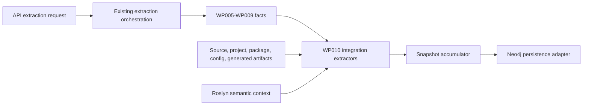

# Implementation Plan - WP010 External Integration Extraction

Target output path: `docs/010-External-Integration-Extraction/implementation-plan-wp010-external-integration-extraction.md`

Related specification: `docs/010-External-Integration-Extraction/spec-wp010-external-integration-extraction.md`

This plan breaks WP010 into runnable vertical slices that add evidence-backed external integration extraction to the existing Archon extraction pipeline. Each Work Item must preserve the repository's Onion Architecture direction, static-analysis safety constraints, deterministic graph output, and established snapshot contract. No Work Item may introduce Archon Discovery UI, new query API product surfaces, MCP tools, direct Neo4j writes from extractor projects, live external calls, broker inspection, storage inspection, SMTP sending, payment-provider calls, credential validation, or generated remediation code.

Every code-writing Work Item must follow `./.github/instructions/documentation-pass.instructions.md` as a hard completion gate. That means implementation must add or improve developer-level comments for every class, method, constructor, and non-public implementation type introduced or modified in scope; document every public method and constructor parameter; document every non-obvious property; and include enough inline or block comments for future developers to understand purpose, logical flow, and algorithms. Every Work Item must also follow `./.github/instructions/wiki.instructions.md`, including mandatory wiki review, information-architecture assessment, avoidance of `wiki/home.md` as a detail dump, and final wiki impact reporting.

Active Work Item execution is uninterrupted. Once an executor starts a Work Item, the executor must continue through implementation, validation, documentation/wiki review, and plan-record updates without stopping for status-only messages, confirmation prompts, or ordinary fixable failures. The only allowed stops are full Work Item completion, explicit user interruption or direction change, or a true blocker that cannot be resolved from the specification, this plan, codebase, or repository guidance.

## Overall Project Structure

WP010 should use the concrete project names already present in the solution rather than creating duplicate responsibility. The specification identifies the expected responsibilities as:

- `Archon.Extractors.Integrations` or the existing integration-capable extractor slice: external integration detection, classification, evidence, confidence, unknown handling, and graph fact creation.
- `Archon.Application`: shared extraction contracts, snapshot accumulation contracts, graph fact contracts, stable-key abstractions, warnings, and errors.
- `Archon.Roslyn` and language-specific Roslyn projects: semantic symbol, invocation, inheritance, attribute, artifact, and evidence projection helpers.
- `Archon.Extractors.Projects`, `Archon.Extractors.Configuration`, `Archon.Extractors.DependencyInjection`, and runtime extractor projects: upstream facts consumed by WP010.
- `Archon.Api.Extraction`: established API-triggered orchestration path and snapshot accumulation seam.
- Corresponding test projects under `test/`, including integration extractor tests, API extraction tests, Roslyn helper tests, configuration extractor tests, dependency-injection extractor tests, and project/package tests where existing project boundaries require them.

Naming must follow current repository conventions and the coding standards in `.github/copilot-instructions.md`, including block-scoped namespaces, Allman braces, one public type per C# file, underscore-prefixed private fields, no top-level statements, and `.csproj` `PackageReference` isolation. If a required project does not exist, create the minimum project consistent with the existing solution structure and add it to `Archon.slnx` using the established numeric solution-folder pattern. If an equivalent project already exists, extend it rather than introducing a duplicate slice.

## Foundation and Contracts

- [x] Work Item 1: Establish WP010 graph contracts and pipeline registration skeleton - Completed
  - **Purpose**: Provide the smallest runnable end-to-end external-integration path: an API-triggered extraction can run the integration slice, emit deterministic placeholder-safe snapshot facts when evidence exists, and complete without live external calls.
  - **Acceptance Criteria**:
	- External integration extraction participates in the existing orchestration path through the established snapshot accumulator.
	- Contract types or existing equivalents support `ExternalService`, `Queue`, `Topic`, `CALLS_EXTERNAL_SERVICE`, `HANDLES`, `USES_CONFIG`, `DEPENDS_ON`, evidence, confidence, warnings, errors, and unknown reasons needed by WP010.
	- Stable-key generation is deterministic and does not depend on absolute machine paths, database IDs, enumeration order, temporary paths, live network state, broker state, storage state, or external service availability.
	- A minimal fixture repository can run through the API extraction module seam and produce no integration facts or a simple deterministic integration fact without failure.
  - **Definition of Done**:
	- Code implemented for contracts, registration, stable-key helpers, and a minimal extractor entry point where the existing codebase requires them.
	- Tests passing for registration, no-op execution, deterministic stable keys, and snapshot accumulation.
	- Logging and error handling are added for extractor startup, cancellation, warnings, and slice-level failures.
	- `./.github/instructions/documentation-pass.instructions.md` is followed in full for every code file touched; every class, method, constructor, public parameter, and non-obvious property is commented to repository standard.
	- Wiki review is completed under `./.github/instructions/wiki.instructions.md`; relevant wiki or repository guidance is updated, or an explicit no-change review result is recorded.
	- Any architecture, runtime, workflow, or terminology wiki changes use book-like narrative depth, define technical terms on first use or link to a glossary, and include examples or walkthroughs where helpful.
	- No standalone implementation notes, implementation ledgers, or architecture-note substitutes are created; contributor-facing explanations are routed to `./wiki` topic pages.
	- Can execute end-to-end via targeted extraction tests and a solution build without starting the Aspire AppHost as a blocking process.
	- Executor must not stop mid-Work Item; execution continues through implementation, validation, documentation/wiki review, and plan-record updates unless complete, explicitly interrupted, or blocked by a true blocker.
	- [x] Task 1: Locate existing extraction and graph extension seams. Completed: inspected `Archon.slnx`, existing application snapshot accumulation, API extraction pipeline registration, WP007-WP009 stage patterns, domain graph controlled values, stable-key helpers, and runtime queue/topic extraction seams; reused existing `ExternalService`, `Queue`, `Topic`, relationship, evidence, confidence, unknown, warning, and error contracts.
	- [x] Step 1: Inspect `Archon.slnx`, production projects under `src/`, and test projects under `test/` to identify the existing extractor, application, Roslyn, API extraction, and snapshot accumulator types.
	- [x] Step 2: Identify whether `ExternalService`, `Queue`, `Topic`, integration relationships, evidence, confidence, unknown, warning, and error contracts already exist.
	- [x] Step 3: Decide whether to extend existing contract types or add new minimal types in the correct inward-facing project without violating Onion Architecture.
  - [x] Task 2: Implement the integration extraction skeleton. Completed: added `src/Archon.Extractors.Integrations`, documented foundation observation/projection contracts, deterministic stable-key helpers, no-op/static providers, the `ExternalIntegrationFoundationExtractor`, and the API `wp010-external-integrations` stage registered through `AddArchonExtractionApi`.
	- [x] Step 1: Add or extend integration extractor registration through the existing orchestration path.
	- [x] Step 2: Add cancellation-aware execution and no-live-call safety guards.
	- [x] Step 3: Add deterministic stable-key helpers for external service, unknown external service, queue, topic, and relationship keys.
	- [x] Step 4: Add warning/error propagation through the shared snapshot accumulator.
  - [x] Task 3: Add baseline tests. Completed: added `test/Archon.Extractors.Integrations.Tests` and API extraction tests covering project reference loading, stable keys, no-op extraction, minimal integration graph emission, unknown/warning handling, cancellation, stage registration, snapshot accumulation, and warning/error propagation.
	- [x] Step 1: Add a no-integration fixture that proves the extractor slice runs and emits no false positives.
	- [x] Step 2: Add a minimal integration fixture that proves snapshot facts can be emitted through the API extraction module seam.
	- [x] Step 3: Add deterministic stable-key tests using repository-relative paths and shuffled input ordering.
	- [x] Step 4: Add cancellation and safe-static-analysis tests that prove no network or broker access is attempted.
  - [x] Task 4: Perform documentation and wiki review for the foundation slice. Completed: applied source-code documentation standards to touched C# files and completed wiki review.
	- [x] Step 1: Apply the source-code documentation pass to all files touched in this Work Item.
	- [x] Step 2: Review likely wiki topic pages for extraction architecture, graph facts, snapshot orchestration, validation workflows, and glossary terminology.
	- [x] Step 3: Update the correct wiki topic page if the new integration slice changes contributor-facing architecture or workflow guidance; do not put detail in `wiki/home.md`.
	- [x] Step 4: Record the wiki review outcome in the plan status area or final execution record, including pages reviewed, pages updated or intentionally unchanged, and page-structure decision.
  - **Completion Summary**: Implemented the WP010 foundation path with a dedicated integration extractor project, API-stage registration, deterministic graph-projection contracts, stable keys for external services, unknown services, queues, topics, relationships, and evidence, and no-live-call safety through an observation-provider seam. Updated `Archon.slnx`, `src/Archon.Api.Extraction`, `src/Archon.Extractors.Integrations`, `test/Archon.Api.Extraction.Tests`, and `test/Archon.Extractors.Integrations.Tests`.
	- **Validation Summary**: Targeted validation run: `dotnet test D:\Dev\Archon\test\Archon.Extractors.Integrations.Tests\Archon.Extractors.Integrations.Tests.csproj` passed; `dotnet test D:\Dev\Archon\test\Archon.Api.Extraction.Tests\Archon.Api.Extraction.Tests.csproj --filter Wp010ExternalIntegrationExtractionStageTests` passed; `dotnet build D:\Dev\Archon\Archon.slnx` passed.
  - **Wiki Review Result**: Created `wiki/external-integration-extraction.md` as the dedicated topic page. Updated `wiki/api-extraction-workflow.md`, `wiki/graph-domain-model.md`, `wiki/validation-and-test-workflows.md`, `wiki/glossary.md`, and concise reader paths in `wiki/home.md`. Pages reviewed included `wiki/runtime-foundation.md` and existing extraction/graph/validation pages. Page-structure decision: external integration extraction is a new cross-cutting extractor concept and required its own topic page; `wiki/home.md` remained a landing page with only orientation links and summary text.
  - **Wiki Impact Matrix**: Affected concepts: WP010 API stage ordering, external integration observation provider seam, `ExternalService`/`Queue`/`Topic` graph facts, integration stable keys, explicit unknowns, no-live-call safety, and focused validation. Pages updated: `wiki/external-integration-extraction.md` (created), `wiki/api-extraction-workflow.md`, `wiki/graph-domain-model.md`, `wiki/validation-and-test-workflows.md`, `wiki/glossary.md`, `wiki/home.md`. Pages intentionally unchanged after review: `wiki/runtime-foundation.md` because existing runtime queue/topic consumer guidance remained accurate and now links conceptually through the new integration page.
  - **Files**:
	- `src/**`: Existing application, extractor, Roslyn, and API extraction files identified during implementation.
	- `test/**`: Corresponding tests for registration, stable keys, no-op execution, and snapshot accumulation.
	- `wiki/**`: Topic pages only if the mandatory wiki review determines contributor-facing guidance needs updates.
  - **Work Item Dependencies**: None beyond existing WP001-WP009 foundations.
  - **Run / Verification Instructions**:
	- `dotnet build Archon.slnx`
	- Run targeted tests for integration extractor registration, stable-key behavior, and API extraction orchestration seam.
  - **User Instructions**: No external services, credentials, brokers, storage emulators, SMTP servers, payment-provider sandboxes, or Aspire AppHost startup are required.

## HTTP and REST Integrations

- [x] Work Item 2: Deliver HTTP client and REST client extraction end-to-end - Completed
  - **Purpose**: Detect outbound HTTP and REST dependencies from source, dependency-injection registrations, configuration keys, and call sites, then emit evidence-backed `ExternalService`, `CALLS_EXTERNAL_SERVICE`, `USES_CONFIG`, and unknown facts.
  - **Acceptance Criteria**:
	- Direct `HttpClient`, injected `HttpClient`, `IHttpClientFactory`, named clients, typed clients, base addresses, request messages, HTTP method invocations, configuration keys, and relative path hints are detected where deterministic evidence exists.
	- RestSharp package references, namespaces, client construction, request resources, method selection, execute calls, authentication hints, and configuration keys are detected.
	- Other deterministic REST client abstractions are captured conservatively without inventing service names.
	- Computed URLs, unresolved client names, dynamic paths, dynamic headers, environment-supplied endpoints, and ambiguous authentication details produce explicit unknowns.
	- Redaction prevents secret-like endpoint, token, credential, authorization header, and connection values from appearing in metadata, evidence previews, warnings, errors, logs, or test output.
  - **Definition of Done**:
	- Code implemented across semantic analysis, configuration correlation, DI correlation, graph fact emission, redaction, confidence, unknown handling, logging, and error handling.
	- Unit and targeted integration tests pass for direct, injected, factory-created, named, typed, RestSharp, wrapper, configuration, evidence, unknown, confidence, deduplication, and redaction scenarios.
	- `./.github/instructions/documentation-pass.instructions.md` is followed in full for all code touched, including comments on every class, method, constructor, public parameter, and non-obvious property.
	- Wiki review is completed; pages covering integration extraction, extraction validation, graph evidence, or glossary terminology are updated if this slice materially clarifies contributor-facing behavior.
	- Wiki content, if updated, explains HTTP client extraction terms such as typed client, named client, configuration key, evidence, unknown, and confidence in narrative prose with examples where helpful.
	- No standalone implementation notes or `wiki/home.md` detail dumping are created.
	- Can execute end-to-end via targeted HTTP/REST extraction tests and representative snapshot output inspection.
	- Executor must not stop mid-Work Item except for full completion, explicit user interruption, or true blocker.
	- [x] Task 1: Implement HTTP semantic detection. Completed: added Roslyn-backed HTTP/REST extraction request/result contracts and `HttpRestIntegrationExtractor` detection for direct and injected `HttpClient`, `IHttpClientFactory.CreateClient`, `HttpRequestMessage`, `GetAsync`, `PostAsync`, `PutAsync`, `PatchAsync`, `DeleteAsync`, `SendAsync`, `GetFromJsonAsync`, and `PostAsJsonAsync` where deterministic source evidence exists.
	- [x] Step 1: Detect direct `System.Net.Http.HttpClient` construction, injected `HttpClient`, `IHttpClientFactory`, and `HttpRequestMessage` usage through Roslyn symbol identity where available.
	- [x] Step 2: Detect HTTP method invocations such as `GetAsync`, `PostAsync`, `PutAsync`, `PatchAsync`, `DeleteAsync`, `SendAsync`, `GetFromJsonAsync`, and `PostAsJsonAsync`.
	- [x] Step 3: Capture owning project, target framework, type, method, call-site location, operation, and relative path hints.
  - [x] Task 2: Implement DI and configuration correlation. Completed: detected named and typed `AddHttpClient` registrations, factory-created named clients, literal base addresses, configuration-key endpoint evidence, and `USES_CONFIG` relationships through foundation observation projection.
	- [x] Step 1: Correlate named and typed clients from existing dependency-injection facts.
	- [x] Step 2: Correlate base URL and endpoint configuration keys from existing configuration facts.
	- [x] Step 3: Emit `USES_CONFIG` relationships where a fact depends on a configuration key.
  - [x] Task 3: Implement RestSharp and REST abstraction detection. Completed: detected RestSharp `RestClient`, `RestRequest`, resource, method, and execute patterns; captured deterministic wrapper-style REST abstraction calls; and preserved only redacted authentication mechanism hints.
	- [x] Step 1: Detect RestSharp package, namespace, `RestClient`, request, resource, method, and execute patterns.
	- [x] Step 2: Detect other deterministic REST abstractions by package, namespace, type, invocation, and configuration evidence.
	- [x] Step 3: Capture authentication hints without storing secret values.
  - [x] Task 4: Emit graph facts and safeguards. Completed: projected HTTP/REST observations through the WP010 foundation extractor, expanded structured HTTP metadata safely, emitted explicit unknowns for dynamic targets and resources, relied on stable-key accumulation for deduplication, and added `HttpRestRedactor` safeguards before evidence, metadata, warning, error, or diagnostic output.
	- [x] Step 1: Emit `ExternalService` and `CALLS_EXTERNAL_SERVICE` facts with deterministic keys.
	- [x] Step 2: Emit explicit unknowns for unresolved targets, dynamic URLs, dynamic paths, dynamic headers, and ambiguous authentication.
	- [x] Step 3: Deduplicate facts from package references, DI registrations, configuration artifacts, and call sites.
	- [x] Step 4: Apply redaction before evidence, metadata, warning, error, or log emission.
  - [x] Task 5: Add tests and documentation/wiki review. Completed: added `test/Archon.Extractors.Integrations.Tests/HttpRest/HttpRestIntegrationExtractorTests.cs`, applied source-code documentation to new and modified files, validated targeted tests plus solution build, and updated wiki guidance.
	- [x] Step 1: Add fixture source sets for direct, injected, factory, named, typed, RestSharp, wrapper, computed endpoint, and duplicate fact cases.
	- [x] Step 2: Add tests for confidence levels, evidence location, snippet hash, redaction, unknowns, and stable keys.
	- [x] Step 3: Apply source-code documentation pass.
	- [x] Step 4: Complete wiki information-architecture review and update topic pages if needed.
  - **Files**:
	- `src/**`: Integration extractor, Roslyn helper, DI/configuration correlation, graph fact, and redaction files as discovered.
	- `test/**`: HTTP and REST fixture and assertion files.
	- `wiki/**`: Topic pages if wiki review requires updates.
  - **Work Item Dependencies**: Work Item 1.
  - **Run / Verification Instructions**:
	- `dotnet build Archon.slnx`
	- Run targeted tests for HTTP client and RestSharp/REST extraction.
  - **User Instructions**: Do not supply real URLs, tokens, credentials, or service endpoints in fixtures; use clearly fake values designed for redaction tests.
  - **Completion Summary**: Implemented HTTP and REST integration extraction in `src/Archon.Extractors.Integrations/HttpRest`, extended foundation metadata projection for structured detector hints, added Roslyn package/project references, and added focused HTTP/REST tests under `test/Archon.Extractors.Integrations.Tests/HttpRest`. Validation performed: `dotnet test D:\Dev\Archon\test\Archon.Extractors.Integrations.Tests\Archon.Extractors.Integrations.Tests.csproj` passed with 13/13 tests; `dotnet build D:\Dev\Archon\Archon.slnx` passed. Wiki review result: affected concepts were HTTP/REST external integration detection, graph evidence metadata, redaction, unknown handling, named/typed clients, RestSharp, and validation workflow. Pages reviewed: `wiki/external-integration-extraction.md`, `wiki/graph-domain-model.md`, `wiki/validation-and-test-workflows.md`, and `wiki/glossary.md`. Pages updated: `wiki/external-integration-extraction.md`, `wiki/validation-and-test-workflows.md`, and `wiki/glossary.md`. Pages intentionally unchanged: `wiki/graph-domain-model.md` already linked external integration graph vocabulary and did not need duplicate detector details; `wiki/home.md` remained a concise landing page. Page-structure decision: the existing external integration topic was the correct home for HTTP/REST detector behavior, validation commands stayed on the validation workflow page, glossary additions covered new terminology, and no new wiki page was needed.

## RPC and Generated Client Integrations

- [x] Work Item 3: Deliver WCF, SOAP, generated proxy, and gRPC extraction end-to-end - Completed
  - **Purpose**: Detect legacy and generated service clients statically so Archon can show external service dependencies for WCF, SOAP, ASMX, and gRPC without executing proxies or resolving endpoints.
  - **Acceptance Criteria**:
	- WCF package, namespace, generated service-reference artifact, generated proxy, `ClientBase<T>`, `ChannelFactory<T>`, endpoint configuration, binding, service contract, operation, and transport facts are detected.
	- SOAP and ASMX service-reference patterns are detected from generated proxies, service references, connected-service artifacts, and package evidence where deterministic.
	- gRPC package usage, generated clients, `GrpcChannel`, typed clients, endpoint configuration, and method call sites are detected.
	- Generated proxy ambiguity, unresolved endpoints, configuration-driven addresses, runtime-computed channels, and unresolved generated clients produce explicit unknowns and warnings where applicable.
	- Large generated artifact safeguards prevent unbounded recursion or noisy duplicate facts.
  - **Definition of Done**:
	- Code implemented for WCF, SOAP, generated proxy, and gRPC extraction, including evidence, confidence, unknowns, warnings, deduplication, redaction, logging, and error handling.
	- Unit and targeted integration tests pass for WCF, SOAP/ASMX, gRPC, generated artifact, configuration, unknown, confidence, deduplication, and large artifact safeguards.
	- `./.github/instructions/documentation-pass.instructions.md` is followed in full for all code touched.
	- Wiki review is completed and updates are made if the slice changes integration extraction architecture, generated-client terminology, validation workflows, or contributor guidance.
	- Wiki updates use narrative depth to define terms such as generated proxy, service contract, binding, channel, and gRPC channel when introduced.
	- No standalone implementation notes or `wiki/home.md` detail dumping are created.
	- Can execute end-to-end via targeted WCF/SOAP/gRPC extraction tests and representative snapshot inspection.
	- Executor must not stop mid-Work Item except for full completion, explicit user interruption, or true blocker.
	- [x] Task 1: Implement WCF and SOAP artifact analysis. Completed: added `RpcGeneratedClientIntegrationExtractor` artifact indexing for service-reference, connected-service, ASMX, and generated proxy hints; detects WCF `ClientBase<T>` and `ChannelFactory<T>` usage, endpoint configuration, binding type, contract, operation, and transport metadata without executing generated code.
	- [x] Step 1: Detect `System.ServiceModel` package and namespace evidence.
	- [x] Step 2: Detect service-reference, connected-service, ASMX, and generated proxy artifacts without executing generated code.
	- [x] Step 3: Detect `ClientBase<T>` and `ChannelFactory<T>` symbol patterns.
	- [x] Step 4: Extract endpoint names, endpoint addresses, binding names, binding types, service contract names, operation names, and transport metadata where deterministic.
  - [x] Task 2: Implement gRPC analysis. Completed: added gRPC generated-client detection for generated source hints, `GrpcChannel.ForAddress`, typed `AddGrpcClient<TClient>` registrations, configuration-key correlation, generated client method calls, and runtime-computed channel unknowns.
	- [x] Step 1: Detect gRPC package references, namespaces, generated client types, and generated source artifacts.
	- [x] Step 2: Detect `GrpcChannel` creation, configuration keys, typed client registration, and generated client method calls.
	- [x] Step 3: Emit unresolved generated-client and runtime-computed channel unknowns.
  - [x] Task 3: Add graph emission and safeguards. Completed: RPC observations project through the WP010 foundation to emit deterministic `ExternalService`, `CALLS_EXTERNAL_SERVICE`, and `USES_CONFIG` graph facts; repeated evidence is deduplicated by stable keys; generated artifact traversal is bounded with oversized artifact warnings; malformed or unreadable configuration paths produce warnings.
	- [x] Step 1: Emit `ExternalService`, `CALLS_EXTERNAL_SERVICE`, `USES_CONFIG`, and `DEPENDS_ON` relationships with deterministic keys.
	- [x] Step 2: Deduplicate package, artifact, configuration, generated client, and call-site evidence.
	- [x] Step 3: Add bounded traversal and artifact size safeguards for large generated files.
	- [x] Step 4: Produce warnings for unreadable service-reference artifacts, malformed configuration artifacts, unsupported generated clients, and partial compilation failures.
  - [x] Task 4: Add tests and documentation/wiki review. Completed: added `RpcGeneratedClientIntegrationExtractorTests` covering WCF service references, generated proxy usage, `ClientBase<T>`, `ChannelFactory<T>`, endpoint configuration, SOAP/ASMX proxies, gRPC generated clients, channels, typed clients, configuration, call sites, unknowns, warnings, redaction, deduplication, and large artifact safeguards; source-code documentation pass completed for touched C# files; wiki review completed with updates to `wiki/external-integration-extraction.md`, `wiki/validation-and-test-workflows.md`, and `wiki/glossary.md`.
	- [x] Step 1: Add WCF fixtures with service references, generated proxy usage, `ClientBase<T>`, `ChannelFactory<T>`, and endpoint configuration.
	- [x] Step 2: Add SOAP/ASMX fixtures with generated proxy usage.
	- [x] Step 3: Add gRPC fixtures with generated clients, channels, typed clients, configuration, and call sites.
	- [x] Step 4: Add tests for evidence, confidence, unknowns, warnings, redaction, deduplication, and large artifact safeguards.
	- [x] Step 5: Apply source-code documentation pass and complete wiki information-architecture review.
  - **Files**:
	- `src/**`: Integration extractor and Roslyn/artifact helper files for WCF, SOAP, generated proxies, and gRPC.
	- `test/**`: WCF, SOAP/ASMX, gRPC, generated artifact, and safeguard fixtures.
	- `wiki/**`: Topic pages if wiki review requires updates.
  - **Work Item Dependencies**: Work Item 1.
  - **Run / Verification Instructions**:
	- `dotnet build Archon.slnx`
	- Run targeted tests for WCF, SOAP, generated proxy, and gRPC extraction.
  - **User Instructions**: Fixtures must be static and local; do not call generated proxies, start services, or resolve live endpoints.
  - **Completion Summary**: Implemented the WP010 RPC/generated-client detector with documented request/result/redaction contracts, WCF/SOAP/ASMX/gRPC source and artifact analysis, deterministic foundation graph projection, explicit unknowns, redaction, warnings, and bounded generated-artifact traversal. Updated `src/Archon.Extractors.Integrations`, `test/Archon.Extractors.Integrations.Tests`, `wiki/external-integration-extraction.md`, `wiki/validation-and-test-workflows.md`, and `wiki/glossary.md`. Validation completed with `dotnet test D:\Dev\Archon\test\Archon.Extractors.Integrations.Tests\Archon.Extractors.Integrations.Tests.csproj --filter RpcGeneratedClientIntegrationExtractorTests`, `dotnet test D:\Dev\Archon\test\Archon.Extractors.Integrations.Tests\Archon.Extractors.Integrations.Tests.csproj`, and `dotnet build D:\Dev\Archon\Archon.slnx`. Wiki impact: affected concepts were generated proxies, service contracts, bindings, gRPC channels, RPC validation, and integration graph metadata; pages reviewed were `wiki/external-integration-extraction.md`, `wiki/validation-and-test-workflows.md`, `wiki/glossary.md`, and `wiki/home.md`; pages updated were the three topic/glossary pages; no pages were created or retired; `wiki/home.md` was intentionally unchanged because the existing External integration extraction reader path remains correct and detailed guidance belongs on topic pages.

## Messaging Integrations

- [x] Work Item 4: Deliver queue, topic, NServiceBus, Azure Service Bus, RabbitMQ, MSMQ, and abstraction extraction end-to-end - Completed
  - **Purpose**: Detect message producers, consumers, handlers, sagas, subscriptions, routing, endpoint names, queue/topic names, and transport configuration so Archon can represent messaging dependencies without connecting to brokers.
  - **Acceptance Criteria**:
	- Azure Service Bus clients, senders, receivers, processors, queue names, topic names, subscription names, and message handlers are detected where evidence exists.
	- NServiceBus endpoint configuration, message handlers, sagas, send, publish, subscribe, routing configuration, transport configuration, endpoint names, queue names, error queue hints, and recoverability configuration are detected where evidence exists.
	- RabbitMQ connections, channels, exchanges, queues, routing keys, publishers, consumers, and handlers are detected where evidence exists.
	- MSMQ queue paths, senders, receivers, and handlers are detected where evidence exists.
	- Common queue abstraction libraries and framework wrappers are detected when deterministic package, namespace, type, or invocation evidence exists.
	- Producer, consumer, handler, saga, sender, publisher, subscriber, and receiver roles are distinguished where evidence supports classification.
	- `Queue`, `Topic`, `ExternalService`, `HANDLES`, `CALLS_EXTERNAL_SERVICE`, `USES_CONFIG`, and `DEPENDS_ON` facts are emitted with evidence, confidence, unknowns, and deterministic keys.
  - **Definition of Done**:
	- Code implemented for messaging detection, runtime fact correlation, graph emission, stable keys, unknowns, warnings, redaction, logging, and error handling.
	- Tests pass for Azure Service Bus, NServiceBus, RabbitMQ, MSMQ, generic abstractions, configuration keys, handler correlation, saga detection, queue/topic facts, endpoint names, message type names, unknowns, confidence, deduplication, and redaction.
	- `./.github/instructions/documentation-pass.instructions.md` is followed in full for all code touched.
	- Wiki review is completed and updates are made if messaging extraction changes developer-facing architecture, workflow, terminology, or validation guidance.
	- Wiki updates use long-form narrative to explain messaging terms such as endpoint, queue, topic, subscription, saga, routing key, exchange, handler, recoverability, and transport provider when introduced.
	- Relevant examples or walkthroughs are included where they materially improve contributor understanding of messaging extraction.
	- No standalone implementation notes or `wiki/home.md` detail dumping are created.
	- Can execute end-to-end via targeted messaging extraction tests and snapshot output inspection.
	- Executor must not stop mid-Work Item except for full completion, explicit user interruption, or true blocker.
	- [x] Task 1: Implement Azure Service Bus extraction. Completed: added static detection for `ServiceBusClient`, sender, receiver, processor, queue, topic, subscription, message-handler callback, configuration-key, and producer/consumer role evidence without connecting to Azure Service Bus.
	- [x] Step 1: Detect package, namespace, client, sender, receiver, processor, message handler, queue, topic, and subscription patterns.
	- [x] Step 2: Correlate queue/topic configuration keys and runtime worker/handler facts where available.
	- [x] Step 3: Classify producer, consumer, handler, sender, and receiver roles.
  - [x] Task 2: Implement NServiceBus extraction. Completed: added static detection for endpoint configuration, endpoint names, Azure Service Bus transport hints, message handlers, sagas, send, publish, subscribe, error queue, recoverability, routing-target metadata, and computed endpoint unknowns.
	- [x] Step 1: Detect NServiceBus package references, namespaces, endpoint configuration, endpoint name setup, and transport configuration.
	- [x] Step 2: Detect message handlers, sagas, message type names, send operations, publish operations, subscribe operations, and routing configuration.
	- [x] Step 3: Capture queue names, endpoint names, error queue hints, recoverability configuration, transport provider, and configuration keys where deterministic.
	- [x] Step 4: Emit explicit unknowns for computed endpoint names, dynamic message type names, unresolved queue names, and computed transport settings.
  - [x] Task 3: Implement RabbitMQ, MSMQ, and generic abstraction extraction. Completed: added RabbitMQ queue, exchange, publish, consume, routing-key, and handler detection; MSMQ queue path send/receive detection; and conservative queue abstraction detection for deterministic wrapper calls.
	- [x] Step 1: Detect RabbitMQ connections, channels, exchanges, queues, routing keys, publishers, consumers, and handlers.
	- [x] Step 2: Detect MSMQ queue paths, senders, receivers, and handlers.
	- [x] Step 3: Detect common queue abstraction libraries and framework wrappers by deterministic package, namespace, type, invocation, or configuration evidence.
  - [x] Task 4: Emit graph facts and safeguards. Completed: messaging observations project through the WP010 foundation as deterministic `Queue`, `Topic`, `HANDLES`, `CALLS_EXTERNAL_SERVICE`, `USES_CONFIG`, and `DEPENDS_ON` facts, with redaction, deduplication, explicit unknown warnings, and bounded source traversal.
	- [x] Step 1: Emit `Queue` and `Topic` nodes for deterministic names and configuration-key-backed targets.
	- [x] Step 2: Emit `HANDLES` relationships for handlers, sagas, hosted services, background services, worker methods, processors, subscriptions, receivers, and consumers.
	- [x] Step 3: Emit `CALLS_EXTERNAL_SERVICE`, `USES_CONFIG`, and `DEPENDS_ON` relationships where applicable.
	- [x] Step 4: Deduplicate facts and avoid unbounded traversal through message handler chains.
	- [x] Step 5: Warn for unsupported messaging abstractions, malformed messaging configuration, and partial compilation failures affecting extraction.
  - [x] Task 5: Add tests and documentation/wiki review. Completed: added `MessagingIntegrationExtractorTests` covering Azure Service Bus, NServiceBus, RabbitMQ, MSMQ, generic abstractions, dynamic names, unknowns, confidence, evidence, redaction, deduplication, and stable-key behavior; applied source documentation standards to new code; completed wiki review with updates to messaging guidance.
	- [x] Step 1: Add Azure Service Bus producer and consumer fixtures.
	- [x] Step 2: Add NServiceBus endpoint, handler, saga, send, publish, subscribe, routing, transport, error queue, and recoverability fixtures.
	- [x] Step 3: Add RabbitMQ publisher/consumer and MSMQ sender/receiver fixtures.
	- [x] Step 4: Add generic abstraction, dynamic name, unknown, confidence, evidence, redaction, deduplication, and stable-key tests.
	- [x] Step 5: Apply source-code documentation pass and complete wiki information-architecture review.
  - **Files**:
	- `src/**`: Messaging integration extractor, semantic helpers, graph fact emission, and runtime correlation files.
	- `test/**`: Azure Service Bus, NServiceBus, RabbitMQ, MSMQ, abstraction, and unknown fixtures.
	- `wiki/**`: Topic pages if wiki review requires updates.
  - **Work Item Dependencies**: Work Items 1 and, where runtime handler correlation relies on upstream facts, existing WP008 runtime extraction foundations.
  - **Run / Verification Instructions**:
	- `dotnet build Archon.slnx`
	- Run targeted tests for Azure Service Bus, NServiceBus, RabbitMQ, MSMQ, and generic messaging extraction.
  - **User Instructions**: Do not run or connect to brokers. All messaging evidence must come from static source, project, configuration, package, semantic, and existing runtime facts.
  - **Completion Summary**: Implemented the WP010 messaging detector with documented request/result/redaction contracts, Azure Service Bus, NServiceBus, RabbitMQ, MSMQ, and queue-abstraction source analysis, deterministic foundation graph projection, explicit unknowns, redaction, warnings, and deduplication. Updated `src/Archon.Extractors.Integrations/Messaging`, `test/Archon.Extractors.Integrations.Tests/Messaging`, `wiki/external-integration-extraction.md`, `wiki/validation-and-test-workflows.md`, and `wiki/glossary.md`. Validation completed with `dotnet test D:\Dev\Archon\test\Archon.Extractors.Integrations.Tests\Archon.Extractors.Integrations.Tests.csproj --filter MessagingIntegrationExtractorTests`, `dotnet test D:\Dev\Archon\test\Archon.Extractors.Integrations.Tests\Archon.Extractors.Integrations.Tests.csproj`, and `dotnet build D:\Dev\Archon\Archon.slnx`. Wiki impact: affected concepts were messaging endpoints, queues, topics, subscriptions, handlers, sagas, routing keys, exchanges, recoverability, transport providers, messaging validation, and integration graph metadata; pages reviewed were `wiki/external-integration-extraction.md`, `wiki/validation-and-test-workflows.md`, `wiki/glossary.md`, and `wiki/home.md`; pages updated were the three topic/glossary pages; no pages were created or retired; `wiki/home.md` was intentionally unchanged because it remains a concise landing page and detailed messaging guidance belongs on the external integration topic page.

## Storage, Email, and Payment Integrations

- [x] Work Item 5: Deliver storage, SMTP/email, and payment-provider extraction end-to-end - Completed
  - **Purpose**: Detect external storage, email, and payment integrations while applying strict redaction for credentials, connection strings, payment data, and secret-bearing payload values.
  - **Acceptance Criteria**:
	- Storage package references, namespaces, client types, invocation patterns, Azure Blob Storage usage, Azure File Storage usage, generic external storage abstractions, configuration keys, target hints, and read/write/delete hints are detected.
	- `SmtpClient`, mail message construction, send operations, common email sender abstractions, SMTP/provider configuration keys, and email integration metadata are detected.
	- Known payment-provider SDK usage and payment-provider HTTP wrappers are detected by deterministic package, namespace, type, naming, configuration, or call-site evidence.
	- Provider name hints, API endpoint configuration keys, authentication configuration keys, usage sites, and evidence are captured without storing card data, payment tokens, API secrets, customer payment identifiers, or secret-bearing request payload values.
	- Unresolved storage targets, runtime-computed container names, unresolved SMTP hosts, runtime-computed recipients, template names, ambiguous provider names, dynamically loaded payment integrations, and unresolved payment endpoints are explicit unknowns.
  - **Definition of Done**:
	- Code implemented for storage, SMTP/email, and payment extraction, graph emission, evidence, confidence, unknowns, redaction, deduplication, logging, and error handling.
	- Tests pass for storage read/write/delete hints, SMTP/email patterns, payment SDK/wrapper patterns, configuration keys, evidence, confidence, unknowns, deduplication, and aggressive redaction.
	- `./.github/instructions/documentation-pass.instructions.md` is followed in full for all code touched.
	- Wiki review is completed and updates are made if this slice changes contributor-facing integration extraction behavior, redaction guidance, validation workflow, or terminology.
	- Wiki updates define terms such as storage account, container, share, blob path, SMTP host, payment provider, authentication hint, and redaction when introduced.
	- No standalone implementation notes or `wiki/home.md` detail dumping are created.
	- Can execute end-to-end via targeted storage, SMTP/email, and payment extraction tests and representative snapshot inspection.
	- Executor must not stop mid-Work Item except for full completion, explicit user interruption, or true blocker.
	- [x] Task 1: Implement storage extraction. Completed: added the external-service detector slice with Azure Blob Storage, Azure File Storage, and generic storage-abstraction source detection, deterministic target hints, configuration-key correlation, read/write/delete operation hints, unknowns for runtime-computed targets, deduplication through foundation stable keys, and redaction of storage connection strings and account-key-like values.
	- [x] Step 1: Detect Azure Blob Storage, Azure File Storage, and generic storage package, namespace, type, and invocation evidence.
	- [x] Step 2: Capture storage account, container, share, blob, file, bucket, path configuration keys, and target hints where deterministic.
	- [x] Step 3: Classify read, write, and delete hints from API calls.
	- [x] Step 4: Emit unknowns for unresolved storage targets and runtime-computed names.
  - [x] Task 2: Implement SMTP and email extraction. Completed: detected `SmtpClient`, credential assignment hints, send operations, mail-message context, email sender abstractions, SMTP host configuration keys, authentication hints, `ExternalService` and `USES_CONFIG` graph output, and redacted credential, recipient, and body-like values.
	- [x] Step 1: Detect `SmtpClient`, mail message construction, send operations, and email sender abstractions.
	- [x] Step 2: Capture SMTP host, port, sender, credential, provider, template configuration keys, and authentication hints without secret values.
	- [x] Step 3: Emit `ExternalService`, `CALLS_EXTERNAL_SERVICE`, `USES_CONFIG`, and unknown facts for email integrations.
  - [x] Task 3: Implement payment-provider extraction. Completed: detected Stripe-style SDK usage and deterministic payment gateway wrapper calls, captured provider and endpoint-key metadata, emitted configuration dependencies and usage-site evidence, represented unresolved payment endpoint evidence as unknowns, and aggressively redacted payment API keys, tokens, card-like data, and customer identifiers before output.
	- [x] Step 1: Detect known payment-provider SDK package, namespace, type, and invocation evidence.
	- [x] Step 2: Detect payment-provider HTTP wrapper patterns through deterministic naming, package, configuration, and call-site evidence.
	- [x] Step 3: Capture provider hints, endpoint keys, authentication keys, usage sites, and unknowns.
	- [x] Step 4: Apply aggressive payment redaction before any metadata, evidence, warning, error, log, or test output is produced.
  - [x] Task 4: Add tests and documentation/wiki review. Completed: added `ExternalServiceIntegrationExtractorTests` covering storage read/write/delete hints, SMTP/email patterns, payment SDK and wrapper patterns, configuration keys, evidence, unknowns, deduplication, stable graph output, and redaction; source-code documentation was applied to the new request/result/redactor/extractor files and test helpers; wiki review updated the external integration, validation workflow, and glossary pages.
	- [x] Step 1: Add blob/file storage fixtures with read, write, delete, configuration, and dynamic target cases.
	- [x] Step 2: Add SMTP/email fixtures with `SmtpClient`, mail messages, sender abstractions, provider keys, and secret-like values.
	- [x] Step 3: Add payment SDK and HTTP wrapper fixtures with secret-like payment values and redaction assertions.
	- [x] Step 4: Add evidence, confidence, unknown, deduplication, and stable-key tests.
	- [x] Step 5: Apply source-code documentation pass and complete wiki information-architecture review.
  - **Files**:
	- `src/**`: Storage, SMTP/email, payment extraction, redaction, and graph fact files.
	- `test/**`: Storage, email, payment, unknown, and redaction fixtures.
	- `wiki/**`: Topic pages if wiki review requires updates.
  - **Work Item Dependencies**: Work Item 1.
  - **Run / Verification Instructions**:
	- `dotnet build Archon.slnx`
	- Run targeted tests for storage client extraction, SMTP/email extraction, and payment-provider extraction/redaction.
  - **User Instructions**: Do not use real payment data, customer identifiers, credentials, connection strings, or SMTP settings in fixtures.
  - **Completion Summary**: Implemented the WP010 storage, SMTP/email, and payment-provider extraction slice in `src/Archon.Extractors.Integrations/ExternalServices`, including request/result contracts, static Roslyn/source analysis, local configuration-artifact key scanning, graph observation projection through the foundation extractor, unknown handling, operation hints, deduplication, and aggressive storage/email/payment redaction. Added `test/Archon.Extractors.Integrations.Tests/ExternalServices/ExternalServiceIntegrationExtractorTests.cs` covering Azure Blob Storage, Azure File Storage, generic storage abstractions, `SmtpClient`, email sender abstractions, Stripe-style SDK usage, payment gateway wrappers, configuration dependencies, evidence, unknowns, deduplication, and redaction. Validation passed with `dotnet test D:\Dev\Archon\test\Archon.Extractors.Integrations.Tests\Archon.Extractors.Integrations.Tests.csproj --filter ExternalServiceIntegrationExtractorTests`, `dotnet test D:\Dev\Archon\test\Archon.Extractors.Integrations.Tests\Archon.Extractors.Integrations.Tests.csproj` (25/25 tests), and `dotnet build D:\Dev\Archon\Archon.slnx`. Wiki impact matrix: affected concepts were storage targets, SMTP/email channels, payment providers, authentication hints, redaction, and WP010 validation; pages reviewed were `wiki/external-integration-extraction.md`, `wiki/validation-and-test-workflows.md`, `wiki/glossary.md`, and `wiki/home.md` for placement; pages updated were `wiki/external-integration-extraction.md`, `wiki/validation-and-test-workflows.md`, and `wiki/glossary.md`; no pages were created or retired; `wiki/home.md` was intentionally unchanged because existing topic pages provided the correct structure and the landing page did not need new detail.

## Internal Service Correlation and Cross-Slice Quality

- [x] Work Item 6: Deliver internal service API correlation, cross-slice deduplication, and quality gates end-to-end - Completed
  - **Purpose**: Correlate deterministic internal service calls and harden the integration slice with consistent confidence, unknown, evidence, redaction, deduplication, performance, and VB.NET support behavior.
  - **Acceptance Criteria**:
	- Internal API client patterns are detected where service boundaries can be inferred from typed clients, generated clients, configuration keys, base URLs, package names, project names, namespaces, or endpoint references.
	- Calls from one analyzed project to an endpoint exposed by another analyzed project are linked only when prior runtime facts and deterministic URL/route evidence support correlation.
	- Internal service calls link to `Endpoint`, `Controller`, `Method`, `Project`, and `ExternalService` facts where deterministic evidence supports the link.
	- Unknown service ownership or unresolved internal route targets produce explicit unknowns rather than forced matches.
	- Confidence assignment, unknown reasons, warnings, errors, evidence, redaction, deduplication, stable-key behavior, bounded traversal, cancellation, and performance safeguards are consistent across all WP010 slices.
	- C# integration extraction is covered and VB.NET parity is covered where Roslyn supports semantic detection.
  - **Definition of Done**:
	- Code implemented for internal service correlation, cross-slice quality gates, performance safeguards, and consistency checks.
	- Tests pass for deterministic internal correlation, false-positive prevention, unknown ownership, cross-slice deduplication, warning/error behavior, cancellation, stable keys, redaction, C# support, and feasible VB.NET support.
	- `./.github/instructions/documentation-pass.instructions.md` is followed in full for all code touched.
	- Wiki review is completed and updates are made if internal service correlation, evidence, confidence, unknowns, validation, or terminology guidance changes.
	- Wiki updates use narrative explanations and examples where contributor understanding benefits from a worked internal service correlation scenario.
	- No standalone implementation notes or `wiki/home.md` detail dumping are created.
	- Can execute end-to-end via targeted internal service correlation tests, quality-gate tests, and representative snapshot inspection.
	- Executor must not stop mid-Work Item except for full completion, explicit user interruption, or true blocker.
	- [x] Task 1: Implement internal service correlation. Completed: added the `InternalServices` detector slice with endpoint-fact inputs, deterministic route/base-URL/configuration-key ownership matching, `ExternalService` graph projection through the WP010 foundation path, endpoint/controller/method/project stable-key metadata, internal-service classification metadata, and explicit unknown handling for unresolved ownership and computed routes.
	- [x] Step 1: Use typed client, generated client, configuration key, base URL, package, project, namespace, endpoint, route, and runtime facts as deterministic correlation inputs.
	- [x] Step 2: Link internal service calls to existing endpoint, controller, method, project, and external service facts where evidence supports the link.
	- [x] Step 3: Preserve internal/external classification metadata and confidence.
	- [x] Step 4: Emit explicit unknowns for unresolved service ownership and unresolved route targets.
  - [x] Task 2: Harden cross-slice quality behavior. Completed: internal correlation now uses the shared foundation projection for confidence, evidence, unknown state, warnings, stable-key deduplication, configuration dependencies, redaction, cancellation, deterministic endpoint ordering, and bounded route matching.
	- [x] Step 1: Normalize confidence reasons across symbol-resolved, exact configuration, generated artifact, syntax, naming, and heuristic detections.
	- [x] Step 2: Normalize unknown reasons across unresolved services, computed URLs, computed endpoints, computed message types, computed queues/topics, storage targets, authentication, generated clients, and provider ownership.
	- [x] Step 3: Ensure redaction runs before metadata, evidence, warnings, errors, logs, API-ready responses, and test output.
	- [x] Step 4: Ensure duplicate facts across packages, DI registrations, generated clients, configuration artifacts, and call sites collapse by stable key and fingerprint.
	- [x] Step 5: Add cancellation and bounded traversal safeguards for wrappers, generated proxies, service gateways, message handlers, storage helpers, and configuration indirection.
  - [x] Task 3: Add C# and VB.NET coverage. Completed: added C# fixtures for positive and negative internal-service correlation plus quality-gate behavior; added VB.NET semantic-document coverage that records the current supported parity limit without emitting false-positive facts.
	- [x] Step 1: Add C# fixtures for representative cross-slice patterns.
	- [x] Step 2: Add VB.NET fixtures where Roslyn Visual Basic semantic support is available and the repository test infrastructure supports it.
	- [x] Step 3: Document and test any supported parity limits as current implementation constraints rather than deferred mandatory requirements.
  - [x] Task 4: Add tests and documentation/wiki review. Completed: added `InternalServiceIntegrationExtractorTests` for positive correlation, no-endpoint false-positive prevention, computed-route unknowns, deduplication, confidence metadata, redaction, cancellation, and VB.NET parity-limit behavior; applied documentation-pass comments to touched source and test files; completed wiki review with topic/glossary/validation updates.
	- [x] Step 1: Add internal service correlation fixtures with positive and negative correlation cases.
	- [x] Step 2: Add cross-slice deduplication, confidence, unknown, redaction, cancellation, bounded traversal, warning, and error tests.
	- [x] Step 3: Apply source-code documentation pass and complete wiki information-architecture review.
  - **Files**:
	- `src/**`: Internal service correlation, quality normalization, redaction, deduplication, and helper files.
	- `test/**`: Internal service, quality, C#, and VB.NET fixture files.
	- `wiki/**`: Topic pages if wiki review requires updates.
  - **Work Item Dependencies**: Work Items 1 through 5 and existing WP008 runtime extraction facts.
  - **Run / Verification Instructions**:
	- `dotnet build Archon.slnx`
	- Run targeted tests for internal service API correlation and WP010 quality gates.
  - **User Instructions**: Do not infer internal ownership from naming alone; require deterministic route, base URL, project, endpoint, or configuration evidence.
  - **Completion Summary**: Implemented the WP010 internal service correlation and quality-gate slice in `src/Archon.Extractors.Integrations/InternalServices`, including request/result contracts, endpoint fact inputs, route-template matching, base URL and configuration-key ownership matching, graph observation projection, endpoint/controller/method/project metadata, explicit unknown ownership and computed-route handling, redaction, stable-key deduplication, cancellation, and deterministic endpoint ordering. Added `test/Archon.Extractors.Integrations.Tests/InternalServices/InternalServiceIntegrationExtractorTests.cs` plus Visual Basic Roslyn package coverage for the documented VB.NET parity limit. Validation passed with `dotnet test D:\Dev\Archon\test\Archon.Extractors.Integrations.Tests\Archon.Extractors.Integrations.Tests.csproj --filter InternalServiceIntegrationExtractorTests` (4/4 tests), `dotnet test D:\Dev\Archon\test\Archon.Extractors.Integrations.Tests\Archon.Extractors.Integrations.Tests.csproj` (29/29 tests), and `dotnet build D:\Dev\Archon\Archon.slnx`.
  - **Wiki Review Result**: Updated `wiki/external-integration-extraction.md`, `wiki/validation-and-test-workflows.md`, and `wiki/glossary.md`. Pages reviewed included `wiki/external-integration-extraction.md`, `wiki/validation-and-test-workflows.md`, `wiki/glossary.md`, `wiki/graph-domain-model.md`, and `wiki/home.md`. Pages intentionally unchanged: `wiki/graph-domain-model.md` because the generic graph vocabulary already covers `ExternalService`, endpoint, controller, method, project, evidence, confidence, unknown state, and metadata behavior while the detector-specific explanation belongs on the external integration page; `wiki/home.md` remained a concise landing page and did not receive detail. No pages were created or retired.
  - **Wiki Impact Matrix**: Affected concepts: internal service API correlation, deterministic route ownership, endpoint/controller/method/project stable-key metadata, internal/external classification metadata, unknown ownership, cross-slice quality gates, redaction, stable-key deduplication, cancellation, and VB.NET parity limits. Pages updated: `wiki/external-integration-extraction.md`, `wiki/validation-and-test-workflows.md`, and `wiki/glossary.md`. Pages created: none. Pages retired: none. Page-structure decision: the existing external integration topic is the correct home for internal service correlation because it is a WP010 detector behavior; validation commands belong on the validation workflow page; terminology belongs in the glossary; `wiki/home.md` stays only a reader-path landing page.

## Final Validation and Wiki Completion Gate

- [x] Work Item 7: Complete WP010 validation, documentation, and mandatory wiki impact record - Completed
  - **Purpose**: Confirm the full WP010 implementation is buildable, testable, documented, wiki-aligned, and ready for acceptance without creating parallel contributor-facing implementation records.
  - **Acceptance Criteria**:
	- The solution builds successfully.
	- Targeted WP010 tests pass for HTTP, REST, WCF, SOAP, gRPC, Azure Service Bus, NServiceBus, RabbitMQ, MSMQ, generic messaging, storage, SMTP/email, payment providers, internal services, graph facts, evidence, confidence, unknowns, redaction, deduplication, C# support, and feasible VB.NET support.
	- Representative snapshot output contains applicable `ExternalService`, `Queue`, `Topic`, `CALLS_EXTERNAL_SERVICE`, `HANDLES`, `USES_CONFIG`, and `DEPENDS_ON` facts.
	- No secret-like endpoint, token, credential, connection, payment, request, or authentication values appear in test output, logs, warnings, errors, metadata, or evidence previews.
	- No Archon Discovery UI resource, page, component, front-end asset, query API browse endpoint, MCP tool, or direct Neo4j persistence path is introduced by WP010.
	- The mandatory wiki review has a recorded outcome with an impact matrix or equivalent prose.
  - **Definition of Done**:
	- Final build and targeted tests succeed, or any failure is proven pre-existing and unrelated with concrete evidence.
	- Documentation pass compliance is verified for all code-writing Work Items under `./.github/instructions/documentation-pass.instructions.md`.
	- Wiki review is completed under `./.github/instructions/wiki.instructions.md` for the full work package.
	- The final execution record states which wiki or repository guidance pages were updated, created, retired, or why no wiki update was needed.
	- The final wiki impact matrix covers affected concepts, pages reviewed, pages updated, pages created, pages intentionally unchanged, and the page-structure decision.
	- `wiki/home.md` remains a concise landing page and is not used as a catch-all for WP010 contributor-facing details.
	- Conceptually dense documentation uses long-form, book-like narrative, defines technical terms, and includes relevant examples or walkthroughs when helpful.
	- Standalone implementation notes, implementation ledgers, architecture notes, or equivalent contributor-facing detail records are not created; if stale implementation-note-style artifacts are found, current contributor guidance is moved to wiki and redundant artifacts are retired.
	- Can execute end-to-end via final build, targeted tests, snapshot inspection, redaction checks, and wiki impact review.
	- Executor must not stop mid-Work Item except for full completion, explicit user interruption, or true blocker.
	- [x] Task 1: Run final validation. Completed: restored and built `Archon.slnx`, ran targeted WP010 extractor and API tests, inspected representative test coverage for required graph facts and redaction assertions, and confirmed the Aspire AppHost was not started during validation.
	- [x] Step 1: Restore and build `Archon.slnx`.
	- [x] Step 2: Run targeted WP010 tests only, unless the user explicitly requests the full test suite.
	- [x] Step 3: Inspect representative snapshot output for required nodes, relationships, metadata, evidence, confidence, and unknowns.
	- [x] Step 4: Verify redaction in test output, logs, warnings, errors, metadata, and evidence previews.
	- [x] Step 5: Verify the Aspire AppHost was not started as a blocking process during agent-driven validation.
  - [x] Task 2: Complete documentation-pass verification. Completed: reviewed WP010 hand-maintained production/test C# files and confirmed public APIs, internal types, constructors, methods, test scenarios, parameters, and non-obvious logic have XML or developer-level comments that satisfy `./.github/instructions/documentation-pass.instructions.md`; file diagnostics, targeted tests, and solution build passed.
	- [x] Step 1: Review all hand-maintained `.cs` files touched during WP010 and confirm comments meet `./.github/instructions/documentation-pass.instructions.md`.
	- [x] Step 2: Confirm public APIs have XML comments, every parameter is documented, internal and non-public types have developer-level comments, and every method and constructor has local explanatory documentation.
	- [x] Step 3: Confirm comments explain logical flow, algorithms, and non-obvious properties without changing behavior.
  - [x] Task 3: Complete mandatory wiki review and update. Completed: reviewed WP010 topic, validation workflow, glossary, graph model, and home page structure; refreshed current-state wording in `wiki/external-integration-extraction.md` and concise landing-page wording in `wiki/home.md`; confirmed no implementation-note-style artifacts were created or needed retirement.
	- [x] Step 1: Identify affected concepts: external integration extraction, graph facts, evidence, confidence, unknowns, redaction, messaging including NServiceBus, generated clients, internal service correlation, validation workflow, and glossary terminology.
	- [x] Step 2: Review relevant wiki pages and glossary entries, including extraction architecture, graph model, validation workflows, and any integration-specific topic pages that exist.
	- [x] Step 3: Perform page-structure assessment: selected topic page, whether a new page is needed, whether `wiki/home.md` remains concise, and whether cross-links/glossary entries are sufficient.
	- [x] Step 4: Update or create topic pages where current-state contributor guidance changed or was materially clarified.
	- [x] Step 5: Retire or rewrite stale implementation-note-style artifacts if any are found and they duplicate contributor-facing guidance that belongs in wiki.
  - [x] Task 4: Record final wiki impact matrix and completion result. Completed: recorded the affected concepts, pages reviewed, pages updated, pages created, pages intentionally unchanged, page-structure decision, and final validation commands/outcomes in this Work Item 7 record.
	- [x] Step 1: Record affected concepts.
	- [x] Step 2: Record pages reviewed.
	- [x] Step 3: Record pages updated.
	- [x] Step 4: Record pages created.
	- [x] Step 5: Record pages retired or intentionally unchanged.
	- [x] Step 6: Record the page-structure decision and why the selected wiki structure remains readable.
	- [x] Step 7: Record final validation commands and outcomes without duplicating contributor-facing guidance from wiki.
  - **Files**:
	- `docs/010-External-Integration-Extraction/implementation-plan-wp010-external-integration-extraction.md`: Concise plan status and validation outcome updates only.
	- `wiki/**`: Current-state contributor guidance updates where required.
	- `src/**` and `test/**`: Only if final validation reveals necessary fixes.
  - **Work Item Dependencies**: Work Items 1 through 6.
  - **Run / Verification Instructions**:
	- `dotnet build Archon.slnx`
	- Run targeted WP010 test projects or test filters identified during implementation.
	- Inspect representative snapshot output from targeted extraction fixtures.
  - **User Instructions**: If final validation requires secrets, live services, external credentials, or broker/storage/payment access, treat that as a design error and fix the tests or implementation to remain static and deterministic.
  - **Completion Summary**: Completed final WP010 closure validation and documentation/wiki gate. Final validation passed with `dotnet restore D:\Dev\Archon\Archon.slnx`, `dotnet build D:\Dev\Archon\Archon.slnx --no-restore`, `dotnet test D:\Dev\Archon\test\Archon.Extractors.Integrations.Tests\Archon.Extractors.Integrations.Tests.csproj --no-restore` (29/29 tests), and `dotnet test D:\Dev\Archon\test\Archon.Api.Extraction.Tests\Archon.Api.Extraction.Tests.csproj --no-restore --filter Wp010ExternalIntegrationExtractionStageTests` (4/4 tests). Representative snapshot coverage was inspected through targeted tests for `ExternalService`, `Queue`, `Topic`, `CALLS_EXTERNAL_SERVICE`, `HANDLES`, `USES_CONFIG`, evidence, confidence/unknown state, warning/error propagation, redaction, deduplication, internal service metadata, C# support, and feasible VB.NET parity limits. Validation used restore/build/test only and did not start the Aspire AppHost as a blocking process.
  - **Documentation-Pass Verification**: Reviewed the WP010 hand-maintained production and test C# scope under `src/Archon.Extractors.Integrations`, `test/Archon.Extractors.Integrations.Tests`, `src/Archon.Api.Extraction/Wp010ExternalIntegrationExtractionStage.cs`, and `test/Archon.Api.Extraction.Tests/Wp010ExternalIntegrationExtractionStageTests.cs`. Public APIs and internal types have XML or developer-level comments, parameters and return values are documented where applicable, constructors and methods explain purpose and flow, test scenarios are documented, and diagnostics/build/test validation passed.
  - **Wiki Review Result**: Updated `wiki/external-integration-extraction.md` to remove stale future-slice wording and describe the current detector/direct-test closure accurately. Updated `wiki/home.md` with concise landing-page summary text and reader-path wording for completed WP010 detector coverage without adding detailed guidance. Reviewed `wiki/validation-and-test-workflows.md`, `wiki/glossary.md`, `wiki/graph-domain-model.md`, and `wiki/home.md` for current-state accuracy and page placement. No standalone implementation notes, implementation ledgers, or architecture-note substitutes were created or found requiring retirement.
  - **Wiki Impact Matrix**: Affected concepts: final WP010 current-state summary, external integration detector coverage, internal service correlation, redaction, unknowns, validation workflow, glossary terminology, graph vocabulary, and reader paths. Pages updated: `wiki/external-integration-extraction.md` and `wiki/home.md`. Pages reviewed and intentionally unchanged: `wiki/validation-and-test-workflows.md` because it already contained the complete WP010 validation command set and fixture expectations; `wiki/glossary.md` because Work Item 6 already added the required terminology; `wiki/graph-domain-model.md` because generic graph vocabulary guidance remained accurate and should not duplicate detector details. Pages created: none. Pages retired: none. Page-structure decision: `wiki/external-integration-extraction.md` remains the correct detailed topic page; `wiki/validation-and-test-workflows.md` remains the command page; `wiki/glossary.md` remains terminology lookup; `wiki/graph-domain-model.md` remains generic graph vocabulary; `wiki/home.md` remains a concise landing page and table of contents.

## Appendix A - Architecture

### Overall Technical Approach

WP010 extends Archon's existing static extraction pipeline with an external integration slice. A static extraction pipeline is a code-analysis workflow that reads source files, project artifacts, configuration artifacts, generated-client artifacts, package metadata, and Roslyn semantic information without executing the analyzed repository. The slice contributes graph facts through the existing snapshot accumulator rather than writing directly to Neo4j or creating a parallel persistence path.

The implementation should prefer symbol identity over textual heuristics. Symbol identity means using compiler-provided Roslyn information to prove that a type, method, inheritance relationship, generic argument, or invocation refers to a known API such as `HttpClient`, `GrpcChannel`, `ClientBase<T>`, an NServiceBus handler interface, or a storage SDK client. When symbol identity is unavailable, fallback detection may use package names, namespaces, configuration keys, file artifacts, and syntax patterns, but those detections must carry lower confidence and explicit detection-mode metadata.

Evidence is the explanation payload that lets later API and MCP consumers show why an architectural fact exists. Each non-derived fact should record repository-relative paths, line or artifact locations where available, symbol or containing symbol names where available, snippet hashes, redacted snippet previews, confidence, and detection mode. Unknowns are first-class outputs used when a partial fact is real but a target value is computed, environment-driven, ambiguous, or unresolved. WP010 must emit unknowns rather than invent service names, queue names, endpoint names, payment providers, storage targets, or internal service ownership.

The diagram shows the required dependency flow. WP010 consumes source artifacts and prior extractor facts, emits snapshot facts, and leaves graph persistence to the existing Neo4j adapter. It must not call external services, connect to brokers, enumerate queues, read remote storage, send email, validate payment credentials, or execute analyzed code.

### Frontend

WP010 does not include a frontend slice. The specification explicitly excludes Archon Discovery UI, UI pages, UI components, integration explorers, service maps, queue dashboards, storage browsers, payment dashboards, graph views, and UI behavior tests. Any later UI or consumer-facing integration browsing belongs to a future work package. During WP010 implementation, contributors should verify that no front-end assets or UI resources are introduced.

### Backend

The backend flow begins when an API extraction request enters the established extraction orchestration path. The orchestrator loads repository context, explicit solution paths, and earlier extraction outputs. WP010 then runs integration extractors that classify client and provider patterns into categories such as HTTP, REST, WCF, SOAP, gRPC, Messaging, Storage, Email, Payment, and InternalService.

The primary backend responsibilities are:

- Analysis: read source, project, package, configuration, generated artifact, dependency-injection, runtime, and data-access facts without executing target code.
- Classification: identify provider, transport, client type, integration role, operation, endpoint, queue, topic, storage target, email target, payment provider, or internal service target where deterministic evidence supports the classification.
- Correlation: link integration usage to owning projects, types, methods, endpoints, hosted services, workers, handlers, sagas, configuration keys, and previously emitted runtime facts.
- Graph emission: contribute `ExternalService`, `Queue`, `Topic`, `CALLS_EXTERNAL_SERVICE`, `HANDLES`, `USES_CONFIG`, and `DEPENDS_ON` facts through the snapshot accumulator.
- Quality: assign confidence, emit unknown reasons, produce warnings and errors where appropriate, deduplicate overlapping detections, redact secrets, honor cancellation, and avoid unbounded traversal.

Backend implementation should remain within extractor, application contract, Roslyn helper, and API extraction coordination projects according to the existing Onion Architecture direction. Domain projects must not depend on extractors, infrastructure, services, or hosts. Application contracts may define inward-facing ports and shared models but must not depend on infrastructure or hosts. Extractor projects may consume application and Roslyn abstractions according to current solution direction. Infrastructure and host projects must not become dumping grounds for external integration extraction logic.

### Data and Persistence

WP010 does not create a new persistence service. It shapes data for the existing snapshot contract and Neo4j persistence adapter. Stable keys should use snapshot or repository scope plus normalized service identity, provider, transport, and configuration key where available. Unknown external service keys should use project key plus client type plus normalized call-site or registration location. Queue keys should use provider plus normalized queue name or configuration key where available. Topic keys should use provider plus normalized topic name, subscription key where applicable, or configuration key where available. Relationship keys should use source node key plus target node key plus integration role plus normalized call-site location.

Metadata should use lower camel case names such as `integrationCategory`, `provider`, `transport`, `clientType`, `targetFramework`, `externalServiceName`, `baseUrlKey`, `endpointKey`, `endpointPreview`, `relativePathHint`, `httpMethod`, `operationName`, `serviceContractName`, `bindingName`, `endpointName`, `messageTypeName`, `queueName`, `topicName`, `subscriptionName`, `routingKey`, `exchangeName`, `transportProvider`, `storageAccountKey`, `containerName`, `shareName`, `blobPathHint`, `filePathHint`, `smtpHostKey`, `paymentProvider`, `authenticationHint`, `integrationRole`, `direction`, `isInternalService`, `detectionMode`, `confidenceReason`, and `unknownReason`.

### Security and Redaction

WP010 is security-sensitive because integration evidence often appears near credentials, authorization headers, connection strings, SAS tokens, certificates, private keys, payment tokens, customer payment identifiers, and secret-bearing request payloads. Redaction must happen before values enter metadata, evidence snippets, warnings, errors, logs, API-ready responses, generated outputs, or test output. Authentication details may be represented only as high-level hints such as bearer token, basic authentication, API key, OAuth, certificate, managed identity, connection string, or unknown.

Payment evidence needs the strictest handling. The extractor must never store card data, payment tokens, API secrets, customer payment identifiers, or secret-bearing request payload values. Fixtures should use fake values that intentionally trigger redaction rules, and tests must assert that redaction occurs before any observable output is produced.

### Validation Strategy

Validation is targeted rather than full-suite by default for this work package. Each Work Item must run the relevant targeted tests and build the solution. Final validation must restore and build the solution, run targeted WP010 tests, inspect representative snapshot output, verify redaction, verify no AppHost blocking process was started, and verify no excluded UI, query API, MCP, direct Neo4j write, or external-call behavior was introduced.

## Summary of Overall Approach and Key Considerations

The plan delivers WP010 as seven vertical slices. The first slice establishes a runnable extraction skeleton and graph contract path. The next slices add HTTP/REST, RPC/generated clients, messaging including NServiceBus, storage/email/payment, and internal service correlation. The final slice completes validation, documentation-pass verification, and the mandatory wiki impact record.

The key implementation considerations are static analysis safety, deterministic stable keys, evidence-backed facts, explicit unknowns, aggressive redaction, cross-slice deduplication, conservative internal-service correlation, and strict documentation/wiki maintenance. The plan intentionally avoids UI, query API expansion, MCP tools, live external calls, direct Neo4j writes from extractors, and standalone contributor-facing implementation notes.