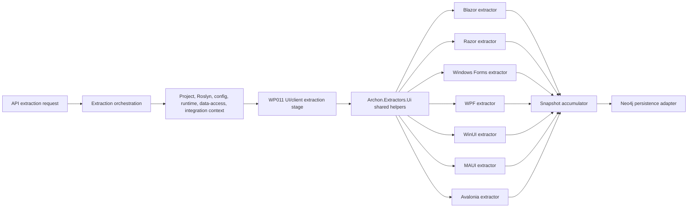

# Implementation Plan - WP011 .NET Client and UI-Technology Extraction for API/MCP Facts

## Document Control

| Field | Value |
| --- | --- |
| Work Package | WP011 - .NET Client and UI-Technology Extraction for API/MCP Facts |
| Target Output Path | `docs/011-.NET-Client-and-UI-Technology-Extraction-for-API-MCP-Facts/plan-wp011-dotnet-client-and-ui-technology-extraction.md` |
| Source Specification | `docs/011-.NET-Client-and-UI-Technology-Extraction-for-API-MCP-Facts/spec-wp011-dotnet-client-and-ui-technology-extraction.md` |
| Source Work Package | `docs/foundation/work-packages.md` WP011 |
| Mandatory Wiki Guidance | `./.github/instructions/wiki.instructions.md` |
| Mandatory Documentation-Pass Guidance | `./.github/instructions/documentation-pass.instructions.md` |
| Status | Draft |

## Planning Principles

This plan translates the WP011 specification into executable vertical work items. Each work item must preserve a runnable system state and must deliver a demonstrable .NET UI/client extraction capability through the established extraction or extractor test path. The plan deliberately avoids a horizontal-only sequence that builds every parser, every graph contract, or every framework abstraction before any usable extraction path exists.

Implementation must follow these repository standards as hard gates, not optional cleanup:

- `./.github/instructions/wiki.instructions.md` must be followed for every work item. Wiki review is mandatory for WP011, and wiki updates are required whenever developer-facing behavior, architecture, extraction workflow, UI/client extraction terminology, validation guidance, or contributor guidance changes or is materially clarified.
- `./.github/instructions/documentation-pass.instructions.md` must be followed in full for every task that creates, updates, reviews, or plans source code. Code is not acceptable unless the documentation-pass standard is met for every touched class, method, constructor, public parameter, and non-obvious property, including internal and other non-public types.
- Every code-writing task must include developer-level comments on every class, method, and constructor. Public methods and constructors must document every parameter and every generic type parameter. Properties whose purpose is not obvious from their names must be commented. Inline or block comments must explain purpose, logical flow, parsing rules, matching decisions, confidence decisions, and algorithms where they materially help a developer understand the code.
- Source code must follow repository coding standards: Allman braces, block-scoped namespaces, no top-level statements, one public type per file, nullable reference types, underscore-prefixed private fields, and separated `PackageReference` and `ProjectReference` `.csproj` item groups.
- Active work-item execution must be uninterrupted. Once implementation starts for a work item, the executor must continue through implementation, validation, documentation/wiki review, and plan-record updates. The executor must not stop for status-only messages, ordinary fixable build/test failures, or confirmation prompts. The only allowed stops are full work-item completion, explicit user interruption or direction change, or a true blocker that cannot be resolved from the specification, this plan, codebase evidence, or repository guidance.
- The Aspire AppHost must not be run by automated validation as a blocking process. WP011 validation must use targeted tests, fixture projects, application-layer extraction seams, and solution builds.
- Standalone implementation notes, implementation ledgers, architecture notes, or similar contributor-facing narrative records are prohibited. Current-state contributor guidance, design rationale, validation workflows, troubleshooting guidance, terminology, and extension guidance must be written into `./wiki` according to `./.github/instructions/wiki.instructions.md`.
- `wiki/home.md` must remain a landing page and must not become the default destination for detailed UI/client extraction guidance. Detailed contributor-facing guidance must go to the correct topic page or a newly created topic page selected by the mandatory wiki information-architecture review.
- Conceptually dense wiki content about .NET UI/client extraction, Razor and XAML/AXAML artifact analysis, graph facts, stable keys, evidence, confidence, unknowns, redaction, validation, and extension patterns must use longer book-like narrative prose. Technical terms must be defined on first use or linked to glossary entries, and examples or walkthrough material must be added when they materially improve contributor understanding.

## Overall Project Structure

WP011 implementation is expected to work primarily in these project areas:

```text
docs/
  011-.NET-Client-and-UI-Technology-Extraction-for-API-MCP-Facts/
	spec-wp011-dotnet-client-and-ui-technology-extraction.md
	plan-wp011-dotnet-client-and-ui-technology-extraction.md

src/
  Archon.Application/
  Archon.Api.Extraction/
  Archon.Roslyn/
  Archon.Roslyn.CSharp/
  Archon.Roslyn.VisualBasic/
  Archon.Extractors.Projects/
  Archon.Extractors.Configuration/
  Archon.Extractors.DependencyInjection/
  Archon.Extractors.DataAccess/
  Archon.Extractors.Integrations/
  Archon.Extractors.Ui/
  Archon.Extractors.Blazor/
  Archon.Extractors.Razor/
  Archon.Extractors.WinForms/
  Archon.Extractors.Wpf/
  Archon.Extractors.WinUI/
  Archon.Extractors.Maui/
  Archon.Extractors.Avalonia/

test/
  Archon.Application.Tests/
  Archon.Api.Extraction.Tests/
  Archon.Roslyn.Tests/
  Archon.Roslyn.CSharp.Tests/
  Archon.Roslyn.VisualBasic.Tests/
  Archon.Extractors.Ui.Tests/
  Archon.Extractors.Blazor.Tests/
  Archon.Extractors.Razor.Tests/
  Archon.Extractors.WinForms.Tests/
  Archon.Extractors.Wpf.Tests/
  Archon.Extractors.WinUI.Tests/
  Archon.Extractors.Maui.Tests/
  Archon.Extractors.Avalonia.Tests/

wiki/
  home.md
  solution-architecture.md
  api-extraction-workflow.md
  graph-domain-model.md
  roslyn-semantic-extraction.md
  configuration-and-dependency-injection-extraction.md
  runtime-foundation.md
  data-access-extraction.md
  external-integration-extraction.md
  validation-and-test-workflows.md
  glossary.md
  dotnet-ui-client-extraction.md         # create only if the wiki IA review selects a dedicated page
```

The plan assumes WP001 through WP010 have already provided the solution skeleton, graph domain contracts, Neo4j persistence foundation, API extraction contract, repository/project extraction, Roslyn semantic extraction foundation, configuration/dependency-injection extraction context, runtime extraction context, data-access extraction context, and external integration extraction context. If implementation discovers those prerequisites are incomplete, record the discovery and adapt the implementation sequence without bypassing Onion Architecture or inventing parallel contracts.

## Contract Alignment Requirements

Before adding or changing extraction contracts, each work item must verify the current compiled contracts rather than inventing a parallel model. The WP011 specification identifies these relevant contract requirements:

- UI/client facts use core graph node kinds `UiApplication`, `UiComponent`, `UiPage`, `UiView`, `UiLayout`, `UiRoute`, `UiControl`, `UiResource`, `UiStyle`, `ViewModel`, `Command`, and `Binding`, plus existing `Project`, `Type`, `Method`, `ConfigurationKey`, `ExternalService`, data-access nodes, integration nodes, and `FilePath` nodes.
- UI/client relationships use `DECLARES_COMPONENT`, `DECLARES_UI_ROUTE`, `USES_COMPONENT`, `USES_LAYOUT`, `USES_CONTROL`, `USES_UI_RESOURCE`, `USES_STYLE`, `BINDS_TO`, `USES_COMMAND`, `USES_VIEW_MODEL`, `NAVIGATES_TO`, `HANDLES_UI_EVENT`, `CALLS_API`, `USES_CONFIG`, and `DEPENDS_ON`.
- Stable keys are deterministic and must not depend on database IDs, absolute developer machine paths, enumeration order, generated temporary paths, live runtime state, UI rendering output, browser state, or external service availability.
- UI application stable keys use project key plus UI framework, target framework, and startup or hosting identity where available.
- UI component, page, view, layout, control, resource, style, command, and binding stable keys use project key plus normalized repository-relative artifact path, artifact kind, type/name/key/path identity, and source location where needed for uniqueness.
- UI route stable keys use project key plus UI framework plus normalized route template and source artifact identity.
- Unknown target keys use source project key plus UI framework, artifact kind, normalized call-site or markup location, and unknown category.
- Relationship keys use source node key plus target node key plus relationship kind plus normalized source location or directive/markup identity where needed for uniqueness.
- Metadata field names use stable lower camel case, including `uiFramework`, `uiArtifactKind`, `projectKey`, `targetFramework`, `language`, `sourcePath`, `typeName`, `methodName`, `componentName`, `pageName`, `viewName`, `windowName`, `layoutName`, `routeTemplate`, `routeParameter`, `controlName`, `resourceKey`, `styleKey`, `bindingPath`, `commandName`, `eventName`, `navigationTarget`, `viewModelType`, `renderMode`, `hostingModel`, `platformHead`, `packageIdentity`, `detectionMode`, `confidenceReason`, and `unknownReason`.
- Framework-specific subtypes are metadata values, not ad hoc graph node kinds. Examples include `uiFramework` values `Blazor`, `RazorPages`, `MvcRazor`, `WinForms`, `Wpf`, `WinUI`, `Maui`, `Avalonia`, and `Unknown`; `uiArtifactKind` values `Application`, `Component`, `Page`, `View`, `Layout`, `Route`, `Control`, `Resource`, `Style`, `ViewModel`, `Command`, `Binding`, and `Unknown`; and `hostingModel` values `Server`, `WebAssembly`, `WebApp`, `Hybrid`, and `Unknown` where applicable.
- Evidence records must support source code, Razor markup, XAML, AXAML, designer source, `.resx` resources, project metadata, generated source, line spans or artifact locations, snippet hashes, snippet previews with secret redaction, confidence, detection mode, and unknown reasons.
- Snapshot accumulation accepts nodes, edges, evidence, warnings, and errors and defines deterministic duplicate handling.

If the implemented contracts differ from the specification wording, implementation must follow actual compiled contracts first, then update this plan's execution record and wiki guidance with the exact current behavior.

## Work Items

## 1. Minimal Shared UI Extraction and Blazor Route Slice

- [x] Work Item 1: Deliver an end-to-end Blazor route and component extraction path - Completed
  - **Purpose**: Establish the smallest meaningful WP011 vertical slice: a fixture containing a Blazor `.razor` component is analyzed through the UI/Blazor extractor, projected into graph contracts, accumulated into snapshot output, and verified with tests.
  - **Acceptance Criteria**:
	- `.razor` files are detected in an analyzed target repository fixture.
	- Blazor component, route, layout, injected service, parameter, and authorization facts are extracted where present.
	- `UiApplication`, `UiComponent`, `UiRoute`, `UiLayout`, and relevant `Project`, `Type`, `Method`, and `ConfigurationKey` reuse are emitted through the snapshot contract where supported by current contracts.
	- `DECLARES_COMPONENT`, `DECLARES_UI_ROUTE`, `USES_LAYOUT`, `USES_CONFIG`, and `DEPENDS_ON` relationships are emitted where supported by current contracts.
	- Evidence includes repository-relative file path, line span or markup location where available, snippet hash, redacted snippet preview, detection mode, and confidence.
	- Malformed or partial Razor content produces warnings and explicit unknowns where partial facts are available.
	- The slice runs without Neo4j direct writes, UI rendering, browser automation, live API calls, API query endpoints, MCP tools, markdown export, snapshot diff, or Discovery UI.
  - **Definition of Done**:
	- Shared UI extraction contracts/helpers and Blazor route/component extraction are implemented end to end through shared contracts, extractor code, accumulation, and tests.
	- WP002/WP011 graph contracts are used or extended only through the correct application/domain contract seams.
	- Logging and ordinary error handling are added where the extraction path has meaningful runtime decisions.
	- Source code written in this work item complies with `./.github/instructions/documentation-pass.instructions.md` in full, including comments for every class, method, constructor, public parameter, and non-obvious property, including internal and non-public code.
	- Wiki review is performed for .NET UI extraction, Blazor, Razor component, route, layout, injected service, evidence, confidence, unknown, and static-analysis terminology; relevant wiki or repository guidance is updated, or an explicit no-change result is recorded.
	- Foundational documentation uses book-like narrative depth for UI extraction concepts, stable keys, evidence, confidence, unknowns, redaction, and validation; technical terms are defined on first use or linked to glossary entries.
	- Can execute end to end via targeted Blazor/UI extractor tests.
	- Executor must not stop mid-work-item unless the work item is complete, the user explicitly interrupts, or a true blocker prevents further autonomous progress.
	- [x] Task 1: Inspect existing UI and graph contracts - Completed
	- [x] Step 1: Locate current node kinds, edge kinds, evidence kinds, confidence, unknown-state, metadata, stable-key, fingerprint, and snapshot accumulation contracts.
	- [x] Step 2: Confirm whether all WP011 node and relationship kinds already exist; add missing domain-controlled values only through the established domain/application seams.
	- [x] Step 3: Confirm current extraction stage registration patterns from prior work packages.
	- [x] Step 4: Document touched source contracts and implementation code according to `./.github/instructions/documentation-pass.instructions.md`.
  - [x] Task 2: Add or align the shared UI extraction entry contracts - Completed
	- [x] Step 1: Add the smallest extractor-facing request/result contracts needed for repository-relative UI artifact extraction if they do not already exist.
	- [x] Step 2: Reuse snapshot accumulator, graph node/edge/evidence contracts, metadata, confidence, unknown-state, stable-key, and fingerprint contracts.
	- [x] Step 3: Keep extractor code in `Archon.Extractors.Ui` and `Archon.Extractors.Blazor`; API orchestration references the extractor project without adding host, infrastructure, Neo4j, UI product, or MCP dependencies to extractor code.
  - [x] Task 3: Implement Blazor detection and route/component extraction - Completed
	- [x] Step 1: Implement deterministic `.razor` file discovery under the accepted repository root, excluding build output paths.
	- [x] Step 2: Parse `@page`, `@layout`, `@inject`, `[Parameter]`, `[CascadingParameter]`, `AuthorizeView`, and `[Authorize]` where feasible in the first slice; component-reference, forms, and validation-marker expansion remains for later WP011 work items.
	- [x] Step 3: Classify Blazor hosting from project/package/startup evidence where available and emit Unknown hosting when evidence is insufficient.
	- [x] Step 4: Emit graph-ready nodes, relationships, metadata, evidence, confidence, warnings, and unknowns through the shared snapshot contract.
  - [x] Task 4: Add focused tests and validation - Completed
	- [x] Step 1: Add fixture coverage for a routed Blazor component, layout usage, injected service, parameter, authorization marker, malformed Razor, and secret-like values.
	- [x] Step 2: Assert node kinds, relationship kinds, stable keys, metadata, confidence, unknown state, warnings, evidence, snippet hashes, and redaction behavior.
	- [x] Step 3: Run targeted Blazor/UI extractor tests and API extraction tests after wiring the stage.
  - [x] Task 5: Perform documentation and wiki review for the slice - Completed
	- [x] Step 1: Review `wiki/graph-domain-model.md`, `wiki/api-extraction-workflow.md`, `wiki/validation-and-test-workflows.md`, `wiki/glossary.md`, `wiki/home.md`, and decide whether to create `wiki/dotnet-ui-client-extraction.md`.
	- [x] Step 2: Update selected wiki pages with current-state UI/client extraction guidance required by `./.github/instructions/wiki.instructions.md`.
	- [x] Step 3: Record the wiki review result with page-structure decision and impact matrix in this plan after implementation.
  - **Completion Summary**: Implemented shared UI evidence/source-location/redaction/stable-key helpers in `src/Archon.Extractors.Ui`, Blazor route/component extraction request/result and extractor logic in `src/Archon.Extractors.Blazor`, and API pipeline wiring through `Wp011BlazorRouteComponentExtractionStage` plus service registration. The slice emits `UiApplication`, `UiComponent`, `UiRoute`, `UiLayout`, `Project`, and `ConfigurationKey` facts plus `DECLARES_COMPONENT`, `DECLARES_UI_ROUTE`, `USES_LAYOUT`, `USES_CONFIG`, and `DEPENDS_ON` relationships through the existing snapshot contracts. Evidence uses repository-relative paths, line spans where available, snippet hashes, redacted snippet previews, detection metadata, confidence, warnings, and explicit unknown state for partial route directives. No new domain-controlled node or edge values were required because WP011 values already existed in the compiled graph vocabulary.
  - **Validation**: Passed `dotnet test .\test\Archon.Extractors.Ui.Tests\Archon.Extractors.Ui.Tests.csproj`; passed `dotnet test .\test\Archon.Extractors.Blazor.Tests\Archon.Extractors.Blazor.Tests.csproj --filter Blazor`; passed `dotnet test .\test\Archon.Api.Extraction.Tests\Archon.Api.Extraction.Tests.csproj --filter Ui`; passed `dotnet test .\test\Archon.Api.Extraction.Tests\Archon.Api.Extraction.Tests.csproj --filter Wp011`; passed `dotnet build .\Archon.slnx --no-restore`.
  - **Wiki Review Result**: Created `wiki/dotnet-ui-client-extraction.md` for the detailed Blazor/UI extraction mental model, stable keys, evidence, confidence, unknowns, redaction, API workflow boundary, current exclusions, and extension guidance. Updated `wiki/home.md`, `wiki/graph-domain-model.md`, `wiki/api-extraction-workflow.md`, `wiki/validation-and-test-workflows.md`, and `wiki/glossary.md`.
  - **Wiki Impact Matrix**: Affected concepts: .NET UI extraction, Blazor component, Blazor route, layout usage, injected service/dependency facts, UI evidence, confidence, unknown route state, redaction, validation, and API-stage ordering. Pages reviewed: `wiki/home.md`, `wiki/graph-domain-model.md`, `wiki/api-extraction-workflow.md`, `wiki/validation-and-test-workflows.md`, `wiki/glossary.md`. Pages updated: all reviewed pages. Pages created: `wiki/dotnet-ui-client-extraction.md`. Pages retired: none. Pages intentionally unchanged: no other wiki pages were changed because detailed UI/client guidance has a dedicated home and existing runtime, data-access, integration, and persistence pages do not own this concept. Page-structure decision: a new topic page was required because UI/client extraction is a new contributor-facing concept that does not fit cleanly inside graph vocabulary, runtime, integration, or validation pages; `wiki/home.md` remains a concise landing page and table of contents only.
  - **Files**:
	- `src/Archon.Extractors.Ui/**`: Shared UI extraction abstractions, metadata, evidence, stable-key, confidence, unknown, redaction, and graph fact helpers.
	- `src/Archon.Extractors.Blazor/**`: Blazor `.razor` and route/component extraction implementation.
	- `src/Archon.Application/**`: Shared extraction or accumulation contracts only if needed.
	- `src/Archon.Api.Extraction/**`: Extraction stage registration only if needed for the end-to-end path.
	- `test/Archon.Extractors.Ui.Tests/**`: Shared UI extraction tests.
	- `test/Archon.Extractors.Blazor.Tests/**`: Blazor route/component extraction tests.
	- `test/Archon.Api.Extraction.Tests/**`: Pipeline integration tests only if needed for stage wiring.
	- `wiki/**`: Topic pages selected by mandatory wiki review.
  - **Work Item Dependencies**: WP001 through WP010 foundation outputs.
  - **Run / Verification Instructions**:
	- `dotnet test .\test\Archon.Extractors.Ui.Tests\Archon.Extractors.Ui.Tests.csproj`
	- `dotnet test .\test\Archon.Extractors.Blazor.Tests\Archon.Extractors.Blazor.Tests.csproj --filter Blazor`
	- `dotnet test .\test\Archon.Api.Extraction.Tests\Archon.Api.Extraction.Tests.csproj --filter Ui`
	- `dotnet build .\Archon.slnx --no-restore`
  - **User Instructions**:
	- None expected unless package restore or the required .NET SDK is unavailable.

## 2. Blazor Interaction, Dependency, and Correlation Slice

- [x] Work Item 2: Expand Blazor extraction to interactions, render modes, service/API/configuration usage, and component relationships - Completed
  - **Purpose**: Make Blazor useful for impact analysis by extending beyond route detection into interaction edges, component composition, injected dependencies, API/client usage, and configuration usage.
  - **Acceptance Criteria**:
	- `EventCallback`, `RenderFragment`, route parameters, forms, validation components, render modes, child component usage, injected services, API/client usage, and configuration usage are detected where evidence exists.
	- UI-to-service/API and UI-to-configuration links reuse prior DI, configuration, runtime, and integration facts where available.
	- Dynamic render fragments, unresolved components, computed routes, unknown render modes, and ambiguous service/API links produce explicit unknowns.
	- Duplicate component, route, parameter, and dependency facts are deduplicated by deterministic stable keys.
  - **Definition of Done**:
	- Blazor interaction and dependency extraction runs through the same UI extraction entry path as Work Item 1.
	- Tests cover component composition, event callbacks, render fragments, render modes, forms, validation, API/client usage, configuration usage, deduplication, evidence, confidence, and unknowns.
	- Source code complies with `./.github/instructions/documentation-pass.instructions.md` in full for all touched code.
	- Wiki review is performed for Blazor interaction, render-mode, component composition, injected dependency, configuration usage, API/client usage, and unknown terminology; relevant pages are updated or an explicit no-change result is recorded.
	- Can execute end to end via targeted Blazor extractor tests.
	- Executor must not stop mid-work-item unless the work item is complete, the user explicitly interrupts, or a true blocker prevents further autonomous progress.
	- [x] Task 1: Extend Blazor pattern catalog - Completed
	- [x] Step 1: Add descriptors for `EventCallback`, `RenderFragment`, route parameters, forms, validation components, render-mode markers, child component tags, and dependency usage.
	- [x] Step 2: Add conservative correlation descriptors for configuration keys, external service/API calls, and injected services using existing prior-stage facts.
  - [x] Task 2: Implement interaction and dependency extraction - Completed
	- [x] Step 1: Extract component composition and `USES_COMPONENT` relationships.
	- [x] Step 2: Extract UI events and `HANDLES_UI_EVENT` relationships.
	- [x] Step 3: Extract API/client and configuration correlations through `CALLS_API`, `USES_CONFIG`, and `DEPENDS_ON` relationships where supported by current contracts.
	- [x] Step 4: Emit unknowns for dynamic or ambiguous component, route, service, API, render-mode, and configuration targets.
  - [x] Task 3: Add tests and validation - Completed
	- [x] Step 1: Add Blazor fixtures with nested components, callbacks, render fragments, forms, validation, render modes, service calls, and configuration keys.
	- [x] Step 2: Assert graph facts, relationship direction, metadata fields, evidence, confidence, unknowns, redaction, and deduplication.
	- [x] Step 3: Run targeted Blazor/UI tests and a solution build.
  - [x] Task 4: Perform documentation and wiki review - Completed
	- [x] Step 1: Review whether selected wiki guidance explains Blazor component relationships, render modes, dependency correlation, and static-only limits.
	- [x] Step 2: Update selected topic pages for current-state Blazor extraction behavior or record explicit no-change rationale.
	- [x] Step 3: Record the wiki review result in this plan after implementation.
  - **Completion Summary**: Expanded `Archon.Extractors.Blazor` through the existing UI extraction entry path to detect child component tags, `DynamicComponent` unknowns, UI event and callback attributes, command usage, form and validation controls, render fragments, literal and computed render modes, literal and computed `HttpClient` calls, literal and computed `IConfiguration` indexers, injected service dependency facts, deterministic deduplication, evidence, confidence, warnings, and explicit unknown state. The implementation reuses existing graph contracts and emits `UiComponent`, `UiControl`, `Command`, `ExternalService`, and `ConfigurationKey` facts with `USES_COMPONENT`, `USES_CONTROL`, `HANDLES_UI_EVENT`, `USES_COMMAND`, `CALLS_API`, `USES_CONFIG`, and `DEPENDS_ON` relationships where supported. No new graph-controlled node or edge values were required.
  - **Validation**: Passed `dotnet test .\test\Archon.Extractors.Blazor.Tests\Archon.Extractors.Blazor.Tests.csproj --filter Blazor --no-restore`; passed `dotnet test .\test\Archon.Extractors.Ui.Tests\Archon.Extractors.Ui.Tests.csproj --no-restore`; passed `dotnet build .\Archon.slnx --no-restore`; workspace build validation also reported successful.
  - **Wiki Review Result**: Updated `wiki/dotnet-ui-client-extraction.md` with current-state Blazor interaction, dependency, render-mode, render-fragment, form, validation, API/client, configuration, and static-limit guidance. Updated `wiki/home.md`, `wiki/graph-domain-model.md`, `wiki/api-extraction-workflow.md`, and `wiki/validation-and-test-workflows.md` so reader paths, graph vocabulary references, API stage behavior, and validation commands reflect the expanded slice. No wiki pages were created or retired.
  - **Wiki Impact Matrix**: Affected concepts: Blazor component composition, event/callback handling, command usage, forms, validation controls, render fragments, render modes, injected dependency correlation, API/client calls, configuration-key usage, static-only boundaries, evidence, confidence, unknowns, redaction, deduplication, and validation. Pages reviewed: `wiki/dotnet-ui-client-extraction.md`, `wiki/home.md`, `wiki/graph-domain-model.md`, `wiki/api-extraction-workflow.md`, `wiki/validation-and-test-workflows.md`, and `.github/instructions/wiki.instructions.md`. Pages updated: `wiki/dotnet-ui-client-extraction.md`, `wiki/home.md`, `wiki/graph-domain-model.md`, `wiki/api-extraction-workflow.md`, and `wiki/validation-and-test-workflows.md`. Pages created: none. Pages retired: none. Pages intentionally unchanged: other wiki pages remained unchanged because runtime, data-access, integration, persistence, and glossary guidance did not need new terminology beyond existing linked concepts. Page-structure decision: the existing dedicated `wiki/dotnet-ui-client-extraction.md` page remains the correct detailed home; `wiki/home.md` remains only a landing page with concise summary/link updates; no new page was needed because Work Item 2 materially expands an existing UI/client extraction topic rather than introducing a separate contributor concept.
  - **Files**:
	- `src/Archon.Extractors.Blazor/**`: Blazor interaction, dependency, render-mode, and component relationship extraction.
	- `src/Archon.Extractors.Ui/**`: Shared relationship, confidence, unknown, redaction, or metadata helpers only if needed.
	- `test/Archon.Extractors.Blazor.Tests/**`: Blazor interaction and dependency tests.
	- `wiki/**`: Topic pages selected by mandatory wiki review.
  - **Work Item Dependencies**: Work Item 1.
  - **Run / Verification Instructions**:
	- `dotnet test .\test\Archon.Extractors.Blazor.Tests\Archon.Extractors.Blazor.Tests.csproj --filter Blazor`
	- `dotnet build .\Archon.slnx --no-restore`
  - **User Instructions**:
	- None expected.

## 3. Razor Pages and MVC Razor Slice

- [x] Work Item 3: Deliver Razor Pages and MVC Razor view extraction - Completed
  - **Purpose**: Add server-rendered .NET UI artifact extraction so Archon can connect pages, views, handlers, forms, tag helpers, and controller/action relationships to the architecture graph.
  - **Acceptance Criteria**:
	- `.cshtml`, Razor Pages, MVC Razor views, `_ViewImports`, `_ViewStart`, layouts, partials, view components, tag helpers, page models, handler methods, form posts, anchor tag helpers, route conventions, authorization metadata, and controller/action linkage are detected where evidence exists.
	- `UiPage`, `UiView`, `UiLayout`, `UiComponent`, `UiRoute`, `Method`, and relevant project/type facts are emitted or reused through the snapshot contract.
	- `USES_LAYOUT`, `USES_COMPONENT`, `DECLARES_UI_ROUTE`, `NAVIGATES_TO`, `HANDLES_UI_EVENT`, and `DEPENDS_ON` relationships are emitted where supported by current contracts.
	- Dynamic view names, dynamic partials, unresolved page models, unknown controller/action links, and computed navigation targets produce explicit unknowns.
  - **Definition of Done**:
	- Razor Pages and MVC Razor extraction runs end to end through the UI extraction path.
	- Tests cover page/view classification, view imports, view start, layouts, partials, tag helpers, page models, handlers, forms, links, authorization, controller/action linkage, evidence, confidence, unknowns, and deduplication.
	- Source code complies with `./.github/instructions/documentation-pass.instructions.md` in full for all touched code.
	- Wiki review is performed for Razor Pages, MVC Razor views, page models, handlers, tag helpers, forms, navigation, and controller/action linkage; relevant pages are updated or an explicit no-change result is recorded.
	- Can execute end to end via targeted Razor extractor tests.
	- Executor must not stop mid-work-item unless the work item is complete, the user explicitly interrupts, or a true blocker prevents further autonomous progress.
	- [x] Task 1: Add Razor artifact discovery and classification - Completed
	- [x] Step 1: Discover `.cshtml`, `_ViewImports.cshtml`, and `_ViewStart.cshtml` files deterministically under submitted repository roots.
	- [x] Step 2: Classify Razor Pages and MVC Razor views using project structure, directives, page model types, runtime facts, and controller/action evidence.
  - [x] Task 2: Implement Razor fact extraction - Completed
	- [x] Step 1: Extract layouts, partials, view components, tag helper usage, forms, anchor targets, route metadata, and authorization metadata.
	- [x] Step 2: Extract page model and handler method links using static companion `.cshtml.cs` source evidence where available.
	- [x] Step 3: Correlate MVC views to controllers/actions only when deterministic conventional path and controller source evidence supports the link.
	- [x] Step 4: Emit graph-ready facts, evidence, confidence, warnings, and unknowns.
  - [x] Task 3: Add tests and validation - Completed
	- [x] Step 1: Add Razor Pages and MVC Razor fixtures covering supported patterns and dynamic unknown cases.
	- [x] Step 2: Assert graph facts, relationship direction, metadata fields, evidence, confidence, unknowns, redaction, and deduplication.
	- [x] Step 3: Run targeted Razor/UI tests and a solution build.
  - [x] Task 4: Perform documentation and wiki review - Completed
	- [x] Step 1: Review selected wiki pages for Razor extraction terminology and server-rendered UI guidance.
	- [x] Step 2: Update current-state guidance or record explicit no-change rationale.
	- [x] Step 3: Record the wiki review result in this plan after implementation.
  - **Completion Summary**: Implemented the `Archon.Extractors.Razor` static extraction path with `RazorPageViewExtractionRequest`, `RazorPageViewExtractionResult`, and `RazorPageViewExtractor`. The slice discovers repository-contained `.cshtml`, `_ViewImports.cshtml`, and `_ViewStart.cshtml` artifacts outside build-output folders; classifies Razor Pages, MVC Razor views, view-component views, and context artifacts; emits `UiApplication`, `UiPage`, `UiView`, `UiComponent`, `UiLayout`, `UiRoute`, `UiControl`, `ViewModel`, `Method`, `Controller`, and `Project` facts; and creates `DECLARES_COMPONENT`, `DECLARES_UI_ROUTE`, `USES_LAYOUT`, `USES_COMPONENT`, `USES_CONTROL`, `USES_VIEW_MODEL`, `NAVIGATES_TO`, `HANDLES_UI_EVENT`, and `DEPENDS_ON` relationships where static evidence supports them. Dynamic routes, layouts, partials, navigation targets, and unresolved page models produce warnings plus explicit unknown graph facts. The API extraction module now registers `RazorPageViewExtractor` and `Wp011RazorPageViewExtractionStage` after the existing Blazor WP011 stage.
  - **Validation**: Passed `dotnet test .\test\Archon.Extractors.Ui.Tests\Archon.Extractors.Ui.Tests.csproj --no-restore`; passed `dotnet test .\test\Archon.Extractors.Razor.Tests\Archon.Extractors.Razor.Tests.csproj --no-restore`; passed `dotnet test .\test\Archon.Api.Extraction.Tests\Archon.Api.Extraction.Tests.csproj --filter Wp011 --no-restore`; passed `dotnet test .\test\Archon.Api.Extraction.Tests\Archon.Api.Extraction.Tests.csproj --filter Ui --no-restore`; passed `dotnet build .\Archon.slnx --no-restore`.
  - **Wiki Review Result**: Updated `wiki/dotnet-ui-client-extraction.md` with current-state Razor Pages and MVC Razor extraction guidance, including `.cshtml` discovery, page/view classification, `_ViewImports`, `_ViewStart`, layouts, partials, view components, tag helpers, forms, anchors, page models, handlers, controller/action linkage, dynamic unknowns, evidence, confidence, redaction, API workflow boundaries, and current exclusions. Updated `wiki/home.md`, `wiki/graph-domain-model.md`, `wiki/api-extraction-workflow.md`, `wiki/validation-and-test-workflows.md`, and `wiki/glossary.md`. No wiki pages were created or retired.
  - **Wiki Impact Matrix**: Affected concepts: Razor Pages, MVC Razor views, `.cshtml` artifact discovery, `_ViewImports`, `_ViewStart`, tag helpers, layouts, partials, view components, forms, anchors, page models, handler methods, conventional MVC controller/action linkage, server-rendered UI evidence, stable keys, confidence, redaction, warnings, and explicit unknowns. Pages reviewed: `wiki/dotnet-ui-client-extraction.md`, `wiki/home.md`, `wiki/graph-domain-model.md`, `wiki/api-extraction-workflow.md`, `wiki/validation-and-test-workflows.md`, `wiki/glossary.md`, and `.github/instructions/wiki.instructions.md`. Pages updated: `wiki/dotnet-ui-client-extraction.md`, `wiki/home.md`, `wiki/graph-domain-model.md`, `wiki/api-extraction-workflow.md`, `wiki/validation-and-test-workflows.md`, and `wiki/glossary.md`. Pages created: none. Pages retired: none. Pages intentionally unchanged: runtime, data-access, integration, persistence, and setup pages remained unchanged because the server-rendered UI behavior belongs in the existing UI/client extraction topic and shared workflow/vocabulary pages. Page-structure decision: the existing dedicated `wiki/dotnet-ui-client-extraction.md` page remains the correct detailed home because Razor Pages and MVC Razor are part of the same WP011 UI/client extraction concept; `wiki/home.md` remains a concise landing page with only summary and reader-path updates.
  - **Files**:
	- `src/Archon.Extractors.Razor/**`: Razor Pages and MVC Razor extraction implementation.
	- `src/Archon.Extractors.Ui/**`: Shared Razor/markup helpers only if needed.
	- `test/Archon.Extractors.Razor.Tests/**`: Razor Pages and MVC Razor tests.
	- `wiki/**`: Topic pages selected by mandatory wiki review.
  - **Work Item Dependencies**: Work Items 1 and 2.
  - **Run / Verification Instructions**:
	- `dotnet test .\test\Archon.Extractors.Razor.Tests\Archon.Extractors.Razor.Tests.csproj --filter Razor`
	- `dotnet build .\Archon.slnx --no-restore`
  - **User Instructions**:
	- None expected.

## 4. Windows Forms Slice

- [x] Work Item 4: Deliver Windows Forms static UI extraction - Completed
  - **Purpose**: Add legacy desktop UI extraction so forms, controls, designer files, resources, events, data bindings, startup forms, and code-behind dependencies become evidence-backed graph facts.
  - **Acceptance Criteria**:
	- Windows Forms projects are detected from references, project metadata, application settings, and source symbols.
	- `Application.Run`, startup forms, forms, user controls, designer partials, `.resx` resources, controls, control hierarchy, event subscriptions, data bindings, service usage, and data-access usage are detected where evidence exists.
	- `UiApplication`, `UiView` or `UiComponent`, `UiControl`, `UiResource`, `Binding`, and relevant method/type/project facts are emitted or reused through the snapshot contract.
	- Designer ambiguity, dynamically created controls, runtime event wiring, and runtime-generated bindings produce explicit unknowns.
  - **Definition of Done**:
	- Windows Forms extraction runs end to end through the UI extraction path.
	- Tests cover project classification, startup form, forms, user controls, designer correlation, resources, control hierarchy, events, bindings, service/data-access correlation, evidence, confidence, unknowns, redaction, and deduplication.
	- Source code complies with `./.github/instructions/documentation-pass.instructions.md` in full for all touched code.
	- Wiki review is performed for Windows Forms, designer files, resources, control hierarchy, event wiring, data binding, startup form, and legacy UI terminology; relevant pages are updated or an explicit no-change result is recorded.
	- Can execute end to end via targeted WinForms extractor tests.
	- Executor must not stop mid-work-item unless the work item is complete, the user explicitly interrupts, or a true blocker prevents further autonomous progress.
	- [x] Task 1: Add Windows Forms discovery and classification - Completed
	- [x] Step 1: Detect Windows Forms references, package/project metadata, source symbols, and `Application.Run` usage.
	- [x] Step 2: Identify forms, user controls, designer files, resources, and startup form candidates.
  - [x] Task 2: Implement designer, event, binding, and dependency extraction - Completed
	- [x] Step 1: Correlate designer partial classes to form/user-control types.
	- [x] Step 2: Extract controls, control hierarchy, resources, event subscriptions, and data bindings.
	- [x] Step 3: Correlate code-behind to service, configuration, integration, and data-access facts where prior semantic facts support the link.
	- [x] Step 4: Emit graph-ready facts, evidence, confidence, warnings, and unknowns.
  - [x] Task 3: Add tests and validation - Completed
	- [x] Step 1: Add C# and VB.NET WinForms fixtures where feasible.
	- [x] Step 2: Assert graph facts, metadata, evidence, confidence, unknowns, redaction, and deduplication.
	- [x] Step 3: Run targeted WinForms/UI tests and a solution build.
  - [x] Task 4: Perform documentation and wiki review - Completed
	- [x] Step 1: Review selected wiki pages for legacy desktop UI and designer-file guidance.
	- [x] Step 2: Update current-state guidance or record explicit no-change rationale.
	- [x] Step 3: Record the wiki review result in this plan after implementation.
  - **Completion Summary**: Implemented the `Archon.Extractors.WinForms` static extraction path with `WinFormsStaticUiExtractionRequest`, `WinFormsStaticUiExtractionResult`, and `WinFormsStaticUiExtractor`. The slice detects Windows Forms-capable C# and VB.NET projects from project metadata, Windows target frameworks, startup metadata, Windows Forms references, package/reference hints, and source evidence; identifies startup forms from `Application.Run` and project `StartupObject`; classifies forms as `UiView` and user controls as `UiComponent`; correlates designer partials and `.resx` resources by partial type name; emits `UiApplication`, `UiView`, `UiComponent`, `UiControl`, `UiResource`, `Binding`, `Command`, `Type`, `ExternalService`, and `Project` facts; and creates `DECLARES_COMPONENT`, `USES_CONTROL`, `USES_UI_RESOURCE`, `BINDS_TO`, `HANDLES_UI_EVENT`, `USES_COMMAND`, `CALLS_API`, and `DEPENDS_ON` relationships where static evidence supports them. Designer-created controls, control hierarchy, resource keys, event subscriptions, data bindings, direct service-looking dependencies, and data-access-looking dependencies are represented with repository-relative evidence, confidence, deterministic stable keys, redacted snippets, warnings, and explicit unknowns for dynamic controls, runtime event wiring, and unresolved startup forms. The API extraction module now registers `WinFormsStaticUiExtractor` and `Wp011WinFormsStaticUiExtractionStage` after the existing WP011 Razor stage.
  - **Validation**: Passed `dotnet test .\test\Archon.Extractors.WinForms.Tests\Archon.Extractors.WinForms.Tests.csproj --no-restore`; passed `dotnet test .\test\Archon.Extractors.Ui.Tests\Archon.Extractors.Ui.Tests.csproj --no-restore`; passed `dotnet test .\test\Archon.Api.Extraction.Tests\Archon.Api.Extraction.Tests.csproj --filter Wp011 --no-restore`; passed `dotnet build .\Archon.slnx --no-restore`.
  - **Wiki Review Result**: Updated `wiki/dotnet-ui-client-extraction.md` with current-state Windows Forms extraction guidance, including project detection, startup forms, forms, user controls, designer partial correlation, `.resx` resources, controls, control hierarchy, events, bindings, service/data-access dependency hints, dynamic unknowns, redaction, API workflow boundaries, and current exclusions. Updated `wiki/home.md`, `wiki/graph-domain-model.md`, `wiki/api-extraction-workflow.md`, `wiki/validation-and-test-workflows.md`, and `wiki/glossary.md`. No wiki pages were created or retired.
  - **Wiki Impact Matrix**: Affected concepts: Windows Forms application detection, startup form, form, user control, designer partial, `.resx` resource, control hierarchy, event wiring, data binding, service dependency hint, data-access dependency hint, UI evidence, stable keys, confidence, redaction, warnings, explicit unknowns, API stage ordering, and validation. Pages reviewed: `wiki/dotnet-ui-client-extraction.md`, `wiki/home.md`, `wiki/graph-domain-model.md`, `wiki/api-extraction-workflow.md`, `wiki/validation-and-test-workflows.md`, `wiki/glossary.md`, and `.github/instructions/wiki.instructions.md`. Pages updated: `wiki/dotnet-ui-client-extraction.md`, `wiki/home.md`, `wiki/graph-domain-model.md`, `wiki/api-extraction-workflow.md`, `wiki/validation-and-test-workflows.md`, and `wiki/glossary.md`. Pages created: none. Pages retired: none. Pages intentionally unchanged: runtime, data-access, integration, persistence, setup, and Roslyn pages remained unchanged because Windows Forms UI behavior belongs in the existing UI/client extraction topic with cross-links from shared workflow and vocabulary pages. Page-structure decision: the existing dedicated `wiki/dotnet-ui-client-extraction.md` page remains the correct detailed home because Windows Forms is part of the WP011 UI/client extraction concept; `wiki/home.md` remains a concise landing page with only summary and reader-path updates.
  - **Files**:
	- `src/Archon.Extractors.WinForms/**`: Windows Forms extraction implementation.
	- `src/Archon.Extractors.Ui/**`: Shared designer/resource/event/binding helpers only if needed.
	- `test/Archon.Extractors.WinForms.Tests/**`: Windows Forms extraction tests.
	- `wiki/**`: Topic pages selected by mandatory wiki review.
  - **Work Item Dependencies**: Work Item 1.
  - **Run / Verification Instructions**:
	- `dotnet test .\test\Archon.Extractors.WinForms.Tests\Archon.Extractors.WinForms.Tests.csproj --filter WinForms`
	- `dotnet build .\Archon.slnx --no-restore`
  - **User Instructions**:
	- None expected.

## 5. WPF Slice

- [x] Work Item 5: Deliver WPF XAML extraction - Completed
  - **Purpose**: Add WPF extraction so windows, pages, user controls, resources, styles, templates, bindings, commands, routed events, navigation, view models, services, and data-access paths become graph facts.
  - **Acceptance Criteria**:
	- WPF projects are detected from `PresentationFramework`, project metadata, `ApplicationDefinition`, XAML files, and source symbols.
	- Applications, startup URI/object, windows, pages, user controls, resource dictionaries, styles, templates, bindings, commands, routed events, navigation, view-model relationships, service usage, and data-access usage are detected where evidence exists.
	- Required UI nodes and relationships are emitted or reused through the snapshot contract.
	- Dynamic resources, unresolved binding paths, runtime template selection, convention-only view models, and computed navigation produce explicit unknowns.
  - **Definition of Done**:
	- WPF extraction runs end to end through the UI extraction path.
	- Tests cover application definition, windows, pages, controls, resources, styles, templates, bindings, commands, events, navigation, view models, service/data-access correlation, evidence, confidence, unknowns, redaction, and deduplication.
	- Source code complies with `./.github/instructions/documentation-pass.instructions.md` in full for all touched code.
	- Wiki review is performed for WPF, XAML, resource dictionary, style, template, binding, command, routed event, navigation, and view-model terminology; relevant pages are updated or an explicit no-change result is recorded.
	- Can execute end to end via targeted WPF extractor tests.
	- Executor must not stop mid-work-item unless the work item is complete, the user explicitly interrupts, or a true blocker prevents further autonomous progress.
	- [x] Task 1: Add WPF project and XAML discovery - Completed
	- [x] Step 1: Detect WPF project evidence and application definition artifacts.
	- [x] Step 2: Discover XAML windows, pages, user controls, and resource dictionaries deterministically.
  - [x] Task 2: Implement WPF graph extraction - Completed
	- [x] Step 1: Extract startup, windows, pages, controls, resources, styles, templates, bindings, commands, routed events, and navigation targets.
	- [x] Step 2: Correlate view models through direct DataContext, DI, binding context, or convention evidence with confidence classification.
	- [x] Step 3: Correlate service and data-access usage through prior semantic facts.
	- [x] Step 4: Emit graph-ready facts, evidence, confidence, warnings, and unknowns.
  - [x] Task 3: Add tests and validation - Completed
	- [x] Step 1: Add WPF fixtures covering supported patterns and dynamic unknown cases.
	- [x] Step 2: Assert graph facts, metadata, evidence, confidence, unknowns, redaction, and deduplication.
	- [x] Step 3: Run targeted WPF/UI tests and a solution build.
  - [x] Task 4: Perform documentation and wiki review - Completed
	- [x] Step 1: Review selected wiki pages for WPF/XAML guidance and terminology.
	- [x] Step 2: Update current-state guidance or record explicit no-change rationale.
	- [x] Step 3: Record the wiki review result in this plan after implementation.
  - **Files**:
	- `src/Archon.Extractors.Wpf/**`: WPF extraction implementation.
	- `src/Archon.Extractors.Ui/**`: Shared XAML/resource/binding helpers only if needed.
	- `test/Archon.Extractors.Wpf.Tests/**`: WPF extraction tests.
	- `wiki/**`: Topic pages selected by mandatory wiki review.
  - **Work Item Dependencies**: Work Item 1.
  - **Run / Verification Instructions**:
	- `dotnet test .\test\Archon.Extractors.Wpf.Tests\Archon.Extractors.Wpf.Tests.csproj --filter Wpf`
	- `dotnet build .\Archon.slnx --no-restore`
  - **User Instructions**:
	- None expected.
  - **Completion Summary**:
	- Implemented `WpfXamlExtractionRequest`, `WpfXamlExtractionResult`, and `WpfXamlExtractor` in `src/Archon.Extractors.Wpf` for static WPF project classification, application-definition/startup detection, XAML window/page/user-control/resource discovery, resource/style/template/control/binding/command/routed-event/navigation/view-model extraction, service and data-access correlation, evidence emission, redaction, warnings, and explicit unknowns for dynamic resources, unresolved bindings, runtime template selection, computed navigation, and convention-only view models.
	- Added `Wp011WpfXamlExtractionStage`, referenced `Archon.Extractors.Wpf` from `Archon.Api.Extraction`, registered the WPF extractor/stage in API composition, and updated API stage-order tests for `wp011-wpf-xaml`.
	- Added `test/Archon.Extractors.Wpf.Tests/WpfXamlExtractorTests.cs` with WPF fixtures covering application definitions, windows, pages, user controls, resources, styles, templates, bindings, commands, routed events, navigation, view models, service/data-access correlation, evidence, redaction, warnings, unknowns, and generated-output exclusion.
	- Validation performed: `dotnet test .\test\Archon.Extractors.Wpf.Tests\Archon.Extractors.Wpf.Tests.csproj --filter Wpf --no-restore`; `dotnet test .\test\Archon.Extractors.Ui.Tests\Archon.Extractors.Ui.Tests.csproj --no-restore` after retrying one cancelled run; `dotnet test .\test\Archon.Api.Extraction.Tests\Archon.Api.Extraction.Tests.csproj --filter Wp011 --no-restore`. Final solution build recorded after this work-item record.
	- Wiki review result: Updated `wiki/dotnet-ui-client-extraction.md` with WPF XAML extraction behavior, API stage ID, static-analysis boundaries, stable-key/metadata guidance, confidence/unknown rules, and extension guidance; updated `wiki/glossary.md` with WPF application, WPF resource dictionary, WPF binding, and routed-event terminology. Page-structure assessment: the existing dedicated `.NET UI and Client Extraction` topic page remains the correct home for WPF extraction because it already owns cross-framework UI/client behavior; `wiki/home.md` remained unchanged as a concise landing page; no new page was needed; glossary cross-links and term definitions were sufficient after the new entries. Wiki impact matrix: affected concepts = WPF, XAML, resource dictionaries, styles, templates, bindings, commands, routed events, navigation, view models, static evidence, redaction, unknowns, API workflow; pages reviewed = `wiki/dotnet-ui-client-extraction.md`, `wiki/glossary.md`, mandatory wiki/documentation instructions; pages updated = `wiki/dotnet-ui-client-extraction.md`, `wiki/glossary.md`; pages created/retired = none; pages intentionally unchanged = `wiki/home.md`.

## 6. WinUI Slice

- [x] Work Item 6: Deliver WinUI XAML and packaging metadata extraction - Completed
  - **Purpose**: Add WinUI extraction so modern Windows desktop UI projects contribute windows, pages, user controls, resources, bindings, commands, navigation, startup, packaging, and dependency facts.
  - **Acceptance Criteria**:
	- WinUI projects are detected from `Microsoft.UI.Xaml` references, project properties, package references, XAML files, and source symbols.
	- App startup, windows, pages, user controls, resources, styles, bindings, commands, navigation frame usage, view models, packaging metadata, service usage, and data-access usage are detected where evidence exists.
	- Required UI nodes and relationships are emitted or reused through the snapshot contract.
	- Runtime navigation, unresolved binding paths, dynamic resources, packaging ambiguity, and convention-only view models produce explicit unknowns.
  - **Definition of Done**:
	- WinUI extraction runs end to end through the UI extraction path.
	- Tests cover classification, startup, windows, pages, resources, styles, bindings, commands, navigation, packaging, view models, service/data-access correlation, evidence, confidence, unknowns, redaction, and deduplication.
	- Source code complies with `./.github/instructions/documentation-pass.instructions.md` in full for all touched code.
	- Wiki review is performed for WinUI, packaging metadata, navigation frames, XAML resources, bindings, commands, and view-model terminology; relevant pages are updated or an explicit no-change result is recorded.
	- Can execute end to end via targeted WinUI extractor tests.
	- Executor must not stop mid-work-item unless the work item is complete, the user explicitly interrupts, or a true blocker prevents further autonomous progress.
	- [x] Task 1: Add WinUI discovery and classification - Completed
	- [x] Step 1: Detect WinUI project references, properties, packages, XAML artifacts, and startup source.
	- [x] Step 2: Detect packaging metadata artifacts and normalize safe metadata values.
  - [x] Task 2: Implement WinUI graph extraction - Completed
	- [x] Step 1: Extract windows, pages, user controls, resources, styles, bindings, commands, navigation, and view models.
	- [x] Step 2: Correlate service and data-access usage through prior semantic facts.
	- [x] Step 3: Emit graph-ready facts, evidence, confidence, warnings, and unknowns.
  - [x] Task 3: Add tests and validation - Completed
	- [x] Step 1: Add WinUI fixtures covering supported patterns and unknown cases.
	- [x] Step 2: Assert graph facts, metadata, evidence, confidence, unknowns, redaction, and deduplication.
	- [x] Step 3: Run targeted WinUI/UI tests and a solution build.
  - [x] Task 4: Perform documentation and wiki review - Completed
	- [x] Step 1: Review selected wiki pages for WinUI guidance and terminology.
	- [x] Step 2: Update current-state guidance or record explicit no-change rationale.
	- [x] Step 3: Record the wiki review result in this plan after implementation.
  - **Files**:
	- `src/Archon.Extractors.WinUI/**`: WinUI extraction implementation.
	- `src/Archon.Extractors.Ui/**`: Shared XAML/resource/binding/packaging helpers only if needed.
	- `test/Archon.Extractors.WinUI.Tests/**`: WinUI extraction tests.
	- `wiki/**`: Topic pages selected by mandatory wiki review.
  - **Work Item Dependencies**: Work Item 5.
  - **Run / Verification Instructions**:
	- `dotnet test .\test\Archon.Extractors.WinUI.Tests\Archon.Extractors.WinUI.Tests.csproj --filter WinUI`
	- `dotnet build .\Archon.slnx --no-restore`
  - **User Instructions**:
	- None expected.
  - **Completion Summary**:
	- Implemented `WinUiXamlExtractionRequest`, `WinUiXamlExtractionResult`, and `WinUiXamlExtractor` in `src/Archon.Extractors.WinUI` for static WinUI project classification, Windows App SDK/package evidence detection, application/startup detection, XAML window/page/user-control/resource discovery, package manifest parsing, safe package metadata normalization, resource/style/control/binding/command/routed-event/navigation/view-model extraction, service and data-access correlation, evidence emission, redaction, warnings, and explicit unknowns for theme/dynamic resources, unresolved bindings, runtime template selection, runtime navigation, ambiguous packaging, and convention-only view models.
	- Added `Wp011WinUiXamlExtractionStage`, referenced `Archon.Extractors.WinUI` from `Archon.Api.Extraction`, registered the WinUI extractor/stage in API composition, and updated API stage-order tests for `wp011-winui-xaml`.
	- Added `test/Archon.Extractors.WinUI.Tests/WinUiXamlExtractorTests.cs` with WinUI fixtures covering project classification, app/package manifests, startup, windows, pages, user controls, resources, styles, bindings, commands, routed events, navigation frames, packaging metadata, view models, service/data-access correlation, evidence, redaction, warnings, unknowns, and generated-output exclusion.
	- Validation performed: `dotnet test .\test\Archon.Extractors.WinUI.Tests\Archon.Extractors.WinUI.Tests.csproj --filter WinUI --no-restore`; `dotnet test .\test\Archon.Extractors.Ui.Tests\Archon.Extractors.Ui.Tests.csproj --no-restore`; `dotnet test .\test\Archon.Api.Extraction.Tests\Archon.Api.Extraction.Tests.csproj --filter Wp011 --no-restore`. Final solution build recorded after this work-item record.
	- Wiki review result: Updated `wiki/dotnet-ui-client-extraction.md` with WinUI XAML extraction behavior, package manifest and packaging metadata guidance, API stage ID, static-analysis boundaries, stable-key/metadata guidance, confidence/unknown rules, and extension guidance; updated `wiki/glossary.md` with WinUI application, Windows App SDK, package manifest, and navigation frame terminology. Page-structure assessment: the existing dedicated `.NET UI and Client Extraction` topic page remains the correct home for WinUI extraction because it owns cross-framework UI/client behavior and already explains adjacent XAML slices; `wiki/home.md` remained unchanged as a concise landing page; no new page was needed; glossary cross-links and term definitions were sufficient after the new entries. Wiki impact matrix: affected concepts = WinUI, Windows App SDK, package manifests, packaging metadata, XAML resources, bindings, commands, navigation frames, view models, static evidence, redaction, unknowns, API workflow; pages reviewed = `wiki/dotnet-ui-client-extraction.md`, `wiki/glossary.md`, mandatory wiki/documentation instructions; pages updated = `wiki/dotnet-ui-client-extraction.md`, `wiki/glossary.md`; pages created/retired = none; pages intentionally unchanged = `wiki/home.md`.

## 7. .NET MAUI Slice

- [x] Work Item 7: Deliver .NET MAUI page, Shell, platform-head, and navigation extraction - Completed
  - **Purpose**: Add cross-platform .NET client extraction so MAUI applications contribute pages, views, Shell routes, handlers, platform heads, bindings, commands, navigation, services, and data-access facts.
  - **Acceptance Criteria**:
	- .NET MAUI projects are detected from `UseMaui`, `MauiProgram`, package/project metadata, XAML files, and source symbols.
	- Applications, pages, views, Shell usage, Shell routes, handlers, resources, styles, bindings, commands, view models, platform-specific heads, navigation targets, service usage, and data-access usage are detected where evidence exists.
	- Required UI nodes and relationships are emitted or reused through the snapshot contract.
	- Unresolved Shell routes, dynamic navigation, platform ambiguity, unresolved binding paths, and convention-only view models produce explicit unknowns.
  - **Definition of Done**:
	- .NET MAUI extraction runs end to end through the UI extraction path.
	- Tests cover `UseMaui`, `MauiProgram`, pages, views, Shell, Shell routes, handlers, resources, styles, bindings, commands, view models, platform heads, navigation, service/data-access correlation, evidence, confidence, unknowns, redaction, and deduplication.
	- Source code complies with `./.github/instructions/documentation-pass.instructions.md` in full for all touched code.
	- Wiki review is performed for .NET MAUI, Shell, route registration, handlers, platform heads, bindings, commands, navigation, and view-model terminology; relevant pages are updated or an explicit no-change result is recorded.
	- Can execute end to end via targeted MAUI extractor tests.
	- Executor must not stop mid-work-item unless the work item is complete, the user explicitly interrupts, or a true blocker prevents further autonomous progress.
	- [x] Task 1: Add MAUI discovery and classification - Completed
	- [x] Step 1: Detect MAUI project metadata, packages, `UseMaui`, `MauiProgram`, XAML files, and platform heads.
	- [x] Step 2: Identify pages, views, Shell usage, Shell routes, handlers, resources, and styles.
  - [x] Task 2: Implement MAUI graph extraction - Completed
	- [x] Step 1: Extract pages, views, routes, handlers, resources, styles, bindings, commands, view models, platform heads, and navigation targets.
	- [x] Step 2: Correlate service and data-access usage through prior semantic facts.
	- [x] Step 3: Emit graph-ready facts, evidence, confidence, warnings, and unknowns.
  - [x] Task 3: Add tests and validation - Completed
	- [x] Step 1: Add MAUI fixtures covering supported patterns and unknown cases without requiring platform runtime execution.
	- [x] Step 2: Assert graph facts, metadata, evidence, confidence, unknowns, redaction, and deduplication.
	- [x] Step 3: Run targeted MAUI/UI tests and a solution build.
  - [x] Task 4: Perform documentation and wiki review - Completed
	- [x] Step 1: Review selected wiki pages for MAUI guidance and terminology.
	- [x] Step 2: Update current-state guidance or record explicit no-change rationale.
	- [x] Step 3: Record the wiki review result in this plan after implementation.
  - **Files**:
	- `src/Archon.Extractors.Maui/**`: .NET MAUI extraction implementation.
	- `src/Archon.Extractors.Ui/**`: Shared XAML/resource/binding/navigation helpers only if needed.
	- `test/Archon.Extractors.Maui.Tests/**`: .NET MAUI extraction tests.
	- `wiki/**`: Topic pages selected by mandatory wiki review.
  - **Work Item Dependencies**: Work Item 5.
  - **Run / Verification Instructions**:
	- `dotnet test .\test\Archon.Extractors.Maui.Tests\Archon.Extractors.Maui.Tests.csproj --filter Maui`
	- `dotnet build .\Archon.slnx --no-restore`
  - **User Instructions**:
	- None expected.
  - **Completion Summary**:
	- Implemented `MauiXamlExtractionRequest`, `MauiXamlExtractionResult`, and `MauiXamlExtractor` in `src/Archon.Extractors.Maui` for static MAUI project classification, `UseMaui` and package evidence detection, `MauiProgram` source detection, XAML application/Shell/page/view/resource discovery, normalized platform-head detection from target frameworks and `Platforms` folders, Shell route extraction from markup and source registrations, handler extraction from `ConfigureMauiHandlers`, resource/style/control/binding/command/event/navigation/view-model extraction, service and data-access correlation, evidence emission, redaction, warnings, and explicit unknowns for dynamic resources, unresolved bindings, runtime template selection, runtime Shell routes, runtime navigation, ambiguous platform heads, and convention-only view models.
	- Added `Wp011MauiXamlExtractionStage`, referenced `Archon.Extractors.Maui` from `Archon.Api.Extraction`, registered the MAUI extractor/stage in API composition, and updated API stage-order tests for `wp011-maui-xaml`.
	- Added `test/Archon.Extractors.Maui.Tests/MauiXamlExtractorTests.cs` with MAUI fixtures covering project classification, `MauiProgram`, applications, Shell, Shell routes, pages, content views, platform heads, handlers, resources, styles, bindings, commands, events, navigation, view models, service/data-access correlation, evidence, redaction, warnings, unknowns, and generated-output exclusion.
	- Validation performed: `dotnet test .\test\Archon.Extractors.Maui.Tests\Archon.Extractors.Maui.Tests.csproj --filter Maui --no-restore`; `dotnet test .\test\Archon.Extractors.Ui.Tests\Archon.Extractors.Ui.Tests.csproj --no-restore`; `dotnet test .\test\Archon.Api.Extraction.Tests\Archon.Api.Extraction.Tests.csproj --filter Wp011 --no-restore`. Final solution build recorded after this work-item record.
	- Wiki review result: Updated `wiki/dotnet-ui-client-extraction.md` with MAUI Shell and platform-head extraction behavior, Shell route and handler guidance, API stage ID, static-analysis boundaries, stable-key/metadata guidance, confidence/unknown rules, and extension guidance; updated `wiki/glossary.md` with .NET MAUI application, MAUI Shell, Shell route, platform head, and MAUI handler terminology. Page-structure assessment: the existing dedicated `.NET UI and Client Extraction` topic page remains the correct home for MAUI extraction because it owns cross-framework UI/client behavior and already explains adjacent XAML slices; `wiki/home.md` remained unchanged as a concise landing page and existing reader paths already link to the UI/client topic; no new page was needed; glossary entries were sufficient after the new terms were added. Wiki impact matrix: affected concepts = .NET MAUI, MAUI Shell, Shell routes, platform heads, handler registrations, XAML resources, bindings, commands, navigation, view models, static evidence, redaction, unknowns, API workflow; pages reviewed = `wiki/dotnet-ui-client-extraction.md`, `wiki/glossary.md`, `wiki/home.md`, mandatory wiki/documentation instructions; pages updated = `wiki/dotnet-ui-client-extraction.md`, `wiki/glossary.md`; pages created/retired = none; pages intentionally unchanged = `wiki/home.md`.

## 8. Avalonia Slice

- [x] Work Item 8: Deliver Avalonia AXAML, view locator, and ReactiveUI-aware extraction - Completed
  - **Purpose**: Add Avalonia extraction so cross-platform desktop UI artifacts contribute windows, user controls, AXAML resources, styles, bindings, commands, view locators, ReactiveUI relationships, navigation, services, and data-access facts.
  - **Acceptance Criteria**:
	- Avalonia projects are detected from package references, AXAML files, `App.axaml`, source symbols, and startup code.
	- Applications, windows, user controls, resources, styles, bindings, commands, view locator patterns, ReactiveUI usage, view-model relationships, navigation targets, service usage, and data-access usage are detected where evidence exists.
	- Required UI nodes and relationships are emitted or reused through the snapshot contract.
	- Dynamic styles, unresolved bindings, convention-only view locators, ambiguous ReactiveUI relationships, and dynamic navigation produce explicit unknowns.
  - **Definition of Done**:
	- Avalonia extraction runs end to end through the UI extraction path.
	- Tests cover package/reference classification, AXAML, `App.axaml`, windows, user controls, resources, styles, bindings, commands, view locators, ReactiveUI, view models, navigation, service/data-access correlation, evidence, confidence, unknowns, redaction, and deduplication.
	- Source code complies with `./.github/instructions/documentation-pass.instructions.md` in full for all touched code.
	- Wiki review is performed for Avalonia, AXAML, resources, styles, bindings, commands, view locators, ReactiveUI, navigation, and view-model terminology; relevant pages are updated or an explicit no-change result is recorded.
	- Can execute end to end via targeted Avalonia extractor tests.
	- Executor must not stop mid-work-item unless the work item is complete, the user explicitly interrupts, or a true blocker prevents further autonomous progress.
	- [x] Task 1: Add Avalonia discovery and classification - Completed
	- [x] Step 1: Detect Avalonia package references, AXAML artifacts, `App.axaml`, startup source, and ReactiveUI package/source evidence.
	- [x] Step 2: Identify windows, user controls, resources, styles, bindings, commands, view locators, and navigation candidates.
  - [x] Task 2: Implement Avalonia graph extraction - Completed
	- [x] Step 1: Extract applications, windows, user controls, resources, styles, bindings, commands, view locator relationships, ReactiveUI relationships, view models, and navigation targets.
	- [x] Step 2: Correlate service and data-access usage through prior semantic facts.
	- [x] Step 3: Emit graph-ready facts, evidence, confidence, warnings, and unknowns.
  - [x] Task 3: Add tests and validation - Completed
	- [x] Step 1: Add Avalonia fixtures covering supported patterns and unknown cases without requiring runtime execution.
	- [x] Step 2: Assert graph facts, metadata, evidence, confidence, unknowns, redaction, and deduplication.
	- [x] Step 3: Run targeted Avalonia/UI tests and a solution build.
  - [x] Task 4: Perform documentation and wiki review - Completed
	- [x] Step 1: Review selected wiki pages for Avalonia and AXAML guidance and terminology.
	- [x] Step 2: Update current-state guidance or record explicit no-change rationale.
	- [x] Step 3: Record the wiki review result in this plan after implementation.
  - **Files**:
	- `src/Archon.Extractors.Avalonia/**`: Avalonia extraction implementation.
	- `src/Archon.Extractors.Ui/**`: Shared AXAML/resource/binding/view-locator helpers only if needed.
	- `test/Archon.Extractors.Avalonia.Tests/**`: Avalonia extraction tests.
	- `wiki/**`: Topic pages selected by mandatory wiki review.
  - **Work Item Dependencies**: Work Item 5.
  - **Run / Verification Instructions**:
	- `dotnet test .\test\Archon.Extractors.Avalonia.Tests\Archon.Extractors.Avalonia.Tests.csproj --filter Avalonia`
	- `dotnet build .\Archon.slnx --no-restore`
  - **User Instructions**:
	- None expected.
  - **Completion Summary**:
	- Implemented `AvaloniaAxamlExtractionRequest`, `AvaloniaAxamlExtractionResult`, and `AvaloniaAxamlExtractor` in `src/Archon.Extractors.Avalonia` for static Avalonia project classification, package/reference evidence detection, `App.axaml` detection, AXAML window/user-control/styles/resource discovery, startup source detection, style/resource/control/binding/command/event/navigation/view-model extraction, view-locator mapping extraction, ReactiveUI package and generic view-model relationship extraction, service and data-access correlation, evidence emission, redaction, warnings, and explicit unknowns for dynamic resources/styles, unresolved bindings, convention/reflection-only view locators, ambiguous non-generic ReactiveUI relationships, runtime navigation, and convention-only view models.
	- Added `Wp011AvaloniaAxamlExtractionStage`, referenced `Archon.Extractors.Avalonia` from `Archon.Api.Extraction`, registered the Avalonia extractor/stage in API composition, and updated API stage-order tests for `wp011-avalonia-axaml`.
	- Added `test/Archon.Extractors.Avalonia.Tests/AvaloniaAxamlExtractorTests.cs` with Avalonia fixtures covering project classification, package references, `App.axaml`, startup source, windows, user controls, styles, keyed resources, style includes, controls, project-local component tags, bindings, commands, events, view locators, ReactiveUI, view models, navigation, service/data-access correlation, evidence, redaction, warnings, unknowns, and generated-output exclusion. Added `test/Archon.Api.Extraction.Tests/Wp011AvaloniaAxamlExtractionStageTests.cs` for API registration and stage accumulation.
	- Validation performed: `dotnet test .\test\Archon.Extractors.Avalonia.Tests\Archon.Extractors.Avalonia.Tests.csproj --filter Avalonia --no-restore`; `dotnet test .\test\Archon.Extractors.Ui.Tests\Archon.Extractors.Ui.Tests.csproj --no-restore`; `dotnet test .\test\Archon.Api.Extraction.Tests\Archon.Api.Extraction.Tests.csproj --filter Avalonia --no-restore`; `dotnet test .\test\Archon.Api.Extraction.Tests\Archon.Api.Extraction.Tests.csproj --filter Wp011 --no-restore`; `dotnet build .\Archon.slnx --no-restore`.
	- Wiki review result: Updated `wiki/dotnet-ui-client-extraction.md` with Avalonia AXAML extraction behavior, view-locator and ReactiveUI guidance, API stage ID, static-analysis boundaries, stable-key/metadata guidance, confidence/unknown rules, current exclusions, and extension guidance; updated `wiki/glossary.md` with Avalonia application, AXAML, Avalonia view locator, and ReactiveUI relationship terminology; updated `wiki/validation-and-test-workflows.md` with full WP011 UI/client validation commands including Avalonia; updated `wiki/home.md` only with concise reader-path and capability-summary updates. Page-structure assessment: the existing dedicated `.NET UI and Client Extraction` topic page remains the correct home for Avalonia extraction because it owns cross-framework UI/client behavior and already explains adjacent XAML slices; no new page was needed; `wiki/home.md` remained a landing page; glossary entries and validation cross-links were sufficient. Wiki impact matrix: affected concepts = Avalonia, AXAML, Avalonia package/reference classification, `App.axaml`, windows, user controls, styles, keyed resources, style includes, bindings, commands, events, view locators, ReactiveUI relationships, navigation, view models, static evidence, redaction, unknowns, API workflow, and validation; pages reviewed = `wiki/dotnet-ui-client-extraction.md`, `wiki/glossary.md`, `wiki/validation-and-test-workflows.md`, `wiki/home.md`, mandatory wiki/documentation instructions; pages updated = `wiki/dotnet-ui-client-extraction.md`, `wiki/glossary.md`, `wiki/validation-and-test-workflows.md`, `wiki/home.md`; pages created/retired = none; pages intentionally unchanged = runtime, data-access, integration, persistence, setup, and Roslyn pages because Avalonia behavior belongs in the existing UI/client extraction topic with glossary and validation support.

## 9. Cross-Framework Correlation, Deduplication, and API Extraction Stage Slice

- [x] Work Item 9: Deliver unified UI/client stage wiring, cross-framework correlation, deduplication, and end-to-end validation - Completed
  - **Purpose**: Ensure all WP011 framework extractors run through one API-triggered extraction path and produce coherent snapshot output suitable for later API, MCP, rule, metric, diff, and markdown work packages.
  - **Acceptance Criteria**:
	- UI/client extraction runs through the established API extraction orchestration path without direct Neo4j writes.
	- Shared graph facts, evidence, stable keys, confidence, unknowns, warnings, errors, redaction, and deduplication behave consistently across Blazor, Razor, Windows Forms, WPF, WinUI, .NET MAUI, and Avalonia.
	- UI-to-configuration, UI-to-service/API, and UI-to-data-access correlations reuse prior-stage facts where evidence supports the link.
	- Response-ready snapshot output can support later queries by project, framework, route, component, page, view, control, binding, command, view model, navigation target, configuration key, API dependency, service dependency, and data-access dependency.
	- No Archon Discovery UI host, page, component, dashboard, explorer, graph page, prompt panel, front-end asset, or browser/UI automation path is introduced.
  - **Definition of Done**:
	- Unified UI/client extraction stage is implemented and registered through the correct application/API extraction seams.
	- Cross-framework tests cover combined snapshot output, duplicate handling, evidence, confidence, unknowns, redaction, warnings, and stage error handling.
	- Source code complies with `./.github/instructions/documentation-pass.instructions.md` in full for all touched code.
	- Wiki review is performed for unified UI extraction workflow, graph mapping, cross-framework terminology, validation commands, and contributor extension guidance; relevant pages are updated or an explicit no-change result is recorded.
	- Can execute end to end through targeted API extraction tests and framework extractor tests.
	- Executor must not stop mid-work-item unless the work item is complete, the user explicitly interrupts, or a true blocker prevents further autonomous progress.
	- [x] Task 1: Register unified UI/client stage - Completed
	- [x] Step 1: Add or align a `Wp011` UI/client extraction stage following prior stage patterns.
	- [x] Step 2: Ensure stage wiring consumes existing project, semantic, configuration, runtime, data-access, and integration context without violating Onion Architecture.
	- [x] Step 3: Ensure cancellation, warnings, errors, and logging follow established extraction orchestration patterns.
  - [x] Task 2: Implement cross-framework correlation and deduplication - Completed
	- [x] Step 1: Normalize shared metadata and stable-key inputs across all framework extractors.
	- [x] Step 2: Deduplicate nodes, relationships, and evidence that are emitted from both markup and semantic artifacts.
	- [x] Step 3: Correlate UI facts to configuration, API/integration, and data-access facts only when deterministic evidence supports the link.
	- [x] Step 4: Emit explicit unknowns when correlation is partial or ambiguous.
  - [x] Task 3: Add end-to-end tests and validation - Completed
	- [x] Step 1: Add a mixed-fixture extraction test that includes multiple UI technologies and prior-stage correlation facts.
	- [x] Step 2: Assert combined snapshot output, stage registration, no direct persistence writes, no UI product artifacts, redaction, warnings, errors, and deterministic deduplication.
	- [x] Step 3: Run all targeted WP011 extractor tests, targeted API extraction tests, and a solution build.
  - [x] Task 4: Perform documentation and wiki review - Completed
	- [x] Step 1: Review selected wiki pages for unified UI/client extraction workflow, graph facts, validation, and extension guidance.
	- [x] Step 2: Update current-state guidance or record explicit no-change rationale.
	- [x] Step 3: Record the wiki review result in this plan after implementation.
  - **Completion Summary**:
	- Implemented `Wp011UiClientExtractionStage` in `src/Archon.Api.Extraction` as the single pipeline-visible WP011 stage with stage ID `wp011-ui-client`. The stage runs the existing Blazor, Razor Pages/MVC Razor, Windows Forms, WPF, WinUI, .NET MAUI, and Avalonia stage adapters sequentially, preserves cancellation checks, propagates controlled blocking errors through the established pipeline result path, and logs per-framework and aggregate post-deduplication counts without introducing direct persistence writes or product UI artifacts.
	- Updated API service registration so framework-specific WP011 stage adapters remain concrete DI services while only the unified `wp011-ui-client` stage is registered as `IExtractionStage` after WP010. This keeps Onion Architecture boundaries intact: API composition owns orchestration, extractor projects own framework parsing, and persistence remains behind the existing snapshot writer seam.
	- Added shared `UiSnapshotAccumulatorExtensions` and `UiSnapshotMergeSummary` in `src/Archon.Extractors.Ui` so all WP011 framework adapters merge through one helper that measures node, edge, evidence, warning, and error deltas after stable-key deduplication. Existing framework extractors continue to emit deterministic graph facts, explicit unknowns, redacted evidence, and conservative configuration/API/data-access correlations through their established static evidence paths.
	- Added `test/Archon.Api.Extraction.Tests/Wp011UiClientExtractionStageTests.cs` with a mixed-fixture repository covering Blazor, Razor Pages, Windows Forms, WPF, WinUI, .NET MAUI, and Avalonia artifacts. The tests assert unified registration, concrete adapter availability, combined snapshot output, framework metadata, configuration/API/data-access correlation facts, redacted evidence, warnings, explicit unknowns, and deterministic deduplication across repeated unified-stage execution. Existing API registration tests were updated to expect the unified WP011 pipeline stage while preserving direct framework adapter tests.
	- Validation performed before final solution build: `dotnet test .\test\Archon.Extractors.Ui.Tests\Archon.Extractors.Ui.Tests.csproj --no-restore`; `dotnet test .\test\Archon.Extractors.Blazor.Tests\Archon.Extractors.Blazor.Tests.csproj --no-restore`; `dotnet test .\test\Archon.Extractors.Razor.Tests\Archon.Extractors.Razor.Tests.csproj --no-restore`; `dotnet test .\test\Archon.Extractors.WinForms.Tests\Archon.Extractors.WinForms.Tests.csproj --no-restore`; `dotnet test .\test\Archon.Extractors.Wpf.Tests\Archon.Extractors.Wpf.Tests.csproj --no-restore`; `dotnet test .\test\Archon.Extractors.WinUI.Tests\Archon.Extractors.WinUI.Tests.csproj --no-restore`; `dotnet test .\test\Archon.Extractors.Maui.Tests\Archon.Extractors.Maui.Tests.csproj --no-restore`; `dotnet test .\test\Archon.Extractors.Avalonia.Tests\Archon.Extractors.Avalonia.Tests.csproj --no-restore`; `dotnet test .\test\Archon.Api.Extraction.Tests\Archon.Api.Extraction.Tests.csproj --filter Ui --no-restore`; `dotnet test .\test\Archon.Api.Extraction.Tests\Archon.Api.Extraction.Tests.csproj --filter Wp011 --no-restore`.
	- Wiki review result: Updated `wiki/dotnet-ui-client-extraction.md` with unified `wp011-ui-client` stage behavior, framework adapter ordering, stable-key deduplication, shared accumulator semantics, API workflow boundaries, and query-ready cross-framework snapshot output. Updated `wiki/api-extraction-workflow.md` to replace the prior separate WP011 stage narrative with current unified-stage orchestration and graph contribution behavior. Updated `wiki/validation-and-test-workflows.md` with unified-stage validation coverage. Updated `wiki/glossary.md` with the `Unified UI/client stage` term. Page-structure assessment: the existing dedicated `.NET UI and client extraction` topic page remains the correct detailed home because this work clarifies cross-framework UI/client extraction behavior; `wiki/home.md` remained unchanged and concise; no new page was needed; glossary and validation cross-links were sufficient after updates.
	- Wiki impact matrix: affected concepts = unified UI/client stage, framework adapter ordering, API-triggered WP011 orchestration, cross-framework graph facts, stable-key deduplication, redaction, warnings, explicit unknowns, configuration/API/data-access correlation, validation, and extension guidance; pages reviewed = `wiki/dotnet-ui-client-extraction.md`, `wiki/api-extraction-workflow.md`, `wiki/validation-and-test-workflows.md`, `wiki/glossary.md`, `wiki/home.md`, `.github/instructions/wiki.instructions.md`, and `.github/instructions/documentation-pass.instructions.md`; pages updated = `wiki/dotnet-ui-client-extraction.md`, `wiki/api-extraction-workflow.md`, `wiki/validation-and-test-workflows.md`, and `wiki/glossary.md`; pages created = none; pages retired = none; pages intentionally unchanged = `wiki/home.md`, runtime, data-access, integration, persistence, setup, and Roslyn pages because unified WP011 behavior belongs in the existing UI/client topic with workflow, validation, and glossary support.
  - **Files**:
	- `src/Archon.Api.Extraction/**`: Unified UI extraction stage registration and orchestration seams.
	- `src/Archon.Extractors.Ui/**`: Shared normalization, correlation, redaction, deduplication, and stage helper code.
	- `src/Archon.Extractors.*UiFramework*/**`: Minor alignment changes for shared stage compatibility.
	- `test/Archon.Api.Extraction.Tests/**`: UI extraction stage integration tests.
	- `test/Archon.Extractors.*.Tests/**`: Cross-framework targeted tests.
	- `wiki/**`: Topic pages selected by mandatory wiki review.
  - **Work Item Dependencies**: Work Items 1 through 8.
  - **Run / Verification Instructions**:
	- `dotnet test .\test\Archon.Extractors.Ui.Tests\Archon.Extractors.Ui.Tests.csproj`
	- `dotnet test .\test\Archon.Extractors.Blazor.Tests\Archon.Extractors.Blazor.Tests.csproj`
	- `dotnet test .\test\Archon.Extractors.Razor.Tests\Archon.Extractors.Razor.Tests.csproj`
	- `dotnet test .\test\Archon.Extractors.WinForms.Tests\Archon.Extractors.WinForms.Tests.csproj`
	- `dotnet test .\test\Archon.Extractors.Wpf.Tests\Archon.Extractors.Wpf.Tests.csproj`
	- `dotnet test .\test\Archon.Extractors.WinUI.Tests\Archon.Extractors.WinUI.Tests.csproj`
	- `dotnet test .\test\Archon.Extractors.Maui.Tests\Archon.Extractors.Maui.Tests.csproj`
	- `dotnet test .\test\Archon.Extractors.Avalonia.Tests\Archon.Extractors.Avalonia.Tests.csproj`
	- `dotnet test .\test\Archon.Api.Extraction.Tests\Archon.Api.Extraction.Tests.csproj --filter Ui`
	- `dotnet build .\Archon.slnx --no-restore`
  - **User Instructions**:
	- None expected.

## 10. Final Wiki Review and Work-Package Documentation Gate

- [x] Work Item 10: Complete final WP011 wiki review, documentation pass, and plan-record update - Completed
  - **Purpose**: Close the mandatory repository guidance loop for WP011 by verifying that contributor-facing explanations live in the wiki, that no prohibited implementation-note-style artifacts were created, that `wiki/home.md` remains concise, and that the plan records exactly what was reviewed and changed.
  - **Acceptance Criteria**:
	- Mandatory wiki review required by `./.github/instructions/wiki.instructions.md` is complete for the full work package.
	- The final record includes a wiki impact matrix covering affected concepts, pages reviewed, pages updated, pages created, pages intentionally unchanged, retired/prohibited artifacts if any, and page-structure decision.
	- Detailed contributor-facing guidance is on topic pages, not in standalone implementation notes and not dumped into `wiki/home.md`.
	- Any source-code documentation created or updated during WP011 has been validated against `./.github/instructions/documentation-pass.instructions.md`.
	- Final validation commands and outcomes are recorded concisely in this plan without duplicating wiki narrative guidance.
  - **Definition of Done**:
	- Wiki impact matrix is recorded in this plan.
	- Repository guidance pages are updated, created, retired, or explicitly left unchanged with rationale.
	- `wiki/home.md` is verified to remain a landing page and not a catch-all destination.
	- Conceptually dense wiki content uses book-like narrative depth, defines technical terms, and includes examples or walkthroughs where materially helpful.
	- No standalone implementation notes, implementation ledgers, or architecture notes are used as substitutes for wiki maintenance.
	- Targeted WP011 tests and solution build have passed, or unrelated environment failures are documented with evidence.
	- Executor must not stop mid-work-item unless the work item is complete, the user explicitly interrupts, or a true blocker prevents further autonomous progress.
	- [x] Task 1: Perform final wiki information-architecture review - Completed
	- [x] Step 1: Review all wiki pages touched or considered during WP011.
	- [x] Step 2: Confirm whether `wiki/dotnet-ui-client-extraction.md` or another selected topic page remains the correct home for detailed guidance.
	- [x] Step 3: Confirm `wiki/home.md` remains concise and links to topic pages rather than carrying detailed implementation guidance.
	- [x] Step 4: Confirm cross-links and glossary entries are sufficient for UI/client extraction terminology.
  - [x] Task 2: Finalize repository guidance updates - Completed
	- [x] Step 1: Update selected wiki pages with any missing current-state guidance for UI/client extraction, validation, terminology, or extension patterns.
	- [x] Step 2: Retire or avoid prohibited implementation-note-style artifacts; move any contributor-facing detail into wiki topic pages if such artifacts are discovered.
	- [x] Step 3: Ensure dense topics are explained with narrative prose, term definitions, and examples or walkthrough material where needed.
  - [x] Task 3: Record completion evidence - Completed
	- [x] Step 1: Record targeted test and build validation outcomes in this plan.
	- [x] Step 2: Record the final wiki impact matrix in this plan.
	- [x] Step 3: Record any explicitly unchanged pages and why the selected page structure remains readable.
  - **Completion Summary**: Completed the final WP011 wiki and documentation gate. Reviewed the WP011 topic page, API extraction workflow page, validation workflow page, glossary, graph domain model page, landing page, mandatory wiki guidance, mandatory documentation-pass guidance, and repository artifact names for prohibited implementation-note-style records. Updated concise current-state summaries in `wiki/home.md` and `wiki/graph-domain-model.md` so they reflect the full unified `wp011-ui-client` stage, WPF, WinUI, .NET MAUI, Avalonia, `UiStyle` graph facts, cross-framework deduplication, and dynamic unknown behavior. No source code was changed in this work item, so the documentation-pass source-code commenting rules were satisfied by review and prior WP011 validation rather than new comment edits.
  - **Validation**: Passed `dotnet test .\test\Archon.Extractors.Ui.Tests\Archon.Extractors.Ui.Tests.csproj --no-restore`; passed `dotnet test .\test\Archon.Extractors.Blazor.Tests\Archon.Extractors.Blazor.Tests.csproj --no-restore`; passed `dotnet test .\test\Archon.Extractors.Razor.Tests\Archon.Extractors.Razor.Tests.csproj --no-restore`; passed `dotnet test .\test\Archon.Extractors.WinForms.Tests\Archon.Extractors.WinForms.Tests.csproj --no-restore`; passed `dotnet test .\test\Archon.Extractors.Wpf.Tests\Archon.Extractors.Wpf.Tests.csproj --no-restore`; passed `dotnet test .\test\Archon.Extractors.WinUI.Tests\Archon.Extractors.WinUI.Tests.csproj --no-restore`; passed `dotnet test .\test\Archon.Extractors.Maui.Tests\Archon.Extractors.Maui.Tests.csproj --no-restore`; passed `dotnet test .\test\Archon.Extractors.Avalonia.Tests\Archon.Extractors.Avalonia.Tests.csproj --no-restore`; passed `dotnet test .\test\Archon.Api.Extraction.Tests\Archon.Api.Extraction.Tests.csproj --filter Ui --no-restore`; passed `dotnet test .\test\Archon.Api.Extraction.Tests\Archon.Api.Extraction.Tests.csproj --filter Wp011 --no-restore`; passed `dotnet build .\Archon.slnx --no-restore`.
  - **Wiki Review Result**: Updated `wiki/home.md` and `wiki/graph-domain-model.md` to remove stale WP011 summary gaps discovered during the final review. Left `wiki/dotnet-ui-client-extraction.md`, `wiki/api-extraction-workflow.md`, `wiki/validation-and-test-workflows.md`, and `wiki/glossary.md` unchanged because they already contained current-state detailed guidance, validation commands, and terminology for Blazor, Razor Pages, MVC Razor, Windows Forms, WPF, WinUI, .NET MAUI, Avalonia, the unified `wp011-ui-client` stage, stable keys, evidence, confidence, redaction, unknowns, and extension boundaries. No wiki pages were created, split, renamed, or retired. No standalone implementation notes, implementation ledgers, architecture notes, or equivalent prohibited substitute artifacts were found.
  - **Wiki Impact Matrix**: Affected concepts: final WP011 information architecture, unified UI/client stage, Blazor, Razor Pages, MVC Razor, Windows Forms, WPF, WinUI, .NET MAUI, Avalonia, UI graph node and relationship vocabulary, `UiStyle`, stable keys, evidence, redaction, confidence, warnings, explicit unknowns, deduplication, validation commands, glossary terms, and prohibited substitute artifacts. Pages reviewed: `wiki/dotnet-ui-client-extraction.md`, `wiki/api-extraction-workflow.md`, `wiki/validation-and-test-workflows.md`, `wiki/glossary.md`, `wiki/graph-domain-model.md`, `wiki/home.md`, `.github/instructions/wiki.instructions.md`, and `.github/instructions/documentation-pass.instructions.md`. Pages updated: `wiki/home.md` and `wiki/graph-domain-model.md`. Pages created: none. Pages retired: none. Prohibited artifacts retired: none because none were found. Pages intentionally unchanged: `wiki/dotnet-ui-client-extraction.md` remained the detailed topic page because it already provides book-like WP011 guidance and extension boundaries; `wiki/api-extraction-workflow.md` remained current for API orchestration; `wiki/validation-and-test-workflows.md` already listed targeted WP011 validation; `wiki/glossary.md` already defined WP011 terms; runtime, data-access, integration, persistence, setup, and Roslyn pages remained unchanged because final WP011 closure did not alter those behaviors. Page-structure decision: `wiki/dotnet-ui-client-extraction.md` remains the correct detailed home for UI/client extraction; `wiki/home.md` remains a concise landing page with a summary and reader path rather than detailed implementation guidance; no new page was needed because the existing topic, workflow, validation, graph, and glossary pages provide a readable current-state structure.
  - **Files**:
	- `docs/011-.NET-Client-and-UI-Technology-Extraction-for-API-MCP-Facts/plan-wp011-dotnet-client-and-ui-technology-extraction.md`: Final plan record and wiki impact matrix.
	- `wiki/**`: Topic pages selected by mandatory wiki review.
  - **Work Item Dependencies**: Work Items 1 through 9.
  - **Run / Verification Instructions**:
	- Re-run the targeted WP011 test set listed in Work Item 9.
	- `dotnet build .\Archon.slnx --no-restore`
  - **User Instructions**:
	- None expected.

## Appendix A - Architecture

### Overall Technical Approach

WP011 extends Archon's deterministic extraction pipeline with a backend-only .NET UI/client extraction slice. The slice analyzes source-controlled UI artifacts statically and projects them into the existing architecture graph model. A UI artifact is any source-controlled file or symbol that contributes to a user-facing .NET client surface, such as a Razor component, Razor page, Windows Forms designer file, WPF XAML file, WinUI page, MAUI Shell route, or Avalonia AXAML view. Static analysis means the extractor reads source, project metadata, markup, generated files, and Roslyn semantic data without running the analyzed application, rendering UI, invoking event handlers, opening browsers, launching simulators, or contacting external services.

The implementation should use a shared `Archon.Extractors.Ui` foundation for graph fact construction, metadata normalization, evidence creation, redaction, confidence classification, unknown handling, stable-key construction, and deduplication. Framework-specific extractor projects then provide focused discovery and parsing logic. This keeps framework expertise isolated while ensuring all UI facts look consistent to later API, MCP, rule, metric, diff, and markdown work packages.



The diagram shows responsibility flow rather than runtime service calls. Extractor projects contribute graph-ready facts to the snapshot accumulator; they do not write directly to Neo4j. Neo4j remains the system of record only after the established persistence adapter receives accumulated snapshot output.

### Frontend

WP011 does not implement a frontend for Archon. It must not create an Archon Discovery UI, dashboard, explorer, graph page, prompt panel, evidence viewer, hotlist viewer, UI route explorer, front-end asset, browser automation path, screenshot workflow, or any human-facing product UI component.

The analyzed repositories may contain .NET UI frameworks, and WP011 extracts those frameworks as architecture facts. In this plan, the word frontend refers only to UI/client artifacts found inside target repositories being analyzed by Archon. Those target UI artifacts are treated as static source inputs, not as Archon product screens.

### Backend

The backend architecture follows the existing Onion Architecture direction. Domain and application contracts remain inward. Extractors depend on application contracts and Roslyn abstractions where the current solution allows it. API extraction composition may register stages, but framework-specific extraction logic belongs in extractor projects. Infrastructure and host projects must not contain UI/client extraction logic.

The backend data flow is:

1. The API extraction workflow receives a repository root and explicit solution path list.
2. Earlier stages provide project, semantic, configuration, dependency-injection, runtime, data-access, and external integration context.
3. The WP011 UI/client stage discovers relevant UI artifacts inside the accepted repository scope.
4. Framework-specific extractors parse and correlate artifacts using safe static analysis.
5. Shared UI helpers normalize facts into common node, relationship, metadata, evidence, confidence, and unknown formats.
6. The snapshot accumulator deduplicates facts and carries warnings/errors.
7. Existing persistence later writes the accumulated snapshot to Neo4j.

This approach preserves the source-brief principles that facts are deterministic, evidence-backed, unknowns are explicit, and AI does not invent architectural statements.

### Documentation and Wiki Architecture

The implementation must treat wiki maintenance as part of architecture, not as an afterthought. If WP011 introduces or materially clarifies how contributors understand UI/client extraction, the correct current-state topic page must be updated or created. `wiki/home.md` must remain a concise landing page. Dense topics such as Razor artifact analysis, XAML/AXAML graph mapping, view-model correlation, evidence, confidence, unknowns, and validation must be explained with book-like narrative prose, first-use term definitions, and examples or walkthroughs where useful.

The final work-package record must include a wiki impact matrix or equivalent prose covering affected concepts, pages reviewed, pages updated, pages created, pages intentionally unchanged, and the page-structure decision.

## Summary

This plan delivers WP011 as a sequence of vertical, runnable slices. It begins with the smallest shared UI/Blazor route path to prove graph contracts, evidence, stable keys, redaction, and orchestration. It then incrementally adds richer Blazor behavior, server-rendered Razor, Windows Forms, WPF, WinUI, .NET MAUI, Avalonia, and a final cross-framework stage integration. Every slice includes implementation, tests, validation, documentation-pass compliance, mandatory wiki review, and an explicit non-stop execution requirement. The final work item closes the wiki and documentation gate for the full work package without creating standalone implementation notes or using `wiki/home.md` as a catch-all page.
