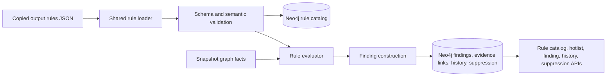

# Implementation Plan - WP012 Rule Catalog, Rule Engine, Hotlist, and Findings

## Document Control

| Field | Value |
| --- | --- |
| Work Package | WP012 - Rule Catalog, Rule Engine, Hotlist, and Findings |
| Target Output Path | `docs/012-Rule-Catalog-Rule-Engine-Hotlist-and-Findings/plan-wp012-rule-catalog-rule-engine-hotlist-and-findings.md` |
| Source Specification | `docs/012-Rule-Catalog-Rule-Engine-Hotlist-and-Findings/spec-wp012-rule-catalog-rule-engine-hotlist-and-findings.md` |
| Source Work Package | `docs/foundation/work-packages.md` WP012 |
| Mandatory Wiki Guidance | `./.github/instructions/wiki.instructions.md` |
| Mandatory Documentation-Pass Guidance | `./.github/instructions/documentation-pass.instructions.md` |
| Status | Draft |

## Planning Principles

This plan translates the WP012 specification into executable vertical work items. Each work item must preserve a runnable system state and must deliver a demonstrable capability through an API request, extraction-pipeline entry point, service entry point, or targeted test harness that exercises the slice end to end. The plan deliberately avoids building every model, every repository method, or every rule definition as isolated horizontal layers before any useful rule or finding behavior can run.

Implementation must follow these repository standards as hard completion gates:

- `./.github/instructions/wiki.instructions.md` must be followed for every work item. Wiki review is mandatory for WP012, and wiki updates are required whenever developer-facing behavior, architecture, rule authoring workflow, runtime loading, validation, persistence, query API behavior, terminology, or contributor guidance changes or is materially clarified.
- `./.github/instructions/documentation-pass.instructions.md` must be followed in full for every task that creates, updates, reviews, or plans source code. Code is not acceptable unless the documentation-pass standard is met for every touched class, method, constructor, public parameter, and non-obvious property, including internal and other non-public types.
- Every code-writing task must include developer-level comments on every class, method, and constructor. Public methods and constructors must document every parameter and every generic type parameter. Properties whose purpose is not obvious from their names must be commented. Inline or block comments must explain purpose, logical flow, validation decisions, rule evaluation flow, stable-key logic, confidence calculations, suppression propagation, and algorithms where they materially help a developer understand the code.
- Source code must follow repository coding standards: Allman braces, block-scoped namespaces, no top-level statements, one public type per file, nullable reference types, underscore-prefixed private fields, and separated `PackageReference` and `ProjectReference` `.csproj` item groups.
- Active work-item execution must be uninterrupted. Once implementation starts for a work item, the executor must continue through implementation, validation, documentation/wiki review, and plan-record updates. The executor must not stop for status-only messages, ordinary fixable build/test failures, or confirmation prompts. The only allowed stops are full work-item completion, explicit user interruption or direction change, or a true blocker that cannot be resolved from the specification, this plan, codebase evidence, or repository guidance.
- The Aspire AppHost must not be run by automated validation as a blocking process. WP012 validation must use targeted tests, fixture graph facts, application-layer seams, persistence seams, API tests, and solution builds.
- For this work package, do not run the full test suite unless explicitly requested. Run targeted WP012 tests and a solution build as final validation.
- Standalone implementation notes, implementation ledgers, architecture notes, or similar contributor-facing narrative records are prohibited. Current-state contributor guidance, design rationale, validation workflows, troubleshooting guidance, terminology, rule authoring guidance, and extension guidance must be written into `./wiki` according to `./.github/instructions/wiki.instructions.md`.
- `wiki/home.md` must remain a landing page and must not become the default destination for detailed rule-engine, hotlist, finding, suppression, or rule-authoring guidance. Detailed contributor-facing guidance must go to the correct topic page or a newly created topic page selected by the mandatory wiki information-architecture review.
- Conceptually dense wiki content about rule authoring, the detection DSL, graph-backed evaluation, copied-output runtime loading, Neo4j rule/finding persistence, confidence, unknowns, evidence, suppression, hotlist APIs, and validation workflows must use longer book-like narrative prose. Technical terms must be defined on first use or linked to glossary entries, and examples or walkthrough material must be added when they materially improve contributor understanding.

## Overall Project Structure

WP012 implementation is expected to work primarily in these areas. If the current solution uses different concrete project names, implementation must use the existing projects and responsibilities rather than creating duplicate parallel layers.

```text
rules/
  *.json

src/
  Archon.Domain/
  Archon.Application/
  Archon.RuleEngine/                       # or the existing WP001 service project selected for rule evaluation
  Archon.Infrastructure.Neo4j/
  Archon.Api.Extraction/
  Archon.Api.Query/                        # or the existing query API module
  Archon/

test/
  Archon.Domain.Tests/
  Archon.Application.Tests/
  Archon.RuleEngine.Tests/
  Archon.Infrastructure.Neo4j.Tests/
  Archon.Api.Extraction.Tests/
  Archon.Api.Query.Tests/

wiki/
  home.md
  solution-architecture.md
  graph-domain-model.md
  api-extraction-workflow.md
  persistence-foundation.md
  validation-and-test-workflows.md
  glossary.md
  rule-catalog-and-rule-engine.md          # create only if selected by wiki information-architecture review
  hotlist-and-findings.md                  # create only if selected by wiki information-architecture review
```

The plan assumes WP001 through WP011 have already provided the solution skeleton, graph domain contracts, Neo4j persistence foundation, API extraction contract, repository/project/package extraction, Roslyn semantic extraction, configuration/dependency-injection extraction, runtime extraction, data-access extraction, external integration extraction, and .NET UI/client extraction facts. If implementation discovers those prerequisites are incomplete, record the discovery and adapt the implementation sequence without bypassing Onion Architecture or inventing duplicate contracts.

## Contract Alignment Requirements

Before adding or changing contracts, each work item must verify the current compiled contracts rather than inventing a parallel model. WP012 must align with these required contract decisions from the specification:

- Rule identity is stable rule code plus rule version.
- Rule files are repository-root JSON files under `./rules`, but runtime loading must read copied output content rather than hard-coded repository-relative source paths.
- Rule categories include `Lifecycle`, `ObsoleteApi`, `LegacyTechnology`, `DataAccess`, `SecuritySensitive`, `Configuration`, `ArchitectureLayering`, `DependencyRisk`, `ModernizationBlocker`, and `OrganisationSpecific`.
- Rule statuses include `OutOfSupport`, `Obsolete`, `Legacy`, `FrameworkOnly`, `MigrationBlocker`, `SecuritySensitive`, `Discouraged`, and `Unknown`.
- Severities include `Critical`, `High`, `Medium`, `Low`, and `Info`.
- The detection DSL supports `nodeKinds`, `match`, `conditions`, and nested `groups`, with `match` values `all`, `any`, and `none`.
- Required condition kinds are `target-framework-membership`, `namespace`, `symbol`, `package`, `file-pattern`, `method-call`, `attribute`, and `metric-threshold`.
- Required operators are `Equal`, `NotEqual`, `GreaterThan`, `GreaterThanOrEqual`, `LessThan`, `LessThanOrEqual`, `In`, `NotIn`, `Contains`, `StartsWith`, `EndsWith`, and `MatchesPattern`.
- Rules are data-only JSON and must not execute shell commands, arbitrary SQL, arbitrary Cypher, network calls, filesystem mutations, or application code.
- Findings are snapshot-owned persisted records linked to the exact rule code/version, affected nodes, evidence, confidence, unknown-state context, suppression fields, first-seen/latest-seen data, metadata, stable keys, and fingerprints.
- Hotlist and rule catalog APIs expose controlled DTOs and filters; they must not expose arbitrary Cypher or unrestricted graph-query execution.
- Metadata field names must be stable lower camel case where new metadata is introduced.

If implemented contracts differ from the specification wording because existing compiled contracts already express a different approved shape, implementation must follow actual compiled contracts first, then update the plan execution record and wiki guidance with the exact current behavior.

## Work Items

## 1. Minimal Rule Catalog and Validation Slice

- [x] Work Item 1: Deliver a runnable disk-backed rule catalog validation path - Completed
  - **Purpose**: Establish the smallest meaningful WP012 vertical slice: repository JSON rule files are copied to runtime output, loaded through a shared rule loader, schema-validated, semantically validated, and exposed through a service or targeted test path with deterministic diagnostics.
  - **Acceptance Criteria**:
	- A repository-root `./rules` folder exists and contains at least one valid built-in lifecycle rule plus invalid-rule fixtures in test assets.
	- Runtime projects that need rules copy `./rules` content to build output and publish output.
	- The shared loader resolves rules from copied output content and does not depend on hard-coded repository source paths.
	- JSON parse failures, missing folders, unreadable files, duplicate rule code/version combinations, invalid enum values, invalid versions, empty detection groups, unsupported condition kinds, unsupported operators, and condition/operator compatibility errors produce deterministic diagnostics.
	- Disabled rules load and validate but are marked unavailable for evaluation.
	- Invalid built-in rules fail startup or extraction initialization visibly rather than being silently ignored.
  - **Definition of Done**:
	- Rule contracts, validation diagnostics, JSON schema or schema-equivalent validation, semantic validation, disk loading, copy-to-output configuration, and targeted tests are implemented.
	- Logging and ordinary error handling are added for rule folder resolution, file discovery, parse failures, validation failures, and duplicate detection.
	- Source code complies with `./.github/instructions/documentation-pass.instructions.md` in full, including comments for every class, method, constructor, public parameter, non-obvious property, and internal/non-public implementation type touched by this slice.
	- Wiki review is performed for rule catalog, rule file, rule schema, validation diagnostic, copied-output runtime loading, disabled rule, and built-in rule terminology; relevant wiki or repository guidance is updated, or an explicit no-change result is recorded.
	- Foundational documentation uses book-like narrative depth for rule authoring, validation, copied-output loading, and deterministic diagnostics; technical terms are defined on first use or linked to glossary entries, and examples are included where they materially help rule authors.
	- Can execute end to end via targeted rule-loader and validation tests.
	- Executor must not stop mid-work-item unless the work item is complete, the user explicitly interrupts, or a true blocker prevents further autonomous progress.
	- [x] Task 1: Inspect current solution and contract seams - Completed
	- [x] Step 1: Located current Domain, Application, extraction, persistence, query API, project-file, and test patterns.
	- [x] Step 2: Confirmed no dedicated rule engine service project exists; implemented the minimal validation slice in `Archon.Application` without introducing a parallel service project.
	- [x] Step 3: Confirmed current JSON, options-style, logging, controlled-value, and xUnit fixture conventions.
	- [x] Step 4: Documented touched source contracts and implementation code according to `./.github/instructions/documentation-pass.instructions.md`.
  - [x] Task 2: Add rule contract models and canonical value objects - Completed
	- [x] Step 1: Added rule code, version, category, severity, WP012 default status, enabled state, owner scope, source URL, impact, evidence requirement, metadata, built-in flag, and source-file contract fields in the Application layer.
	- [x] Step 2: Added detection DSL models for node kinds, `match`, conditions, and nested groups.
	- [x] Step 3: Added condition-kind, operator, match, and WP012 rule-status controlled values without introducing infrastructure dependencies into Domain or Application.
	- [x] Step 4: Added targeted loader tests that prove the contract shape through runtime JSON loading and validation behavior.
  - [x] Task 3: Implement disk rule loading and validation - Completed
	- [x] Step 1: Implemented copied-output rule folder resolution through `RuleCatalogOptions`, defaulting to `AppContext.BaseDirectory/rules` rather than repository-relative source paths.
	- [x] Step 2: Implemented deterministic JSON parsing diagnostics with file path and line/byte context where available.
	- [x] Step 3: Implemented schema-equivalent and semantic validation for required fields, controlled values, version format, duplicate rule code/version pairs, detection shape, condition payloads, and operator compatibility.
	- [x] Step 4: Implemented validation aggregation for practical simple errors in a file.
	- [x] Step 5: Ensured disabled rules load and validate but are marked unavailable for evaluation.
  - [x] Task 4: Add first built-in rule and copied-output configuration - Completed
	- [x] Step 1: Created the repository-root `./rules` folder.
	- [x] Step 2: Added `rules/archon.lifecycle.net-framework-unsupported.json` as the first valid built-in lifecycle rule for unsupported .NET Framework target frameworks.
	- [x] Step 3: Configured `src/Archon.Application/Archon.Application.csproj` and `test/Archon.Application.Tests/Archon.Application.Tests.csproj` to copy rule content to build and publish output without mixing package and project reference item groups.
	- [x] Step 4: Added tests proving runtime loading uses copied output content.
  - [x] Task 5: Add targeted tests and validation - Completed
	- [x] Step 1: Added tests for valid rule loading, invalid JSON, aggregate required/enum/version/node/match/condition/operator diagnostics, duplicate identity, empty group, disabled rule availability, missing folder diagnostics, copied-output loading, and fail-fast invalid built-in validation.
	- [x] Step 2: Ran `dotnet test .\test\Archon.Application.Tests\Archon.Application.Tests.csproj --filter FullyQualifiedName~RuleCatalogLoaderTests`; result: 9 tests passed.
	- [x] Step 3: Ran `dotnet build .\Archon.slnx --no-restore`; result: build succeeded. Re-ran the same build after wiki updates; result: build succeeded.
  - [x] Task 6: Perform documentation and wiki review for the slice - Completed
	- [x] Step 1: Reviewed `wiki/home.md`, `wiki/solution-architecture.md`, `wiki/api-extraction-workflow.md`, `wiki/validation-and-test-workflows.md`, `wiki/glossary.md`, and current wiki page structure.
	- [x] Step 2: Created the dedicated `wiki/rule-catalog-and-rule-engine.md` topic page because rule authoring, copied-output runtime loading, validation diagnostics, disabled rules, and built-in rule terminology were too specific and dense for existing overview pages or the landing page.
	- [x] Step 3: Recorded the wiki review result with page-structure decision and impact matrix below.

  - **Completion Summary**:
	- Implemented the minimal disk-backed WP012 rule catalog validation slice in `src/Archon.Application/Rules/**` with documented contracts, controlled values, loader options, deterministic diagnostics, fail-fast invalid catalog exception, copied-output folder resolution, JSON parsing, schema-equivalent validation, semantic validation, duplicate detection, disabled rule availability, and logging.
	- Added `rules/archon.lifecycle.net-framework-unsupported.json` as the first built-in lifecycle rule and configured rule JSON copy-to-output/copy-to-publish behavior for the application and targeted test project.
	- Added `test/Archon.Application.Tests/Rules/RuleCatalogLoaderTests.cs` covering valid copied-output loading, disabled rules, missing folder diagnostics, invalid JSON diagnostics, aggregate validation errors, empty detection groups, duplicate identities, and fail-fast invalid built-in catalog behavior.
	- Validation performed: `dotnet test .\test\Archon.Application.Tests\Archon.Application.Tests.csproj --filter FullyQualifiedName~RuleCatalogLoaderTests` passed with 9/9 tests; `dotnet build .\Archon.slnx --no-restore` passed before and after wiki updates.
	- Wiki review result: created `wiki/rule-catalog-and-rule-engine.md`, updated `wiki/home.md`, updated `wiki/validation-and-test-workflows.md`, and updated `wiki/glossary.md`; no standalone implementation notes or substitute artifacts were created.

  - **Wiki Impact Matrix**:

	| Item | Result |
	| --- | --- |
	| Affected concepts | Rule catalog authoring, copied-output runtime loading, rule identity, schema-equivalent validation, deterministic diagnostics, disabled rule availability, built-in rule fail-fast behavior, and WP012 targeted validation workflow. |
	| Pages reviewed | `wiki/home.md`, `wiki/solution-architecture.md`, `wiki/api-extraction-workflow.md`, `wiki/validation-and-test-workflows.md`, `wiki/glossary.md`, and overall wiki page structure. |
	| Pages updated | `wiki/home.md`, `wiki/validation-and-test-workflows.md`, and `wiki/glossary.md`. |
	| Pages created | `wiki/rule-catalog-and-rule-engine.md`. |
	| Pages retired or renamed | None. |
	| Pages intentionally unchanged | `wiki/solution-architecture.md` remained sufficient because project layering did not change; `wiki/api-extraction-workflow.md` remained sufficient because this slice does not yet integrate rule evaluation into API extraction orchestration or expose query endpoints. |
	| Structure decision | A dedicated rule catalog/rule engine topic page was created because rule authoring, copied-output loading, DSL validation, deterministic diagnostics, and current/future WP012 boundaries are dense contributor-facing concepts that do not belong in `wiki/home.md` and would mix unrelated concerns into existing architecture or API workflow pages. `wiki/home.md` remained a concise landing page with only a reader-path link and current summary. |
  - **Files**:
	- `rules/*.json`: Authored built-in rule definitions.
	- `src/Archon.Domain/**`: Rule category, severity, status, condition kind, operator, and stable value objects if owned by Domain.
	- `src/Archon.Application/**`: Rule DTOs, loader abstractions, validation diagnostics, and service ports.
	- `src/Archon.RuleEngine/**`: Disk loader and validation implementation, or equivalent existing service project.
	- `src/**/*.csproj`: Copy-to-output and copy-to-publish rule content configuration where required.
	- `test/**`: Targeted rule contract, loader, copied-output, and validation tests.
	- `wiki/**`: Topic pages selected by mandatory wiki review.
  - **Work Item Dependencies**: WP001 solution foundation and current Domain/Application project structure.
  - **Run / Verification Instructions**:
	- `dotnet test .\test\Archon.RuleEngine.Tests\Archon.RuleEngine.Tests.csproj --filter RuleCatalog`
	- `dotnet test .\test\Archon.Application.Tests\Archon.Application.Tests.csproj --filter Rule`
	- `dotnet build .\Archon.slnx --no-restore`
  - **User Instructions**: None expected unless package restore or the required .NET SDK is unavailable.

## 2. Boolean DSL Evaluation Slice

- [x] Work Item 2: Evaluate enabled rules against fixture graph facts - Completed
  - **Purpose**: Turn validated rule definitions into executable deterministic predicates over graph-fact fixtures, proving `nodeKinds`, condition evaluation, and nested boolean groups before persistence is introduced.
  - **Acceptance Criteria**:
	- Enabled rules are selected from the loaded catalog and disabled rules are skipped.
	- Candidate facts are restricted by `nodeKinds` before conditions are evaluated.
	- `match: all`, `match: any`, `match: none`, combined `conditions` and `groups`, and recursive nested groups evaluate according to the specification.
	- Required condition kinds evaluate against fixture graph facts: target framework, namespace, symbol, package, file pattern, method call, attribute, and metric threshold.
	- Required operators evaluate deterministically using ordinal or documented normalized comparisons.
	- Evaluation returns matched rule context, affected nodes, matched evidence references, confidence input data, unknown-state context, warnings, and deterministic ordering.
	- Rule evaluation does not execute arbitrary code, shell commands, arbitrary SQL, arbitrary Cypher, network calls, filesystem mutations, or application code.
  - **Definition of Done**:
	- Rule evaluator contracts, fixture graph-fact access seams, condition evaluators, operator evaluators, nested group evaluator, warning/unknown handling, and targeted tests are implemented.
	- Source code complies with `./.github/instructions/documentation-pass.instructions.md` in full for every touched class, method, constructor, parameter, property, internal type, and non-public member requiring explanation.
	- Wiki review is performed for detection DSL, condition, operator, nested group, candidate node, graph fact, confidence input, unknown-state, and deterministic evaluation terminology; relevant wiki or repository guidance is updated, or an explicit no-change result is recorded.
	- Can execute end to end via targeted evaluator tests that load a copied-output rule file and evaluate it against fixture graph facts.
	- Executor must not stop mid-work-item unless the work item is complete, the user explicitly interrupts, or a true blocker prevents further autonomous progress.
	- [x] Task 1: Align evaluator input contracts with existing graph facts - Completed
	- [x] Step 1: Inspected existing `ExtractedArchitectureSnapshot`, domain node/evidence/metric/unknown contracts, and Work Item 1 rule catalog contracts.
	- [x] Step 2: Added application-layer evaluator input abstractions in `Archon.Application.Rules` so tests can evaluate rules without Neo4j, API hosts, or AppHost startup.
	- [x] Step 3: Preserved affected node keys, matched evidence references, evidence stable keys, confidence input data, metric facts, warnings, and explicit unknown-state context in evaluator results.
  - [x] Task 2: Implement boolean group evaluation - Completed
	- [x] Step 1: Implemented operand collection for direct conditions and nested groups at each detection level.
	- [x] Step 2: Implemented recursive `all`, `any`, and `none` semantics for combined `conditions` and `groups`.
	- [x] Step 3: Preserved deterministic ordering for enabled rules, candidate nodes, matched results, warnings, unknown states, evidence references, and affected nodes.
  - [x] Task 3: Implement required condition evaluators - Completed
	- [x] Step 1: Implemented target-framework membership evaluation against fixture target framework facts.
	- [x] Step 2: Implemented namespace and symbol evaluation against fixture semantic fact collections.
	- [x] Step 3: Implemented package and file-pattern evaluation against fixture package and file-path facts.
	- [x] Step 4: Implemented method-call and attribute evaluation against fixture Roslyn-semantic-style fact collections.
	- [x] Step 5: Implemented metric-threshold evaluation against fixture numeric metric facts.
	- [x] Step 6: Preserved explicit unknown context and partial-evaluation warnings when expected upstream facts or metrics are unavailable.
  - [x] Task 4: Implement operator behavior and safeguards - Completed
	- [x] Step 1: Implemented equality, inequality, membership, string containment, prefix, suffix, decimal numeric comparison, and wildcard pattern matching.
	- [x] Step 2: Documented ordinal string comparison, decimal metric comparison, and bounded wildcard behavior in source comments and wiki guidance.
	- [x] Step 3: Added safeguards for nested group depth and broad/expensive authored patterns by using a maximum pattern length, escaped wildcard-to-regex conversion, culture-invariant matching, and a short regex timeout.
  - [x] Task 5: Add targeted tests and validation - Completed
	- [x] Step 1: Added `RuleEvaluatorTests` coverage for `all`, `any`, `none`, mixed conditions/groups, nested groups, every condition kind, every operator, deterministic ordering, unknown context, disabled rules, and partial-evaluation warnings.
	- [x] Step 2: Added data-only security coverage proving executable-looking rule values are treated as literal comparison data and do not trigger arbitrary execution.
	- [x] Step 3: Ran targeted evaluator tests and a solution build successfully.
  - [x] Task 6: Perform documentation and wiki review for the slice - Completed
	- [x] Step 1: Updated `wiki/rule-catalog-and-rule-engine.md` with current evaluator behavior, condition/operator semantics, safeguards, unknown/warning handling, and data-only rule execution boundaries.
	- [x] Step 2: Added a nested `all`/`any`/`none` JSON example to the selected wiki topic page.
	- [x] Step 3: Recorded the wiki review result and page-structure decision below.

  - **Completion Summary**:
	- Implemented the WP012 boolean DSL evaluation slice in `src/Archon.Application/Rules/**` with documented evaluator contracts, fixture graph-fact input seams, enabled-rule filtering, candidate node-kind restriction, recursive group evaluation, condition evaluators, operator evaluators, deterministic ordering, evidence references, confidence inputs, unknown-state context, warning output, and data-only safeguards.
	- Added `test/Archon.Application.Tests/Rules/RuleEvaluatorTests.cs` covering copied-output rule loading into evaluation, disabled-rule skipping, node-kind candidate filtering, nested boolean semantics, every required condition kind, every supported operator, deterministic result ordering, unknown context, partial warnings, and executable-looking literal values.
	- Validation performed: `dotnet test .\test\Archon.Application.Tests\Archon.Application.Tests.csproj --filter FullyQualifiedName~RuleEvaluatorTests` passed with 6/6 tests; workspace solution build passed before wiki/plan updates.
	- Wiki review result: updated `wiki/rule-catalog-and-rule-engine.md`, `wiki/validation-and-test-workflows.md`, and `wiki/glossary.md`; no standalone implementation notes or substitute artifacts were created.

  - **Wiki Impact Matrix**:

	| Item | Result |
	| --- | --- |
	| Affected concepts | Detection DSL evaluation, candidate node filtering, condition-kind mapping, operator comparison behavior, nested boolean groups, matched evidence references, confidence input data, unknown-state preservation, partial-evaluation warnings, deterministic ordering, and data-only rule execution safeguards. |
	| Pages reviewed | `wiki/rule-catalog-and-rule-engine.md`, `wiki/validation-and-test-workflows.md`, `wiki/glossary.md`, and overall wiki page structure. |
	| Pages updated | `wiki/rule-catalog-and-rule-engine.md`, `wiki/validation-and-test-workflows.md`, and `wiki/glossary.md`. |
	| Pages created | None. |
	| Pages retired or renamed | None. |
	| Pages intentionally unchanged | `wiki/home.md` remained a concise landing page because the existing rule catalog reader path was still correct; `wiki/solution-architecture.md` remained sufficient because the evaluator stayed in the existing Application layer and did not alter Onion Architecture boundaries; API workflow pages remained unchanged because no API or extraction orchestration endpoint was added in this slice. |
	| Structure decision | The existing dedicated `wiki/rule-catalog-and-rule-engine.md` page was the correct home because Work Item 2 deepens the rule DSL and evaluator topic created in Work Item 1. No new page was needed; evaluator validation belongs as an update to the WP012 section of `wiki/validation-and-test-workflows.md`, and concise terminology additions belonged in `wiki/glossary.md`. `wiki/home.md` stayed a landing page and did not receive detailed evaluator content. |
  - **Files**:
	- `src/Archon.Application/**`: Evaluator ports and result contracts.
	- `src/Archon.RuleEngine/**`: Boolean group, condition, operator, confidence-input, unknown, and warning evaluation implementation if a future dedicated project is introduced; this slice used the existing `Archon.Application` project rather than creating a parallel service project.
	- `test/Archon.Application.Tests/**`: DSL, condition, operator, unknown, warning, and security tests.
	- `wiki/**`: Rule DSL and evaluation guidance selected by wiki review.
  - **Work Item Dependencies**: Work Item 1.
  - **Run / Verification Instructions**:
	- `dotnet test .\test\Archon.Application.Tests\Archon.Application.Tests.csproj --filter FullyQualifiedName~RuleEvaluatorTests`
	- `dotnet build .\Archon.slnx --no-restore`
  - **User Instructions**: None expected.

## 3. Rule Catalog Persistence and Extraction Integration Slice

- [x] Work Item 3: Persist validated rules and run evaluation from the extraction pipeline - Completed
  - **Purpose**: Connect the validated rule catalog and evaluator to the runtime extraction path so loaded rules are upserted into Neo4j by code/version and enabled rules are evaluated after required snapshot facts are available.
  - **Acceptance Criteria**:
	- Validated rules are upserted as Neo4j rule catalog records keyed by rule code and version.
	- Persisted rule records include rule code, name, category, severity, default status, enabled flag, version, description, definition JSON, source URLs, built-in status, owner scope, and metadata.
	- Loading a new version of an existing rule code preserves historical versions.
	- Disabling or removing a rule from disk does not destructively delete historical persisted rules or findings.
	- API extraction initialization or orchestration loads rules from copied output content, persists the catalog, selects enabled rules, and invokes evaluation after required facts are available.
	- Rule-specific failures surface diagnostics while independent rules continue when safe.
	- No core rule-evaluation logic is placed in host or API composition code.
  - **Definition of Done**:
	- Persistence ports, Neo4j implementation, Cypher queries, extraction-stage integration, idempotency behavior, diagnostics, logging, and targeted persistence/integration tests are implemented.
	- Source code complies with `./.github/instructions/documentation-pass.instructions.md` in full.
	- Wiki review is performed for rule catalog persistence, Neo4j identity, definition JSON, versioning, copied-output loading in extraction, orchestration sequence, idempotency, and diagnostics; relevant wiki or repository guidance is updated, or an explicit no-change result is recorded.
	- Can execute end to end through a targeted extraction integration test that loads rules, upserts the catalog, and evaluates at least one enabled rule over fixture snapshot facts.
	- Executor must not stop mid-work-item unless the work item is complete, the user explicitly interrupts, or a true blocker prevents further autonomous progress.
	- [x] Task 1: Add rule catalog persistence contracts - Completed
	- [x] Step 1: Added `IRuleCatalogStore`, `RuleCatalogUpsertResult`, and deterministic query/upsert contracts in `Archon.Application.Rules`.
	- [x] Step 2: Kept Application contracts infrastructure-agnostic and stable for future API/MCP consumers by depending only on rule catalog entries and safe diagnostics.
	- [x] Step 3: Added `InMemoryRuleCatalogStore` as the test/default adapter for extraction and evaluator integration tests.
  - [x] Task 2: Implement Neo4j rule catalog persistence - Completed
	- [x] Step 1: Added `Neo4jRuleCatalogStore` upsert behavior keyed by `ruleCode` and `ruleVersion`.
	- [x] Step 2: Persisted definition JSON, rule code, name, category, severity, mapped default status, enabled flag, version, description, source URLs, built-in status, owner scope, and metadata through existing Neo4j mapping conventions.
	- [x] Step 3: Added idempotency and version-coexistence coverage through targeted Neo4j rule catalog tests.
	- [x] Step 4: Added coverage proving disabled rules and rules removed from later disk loads are not destructively deleted.
  - [x] Task 3: Integrate rule loading and evaluation with extraction - Completed
	- [x] Step 1: Added `RuleExtractionIntegrationService` and `RuleEvaluationExtractionStage` as the extraction entry path for copied-output rule loading before evaluation.
	- [x] Step 2: Registered the WP012 stage after WP011 so project, semantic, package, runtime, data-access, external-integration, and UI/client facts are available before rule evaluation.
	- [x] Step 3: Surfaced invalid catalog failures as controlled blocking stage diagnostics and surfaced persistence/evaluation warnings through extraction warnings.
	- [x] Step 4: Added cancellation-token flow through loading, persistence, projection, and evaluation.
  - [x] Task 4: Add targeted tests and validation - Completed
	- [x] Step 1: Added persistence tests for upsert Cypher, DI registration, idempotency, version coexistence, disabled persistence, and non-destructive removed-on-disk behavior.
	- [x] Step 2: Added extraction integration tests for the load-upsert-evaluate sequence, version coexistence, and non-destructive catalog history.
	- [x] Step 3: Ran targeted Application, Neo4j, API extraction tests, and a solution build successfully.
  - [x] Task 5: Perform documentation and wiki review for the slice - Completed
	- [x] Step 1: Updated selected wiki pages with current-state rule catalog persistence and extraction orchestration guidance.
	- [x] Step 2: Defined or linked technical terms including upsert, definition JSON, historical fidelity, rule version, versioned catalog identity, and copied-output extraction loading.
	- [x] Step 3: Recorded the wiki review result and page-structure decision below.

  - **Completion Summary**:
	- Implemented WP012 rule catalog persistence and extraction integration across `src/Archon.Application/Rules/**`, `src/Archon.Infrastructure.Neo4j/Persistence/Neo4jRuleCatalogStore.cs`, `src/Archon.Infrastructure.Neo4j/DependencyInjection/Neo4jServiceCollectionExtensions.cs`, and `src/Archon.Api.Extraction/ExtractionApiServiceCollectionExtensions.cs`.
	- Added application persistence ports, in-memory test/default store, rule entry-to-domain mapping, extraction integration service, rule evaluation extraction stage, Neo4j upsert behavior keyed by rule code/version, and API pipeline registration after WP011.
	- Added targeted tests in `test/Archon.Application.Tests/Rules/RuleExtractionIntegrationServiceTests.cs`, `test/Archon.Infrastructure.Neo4j.Tests/Persistence/Neo4jRuleCatalogStoreTests.cs`, `test/Archon.Infrastructure.Neo4j.Tests/Persistence/Neo4jRuleCatalogStoreIntegrationTests.cs`, Neo4j DI tests, and extraction API stage composition tests.
	- Validation performed: `dotnet test .\test\Archon.Application.Tests\Archon.Application.Tests.csproj --filter FullyQualifiedName~RuleExtractionIntegrationServiceTests` passed with 3/3 tests; `dotnet test .\test\Archon.Infrastructure.Neo4j.Tests\Archon.Infrastructure.Neo4j.Tests.csproj --filter RuleCatalog` passed with 3/3 tests including Testcontainers integration; `dotnet test .\test\Archon.Api.Extraction.Tests\Archon.Api.Extraction.Tests.csproj --filter "FullyQualifiedName~AddArchonExtractionApi|FullyQualifiedName~RuleEvaluation"` passed with 1/1 test; workspace solution build passed.
	- Wiki review result: updated `wiki/rule-catalog-and-rule-engine.md`, `wiki/validation-and-test-workflows.md`, `wiki/neo4j-persistence-foundation.md`, `wiki/api-extraction-workflow.md`, `wiki/glossary.md`, and concise reader-path/current-summary text in `wiki/home.md`; no standalone implementation notes or substitute artifacts were created.

  - **Wiki Impact Matrix**:

	| Item | Result |
	| --- | --- |
	| Affected concepts | Rule catalog persistence, Neo4j code/version identity, definition JSON, non-destructive catalog history, disabled rule persistence, removed-on-disk behavior, extraction-stage copied-output loading, load-upsert-evaluate sequence, partial evaluation diagnostics, and WP012 targeted validation workflow. |
	| Pages reviewed | `wiki/rule-catalog-and-rule-engine.md`, `wiki/validation-and-test-workflows.md`, `wiki/neo4j-persistence-foundation.md`, `wiki/api-extraction-workflow.md`, `wiki/glossary.md`, `wiki/home.md`, and overall wiki page structure. |
	| Pages updated | `wiki/rule-catalog-and-rule-engine.md`, `wiki/validation-and-test-workflows.md`, `wiki/neo4j-persistence-foundation.md`, `wiki/api-extraction-workflow.md`, `wiki/glossary.md`, and concise summary/reader-path text in `wiki/home.md`. |
	| Pages created | None. |
	| Pages retired or renamed | None. |
	| Pages intentionally unchanged | `wiki/solution-architecture.md` remained sufficient because Onion Architecture boundaries did not change; no API query or hotlist topic page was created because Work Item 3 does not expose product query endpoints or persisted findings. |
	| Structure decision | Existing topic pages were the correct homes: rule authoring/evaluation guidance stayed in `rule-catalog-and-rule-engine.md`, durable Neo4j identity and upsert behavior stayed in `neo4j-persistence-foundation.md`, pipeline sequence stayed in `api-extraction-workflow.md`, commands stayed in `validation-and-test-workflows.md`, and terminology stayed in `glossary.md`. `wiki/home.md` remained a concise landing page and received only reader-path/current-summary updates, not detailed rule-engine or persistence guidance. |
  - **Files**:
	- `src/Archon.Application/**`: Rule catalog persistence ports and service contracts.
	- `src/Archon.Infrastructure.Neo4j/**`: Neo4j rule catalog persistence implementation.
	- `src/Archon.Api.Extraction/**`: Extraction orchestration integration.
	- `test/Archon.Infrastructure.Neo4j.Tests/**`: Rule catalog persistence tests.
	- `test/Archon.Api.Extraction.Tests/**`: Load-upsert-evaluate integration tests.
	- `wiki/**`: Persistence and extraction workflow guidance selected by wiki review.
  - **Work Item Dependencies**: Work Items 1 and 2.
  - **Run / Verification Instructions**:
	- `dotnet test .\test\Archon.Infrastructure.Neo4j.Tests\Archon.Infrastructure.Neo4j.Tests.csproj --filter RuleCatalog`
	- `dotnet test .\test\Archon.Api.Extraction.Tests\Archon.Api.Extraction.Tests.csproj --filter RuleEvaluation`
	- `dotnet build .\Archon.slnx --no-restore`
  - **User Instructions**: Ensure any existing targeted Neo4j test prerequisites used by the repository are available; do not introduce new external secrets.

## 4. Finding Creation, History, and Suppression Slice

- [x] Work Item 4: Persist deterministic findings with history and suppression behavior - Completed
  - **Purpose**: Convert satisfied rule evaluations into persisted findings linked to snapshots, rules, affected nodes, evidence, confidence, unknown context, fingerprints, and suppression fields, with first-seen/latest-seen history across snapshots.
  - **Acceptance Criteria**:
	- Satisfied rules produce findings unless an equivalent finding already exists for the snapshot.
	- Findings include snapshot identity, deterministic stable key, rule code, rule version, severity, status, title, description, knowledge kind, confidence, primary node, primary evidence, first-seen snapshot, latest-seen snapshot, suppression fields, metadata, and fingerprint.
	- Findings link to one or more affected architecture nodes and one or more evidence records where applicable.
	- Finding severity and status default from the evaluated rule unless deterministic rule payload or suppression behavior overrides them.
	- Confidence is derived from rule confidence, matched evidence confidence, matched fact confidence, and unknown-state context.
	- Finding stable keys and fingerprints are deterministic and do not depend on Neo4j internal IDs or absolute machine paths.
	- Finding history identifies persisted findings across snapshots and updates first-seen/latest-seen data.
	- Suppression records reason and suppressed-by identity where supplied, preserves rule and affected-node identity, is queryable, and does not delete the underlying finding.
  - **Definition of Done**:
	- Finding contracts, stable-key/fingerprint strategy, confidence derivation, persistence ports, Neo4j implementation, suppression API/application seam, history lookup, logging, diagnostics, and targeted tests are implemented.
	- Source code complies with `./.github/instructions/documentation-pass.instructions.md` in full.
	- Wiki review is performed for finding, stable key, fingerprint, affected node, evidence link, confidence, unknown, suppression, first-seen, latest-seen, and historical fidelity terminology; relevant wiki or repository guidance is updated, or an explicit no-change result is recorded.
	- Can execute end to end through targeted tests that evaluate a rule, persist a finding, suppress it, and query its history across fixture snapshots.
	- Executor must not stop mid-work-item unless the work item is complete, the user explicitly interrupts, or a true blocker prevents further autonomous progress.
	- [x] Task 1: Add finding contracts and construction logic - Completed
	- [x] Step 1: Extended finding records and added application contracts for stable key, fingerprint, severity, status, title, description, knowledge kind, confidence, metadata, evidence links, node links, suppression fields, first-seen, latest-seen, and history identity.
	- [x] Step 2: Implemented deterministic stable-key and history-key construction from rule identity, affected node stable keys, matched evidence references, and normalized target identity.
	- [x] Step 3: Implemented fingerprint construction from normalized finding content and deterministic metadata.
	- [x] Step 4: Implemented confidence derivation from rule confidence, fact confidence, and unknown-state context while preserving unknown reasons.
  - [x] Task 2: Add finding persistence and history - Completed
	- [x] Step 1: Added `IFindingStore`, `FindingUpsertResult`, `SuppressionPersistenceResult`, history lookup, detail retrieval, and in-memory persistence contracts in `Archon.Application.Rules`.
	- [x] Step 2: Implemented `Neo4jFindingStore` with snapshot-scoped finding upsert and rule, node, and evidence relationships using stable logical identities.
	- [x] Step 3: Implemented first-seen/latest-seen resolution through finding history keys without using Neo4j internal IDs.
	- [x] Step 4: Preserved historical records when finding content, snapshot scope, or rule version changes by using snapshot-scoped stable keys and cross-snapshot history keys.
  - [x] Task 3: Add suppression behavior - Completed
	- [x] Step 1: Added suppression request validation for required history key, rule identity, primary node, reason, and suppressed-by fields.
	- [x] Step 2: Persisted suppression reason, actor, rule identity, affected node identity, status, and metadata without deleting findings.
	- [x] Step 3: Applied deterministic suppression behavior across later snapshots when the same finding history key remains applicable.
	- [x] Step 4: Added the application suppression seam and finding-store persistence seam; no query API endpoint was added because the current query API has no host security model or endpoint surface for this slice.
  - [x] Task 4: Add targeted tests and validation - Completed
	- [x] Step 1: Added tests for finding creation, stable keys, fingerprints, deduplication, evidence links, node links, metadata, confidence, unknowns, history, suppression, and in-memory persistence.
	- [x] Step 2: Added tests proving historical fidelity across snapshots and suppression carry-forward for equivalent findings.
	- [x] Step 3: Ran targeted finding, persistence, suppression, history, and Neo4j tests successfully, then ran a solution build successfully.
  - [x] Task 5: Perform documentation and wiki review for the slice - Completed
	- [x] Step 1: Updated selected wiki pages with current-state finding lifecycle, confidence, unknown, evidence, suppression, persistence, and history guidance.
	- [x] Step 2: Added explanatory walkthrough-style prose for findings that persist across snapshots and suppressed findings where it improves understanding.
	- [x] Step 3: Recorded the wiki review result and page-structure decision below.

  - **Completion Summary**:
	- Implemented WP012 finding construction, history, suppression, and persistence seams across `src/Archon.Domain/Graph/Model/FindingRecord.cs`, `src/Archon.Application/Rules/**`, `src/Archon.Infrastructure.Neo4j/Persistence/Neo4jFindingStore.cs`, `src/Archon.Infrastructure.Neo4j/Persistence/Neo4jSnapshotPersistenceMapper.cs`, and `src/Archon.Infrastructure.Neo4j/DependencyInjection/Neo4jServiceCollectionExtensions.cs`.
	- Added deterministic finding construction from rule evaluation matches, snapshot-scoped finding stable keys, cross-snapshot finding history keys, fingerprints, affected-node and evidence links, confidence derivation, unknown-state preservation, first-seen/latest-seen behavior, application finding-store ports, in-memory finding persistence, Neo4j finding persistence, and suppression carry-forward without deleting findings.
	- Added targeted tests in `test/Archon.Application.Tests/Rules/FindingConstructionServiceTests.cs`, extended existing Domain/Application/Neo4j fixtures for new finding link/history fields, and added Neo4j tests for finding Cypher and DI registration.
	- Validation performed: `dotnet test .\test\Archon.Application.Tests\Archon.Application.Tests.csproj --filter FullyQualifiedName~FindingConstructionServiceTests --no-restore` passed with 6/6 tests; `dotnet test .\test\Archon.Infrastructure.Neo4j.Tests\Archon.Infrastructure.Neo4j.Tests.csproj --filter "FullyQualifiedName~Neo4jRuleCatalogStoreTests|FullyQualifiedName~Neo4jServiceCollectionExtensionsTests" --no-restore` passed with 5/5 tests; workspace solution build passed.
	- Wiki review result: updated `wiki/rule-catalog-and-rule-engine.md`, `wiki/neo4j-persistence-foundation.md`, `wiki/validation-and-test-workflows.md`, `wiki/glossary.md`, and concise reader-path/current-summary text in `wiki/home.md`; no standalone implementation notes or substitute artifacts were created.

  - **Wiki Impact Matrix**:

	| Item | Result |
	| --- | --- |
	| Affected concepts | Finding stable keys, finding history keys, fingerprints, affected-node links, evidence links, confidence derivation, unknown-state preservation, first-seen/latest-seen history, suppression validation, suppression carry-forward, non-destructive finding persistence, and Neo4j finding relationships. |
	| Pages reviewed | `wiki/rule-catalog-and-rule-engine.md`, `wiki/neo4j-persistence-foundation.md`, `wiki/validation-and-test-workflows.md`, `wiki/glossary.md`, `wiki/home.md`, and overall wiki page structure. |
	| Pages updated | `wiki/rule-catalog-and-rule-engine.md`, `wiki/neo4j-persistence-foundation.md`, `wiki/validation-and-test-workflows.md`, `wiki/glossary.md`, and concise summary/reader-path text in `wiki/home.md`. |
	| Pages created | None. |
	| Pages retired or renamed | None. |
	| Pages intentionally unchanged | `wiki/solution-architecture.md` remained sufficient because Onion Architecture boundaries did not change; `wiki/api-extraction-workflow.md` remained sufficient because this slice adds finding persistence seams but no new extraction route behavior or query endpoint surface; no new hotlist/query topic page was created because Work Item 5 owns product query APIs. |
	| Structure decision | Existing topic pages were the correct homes: rule/evaluator/finding-construction guidance belongs in `rule-catalog-and-rule-engine.md`, durable Neo4j finding identity and relationships belong in `neo4j-persistence-foundation.md`, commands belong in `validation-and-test-workflows.md`, and terms belong in `glossary.md`. `wiki/home.md` remained a concise landing page and received only reader-path/current-summary updates, not detailed finding or suppression guidance. |
  - **Files**:
	- `src/Archon.Application/**`: Finding contracts, persistence ports, suppression request/response contracts.
	- `src/Archon.RuleEngine/**`: Finding construction, stable-key/fingerprint, confidence, unknown handling.
	- `src/Archon.Infrastructure.Neo4j/**`: Finding, history, and suppression persistence.
	- `src/Archon.Api.Query/**`: Suppression seam or endpoint if the existing host security model supports it.
	- `test/**`: Finding, history, persistence, and suppression tests.
	- `wiki/**`: Finding and suppression guidance selected by wiki review.
  - **Work Item Dependencies**: Work Items 1, 2, and 3.
  - **Run / Verification Instructions**:
	- `dotnet test .\test\Archon.RuleEngine.Tests\Archon.RuleEngine.Tests.csproj --filter Finding`
	- `dotnet test .\test\Archon.Infrastructure.Neo4j.Tests\Archon.Infrastructure.Neo4j.Tests.csproj --filter Finding`
	- `dotnet test .\test\Archon.Api.Query.Tests\Archon.Api.Query.Tests.csproj --filter Suppression`
	- `dotnet build .\Archon.slnx --no-restore`
  - **User Instructions**: None expected beyond existing targeted persistence-test prerequisites.

## 5. Hotlist and Rule Query API Slice

- [x] Work Item 5: Expose controlled rule catalog, hotlist, finding detail, history, and suppression APIs - Completed
  - **Purpose**: Provide the minimum WP012 product surface for API and future MCP consumers to query the persisted rule catalog and findings without unrestricted graph access.
  - **Acceptance Criteria**:
	- Rule catalog list API supports filtering by code, version, category, severity, enabled status, built-in status, and owner scope where supported by persisted data.
	- Rule detail API retrieves one rule by code and version and returns stable DTOs suitable for later MCP consumption.
	- Hotlist API lists persisted findings filtered by snapshot, category, severity, status, project, or affected node where available.
	- Hotlist API includes rule code/version, title, summary, severity, status, confidence, category, affected node display information, evidence references, unknown-state information, paging, and deterministic ordering.
	- Finding detail API retrieves a finding by stable key or identifier and returns evidence references without requiring consumers to query Neo4j directly.
	- Finding history API returns first-seen/latest-seen and historical finding records where supported by persisted data.
	- Suppression API or application seam validates requests and persists suppression when in scope for the host security model.
	- APIs do not expose arbitrary Cypher, unrestricted graph-query execution, or secret-like evidence snippets/metadata.
  - **Definition of Done**:
	- Query DTOs, query services, endpoints, validation, response-size limits, pagination, deterministic ordering, redaction safeguards, logging, error responses, and targeted API tests are implemented.
	- Source code complies with `./.github/instructions/documentation-pass.instructions.md` in full.
	- Wiki review is performed for rule catalog API, hotlist API, finding detail, finding history, suppression, pagination, filtering, deterministic ordering, evidence references, and redaction terminology; relevant wiki or repository guidance is updated, or an explicit no-change result is recorded.
	- Can execute end to end via targeted API tests without launching a blocking AppHost process.
	- Executor must not stop mid-work-item unless the work item is complete, the user explicitly interrupts, or a true blocker prevents further autonomous progress.
	- [x] Task 1: Add query DTOs and application query services - Completed
	- [x] Step 1: Defined stable rule catalog, rule detail, hotlist item, finding detail, finding history, evidence reference, affected-node reference, and suppression command/result DTOs in `Archon.Application.Rules`.
	- [x] Step 2: Added controlled rule catalog and hotlist filter contracts with bounded paging and response-size limits.
	- [x] Step 3: Added DTO shaping and metadata sanitization so public responses use stable lower camel case metadata and omit obvious secret-bearing fields.
  - [x] Task 2: Implement persistence-backed queries - Completed
	- [x] Step 1: Implemented catalog list/detail queries over persisted rules through application query services and Neo4j query-store support.
	- [x] Step 2: Implemented hotlist filters, bounded paging, and deterministic ordering over persisted findings.
	- [x] Step 3: Implemented finding detail and finding history queries using snapshot/finding stable keys and cross-snapshot history keys.
	- [x] Step 4: Returned affected-node and evidence references so API consumers do not need direct Neo4j access or raw evidence snippets.
  - [x] Task 3: Implement API endpoints - Completed
	- [x] Step 1: Added endpoints in `Archon.Api.Query` without a common `/api` prefix: `/rules`, `/rules/{ruleCode}/{version}`, `/hotlist`, `/findings/detail`, `/findings/{snapshotStableKey}/{*findingStableKey}`, `/finding-history`, `/findings/history/{*historyKey}`, and `/findings/suppressions`.
	- [x] Step 2: Added validation and error responses for missing rules, missing findings, invalid suppression requests, route-safe stable-key lookup, and controlled persistence failures.
	- [x] Step 3: Added endpoint summaries/descriptions/response metadata for the existing OpenAPI/Scalar host path without introducing Swagger UI.
  - [x] Task 4: Add targeted tests and validation - Completed
	- [x] Step 1: Added API tests for catalog list/detail, hotlist filters, paging, deterministic ordering, finding detail, finding history, suppression validation, response-size limits, error responses, and metadata redaction.
	- [x] Step 2: Added Neo4j persistence query tests for controlled rule filters, hotlist filters, paging, ordering, history-key behavior, and DI registration.
	- [x] Step 3: Ran targeted API/query tests, targeted Neo4j query/DI tests, and a solution build successfully.
  - [x] Task 5: Perform documentation and wiki review for the slice - Completed
	- [x] Step 1: Updated selected wiki pages with API behavior, filters, paging, DTO shape, redaction, and consumer expectations.
	- [x] Step 2: Added walkthrough-style examples for catalog lookup, hotlist retrieval, finding detail/history, and suppression in the new hotlist topic page.
	- [x] Step 3: Recorded the wiki review result and page-structure decision below.

  - **Completion Summary**:
	- Implemented WP012 controlled query API behavior across `src/Archon.Application/Rules/**`, `src/Archon.Infrastructure.Neo4j/Persistence/Neo4jHotlistQueryStore.cs`, `src/Archon.Infrastructure.Neo4j/DependencyInjection/Neo4jServiceCollectionExtensions.cs`, `src/Archon.Api.Query/**`, and `src/ArchonApi/Program.cs`.
	- Added application DTOs, query filters, bounded paging, response-size limits, metadata redaction, `IHotlistQueryStore`, `IHotlistQueryService`, `HotlistQueryService`, in-memory query behavior, Neo4j static parameterized query Cypher, and query API endpoints for rule catalog list/detail, hotlist, finding detail, finding history, and suppression.
	- Added route-safe query-parameter variants for finding detail and history because stable keys commonly contain slash-like separators; retained path endpoint variants for route consumers.
	- Added targeted API tests in `test/Archon.Api.Query.Tests/QueryEndpointTests.cs`, updated test package references for `Microsoft.AspNetCore.TestHost`, and extended Neo4j tests for controlled query Cypher and DI registration.
	- Validation performed: `dotnet test .\test\Archon.Api.Query.Tests\Archon.Api.Query.Tests.csproj --filter "FullyQualifiedName~QueryEndpointTests|FullyQualifiedName~ArchonApiQueryProjectReferenceTests" --no-restore` passed with 5/5 tests; `dotnet test .\test\Archon.Infrastructure.Neo4j.Tests\Archon.Infrastructure.Neo4j.Tests.csproj --filter "FullyQualifiedName~Neo4jRuleCatalogStoreTests|FullyQualifiedName~Neo4jServiceCollectionExtensionsTests" --no-restore` passed with 8/8 tests; workspace solution build passed.
	- Wiki review result: created `wiki/hotlist-and-findings.md`; updated `wiki/rule-catalog-and-rule-engine.md`, `wiki/neo4j-persistence-foundation.md`, `wiki/validation-and-test-workflows.md`, `wiki/glossary.md`, and concise reader-path/current-summary text in `wiki/home.md`; no standalone implementation notes or substitute artifacts were created.

  - **Wiki Impact Matrix**:

	| Item | Result |
	| --- | --- |
	| Affected concepts | Rule catalog query API, hotlist API, finding detail, finding history, suppression endpoint, controlled filters, bounded paging, response-size limits, deterministic ordering, route-safe stable-key lookup, DTO response shape, evidence references, metadata redaction, and static parameterized Neo4j query Cypher. |
	| Pages reviewed | `wiki/rule-catalog-and-rule-engine.md`, `wiki/neo4j-persistence-foundation.md`, `wiki/validation-and-test-workflows.md`, `wiki/glossary.md`, `wiki/home.md`, and overall wiki page structure. |
	| Pages updated | `wiki/rule-catalog-and-rule-engine.md`, `wiki/neo4j-persistence-foundation.md`, `wiki/validation-and-test-workflows.md`, `wiki/glossary.md`, and concise summary/reader-path text in `wiki/home.md`. |
	| Pages created | `wiki/hotlist-and-findings.md`. |
	| Pages retired or renamed | None. |
	| Pages intentionally unchanged | `wiki/solution-architecture.md` remained sufficient because Onion Architecture boundaries did not change; `wiki/api-extraction-workflow.md` remained sufficient because this slice adds query endpoints but no extraction route behavior; existing persistence and rule pages were linked rather than duplicated. |
	| Structure decision | A new dedicated `hotlist-and-findings.md` page was created because Work Item 5 introduces dense product query behavior that would overload the rule-engine page or `home.md`. Rule authoring/evaluation remains in `rule-catalog-and-rule-engine.md`, durable Neo4j query/persistence behavior remains in `neo4j-persistence-foundation.md`, commands remain in `validation-and-test-workflows.md`, and terms remain in `glossary.md`. `wiki/home.md` remained a concise landing page and received only reader-path/current-summary updates. |
  - **Files**:
	- `src/Archon.Application/**`: Query DTOs and service contracts.
	- `src/Archon.Infrastructure.Neo4j/**`: Rule and finding query implementations.
	- `src/Archon.Api.Query/**`: Rule catalog, hotlist, finding detail, history, and suppression endpoints.
	- `test/Archon.Api.Query.Tests/**`: Query API tests.
	- `test/Archon.Infrastructure.Neo4j.Tests/**`: Query persistence tests.
	- `wiki/**`: API and hotlist guidance selected by wiki review.
  - **Work Item Dependencies**: Work Items 1 through 4.
  - **Run / Verification Instructions**:
	- `dotnet test .\test\Archon.Api.Query.Tests\Archon.Api.Query.Tests.csproj --filter RuleCatalog`
	- `dotnet test .\test\Archon.Api.Query.Tests\Archon.Api.Query.Tests.csproj --filter Hotlist`
	- `dotnet test .\test\Archon.Infrastructure.Neo4j.Tests\Archon.Infrastructure.Neo4j.Tests.csproj --filter Hotlist`
	- `dotnet build .\Archon.slnx --no-restore`
  - **User Instructions**: None expected beyond existing targeted API-test prerequisites.

## 6. Built-In Rule Catalog Coverage Slice

- [x] Work Item 6: Complete first-cut built-in rules and fixture coverage - Completed
  - **Purpose**: Expand the initial catalog into the full first-cut built-in JSON rule set required by WP012 while proving every authored rule validates and at least representative rules match expected graph facts.
  - **Acceptance Criteria**:
	- Built-in rule files exist for lifecycle, legacy technology, obsolete API, security-sensitive, configuration, dependency-risk, data-access, modernization blocker, and architecture-smell scenarios required by the specification.
	- Rule files use deterministic readable file names where practical and stable rule codes independent of paths, database IDs, or load order.
	- Every built-in rule identifies itself as built-in, includes version, category, severity, default status, enabled state, detection block, impact, evidence requirements, source URLs where available, recommended Archon actions where useful, tags, owner scope, and metadata where applicable.
	- Built-in rules use evidence requirements compatible with facts produced by prior work packages and do not require live application execution, external service calls, or direct source scanning outside established graph facts.
	- Built-in rules validate through the shared loader and representative fixtures prove matching behavior for required rule families.
	- Secret-detection and security-sensitive rules report existence and location without storing secret values.
  - **Definition of Done**:
	- Required JSON rules, rule coverage traceability, representative fixture facts, built-in rule validation tests, matching tests, redaction tests, and targeted validation are implemented.
	- Any source code touched for fixtures, validation, or test helpers complies with `./.github/instructions/documentation-pass.instructions.md` in full.
	- Wiki review is performed for built-in rule coverage, rule-authoring examples, evidence requirements, source URLs, recommended actions, architecture-smell limitations, security-sensitive findings, redaction, and fixture guidance; relevant wiki or repository guidance is updated, or an explicit no-change result is recorded.
	- Can execute end to end through built-in rule validation and representative matching tests.
	- Executor must not stop mid-work-item unless the work item is complete, the user explicitly interrupts, or a true blocker prevents further autonomous progress.
	- [x] Task 1: Create the built-in rule inventory - Completed
	- [x] Step 1: Mapped each required WP012 source-brief scenario to grouped built-in rule codes, categories, severities, statuses, condition kinds, evidence requirements, and representative evaluator fixtures in `BuiltInRuleCatalogTests`.
	- [x] Step 2: Identified architecture-smell scenarios that depend on metric facts and encoded partial-evaluation behavior through existing evaluator warnings rather than invented facts.
	- [x] Step 3: Kept traceability in executable tests and concise plan records; no standalone implementation notes or substitute artifacts were created.
  - [x] Task 2: Author lifecycle and legacy technology rules - Completed
	- [x] Step 1: Added built-in rules for retired .NET Core targets, .NET 5/6/7 lifecycle risks, and .NET Standard-only migration blockers while retaining the existing unsupported .NET Framework rule.
	- [x] Step 2: Added grouped built-in rules for classic ASP.NET technologies and .NET Framework-only runtime technologies including System.Web, Global.asax, HTTP modules/handlers, WCF, ASMX, Workflow Foundation, Remoting, COM+/Enterprise Services, ClickOnce, Windows Services, Topshelf, and OWIN/Katana startup indicators.
  - [x] Task 3: Author data-access, obsolete API, and security-sensitive rules - Completed
	- [x] Step 1: Added a grouped data-access rule for LINQ to SQL, DBML, typed DataSets, DataSet/DataTable/TableAdapter, ADO.NET command/reader access, EF Classic/EF6, EF Core, ObjectContext, raw SQL, stored-procedure-heavy access, OleDb, and Odbc indicators.
	- [x] Step 2: Added a grouped obsolete API rule for SYSLIB and EXTOBS-style semantic evidence.
	- [x] Step 3: Added a grouped security-sensitive rule for legacy serializers, Code Access Security, principal permissions, Forms Authentication, machineKey/configuration indicators, custom authentication, weak cryptography, hard-coded secret locations, connection-string locations, and custom encryption without storing secret values.
  - [x] Task 4: Author configuration, dependency-risk, modernization-blocker, and architecture-smell rules - Completed
	- [x] Step 1: Added configuration and hosting blocker coverage for web.config/app.config-heavy applications, binding redirects, machine.config assumptions, ConfigurationManager, packages.config, non-SDK-style projects, IIS-only assumptions, registry configuration, hard-coded file paths, UNC paths, and transforms.
	- [x] Step 2: Added dependency-risk coverage for EntityFramework 6, classic ASP.NET packages, System.Web packages, Unity, CommonServiceLocator, Enterprise Library, Castle Windsor, StructureMap, Ninject, log4net, NLog, RestSharp, Newtonsoft.Json, and Topshelf.
	- [x] Step 3: Added architecture-smell coverage for high fan-in, high fan-out, shared libraries, invalid layer references, data-access spread, shared table usage, circular dependencies, large projects, god service classes, controller-heavy logic, static service locator, reflection-heavy call paths, and dynamic invocation where facts or metrics exist.
  - [x] Task 5: Add built-in rule tests and validation - Completed
	- [x] Step 1: Added a copied-output test that loads and validates every built-in rule file.
	- [x] Step 2: Added representative fixture graph facts for each required built-in rule family.
	- [x] Step 3: Added matching tests proving representative rules produce expected evaluation results, secret-sensitive rules avoid raw secret values, and metric-backed architecture rules preserve partial-evaluation warnings.
	- [x] Step 4: Ran targeted built-in rule tests and a solution build successfully.
  - [x] Task 6: Perform documentation and wiki review for the slice - Completed
	- [x] Step 1: Updated selected wiki pages with built-in rule family coverage, rule-authoring examples, redaction guidance, metric/unknown behavior, and validation commands.
	- [x] Step 2: Wrote built-in catalog guidance as narrative prose with examples rather than a bare rule-code checklist.
	- [x] Step 3: Recorded the wiki review result and page-structure decision below.

  - **Completion Summary**:
	- Expanded the repository-root copied-output built-in rule catalog from the initial lifecycle rule to a first-cut WP012 catalog covering lifecycle, legacy technology, data-access, obsolete API, security-sensitive, configuration, dependency-risk, modernization-blocker, and architecture-smell scenarios.
	- Added eleven new JSON rule files under `rules/`: `archon.lifecycle.netcore-retired.json`, `archon.lifecycle.dotnet-5-7-retired.json`, `archon.modernization.netstandard-only.json`, `archon.legacy.aspnet-classic.json`, `archon.legacy.framework-runtime.json`, `archon.dataaccess.legacy-relational.json`, `archon.obsolete-api.syslib-extobs.json`, `archon.security-sensitive.legacy.json`, `archon.configuration.hosting-blockers.json`, `archon.dependency-risk.legacy-packages.json`, and `archon.architecture-smell.first-cut.json`.
	- Added `test/Archon.Application.Tests/Rules/BuiltInRuleCatalogTests.cs` with copied-output validation for all built-in rules, executable inventory traceability, representative graph-fact matching across required rule families, security-sensitive no-secret-value assertions, and metric-backed partial-evaluation warning coverage.
	- Validation performed: Visual Studio Test Explorer run for `Archon.Application.Tests.Rules.BuiltInRuleCatalogTests` passed with 5/5 tests; workspace solution build passed.
	- Wiki review result: updated `wiki/rule-catalog-and-rule-engine.md`, `wiki/validation-and-test-workflows.md`, `wiki/glossary.md`, and concise current-state text in `wiki/home.md`; reviewed `wiki/hotlist-and-findings.md` and left it unchanged because Work Item 6 changed built-in authoring/evaluation content rather than query API behavior; no standalone implementation notes or substitute artifacts were created.

  - **Wiki Impact Matrix**:

	| Item | Result |
	| --- | --- |
	| Affected concepts | First-cut built-in rule coverage, grouped rule-family authoring, rule coverage metadata, representative evaluator fixtures, architecture-smell metric limitations, partial-evaluation warnings, security-sensitive location evidence, no-secret-value rule content, and built-in catalog validation workflow. |
	| Pages reviewed | `wiki/rule-catalog-and-rule-engine.md`, `wiki/hotlist-and-findings.md`, `wiki/validation-and-test-workflows.md`, `wiki/glossary.md`, `wiki/home.md`, and overall wiki page structure. |
	| Pages updated | `wiki/rule-catalog-and-rule-engine.md`, `wiki/validation-and-test-workflows.md`, `wiki/glossary.md`, and concise current-state text in `wiki/home.md`. |
	| Pages created | None. |
	| Pages retired or renamed | None. |
	| Pages intentionally unchanged | `wiki/hotlist-and-findings.md` remained sufficient because Work Item 6 did not change query endpoint behavior, DTO shape, filters, paging, suppression, or history semantics; persistence and extraction pages remained sufficient because this slice added authored JSON content and targeted evaluator fixtures without changing storage or orchestration boundaries. |
	| Structure decision | The existing `wiki/rule-catalog-and-rule-engine.md` page was the correct home for built-in catalog coverage because it already owns rule authoring, copied-output loading, validation, evaluation, evidence requirements, and data-only safety boundaries. `wiki/validation-and-test-workflows.md` was updated for the new targeted test command, `wiki/glossary.md` was updated for new terminology, and `wiki/home.md` stayed a concise landing page with only summary updates rather than detailed built-in rule guidance. |
  - **Files**:
	- `rules/*.json`: Full first-cut built-in rule catalog.
	- `test/Archon.RuleEngine.Tests/**`: Built-in rule validation, fixture, and representative matching tests.
	- `wiki/**`: Built-in catalog and rule authoring guidance selected by wiki review.
  - **Work Item Dependencies**: Work Items 1 and 2; Work Items 3 through 5 may already be complete but are not required to author pure JSON rules and fixture evaluation tests.
  - **Run / Verification Instructions**:
	- `dotnet test .\test\Archon.RuleEngine.Tests\Archon.RuleEngine.Tests.csproj --filter BuiltInRules`
	- `dotnet test .\test\Archon.RuleEngine.Tests\Archon.RuleEngine.Tests.csproj --filter RuleValidation`
	- `dotnet build .\Archon.slnx --no-restore`
  - **User Instructions**: None expected.

## 7. End-to-End Extraction-to-Hotlist Validation Slice

- [x] Work Item 7: Validate the complete WP012 path from extraction facts to hotlist API output - Completed
  - **Purpose**: Prove the integrated system remains runnable end to end after all feature slices: rules load from copied output content, persist to Neo4j, evaluate enabled rules over snapshot facts, persist findings/history/suppression, and expose hotlist/query API output.
  - **Acceptance Criteria**:
	- A targeted fixture or integration path exercises load, validate, upsert, evaluate, persist finding, query hotlist, retrieve finding detail, retrieve history, and apply suppression.
	- Output includes rule code/version, severity, status, confidence, category, affected node display information, evidence references, unknown-state information, first-seen/latest-seen history, suppression state, and deterministic ordering.
	- Secret-like values are redacted from evidence, metadata, warnings, errors, logs, and API output.
	- No Archon Discovery UI, MCP tools/resources/prompts, markdown export, snapshot diff implementation, automatic remediation, or organization-specific rule-authoring UI is introduced.
	- Targeted WP012 tests pass and the solution builds successfully.
  - **Definition of Done**:
	- Integrated end-to-end tests, validation commands, redaction verification, exclusion checks, logging review, and final plan execution record updates are complete.
	- Source code touched during final integration complies with `./.github/instructions/documentation-pass.instructions.md` in full.
	- Wiki review is performed for the full end-to-end WP012 workflow; relevant wiki or repository guidance is updated, or an explicit no-change result is recorded.
	- The final execution record states which wiki or repository guidance pages were updated, created, retired, or intentionally left unchanged, and why.
	- Executor must not stop mid-work-item unless the work item is complete, the user explicitly interrupts, or a true blocker prevents further autonomous progress.
	- [x] Task 1: Add end-to-end integration tests - Completed
	- [x] Step 1: Added a representative fixture path in `RuleExtractionIntegrationServiceTests` containing lifecycle and security-sensitive facts that satisfy multiple rule categories.
	- [x] Step 2: Executed the load-validate-upsert-evaluate-construct-persist-query-history-suppress path through application seams without launching a blocking AppHost.
	- [x] Step 3: Asserted deterministic catalog/hotlist ordering, output shape, evidence references, unknown context, first-seen/latest-seen history, suppression state, and secret-like value redaction.
	- [x] Task 2: Verify exclusions and safety constraints - Completed
	- [x] Step 1: Confirmed Work Item 7 did not create Discovery UI resources, pages, components, dashboards, explorer pages, graph pages, or prompt panels.
	- [x] Step 2: Confirmed Work Item 7 did not introduce MCP tool/resource/prompt behavior, markdown export, snapshot diff implementation, automatic remediation, arbitrary script execution, unrestricted graph query, or organization-specific authoring UI.
	- [x] Step 3: Confirmed the integrated test keeps rule evaluation data-only and uses established graph facts rather than direct source scanning outside prior extractor facts.
	- [x] Task 3: Run final targeted validation - Completed
	- [x] Step 1: Ran targeted WP012 application rule-engine/finding tests, query API tests, and Neo4j persistence/DI/integration tests successfully.
	- [x] Step 2: Ran the workspace solution build successfully.
	- [x] Step 3: Recorded validation commands and outcomes concisely below without creating standalone implementation notes.
	- [x] Task 4: Perform full documentation and wiki review for the integrated path - Completed
	- [x] Step 1: Reviewed selected rule engine, hotlist/finding, validation workflow, glossary, and home pages plus overall page structure.
	- [x] Step 2: Updated topic pages where the integrated workflow, redaction expectations, suppression flow, and validation guidance were materially clarified.
	- [x] Step 3: Verified `wiki/home.md` remains a concise landing page and detailed guidance remains on topic pages.
	- [x] Step 4: Recorded the wiki review result and page-structure decision below.

  - **Completion Summary**:
	- Added `WP012EndToEndPath_WhenRepresentativeFactsExist_ShouldPersistQueryAndSuppressFindingsSafely` to `test/Archon.Application.Tests/Rules/RuleExtractionIntegrationServiceTests.cs`.
	- The integrated test composes `RuleCatalogLoader`, `InMemoryRuleCatalogStore`, `RuleEvaluator`, `FindingConstructionService`, `InMemoryFindingStore`, `InMemoryHotlistQueryStore`, and `HotlistQueryService` to prove copied-output rule loading, catalog upsert, enabled-rule evaluation, deterministic finding construction, finding persistence, hotlist query output, finding detail, finding history, suppression, unknown-state preservation, and secret-like value redaction without AppHost startup.
	- Verified exclusions: no Discovery UI resources, MCP tools/resources/prompts, markdown export, snapshot diff implementation, automatic remediation, arbitrary script execution, unrestricted graph query, or organization-specific authoring UI were introduced by this work item; rule evaluation remains data-only over established graph facts.
	- Validation performed: `dotnet test .\test\Archon.Application.Tests\Archon.Application.Tests.csproj --filter "FullyQualifiedName~Archon.Application.Tests.Rules.RuleExtractionIntegrationServiceTests|FullyQualifiedName~Archon.Application.Tests.Rules.RuleEvaluatorTests|FullyQualifiedName~Archon.Application.Tests.Rules.BuiltInRuleCatalogTests|FullyQualifiedName~Archon.Application.Tests.Rules.FindingConstructionServiceTests" --no-restore` passed with 21/21 tests; `dotnet test .\test\Archon.Api.Query.Tests\Archon.Api.Query.Tests.csproj --filter "FullyQualifiedName~QueryEndpointTests|FullyQualifiedName~ArchonApiQueryProjectReferenceTests" --no-restore` passed with 5/5 tests; `dotnet test .\test\Archon.Infrastructure.Neo4j.Tests\Archon.Infrastructure.Neo4j.Tests.csproj --filter "FullyQualifiedName~Neo4jRuleCatalogStoreTests|FullyQualifiedName~Neo4jServiceCollectionExtensionsTests|FullyQualifiedName~Neo4jRuleCatalogStoreIntegrationTests" --no-restore` passed with 9/9 tests; workspace solution build passed.
	- Wiki review result: updated `wiki/rule-catalog-and-rule-engine.md`, `wiki/hotlist-and-findings.md`, and `wiki/validation-and-test-workflows.md`; reviewed `wiki/home.md` and `wiki/glossary.md` and left them unchanged because existing landing-page reader paths and terminology remained sufficient; no standalone implementation notes or substitute artifacts were created.

  - **Wiki Impact Matrix**:

	| Item | Result |
	| --- | --- |
	| Affected concepts | Integrated WP012 extraction-to-hotlist validation path, application seam composition, deterministic hotlist output, finding detail/history, suppression overlay, unknown-state preservation, secret-like value redaction, data-only rule evaluation, and Work Item 7 exclusion boundaries. |
	| Pages reviewed | `wiki/rule-catalog-and-rule-engine.md`, `wiki/hotlist-and-findings.md`, `wiki/validation-and-test-workflows.md`, `wiki/glossary.md`, `wiki/home.md`, and overall wiki page structure. |
	| Pages updated | `wiki/rule-catalog-and-rule-engine.md`, `wiki/hotlist-and-findings.md`, and `wiki/validation-and-test-workflows.md`. |
	| Pages created | None. |
	| Pages retired or renamed | None. |
	| Pages intentionally unchanged | `wiki/home.md` remained a concise landing page because existing reader paths already link to the rule and hotlist topic pages; `wiki/glossary.md` remained sufficient because no new durable terminology was introduced; persistence and API extraction pages remained sufficient because this work validated existing seams rather than changing storage schema or extraction endpoint behavior. |
	| Structure decision | The existing `rule-catalog-and-rule-engine.md` page was the correct home for the integrated load/evaluate/finding-construction explanation, `hotlist-and-findings.md` was the correct home for redaction and suppression query behavior, and `validation-and-test-workflows.md` was the correct home for the new targeted end-to-end command. No new page was needed, and `wiki/home.md` stayed a concise landing page rather than absorbing detailed workflow guidance. |
  - **Files**:
	- `test/**`: Integrated WP012 validation tests.
	- `src/**`: Only minimal integration fixes discovered by end-to-end validation.
	- `wiki/**`: Final integrated workflow guidance selected by wiki review.
	- `docs/012-Rule-Catalog-Rule-Engine-Hotlist-and-Findings/plan-wp012-rule-catalog-rule-engine-hotlist-and-findings.md`: Concise completion and validation records.
  - **Work Item Dependencies**: Work Items 1 through 6.
  - **Run / Verification Instructions**:
	- `dotnet test .\test\Archon.RuleEngine.Tests\Archon.RuleEngine.Tests.csproj --filter WP012`
	- `dotnet test .\test\Archon.Infrastructure.Neo4j.Tests\Archon.Infrastructure.Neo4j.Tests.csproj --filter WP012`
	- `dotnet test .\test\Archon.Api.Extraction.Tests\Archon.Api.Extraction.Tests.csproj --filter WP012`
	- `dotnet test .\test\Archon.Api.Query.Tests\Archon.Api.Query.Tests.csproj --filter WP012`
	- `dotnet build .\Archon.slnx --no-restore`
  - **User Instructions**: None expected beyond existing targeted persistence/API test prerequisites.

## 8. Final Wiki Review and Work Package Completion Gate

- [x] Work Item 8: Complete mandatory wiki impact review and final work-package record - Completed
  - **Purpose**: Satisfy the repository-wide wiki-maintenance gate for WP012 by reviewing the full work package information architecture, ensuring contributor-facing guidance lives in the wiki rather than standalone implementation notes, and recording the final outcome.
  - **Acceptance Criteria**:
	- The final wiki review identifies affected concepts, pages reviewed, pages updated, pages created, pages retired, pages intentionally unchanged, and the page-structure decision.
	- The review verifies detailed contributor-facing content is not dumped into `wiki/home.md` and that `home.md` remains a concise landing page with links.
	- The review verifies architecture, runtime, workflow, setup, extension, and other conceptually dense guidance uses book-like narrative prose with technical terms defined and examples/walkthroughs where useful.
	- The review verifies no standalone implementation notes, implementation ledgers, architecture notes, or similar contributor-facing narrative records were created as wiki substitutes.
	- The final plan record states which wiki or repository guidance pages were updated, created, retired, or intentionally left unchanged, and why no additional wiki change was needed if applicable.
	- Targeted WP012 validation and solution build outcomes are recorded concisely.
  - **Definition of Done**:
	- `./.github/instructions/wiki.instructions.md` has been followed in full and the final wiki impact matrix or equivalent prose is recorded in this plan.
	- `./.github/instructions/documentation-pass.instructions.md` compliance has been confirmed for all code-writing work completed in WP012.
	- No further WP012 implementation, validation, documentation, or plan-record tasks remain.
	- Executor must not stop mid-work-item unless the work item is complete, the user explicitly interrupts, or a true blocker prevents further autonomous progress.
	- [x] Task 1: Perform the final wiki information-architecture review - Completed
	- [x] Step 1: Reviewed all WP012-touched wiki pages, `wiki/home.md`, `wiki/glossary.md`, and related architecture, persistence, API workflow, and validation pages.
	- [x] Step 2: Confirmed `wiki/rule-catalog-and-rule-engine.md` and `wiki/hotlist-and-findings.md` remain the correct dedicated homes for rule-authoring/evaluation and query/triage guidance.
	- [x] Step 3: Confirmed cross-links and glossary entries are sufficient for rule catalog, detection DSL, finding, hotlist, suppression, confidence, unknown, evidence, stable key, fingerprint, and historical fidelity terms after the final updates.
  - [x] Task 2: Apply final wiki or repository guidance updates - Completed
	- [x] Step 1: Updated stale final WP012 wording in `wiki/glossary.md` and `wiki/api-extraction-workflow.md` so both describe completed finding persistence and controlled hotlist/query behavior.
	- [x] Step 2: Searched for implementation-note-style artifacts that duplicate contributor-facing wiki guidance; none were found, so no retirement or removal was required.
	- [x] Step 3: Kept `wiki/home.md` limited to orientation, reader paths, and concise current-state summary text.
  - [x] Task 3: Record final completion outcomes - Completed
	- [x] Step 1: Recorded the final wiki impact matrix below covering affected concepts, pages reviewed, pages updated, pages created, pages retired, pages intentionally unchanged, and page-structure decision.
	- [x] Step 2: Recorded targeted test and build commands with outcomes below.
	- [x] Step 3: Recorded known non-WP012 exclusions concisely without adding contributor-facing implementation notes.

  - **Completion Summary**:
	- Performed the final WP012 wiki information-architecture review across rule authoring/evaluation, hotlist/finding query behavior, persistence, extraction workflow, validation, glossary, home-page reader paths, and overall page structure.
	- Updated `wiki/glossary.md` to remove stale wording that described rule evaluation as occurring before finding persistence, and updated `wiki/api-extraction-workflow.md` to clarify that the WP012 extraction stage now feeds finding construction/persistence seams while controlled hotlist behavior lives in the query API module.
	- Verified `wiki/home.md` remains a concise landing page and table of contents; detailed rule-engine, persistence, extraction, validation, hotlist, and suppression guidance remains on topic pages.
	- Verified conceptually dense WP012 guidance retains book-like narrative prose with first-use term explanations, cross-links, examples, and walkthrough-style triage/validation material where useful.
	- Verified no standalone implementation notes, implementation ledgers, architecture notes, or similar contributor-facing narrative records were present as wiki substitutes.
	- Confirmed source-code documentation-pass compliance for WP012 code-writing work from prior completed work items; Work Item 8 changed wiki and plan markdown only and introduced no source-code changes.
	- Validation performed: `dotnet test .\test\Archon.Application.Tests\Archon.Application.Tests.csproj --filter "FullyQualifiedName~Archon.Application.Tests.Rules.RuleExtractionIntegrationServiceTests|FullyQualifiedName~Archon.Application.Tests.Rules.RuleEvaluatorTests|FullyQualifiedName~Archon.Application.Tests.Rules.BuiltInRuleCatalogTests|FullyQualifiedName~Archon.Application.Tests.Rules.FindingConstructionServiceTests" --no-restore` passed with 21/21 tests; `dotnet test .\test\Archon.Api.Query.Tests\Archon.Api.Query.Tests.csproj --filter "FullyQualifiedName~QueryEndpointTests|FullyQualifiedName~ArchonApiQueryProjectReferenceTests" --no-restore` passed with 5/5 tests; `dotnet test .\test\Archon.Infrastructure.Neo4j.Tests\Archon.Infrastructure.Neo4j.Tests.csproj --filter "FullyQualifiedName~Neo4jRuleCatalogStoreTests|FullyQualifiedName~Neo4jServiceCollectionExtensionsTests|FullyQualifiedName~Neo4jRuleCatalogStoreIntegrationTests" --no-restore` passed with 9/9 tests after Docker was running; workspace solution build passed with `dotnet build .\Archon.slnx --no-restore`.
	- Known limitations and deferred exclusions remain unchanged from WP012: no Discovery UI, MCP graph tools/resources/prompts, markdown export, snapshot diff implementation, automatic remediation, unrestricted graph-query surface, or organization-specific rule-authoring UI were introduced.
	- Wiki review result: updated `wiki/glossary.md` and `wiki/api-extraction-workflow.md`; reviewed `wiki/home.md`, `wiki/rule-catalog-and-rule-engine.md`, `wiki/hotlist-and-findings.md`, `wiki/validation-and-test-workflows.md`, `wiki/neo4j-persistence-foundation.md`, and overall page structure; no pages were created, retired, renamed, or split.

  - **Wiki Impact Matrix**:

	| Item | Result |
	| --- | --- |
	| Affected concepts | Final WP012 reader path, rule catalog current-state terminology, extraction-stage rule evaluation and finding handoff, controlled hotlist/query API ownership, finding persistence, suppression, redaction, validation workflow, documentation-pass confirmation, and prohibited substitute-artifact review. |
	| Pages reviewed | `wiki/home.md`, `wiki/rule-catalog-and-rule-engine.md`, `wiki/hotlist-and-findings.md`, `wiki/validation-and-test-workflows.md`, `wiki/glossary.md`, `wiki/neo4j-persistence-foundation.md`, `wiki/api-extraction-workflow.md`, and overall wiki page structure. |
	| Pages updated | `wiki/glossary.md` and `wiki/api-extraction-workflow.md`. |
	| Pages created | None. |
	| Pages retired or renamed | None. |
	| Pages intentionally unchanged | `wiki/home.md` remained a concise landing page; `wiki/rule-catalog-and-rule-engine.md` remained sufficient for rule authoring, detection DSL, evaluation, finding construction, and rule validation guidance; `wiki/hotlist-and-findings.md` remained sufficient for query API, detail/history, suppression, redaction, and triage flow guidance; `wiki/validation-and-test-workflows.md` remained sufficient for WP012 validation commands; `wiki/neo4j-persistence-foundation.md` remained sufficient for durable rule/finding identity and query adapter behavior. |
	| Structure decision | Existing dedicated topic pages remain correct. Rule catalog and evaluator concepts belong in `rule-catalog-and-rule-engine.md`; product query, hotlist, finding detail/history, and suppression concepts belong in `hotlist-and-findings.md`; persistence identity belongs in `neo4j-persistence-foundation.md`; orchestration sequence belongs in `api-extraction-workflow.md`; validation commands belong in `validation-and-test-workflows.md`; durable terms belong in `glossary.md`. No new page or split was needed, and `wiki/home.md` stayed a concise landing page rather than becoming a catch-all. |
  - **Files**:
	- `wiki/**`: Final wiki pages selected by the information-architecture review.
	- `docs/012-Rule-Catalog-Rule-Engine-Hotlist-and-Findings/plan-wp012-rule-catalog-rule-engine-hotlist-and-findings.md`: Final completion, validation, and wiki impact record.
  - **Work Item Dependencies**: Work Items 1 through 7.
  - **Run / Verification Instructions**:
	- Review wiki links and page structure in the repository viewer or editor.
	- Confirm targeted WP012 test commands and `dotnet build .\Archon.slnx --no-restore` have been run by Work Item 7 or rerun them if final edits changed code.
  - **User Instructions**: None expected.

## Appendix A - Architecture

### Overall Technical Approach

WP012 adds a deterministic rule catalog and findings pipeline on top of facts extracted by prior work packages. A rule is an authored, data-only JSON document that describes a graph predicate; a graph predicate is a condition that can be evaluated against persisted or accumulated architecture facts without executing application code. The implementation must load rules from copied runtime output content, validate them before use, persist validated catalog entries by stable rule code and version, evaluate enabled rules over snapshot facts, and persist evidence-backed findings for query APIs.

The architecture follows the repository Onion Architecture direction. Domain owns stable value concepts where appropriate. Application owns contracts, DTOs, ports, and orchestration-facing service interfaces. The rule engine service implementation owns JSON validation, detection DSL evaluation, finding construction, stable-key construction, fingerprinting, confidence derivation, and unknown-state preservation. Infrastructure implements Neo4j persistence ports for rule catalog, findings, finding history, suppression, and hotlist queries. API modules expose controlled endpoints and perform composition or request validation, but they do not contain core rule-evaluation logic. Hosts remain composition roots only.



The diagram shows the intended data flow. Rule files are not executed; they are parsed and validated as data. Snapshot graph facts are the only evaluation source. Persisted results become the system of record for hotlist and finding APIs.

### Frontend

WP012 does not implement Archon Discovery UI, Hotlist UI, dashboards, explorer pages, graph pages, prompt panels, or other front-end assets. The only consumer-facing surface planned for this work package is API output suitable for later UI and MCP consumption. If future UI work consumes WP012 data, it should treat the rule catalog, hotlist, finding detail, finding history, and suppression APIs as stable product contracts rather than reaching into Neo4j directly.

Because no frontend implementation is in scope, frontend verification consists of exclusion checks: implementation must confirm no UI resources or pages were created, no Discovery UI route was added, and no frontend assets were introduced as part of WP012.

### Backend

The backend path begins during extraction orchestration. After prior extraction stages have produced the graph facts needed by WP012, the extraction path invokes the shared rule-loading service. The loader resolves copied output content, parses JSON, validates rule contracts and detection DSL payloads, reports deterministic diagnostics, and selects enabled rules. Validated rules are upserted into the Neo4j rule catalog by rule code and version before evaluation so that findings can reference the exact rule definition used at evaluation time.

The rule evaluator applies each enabled rule to candidate graph nodes selected by `nodeKinds`. Leaf conditions evaluate against existing facts such as target frameworks, packages, namespaces, symbols, method calls, attributes, file paths, metrics, evidence, metadata, confidence, and unknown-state information. Nested groups combine condition results through `all`, `any`, and `none` semantics. The evaluator must preserve partial-evaluation warnings and explicit unknown context instead of inventing facts.

Satisfied rule results are converted into finding candidates. Finding construction assigns deterministic stable keys, fingerprints, severity, status, confidence, metadata, evidence links, and affected-node links. Persistence resolves first-seen and latest-seen history across snapshots without relying on Neo4j internal IDs. Suppression behavior is stored with the finding identity and must never delete the underlying finding. Query APIs read persisted catalog and finding data through application ports and infrastructure implementations, apply pagination and filters, redact secret-like values, and return stable DTOs for API and later MCP consumers.

### Persistence and Data Flow

Rule catalog persistence is global rather than snapshot-owned. Rules are keyed by code and version so historical rules remain explainable after authored JSON files change. Removing or disabling a rule on disk must not destructively delete historical catalog entries or findings. The persisted definition JSON is part of the explanation record and must match the validated rule used at evaluation time.

Finding persistence is snapshot-owned but history-aware. A finding stable key identifies the same logical issue across snapshots when the rule, affected target, and normalized finding identity remain the same. A fingerprint identifies normalized finding content, allowing the system to detect content changes for the same stable key. Evidence and affected-node relationships make findings explainable without exposing unrestricted graph queries to API consumers.

### Testing Strategy

Testing is organized by vertical slice. Early tests validate rule contracts and copied-output loading without Neo4j. Evaluation tests use in-memory or fixture graph facts. Persistence tests target existing Neo4j seams without launching a blocking AppHost. API tests exercise query endpoints or endpoint handlers without requiring a long-running host process. Built-in rule tests validate all JSON rule files and representative matching behavior. Final integration tests verify the complete load, validate, upsert, evaluate, persist, query, history, and suppression path.

For this work package, targeted WP012 tests and `dotnet build .\Archon.slnx --no-restore` are the required validation baseline. The full test suite should not be run unless explicitly requested.

## Brief Summary

The plan delivers WP012 through vertical slices: first a copied-output rule catalog and validation path, then deterministic DSL evaluation, Neo4j catalog persistence and extraction integration, finding/history/suppression persistence, query APIs, built-in rule coverage, end-to-end validation, and a final mandatory wiki completion gate. The key implementation considerations are preserving Onion Architecture, keeping rules data-only and deterministic, using graph facts instead of direct source scanning, preserving historical fidelity by rule code/version and finding stable keys, redacting secret-like values, and treating both source-code documentation and wiki maintenance as hard Definition of Done requirements.
