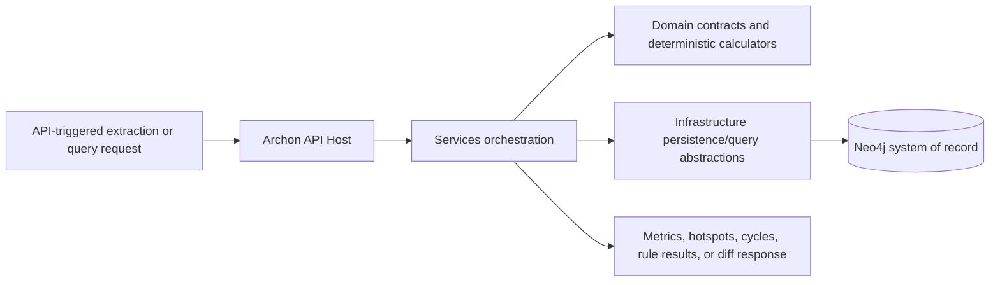

# Implementation Plan

## Document Control

| Field | Value |
| --- | --- |
| Work Package | WP013 - Metrics, Hotspots, Architecture Rules, and Snapshot Diff |
| Related Specification | `docs/013-Metrics-Hotspots-Architecture-Rules-and-Snapshot-Diff/spec-wp013-metrics-hotspots-architecture-rules-and-snapshot-diff.md` |
| Target Output Path | `docs/013-Metrics-Hotspots-Architecture-Rules-and-Snapshot-Diff/implementation-plan-wp013-metrics-hotspots-architecture-rules-and-snapshot-diff.md` |
| Plan Type | Vertical-slice implementation plan |
| Status | Draft |
| Required Repository Standards | `.github/instructions/documentation-pass.instructions.md`, `.github/instructions/wiki.instructions.md`, `.github/instructions/coding-standards.instructions.md` |

## Planning Principles and Mandatory Execution Rules

WP013 must be delivered as incremental, runnable vertical slices. Each Work Item must leave Archon in a demonstrable state through an API-driven or extraction-pipeline entry point, even when the capability is intentionally minimal at first. The implementation must preserve the repository's Onion Architecture: Domain remains inward and independent, Services coordinates business behavior, Infrastructure owns Neo4j-specific persistence and query details, and Hosts expose API endpoints and composition only.

Every Work Item that creates or updates source code must comply with `.github/instructions/documentation-pass.instructions.md` as a hard Definition of Done gate. This means source-code documentation is not optional polish. New or modified code must include developer-level comments for every class, method, and constructor, including internal and other non-public types; public methods and constructors must document every parameter; properties whose meaning is not obvious from their names must be documented; and algorithms such as graph traversal, cycle normalization, fingerprint comparison, scoring, and deterministic ordering must include sufficient inline or block comments to make the logical flow understandable to future contributors.

Every Work Item must also comply with `.github/instructions/wiki.instructions.md`. A wiki review is mandatory even when no wiki edit is ultimately required. If WP013 changes or materially clarifies developer-facing behavior, architecture, runtime flow, terminology, validation workflow, API usage, persistence behavior, or contributor guidance, the correct wiki topic page must be updated or a new topic page must be created. Detailed contributor-facing content must not be placed in `wiki/home.md`; that page remains a landing page and table of contents. Standalone implementation notes, implementation ledgers, architecture notes, completion notes, or similar narrative records must not be created as substitutes for wiki maintenance. Current-state design rationale, runtime flow, validation guidance, troubleshooting, terminology, and examples belong in `./wiki`.

Once execution starts on any Work Item, the executor must continue uninterrupted through implementation, validation, documentation/wiki review, and plan-record updates for that Work Item. Status messages, step announcements, ordinary failing tests, fixable build errors, missing comments, or documentation/wiki tasks are not stopping points. The only allowed stops during an active Work Item are full Work Item completion, explicit user interruption or change of direction, or a true blocker that cannot be resolved from the specification, this plan, the codebase, or repository guidance.

## Overall Project Structure

WP013 should reuse the existing solution and project layout rather than introducing a parallel structure. The expected placement is:

- `src/Archon` or existing host project: API endpoint composition, route registration, authorization-policy reuse, and dependency-injection wiring only.
- `src/Archon.Domain` or equivalent inward domain project: metric, hotspot, cycle, architecture-rule-result, and diff contracts; value objects; enums; deterministic identity abstractions; and pure domain services where they have no infrastructure dependency.
- `src/Archon.Services` or equivalent services project: extraction-stage orchestration, metric calculation coordination, hotspot detection, architecture-rule evaluation, diff orchestration, validation, and API-facing query handlers.
- `src/Archon.Infrastructure` or equivalent infrastructure project: Neo4j metric persistence, metric query implementation, snapshot comparison data retrieval, and persistence mapping.
- `test/*`: corresponding unit, integration, and API test projects aligned with the existing test estate.
- `wiki/*`: current-state contributor guidance for metrics, hotspots, architecture rules, snapshot diff, persistence semantics, API usage, and validation workflow where the wiki review determines updates are required.

Naming should follow existing Archon conventions. New C# code must use block-scoped namespaces, Allman braces, one public type per file, underscore-prefixed private fields, explicit classes for executable entry points, and no top-level statements. `.csproj` edits must keep `PackageReference` entries in `ItemGroup` blocks that contain only package references.

## Metrics Foundation and First End-to-End Slice

- [x] Work Item 1: Persist the smallest snapshot metric end-to-end - Completed
  - **Purpose**: Establish the WP013 metric contract, deterministic metric identity, pipeline participation, and persistence path with the smallest useful metric so the remaining slices can extend a proven vertical path.
  - **Acceptance Criteria**:
	- A snapshot-level or project-level metric can be produced by the extraction pipeline after required facts are available.
	- The metric has a `metric://` stable key, normalized fingerprint, metric kind, scope kind, snapshot identity, value, unit where meaningful, metadata, confidence or unknown-state data where applicable, and optional evidence references.
	- The metric is persisted through the existing snapshot persistence path rather than direct ad hoc Neo4j writes from the calculator.
	- An API endpoint can retrieve the persisted metric by snapshot using stable public identities and without exposing Neo4j internal IDs.
  - **Definition of Done**:
	- Code implemented across domain contracts, service orchestration, persistence integration, API endpoint, logging, validation, and error handling.
	- `.github/instructions/documentation-pass.instructions.md` followed in full for every source file touched; all new and modified classes, methods, constructors, public parameters, non-obvious properties, and metric identity/fingerprint logic are documented.
	- Tests passing for stable-key determinism, fingerprint determinism, metric persistence, and the first metrics API response.
	- Wiki review completed under `.github/instructions/wiki.instructions.md`; relevant wiki or repository guidance updated, or an explicit no-change review result recorded.
	- Foundational documentation uses book-like narrative depth for metric identity, metric persistence, stable keys, fingerprints, and extraction-stage behavior where those concepts are explained.
	- Can execute end-to-end via an existing extraction/API startup path and a snapshot metrics request.
	- Executor must not stop mid-Work Item; execution continues through implementation, validation, documentation/wiki review, and plan-record updates unless complete, explicitly interrupted, or truly blocked.
	- [x] Task 1: Add metric domain contract and identity primitives - Completed.
	- [x] Define metric scope kinds for snapshot, repository, solution, project, node, and edge scopes where existing model boundaries support them.
	- [x] Define stable metric kinds for the initial metric and a central registry pattern that later slices can extend without inconsistent names, units, or scopes.
	- [x] Add metric value support for numeric and categorical text results, metadata, confidence, unknown-state fields, and optional evidence references.
	- [x] Implement deterministic `metric://` stable-key and normalized fingerprint generation using existing shared helpers where available.
	- Summary: Added the `SnapshotNodeCount` metric definition/registry path, extended metric scope support, enriched metric records with confidence and unknown-state data, and expanded metric fingerprint inputs for deterministic value-aware comparison.
  - [x] Task 2: Integrate a metric calculation stage into the extraction pipeline - Completed.
	- [x] Register the stage after required graph facts and findings are available.
	- [x] Produce the first metric from accumulated facts without rescanning source files.
	- [x] Emit warnings for incomplete inputs and errors only when required output assembly cannot continue.
	- Summary: Registered `WP013.SnapshotMetrics` after the WP012 rule stage and implemented snapshot node-count calculation from accumulated graph facts, including snapshot identity derivation and unknown-state context when calculation occurs before final header assembly.
  - [x] Task 3: Persist and retrieve metric records - Completed.
	- [x] Extend snapshot persistence mapping so metrics are first-class snapshot-owned outputs.
	- [x] Persist metric metadata and evidence relationships where evidence exists.
	- [x] Add infrastructure query support for snapshot metrics using stable keys.
	- Summary: Extended Neo4j snapshot persistence and mapping for `ArchonMetric` records, metric support/target relationships, metric counts, in-memory metric reads, and controlled Neo4j snapshot metric queries.
  - [x] Task 4: Expose the first metrics API path - Completed.
	- [x] Add a snapshot metrics endpoint aligned with existing host route and response conventions.
	- [x] Support basic filters, deterministic ordering, validation errors, and stable-key public identity.
	- Summary: Added controlled snapshot metrics API behavior through route and query-string forms, with bounded paging, metric-kind/scope filters, stable public identities, sanitized metadata, and no Neo4j internal IDs.
  - [x] Task 5: Add tests and documentation/wiki review - Completed.
	- [x] Add unit tests for stable-key generation, fingerprint generation, and unknown-state handling.
	- [x] Add persistence or integration tests proving metrics are snapshot-owned outputs.
	- [x] Add API tests for the snapshot metrics response and public identity fields.
	- [x] Review wiki pages for graph domain model, persistence foundation, extraction workflow, API usage, and glossary entries; update correct topic pages if metric terminology or workflows are newly contributor-facing.
	- Summary: Added/updated domain, application, API, extraction, and Neo4j tests for metric identity, fingerprinting, unknown-state behavior, snapshot-owned persistence, and public API responses. Validation completed with `Archon.Domain.Tests`, `Archon.Application.Tests`, `Archon.Api.Query.Tests`, and `Archon.Api.Extraction.Tests` passing 339/339, `Archon.Infrastructure.Neo4j.Tests` passing 40/40, and a successful full solution build. Wiki review result: updated `wiki/graph-domain-model.md`, `wiki/neo4j-persistence-foundation.md`, `wiki/api-extraction-workflow.md`, `wiki/hotlist-and-findings.md`, and concise links/orientation in `wiki/home.md`; no new wiki page was created because metrics fit the existing graph-domain, persistence, extraction-workflow, and controlled-query topic pages. Wiki impact matrix: affected concepts were metric identity, snapshot metric calculation, metric persistence, and controlled metric query APIs; pages reviewed were graph domain model, Neo4j persistence foundation, API extraction workflow, hotlist/query guidance, glossary, and home; pages updated were the four topic pages plus the landing-page reader path; pages intentionally unchanged included `wiki/glossary.md` because the existing metric, stable-key, fingerprint, accumulator, and controlled-query entries were sufficient; page-structure decision was to keep `home.md` as a landing page and not create a separate metrics page until later metric families add enough concept depth to justify one.
  - **Files**:
	- `src/**/Metrics/*.cs`: Metric contracts, kinds, scope models, stable-key and fingerprint logic.
	- `src/**/Extraction/*.cs`: Metric calculation stage registration and orchestration.
	- `src/**/Persistence/*.cs`: Metric persistence mapping and queries.
	- `src/**/Endpoints/*.cs`: Snapshot metrics endpoint and response contracts.
	- `test/**/*.cs`: Domain, service, persistence, and API tests for the first vertical slice.
	- `wiki/*.md`: Topic-page updates only if wiki review determines new or clarified contributor guidance is required.
  - **Work Item Dependencies**: Existing extraction snapshot model, stable-key/fingerprint helpers, Neo4j persistence seam, API host conventions.
  - **Run / Verification Instructions**:
	- Build the solution with the existing solution command.
	- Run targeted metric domain, persistence, and API tests.
	- Start the API host through the existing Archon startup path and request the snapshot metrics endpoint for a known snapshot.
  - **User Instructions**: No manual setup beyond the existing Archon development prerequisites should be required.

## Project Metrics Slice

- [x] Work Item 2: Calculate and expose project-scoped metrics - Completed
  - **Purpose**: Deliver the required project metrics as persisted, queryable outputs that summarize project references, package usage, public surface, endpoint count, data-access footprint, finding count, and target-framework risk.
  - **Acceptance Criteria**:
	- Incoming project reference count, outgoing project reference count, package count, public type count, endpoint count, data-access count, hotlist finding count, and target-framework age or risk are calculated for each applicable project node.
	- Required but partially unavailable inputs are represented through warnings or explicit unknown-state data rather than silent omission.
	- Metrics are persisted with deterministic stable keys and fingerprints and can be filtered or sorted by project, solution, metric kind, numeric value, and risk category where applicable.
	- API consumers can retrieve project metrics through snapshot and project-specific paths.
  - **Definition of Done**:
	- Code implemented for project metric calculators, orchestration, persistence, API filters, logging, validation, and error handling.
	- `.github/instructions/documentation-pass.instructions.md` followed in full for every source file touched, including comments explaining metric definitions, scope, data source assumptions, and target-framework risk logic.
	- Tests passing for TR-001 through TR-008 and related persistence/API coverage.
	- Wiki review completed; update metric-definition, extraction workflow, API, persistence, or glossary pages if project metric behavior is contributor-facing, or record why no update was needed.
	- Book-like narrative documentation explains project metric meanings, evidence handling, and unknown behavior when wiki updates are needed.
	- Can execute end-to-end by running extraction and querying project metrics for a snapshot/project stable key.
	- Executor must continue uninterrupted until this Work Item is fully complete or truly blocked.
	- [x] Task 1: Implement project metric calculators - Completed.
	- [x] Use extracted project-reference edges to calculate incoming and outgoing reference counts.
	- [x] Use extracted package facts to calculate package count.
	- [x] Use Roslyn semantic extraction output to calculate public type count.
	- [x] Use runtime/API extraction output to calculate endpoint count.
	- [x] Use data-access extraction output to calculate data-access count.
	- [x] Use persisted WP012 finding output to calculate hotlist finding count.
	- [x] Use target-framework facts to calculate age or risk using documented deterministic logic.
	- Summary: Extended `WP013.SnapshotMetrics` to emit project-scoped metrics for each project node from accumulated graph facts without source rescans, including `ProjectIncomingReferenceCount`, `ProjectOutgoingReferenceCount`, `ProjectPackageCount`, `ProjectPublicTypeCount`, `ProjectEndpointCount`, `ProjectDataAccessCount`, `ProjectHotlistFindingCount`, and `ProjectTargetFrameworkRisk`.
  - [x] Task 2: Integrate project metrics with persistence and query filters - Completed.
	- [x] Persist each project metric with project or node scope and project target stable key.
	- [x] Include metadata explaining calculation scope and missing input warnings.
	- [x] Add filters and sorting support required by the API surface.
	- Summary: Reused the first-class metric persistence path for project metrics, added project/node target identities, preserved metric metadata and unknown-state data, and extended metric queries with a `projectStableKey` filter in application, in-memory, and Neo4j query paths.
  - [x] Task 3: Extend API responses - Completed.
	- [x] Add or extend project metrics endpoint behavior.
	- [x] Return confidence, unknown-state data, evidence references, and stable public identities where applicable.
	- [x] Validate unsupported filters and invalid limits predictably.
	- Summary: Extended the snapshot metrics endpoints to accept `projectStableKey`, returning project-scoped metric DTOs with node target identity, confidence, unknown-state information, sanitized metadata, deterministic ordering, and bounded paging.
  - [x] Task 4: Test and document project metrics - Completed.
	- [x] Add calculator unit tests for every project metric kind.
	- [x] Add integration tests for persistence and API retrieval.
	- [x] Add edge-case tests for missing facts and unknown-state output.
	- [x] Complete the mandatory wiki review and update topic pages if needed.
	- Summary: Added targeted application tests for every project metric kind, unknown target-framework behavior, query filter propagation, and API project metric filtering. Wiki review result: updated `wiki/graph-domain-model.md`, `wiki/api-extraction-workflow.md`, `wiki/hotlist-and-findings.md`, and `wiki/neo4j-persistence-foundation.md`; no new page was created because project metrics naturally extend the existing metric, extraction workflow, persistence, and controlled query topics. Wiki impact matrix: affected concepts were project-scoped metric definitions, calculation sources, target-framework risk, project metric persistence, and project metric query filtering; pages reviewed were graph domain model, API extraction workflow, controlled analysis queries, Neo4j persistence foundation, glossary, and home; pages updated were the four topic pages; pages intentionally unchanged were `wiki/glossary.md` and `wiki/home.md` because existing terminology and reader paths remained sufficient; page-structure decision was to keep metric guidance in the existing topic pages rather than introduce a standalone metrics page until graph/modernization metrics broaden the reader path.
  - **Files**:
	- `src/**/Metrics/Project*.cs`: Project metric definitions and calculators.
	- `src/**/Metrics/MetricKind*.cs`: Metric-kind registry additions.
	- `src/**/Persistence/*Metric*.cs`: Persistence and query mapping updates.
	- `src/**/Endpoints/*Metrics*.cs`: Project metric endpoint/filter additions.
	- `test/**/*Metric*.cs`: Project metric unit, integration, and API tests.
	- `wiki/*.md`: Current-state project metric guidance if required by wiki review.
  - **Work Item Dependencies**: Work Item 1 and availability of extracted project, package, semantic, runtime, data-access, and finding facts.
  - **Run / Verification Instructions**:
	- Run targeted project metric unit tests.
	- Run metric persistence/API tests.
	- Execute an extraction fixture and retrieve metrics for a project stable key.
  - **User Instructions**: None expected.

## Graph Metrics Slice

- [x] Work Item 3: Calculate graph-structure metrics and expose them through API - Completed
  - **Purpose**: Add deterministic graph metrics over stable architecture node and edge identities to support later hotspots, cycle-aware metrics, and architecture-rule checks.
  - **Acceptance Criteria**:
	- Fan-in, fan-out, normalized degree-based centrality, dependency depth, transitive dependency count, cycle participation, and neighbourhood size are calculated for applicable architecture nodes.
	- Graph calculations use stable node and edge identities, ignore non-dependency relationship kinds unless explicitly included, and enforce deterministic traversal limits.
	- Metric metadata records traversal scope, edge-kind filtering, depth limits, and truncation or unknown-state information where relevant.
	- API consumers can retrieve graph metrics with filtering, pagination, and stable-key identity.
  - **Definition of Done**:
	- Code implemented for graph metric calculation, traversal controls, persistence, API retrieval, logging, validation, and error handling.
	- `.github/instructions/documentation-pass.instructions.md` followed in full, with comments explaining traversal flow, edge-kind filtering, centrality definition, depth limiting, and deterministic ordering.
	- Tests passing for TR-009 through TR-014 plus deterministic ordering and traversal-limit cases.
	- Wiki review completed; update graph model, metric semantics, validation workflow, or glossary pages where graph metric behavior is contributor-facing.
	- Conceptually dense graph metric documentation uses long-form narrative with clear definitions of fan-in, fan-out, centrality, dependency depth, transitive dependency count, cycle participation, and neighbourhood size.
	- Can execute end-to-end by running extraction and querying graph metrics for a snapshot.
	- Executor must continue uninterrupted until this Work Item is fully complete or truly blocked.
	- [x] Task 1: Build graph traversal inputs - Completed.
	- [x] Normalize snapshot architecture nodes and edges into deterministic in-memory adjacency structures keyed by stable keys.
	- [x] Exclude evidence, metric, rule, summary, and support relationships from dependency traversal unless explicitly configured.
	- [x] Add deterministic ordering for nodes, edges, and traversal expansion.
	- Summary: Added a graph metric read model inside `WP013.SnapshotMetrics` that orders architecture nodes by stable key, filters dependency-like `EdgeKind` values, excludes non-dependency containment/support-style relationships, and groups incoming/outgoing edges for deterministic breadth-first traversal.
  - [x] Task 2: Implement graph metric algorithms - Completed.
	- [x] Calculate fan-in and fan-out by edge kind.
	- [x] Calculate normalized degree-based centrality from fan-in and fan-out as specified.
	- [x] Calculate bounded dependency depth and transitive dependency count.
	- [x] Calculate neighbourhood size using documented scope rules.
	- [x] Reserve cycle participation input for the cycle slice and preserve unknown or zero semantics consistently until cycles are available.
	- Summary: Registered `GraphFanIn`, `GraphFanOut`, `GraphDegreeCentrality`, `GraphDependencyDepth`, `GraphTransitiveDependencyCount`, `GraphNeighbourhoodSize`, and `GraphCycleParticipation`; implemented direct degree metrics, normalized centrality, bounded outbound traversal, unique reachable dependency counts, direct neighbourhood size, truncation unknown state, and reserved cycle unknown output.
  - [x] Task 3: Persist and expose graph metrics - Completed.
	- [x] Persist graph metrics with node scope and metadata describing traversal scope.
	- [x] Add graph metric API filters for snapshot, metric kind, scope, project/node, and limits.
	- [x] Return truncation metadata when configured limits affect output.
	- Summary: Reused the first-class snapshot metric persistence path for node-scoped graph metrics, populated node targets and traversal metadata, clarified the existing `projectStableKey` API/query filter as a node-target filter for graph metrics, and preserved deterministic ordering in in-memory and Neo4j query paths.
  - [x] Task 4: Test and document graph metrics - Completed.
	- [x] Add unit tests for each metric and deterministic tie ordering.
	- [x] Add large-graph boundary tests for traversal limits.
	- [x] Add API tests for filters, pagination or truncation, and stable-key identity.
	- [x] Complete mandatory wiki review and updates.
	- Summary: Added targeted tests for graph metric calculation, dependency filtering, centrality, traversal depth, transitive dependency count, neighbourhood size, cycle unknown semantics, traversal-limit truncation, and API node-target filtering. Validation: targeted `Archon.Application.Tests` and `Archon.Api.Query.Tests` passed with 92/92 tests. Wiki review result: updated `wiki/graph-domain-model.md`, `wiki/api-extraction-workflow.md`, `wiki/hotlist-and-findings.md`, and `wiki/neo4j-persistence-foundation.md`; no new page was created because graph metrics extend the existing graph vocabulary, extraction workflow, controlled query, and persistence topics. Wiki impact matrix: affected concepts were graph metric definitions, dependency edge filtering, bounded traversal, centrality, truncation/unknown-state behavior, node-scoped metric persistence, and node-target metric API filtering; pages reviewed were graph domain model, API extraction workflow, controlled analysis queries, Neo4j persistence foundation, glossary, validation workflows, and home; pages updated were the four topic pages; pages intentionally unchanged were `wiki/home.md`, `wiki/glossary.md`, and `wiki/validation-and-test-workflows.md` because reader paths, terminology, and validation command guidance remained sufficient; page-structure decision was to keep graph metric guidance in existing foundational pages and avoid turning `home.md` into a detailed topic page.
  - **Files**:
	- `src/**/Metrics/Graph*.cs`: Graph metric calculators and traversal helpers.
	- `src/**/Graph/*.cs`: Reusable graph view/adaptor types if not already present.
	- `src/**/Endpoints/*GraphMetrics*.cs`: Graph metric API path and response shaping.
	- `test/**/*GraphMetric*.cs`: Graph metric tests.
	- `wiki/*.md`: Graph metric and traversal guidance if required.
  - **Work Item Dependencies**: Work Items 1 and 2; stable architecture node and edge facts from prior work packages.
  - **Run / Verification Instructions**:
	- Run targeted graph metric tests.
	- Run API tests for graph metric retrieval.
	- Execute a fixture extraction and query graph metrics for a snapshot.
  - **User Instructions**: None expected.

## Modernization Metrics Slice

- [x] Work Item 4: Calculate modernization metrics from facts, findings, and graph relationships - Completed
  - **Purpose**: Persist modernization-oriented quantitative signals without inventing AI-derived assumptions or organization-specific policy.
  - **Acceptance Criteria**:
	- Legacy technology count, security-sensitive finding count, out-of-support target count, framework-only dependency count, data-access spread, and shared table usage count are calculated where source facts support them.
	- Metrics are scoped to project, solution, repository, or snapshot levels as supported by the source graph.
	- Metadata or evidence links explain contributing facts where practical.
	- API consumers can retrieve modernization metrics with filters and stable identities.
  - **Definition of Done**:
	- Code implemented for modernization metric calculators, rollups, persistence, API retrieval, logging, validation, and error handling.
	- `.github/instructions/documentation-pass.instructions.md` followed in full, including comments explaining source facts, confidence, unknown handling, and why no AI inference is used.
	- Tests passing for TR-015 and related persistence/API scenarios.
	- Wiki review completed; update modernization metric, finding, data-access, or glossary guidance when contributor-facing behavior is clarified.
	- Documentation explains modernization terms such as legacy technology, framework-only dependency, data-access spread, and shared table usage on first introduction or links to a glossary entry.
	- Can execute end-to-end by running extraction and querying modernization metrics for a snapshot.
	- Executor must continue uninterrupted until this Work Item is fully complete or truly blocked.
	- [x] Task 1: Implement modernization metric definitions and calculators - Completed.
	- [x] Calculate legacy technology count from deterministic extracted technology facts.
	- [x] Calculate security-sensitive finding count from persisted finding categories or severities.
	- [x] Calculate out-of-support target count from target-framework facts and supported-version rules.
	- [x] Calculate framework-only dependency count from package/framework references.
	- [x] Calculate data-access spread from data-access facts and project/node relationships.
	- [x] Calculate shared table usage count from data-access table references where available.
	- Summary: Added the six modernization metric definitions to the central metric registry and extended `WP013.SnapshotMetrics` with deterministic calculators for legacy technology, security-sensitive findings, out-of-support targets, framework-only dependencies, data-access spread, and shared table usage. Calculators read accumulated graph facts, metadata, and findings only; no source rescan, Neo4j query, AI inference, or organization-specific policy was introduced.
  - [x] Task 2: Add rollup and unknown-state behavior - Completed.
	- [x] Support project, solution, repository, and snapshot rollups where source identity exists.
	- [x] Preserve warnings or unknowns for incomplete inputs.
	- [x] Include metadata explaining contributing facts and calculation scope.
	- Summary: Added snapshot, repository, solution, and project rollup scopes where graph boundaries exist, including contributing project stable keys, fact-count metadata, `modernizationInference = None`, and unknown-state preservation for missing target-framework metadata and unavailable table facts.
  - [x] Task 3: Persist and expose modernization metrics - Completed.
	- [x] Persist modernization metrics with deterministic stable keys and fingerprints.
	- [x] Add modernization metric API filters and response fields.
	- [x] Validate filters and limits predictably.
	- Summary: Reused the existing first-class `MetricRecord` persistence path and controlled `/snapshot-metrics` query surface for modernization metrics. Existing in-memory and Neo4j metric query stores already filter by snapshot, metric kind, scope kind, and node/project stable key, so modernization metrics are retrieved without exposing Neo4j internal IDs or adding a parallel endpoint.
  - [x] Task 4: Test and document modernization metrics - Completed.
	- [x] Add calculator tests for every modernization metric.
	- [x] Add tests for incomplete facts and unknown-state preservation.
	- [x] Add API tests for filtering, evidence, confidence, and stable identity.
	- [x] Complete mandatory wiki review and updates.
	- Summary: Added targeted Application tests for all modernization metric kinds, rollups, stable keys, fingerprints, metadata, and unknown-state behavior, plus Query API tests for modernization metric filtering and stable response fields. Validation: targeted `Archon.Application.Tests` and `Archon.Api.Query.Tests` passed with 95/95 tests; full workspace build passed. Wiki review result: updated `wiki/graph-domain-model.md`, `wiki/api-extraction-workflow.md`, `wiki/hotlist-and-findings.md`, and `wiki/neo4j-persistence-foundation.md`. Wiki impact matrix: affected concepts were modernization metric definitions, legacy technology, security-sensitive finding counts, out-of-support target counts, framework-only dependencies, data-access spread, shared table usage, rollup scopes, unknown-state behavior, API metric filtering, and metric persistence; pages reviewed were graph domain model, API extraction workflow, controlled analysis queries, Neo4j persistence foundation, glossary, validation workflows, and home; pages updated were the four topic pages; pages created or retired were none; pages intentionally unchanged were `wiki/home.md`, `wiki/glossary.md`, and `wiki/validation-and-test-workflows.md` because existing reader paths, terminology coverage, and validation command guidance remained sufficient; page-structure decision was to keep modernization metric guidance in the existing foundational graph, extraction workflow, query, and persistence pages rather than creating a narrow work-package page or turning `home.md` into detailed guidance.
  - **Files**:
	- `src/**/Metrics/Modernization*.cs`: Modernization metric calculators and rollup logic.
	- `src/**/Endpoints/*ModernizationMetrics*.cs`: API endpoint additions.
	- `test/**/*ModernizationMetric*.cs`: Modernization metric tests.
	- `wiki/*.md`: Modernization metric guidance if required.
  - **Work Item Dependencies**: Work Items 1 through 3 and existing extraction facts for technologies, targets, findings, and data access.
  - **Run / Verification Instructions**:
	- Run targeted modernization metric tests.
	- Run API tests for modernization metric retrieval.
	- Execute a fixture extraction and query modernization metrics by snapshot.
  - **User Instructions**: None expected.

## Cycle Detection Slice

- [x] Work Item 5: Detect dependency cycles and feed cycle participation metrics - Completed
  - **Purpose**: Detect circular dependencies using stable architecture identities, expose deterministic cycle paths, and complete cycle participation metrics for graph analysis and hotspots.
  - **Acceptance Criteria**:
	- Circular project dependencies and configured architecture-edge cycles are detected.
	- Each cycle reports stable node keys, stable edge keys, cycle path order, confidence, evidence references where available, and truncation metadata when limits apply.
	- Duplicate cycles are normalized so rotations of the same cycle are not reported repeatedly.
	- Cycle participation contributes to graph metrics and can be retrieved through the cycles API endpoint.
  - **Definition of Done**:
	- Code implemented for cycle detection, duplicate normalization, metric integration, persistence/query support as needed, API retrieval, logging, validation, and error handling.
	- `.github/instructions/documentation-pass.instructions.md` followed in full, with comments explaining cycle traversal, canonicalization, duplicate removal, deterministic ordering, and truncation behavior.
	- Tests passing for TR-027 through TR-030 and cycle participation metric behavior.
	- Wiki review completed; update graph/cycle guidance or glossary where cycle terminology and behavior are contributor-facing.
	- Documentation explains cycle, cycle path, cycle participation, stable node identity, and stable edge identity before using those terms extensively.
	- Can execute end-to-end by running extraction and querying cycles plus graph metrics for cycle participation.
	- Executor must continue uninterrupted until this Work Item is fully complete or truly blocked.
	- [x] Task 1: Implement cycle detection algorithm - Completed.
	- [x] Build deterministic adjacency input from project or configured dependency edge kinds.
	- [x] Traverse with bounded depth and result limits.
	- [x] Report stable node and edge keys in cycle path order.
	- [x] Include evidence references where edge evidence exists.
	- Summary: Added `DependencyCycleDetector` and cycle contracts that read accumulated architecture nodes and dependency-like edges, traverse bounded deterministic paths, emit `cycle://` stable identities, preserve stable node/edge path order, and aggregate edge evidence references.
  - [x] Task 2: Normalize and order cycles - Completed.
	- [x] Canonicalize cycle paths to remove duplicate rotations.
	- [x] Apply deterministic ordering across cycles and within result sets.
	- [x] Include truncation metadata for large result sets.
	- Summary: Implemented canonical rotation normalization by stable node and edge paths, deterministic cycle ordering, result-limit truncation flags, and metadata that records canonical paths, dependency edge kinds, depth limits, result limits, and truncation state.
  - [x] Task 3: Integrate cycle output with metrics and API - Completed.
	- [x] Update cycle participation metrics for affected nodes.
	- [x] Add cycles API response contracts and filters.
	- [x] Return confidence, unknown-state data, evidence, and stable public identities.
	- Summary: Integrated cycle detection into `WP013.SnapshotMetrics` so `GraphCycleParticipation` is numeric for participating nodes, added controlled cycle query contracts and service, registered cycle query composition, and exposed `/snapshot-cycles` with snapshot/node filters, bounded paging, stable DTOs, confidence, unknown-state, evidence, sanitized metadata, and fingerprints.
  - [x] Task 4: Test and document cycle detection - Completed.
	- [x] Add tests for project cycles and configured architecture-edge cycles.
	- [x] Add duplicate normalization tests.
	- [x] Add deterministic ordering and truncation tests.
	- [x] Complete mandatory wiki review and updates.
	- Summary: Added detector tests for project/reference cycles, configured architecture-edge cycles, duplicate rotation removal, deterministic path ordering, and result-limit truncation; added metric-stage tests for cycle participation; added API tests for cycle DTOs and node filtering. Validation: targeted `Archon.Application.Tests` and `Archon.Api.Query.Tests` passed 100/100, `Archon.Infrastructure.Neo4j.Tests` passed 40/40, and the full solution build passed. Wiki review result: updated `wiki/graph-domain-model.md`, `wiki/api-extraction-workflow.md`, `wiki/hotlist-and-findings.md`, `wiki/neo4j-persistence-foundation.md`, and `wiki/glossary.md`; no new wiki page was created because cycle behavior extends the existing graph model, controlled query, persistence, and terminology pages. Wiki impact matrix: affected concepts were dependency cycle, cycle path order, stable node identity, stable edge identity, canonical rotation normalization, duplicate removal, bounded traversal, result truncation, evidence references, cycle participation metrics, and `/snapshot-cycles` controlled query behavior; pages reviewed were graph domain model, API extraction workflow, controlled analysis queries, Neo4j persistence foundation, glossary, and home; pages updated were the five topic/glossary pages; pages created or retired were none; pages intentionally unchanged included `wiki/home.md` because the existing reader path to graph, query, persistence, and glossary pages remains sufficient and the landing page must not become detailed architecture guidance; page-structure decision was to keep cycle documentation in existing foundational topic pages rather than create a narrow cycle-only work-package page.
  - **Files**:
	- `src/**/Cycles/*.cs`: Cycle detection and normalization.
	- `src/**/Metrics/Graph*.cs`: Cycle participation metric integration.
	- `src/**/Endpoints/*Cycles*.cs`: Cycles API endpoint and contracts.
	- `test/**/*Cycle*.cs`: Cycle tests.
	- `wiki/*.md`: Cycle and graph guidance if required.
  - **Work Item Dependencies**: Work Items 1 through 3.
  - **Run / Verification Instructions**:
	- Run targeted cycle tests.
	- Run graph metric tests affected by cycle participation.
	- Execute a fixture extraction and query cycles for a snapshot.
  - **User Instructions**: None expected.

## Hotspot Detection Slice

- [x] Work Item 6: Identify coupling and modernization hotspots - Completed
  - **Purpose**: Convert persisted metrics, graph facts, cycles, and findings into deterministic, explainable hotspot output for architectural risk triage.
  - **Acceptance Criteria**:
	- High fan-in, high fan-out, shared-library, data-access spread, shared table usage, high hotlist finding concentration, high dependency depth or transitive dependency count, and cycle-related hotspots are identified.
	- Hotspot output includes snapshot identity, category, target stable key, target kind, display name where available, score or rank, contributing metric stable keys, contributing finding stable keys, evidence references, confidence, unknown-state fields, and metadata.
	- Default thresholds are documented, and policy-like thresholds are configurable through rule catalog and metric-threshold conditions where applicable.
	- Ranking is deterministic, including stable tie-breaking for equal scores.
  - **Definition of Done**:
	- Code implemented for hotspot scoring, ranking, threshold configuration, API retrieval, logging, validation, and error handling.
	- `.github/instructions/documentation-pass.instructions.md` followed in full, with comments explaining score composition, tie-breaking, threshold use, evidence flow, and limits on inferred rationale.
	- Tests passing for TR-022 through TR-026 and TR-029.
	- Wiki review completed; update hotspot, metric, finding, configuration, or glossary pages if behavior is contributor-facing.
	- Documentation explains hotspot categories, score/rank semantics, threshold configuration, evidence, confidence, unknown handling, and limitations in narrative form with examples where useful.
	- Can execute end-to-end by running extraction and querying hotspots for a snapshot.
	- Executor must continue uninterrupted until this Work Item is fully complete or truly blocked.
	- [x] Task 1: Implement hotspot categories and scoring - Completed.
	- [x] Map graph metrics to high fan-in, high fan-out, shared-library, dependency-depth, transitive-dependency, and cycle hotspots.
	- [x] Map modernization metrics to data-access spread and shared table usage hotspots.
	- [x] Map finding counts to high hotlist finding concentration hotspots.
	- [x] Compose confidence from contributing metrics and findings.
	- Summary: Added the `Archon.Application.Hotspots` application feature with stable category constants, hotspot records, score construction from graph and modernization metrics, open-finding concentration scoring, conservative minimum-confidence composition, unknown-state propagation, contribution references, stable `hotspot://` identities, and deterministic fingerprints.
  - [x] Task 2: Add threshold and ranking behavior - Completed.
	- [x] Provide documented default thresholds.
	- [x] Integrate policy-like thresholds with rule catalog and metric-threshold conditions where supported.
	- [x] Apply deterministic ordering and tie-breaking by stable fields.
	- Summary: Added `HotspotThresholds.Default` for documented policy-like thresholds and kept the threshold contract isolated for future rule-catalog/metric-threshold integration. Ranking is category-local, score-descending, and tie-broken by stable target and hotspot identities.
  - [x] Task 3: Expose hotspot API - Completed.
	- [x] Add filters by snapshot, project or target, category, limits, and pagination or truncation.
	- [x] Return stable keys, contributing metrics/findings, evidence, confidence, unknown-state data, and metadata.
	- [x] Validate unsupported filters and invalid limits predictably.
	- Summary: Added `HotspotQuery`, `HotspotItemDto`, `IHotspotQueryService`, and `HotspotQueryService`; registered the service in query API composition; and exposed `GET /snapshot-hotspots` with required snapshot stable key, optional target/category filters, bounded paging, validation-problem handling, stable DTOs, contribution arrays, sanitized metadata, confidence, unknown-state fields, and fingerprints.
  - [x] Task 4: Test and document hotspots - Completed.
	- [x] Add hotspot detector tests for every required category.
	- [x] Add ranking tie tests and threshold tests.
	- [x] Add API response tests for contribution fields and stable identity.
	- [x] Complete mandatory wiki review and updates.
	- Summary: Added `HotspotDetectorTests` covering graph coupling, modernization, shared table, hotlist concentration, cycle, threshold, and deterministic ranking behavior; added query API tests for hotspot DTO output and validation behavior. Validation: targeted `Archon.Application.Tests` and `Archon.Api.Query.Tests` passed 105/105, `Archon.Infrastructure.Neo4j.Tests` passed 40/40, and the full solution build passed. Wiki review result: updated `wiki/graph-domain-model.md`, `wiki/hotlist-and-findings.md`, `wiki/api-extraction-workflow.md`, and `wiki/glossary.md`; no new wiki page was created because hotspot behavior extends the existing graph model, controlled query, workflow, and glossary topics. Wiki impact matrix: affected concepts were hotspot, hotspot score, hotspot rank, hotspot category, default thresholds, policy-like threshold isolation, deterministic ranking and tie-breaking, contribution references, confidence composition, unknown-state propagation, sanitized metadata, and `/snapshot-hotspots` controlled query behavior; pages reviewed were graph domain model, controlled analysis queries, API extraction workflow, glossary, and home; pages updated were the four topic/glossary pages; pages created, split, renamed, or retired were none; pages intentionally unchanged included `wiki/home.md` because it remains a concise landing page and the existing reader paths already link to the affected topic pages; page-structure decision was to keep hotspot guidance in existing foundational topic pages rather than create a narrow work-item page or add detailed content to `home.md`.
  - **Files**:
	- `src/**/Hotspots/*.cs`: Hotspot contracts, scoring, ranking, and detector logic.
	- `src/**/Endpoints/*Hotspots*.cs`: Hotspot API endpoint and response contracts.
	- `test/**/*Hotspot*.cs`: Hotspot unit and API tests.
	- `wiki/*.md`: Hotspot guidance if required.
  - **Work Item Dependencies**: Work Items 1 through 5.
  - **Run / Verification Instructions**:
	- Run targeted hotspot tests.
	- Run API tests for hotspot retrieval.
	- Execute a fixture extraction and query hotspots by snapshot.
  - **User Instructions**: None expected.

## Architecture Rule Checks Slice

- [x] Work Item 7: Evaluate graph and metric-dependent architecture-rule checks - Completed
  - **Purpose**: Add evidence-backed architecture-rule results for generic source-brief layering and dependency patterns without hard-coding organization-specific policy.
  - **Acceptance Criteria**:
	- Checks cover domain projects referencing infrastructure projects, domain projects referencing web projects, web projects referenced by non-web projects, application projects directly using LINQ to SQL where not explicitly allowed, controllers directly using DataContext where not explicitly allowed, worker projects missing queue or topic dependencies where evidence indicates they should exist, and shared libraries with high fan-in requiring review before change.
	- Architecture-rule checks use configured rule catalog semantics where applicable.
	- Rule results include snapshot identity, rule/check identity, category, status, target stable key, target kind, description, contributing metric stable keys, contributing edge stable keys, contributing finding stable keys, evidence references, confidence, unknown-state fields, and metadata.
	- API consumers can retrieve architecture-rule results with filters and stable identities.
  - **Definition of Done**:
	- Code implemented for architecture-rule definitions, evaluator integration, configured-rule behavior, persistence/query integration if needed, API endpoint, logging, validation, and error handling.
	- `.github/instructions/documentation-pass.instructions.md` followed in full, with comments explaining how generic built-in checks differ from organization-specific policy and how configured rules participate.
	- Tests passing for TR-031 through TR-038.
	- Wiki review completed; update architecture, rule catalog, layering, API, configuration, or glossary pages when contributor-facing behavior is clarified.
	- Documentation explains layering, configured rule catalog, architecture-rule result, target stable key, confidence, and unknown-state terminology before relying on those terms.
	- Can execute end-to-end by running extraction/rule evaluation and querying architecture-rule results for a snapshot.
	- Executor must continue uninterrupted until this Work Item is fully complete or truly blocked.
	- [x] Task 1: Define architecture-rule checks - Completed.
	- [x] Add generic layering and dependency-pattern checks from the source brief.
	- [x] Connect checks to configured rule catalog semantics where applicable.
	- [x] Ensure organization-specific policies remain configurable and are not hard-coded.
	- Summary: Added stable WP013 architecture-rule check definitions for domain-to-infrastructure references, domain-to-web references, non-web references to web projects, direct LINQ to SQL use from application projects, direct DataContext use from controllers, worker queue/topic dependency visibility, and high fan-in shared-library review. Built-in checks remain generic; persisted rule definitions can disable matching checks, and policy-like allowances and thresholds live in evaluation options rather than hard-coded organization exceptions.
  - [x] Task 2: Evaluate checks from graph, metrics, and findings - Completed.
	- [x] Use architecture edges for dependency direction checks.
	- [x] Use extracted semantic/data-access/runtime facts for LINQ to SQL, DataContext, worker queue, and worker topic checks.
	- [x] Use high fan-in metrics/hotspots for shared-library review checks.
	- [x] Preserve evidence, confidence, and unknown reasons.
	- Summary: Added `ArchitectureRuleEvaluator`, `ArchitectureRuleResult`, and supporting options/query contracts. Evaluation reads completed snapshot nodes, dependency-like edges, semantic metadata, runtime metadata, `GraphFanIn` metrics, findings, and rule definitions; emits `architecture-rule://` stable identities, deterministic fingerprints, contribution references, conservative confidence, and explicit unknown-state results for incomplete worker messaging evidence.
  - [x] Task 3: Expose architecture-rule result API - Completed.
	- [x] Add filters by snapshot, rule category, status, target, and limits.
	- [x] Return stable keys and contribution fields without Neo4j internal IDs.
	- [x] Validate unsupported filters and invalid limits predictably.
	- Summary: Added `IArchitectureRuleQueryService`, `ArchitectureRuleQueryService`, `ArchitectureRuleQuery`, and `ArchitectureRuleItemDto`; registered the service in query API composition; and exposed `GET /snapshot-architecture-rules` with required snapshot stable key, category/ruleCategory alias, status, target stable-key, bounded paging, validation-problem handling, sanitized metadata, stable contribution fields, confidence, unknown-state fields, and fingerprints.
  - [x] Task 4: Test and document architecture-rule checks - Completed.
	- [x] Add tests for every required rule check.
	- [x] Add tests proving configured rules govern policy-like behavior.
	- [x] Add API tests for filters, evidence, confidence, and unknown-state fields.
	- [x] Complete mandatory wiki review and updates.
	- Summary: Added `ArchitectureRuleEvaluatorTests` covering required layering, data-access, worker unknown-state, shared-library metric/finding contribution, and configured-rule disablement behavior; added query API tests for architecture-rule DTO output, filters, contribution fields, and validation behavior. Validation: targeted `Archon.Application.Tests` and `Archon.Api.Query.Tests` passed 112/112, `Archon.Infrastructure.Neo4j.Tests` passed 40/40, and the full solution build passed. Wiki review result: updated `wiki/graph-domain-model.md`, `wiki/api-extraction-workflow.md`, `wiki/hotlist-and-findings.md`, `wiki/glossary.md`, and `wiki/neo4j-persistence-foundation.md`; no new wiki page was created because architecture-rule results extend existing graph vocabulary, controlled-query behavior, extraction/query workflow, persistence semantics, and glossary terminology. Wiki impact matrix: affected concepts were architecture-rule result, generic built-in checks, configurable policy-like allowances, configured rule-definition enabled state, layering checks, direct LINQ to SQL and DataContext checks, worker queue/topic unknown state, shared-library high fan-in review, target stable key, result status, contribution references, confidence, unknown-state propagation, metadata sanitization, and `/snapshot-architecture-rules` controlled query behavior; pages reviewed were graph domain model, API extraction workflow, controlled analysis queries, Neo4j persistence foundation, glossary, validation workflows, and home; pages updated were the five topic/glossary pages; pages created, split, renamed, or retired were none; pages intentionally unchanged included `wiki/home.md` and `wiki/validation-and-test-workflows.md` because existing reader paths and validation-command guidance remained sufficient; page-structure decision was to keep architecture-rule guidance in existing foundational topic pages rather than create a narrow work-item page or add detailed content to `home.md`.
  - **Files**:
	- `src/**/Rules/*.cs`: Architecture-rule definitions and evaluators.
	- `src/**/Endpoints/*ArchitectureRules*.cs`: Rule result API endpoint and contracts.
	- `test/**/*ArchitectureRule*.cs`: Architecture-rule tests.
	- `wiki/*.md`: Rule, layering, or configuration guidance if required.
  - **Work Item Dependencies**: Work Items 1 through 6 and existing WP012 rule/finding model.
  - **Run / Verification Instructions**:
	- Run targeted architecture-rule tests.
	- Run API tests for architecture-rule result retrieval.
	- Execute a fixture extraction/rule evaluation and query architecture-rule results by snapshot.
  - **User Instructions**: None expected.

## Snapshot Diff Slice

- [x] Work Item 8: Compare snapshots across nodes, edges, findings, and metrics - Completed
  - **Purpose**: Provide deterministic architecture drift comparison using stable keys and normalized fingerprints, not database IDs or load order.
  - **Acceptance Criteria**:
	- Snapshot diff accepts current and previous snapshot identities and validates existence and compatibility within the same repository or explicitly compatible comparison scope.
	- Diff compares architecture nodes, architecture edges, findings, and metrics.
	- Records are classified as added, removed, changed, or unchanged using stable keys and fingerprints.
	- Diff response includes summary counts by domain and change kind, record-level stable keys, display names where available, kinds, previous/current fingerprints where applicable, evidence references, unknown-state data, and truncation or continuation metadata.
	- Unchanged counts are returned by default; unchanged record details are returned only when explicitly requested.
  - **Definition of Done**:
	- Code implemented for diff contracts, comparison engine, validation, infrastructure data retrieval, API endpoint, logging, error handling, filtering, and truncation.
	- `.github/instructions/documentation-pass.instructions.md` followed in full, with comments explaining stable-key matching, fingerprint comparison, change classification, changed-field summaries, unchanged-detail behavior, and truncation.
	- Tests passing for TR-039 through TR-056.
	- Wiki review completed; update snapshot, diff, persistence, API, validation, or glossary pages when contributor-facing behavior is clarified.
	- Documentation explains snapshot diff, stable key, fingerprint, comparison scope, added/removed/changed/unchanged, truncation, and unknown-state semantics with examples or walkthrough material where useful.
	- Can execute end-to-end by creating or loading two comparable snapshots and calling the snapshot diff endpoint.
	- Executor must continue uninterrupted until this Work Item is fully complete or truly blocked.
	- [x] Task 1: Implement diff contracts and validation - Completed.
	- [x] Define comparison scope, summary counts, domain-specific change lists, change kinds, and truncation metadata.
	- [x] Validate current and previous snapshot identities.
	- [x] Validate repository compatibility or explicitly compatible comparison scope.
	- [x] Return deterministic validation errors for missing or incompatible snapshots.
	- Summary: Added snapshot diff contracts in `src/Archon.Application/Diff`, including controlled domains, change kinds, validation codes/errors, query contract, summary DTOs, detail DTOs, truncation metadata, result shape, and service interface. Validation now reports deterministic errors for missing current/previous snapshots, unsupported domain/change-kind filters, missing persisted snapshots, and incompatible repository stable keys.
  - [x] Task 2: Implement stable-key/fingerprint comparison - Completed.
	- [x] Build common comparison logic reusable across node, edge, finding, and metric domains.
	- [x] Classify added, removed, changed, and unchanged records.
	- [x] Include deterministic changed-field summaries where practical.
	- [x] Preserve evidence and unknown-state data where available.
	- Summary: Added `SnapshotDiffService` comparison logic that normalizes nodes, edges, findings, and metrics into a shared comparable record shape; matches records by stable key; classifies content drift by fingerprint; emits added, removed, changed, and optional unchanged detail rows; reports changed-field hints for fingerprint/display/kind/evidence/unknown-state differences where available; and carries evidence stable keys plus unknown-state fields into public detail rows.
  - [x] Task 3: Add infrastructure retrieval and API endpoint - Completed.
	- [x] Retrieve only snapshot data needed for the requested comparison scope.
	- [x] Add diff API filters for domains, change kinds, limits, and unchanged-detail inclusion.
	- [x] Return stable public identities and avoid Neo4j internal IDs.
	- Summary: Registered `ISnapshotDiffService` in query API composition and added `GET /snapshot-diff` with required current/previous snapshot stable keys, comma-separated or repeated `domains` and `changeKinds` filters, `includeUnchangedDetails`, bounded `skip`/`take`, validation-problem shaping, summary counts, stable public identities, fingerprints, evidence references, unknown-state fields, and truncation metadata. The current retrieval path uses the existing in-memory snapshot writer seam for this vertical slice and preserves future infrastructure optimization boundaries without exposing Neo4j IDs.
  - [x] Task 4: Test and document snapshot diff - Completed.
	- [x] Add node, edge, finding, and metric tests for added, removed, changed, and unchanged classifications.
	- [x] Add validation tests for missing and incompatible snapshots.
	- [x] Add tests proving only stable keys and fingerprints drive comparison.
	- [x] Add API tests for filters, limits, unchanged-detail behavior, and truncation metadata.
	- [x] Complete mandatory wiki review and updates.
	- Summary: Added `SnapshotDiffServiceTests` for TR-039 through TR-056 coverage across all diff domains, validation, filter behavior, unchanged-detail defaults, stable-key/fingerprint matching, evidence/unknown propagation, and truncation. Added query API tests for `GET /snapshot-diff` success, validation, filtering, and continuation metadata. Validation: `Archon.Application.Tests` passed 102/102, `Archon.Api.Query.Tests` passed 18/18, full solution build succeeded, and final diagnostics on changed files reported no errors. Wiki review result: updated `wiki/graph-domain-model.md`, `wiki/hotlist-and-findings.md`, `wiki/neo4j-persistence-foundation.md`, `wiki/api-extraction-workflow.md`, `wiki/glossary.md`, and the concise reader-path entry in `wiki/home.md`. Wiki impact matrix: affected concepts were snapshot diff, repository comparison scope, stable-key matching, fingerprint comparison, added/removed/changed/unchanged classification, changed-field summaries, unchanged-detail behavior, evidence and unknown-state propagation, truncation metadata, and `/snapshot-diff` query filters; pages reviewed were graph domain model, controlled analysis queries, Neo4j persistence foundation, API extraction workflow, glossary, home, and validation workflows; pages updated were the five topic/glossary pages plus the home reader-path sentence; pages created, split, renamed, or retired were none; pages intentionally unchanged included `wiki/validation-and-test-workflows.md` because existing focused test/build guidance remained sufficient; page-structure decision was to place snapshot-diff details in existing graph, query, workflow, persistence, and glossary pages because the feature extends those current concepts rather than needing a standalone work-item page, while `home.md` remained only a landing page and table of contents.
  - **Files**:
	- `src/**/Diff/*.cs`: Snapshot diff contracts, comparison engine, and validation.
	- `src/**/Persistence/*Snapshot*.cs`: Snapshot comparison retrieval.
	- `src/**/Endpoints/*Diff*.cs`: Snapshot diff endpoint and response shaping.
	- `test/**/*Diff*.cs`: Diff unit, integration, and API tests.
	- `wiki/*.md`: Snapshot diff guidance if required.
  - **Work Item Dependencies**: Work Items 1 through 7, persisted metrics, persisted findings, and snapshot node/edge fingerprints.
  - **Run / Verification Instructions**:
	- Run targeted snapshot diff tests.
	- Run API tests for snapshot diff retrieval.
	- Execute fixture setup for two comparable snapshots and request the diff endpoint.
  - **User Instructions**: None expected.

## API Hardening and Cross-Capability Validation Slice

- [x] Work Item 9: Harden WP013 API behavior, filters, pagination, and operational diagnostics - Completed
  - **Purpose**: Ensure all WP013 endpoints behave consistently for consumers and are ready for later WP014 query API and WP015 MCP consumption.
  - **Acceptance Criteria**:
	- Metrics, graph metrics, modernization metrics, hotspots, cycles, architecture-rule results, and snapshot diff endpoints share consistent response conventions for stable identity, confidence, unknown-state data, evidence references, filters, limits, pagination or truncation, and validation errors.
	- Invalid filters, invalid limits, unsupported change kinds, missing snapshots, and incompatible comparisons produce predictable errors.
	- Logging uses `ILogger` abstractions and does not expose secrets.
	- API responses remain suitable for future MCP consumption and do not create any Archon Discovery UI, dashboard, explorer, graph page, prompt panel, or other human-facing UI surface.
  - **Definition of Done**:
	- Code implemented for cross-endpoint consistency, validation helpers, logging, error handling, and API tests.
	- `.github/instructions/documentation-pass.instructions.md` followed in full for all touched API, validation, and logging code.
	- Tests passing for TR-057 through TR-067 plus cross-endpoint negative cases.
	- Wiki review completed; update API usage, validation workflow, evidence/confidence/unknown handling, or glossary pages if contributor-facing behavior is clarified.
	- Documentation explains common API conventions in narrative form and includes examples or walkthroughs where useful.
	- Can execute end-to-end by calling each WP013 endpoint with valid and invalid inputs.
	- Executor must continue uninterrupted until this Work Item is fully complete or truly blocked.
	- [x] Task 1: Normalize API contracts - Completed.
	- [x] Review all WP013 endpoints for stable-key identity and no Neo4j internal IDs.
	- [x] Normalize confidence, unknown-state, evidence, metadata, and truncation fields.
	- [x] Normalize pagination and deterministic ordering behavior.
	- Summary: Reviewed metric, cycle, hotspot, architecture-rule, and snapshot-diff endpoint contracts; added shared WP013 paging bounds for default page size and maximum take; preserved stable-key-only public identities; and added cross-endpoint tests for stable identity, confidence, unknown-state, evidence, metadata, fingerprint, deterministic paging, and diff truncation conventions.
  - [x] Task 2: Harden validation and errors - Completed.
	- [x] Add shared validation helpers where appropriate.
	- [x] Validate filters, limits, change kinds, snapshot identities, target identities, and comparison scopes.
	- [x] Ensure validation errors are deterministic and testable.
	- Summary: Added `QueryValidationProblemFactory` for consistent API argument-validation problem shaping, changed WP013 list queries to reject invalid `skip`/`take` values instead of silently clamping them, added snapshot diff `SkipInvalid` and `TakeInvalid` validation codes, and expanded API tests for invalid paging and unsupported change-kind behavior.
  - [x] Task 3: Harden logging and safety - Completed.
	- [x] Use `ILogger` abstractions for diagnostics.
	- [x] Avoid logging or returning secrets in metadata, evidence, errors, or diagnostic fields.
	- [x] Confirm endpoints do not execute arbitrary user-provided graph queries.
	- Summary: Added secret-safe `ILogger` diagnostics for WP013 query endpoints that log fixed endpoint names, counts, paging, and truncation state without stable keys, evidence, metadata, filters, repository paths, or secrets. Consolidated response metadata sanitation into `PublicMetadataSanitizer` and kept endpoints limited to fixed filters rather than arbitrary graph query execution.
  - [x] Task 4: Add cross-capability tests and docs - Completed.
	- [x] Add API tests for every WP013 endpoint.
	- [x] Add negative tests for invalid filters and limits.
	- [x] Add tests for stable identity, evidence, confidence, unknown-state, and truncation fields.
	- [x] Complete mandatory wiki review and updates.
	- Summary: Added cross-capability tests in `Archon.Api.Query.Tests` for metrics, graph metrics, modernization metrics, cycles, hotspots, architecture-rule results, snapshot diff, invalid paging, unsupported change kinds, stable response fields, metadata safety, and truncation metadata. Validation: `Archon.Api.Query.Tests` passed 21/21, `Archon.Application.Tests` passed 102/102, `Archon.Infrastructure.Neo4j.Tests` passed 40/40, full solution build succeeded, and changed-file diagnostics reported no errors. Wiki review result: updated `wiki/hotlist-and-findings.md`, `wiki/validation-and-test-workflows.md`, and `wiki/glossary.md`; no wiki pages were created, renamed, split, or retired. Wiki impact matrix: affected concepts were WP013 endpoint contract consistency, stable public identity, confidence fields, unknown-state fields, evidence references, sanitized metadata, invalid paging validation, snapshot diff validation codes, deterministic ordering, truncation metadata, secret-safe logging diagnostics, and no-arbitrary-query API boundaries; pages reviewed were controlled analysis queries, API extraction workflow, validation and test workflows, glossary, and home; pages updated were controlled analysis queries, validation and test workflows, and glossary; pages intentionally unchanged were `wiki/api-extraction-workflow.md` and `wiki/home.md` because the existing extraction-stage/query-side placement and reader path remained accurate and home must stay a concise landing page; page-structure decision was to keep API hardening guidance in the existing controlled-query page, validation commands in the validation workflow page, and new terms in the glossary rather than creating a narrow WP013 hardening page or adding detailed guidance to `home.md`.
  - **Files**:
	- `src/**/Endpoints/*.cs`: WP013 endpoint normalization and validation.
	- `src/**/Api/*.cs`: Shared API response or validation helpers if present.
	- `test/**/*Api*.cs`: API behavior and negative tests.
	- `wiki/*.md`: API guidance if required.
  - **Work Item Dependencies**: Work Items 1 through 8.
  - **Run / Verification Instructions**:
	- Run targeted WP013 API tests.
	- Start the API host and manually exercise each WP013 endpoint with representative valid and invalid requests.
  - **User Instructions**: None expected.

## Documentation, Testing, and Release Readiness Slice

- [x] Work Item 10: Complete WP013 repository documentation, validation workflow, and readiness checks - Completed
  - **Purpose**: Ensure the full work package is tested, documented, and ready for contributor use without relying on implementation-note-style artifacts.
  - **Acceptance Criteria**:
	- Repository documentation explains supported project metrics, graph metrics, modernization metrics, metric scope, stable-key behavior, fingerprint behavior, persistence behavior, hotspot semantics, cycle detection, architecture-rule behavior, snapshot diff semantics, evidence handling, confidence handling, unknown handling, and validation workflow.
	- Documentation routes contributor-facing explanations to `./wiki` topic pages and does not use standalone implementation notes, implementation ledgers, architecture notes, or `wiki/home.md` dumping.
	- Final validation covers targeted unit, integration, and API tests for WP013 and a solution build.
	- The final execution record links to wiki guidance instead of duplicating contributor-facing explanations.
  - **Definition of Done**:
	- Documentation updated according to `.github/instructions/wiki.instructions.md` and `.github/instructions/documentation-pass.instructions.md` where source-code documentation is involved.
	- All code-writing tasks from prior Work Items have satisfied mandatory developer-level comments and XML documentation requirements.
	- Tests and build validation completed or any unrelated pre-existing failures clearly identified with evidence.
	- Work-package plan status or validation outcome is recorded concisely in this plan or the final execution summary without becoming a parallel source of contributor guidance.
	- Wiki review completed with page-structure assessment and final wiki impact matrix.
	- Can execute end-to-end through documented validation commands and API requests.
	- Executor must continue uninterrupted until this Work Item is fully complete or truly blocked.
	- [x] Task 1: Perform source-code documentation compliance review - Completed.
	- [x] Review all WP013-touched hand-maintained `.cs` files for `.github/instructions/documentation-pass.instructions.md` compliance.
	- [x] Confirm every class, method, constructor, public parameter, non-obvious property, and algorithmic flow has sufficient documentation.
	- [x] Fix comment gaps without changing runtime behavior.
	- Summary: Reviewed WP013 source and test areas for metrics, graph metrics, modernization metrics, cycles, hotspots, architecture-rule results, snapshot diff, query API validation/logging, and Neo4j metric persistence. Applied comment-only XML documentation fixes in `src/Archon.Api.Query/QueryEndpointRouteBuilderExtensions.cs` for endpoint diagnostic dependencies and in `src/Archon.Application/Extraction/Metrics/SnapshotMetricExtractionStage.cs` for graph metric cycle inputs; changed-file diagnostics reported no errors.
	- [x] Task 2: Complete repository documentation updates - Completed.
	- [x] Update wiki topic pages for metrics, hotspots, cycles, architecture rules, snapshot diff, API usage, validation, persistence, and glossary entries as determined by the mandatory wiki review.
	- [x] Use longer, book-like narrative prose for architecture, runtime, workflow, setup, extension, persistence, and other dense topics.
	- [x] Define technical terms on first introduction or link to glossary entries.
	- [x] Add examples or walkthrough material where they materially improve understanding.
	- Summary: Completed the mandatory wiki review and updated `wiki/hotlist-and-findings.md`, `wiki/validation-and-test-workflows.md`, and the concise current-capability text in `wiki/home.md` to remove stale WP013 wording and document final readiness validation. Existing deeper narrative coverage in `wiki/graph-domain-model.md`, `wiki/api-extraction-workflow.md`, `wiki/neo4j-persistence-foundation.md`, and `wiki/glossary.md` remained the correct source of contributor-facing explanations for metric identity, fingerprints, persistence, hotspots, cycles, architecture-rule results, snapshot diff, confidence, evidence, unknown state, and controlled query behavior.
	- [x] Task 3: Retire prohibited substitute artifacts if discovered - Completed.
	- [x] Search for implementation-note-style artifacts relevant to WP013.
	- [x] Move any still-current contributor guidance into the correct wiki topic page.
	- [x] Retire stale redundant artifacts or update references as appropriate.
	- Summary: Searched the repository for implementation-note, implementation-record, implementation-ledger, completion-note, and architecture-note markdown artifacts and found none. The WP013 docs folder contains only the specification and implementation plan, so no retirement or guidance migration was required.
	- [x] Task 4: Run final validation - Completed.
	- [x] Build the solution.
	- [x] Run targeted WP013 unit, integration, and API tests.
	- [x] Do not run the full test suite if the repository guidance for this work package prohibits it; otherwise follow current repository validation guidance.
	- [x] Record validation commands and outcomes concisely.
	- Summary: Validation passed with `dotnet build D:\Dev\Archon\Archon.slnx --no-restore`, `dotnet test D:\Dev\Archon\test\Archon.Api.Query.Tests\Archon.Api.Query.Tests.csproj --no-build` (21/21), `dotnet test D:\Dev\Archon\test\Archon.Application.Tests\Archon.Application.Tests.csproj --no-build` (102/102), and `dotnet test D:\Dev\Archon\test\Archon.Infrastructure.Neo4j.Tests\Archon.Infrastructure.Neo4j.Tests.csproj --no-build` (40/40). The full test suite was intentionally not run because repository guidance for this work package prohibits full-suite execution.
	- Summary: Work Item 10 completed the WP013 readiness pass. Files touched: `src/Archon.Api.Query/QueryEndpointRouteBuilderExtensions.cs`, `src/Archon.Application/Extraction/Metrics/SnapshotMetricExtractionStage.cs`, `wiki/hotlist-and-findings.md`, `wiki/validation-and-test-workflows.md`, `wiki/home.md`, and this implementation plan. Wiki review result: updated the controlled analysis query page, validation workflow page, and concise home landing-page summary; no wiki pages were created, split, renamed, or retired. Wiki impact matrix: affected concepts were WP013 readiness validation, metric reads, graph cycle participation metric wording, controlled query behavior, source-code documentation compliance, prohibited substitute artifacts, final validation scope, and current WP013 capability summary; pages reviewed were `wiki/graph-domain-model.md`, `wiki/hotlist-and-findings.md`, `wiki/api-extraction-workflow.md`, `wiki/neo4j-persistence-foundation.md`, `wiki/validation-and-test-workflows.md`, `wiki/glossary.md`, and `wiki/home.md`; pages updated were `wiki/hotlist-and-findings.md`, `wiki/validation-and-test-workflows.md`, and `wiki/home.md`; pages created, split, renamed, or retired were none; pages intentionally unchanged included `wiki/graph-domain-model.md`, `wiki/api-extraction-workflow.md`, `wiki/neo4j-persistence-foundation.md`, and `wiki/glossary.md` because their existing book-like topic coverage already explained WP013 concepts with sufficient current-state depth; page-structure decision was to keep detailed WP013 behavior in the existing graph, query, workflow, persistence, validation, and glossary pages and to keep `wiki/home.md` concise as a landing page rather than creating a narrow WP013 readiness page or adding implementation-note-style documentation.
  - **Files**:
	- `wiki/*.md`: Current-state contributor guidance updates.
	- `src/**/*.cs`: Comment-only fixes if documentation-pass gaps remain.
	- `test/**/*.cs`: Comment-only fixes if documentation-pass gaps remain in touched tests.
	- `docs/013-Metrics-Hotspots-Architecture-Rules-and-Snapshot-Diff/implementation-plan-wp013-metrics-hotspots-architecture-rules-and-snapshot-diff.md`: Concise status/validation updates only, not contributor-facing implementation notes.
  - **Work Item Dependencies**: Work Items 1 through 9.
  - **Run / Verification Instructions**:
	- Run the solution build command used by the repository.
	- Run targeted WP013 tests.
	- Review the final wiki impact matrix and confirm `wiki/home.md` remains concise.
  - **User Instructions**: None expected.

## Mandatory Final Wiki Review Work Item

- [x] Work Item 11: Record final WP013 wiki impact matrix and page-structure decision - Completed
  - **Purpose**: Close the mandatory wiki-maintenance loop for WP013 and provide an explicit final record of what contributor-facing guidance changed or why existing guidance remained sufficient.
  - **Acceptance Criteria**:
	- The final record identifies affected concepts, pages reviewed, pages updated, pages created, pages retired, pages intentionally unchanged, and the page-structure decision.
	- The record explains whether a new page was needed, why each selected page was the correct topic home, how `wiki/home.md` remained a landing page rather than a catch-all, and whether cross-links/glossary entries are sufficient.
	- The record states which wiki or repository guidance pages were updated, created, retired, or why no wiki page update was needed.
	- The record confirms no standalone implementation notes, implementation ledgers, architecture notes, or equivalent substitute artifacts were created for contributor-facing detail.
  - **Definition of Done**:
	- `.github/instructions/wiki.instructions.md` followed in full.
	- Final wiki impact matrix or equivalent prose is present in the completion summary or concise plan-record update.
	- Any required wiki updates have been completed before this Work Item is marked done.
	- Dense topics are represented with book-like narrative depth, first-use term definitions or glossary linkage, and examples or walkthrough support where useful.
	- Executor must continue uninterrupted until the wiki review and final record are complete or a true blocker prevents completion.
	- [x] Task 1: Identify affected concepts - Completed.
	- [x] List all WP013 concepts that changed or were clarified, including metric definitions, metric persistence, stable keys, fingerprints, hotspots, cycles, architecture-rule results, snapshot diff, API filters, evidence, confidence, unknowns, and validation workflow.
	- Summary: Identified the final WP013 affected concept set as snapshot/project/graph/modernization metric definitions, metric persistence, `metric://` stable keys, fingerprints, metric scopes, stable-key/fingerprint diff semantics, dependency cycles, hotspot scoring/ranking/thresholds, architecture-rule results, snapshot diff domains and change kinds, controlled query filters, paging, validation-problem behavior, evidence references, confidence, unknown-state fields, metadata sanitization, secret-safe logging, and targeted validation workflow.
	- [x] Task 2: Review relevant wiki pages and reader paths - Completed.
	- [x] Review existing topic pages for solution architecture, graph domain model, persistence, extraction workflow, API usage, validation, glossary, and documentation workflow where present.
	- [x] Confirm `wiki/home.md` remains concise and only links to topic pages.
	- [x] Determine whether new topic pages are needed for WP013 concepts.
	- Summary: Reviewed `wiki/home.md`, `wiki/solution-architecture.md`, `wiki/graph-domain-model.md`, `wiki/hotlist-and-findings.md`, `wiki/api-extraction-workflow.md`, `wiki/neo4j-persistence-foundation.md`, `wiki/validation-and-test-workflows.md`, `wiki/glossary.md`, and the documented reader paths. `wiki/home.md` remains a concise landing page and table of contents, and no new WP013-specific topic page was needed because existing graph, query, workflow, persistence, validation, and glossary pages are the correct homes for the affected concepts.
	- [x] Task 3: Apply required wiki updates - Completed.
	- [x] Update existing pages or create new topic pages where current-state contributor guidance changed.
	- [x] Add cross-links and glossary entries where terminology or reader paths require them.
	- [x] Avoid duplicating wiki content in work-package plan status updates.
	- Summary: No additional wiki page updates were required during the final review. Existing WP013 wiki coverage already describes the current-state behavior with sufficient narrative depth, defines or links the specialized terms, includes practical API and validation examples where useful, and preserves correct reader paths without duplicating contributor guidance in this plan.
	- [x] Task 4: Record the final matrix - Completed.
	- [x] Record affected concepts.
	- [x] Record pages reviewed.
	- [x] Record pages updated.
	- [x] Record pages created.
	- [x] Record pages retired or intentionally unchanged.
	- [x] Record the page-structure decision and rationale.
	- Summary: Final wiki impact matrix recorded for WP013. Affected concepts: metric definitions, metric persistence, stable public identities, fingerprints, metric scope, graph traversal, dependency cycles, hotspot categories/scores/ranks/thresholds, architecture-rule results and statuses, snapshot diff comparison scope and change kinds, controlled API filters/paging/validation, evidence references, confidence, unknown-state fields, sanitized metadata, secret-safe logging, targeted validation, and prohibition on substitute implementation-note artifacts. Pages reviewed: `wiki/home.md`, `wiki/solution-architecture.md`, `wiki/graph-domain-model.md`, `wiki/hotlist-and-findings.md`, `wiki/api-extraction-workflow.md`, `wiki/neo4j-persistence-foundation.md`, `wiki/validation-and-test-workflows.md`, `wiki/glossary.md`, and the reader paths connecting those pages. Pages updated by this Work Item: none, because Work Item 10 and prior WP013 work items had already updated the required topic pages and the final review found the current-state guidance sufficient. Pages created, split, renamed, or retired by this Work Item: none. Pages intentionally unchanged: all reviewed wiki pages, including `wiki/home.md`, because detailed WP013 behavior already lives in topic pages and the landing page remains concise. Page-structure decision: keep WP013 contributor guidance distributed across the existing graph-domain, controlled-query, extraction-workflow, persistence, validation, and glossary pages rather than creating a narrow WP013 page or adding detailed behavior to `home.md`; the existing cross-links and glossary entries are sufficient. Prohibited substitute artifact check: searched for implementation-note, implementation-record, implementation-ledger, completion-note, and architecture-note markdown artifacts and found none. Validation: reviewed changed markdown content and confirmed Work Item 11 changes are plan-record-only, with no source-code behavior or source-code documentation changes.
  - **Files**:
	- `wiki/*.md`: Required topic-page updates or new pages.
	- `docs/013-Metrics-Hotspots-Architecture-Rules-and-Snapshot-Diff/implementation-plan-wp013-metrics-hotspots-architecture-rules-and-snapshot-diff.md`: Concise final wiki review outcome or link to final execution summary.
  - **Work Item Dependencies**: Work Items 1 through 10.
  - **Run / Verification Instructions**:
	- Review changed wiki pages in markdown preview.
	- Confirm every changed or created wiki page has appropriate links and does not turn `wiki/home.md` into detailed topic content.
  - **User Instructions**: None expected.

## Cross-Work-Item Test Strategy

WP013 testing should be layered but always tied to vertical capabilities:

- Domain/unit tests validate metric definitions, stable keys, fingerprints, graph traversal, cycle normalization, hotspot scoring, rule evaluation, and diff classification.
- Service tests validate pipeline ordering, warning/error behavior, unknown-state preservation, configured-rule behavior, and deterministic sorting.
- Infrastructure/integration tests validate Neo4j persistence and retrieval of metrics, evidence relationships, snapshots, and comparison inputs through existing infrastructure seams.
- API tests validate endpoint responses, stable-key public identity, filters, pagination or truncation, confidence, unknown-state data, evidence references, and deterministic validation errors.
- End-to-end fixture tests should demonstrate extraction-to-persistence-to-API paths for metrics, hotspots, cycles, architecture-rule results, and snapshot diff without requiring a Discovery UI.

Per repository guidance, do not run the full test suite for this work package if current instructions prohibit it. Run targeted WP013 tests and any impacted existing tests required to prove that touched behavior remains stable. Build validation remains required unless a true environment blocker prevents it.

## Cross-Work-Item Documentation and Commenting Requirements

Every code-writing Work Item must treat `.github/instructions/documentation-pass.instructions.md` as mandatory. The implementation must include developer-level comments for:

- every class, including internal and other non-public classes;
- every method, including internal and private methods;
- every constructor, including internal and private constructors;
- every public method and constructor parameter, explaining the purpose of the parameter;
- every non-obvious property;
- multi-step algorithms and important control-flow decisions, especially graph traversal, cycle normalization, hotspot scoring, stable-key creation, fingerprinting, diff classification, validation, and persistence mapping.

The comments must explain purpose, context, responsibility, logical flow, and rationale. They must be supported by current code behavior, current wiki guidance, or the WP013 specification. If ambiguity remains after reviewing those sources, comments may state the uncertainty rather than presenting unsupported certainty.

## Cross-Work-Item Wiki Maintenance Requirements

Every Work Item includes a mandatory wiki review. The review must follow `.github/instructions/wiki.instructions.md` and must consider whether WP013 changes or materially clarifies contributor-facing behavior, architecture, runtime flow, validation workflow, API usage, persistence semantics, terminology, or repository operating model.

When wiki updates are required, they must be written as current-state contributor guidance in the appropriate topic page. Foundational and dense topics must use book-like narrative depth rather than terse bullet-heavy summaries. Technical terms must be defined on first use or linked to a glossary entry. Examples, scenarios, or walkthroughs must be added when they materially improve understanding.

The implementation must not create standalone implementation notes, implementation ledgers, architecture notes, or similar narrative completion records for contributor-facing detail. Concise status and validation outcomes may be recorded in the work-package plan or final execution summary, but contributor guidance belongs in `./wiki`.

## Appendix A - Architecture

### Overall Technical Approach

WP013 extends Archon with persisted quantitative architecture intelligence. The implementation should treat metrics, hotspots, architecture-rule results, cycles, and snapshot diffs as deterministic products of a snapshot rather than ad hoc query-time guesses. Metric records are first-class snapshot outputs with stable keys and fingerprints. Hotspots and architecture-rule results are explainable outputs derived from persisted graph facts, metrics, findings, configured rules, and evidence. Snapshot diff compares previously persisted records by stable key and fingerprint.

The stack remains the existing .NET 10 Archon solution with Onion Architecture and Neo4j as the system of record. Domain contracts define the shape of metric, hotspot, cycle, architecture-rule-result, and diff data without infrastructure references. Services coordinate calculation, validation, and orchestration. Infrastructure handles Neo4j-specific persistence and data retrieval. Hosts expose the API and composition surfaces only.

The diagram shows dependency flow at runtime, not project reference direction. Project reference direction must still point inward according to Onion Architecture: Hosts depend on Services and Infrastructure composition; Infrastructure depends inward on Services/Domain abstractions as appropriate; Services depend on Domain; Domain does not depend on outer layers.

### Frontend

WP013 does not create an Archon Discovery UI, dashboard, explorer, graph view, evidence viewer, hotlist viewer, prompt panel, or other human-facing UI surface. There is no frontend implementation slice for this work package.

The consumer-facing surface for WP013 is API-first and must remain suitable for future MCP consumption. If future work packages introduce UI or MCP consumers, they should consume the same stable-key, evidence-backed API contracts rather than duplicating metric, hotspot, architecture-rule, cycle, or diff calculation logic.

### Backend

The backend implementation has five primary flows.

First, the extraction pipeline runs metric calculation after required facts and WP012 findings are available. Calculators read from the snapshot accumulator and persisted graph context where needed, generate metric records, attach warnings or unknown-state data for incomplete inputs, and contribute outputs to the shared snapshot contract. They do not bypass the existing persistence path.

Second, persistence stores metrics as snapshot-owned records in Neo4j with stable keys, fingerprints, scope, values, units, metadata, and optional evidence links. Neo4j internal IDs are never exposed through public API contracts. Queries use infrastructure abstractions so services and domain logic remain independent of database implementation details.

Third, graph metric, cycle, and hotspot services build deterministic in-memory graph views from stable architecture node and edge identities. Traversal is bounded by deterministic depth, edge-kind, and result controls. Cycle detection canonicalizes cycles so rotations of the same cycle are not duplicated. Hotspot scoring uses documented metrics, findings, configured thresholds, and deterministic tie-breaking.

Fourth, architecture-rule checks evaluate generic source-brief layering and dependency patterns through configured rule semantics where applicable. The implementation must distinguish generic built-in checks from organization-specific policy. Organization-specific rules remain configurable and must not be hard-coded into the engine.

Fifth, snapshot diff validates two snapshot identities and compares architecture nodes, edges, findings, and metrics by stable key and normalized fingerprint. Added, removed, changed, and unchanged classifications are deterministic and independent of Neo4j internal IDs or load order. Diff reports may be computed on demand from persisted snapshots; WP013 does not persist diff reports as first-class records.

Backend API endpoints introduced by WP013 should cover:

- snapshot metrics;
- project metrics;
- graph metrics;
- modernization metrics;
- hotspots;
- cycles;
- architecture-rule results;
- snapshot diff.

All endpoints must preserve stable public identities, evidence references where available, confidence, unknown-state data, deterministic ordering, filtering, pagination or truncation metadata, and predictable validation errors.

## Summary of Overall Approach

WP013 should begin with a minimal metric that proves the complete extraction-to-persistence-to-API path, then expand through project metrics, graph metrics, modernization metrics, cycle detection, hotspots, architecture-rule checks, snapshot diff, API hardening, and final documentation/wiki readiness. This sequencing keeps every slice runnable while allowing later features to build on persisted, deterministic outputs from earlier slices.

Key implementation considerations are determinism, stable-key and fingerprint correctness, bounded graph traversal, evidence-backed outputs, explicit unknown-state handling, no AI-inferred facts or risks, no Neo4j internal IDs in public contracts, no Discovery UI, strict Onion Architecture boundaries, mandatory source-code documentation, and mandatory wiki maintenance with a final wiki impact matrix.
