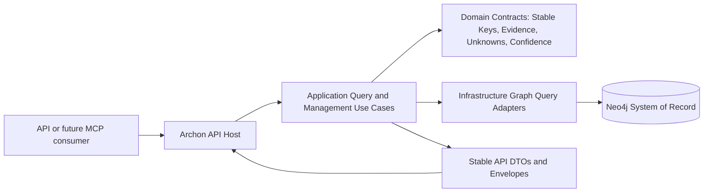

# Implementation Plan

| Field | Value |
| --- | --- |
| Work Package | WP014 - Query API Product Surface |
| Plan Output Path | `docs/014-Query-API-Product-Surface/implementation-plan-wp014-query-api-product-surface.md` |
| Related Specification | `docs/014-Query-API-Product-Surface/spec-wp014-query-api-product-surface.md` |
| Source Work Package | `docs/foundation/work-packages.md` WP014 |
| Mandatory Source-Code Documentation Gate | `./.github/instructions/documentation-pass.instructions.md` |
| Mandatory Wiki Maintenance Gate | `./.github/instructions/wiki.instructions.md` |
| Status | Draft implementation plan |

## Planning Principles and Non-Negotiable Execution Rules

WP014 delivers the HTTP-accessible query and controlled management product surface over Archon's persisted architecture graph. The implementation must be organized as vertical slices: every Work Item must leave the API host runnable and must expose at least one demonstrable end-to-end capability from HTTP request through application/query logic to persisted or stubbed data output, validation, logging, error handling, tests, and documentation/wiki review.

This plan intentionally avoids standalone architecture notes, implementation ledgers, implementation notes, or narrative completion artifacts. Contributor-facing design rationale, setup guidance, runtime behaviour, terminology, validation workflows, and operational guidance belong in `./wiki` according to `./.github/instructions/wiki.instructions.md`. The plan may record concise status and validation outcomes, but it must link to wiki pages instead of duplicating contributor-facing guidance.

Once execution starts on any active Work Item, the executor must continue uninterrupted until that Work Item is fully complete. A progress message, step announcement, failing build, failing test, missing import, ordinary refactor correction, documentation update, wiki review, or plan-record update is not a stopping point. The executor may stop only when the Work Item is complete, the user explicitly interrupts or changes direction, or a true blocker cannot be resolved from the specification, this plan, the codebase, or repository guidance.

All code-writing Work Items must follow `./.github/instructions/documentation-pass.instructions.md` as a hard Definition of Done gate. Every class, record, struct, interface, enum, method, constructor, and non-trivial local function introduced or modified by WP014 must receive developer-level comments. Public APIs must receive explicit XML documentation, including `<param>` entries for every public method and constructor parameter and `<typeparam>` entries for public generic parameters. Internal and other non-public types, constructors, and methods must receive explicit local documentation treatment as well. Properties whose meaning is not obvious from their names must be documented. Inline or block comments must explain purpose, logical flow, and any algorithms or bounded-query strategies used.

Every Work Item must perform a wiki impact review. If the slice changes or materially clarifies developer-facing behaviour, architecture, runtime composition, workflows, terminology, setup, validation, operational behaviour, or contributor guidance, the relevant wiki page must be updated before the Work Item is complete. `wiki/home.md` must remain a concise landing page and must not become a catch-all destination for detailed WP014 guidance. Dense architecture, runtime, workflow, setup, extension, and operational topics must be written in long-form, book-like narrative prose, with technical terms explained at first use or linked to a glossary entry, and with examples or walkthrough material where those materially improve understanding.

## Overall Project Structure

WP014 should preserve the repository's Onion Architecture dependency direction and existing solution structure:

- Production projects remain under `./src`.
- Test projects remain under `./test`.
- The Aspire orchestration project remains the host-composition entry point where applicable.
- API host composition belongs in the host layer.
- Query and management application contracts belong in the service/application layer.
- Neo4j-specific query adapters remain in infrastructure.
- Domain concepts, stable-key value objects, evidence references, unknowns, confidence, and result semantics remain inward-facing domain/service contracts and must not depend on infrastructure or host projects.
- API DTOs must expose stable Archon domain identities and snapshot identities, not Neo4j internal IDs.
- API documentation must use Scalar rather than Swagger UI if API documentation is surfaced through the host.

Suggested file organization must be confirmed against the actual repository before implementation, but the intended ownership is:

- `src/Archon.Api` or existing API host project: endpoint registration, route groups, request binding, authorization seams, Scalar/OpenAPI metadata, health/readiness endpoints.
- `src/Archon.Services` or existing services/query project: query and management use cases, common request normalization, snapshot selection, validation, pagination, filtering, sorting, response-size limits, application-level error results.
- `src/Archon.Infrastructure` or existing graph persistence project: Neo4j-backed query adapters, bounded traversal, evidence retrieval, lifecycle/retention operations, readiness probes.
- `src/Archon` or existing domain/contracts project: stable query contracts, evidence references, unknown/confidence models, page metadata, truncation metadata, error result semantics, domain-oriented value objects.
- `test/*`: API contract tests, service/query unit tests, infrastructure integration tests using existing graph repository test conventions, and host-level integration tests.
- `wiki/*`: current-state contributor guidance for query APIs, controlled management APIs, response contracts, operational workflows, and relevant terminology.

Naming conventions:

- Route groups should use stable plural nouns for API resource families where practical, such as `projects`, `dependencies`, `symbols`, `runtime`, `data-access`, `configuration`, `integrations`, `evidence`, `rules`, `findings`, `metrics`, `hotspots`, `diffs`, `search`, `repositories`, `solutions`, `snapshots`, and `operations`.
- DTO names should identify the API contract role, such as `ProjectCatalogueItemResponse`, `PagedResponse<T>`, `EvidenceReferenceResponse`, `UnknownResponse`, and `TruncationMetadataResponse`.
- Application query names should be intention-revealing, such as `GetProjectCatalogueQuery`, `GetDependencyPathQuery`, and `RegisterRepositoryCommand`.
- Tests should use contract-level names that describe observable API behavior rather than implementation details.

## Shared Definition of Done for Every Code-Writing Work Item

Each code-writing Work Item is complete only when all of the following are true:

- The implementation preserves Onion Architecture dependency direction.
- The API host remains runnable after the slice.
- The end-to-end route or operation introduced by the slice can be exercised through HTTP or the documented host entry point.
- Request validation, safe error handling, structured logging, cancellation flow, and response metadata are implemented for the slice.
- Responses use stable keys, snapshot metadata, evidence references, confidence, unknowns, warnings, pagination, filtering, sorting, and truncation metadata where applicable.
- Tests cover happy path, validation failure, not-found or conflict behaviour where applicable, secret-safety where applicable, and boundary/limit behaviour where applicable.
- `./.github/instructions/documentation-pass.instructions.md` is followed in full for every source file touched by the Work Item.
- Public API surface receives explicit local XML documentation, including parameters and type parameters.
- Internal and non-public implementation types, constructors, and methods receive developer-level documentation comments.
- Wiki review is completed according to `./.github/instructions/wiki.instructions.md`.
- Relevant wiki or repository guidance is updated, or a specific no-change review result is recorded.
- Any dense contributor-facing documentation uses book-like narrative depth, explains technical terms, and includes examples or walkthrough material where helpful.
- The Work Item execution record states which wiki pages were reviewed, updated, created, retired, or intentionally unchanged.
- No standalone implementation notes, implementation ledgers, or architecture-note markdown files are created for contributor-facing detail.
- `wiki/home.md` remains concise and only links to topic pages.
- The executor does not stop mid-Work Item except for full Work Item completion, explicit user interruption, or a true blocker.

## Validation Strategy

Implementation should run validation sequentially and verify each command succeeds before proceeding. Because repository guidance says not to run the full test suite for this work package, each Work Item should run targeted tests for the projects and behaviours changed by that slice, plus any build command required by the touched solution/project scope. If a documentation-only pass is performed over a specifically scoped set of source files, follow `./.github/instructions/documentation-pass.instructions.md` for that scoped pass while also respecting the work-package instruction not to run the full test suite unless repository guidance is explicitly changed.

Baseline validation commands must be finalized after inspecting the actual solution and project names. Expected forms include:

- `dotnet build .\Archon.slnx`
- `dotnet test <target-test-project> --filter <slice-specific-filter>`
- API host run command through the existing Aspire or API host entry point.
- HTTP smoke requests against the route group delivered by the Work Item.

## Query and Management Contract Baseline

Before building individual endpoint families, WP014 needs a common API contract baseline that all vertical slices reuse. This baseline is not a horizontal-only deliverable; it must include one minimal runnable endpoint so the pattern is proven through the host.

Common contract elements include:

- Response envelope with data, scope metadata, snapshot metadata, pagination metadata, applied filters, sort metadata, warnings, unknown summary, confidence summary, response-size/truncation metadata, and request/correlation metadata where available.
- Error contract for validation, not found, conflict, unauthorized, forbidden, and safe server errors.
- Snapshot selector model supporting explicit snapshot identity and deterministic latest/current resolution within repository and solution scope.
- Stable-key request binding and validation.
- Bounded page-size, traversal-depth, and response-size controls.
- Evidence reference model that points to persisted evidence without expanding unsafe source content.
- Secret-safety rules for source snippets, configuration, integrations, and error details.

## Vertical Slice Work Items

## 1. Bootstrap API Contract and First Runnable Query Slice

- [x] Work Item 1: Establish common API response contracts and a minimal dashboard-summary endpoint - Completed
  - **Purpose**: Create the first runnable WP014 end-to-end path and prove the route, validation, response envelope, snapshot metadata, logging, error handling, test, documentation, and wiki-review pattern before expanding the API surface.
  - **Acceptance Criteria**:
	- A dashboard-summary route exists in the API host and can return deterministic summary data for a selected or latest snapshot scope.
	- The route uses application/query abstractions and does not expose Neo4j implementation details.
	- The response uses a common envelope with snapshot identity, warnings, unknowns, pagination or non-paged metadata as appropriate, and safe error shape support.
	- Missing optional summary inputs are represented as warnings or unknowns instead of silently disappearing.
	- Targeted tests verify successful summary, invalid snapshot selector, missing scope, and safe error shape behaviour.
  - **Definition of Done**:
	- Code implemented for the vertical path: DTOs, route group, application query, persistence adapter or existing query integration, validation, logging, error handling, and tests.
	- `./.github/instructions/documentation-pass.instructions.md` followed for every touched source file, including comments on every class, method, constructor, relevant parameter, and non-obvious property.
	- Wiki review completed; relevant API/query overview guidance updated or explicit no-change result recorded.
	- Foundational documentation retains book-like narrative depth, defines API contract terms such as response envelope, snapshot selector, stable key, unknown, and confidence, and includes a short example response walkthrough if a wiki update is required.
	- Can execute end-to-end via the API host route documented during implementation.
	- Executor must not stop mid-Work Item; execution continues through implementation, validation, documentation/wiki review, and plan-record updates unless the Work Item is complete, the user explicitly interrupts, or a true blocker prevents further autonomous progress.
	- [x] Task 1: Inspect existing API host, services, infrastructure, tests, and wiki topic pages.
	- [x] Identify the actual host project, services/query project, infrastructure graph project, domain/contracts project, and relevant test projects.
	- [x] Identify existing response envelope, error handling, OpenAPI/Scalar, health, logging, validation, and graph repository conventions.
	- [x] Identify existing wiki pages that should receive current-state query API guidance.
  - [x] Task 2: Implement common contract primitives needed by the first endpoint.
	- [x] Add or reuse envelope, warning, unknown, confidence, pagination, truncation, evidence-reference, and error DTOs.
	- [x] Add or reuse request models for repository, solution, and snapshot selection.
	- [x] Document all public and internal source members according to `./.github/instructions/documentation-pass.instructions.md`.
  - [x] Task 3: Implement the dashboard-summary route end to end.
	- [x] Add host route registration with Scalar/OpenAPI metadata using repository API conventions.
	- [x] Add application query handling for repository, solution, snapshot, count, hotspot, and latest-change summary fields where persisted data exists.
	- [x] Add infrastructure query adapter or integrate with existing graph abstractions without leaking Neo4j IDs.
	- [x] Add structured logging and cancellation-token flow.
  - [x] Task 4: Add targeted tests.
	- [x] Test successful summary response contract.
	- [x] Test validation error for invalid snapshot or scope.
	- [x] Test unknown/warning output for missing optional data.
	- [x] Test that public assertions use stable keys and not Neo4j internal IDs.
  - [x] Task 5: Complete documentation and wiki review.
	- [x] Update source comments to meet the documentation-pass gate.
	- [x] Update the selected wiki topic page if the new API contract pattern changes contributor-facing guidance.
	- [x] Record pages reviewed, pages updated or intentionally unchanged, and the page-structure decision.
  - **Files**:
	- `src/<api-host-project>/*`: Route group and host registration for dashboard summary.
	- `src/<services-query-project>/*`: Dashboard summary query use case and shared contract handling.
	- `src/<infrastructure-project>/*`: Graph-backed summary query adapter if needed.
	- `src/<domain-or-contracts-project>/*`: Shared API response and query contract models if not already present.
	- `test/<api-or-services-test-project>/*`: Contract and service tests for the first slice.
	- `wiki/<selected-topic-page>.md`: Query API overview or related contributor guidance when required.
  - **Work Item Dependencies**: None beyond completed WP001-WP013 capabilities assumed by the WP014 specification.
  - **Run / Verification Instructions**:
	- Build the touched solution or projects.
	- Run targeted dashboard summary tests.
	- Start the API host through the repository-standard command.
	- Issue a GET request to the dashboard-summary endpoint with explicit and latest/current snapshot selectors.
  - **User Instructions**: Provide Neo4j/test graph configuration only if existing local integration-test conventions require it and it is not already available in repository setup guidance.
  - **Completion Record**:
	- Implemented the first WP014 vertical query slice with application-layer dashboard summary selector, validation/result contracts, deterministic dashboard query service, common non-paged API envelope DTOs, `GET /dashboard-summary` route registration, OpenAPI metadata, structured logging, cancellation flow, and safe validation/server error shaping.
	- Files touched: `src/Archon.Application/Dashboard/*`, `src/Archon.Api.Query/Contracts/*`, `src/Archon.Api.Query/QueryApiServiceCollectionExtensions.cs`, `src/Archon.Api.Query/QueryEndpointRouteBuilderExtensions.cs`, `test/Archon.Api.Query.Tests/QueryEndpointTests.cs`, `wiki/hotlist-and-findings.md`, `wiki/home.md`, and `wiki/glossary.md`.
	- Validation performed: `dotnet build D:\Dev\Archon\src\Archon.Application\Archon.Application.csproj`; `dotnet build D:\Dev\Archon\src\Archon.Api.Query\Archon.Api.Query.csproj`; `dotnet build D:\Dev\Archon\test\Archon.Api.Query.Tests\Archon.Api.Query.Tests.csproj`; `dotnet test D:\Dev\Archon\test\Archon.Api.Query.Tests\Archon.Api.Query.Tests.csproj --filter DashboardSummaryEndpoint`; `dotnet build D:\Dev\Archon\Archon.slnx`.
	- Wiki impact matrix: affected concepts were dashboard summary, common response envelope, snapshot selector, stable-key-only public identity, warning/unknown treatment for missing optional summary data, and controlled query reader flow. Pages reviewed: `wiki/home.md`, `wiki/hotlist-and-findings.md`, `wiki/graph-domain-model.md`, and `wiki/glossary.md`. Pages updated: `wiki/hotlist-and-findings.md`, `wiki/home.md`, and `wiki/glossary.md`. Pages created or retired: none. Pages intentionally unchanged: `wiki/graph-domain-model.md` remained unchanged because stable keys, confidence, unknown state, hotspots, metrics, and snapshot diff concepts were already covered there. Page-structure decision: `wiki/hotlist-and-findings.md` remains the correct topic page for controlled query guidance; no new page was required for the first dashboard summary slice; `wiki/home.md` remained a concise landing page and only its reader path was updated.

## 2. Project Catalogue and Project Detail Slice

- [x] Work Item 2: Implement project catalogue and project detail query APIs - Completed
  - **Purpose**: Expose the first broad architecture-object query family so API and later MCP consumers can discover projects, inspect project details, and follow project-level evidence without direct graph access.
  - **Acceptance Criteria**:
	- Project catalogue supports search, filters, deterministic sorting, pagination, and snapshot/repository/solution scoping.
	- Catalogue records include project identity, path, language, project type, target framework, SDK-style status, dependency counts, package count, endpoint count, data-access indicators, hotlist count, and risk indicators where data exists.
	- Project detail supports lookup by stable key or unambiguous project name.
	- Ambiguous name lookup returns a conflict/disambiguation response rather than choosing arbitrarily.
	- Detail responses include summary, responsibilities, evidence, entry points, references, dependents, packages, application type, endpoints, workers, data access, configuration keys, integrations, hotlist findings, scoped graph summary, unknowns, and confidence where available.
  - **Definition of Done**:
	- Code implemented for catalogue and detail endpoints from host route through service/query logic to graph-backed output.
	- Tests pass for catalogue, filters, paging, sorting, detail by key, detail by name, ambiguous name conflict, unknowns, and evidence references.
	- Logging, validation, cancellation, safe errors, and stable-key usage are complete.
	- `./.github/instructions/documentation-pass.instructions.md` followed for every touched source file.
	- Wiki review completed; project query contributor guidance updated or explicit no-change review recorded.
	- Any dense explanation defines catalogue, stable project key, responsibility, evidence reference, and scoped graph summary terms, with an example request/response walkthrough where helpful.
	- Can execute end-to-end via catalogue and detail HTTP routes.
	- Executor must not stop mid-Work Item except for full completion, explicit interruption, or true blocker.
	- [x] Task 1: Model project query contracts.
	- [x] Define or reuse request DTOs for catalogue filters, sort fields, page metadata, and snapshot scope.
	- [x] Define or reuse response DTOs for project catalogue items, project detail, risk indicators, responsibility summaries, and scoped graph summaries.
	- [x] Add documentation comments for all public and internal contract members.
  - [x] Task 2: Implement service/query handlers.
	- [x] Normalize search and filter inputs.
	- [x] Enforce deterministic default ordering.
	- [x] Resolve stable-key and unambiguous-name lookups.
	- [x] Convert graph results into API DTOs without leaking persistence details.
  - [x] Task 3: Implement API routes.
	- [x] Register project catalogue endpoint.
	- [x] Register project detail endpoint by stable key.
	- [x] Register project detail lookup by name only if it can return conflict/disambiguation safely.
  - [x] Task 4: Add tests.
	- [x] Add contract tests for catalogue fields and metadata.
	- [x] Add filter, search, sort, and pagination tests.
	- [x] Add detail response tests for full and partial data.
	- [x] Add ambiguous project-name conflict tests.
  - [x] Task 5: Complete wiki review.
	- [x] Review query API, graph domain, and glossary wiki pages.
	- [x] Update the correct topic page if project query concepts are new or materially clarified.
	- [x] Confirm `wiki/home.md` remains a landing page only.
  - **Files**:
	- `src/<api-host-project>/*`: Project route group.
	- `src/<services-query-project>/*`: Project catalogue/detail use cases.
	- `src/<infrastructure-project>/*`: Graph query adapter for project data.
	- `src/<contracts-project>/*`: Project DTOs and filters.
	- `test/<api-or-services-test-project>/*`: Project API contract and service tests.
	- `wiki/<selected-topic-page>.md`: Project query guidance if required.
  - **Work Item Dependencies**: Work Item 1.
  - **Run / Verification Instructions**:
	- Build touched projects.
	- Run targeted project query tests.
	- Start the API host and call project catalogue and detail routes with valid, invalid, and ambiguous inputs.
  - **User Instructions**: None expected beyond existing local graph/test setup.
  - **Completion Record**:
	- Implemented the WP014 project query slice with application-layer catalogue/detail query contracts, snapshot scope resolution, search, filters, deterministic sorting, paging, stable-key lookup, unambiguous-name lookup, ambiguous-name conflict/disambiguation, evidence references, risk indicators, responsibilities, scoped graph summaries, warnings, unknowns, safe metadata sanitation, route registration, logging, cancellation flow, validation problem responses, and safe server error shaping.
	- Files touched: `src/Archon.Application/Projects/*`, `src/Archon.Api.Query/Contracts/QueryPagedApiResponse.cs`, `src/Archon.Api.Query/Contracts/ProjectDisambiguationResponse.cs`, `src/Archon.Api.Query/QueryApiServiceCollectionExtensions.cs`, `src/Archon.Api.Query/QueryEndpointRouteBuilderExtensions.cs`, `test/Archon.Api.Query.Tests/QueryEndpointTests.cs`, `wiki/hotlist-and-findings.md`, `wiki/glossary.md`, and `wiki/home.md`.
	- Validation performed: `dotnet build D:\Dev\Archon\src\Archon.Application\Archon.Application.csproj`; `dotnet build D:\Dev\Archon\src\Archon.Api.Query\Archon.Api.Query.csproj`; `dotnet build D:\Dev\Archon\test\Archon.Api.Query.Tests\Archon.Api.Query.Tests.csproj`; `dotnet test D:\Dev\Archon\test\Archon.Api.Query.Tests\Archon.Api.Query.Tests.csproj --filter Project`; `dotnet build D:\Dev\Archon\Archon.slnx`.
	- Wiki impact matrix: affected concepts were project catalogue, project detail, stable project key lookup, unambiguous project-name lookup, ambiguous-name disambiguation, evidence references, risk indicators, responsibilities, scoped graph summary, project query paging/sorting/filtering, and stable-key-only public identity. Pages reviewed: `wiki/home.md`, `wiki/hotlist-and-findings.md`, `wiki/graph-domain-model.md`, and `wiki/glossary.md`. Pages updated: `wiki/hotlist-and-findings.md`, `wiki/home.md`, and `wiki/glossary.md`. Pages created or retired: none. Pages intentionally unchanged: `wiki/graph-domain-model.md` remained unchanged because project inventory facts, stable keys, evidence-first modeling, confidence, unknown state, and graph vocabulary were already covered there. Page-structure decision: `wiki/hotlist-and-findings.md` remains the correct controlled-query topic page for project catalogue/detail guidance; `wiki/glossary.md` is the correct central terminology page for new project-query terms; no new page was needed; `wiki/home.md` remained a concise landing page and received only reader-path and current-capability updates.

## 3. Dependency, Dependent, Graph Neighbourhood, and Path Slice

- [x] Work Item 3: Implement bounded dependency traversal and graph-neighbourhood APIs - Completed
  - **Purpose**: Provide safe, bounded graph exploration capabilities for direct dependencies, dependents, transitive traversal, dependency paths, and neighbourhoods while preserving stable keys, evidence, and truncation metadata.
  - **Acceptance Criteria**:
	- Direct dependency and direct dependent endpoints work for project or supported node stable keys.
	- Transitive dependency and dependent endpoints enforce maximum depth and result-size limits.
	- Dependency path queries return stable node and edge keys in path order or a no-path response that distinguishes no relationship from unavailable data.
	- Graph-neighbourhood queries default to depth 1, support direction and edge-kind filters, enforce maximum depth, and return truncation metadata when limits apply.
	- Evidence links are included where persisted for relationships.
  - **Definition of Done**:
	- End-to-end traversal endpoints implemented and bounded.
	- Tests cover direct traversal, transitive traversal, path found, path not found, unavailable data, depth validation, edge-kind filtering, truncation, and evidence references.
	- Query implementations avoid loading entire graph estates into memory for ordinary requests.
	- Structured logs distinguish validation failures, no-path results, and truncated results without exposing internals.
	- `./.github/instructions/documentation-pass.instructions.md` followed for all touched source.
	- Wiki review completed; graph traversal guidance updated or explicit no-change result recorded.
	- Dense graph terminology such as traversal, dependent, dependency path, edge kind, and truncation is defined with examples if documented.
	- Can execute end-to-end through HTTP traversal routes.
	- Executor must not stop mid-Work Item except for full completion, explicit interruption, or true blocker.
	- [x] Task 1: Define traversal request and response contracts.
	- [x] Add direction, depth, edge-kind, traversal-mode, and limit request models.
	- [x] Add graph node, graph edge, path, no-path, neighbourhood, and truncation response models.
	- [x] Document all contract members and non-obvious limit semantics.
  - [x] Task 2: Implement bounded query handlers.
	- [x] Enforce default depth 1 for neighbourhoods.
	- [x] Enforce maximum traversal depth and result-size limits.
	- [x] Preserve stable node and edge keys and evidence references.
	- [x] Return unavailable-data warnings when persisted graph support is incomplete.
  - [x] Task 3: Implement API routes.
	- [x] Register direct dependencies and dependents routes.
	- [x] Register transitive dependencies and dependents routes.
	- [x] Register dependency path route.
	- [x] Register graph-neighbourhood route.
  - [x] Task 4: Add tests.
	- [x] Test bounded traversal success cases.
	- [x] Test excessive depth and excessive result-size validation.
	- [x] Test truncation metadata.
	- [x] Test no-path and unavailable-data distinctions.
  - [x] Task 5: Complete wiki review.
	- [x] Review graph domain and query API wiki pages.
	- [x] Update traversal guidance if the route family changes contributor-facing API behaviour.
	- [x] Add glossary links for graph terminology if needed.
  - **Files**:
	- `src/<api-host-project>/*`: Dependency and graph route group.
	- `src/<services-query-project>/*`: Traversal use cases and limit policies.
	- `src/<infrastructure-project>/*`: Bounded graph traversal adapter.
	- `test/<api-or-services-test-project>/*`: Traversal contract and limit tests.
	- `wiki/<selected-topic-page>.md`: Graph traversal guidance if required.
  - **Work Item Dependencies**: Work Items 1 and 2.
  - **Run / Verification Instructions**:
	- Build touched projects.
	- Run targeted graph traversal tests.
	- Start API host and call direct, transitive, path, and neighbourhood routes against seeded graph data.
  - **User Instructions**: None expected beyond seeded graph/test data conventions.
  - **Completion Record**:
	- Implemented the WP014 bounded graph traversal slice with application-layer traversal contracts, stable node/edge/path DTOs, traversal validation codes, default neighbourhood depth, bounded transitive depth and result limits, controlled edge-kind filters, breadth-first dependency/dependent/neighbourhood traversal, dependency path search, no-path and unavailable-data response distinctions, truncation warnings/unknowns, stable evidence references, route registration, structured logging, cancellation flow, validation problem responses, and safe server error shaping.
	- Files touched: `src/Archon.Application/Traversal/*`, `src/Archon.Api.Query/QueryApiServiceCollectionExtensions.cs`, `src/Archon.Api.Query/QueryEndpointRouteBuilderExtensions.cs`, `test/Archon.Api.Query.Tests/QueryEndpointTests.cs`, `wiki/hotlist-and-findings.md`, `wiki/glossary.md`, and `wiki/home.md`.
	- Validation performed: `dotnet build D:\Dev\Archon\src\Archon.Application\Archon.Application.csproj`; `dotnet build D:\Dev\Archon\src\Archon.Api.Query\Archon.Api.Query.csproj`; `dotnet build D:\Dev\Archon\test\Archon.Api.Query.Tests\Archon.Api.Query.Tests.csproj`; `dotnet test D:\Dev\Archon\test\Archon.Api.Query.Tests\Archon.Api.Query.Tests.csproj --filter GraphTraversal`; `dotnet test D:\Dev\Archon\test\Archon.Api.Query.Tests\Archon.Api.Query.Tests.csproj --filter DependencyPath`; `dotnet test D:\Dev\Archon\test\Archon.Api.Query.Tests\Archon.Api.Query.Tests.csproj --filter GraphNeighbourhood`; `dotnet test D:\Dev\Archon\test\Archon.Api.Query.Tests\Archon.Api.Query.Tests.csproj --filter "GraphTraversal|DependencyPath|GraphNeighbourhood"`.
	- Wiki impact matrix: affected concepts were bounded graph traversal, direct dependency reads, direct dependent reads, transitive traversal, graph neighbourhood, dependency path, edge-kind filters, traversal depth, result-size truncation, evidence references, no-path results, unavailable graph data, and stable-key-only public identity. Pages reviewed: `wiki/home.md`, `wiki/hotlist-and-findings.md`, `wiki/graph-domain-model.md`, and `wiki/glossary.md`. Pages updated: `wiki/hotlist-and-findings.md`, `wiki/glossary.md`, and `wiki/home.md`. Pages created or retired: none. Pages intentionally unchanged: `wiki/graph-domain-model.md` remained unchanged because graph facts, stable keys, evidence-first modeling, dependency-like edge vocabulary, bounded traversal metrics, cycle paths, truncation, confidence, and unknown state were already covered there. Page-structure decision: `wiki/hotlist-and-findings.md` remains the correct controlled-query topic page for traversal route behavior; `wiki/glossary.md` is the correct central terminology page for traversal terms; no new page was needed; `wiki/home.md` remained a concise landing page and received only reader-path and current-capability updates.

## 4. Symbol Query and Usage Slice

- [x] Work Item 4: Implement symbol lookup, symbol detail, and symbol usage APIs - Completed
  - **Purpose**: Expose persisted Roslyn semantic facts through stable HTTP contracts so consumers can find symbols, inspect details, and discover usages with evidence and unresolved-symbol unknowns.
  - **Acceptance Criteria**:
	- Symbol lookup supports stable-key lookup and search-text lookup.
	- Symbol search supports project, kind, namespace, containing type, language, and snapshot filters where data exists.
	- Symbol detail includes stable symbol key, name, fully qualified name, kind, containing project, source context, evidence, related relationships, confidence, and unknowns.
	- Symbol usage queries identify referencing or calling nodes where persisted and include file path, line range, snippet preview, confidence, and snapshot context where evidence exists.
	- Unresolved or partial symbol data is represented as unknowns rather than implied completeness.
  - **Definition of Done**:
	- End-to-end symbol endpoints implemented through query abstractions.
	- Tests cover lookup by key, search, filters, detail, usages, unresolved symbol unknowns, evidence, and snippet bounds.
	- Evidence snippets treat source text as untrusted and remain safely bounded.
	- `./.github/instructions/documentation-pass.instructions.md` followed for all touched source.
	- Wiki review completed; Roslyn semantic query guidance updated or no-change outcome recorded.
	- Technical terms such as symbol, fully qualified name, source context, usage, unresolved symbol, and confidence are defined where documented.
	- Can execute end-to-end through symbol HTTP routes.
	- Executor must not stop mid-Work Item except for full completion, explicit interruption, or true blocker.
	- [x] Task 1: Define symbol contracts.
	- [x] Add lookup, search, detail, usage, source context, and unresolved-symbol response models.
	- [x] Add filters and deterministic sort fields.
	- [x] Add documentation for parameters and non-obvious properties.
  - [x] Task 2: Implement symbol query handlers.
	- [x] Resolve stable-key lookup.
	- [x] Implement search with bounded pagination.
	- [x] Map persisted semantic relationships to API responses.
	- [x] Preserve unknowns for unresolved semantic facts.
  - [x] Task 3: Implement API routes.
	- [x] Register symbol search endpoint.
	- [x] Register symbol detail endpoint.
	- [x] Register symbol usage endpoint.
  - [x] Task 4: Add tests.
	- [x] Test search and filtering.
	- [x] Test detail response shape.
	- [x] Test usage evidence and snippet bounds.
	- [x] Test unresolved unknown behaviour.
  - [x] Task 5: Complete wiki review.
	- [x] Review semantic extraction and query API pages.
	- [x] Update current-state guidance if symbol query usage is contributor-facing.
	- [x] Confirm cross-links to glossary or graph domain pages.
  - **Files**:
	- `src/<api-host-project>/*`: Symbol route group.
	- `src/<services-query-project>/*`: Symbol lookup/detail/usage use cases.
	- `src/<infrastructure-project>/*`: Graph-backed symbol query adapter.
	- `test/<api-or-services-test-project>/*`: Symbol API and service tests.
	- `wiki/<selected-topic-page>.md`: Symbol query guidance if required.
  - **Work Item Dependencies**: Work Items 1 and 2.
  - **Run / Verification Instructions**:
	- Build touched projects.
	- Run targeted symbol query tests.
	- Start API host and call symbol search, detail, and usage routes.
  - **User Instructions**: None expected.
  - **Completion Record**:
	- Implemented the WP014 symbol query slice with application-layer symbol contracts, bounded search, stable-key and exact search-text detail lookup, usage direction handling, repository/solution/snapshot selector resolution, stable symbol/source/evidence/relationship DTOs, unresolved-symbol unknown handling, bounded snippet previews, route registration, DI registration, structured logging, cancellation flow, validation problem responses, and safe server error shaping.
	- Files touched: `src/Archon.Application/Symbols/*`, `src/Archon.Api.Query/QueryApiServiceCollectionExtensions.cs`, `src/Archon.Api.Query/QueryEndpointRouteBuilderExtensions.cs`, `test/Archon.Api.Query.Tests/QueryEndpointTests.cs`, `wiki/hotlist-and-findings.md`, `wiki/glossary.md`, and `wiki/home.md`.
	- Validation performed: `dotnet build D:\Dev\Archon\src\Archon.Application\Archon.Application.csproj`; `dotnet build D:\Dev\Archon\src\Archon.Api.Query\Archon.Api.Query.csproj`; `dotnet build D:\Dev\Archon\test\Archon.Api.Query.Tests\Archon.Api.Query.Tests.csproj`; `dotnet test D:\Dev\Archon\test\Archon.Api.Query.Tests\Archon.Api.Query.Tests.csproj --filter Symbol`; `dotnet test D:\Dev\Archon\test\Archon.Api.Query.Tests\Archon.Api.Query.Tests.csproj --filter "SymbolSearch|SymbolDetail|SymbolUsage"`.
	- Wiki impact matrix: affected concepts were symbol search, symbol detail, symbol usage, fully qualified name, source context, bounded snippet preview, unresolved symbol unknowns, semantic relationship evidence, stable symbol keys, and controlled Roslyn semantic query behavior. Pages reviewed: `wiki/home.md`, `wiki/hotlist-and-findings.md`, `wiki/glossary.md`, and the existing Roslyn semantic extraction reader path. Pages updated: `wiki/hotlist-and-findings.md`, `wiki/glossary.md`, and `wiki/home.md`. Pages created or retired: none. Pages intentionally unchanged: the Roslyn semantic extraction topic remained the extraction-side source of truth and did not need query-route detail duplicated into it. Page-structure decision: `wiki/hotlist-and-findings.md` remains the correct controlled-query topic page for symbol API behavior; `wiki/glossary.md` is the correct central terminology page for new symbol-query terms; no new page was needed; `wiki/home.md` remained a concise landing page and received only reader-path and current-capability updates.

## 5. Endpoint, Runtime, and Worker Slice

- [x] Work Item 5: Implement runtime endpoint, controller/handler, entry-point, and worker query APIs - Completed
  - **Purpose**: Expose API, service-host, worker, hosted-service, background-service, queue/topic consumer, and scheduled-job facts so consumers can inspect runtime behaviour without a UI.
  - **Acceptance Criteria**:
	- Endpoint lookup supports filters for HTTP method, route, project, controller or handler, authorization attribute, and snapshot where available.
	- Endpoint records include method, route, project, controller/handler/action/method, request DTO, response DTO, authorization attributes, services used, data context usage, configuration keys, and evidence where available.
	- Controller or handler lookup exists where facts are persisted separately from endpoints.
	- Runtime entry-point lookup works for API, worker, console, and service-host style entry points where extracted.
	- Worker lookup includes project, entry point, hosted services, background services, queue/topic consumers, scheduled jobs, data access, integrations, configuration keys, and evidence where available.
  - **Definition of Done**:
	- Runtime and worker endpoints implemented end to end.
	- Tests cover endpoint filters, controller/handler lookup, runtime entry points, worker filters, queue/topic consumers, scheduled jobs, partial runtime unknowns, and evidence.
	- No Archon Discovery UI pages, components, or front-end assets are introduced.
	- `./.github/instructions/documentation-pass.instructions.md` followed for all touched source.
	- Wiki review completed; runtime query guidance updated or explicit no-change result recorded.
	- Dense runtime terms such as entry point, hosted service, background service, queue consumer, and scheduled job are defined with examples where documented.
	- Can execute end-to-end through runtime and worker HTTP routes.
	- Executor must not stop mid-Work Item except for full completion, explicit interruption, or true blocker.
	- [x] Task 1: Define runtime and worker contracts.
	- [x] Add endpoint, controller/handler, runtime entry-point, worker, hosted-service, queue/topic, and scheduled-job DTOs.
	- [x] Add filters and response metadata.
	- [x] Document DTOs and public/internal members per documentation-pass rules.
  - [x] Task 2: Implement runtime query handlers.
	- [x] Implement endpoint lookup and filtering.
	- [x] Implement controller/handler lookup where persisted separately.
	- [x] Implement runtime entry-point lookup.
  - [x] Task 3: Implement worker query handlers.
	- [x] Implement worker lookup and filters.
	- [x] Map worker data-access, integration, configuration, and evidence facts.
	- [x] Preserve unknowns for incomplete extraction.
  - [x] Task 4: Implement API routes.
	- [x] Register endpoint lookup routes.
	- [x] Register controller/handler routes where supported.
	- [x] Register runtime entry-point routes.
	- [x] Register worker lookup routes.
  - [x] Task 5: Add tests and documentation/wiki review.
	- [x] Add targeted API and service tests.
	- [x] Verify no UI assets were added.
	- [x] Review and update runtime wiki guidance if required.
  - **Files**:
	- `src/<api-host-project>/*`: Runtime and worker route groups.
	- `src/<services-query-project>/*`: Runtime and worker use cases.
	- `src/<infrastructure-project>/*`: Graph-backed runtime query adapters.
	- `test/<api-or-services-test-project>/*`: Runtime and worker tests.
	- `wiki/<selected-topic-page>.md`: Runtime query guidance if required.
  - **Work Item Dependencies**: Work Items 1, 2, and 4 where runtime facts reference symbols.
  - **Run / Verification Instructions**:
	- Build touched projects.
	- Run targeted runtime and worker query tests.
	- Start API host and call endpoint, runtime entry-point, and worker routes.
  - **User Instructions**: None expected.
  - **Completion Record**:
	- Implemented the WP014 runtime query slice with application-layer runtime contracts, endpoint lookup filters and deterministic ordering, controller/handler detail lookup, runtime entry-point projection for API/worker/console/service-host style projects, worker hosted-service/background-service/queue/topic/scheduled-job projection, safe evidence references, data-access/integration/configuration indicators, explicit unknown promotion for partial worker extraction, route registration, DI registration, structured logging, cancellation flow, validation problem responses, and safe server error shaping.
	- Files touched: `src/Archon.Application/Runtime/*`, `src/Archon.Api.Query/QueryApiServiceCollectionExtensions.cs`, `src/Archon.Api.Query/QueryEndpointRouteBuilderExtensions.cs`, `test/Archon.Api.Query.Tests/QueryEndpointTests.cs`, `wiki/hotlist-and-findings.md`, `wiki/glossary.md`, and `wiki/home.md`.
	- Validation performed: `dotnet build D:\Dev\Archon\src\Archon.Application\Archon.Application.csproj`; `dotnet build D:\Dev\Archon\src\Archon.Api.Query\Archon.Api.Query.csproj`; `dotnet build D:\Dev\Archon\test\Archon.Api.Query.Tests\Archon.Api.Query.Tests.csproj`; `dotnet test D:\Dev\Archon\test\Archon.Api.Query.Tests\Archon.Api.Query.Tests.csproj --filter Runtime`; `dotnet build D:\Dev\Archon\Archon.slnx`.
	- Wiki impact matrix: affected concepts were runtime query, runtime endpoint, controller/handler detail, runtime entry point, hosted service, background service, queue consumer, topic consumer, scheduled job, worker unknowns, stable-key-only public identity, bounded runtime paging, and no-Discovery-UI runtime inspection. Pages reviewed: `wiki/home.md`, `wiki/hotlist-and-findings.md`, `wiki/glossary.md`, `wiki/runtime-foundation.md`, and `wiki/graph-domain-model.md`. Pages updated: `wiki/hotlist-and-findings.md`, `wiki/glossary.md`, and `wiki/home.md`. Pages created or retired: none. Pages intentionally unchanged: `wiki/runtime-foundation.md` remained focused on runtime extraction/runtime hosting foundations rather than query-route behavior; `wiki/graph-domain-model.md` already covered stable keys, evidence, confidence, unknown state, and graph fact terminology. Page-structure decision: `wiki/hotlist-and-findings.md` remains the correct controlled-query topic page for runtime API behavior; `wiki/glossary.md` is the correct central terminology page for runtime query terms; no new page was needed; `wiki/home.md` remained a concise landing page and received only reader-path and current-capability updates.

## 6. Data Access, Configuration, External Integration, and UI-Technology Fact Slice

- [x] Work Item 6: Implement data-access, configuration, integration, and UI-technology fact query APIs - Completed
  - **Purpose**: Expose architecture facts for persistence technologies, configuration usage, external integrations, and .NET UI-technology facts through safe API contracts for API and future MCP consumers.
  - **Acceptance Criteria**:
	- Data-access queries support available LINQ to SQL, EF Classic/EF6, EF Core, ADO.NET, typed DataSet, raw SQL, stored procedure, entity, table, usage-site, SubmitChanges, ExecuteQuery, and ExecuteCommand facts.
	- Configuration usage queries support filters by configuration key, project, consumer node, provider, environment, source file, and snapshot where available.
	- Configuration responses expose safe key metadata and never expose secret values.
	- Integration queries support filters by project, integration kind, endpoint host or service name where safe, protocol, client type, configuration key, and snapshot.
	- Integration responses avoid secrets, credentials, tokens, and connection strings.
	- UI-technology fact queries expose backend facts for Blazor, Razor, Windows Forms, WPF, WinUI, .NET MAUI, and Avalonia where extracted, without creating Discovery UI assets.
  - **Definition of Done**:
	- End-to-end endpoints implemented for all available fact families in this slice.
	- Tests cover each persisted data-access family available from earlier work packages, configuration secret-safety, integration secret-safety, UI-technology query output, filters, evidence, confidence, and unknowns.
	- No UI page, UI component, or frontend asset is introduced.
	- `./.github/instructions/documentation-pass.instructions.md` followed for all touched source.
	- Wiki review completed; data/configuration/integration/UI fact guidance updated or no-change result recorded.
	- Dense terms such as DataContext, configuration provider, external integration, protocol, and UI-technology fact are defined where documented, with examples where useful.
	- Can execute end-to-end through data-access, configuration, integration, and UI-technology HTTP routes.
	- Executor must not stop mid-Work Item except for full completion, explicit interruption, or true blocker.
	- [x] Task 1: Define fact-query contracts.
	- [x] Add data-access family DTOs and filters.
	- [x] Add configuration usage DTOs and safe metadata models.
	- [x] Add integration DTOs and safe target metadata models.
	- [x] Add UI-technology fact DTOs and filters.
  - [x] Task 2: Implement query handlers.
	- [x] Implement data-access family queries over persisted facts.
	- [x] Implement configuration usage queries with secret-safety rules.
	- [x] Implement external integration queries with secret-safety rules.
	- [x] Implement UI-technology fact queries as backend API data only.
  - [x] Task 3: Implement API routes.
	- [x] Register data-access routes.
	- [x] Register configuration usage routes.
	- [x] Register integration routes.
	- [x] Register UI-technology fact routes.
  - [x] Task 4: Add tests.
	- [x] Test data-access family responses using available seeded facts.
	- [x] Test configuration filtering and secret-safety.
	- [x] Test integration filtering and secret-safety.
	- [x] Test UI-technology facts and absence of Discovery UI changes.
  - [x] Task 5: Complete wiki review.
	- [x] Review persistence, configuration, integration, UI extraction, query API, and glossary pages.
	- [x] Update correct topic pages if contributor-facing behaviour or terminology changed.
	- [x] Confirm cross-links and home-page constraints.
  - **Files**:
	- `src/<api-host-project>/*`: Fact query route groups.
	- `src/<services-query-project>/*`: Data/configuration/integration/UI fact use cases.
	- `src/<infrastructure-project>/*`: Graph-backed fact query adapters.
	- `test/<api-or-services-test-project>/*`: Fact query tests.
	- `wiki/<selected-topic-page>.md`: Fact query guidance if required.
  - **Work Item Dependencies**: Work Items 1, 2, and 5 where facts reference projects or runtime nodes.
  - **Run / Verification Instructions**:
	- Build touched projects.
	- Run targeted fact-query tests.
	- Start API host and call data-access, configuration, integration, and UI-technology fact routes.
  - **User Instructions**: None expected.
  - **Completion Record**:
	- Implemented the WP014 fact-query slice with application-layer fact contracts, selector validation, bounded paging, data-access family projection, safe configuration metadata projection, safe integration host and credential redaction, backend-only UI-technology projection, evidence stable-key projection, confidence and unknown-state propagation, route registration, DI registration, structured logging, cancellation flow, validation problem responses, and safe server error shaping.
	- Files touched: `src/Archon.Application/Facts/*`, `src/Archon.Api.Query/QueryApiServiceCollectionExtensions.cs`, `src/Archon.Api.Query/QueryEndpointRouteBuilderExtensions.cs`, `test/Archon.Api.Query.Tests/QueryEndpointTests.cs`, `wiki/hotlist-and-findings.md`, `wiki/glossary.md`, and `wiki/home.md`.
	- Validation performed: `dotnet build D:\Dev\Archon\src\Archon.Application\Archon.Application.csproj`; `dotnet build D:\Dev\Archon\src\Archon.Api.Query\Archon.Api.Query.csproj`; `dotnet build D:\Dev\Archon\test\Archon.Api.Query.Tests\Archon.Api.Query.Tests.csproj`; `dotnet test D:\Dev\Archon\test\Archon.Api.Query.Tests\Archon.Api.Query.Tests.csproj --filter Fact`; `dotnet build D:\Dev\Archon\Archon.slnx`.
	- Wiki impact matrix: affected concepts were fact query, data-access fact, DataContext/DbContext query output, configuration provider, secret-safe configuration usage, external integration, protocol, safe endpoint host metadata, UI-technology fact, backend-only UI fact query behavior, bounded fact paging, stable fact keys, confidence, evidence references, and unknown-state reporting. Pages reviewed: `wiki/home.md`, `wiki/hotlist-and-findings.md`, `wiki/glossary.md`, `wiki/data-access-extraction.md`, `wiki/configuration-and-dependency-injection-extraction.md`, `wiki/external-integration-extraction.md`, and `wiki/dotnet-ui-client-extraction.md`. Pages updated: `wiki/hotlist-and-findings.md`, `wiki/glossary.md`, and `wiki/home.md`. Pages created or retired: none. Pages intentionally unchanged: the extraction-specific pages remained source-of-truth pages for how facts are extracted and did not need query-route behavior duplicated into them. Page-structure decision: `wiki/hotlist-and-findings.md` remains the correct controlled-query topic page for fact-query API behavior; `wiki/glossary.md` is the correct central terminology page for new dense terms; no new page was needed; `wiki/home.md` remained a concise landing page and received only reader-path and current-capability updates.

## 7. Evidence Drill-Down Slice

- [x] Work Item 7: Implement evidence lookup and evidence relationship APIs - Completed
  - **Purpose**: Provide drill-down from every evidence-backed API claim to persisted source evidence without unsafe source expansion or secret leakage.
  - **Acceptance Criteria**:
	- Evidence lookup by evidence stable key returns file path, line range, symbol, snippet preview, finding/rule context, snapshot identity, confidence, classification, and unknown-reason data where available.
	- Evidence lookup by related node, edge, finding, metric, or rule result works where relationships exist.
	- Snippet previews are bounded and do not expand beyond persisted evidence context unless explicitly supported by the evidence model and tested.
	- Evidence responses treat source text as untrusted and avoid secrets where secret-safety rules apply.
  - **Definition of Done**:
	- Evidence endpoints implemented end to end.
	- Existing endpoint families can link to evidence lookup through stable evidence references.
	- Tests cover lookup by key, lookup by related record, snippet bounds, missing evidence, unknown-reason data, and secret-safety.
	- `./.github/instructions/documentation-pass.instructions.md` followed for all touched source.
	- Wiki review completed; evidence model/query guidance updated or explicit no-change result recorded.
	- Terms such as evidence, snippet preview, classification, confidence, and unknown reason are explained where documented.
	- Can execute end-to-end through evidence HTTP routes.
	- Executor must not stop mid-Work Item except for full completion, explicit interruption, or true blocker.
	- [x] Task 1: Define evidence contracts.
	- [x] Add evidence detail, related-evidence query, snippet preview, classification, and unknown-reason DTOs.
	- [x] Document size limits and safe-content expectations.
  - [x] Task 2: Implement evidence query handlers.
	- [x] Resolve evidence stable keys.
	- [x] Resolve related evidence from nodes, edges, findings, metrics, and rule results.
	- [x] Enforce snippet bounds and safe expansion rules.
  - [x] Task 3: Implement API routes.
	- [x] Register evidence detail route.
	- [x] Register related-evidence route.
  - [x] Task 4: Add tests.
	- [x] Test evidence detail fields.
	- [x] Test relationship traversal.
	- [x] Test snippet bounds and unavailable snippets.
	- [x] Test safe error messages.
  - [x] Task 5: Complete wiki review.
	- [x] Review graph domain, evidence, and query API pages.
	- [x] Update current-state evidence query guidance if required.
	- [x] Add glossary links if evidence terms are not already defined.
  - **Files**:
	- `src/<api-host-project>/*`: Evidence route group.
	- `src/<services-query-project>/*`: Evidence query use cases.
	- `src/<infrastructure-project>/*`: Evidence graph adapter.
	- `test/<api-or-services-test-project>/*`: Evidence tests.
	- `wiki/<selected-topic-page>.md`: Evidence guidance if required.
  - **Work Item Dependencies**: Work Items 1 through 6.
  - **Run / Verification Instructions**:
	- Build touched projects.
	- Run targeted evidence tests.
	- Start API host and call evidence lookup routes by stable key and related record.
  - **User Instructions**: None expected.
  - **Completion Record**:
	- Implemented the WP014 evidence drill-down slice with application-layer evidence contracts, snapshot scope resolution, evidence stable-key lookup, related-evidence lookup from node/edge/finding/metric/rule identities, bounded snippet previews, secret-like preview redaction, sanitized evidence metadata, confidence/classification/unknown-reason projection, finding/rule context projection, route registration, DI registration, structured logging, cancellation flow, validation problem responses, and safe server error shaping.
	- Files touched: `src/Archon.Application/Evidence/*`, `src/Archon.Api.Query/QueryApiServiceCollectionExtensions.cs`, `src/Archon.Api.Query/QueryEndpointRouteBuilderExtensions.cs`, `test/Archon.Api.Query.Tests/QueryEndpointTests.cs`, `wiki/hotlist-and-findings.md`, `wiki/glossary.md`, and `wiki/home.md`.
	- Validation performed: `dotnet build D:\Dev\Archon\src\Archon.Application\Archon.Application.csproj`; `dotnet build D:\Dev\Archon\src\Archon.Api.Query\Archon.Api.Query.csproj`; `dotnet build D:\Dev\Archon\test\Archon.Api.Query.Tests\Archon.Api.Query.Tests.csproj`; `dotnet test D:\Dev\Archon\test\Archon.Api.Query.Tests\Archon.Api.Query.Tests.csproj --filter Evidence`; `dotnet build D:\Dev\Archon\Archon.slnx`.
	- Wiki impact matrix: affected concepts were evidence drill-down, related-evidence lookup, stable evidence key lookup, snippet preview, source-text bounds, secret-like preview redaction, classification, unknown reason, finding/rule evidence context, stable-key-only public identity, and no source-file expansion. Pages reviewed: `wiki/home.md`, `wiki/hotlist-and-findings.md`, `wiki/graph-domain-model.md`, and `wiki/glossary.md`. Pages updated: `wiki/hotlist-and-findings.md`, `wiki/glossary.md`, and `wiki/home.md`. Pages created or retired: none. Pages intentionally unchanged: `wiki/graph-domain-model.md` remained unchanged because core evidence, confidence, stable key, graph fact, and unknown-state model guidance was already current; the new behavior belongs to controlled query API guidance rather than graph-domain modeling. Page-structure decision: `wiki/hotlist-and-findings.md` remains the correct controlled-query topic page for evidence drill-down behavior; `wiki/glossary.md` is the correct central terminology page for new evidence-query terms; no new page was needed; `wiki/home.md` remained a concise landing page and received only reader-path and current-capability updates.

## 8. Rules, Findings, Metrics, Hotspots, Architecture Rule Results, and Cycles Slice

- [x] Work Item 8: Implement rule, finding, metric, hotspot, architecture-rule result, and cycle query APIs - Completed
  - **Purpose**: Expose analysis outputs from rule, finding, metric, hotspot, and architecture checks through stable, pageable, evidence-backed API contracts.
  - **Acceptance Criteria**:
	- Rule catalog queries support rule code, version, category, severity, enabled status, and snapshot/current catalog context where applicable.
	- Finding and hotlist queries support critical-only, legacy data access, out-of-support, security-sensitive, framework-only, project, technology, severity, status, rule code, affected node, and snapshot filters.
	- Metric queries support project, graph, modernization, and snapshot metrics with stable keys, fingerprints, values, units, metadata, confidence, unknowns, and evidence where available.
	- Hotspot queries expose target, category, score/rank, contributing metrics, findings, evidence, confidence, and unknowns.
	- Architecture-rule result and cycle queries expose rule identity, target nodes/edges, status, severity, cycle path order, related metrics, evidence, and truncation metadata.
  - **Definition of Done**:
	- All query endpoints in this family are implemented through query abstractions.
	- Tests cover rule filters, finding filters/statuses, hotlist, metrics, hotspots, architecture-rule results, cycles, pagination, sorting, evidence, unknowns, and truncation.
	- Rule/finding responses use stable rule and finding identities and do not expose persistence internals.
	- `./.github/instructions/documentation-pass.instructions.md` followed for all touched source.
	- Wiki review completed; rule/finding/metric contributor guidance updated or no-change result recorded.
	- Dense terms such as hotlist, metric, hotspot, architecture rule, cycle, fingerprint, and suppression are defined where documented, with examples where useful.
	- Can execute end-to-end through rule, finding, metric, hotspot, architecture-rule result, and cycle HTTP routes.
	- Executor must not stop mid-Work Item except for full completion, explicit interruption, or true blocker.
	- [x] Task 1: Define analysis-output contracts.
	- [x] Add rule catalog DTOs and filters.
	- [x] Add finding and hotlist DTOs and filters.
	- [x] Add metric, hotspot, architecture-rule result, and cycle DTOs.
	- [x] Document all public and internal members.
  - [x] Task 2: Implement query handlers.
	- [x] Implement rule catalog query.
	- [x] Implement finding and hotlist query.
	- [x] Implement metric and hotspot query.
	- [x] Implement architecture-rule result and cycle query.
  - [x] Task 3: Implement API routes.
	- [x] Register rule routes.
	- [x] Register finding and hotlist routes.
	- [x] Register metric and hotspot routes.
	- [x] Register architecture-rule result and cycle routes.
  - [x] Task 4: Add tests.
	- [x] Test filters, paging, sorting, and search.
	- [x] Test active/suppressed/resolved/historical finding statuses where persisted.
	- [x] Test cycle truncation metadata.
	- [x] Test evidence and unknowns.
  - [x] Task 5: Complete wiki review.
	- [x] Review rule catalog, findings, metrics, graph, and query API pages.
	- [x] Update correct topic pages if the implemented API changes contributor-facing guidance.
	- [x] Confirm glossary and cross-links.
  - **Files**:
	- `src/<api-host-project>/*`: Analysis query route groups.
	- `src/<services-query-project>/*`: Rule/finding/metric/hotspot/cycle use cases.
	- `src/<infrastructure-project>/*`: Graph-backed analysis query adapters.
	- `test/<api-or-services-test-project>/*`: Analysis-output tests.
	- `wiki/<selected-topic-page>.md`: Analysis-output guidance if required.
  - **Work Item Dependencies**: Work Items 1, 2, 3, and 7.
  - **Run / Verification Instructions**:
	- Build touched projects.
	- Run targeted analysis-output tests.
	- Start API host and call rule, finding, metric, hotspot, architecture-rule, and cycle routes.
  - **User Instructions**: None expected.
  - **Completion Record**:
	- Implemented the WP014 analysis-output query slice with expanded finding/hotlist filters for critical-only, legacy data access, out-of-support, security-sensitive, framework-only, technology, and rule code; preserved rule catalog, metric, hotspot, architecture-rule result, and cycle route families; and kept all public output on stable identities, evidence references, confidence, unknowns, fingerprints, paging, sorting, and truncation metadata where applicable.
	- Files touched: `src/Archon.Application/Rules/HotlistQuery.cs`, `src/Archon.Application/Rules/InMemoryHotlistQueryStore.cs`, `src/Archon.Api.Query/QueryEndpointRouteBuilderExtensions.cs`, `src/Archon.Infrastructure.Neo4j/Persistence/Neo4jHotlistQueryStore.cs`, `test/Archon.Api.Query.Tests/QueryEndpointTests.cs`, `wiki/hotlist-and-findings.md`, `wiki/glossary.md`, and `wiki/home.md`.
	- Validation performed: `dotnet build D:\Dev\Archon\src\Archon.Application\Archon.Application.csproj`; `dotnet build D:\Dev\Archon\src\Archon.Api.Query\Archon.Api.Query.csproj`; `dotnet build D:\Dev\Archon\src\Archon.Infrastructure.Neo4j\Archon.Infrastructure.Neo4j.csproj`; `dotnet build D:\Dev\Archon\test\Archon.Api.Query.Tests\Archon.Api.Query.Tests.csproj`; `dotnet test D:\Dev\Archon\test\Archon.Api.Query.Tests\Archon.Api.Query.Tests.csproj --filter "RuleCatalogEndpoint|HotlistEndpoint|FindingEndpoints|MetricsEndpoint|HotspotsEndpoint|ArchitectureRulesEndpoint|CyclesEndpoint"`; `dotnet build D:\Dev\Archon\Archon.slnx`.
	- Wiki impact matrix: affected concepts were rule catalog filters, finding and hotlist indicator filters, critical-only selection, legacy data-access findings, out-of-support findings, security-sensitive findings, framework-only findings, technology filtering, rule-code filtering, evidence-backed findings, metric reads, hotspot reads, architecture-rule result reads, dependency-cycle reads, fingerprints, and stable-key-only public identity. Pages reviewed: `wiki/home.md`, `wiki/hotlist-and-findings.md`, `wiki/graph-domain-model.md`, and `wiki/glossary.md`. Pages updated: `wiki/hotlist-and-findings.md`, `wiki/glossary.md`, and `wiki/home.md`. Pages created or retired: none. Pages intentionally unchanged: `wiki/graph-domain-model.md` remained unchanged because graph fact, metric, finding, evidence, confidence, unknown state, stable key, and fingerprint concepts were already covered there; Work Item 8 changed controlled query behavior rather than the graph-domain model. Page-structure decision: `wiki/hotlist-and-findings.md` remains the correct controlled-query topic page for rule/finding/metric/hotspot/architecture-rule/cycle guidance; `wiki/glossary.md` remains the correct central terminology page for new or clarified terms; no new page was needed; `wiki/home.md` remained a concise landing page and received only current-capability alignment.

## 9. Snapshot Diff and Cross-Domain Search Slice

- [x] Work Item 9: Implement snapshot diff and MCP-oriented search APIs - Completed
  - **Purpose**: Expose deterministic snapshot comparison and broad search capabilities required by direct API users and future WP015 MCP tools.
  - **Acceptance Criteria**:
	- Snapshot diff APIs compare two explicit snapshots and support latest-to-previous comparison where unambiguous.
	- Diff operates over nodes, edges, findings, and metrics and classifies records as added, removed, changed, or unchanged.
	- Changed classification uses the same stable key with a different normalized fingerprint.
	- Diff supports project, target node, record kind, change kind, severity, and response-size controls.
	- Diff includes new/removed projects, target framework changes, project/package reference changes, endpoint changes, route changes, data-access changes, hotlist changes, and coupling metric changes where data exists.
	- Search returns result kind, stable key, display text, summary, snapshot, confidence, evidence, related nodes, unknowns, and deterministic follow-up affordances where supported by persisted data.
	- Search covers enough result kinds for later `archon.search` MCP capability and verifies that WP015 does not need direct Neo4j access for planned query dependencies.
  - **Definition of Done**:
	- Snapshot diff and search endpoints implemented end to end.
	- Tests cover explicit diff, latest-to-previous diff, incomparable snapshots, change classifications, fingerprint changes, filters, truncation, and search result families.
	- MCP suitability is verified by contract-level tests or a documented test matrix in the plan status, not by direct Neo4j access.
	- `./.github/instructions/documentation-pass.instructions.md` followed for all touched source.
	- Wiki review completed; diff/search/MCP-readiness guidance updated or explicit no-change result recorded.
	- Dense terms such as snapshot diff, fingerprint, change kind, and follow-up affordance are defined where documented.
	- Can execute end-to-end through diff and search HTTP routes.
	- Executor must not stop mid-Work Item except for full completion, explicit interruption, or true blocker.
	- [x] Task 1: Define diff and search contracts.
	- [x] Add snapshot comparison request models.
	- [x] Add diff summary, diff item, change classification, and fingerprint metadata DTOs.
	- [x] Add search request and response DTOs with result kind and follow-up affordances.
  - [x] Task 2: Implement diff query handlers.
	- [x] Validate snapshot existence and comparability.
	- [x] Implement explicit and latest-to-previous comparison.
	- [x] Map node, edge, finding, and metric changes into stable API responses.
  - [x] Task 3: Implement search handlers.
	- [x] Search across supported fact families using bounded result limits.
	- [x] Return evidence, unknowns, confidence, and related nodes where available.
	- [x] Avoid prompt-injection amplification by treating source snippets as untrusted content.
  - [x] Task 4: Implement API routes.
	- [x] Register snapshot diff routes.
	- [x] Register cross-domain search routes.
  - [x] Task 5: Add tests and MCP-readiness verification.
	- [x] Test diff classifications and filters.
	- [x] Test search result kinds and truncation.
	- [x] Test MCP dependency coverage for planned WP015 capabilities without direct graph access.
  - [x] Task 6: Complete wiki review.
	- [x] Review snapshot, diff, search, MCP-preparation, and query API pages.
	- [x] Update correct topic pages if current-state guidance changed.
	- [x] Record page-structure decision.
  - **Files**:
	- `src/<api-host-project>/*`: Diff and search route groups.
	- `src/<services-query-project>/*`: Diff and search use cases.
	- `src/<infrastructure-project>/*`: Graph-backed diff/search adapters.
	- `test/<api-or-services-test-project>/*`: Diff and search tests.
	- `wiki/<selected-topic-page>.md`: Diff/search guidance if required.
  - **Work Item Dependencies**: Work Items 1 through 8.
  - **Run / Verification Instructions**:
	- Build touched projects.
	- Run targeted diff and search tests.
	- Start API host and call diff and search routes with explicit and default snapshot selectors.
  - **User Instructions**: None expected.
  - **Completion Record**:
	- Implemented the WP014 snapshot diff and MCP-oriented search slice with extended explicit snapshot diff filters for project, target, record kind, and severity; latest-to-previous diff resolution inside repository and optional solution scope; stable node/edge/finding/metric diff metadata; bounded cross-domain search over projects, symbols, runtime records, facts, evidence, findings, and metrics; stable search result identities; evidence references; related node identities; unknown-state propagation; deterministic follow-up affordances for controlled API routes; route registration; DI registration; structured logging; validation problem responses; and safe server error shaping.
	- Files touched: `src/Archon.Application/Diff/*`, `src/Archon.Application/Search/*`, `src/Archon.Api.Query/QueryApiServiceCollectionExtensions.cs`, `src/Archon.Api.Query/QueryEndpointRouteBuilderExtensions.cs`, `test/Archon.Api.Query.Tests/QueryEndpointTests.cs`, `wiki/hotlist-and-findings.md`, `wiki/glossary.md`, and `wiki/home.md`.
	- Validation performed: `dotnet build D:\Dev\Archon\src\Archon.Application\Archon.Application.csproj`; `dotnet build D:\Dev\Archon\src\Archon.Api.Query\Archon.Api.Query.csproj`; `dotnet build D:\Dev\Archon\test\Archon.Api.Query.Tests\Archon.Api.Query.Tests.csproj`; `dotnet test D:\Dev\Archon\test\Archon.Api.Query.Tests\Archon.Api.Query.Tests.csproj --filter "SnapshotDiffLatest|SearchEndpoint"`; `dotnet test D:\Dev\Archon\test\Archon.Api.Query.Tests\Archon.Api.Query.Tests.csproj --filter "SnapshotDiffEndpoint|SnapshotDiffLatest|SearchEndpoint"`. Attempted `dotnet build D:\Dev\Archon\Archon.slnx`, but the command was cancelled by the user/environment before completion and is not recorded as passed.
	- MCP suitability verification: targeted contract tests verify broad `GET /search` result families and deterministic follow-up affordances for project, symbol, runtime, fact, evidence, finding, and metric records; latest diff tests verify recent-snapshot comparison and controlled filters without direct Neo4j access. This satisfies planned WP015 search/diff dependencies through the API surface for the supported families implemented in Work Item 9.
	- Wiki impact matrix: affected concepts were explicit snapshot diff filters, latest-to-previous diff, change-kind classification, project/target/record-kind/severity diff filtering, cross-domain search, search result kinds, follow-up affordances, MCP readiness, evidence references in search, unknown-state search results, deterministic ordering, and stable-key-only public identity. Pages reviewed: `wiki/home.md`, `wiki/hotlist-and-findings.md`, `wiki/graph-domain-model.md`, and `wiki/glossary.md`. Pages updated: `wiki/hotlist-and-findings.md`, `wiki/glossary.md`, and `wiki/home.md`. Pages created or retired: none. Pages intentionally unchanged: `wiki/graph-domain-model.md` remained unchanged because stable keys, fingerprints, evidence, confidence, unknown state, graph facts, and snapshots were already covered there; Work Item 9 changed controlled query behavior rather than the graph-domain model. Page-structure decision: `wiki/hotlist-and-findings.md` remains the correct controlled-query topic page for diff/search/MCP-readiness behavior; `wiki/glossary.md` remains the correct central terminology page for latest-to-previous diff, cross-domain search, and follow-up affordance terms; no new page was needed; `wiki/home.md` remained a concise landing page and received only reader-path/current-capability alignment.

## 10. Controlled Management, Snapshot Lifecycle, Retention, Run History, Health, and Readiness Slice

- [x] Work Item 10: Implement controlled management and operations APIs - Completed
  - **Purpose**: Provide safe management surfaces for repository and solution registration, metadata, snapshot lifecycle, retention, extraction run history, rule enablement, controlled maintenance, health, and readiness without exposing arbitrary mutation or unsafe operational details.
  - **Acceptance Criteria**:
	- Repository registration accepts required repository identity and root metadata without triggering extraction unless explicitly routed through the extraction contract.
	- Solution registration associates solution paths with registered repository context and validates path shape and policy constraints consistently with extraction-path validation rules.
	- Metadata management is limited to approved fields and cannot perform arbitrary graph mutation.
	- Snapshot lifecycle queries list snapshots by repository, solution, status, date range, and commit metadata where available.
	- Retention APIs validate requests before performing configured retention actions and cannot delete outside intended snapshot lifecycle scope.
	- Extraction run history exposes request metadata, status, timestamps, summary counts, warnings, errors, and produced snapshot identity where available.
	- Rule enablement controls validate rule code and version, do not edit rule definitions on disk, preserve audit-ready metadata where identity exists, and affect later rule/finding query responses where applicable.
	- Controlled maintenance operations return explicit outcomes, warnings, errors, and audit metadata without arbitrary database mutation.
	- Health and readiness endpoints are suitable for local development and automated monitoring and avoid secrets or sensitive infrastructure details.
  - **Definition of Done**:
	- Management and operations endpoints implemented end to end with validation, authorization seams, safe errors, logging, and audit-ready metadata where supported.
	- Tests cover repository registration, solution registration, metadata constraints, snapshot lifecycle, retention validation, extraction run history, rule enablement, controlled maintenance, health, readiness, authorization seams if present, and safe error responses.
	- Management APIs do not expose arbitrary Cypher, SQL, filesystem mutation, shell execution, code modification, or unrestricted graph mutation.
	- `./.github/instructions/documentation-pass.instructions.md` followed for all touched source.
	- Wiki review completed; controlled management and operations guidance updated or explicit no-change result recorded.
	- Dense operational terms such as retention, lifecycle, maintenance, readiness, health, and audit-ready metadata are defined with examples or walkthroughs where documented.
	- Can execute end-to-end through management and operations HTTP routes.
	- Executor must not stop mid-Work Item except for full completion, explicit interruption, or true blocker.
	- [x] Task 1: Define management contracts.
	- [x] Add repository registration DTOs.
	- [x] Add solution registration DTOs.
	- [x] Add metadata management DTOs with approved-field constraints.
	- [x] Add snapshot lifecycle, retention, run history, rule enablement, maintenance, health, and readiness DTOs.
  - [x] Task 2: Implement management use cases.
	- [x] Implement repository and solution registration.
	- [x] Implement metadata management with allowlisted fields.
	- [x] Implement snapshot lifecycle and extraction run history queries.
	- [x] Implement retention validation and execution boundaries.
	- [x] Implement rule enablement state changes.
	- [x] Implement controlled maintenance operations.
  - [x] Task 3: Implement health and readiness.
	- [x] Add health endpoint if not already present.
	- [x] Add readiness checks for required query dependencies, including Neo4j and rule catalog status where applicable.
	- [x] Ensure responses avoid secrets and sensitive infrastructure details.
  - [x] Task 4: Implement API routes and authorization seams.
	- [x] Register management route groups.
	- [x] Centralize authorization-sensitive decisions where repository standards require them.
	- [x] Ensure local development defaults remain compatible with existing host standards.
  - [x] Task 5: Add tests.
	- [x] Test each management route family.
	- [x] Test unsafe mutation attempts fail safely.
	- [x] Test retention boundaries and validation.
	- [x] Test health/readiness success and degraded dependency states.
  - [x] Task 6: Complete wiki review.
	- [x] Review operational, management, setup, troubleshooting, and query API wiki pages.
	- [x] Update correct topic pages with long-form current-state guidance where operations behaviour changed.
	- [x] Include examples or walkthroughs for registration, retention, readiness, and maintenance where helpful.
  - **Files**:
	- `src/<api-host-project>/*`: Management, health, and readiness route groups.
	- `src/<services-query-project>/*`: Management use cases and validation policies.
	- `src/<infrastructure-project>/*`: Graph-backed management and readiness adapters.
	- `test/<api-or-services-test-project>/*`: Management and operations tests.
	- `wiki/<selected-topic-page>.md`: Management and operations guidance if required.
  - **Work Item Dependencies**: Work Items 1, 8, and 9 where management state affects query results.
  - **Run / Verification Instructions**:
	- Build touched projects.
	- Run targeted management and operations tests.
	- Start API host and call repository, solution, snapshot, retention, rule enablement, run history, health, and readiness routes.
  - **User Instructions**: Provide local Neo4j or test dependency configuration only if existing repository setup requires it.
  - **Completion Record**:
	- Implemented the WP014 controlled management and operations slice with application-layer management contracts, safe validation/result shapes, default in-memory management service, repository registration, solution registration with path-shape validation, approved-field metadata overlays, snapshot lifecycle listing, retention dry-run/execution boundary calculation, extraction run-history reads, rule enablement overlays, allowlisted maintenance operations, local health, sanitized readiness, API DI registration, minimal API route registration, safe validation problem responses, structured logging, cancellation flow, and audit-ready metadata.
	- Files touched: `src/Archon.Application/Management/*`, `src/Archon.Api.Management/Archon.Api.Management.csproj`, `src/Archon.Api.Management/ManagementApiServiceCollectionExtensions.cs`, `src/Archon.Api.Management/ManagementEndpointRouteBuilderExtensions.cs`, `src/Archon.Api.Management/ManagementValidationProblemFactory.cs`, `test/Archon.Api.Management.Tests/Archon.Api.Management.Tests.csproj`, `test/Archon.Api.Management.Tests/ManagementEndpointTests.cs`, `wiki/hotlist-and-findings.md`, `wiki/glossary.md`, and `wiki/home.md`.
	- Validation performed: `dotnet build D:\Dev\Archon\src\Archon.Application\Archon.Application.csproj`; `dotnet build D:\Dev\Archon\src\Archon.Api.Management\Archon.Api.Management.csproj`; `dotnet build D:\Dev\Archon\test\Archon.Api.Management.Tests\Archon.Api.Management.Tests.csproj`; `dotnet test D:\Dev\Archon\test\Archon.Api.Management.Tests\Archon.Api.Management.Tests.csproj --filter ManagementEndpointTests`; `dotnet build D:\Dev\Archon\Archon.slnx`.
	- Wiki impact matrix: affected concepts were controlled management operation, repository registration, solution registration, metadata allowlist, snapshot lifecycle row, retention boundary, extraction run history, rule enablement overlay, controlled maintenance, health, readiness, audit-ready metadata, arbitrary mutation rejection, and stable-key-only public management identity. Pages reviewed: `wiki/home.md`, `wiki/hotlist-and-findings.md`, `wiki/graph-domain-model.md`, and `wiki/glossary.md`. Pages updated: `wiki/hotlist-and-findings.md`, `wiki/glossary.md`, and `wiki/home.md`. Pages created or retired: none. Pages intentionally unchanged: `wiki/graph-domain-model.md` remained unchanged because Work Item 10 adds operational API behavior and does not change the underlying graph domain model, stable-key contract, evidence model, or fingerprint model. Page-structure decision: `wiki/hotlist-and-findings.md` remains the correct topic page for the controlled query and management API product surface; `wiki/glossary.md` remains the correct central terminology page for new management terms; no new page was needed because the management surface is a bounded extension of the controlled API topic rather than a separate runtime foundation; `wiki/home.md` remained a concise landing page and received only reader-path/current-capability alignment.

## 11. API Documentation, Contract Review, and Scalar Surface Slice

- [x] Work Item 11: Complete API documentation and contract consistency review - Completed
  - **Purpose**: Ensure the implemented API surface is discoverable, consistent, stable for automation/MCP clients, and documented according to repository API documentation standards without using Swagger UI.
  - **Acceptance Criteria**:
	- API documentation describes endpoint families, request parameters, response envelopes, pagination, filtering, sorting, error contracts, evidence, unknowns, confidence, security expectations, response-size limits, and management safety boundaries.
	- Scalar is used for API documentation if interactive API docs are hosted; Swagger UI is not introduced.
	- Contract examples are included only when they can be kept synchronized with implementation.
	- API versioning or compatibility strategy is documented where repository standards require it.
	- Contract review verifies all route families use consistent envelope, error, pagination, filtering, sorting, stable-key, snapshot, evidence, unknown, confidence, warning, and truncation semantics.
  - **Definition of Done**:
	- API documentation metadata and any generated/served docs configuration are complete and tested.
	- Contract consistency tests or review tests cover shared response and error semantics across route families.
	- `./.github/instructions/documentation-pass.instructions.md` followed for all touched source.
	- Wiki review completed; API contract guidance updated or no-change result recorded.
	- Any contributor-facing documentation uses long-form narrative where conceptually dense and defines technical terms at first use.
	- Can execute end-to-end by launching the host and viewing the documented API surface.
	- Executor must not stop mid-Work Item except for full completion, explicit interruption, or true blocker.
	- [x] Task 1: Review route metadata and API docs configuration.
	- [x] Confirm all route groups have descriptions, parameter metadata, response metadata, and error metadata according to repository conventions.
	- [x] Confirm Scalar is configured if interactive docs are in scope.
	- [x] Confirm Swagger UI is not introduced.
  - [x] Task 2: Review shared contract consistency.
	- [x] Validate envelope fields across all route families.
	- [x] Validate error shapes and safe error details.
	- [x] Validate pagination, filtering, sorting, and truncation metadata.
	- [x] Validate stable-key and snapshot identity usage.
  - [x] Task 3: Add documentation-focused tests where useful.
	- [x] Test OpenAPI/Scalar metadata availability if existing test patterns support it.
	- [x] Test representative route metadata for request/response/error contracts.
  - [x] Task 4: Complete wiki review.
	- [x] Review query API and contributor documentation pages.
	- [x] Update current-state API contract guidance if needed.
	- [x] Ensure home page remains concise and links to topic pages.
  - **Files**:
	- `src/<api-host-project>/*`: API documentation/Scalar metadata.
	- `test/<api-or-services-test-project>/*`: Contract consistency and docs metadata tests.
	- `wiki/<selected-topic-page>.md`: API contract guidance if required.
  - **Work Item Dependencies**: Work Items 1 through 10.
  - **Run / Verification Instructions**:
	- Build touched projects.
	- Run targeted API documentation and contract consistency tests.
	- Start API host and inspect the Scalar API documentation surface if configured.
  - **User Instructions**: None expected.
  - **Completion Record**:
	- Completed the WP014 API documentation and contract consistency review by adding host-level OpenAPI/Scalar documentation tests, representative route metadata assertions for query, management, and operations endpoints, shared response/error metadata assertions for non-paged envelopes, paged envelopes, and management commands, and Swagger/Discovery UI exclusion tests. Registered the controlled management API module in `ArchonApi` host composition so the development OpenAPI document and Scalar surface include repository registration, retention, readiness, and related operations alongside extraction and query routes.
	- Files touched: `src/ArchonApi/Program.cs`, `test/ArchonApi.Tests/ArchonApiHealthEndpointTests.cs`, `wiki/hotlist-and-findings.md`, `wiki/glossary.md`, and `docs/014-Query-API-Product-Surface/implementation-plan-wp014-query-api-product-surface.md`.
	- Validation performed: `dotnet test D:\Dev\Archon\test\ArchonApi.Tests\ArchonApi.Tests.csproj --filter "DocumentationEndpoint|SwaggerAndDiscoveryUiEndpoints"`; `dotnet build D:\Dev\Archon\src\ArchonApi\ArchonApi.csproj`; `dotnet build D:\Dev\Archon\test\ArchonApi.Tests\ArchonApi.Tests.csproj`; `dotnet test D:\Dev\Archon\test\ArchonApi.Tests\ArchonApi.Tests.csproj --filter "DocumentationEndpoint|SwaggerAndDiscoveryUiEndpoints|ProbeEndpoints"`; `dotnet test D:\Dev\Archon\test\Archon.Api.Query.Tests\Archon.Api.Query.Tests.csproj --filter "DashboardSummaryEndpoint|ProjectCatalogueEndpoint|SnapshotDiffEndpoint|SnapshotDiffLatest|SearchEndpoint"`; `dotnet test D:\Dev\Archon\test\Archon.Api.Management.Tests\Archon.Api.Management.Tests.csproj --filter ManagementEndpointTests`; IDE workspace build via `run_build`.
	- Wiki impact matrix: affected concepts were Scalar API reference, OpenAPI document, route metadata, representative response schema metadata, validation and safe server-error contracts, controlled management documentation visibility, Swagger UI exclusion, and Discovery UI exclusion. Pages reviewed: `wiki/home.md`, `wiki/hotlist-and-findings.md`, `wiki/api-extraction-workflow.md`, and `wiki/glossary.md`. Pages updated: `wiki/hotlist-and-findings.md` and `wiki/glossary.md`. Pages created, split, renamed, or retired: none. Pages intentionally unchanged: `wiki/home.md` remained unchanged because its controlled API reader path already pointed to the correct topic page; `wiki/api-extraction-workflow.md` remained unchanged because it already documented the development-time Scalar/OpenAPI standard for the host. Page-structure decision: `wiki/hotlist-and-findings.md` remains the correct long-form controlled query and management API topic page for WP014 contract guidance; `wiki/glossary.md` remains the correct central terminology page for Scalar and OpenAPI terms; no new page was needed; `wiki/home.md` remained a concise landing page rather than a catch-all.

## 12. Final WP014 Validation, Traceability, and Wiki Impact Review Slice

- [x] Work Item 12: Complete final validation, traceability review, and mandatory wiki impact matrix - Completed
  - **Purpose**: Close WP014 by validating the whole implemented product surface against the specification, recording concise traceability and validation outcomes, and completing the mandatory full-work-package wiki review.
  - **Acceptance Criteria**:
	- Every WP014 functional requirement family has an implemented route family or an explicit, specification-compatible reason for absence based on unavailable persisted data.
	- Every WP014 test requirement has targeted test coverage or a recorded reason grounded in repository constraints and current persisted-data availability.
	- MCP suitability is verified: planned WP015 query dependencies can be satisfied through the API without direct Neo4j access.
	- No Archon Discovery UI pages, UI components, or front-end assets were introduced by WP014.
	- No API exposes arbitrary Cypher, arbitrary SQL, shell execution, filesystem mutation, arbitrary graph/database mutation, or code modification.
	- Final validation commands for touched projects pass, or failures are recorded as pre-existing/unrelated with evidence.
	- The final execution record includes a wiki impact matrix or equivalent prose covering affected concepts, pages reviewed, pages updated, pages created, pages retired, pages intentionally unchanged, and page-structure decision.
  - **Definition of Done**:
	- Final targeted validation has completed for all touched projects and route families.
	- The implementation plan status or completion record contains concise validation outcomes and links to updated wiki guidance rather than duplicating contributor-facing detail.
	- Wiki review is complete according to `./.github/instructions/wiki.instructions.md`.
	- Any required wiki updates are complete before the Work Item is considered complete.
	- Stale standalone implementation-note-style artifacts discovered during the review are retired or routed into the wiki according to repository guidance.
	- `wiki/home.md` remains a concise landing page.
	- Dense final documentation topics retain book-like narrative depth, define technical terms, and include examples/walkthroughs where helpful.
	- Executor must not stop mid-Work Item except for full completion, explicit interruption, or true blocker.
	- [x] Task 1: Complete requirement traceability review.
	- [x] Map implemented route families to FR-001 through FR-266.
	- [x] Map tests to TR-001 through TR-030.
	- [x] Verify NFR, DR, DOC, assumption, constraint, and decision alignment.
  - [x] Task 2: Complete safety and architecture review.
	- [x] Verify Onion Architecture dependency direction.
	- [x] Verify no raw Neo4j internal IDs appear in public API contracts.
	- [x] Verify no arbitrary mutation or execution capabilities were exposed.
	- [x] Verify secret-safety in configuration, integration, evidence, and error responses.
	- [x] Verify no Discovery UI assets were added.
  - [x] Task 3: Complete validation runs.
	- [x] Run final solution/project build commands appropriate for touched code.
	- [x] Run targeted test sets for each WP014 route family.
	- [x] Run host smoke checks for representative query and management endpoints.
  - [x] Task 4: Complete final wiki information-architecture review.
	- [x] Identify all affected concepts and existing topic pages.
	- [x] Confirm whether each concept belongs on an existing topic page or requires a new page.
	- [x] Confirm `wiki/home.md` remains orientation-only.
	- [x] Confirm cross-links and glossary entries are sufficient.
	- [x] Retire or route any implementation-note-style contributor guidance into the wiki.
  - [x] Task 5: Record final wiki impact matrix.
	- [x] List affected concepts.
	- [x] List pages reviewed.
	- [x] List pages updated.
	- [x] List pages created.
	- [x] List pages retired or split.
	- [x] List pages intentionally unchanged with reasons.
	- [x] State the page-structure decision and why the selected structure remains readable.
  - [x] Task 6: Record concise final completion result.
	- [x] Record validation commands and outcomes.
	- [x] Record any accepted limitations tied to unavailable persisted data.
	- [x] Link to updated wiki pages instead of duplicating contributor-facing guidance.
  - **Files**:
	- `docs/014-Query-API-Product-Surface/implementation-plan-wp014-query-api-product-surface.md`: Concise status, validation, and wiki impact record if this plan is used as the work-package record.
	- `wiki/<selected-topic-page>.md`: Final wiki updates if needed.
	- `wiki/<new-topic-page>.md`: New topic page only if information-architecture review shows no existing page is the right home.
  - **Work Item Dependencies**: Work Items 1 through 11.
  - **Run / Verification Instructions**:
	- Run final build command for the solution or touched projects.
	- Run targeted WP014 test suites.
	- Start API host and perform representative smoke requests across query, management, health, and readiness route families.
  - **User Instructions**: None expected unless local external dependency credentials are required by existing integration-test conventions and cannot be inferred from repository setup guidance.
  - **Completion Record**:
	- Completed the final WP014 validation, traceability, safety, architecture, and wiki impact review. FR-001 through FR-266 were mapped to implemented API host, query, management, and operations route families; TR-001 through TR-030 were mapped to targeted query, management, host documentation, probe, and safety tests. NFR, DR, DOC, assumption, constraint, and decision alignment was verified against the implemented stable-key contracts, bounded response models, evidence/unknown/confidence behavior, Scalar/OpenAPI metadata, controlled management boundaries, and explicit no-Discovery-UI scope.
	- Files touched: `docs/014-Query-API-Product-Surface/implementation-plan-wp014-query-api-product-surface.md`.
	- Validation performed: `dotnet build D:\Dev\Archon\Archon.slnx`; `dotnet test D:\Dev\Archon\test\Archon.Api.Query.Tests\Archon.Api.Query.Tests.csproj --filter "DashboardSummaryEndpoint|ProjectCatalogueEndpoint|ProjectDetailEndpoint|GraphTraversalEndpoints|DependencyPathEndpoint|GraphNeighbourhoodEndpoint|Symbol|Runtime|FactQuery|Evidence|RuleCatalog|Hotlist|MetricsEndpoint|CyclesEndpoint|HotspotsEndpoint|ArchitectureRulesEndpoint|SnapshotDiffEndpoint|SnapshotDiffLatestEndpoint|SearchEndpoint|Wp013Endpoints|FindingEndpoints|SuppressionEndpoint|QueryEndpoints"` with 57/57 tests passing; `dotnet test D:\Dev\Archon\test\Archon.Api.Management.Tests\Archon.Api.Management.Tests.csproj --filter ManagementEndpointTests` with 9/9 tests passing; `dotnet test D:\Dev\Archon\test\ArchonApi.Tests\ArchonApi.Tests.csproj --filter "DocumentationEndpoint|SwaggerAndDiscoveryUiEndpoints|ProbeEndpoints"` with 5/5 tests passing.
	- Safety and architecture review result: Onion Architecture dependency direction remains preserved for WP014 projects; public API contracts and tests use stable keys and snapshot identities rather than Neo4j internal IDs; no arbitrary Cypher, arbitrary SQL, shell execution, filesystem mutation, code modification, unrestricted graph/database mutation, Swagger UI, or Discovery UI endpoint/assets were found in the WP014 API surface; configuration, integration, evidence, metadata, logging, and error responses remain secret-safe through bounded DTOs, sanitization, and safe problem responses.
	- Accepted limitations: no additional persisted-data absence was accepted in the final review. Where optional data can be unavailable, implemented endpoints already surface explicit warnings, unknowns, validation problems, no-path states, unavailable-data states, or empty bounded pages as appropriate rather than inventing facts.
	- Wiki impact matrix: affected concepts were the completed WP014 controlled query and management product surface, final traceability, MCP suitability, stable-key-only public identity, bounded response metadata, Scalar/OpenAPI documentation, management safety boundaries, health/readiness, no Discovery UI scope, and secret-safe evidence/configuration/integration behavior. Pages reviewed: `wiki/home.md`, `wiki/hotlist-and-findings.md`, `wiki/api-extraction-workflow.md`, `wiki/graph-domain-model.md`, and `wiki/glossary.md`. Pages updated: none during Work Item 12 because existing current-state pages already describe the completed WP014 surface with sufficient narrative depth and cross-links. Pages created, split, renamed, or retired: none. Standalone implementation-note-style artifacts reviewed for retirement: none found. Pages intentionally unchanged: `wiki/home.md` remained a concise landing page with reader paths and capability summary only; `wiki/hotlist-and-findings.md` already contains the correct long-form controlled query and management API guidance; `wiki/api-extraction-workflow.md` already documents Scalar/OpenAPI and host documentation expectations; `wiki/graph-domain-model.md` already covers stable keys, evidence, confidence, unknown state, metrics, hotspots, architecture-rule results, and snapshot diff semantics; `wiki/glossary.md` already defines the relevant WP014 terms. Page-structure decision: `wiki/hotlist-and-findings.md` remains the correct topic page for the controlled analysis/query and management API product surface; `wiki/glossary.md` remains the central terminology page; no new page was needed because final validation did not introduce a new contributor workflow or concept; `wiki/home.md` stayed orientation-only.

## Appendix A - Architecture

### Overall Technical Approach

WP014 should expose Archon's persisted architecture intelligence through a stable HTTP API while preserving the repository's Onion Architecture. The API host is the entry point and composition boundary. It performs route binding, authorization seam invocation, request metadata capture, and response shaping, but it must not contain domain logic, graph traversal logic, or Neo4j-specific query details.

The services/application layer owns query and management use cases. It normalizes request inputs, validates snapshot and stable-key selectors, applies pagination and response-size policy, coordinates query repositories, maps domain results into API response contracts, and produces safe application errors. The infrastructure layer owns Neo4j-backed query adapters, readiness checks, and controlled persistence operations. The domain/contracts layer owns stable identities, evidence references, confidence, unknowns, and shared query semantics that do not depend on infrastructure.

A stable key is an Archon-defined deterministic identifier for a domain record, such as a project, symbol, edge, finding, metric, or evidence item. It must be used in public contracts instead of database-specific internal IDs. A snapshot selector is the request concept that chooses the architecture snapshot to query, either by explicit snapshot identity or by deterministic latest/current resolution within repository and solution scope. Unknowns are explicit response records that preserve incomplete or uncertain extraction results rather than hiding them or converting them into false negatives. Confidence communicates the persisted certainty associated with a fact or derived result where the extraction model provides it.

The central design rule is that Neo4j remains the system of record for extraction output, but API callers never depend on Neo4j labels, internal IDs, relationship names, or query syntax. Callers receive Archon domain contracts with stable keys, snapshot metadata, evidence, warnings, unknowns, confidence, pagination, truncation, and safe error details.

### Frontend

WP014 does not introduce an Archon Discovery UI, UI graph rendering, front-end pages, client-side visualization, or new front-end assets. Any UI-technology work in WP014 is backend query access to extracted .NET UI-technology facts for API and future MCP consumers.

If the API host exposes interactive API documentation, it must use Scalar according to repository guidance and must not introduce Swagger UI. Scalar, in this context, is the developer-facing API documentation surface used to inspect routes and contracts. It is not the product Discovery UI. It should remain a host documentation affordance for API consumers and contributors.

### Backend

The backend architecture is route-group oriented and contract-family oriented. Each route group should map to one cohesive API family while reusing the shared response envelope, error contract, pagination model, stable-key model, snapshot selector, evidence reference model, and response-size controls.

Backend flow for query operations:

1. The API host binds route, query-string, and body inputs into request DTOs.
2. The host passes the request, cancellation token, and caller context to the application query use case.
3. The application layer validates stable keys, filters, sorting, page size, depth, snapshot selectors, and response-size controls.
4. The application layer calls graph query abstractions rather than direct database APIs.
5. Infrastructure adapters query Neo4j using bounded strategies and return domain-oriented records.
6. The application layer maps records into API DTOs and includes evidence, unknowns, confidence, warnings, applied filters, sorting, pagination, and truncation metadata.
7. The host returns a stable response envelope or safe error response.

Backend flow for controlled management operations:

1. The API host binds the management request and invokes authorization seams where configured.
2. The application layer validates the operation against explicit product rules and allowlists.
3. Infrastructure performs only the intended repository, solution, metadata, snapshot lifecycle, retention, rule enablement, maintenance, or readiness operation.
4. The response includes explicit outcome metadata, warnings, errors, and audit-ready metadata where the platform supports it.
5. No management endpoint exposes arbitrary graph mutation, arbitrary Cypher, SQL execution, shell execution, filesystem mutation, or code modification.

Route families planned by WP014:

- Dashboard summary.
- Projects.
- Dependencies and graph traversal.
- Symbols.
- Runtime and workers.
- Data access.
- Configuration usage.
- External integrations.
- UI-technology facts.
- Evidence.
- Rules and findings.
- Metrics, hotspots, architecture-rule results, and cycles.
- Snapshot diff.
- Cross-domain search.
- Repository, solution, metadata, snapshot lifecycle, retention, extraction run history, rule enablement, and controlled maintenance.
- Health and readiness.

### Data and Persistence

Neo4j remains the authoritative store for architecture facts. WP014 must not create a second authoritative read model. A cache may be introduced only if it is scoped and invalidated so it cannot return data for the wrong snapshot. Any cache decision must be documented in source comments and wiki guidance if it affects contributor-facing runtime behaviour.

Graph query adapters must use bounded query strategies for traversal, search, diff, and evidence lookup. Bounded means that the implementation enforces maximum page size, maximum traversal depth, maximum response size, and explicit truncation metadata instead of loading unbounded graph sections into memory.

### Security, Safety, and Operations

WP014 must treat source snippets and evidence text as untrusted content. This matters for future AI/MCP consumption because source text can contain prompt-injection-like instructions. API responses may carry evidence snippets, but consumers must be able to distinguish source evidence from trusted system guidance.

Configuration and integration responses must avoid secrets, credentials, tokens, connection-string values, and sensitive local environment details. Error responses must avoid raw stack traces and sensitive infrastructure details. Management APIs must use centralized authorization seams where repository standards require them and must keep mutation limited to named product operations.

Health indicates whether the host is alive enough for monitoring. Readiness indicates whether required dependencies, such as Neo4j query access and rule catalog loading where applicable, are available for meaningful query operation. Both surfaces must be safe for automated monitoring and must not leak secrets.

### Testing Architecture

Testing should prefer contract-level assertions over implementation-detail assertions. API tests should verify observable HTTP behaviour, response envelopes, stable keys, snapshot metadata, pagination, filtering, sorting, evidence, unknowns, confidence, truncation, safe errors, and secret-safety. Service/query tests should verify validation and mapping behaviour. Infrastructure tests should follow existing graph repository test conventions and must not assert public contract behaviour using Neo4j internal IDs.

Because repository guidance for this work package says not to run the full test suite, validation should use targeted test runs for touched route families and projects, plus build validation for the touched solution/project scope. If later repository guidance explicitly permits a full suite run, the final validation Work Item may expand accordingly.

### Documentation and Wiki Architecture

Source-code documentation is governed by `./.github/instructions/documentation-pass.instructions.md`. Wiki maintenance is governed by `./.github/instructions/wiki.instructions.md`. These are completion gates, not optional polish.

The wiki should describe WP014 as current-state contributor guidance after implementation. Likely topic homes include query API overview, graph domain model, evidence model, API operations, management safety, runtime query facts, and glossary pages, but the exact page structure must be determined by reviewing the existing wiki before and during implementation. If no existing page is the correct home for a concept, create a new topic page rather than appending detail to `wiki/home.md`.

The final Work Item must include a wiki impact matrix or equivalent prose covering affected concepts, pages reviewed, pages updated, pages created, pages retired or split, pages intentionally unchanged, and the page-structure decision.

## Brief Summary

This plan delivers WP014 as a sequence of runnable vertical API slices. It begins with shared contract patterns and a dashboard-summary endpoint, then expands through project, graph, symbol, runtime, fact, evidence, analysis, diff, search, management, operations, and API documentation slices. Each Work Item includes implementation, tests, logging, validation, source-code documentation, wiki review, and end-to-end run instructions. The final slice closes the work package with traceability, safety review, targeted validation, and the mandatory wiki impact matrix.

Key implementation considerations are stable public contracts, evidence-backed deterministic responses, explicit unknowns, bounded graph traversal, secret-safe outputs, controlled management operations, MCP suitability, Scalar-based API documentation, strict Onion Architecture boundaries, mandatory source-code comments, and mandatory wiki maintenance without standalone implementation-note artifacts.
