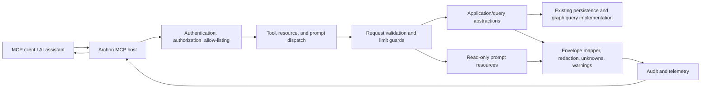

# Implementation Plan

Target output path: `docs/015-MCP-Server-Tools-Resources-Prompts-and-Security/implementation-plan-wp015-mcp-server-tools-resources-prompts-and-security.md`

## Planning Basis

This implementation plan translates `docs/015-MCP-Server-Tools-Resources-Prompts-and-Security/spec-wp015-mcp-server-tools-resources-prompts-and-security.md` into sequential, runnable vertical work items for WP015. The plan assumes WP001 through WP014 have delivered the required Archon host shell, application/query abstractions, stable-key graph query surfaces, evidence, findings, metrics, hotlist, and snapshot diff capabilities described in the specification.

A **vertical slice** means a small end-to-end capability that can be invoked through the MCP host entry point, flows through validation, authorization, application/query abstractions, response mapping, logging, tests, and documentation, and produces a demonstrable result without depending on unfinished later slices. Each active Work Item must be executed uninterrupted from implementation through validation, documentation/wiki review, and plan-record updates. The executor must not stop for status-only messages, step announcements, ordinary fixable failures, or confirmation prompts. The only allowed stops during an active Work Item are full Work Item completion, explicit user interruption/change of direction, or a true blocker that cannot be resolved from the specification, plan, codebase, or repository guidance.

Every code-writing Work Item must treat `./.github/instructions/documentation-pass.instructions.md` as a hard Definition of Done gate. Every work package must follow `./.github/instructions/wiki.instructions.md`, including mandatory wiki review, information-architecture review, topic-page selection, glossary/cross-link review, and a final wiki impact matrix or equivalent completion record. Standalone implementation notes, implementation ledgers, architecture notes, or similar contributor-facing narrative artifacts are prohibited; durable contributor guidance belongs in `./wiki` on the correct topic page, not in `wiki/home.md`.

## Overall Project Structure

WP015 should preserve the existing Onion Architecture direction:

- Host layer: the existing Archon MCP host remains the only MCP transport/composition entry point.
- Services/application/query layer: MCP handlers call existing query abstractions and API-compatible DTO contracts where possible.
- Infrastructure layer: persistence and external implementation details stay behind existing abstractions.
- Domain layer: domain model remains independent of MCP transport concerns.
- Tests: MCP host, handler, contract, security, prompt, resource, and integration tests live in corresponding test projects under `test`.
- Prompt assets: prompt templates are versioned markdown or text resources included with the MCP project and loaded read-only at runtime.
- Documentation: this plan remains in the WP015 folder; durable contributor guidance goes to the appropriate wiki topic pages according to `./.github/instructions/wiki.instructions.md`.

Naming conventions should follow existing repository patterns and C# standards: block-scoped namespaces, Allman braces, one public type per file, underscore-prefixed private fields, no top-level statements, and PackageReference groups kept separate from ProjectReference groups.

## Mandatory Cross-Cutting Definition of Done for Every Code-Writing Work Item

Every Work Item that creates or updates source code is complete only when all of the following are true:

- Source code follows `.github/instructions/coding-standards.instructions.md` and repository Onion Architecture rules.
- `./.github/instructions/documentation-pass.instructions.md` has been followed in full for the files in scope.
- Every public class, interface, record, enum, delegate, constructor, method, property, event, field, generic type parameter, and parameter has explicit local XML documentation where applicable.
- Internal and other non-public classes, constructors, and methods carry developer-level comments explaining purpose, context, dependencies, logical flow, and rationale.
- Public method and constructor parameters are documented with their purpose.
- Non-obvious properties and fields are documented.
- Multi-step methods include sufficient inline or block comments for a developer to understand the flow and algorithms.
- Logging and error handling are implemented without exposing secrets, stack traces, unsafe evidence snippets, credentials, or connection strings.
- Relevant unit and integration tests pass.
- The end-to-end path can be executed by the verification instructions for the Work Item.
- Wiki review for the slice has been performed; required wiki pages were updated, created, split, retired, or an explicit no-change result was recorded.
- If wiki updates are required, conceptually dense architecture, runtime, workflow, setup, security, or extension guidance is written in book-like narrative prose, defines technical terms on first use or links to glossary entries, and includes examples or walkthrough material where useful.
- The plan-status or final execution record states the validation outcome and links to wiki guidance instead of duplicating contributor-facing detail.

## MCP Foundation and Runtime Slices

- [x] Work Item 1: Bootstrap read-only MCP runtime baseline - Completed
  - **Purpose**: Establish a runnable MCP host baseline that registers a minimal safe operation through the existing Archon MCP host, validates the transport, applies configuration, and proves that MCP execution reaches the application/query layer through approved abstractions.
  - **Acceptance Criteria**:
	- The existing MCP host starts with repository service defaults and .NET 10 target settings.
	- A minimal read-only health or capabilities path proves MCP registration without exposing mutation, shell, SQL, Cypher, filesystem, or direct Neo4j access.
	- Startup/readiness reports missing mandatory registrations as a controlled readiness failure once the registration catalog is introduced.
	- No Domain, Services, or Infrastructure project depends on MCP host code.
  - **Definition of Done**:
	- Code, tests, logging, error handling, documentation-pass, and wiki review satisfy the mandatory cross-cutting Definition of Done.
	- `./.github/instructions/documentation-pass.instructions.md` is applied to all new or changed C# files in this slice.
	- Wiki review records the selected MCP architecture/setup topic page or explains why no page exists yet and whether a new page will be created in the final documentation slice.
	- Can execute end-to-end via the existing Archon MCP host startup command and a minimal MCP capability/health/readiness call.
	- Executor must not stop mid-Work Item except for full completion, explicit user interruption/change of direction, or a true blocker.
	- [x] Task 1: Inspect existing MCP host, solution structure, service-default conventions, and test project layout. Completed: confirmed `src/ArchonMcp` is the MCP host, `Program.cs` is the explicit entry point, `src/Archon.ServiceDefaults` supplies health/readiness conventions, `src/Archon.Api.Query` is the query-layer registration seam for later tools/resources, and `test/ArchonMcp.Tests` already exists as the corresponding MCP host test project.
	- [x] Step 1: Identify the current MCP host project, entry point, configuration files, and service defaults. Completed: inspected `src/ArchonMcp/ArchonMcp.csproj`, `src/ArchonMcp/Program.cs`, launch settings, and service-default probe mapping.
	- [x] Step 2: Identify existing query-layer contracts that will be used by later tools and resources. Completed: identified `Archon.Api.Query` service registration and API-compatible query DTO contract area for later MCP slices.
	- [x] Step 3: Identify or create the corresponding MCP host test project under `test` if it is not already present. Completed: reused existing `test/ArchonMcp.Tests`.
  - [x] Task 2: Implement baseline registration and readiness wiring. Completed: added the documented MCP runtime catalog, conservative limit options, mandatory registration options, baseline `archon.health` operational capability, forbidden-name validation, and catalog health check; wired the host to the query-layer registration seam without adding Domain, Services, or Infrastructure dependencies on MCP host code.
	- [x] Step 1: Add or refine a registration catalog for mandatory tools, resources, and prompts without implementing the full catalog behavior yet. Completed: added a baseline allow-list catalog that starts with the required read-only operational registration.
	- [x] Step 2: Add configurable MCP limits with conservative defaults from the specification. Completed: added default result count, traversal depth, evidence count, path count, and serialized context budget options.
	- [x] Step 3: Add readiness checks that can detect missing mandatory registrations without revealing sensitive internals. Completed: added catalog readiness that fails closed with high-level health-check data only.
  - [x] Task 3: Add baseline tests. Completed: added targeted tests for catalog/limit registration, fail-closed readiness, and forbidden capability-name rejection; refreshed existing probe tests for WP015 baseline wording.
	- [x] Step 1: Test host startup registration succeeds for the baseline. Completed: `BuildApplicationRegistersBaselineCatalogAndLimits` validates baseline registration and defaults.
	- [x] Step 2: Test readiness fails closed when mandatory registration is incomplete. Completed: `ReadinessFailsClosedWhenMandatoryRegistrationIsMissing` verifies catalog validation and `/health` service-unavailable behavior.
	- [x] Step 3: Test forbidden capability names are not registered. Completed: `CatalogValidationRejectsForbiddenCapabilityNames` verifies unsafe execution-style capability names fail validation.
  - **Completion Summary**: Implemented the read-only MCP runtime baseline in `src/ArchonMcp`, including catalog/options/readiness services under `McpRuntime`, host composition in `Program.cs`, and an `Archon.Api.Query` project reference so the host reaches approved query-layer abstractions for later slices. Validation performed: `dotnet build .\src\ArchonMcp\ArchonMcp.csproj` and `dotnet test .\test\ArchonMcp.Tests\ArchonMcp.Tests.csproj` both succeeded after fixing DI and health-check registration discovered by the first targeted test run. Wiki review result: updated [runtime foundation](../../../wiki/runtime-foundation.md) and [glossary](../../../wiki/glossary.md); reviewed [home](../../../wiki/home.md) and intentionally left it unchanged as a landing page. Wiki impact matrix: affected concepts were MCP host runtime composition, read-only registration catalog, readiness fail-closed behavior, forbidden capability names, and MCP limit configuration; pages reviewed were `wiki/runtime-foundation.md`, `wiki/glossary.md`, and `wiki/home.md`; pages updated were `wiki/runtime-foundation.md` and `wiki/glossary.md`; no pages were created or retired; page-structure decision was to keep detailed MCP runtime guidance on the runtime foundation topic page, add terminology to the glossary, and keep `home.md` concise.
  - **Files**:
	- `src/**/ArchonMcp*/Program.cs`: Host entry point and startup wiring, if present.
	- `src/**/ArchonMcp*/**/*.cs`: MCP registration, configuration, and readiness components.
	- `test/**/ArchonMcp*.Tests/**/*.cs`: Baseline startup and readiness tests.
	- `wiki/**/*.md`: Candidate MCP architecture/setup guidance pages reviewed or updated.
  - **Work Item Dependencies**: None beyond existing WP001 host foundation.
  - **Run / Verification Instructions**:
	- Run the MCP host startup command used by the repository.
	- Run MCP host baseline tests by project or fully qualified test filter.
	- Run a solution build or targeted build covering the MCP host and tests.
  - **User Instructions**: No manual setup beyond existing repository prerequisites.

- [x] Work Item 2: Implement common MCP envelope, validation, limits, and error contracts - Completed
  - **Purpose**: Deliver the shared response envelope and failure model used by every later tool and resource so all subsequent slices return consistent summaries, facts, evidence, findings, unknowns, warnings, limits, and safe suggested follow-ups.
  - **Acceptance Criteria**:
	- Common response envelopes include operation, snapshot, summary, confidence, facts, evidence, findings, unknowns, warnings, limits, and suggested follow-ups.
	- Validation failures, not-found, ambiguity, authorization, unsupported operation, truncation, and query-layer failures are represented as structured MCP responses.
	- Limit enforcement supports result count, traversal depth, evidence count, path count, and serialized context budget where applicable.
	- Error responses do not expose raw stack traces, secrets, credentials, connection strings, unsafe evidence snippets, or Neo4j internal IDs.
  - **Definition of Done**:
	- Code, tests, logging, error handling, documentation-pass, and wiki review satisfy the mandatory cross-cutting Definition of Done.
	- Documentation comments explain envelope terminology such as stable key, evidence, unknown, confidence, and truncation.
	- Wiki review confirms whether response-envelope terminology belongs in an MCP topic page, architecture page, glossary, or all of them.
	- Can execute end-to-end through a baseline MCP operation returning a shaped envelope or structured error.
	- Executor must not stop mid-Work Item except for full completion, explicit user interruption/change of direction, or a true blocker.
	- [x] Task 1: Define shared contracts. Completed: added `src/ArchonMcp/McpEnvelope` response contracts for operation, snapshot, summary, confidence, facts, evidence, findings, unknowns, warnings, limits, suggested follow-ups, and structured error responses aligned with the existing API-compatible response-envelope model while keeping MCP-specific contracts in the host layer.
	- [x] Step 1: Add envelope DTOs or projections aligned with existing API-compatible contracts. Completed: added `ArchonMcpEnvelope<TFacts>`, `ArchonMcpSnapshotIdentity`, `ArchonMcpConfidence`, and baseline operation envelope support.
	- [x] Step 2: Add evidence, unknown, finding, warning, limit, and follow-up record contracts using stable keys. Completed: added `ArchonMcpEvidenceReference`, `ArchonMcpUnknown`, `ArchonMcpFindingReference`, `ArchonMcpWarning`, `ArchonMcpLimitMetadata`, and `ArchonMcpSuggestedFollowUp`.
	- [x] Step 3: Add structured error contracts for validation, unsupported operation, not-found, ambiguity, unauthorized, forbidden, dependency unavailable, and server error cases. Completed: added `ArchonMcpErrorCategory`, `ArchonMcpErrorDetail`, and `ArchonMcpErrorResponse` with stable category-to-code mapping.
  - [x] Task 2: Implement validators and limit guards. Completed: added shared MCP request validation and result limiting helpers using the configured conservative MCP limits.
	- [x] Step 1: Validate stable keys, snapshot identifiers, search text, filters, pagination, depth, and count inputs. Completed: `ArchonMcpRequestValidator` validates stable keys, snapshot selectors, search text, filters, requested counts, requested depth, and pagination fields before query-layer execution.
	- [x] Step 2: Enforce conservative default limits from OQ-003. Completed: `ArchonMcpLimitGuard` consumes `ArchonMcpLimitsOptions` and applies configured result-count limits; existing startup options validation continues to enforce positive result, traversal, evidence, path, and serialized-context limits.
	- [x] Step 3: Return truncation metadata and suggested narrowing when limits are exceeded. Completed: `ArchonMcpLimitedList<TItem>` returns bounded items, `ArchonMcpLimitMetadata`, and a safe user-question follow-up when truncation occurs.
  - [x] Task 3: Implement safe response mapping helpers. Completed: added redaction and mapping helpers that preserve stable public identities and sanitize untrusted evidence snippets before envelope creation.
	- [x] Step 1: Preserve stable keys and snapshot identity from query-layer results. Completed: `ArchonMcpResponseMapper.MapEvidence` carries stable evidence keys and optional snapshot identity into `ArchonMcpEvidenceReference`.
	- [x] Step 2: Redact or omit sensitive evidence snippets. Completed: `ArchonMcpSensitiveTextRedactor` redacts representative password, token, secret, API key, account key, and connection-string fragments before response mapping.
	- [x] Step 3: Prevent natural-language summaries from adding unsupported claims beyond returned data. Completed: the baseline envelope summary is static and grounded in returned operational facts; shared contracts separate summary text from facts, evidence, unknowns, warnings, and follow-ups for later tool mappers.
  - [x] Task 4: Add contract tests. Completed: added `test/ArchonMcp.Tests/ArchonMcpEnvelopeContractTests.cs` covering success, failure, truncation, validation, redaction, and stable-key safeguards.
	- [x] Step 1: Test success envelope shape. Completed: `BaselineHealthOperationReturnsCommonSuccessEnvelope` verifies the shaped baseline `archon.health` envelope.
	- [x] Step 2: Test all structured error shapes. Completed: `StructuredErrorsCoverRequiredFailureCategories` verifies validation, unsupported operation, not-found, ambiguity, unauthorized, forbidden, dependency unavailable, query-layer failure, and server-error categories.
	- [x] Step 3: Test limit metadata and truncation behavior. Completed: `LimitGuardReturnsTruncationMetadataAndSuggestedNarrowing` verifies bounded results, metadata, and narrowing follow-up behavior.
	- [x] Step 4: Test stable-key-only output and absence of Neo4j internal IDs. Completed: `EvidenceMappingRedactsSecretsAndRejectsNeo4jInternalIds` verifies stable evidence identity, sensitive snippet redaction, and rejection of raw numeric internal IDs.
  - **Completion Summary**: Implemented the Work Item 2 MCP response-envelope foundation in `src/ArchonMcp/McpEnvelope`, registered the shared services from `src/ArchonMcp/McpRuntime/ArchonMcpServiceCollectionExtensions.cs`, and added `test/ArchonMcp.Tests/ArchonMcpEnvelopeContractTests.cs`. Validation performed: `ArchonMcpEnvelopeContractTests` passed 5/5, full workspace build succeeded, and `ArchonMcp.Tests` passed 11/11. Wiki review result: updated [runtime foundation](../../../wiki/runtime-foundation.md) with the shared MCP envelope, validation, limit, redaction, and structured error model; updated [glossary](../../../wiki/glossary.md) with response-envelope terminology; reviewed [home](../../../wiki/home.md) and intentionally left it unchanged as a landing page. Wiki impact matrix: affected concepts were MCP response envelope, confidence, evidence references, findings, unknowns, warnings, truncation/limits, suggested follow-ups, stable-key validation, redaction, and structured MCP errors; pages reviewed were `wiki/runtime-foundation.md`, `wiki/glossary.md`, and `wiki/home.md`; pages updated were `wiki/runtime-foundation.md` and `wiki/glossary.md`; no pages were created, split, renamed, or retired; page-structure decision was to keep common MCP runtime contract guidance on the runtime foundation page, centralize terminology in the glossary, and avoid adding detailed content to `home.md`.
  - **Files**:
	- `src/**/ArchonMcp*/**/*Envelope*.cs`: Common response and error contracts.
	- `src/**/ArchonMcp*/**/*Validation*.cs`: Request validation and limit guards.
	- `src/**/ArchonMcp*/**/*Mapper*.cs`: Shared response mapping and redaction helpers.
	- `test/**/ArchonMcp*.Tests/**/*.cs`: Envelope, validation, and error contract tests.
	- `wiki/**/*.md`: Candidate glossary/MCP contract guidance reviewed or updated.
  - **Work Item Dependencies**: Work Item 1.
  - **Run / Verification Instructions**:
	- Run targeted envelope/validation tests.
	- Run targeted MCP host build and tests.
	- Invoke the baseline MCP path with valid, invalid, and over-limit inputs.
  - **User Instructions**: None.

- [x] Work Item 3: Implement authentication, authorization, allow-listing, audit, and security redaction seams - Completed
  - **Purpose**: Make the MCP host fail closed by default for unauthorized or disabled operations while proving audit logging and no-secrets behavior before feature tools are added.
  - **Acceptance Criteria**:
	- Authentication and authorization seams are provider-neutral and configurable.
	- Tool and resource allow-listing can disable individual tools or resource families.
	- Unauthorized and disabled operations fail before invoking application/query dependencies.
	- Audit logging records caller identity when available, operation name, safe normalized parameters, result status, truncation status, and timing.
	- Audit logs and telemetry omit secrets, credentials, access tokens, connection strings, raw sensitive evidence, and unsafe prompt-injection content.
  - **Definition of Done**:
	- Code, tests, logging, error handling, documentation-pass, and wiki review satisfy the mandatory cross-cutting Definition of Done.
	- Wiki review covers security terminology such as fail closed, allow-list, redaction, and audit trail.
	- Can execute end-to-end by invoking an authorized operation, an unauthorized operation, and a disabled operation.
	- Executor must not stop mid-Work Item except for full completion, explicit user interruption/change of direction, or a true blocker.
	- [x] Task 1: Add security abstractions. Completed: added provider-neutral caller context, caller provider, authorization decision, configuration-backed operation authorizer, security options, and operation executor seams in `src/ArchonMcp/McpSecurity`; registered them from the MCP runtime composition root.
	- [x] Step 1: Define caller context and authorization decision abstractions for MCP operations. Completed: added `ArchonMcpCallerContext`, `IArchonMcpCallerContextProvider`, `ArchonMcpAuthorizationDecision`, and `IArchonMcpOperationAuthorizer`.
	- [x] Step 2: Implement configuration-backed allow-list checks for tools and resource families. Completed: added `ArchonMcpSecurityOptions` with operation and resource-family allow-list settings and `ConfigurationArchonMcpOperationAuthorizer` fail-closed checks.
	- [x] Step 3: Ensure checks run before query-layer calls. Completed: `ArchonMcpOperationExecutor` authorizes before invoking the supplied operation delegate; tests verify denied paths do not invoke the delegate.
  - [x] Task 2: Add audit logging. Completed: added sanitized audit event, result-status, parameter-normalizer, audit sink abstraction, and logging sink; audit captures caller, operation, safe parameters, status, truncation, error category, and duration.
	- [x] Step 1: Normalize safe parameters for audit without sensitive values. Completed: `ArchonMcpAuditParameterNormalizer` preserves safe values and redacts password, token, API key, credential, private-key, certificate, and connection-string-like values.
	- [x] Step 2: Capture status, duration, truncation, and error category. Completed: `ArchonMcpOperationExecutor` records sanitized audit events for success, denied, cancelled, and failed execution paths.
	- [x] Step 3: Add tests proving query dependencies are not invoked after denied authorization. Completed: `ArchonMcpSecurityTests` verifies disabled and unauthorized baseline operation requests fail before the operation delegate is invoked.
  - [x] Task 3: Add redaction and prompt-injection handling primitives. Completed: extended the shared sensitive-text redactor and added secure untrusted-evidence mapping that labels repository evidence and keeps privileged instruction text separate.
	- [x] Step 1: Redact representative secrets from snippets and metadata. Completed: redaction covers secret assignments and connection-string password fragments; audit and evidence tests verify secret values are removed.
	- [x] Step 2: Label extracted evidence as untrusted data. Completed: `ArchonMcpSecureEvidenceMapper` emits `untrusted-repository-evidence` labels for extracted content.
	- [x] Step 3: Ensure privileged instruction text is not mixed with untrusted evidence content. Completed: untrusted evidence output carries redacted content separately from an empty privileged-instruction field.
  - **Completion Summary**: Implemented Work Item 3 security seams in `src/ArchonMcp/McpSecurity`, registered them from `src/ArchonMcp/McpRuntime/ArchonMcpServiceCollectionExtensions.cs`, integrated the baseline `archon.health` operational endpoint through the security executor in `src/ArchonMcp/Program.cs`, extended MCP redaction in `src/ArchonMcp/McpEnvelope/ArchonMcpSensitiveTextRedactor.cs`, and added `test/ArchonMcp.Tests/ArchonMcpSecurityTests.cs`. Validation performed: full workspace build succeeded; `ArchonMcp.Tests` passed 16/16. Wiki review result: updated [runtime foundation](../../../wiki/runtime-foundation.md) with MCP caller context, fail-closed authorization, allow-list, audit trail, redaction, and prompt-injection-aware evidence behavior; updated [glossary](../../../wiki/glossary.md) with caller context, allow-list, fail closed, audit trail, redaction, and prompt injection terms; reviewed [home](../../../wiki/home.md) and intentionally left it unchanged as a concise landing page. Wiki impact matrix: affected concepts were MCP authentication seam, caller context, authorization decision, operation allow-listing, resource-family allow-listing seam, fail-closed denial, audit trail, audit redaction, sensitive evidence redaction, untrusted evidence labeling, and prompt-injection separation; pages reviewed were `wiki/runtime-foundation.md`, `wiki/glossary.md`, and `wiki/home.md`; pages updated were `wiki/runtime-foundation.md` and `wiki/glossary.md`; no pages were created, split, renamed, or retired; page-structure decision was to keep shared MCP runtime/security guidance on the runtime foundation page, centralize vocabulary in the glossary, and avoid adding detailed content to `home.md`.
  - **Files**:
	- `src/**/ArchonMcp*/**/*Authorization*.cs`: Authorization seam and allow-list checks.
	- `src/**/ArchonMcp*/**/*Audit*.cs`: Audit logging components.
	- `src/**/ArchonMcp*/**/*Redaction*.cs`: Redaction and untrusted-evidence helpers.
	- `test/**/ArchonMcp*.Tests/**/*.cs`: Security, audit, allow-list, and redaction tests.
	- `wiki/**/*.md`: Candidate security/setup guidance reviewed or updated.
  - **Work Item Dependencies**: Work Items 1 and 2.
  - **Run / Verification Instructions**:
	- Run targeted security and audit tests.
	- Invoke one enabled operation, one disabled operation, and one unauthorized operation through the MCP host.
	- Inspect test-captured audit output for safe normalized metadata only.
  - **User Instructions**: Configure only test identities and local safe settings; do not require production identity provider secrets.

## MCP Tool Vertical Slices

- [x] Work Item 4: Implement `archon.search` as the first evidence-backed query tool - Completed
  - **Purpose**: Deliver the smallest meaningful user-facing architecture investigation tool and prove the full tool pattern: request contract, validation, authorization, query mapping, envelope mapping, limits, audit, tests, and documentation.
  - **Acceptance Criteria**:
	- `archon.search` accepts search text, optional snapshot selection, optional result-type filters, and optional project/solution/repository scope filters where supported.
	- Results are deterministically ranked or grouped and include stable keys, entity kinds, evidence references, unknowns, warnings, and safe follow-ups.
	- No matches are clearly distinguished from unavailable search data.
	- Query execution uses existing application/query abstractions rather than direct Neo4j or filesystem access.
  - **Definition of Done**:
	- Code, tests, logging, error handling, documentation-pass, and wiki review satisfy the mandatory cross-cutting Definition of Done.
	- Wiki review determines whether `archon.search` setup and examples belong on an MCP usage page, tool reference page, or both.
	- Can execute end-to-end by calling `archon.search` through the MCP host against test or seeded query data.
	- Executor must not stop mid-Work Item except for full completion, explicit user interruption/change of direction, or a true blocker.
	- [x] Task 1: Implement the tool contract and handler. Completed: added `src/ArchonMcp/McpSearch` contracts and `ArchonMcpSearchTool`, registered `archon.search` as a mandatory read-only tool capability, wired default allow-listing, and mapped a verification endpoint through the MCP host without direct Neo4j or filesystem access.
	- [x] Step 1: Define request and response mapping for search. Completed: added `ArchonMcpSearchRequest`, `ArchonMcpSearchFacts`, grouped result records, evidence-reference mapping, unknown/warning/follow-up mapping, and shared envelope output.
	- [x] Step 2: Validate search text, snapshot selector, filters, scopes, and limits. Completed: reused common MCP validation for search text, snapshot selector, filters, project scope, and result limits; added repository and solution stable-key validation before query execution.
	- [x] Step 3: Map to the existing search query abstraction. Completed: mapped requests to `SearchQuery`/`SearchSnapshotSelector` and invoked `ISearchQueryService` as the approved application/query seam.
	- [x] Step 4: Return deterministic grouped results through the common envelope. Completed: sorted and grouped results by controlled result kind, preserved stable keys and evidence identities, reported no matches, unavailable scope, truncation, unknowns, warnings, and safe follow-ups.
  - [x] Task 2: Add tests. Completed: added `test/ArchonMcp.Tests/ArchonMcpSearchTests.cs` and refreshed runtime catalog tests for the expanded mandatory capability set.
	- [x] Step 1: Test successful search with evidence-backed results. Completed: verified grouped project/symbol results, evidence references, snapshot identity, query mapping, and follow-ups.
	- [x] Step 2: Test no matches versus unavailable search data. Completed: verified successful empty search with explicit unknowns separately from repository/snapshot unavailable dependency errors.
	- [x] Step 3: Test validation, authorization, disabled tool, truncation, and query-layer failure behavior. Completed: verified validation stops query calls, disabled and unauthenticated operations fail before query execution, truncation metadata/warnings/follow-ups are emitted, and query exceptions map to safe query-layer failure errors.
  - [x] Task 3: Add documentation and examples. Completed: created [MCP tool reference](../../../wiki/mcp-tool-reference.md), updated [runtime foundation](../../../wiki/runtime-foundation.md), refreshed [glossary](../../../wiki/glossary.md), and kept [home](../../../wiki/home.md) as a concise landing page with only reader-path/capability-summary updates.
	- [x] Step 1: Update MCP documentation/wiki pages with purpose, inputs, outputs, limits, and example response. Completed: documented `archon.search` purpose, request shape, response envelope, example output, no-match/unavailable/truncation behavior, security, and audit behavior on the MCP tool reference page.
	- [x] Step 2: Explain first-use terms such as result-type filter, stable key, evidence reference, and suggested follow-up. Completed: defined terms in the MCP tool reference and added glossary entries for MCP tool, result-type filter, and suggested follow-up; stable key and evidence concepts remain linked through existing graph/query guidance.
  - **Completion Summary**: Implemented `archon.search` in `src/ArchonMcp/McpSearch`, registered it from `src/ArchonMcp/McpRuntime/ArchonMcpServiceCollectionExtensions.cs`, added the catalog capability in `src/ArchonMcp/McpRuntime/ArchonMcpBaselineCapabilities.cs`, made it mandatory in `src/ArchonMcp/McpRuntime/ArchonMcpRegistrationCatalogOptions.cs`, mapped the verification endpoint in `src/ArchonMcp/Program.cs`, and added/updated tests under `test/ArchonMcp.Tests`. Validation performed: full workspace build succeeded; `ArchonMcp.Tests` passed 24/24; final workspace build succeeded. Wiki review result: created [MCP tool reference](../../../wiki/mcp-tool-reference.md) for `archon.search` setup, inputs, outputs, limits, no-match/unavailable semantics, security, and example response; updated [runtime foundation](../../../wiki/runtime-foundation.md) for the expanded MCP catalog and cross-link; updated [glossary](../../../wiki/glossary.md) for MCP tool, result-type filter, suggested follow-up, and current registration catalog wording; reviewed [home](../../../wiki/home.md) and kept it as a landing page with only concise reader-path/capability-summary updates. Wiki impact matrix: affected concepts were MCP tool, `archon.search`, result-type filter, stable-key search scope, evidence reference, suggested follow-up, no-match versus unavailable search data, truncation, allow-listing, and audit-safe request metadata; pages reviewed were `wiki/runtime-foundation.md`, `wiki/glossary.md`, `wiki/home.md`, and the new MCP tool-reference topic need; pages updated were `wiki/runtime-foundation.md`, `wiki/glossary.md`, and `wiki/home.md`; page created was `wiki/mcp-tool-reference.md`; no pages were split, renamed, or retired; page-structure decision was to place tool-specific contract and example guidance on a dedicated MCP tool reference page, keep shared host/envelope/security concepts on runtime foundation, centralize vocabulary in the glossary, and keep `home.md` concise rather than making it a tool documentation page.
  - **Files**:
	- `src/**/ArchonMcp*/**/*Search*.cs`: Search tool contracts, handler, validation, and mapper.
	- `test/**/ArchonMcp*.Tests/**/*Search*.cs`: Search tool tests.
	- `wiki/**/*.md`: MCP usage or tool reference page reviewed or updated.
  - **Work Item Dependencies**: Work Items 1 through 3.
  - **Run / Verification Instructions**:
	- Run `archon.search` tests.
	- Invoke `archon.search` with valid, empty, over-limit, unauthorized, and unavailable-data scenarios.
  - **User Instructions**: None.

- [x] Work Item 5: Implement project description and dependency traversal tools - Completed
  - **Purpose**: Deliver project-level investigation workflows for describing a project and navigating direct/transitive dependency and dependent relationships.
  - **Acceptance Criteria**:
	- `archon.describe_project` accepts project stable key or unambiguous project name and returns identity, path, language, target frameworks, format, application type, dependencies, packages, endpoints/workers/data-access/configuration/integrations, findings, metrics, hotspots, evidence, and unknowns where available.
	- `archon.get_dependencies` accepts a source node or project identifier and supports direct/transitive mode, maximum depth, edge-kind filters, evidence, and limits.
	- `archon.get_dependents` accepts a target node or project identifier and supports direct/transitive mode, maximum depth, edge-kind filters, evidence, and limits.
	- Ambiguous project-name lookup returns a disambiguation error rather than selecting arbitrarily.
  - **Definition of Done**:
	- Code, tests, logging, error handling, documentation-pass, and wiki review satisfy the mandatory cross-cutting Definition of Done.
	- Wiki review updates or confirms architecture/dependency guidance, including examples that show direct versus transitive relationships.
	- Can execute end-to-end by describing a project and traversing dependencies/dependents through the MCP host.
	- Executor must not stop mid-Work Item except for full completion, explicit user interruption/change of direction, or a true blocker.
	- [x] Task 1: Implement `archon.describe_project`. Completed: added documented MCP project request/fact contracts and `ArchonMcpProjectTool`, registered the tool, mapped the host verification endpoint, and projected project query results into the shared MCP envelope without direct persistence or filesystem access.
	- [x] Step 1: Add contract, validator, handler, authorization, and mapper. Completed: added `ArchonMcpDescribeProjectRequest`, project fact records, `IArchonMcpProjectTool`, and authorization-first handler execution through the shared operation executor.
	- [x] Step 2: Preserve evidence, findings, metrics, hotspots, warnings, and unknowns. Completed: mapped evidence references, hotlist/finding stable keys, project risk/metric-like aggregate counts, scoped graph summaries, warnings, explicit unknowns, confidence, limits, and safe follow-ups from query-layer DTOs.
	- [x] Step 3: Add ambiguity and not-found handling. Completed: mapped ambiguous project-name lookup to `Ambiguous`, missing project identity to validation, missing project records to `NotFound`, unavailable repository/solution/snapshot data to `DependencyUnavailable`, and query exceptions to safe `QueryLayerFailure` responses.
  - [x] Task 2: Implement `archon.get_dependencies`. Completed: added documented traversal request/fact contracts and `ArchonMcpDependencyTool` outgoing traversal behavior using the approved `IGraphTraversalQueryService` seam.
	- [x] Step 1: Add direct and transitive traversal request handling. Completed: direct mode maps to depth-one outgoing traversal and transitive mode maps to bounded outgoing traversal with caller-supplied or default depth.
	- [x] Step 2: Enforce depth, edge-kind, node, edge, and evidence limits. Completed: validation enforces stable node/project keys, supported snapshot selectors, result counts, traversal depth, edge-kind token shape, and MCP result truncation metadata over returned relationships/evidence.
	- [x] Step 3: Distinguish no dependencies from unavailable dependency data. Completed: successful empty outgoing traversal returns a known-empty envelope with `noDependencies`, while missing repository/solution/snapshot data maps to `DependencyUnavailable` and missing start nodes map to `NotFound`.
  - [x] Task 3: Implement `archon.get_dependents`. Completed: mirrored traversal behavior for incoming dependent relationships with the same security, validation, envelope, evidence, unknown, warning, and limit handling.
	- [x] Step 1: Mirror dependency traversal behavior for reverse relationships. Completed: incoming direct and transitive traversal use the same handler with `Incoming` direction and dependent-specific operation name/mode.
	- [x] Step 2: Preserve deterministic ordering and evidence-backed relationship records. Completed: relationship and node facts are ordered by stable key, evidence stable keys map to safe evidence references, and response summaries remain grounded in returned traversal facts.
	- [x] Step 3: Distinguish no dependents from unavailable dependent data. Completed: successful empty incoming traversal returns `noDependents`, while unavailable scope and missing nodes use structured error categories.
  - [x] Task 4: Add tests and documentation. Completed: added `test/ArchonMcp.Tests/ArchonMcpProjectAndDependencyTests.cs`, updated catalog baseline tests, ran validation, and completed mandatory wiki updates.
	- [x] Step 1: Test success, validation, ambiguity, not-found, authorization, query failure, unknowns, and truncation. Completed: targeted tests cover project success/ambiguity/validation/disabled operation plus dependency/dependent success, transitive truncation, empty traversal, validation, and unavailable-data behavior; `ArchonMcp.Tests` passed 33/33.
	- [x] Step 2: Update wiki/tool reference with examples and glossary links. Completed: updated [MCP tool reference](../../../wiki/mcp-tool-reference.md), [runtime foundation](../../../wiki/runtime-foundation.md), [glossary](../../../wiki/glossary.md), and concise [home](../../../wiki/home.md) reader-path/capability entries.
  - **Completion Summary**: Implemented Work Item 5 project and dependency MCP tools in `src/ArchonMcp/McpProjects` and `src/ArchonMcp/McpDependencies`, registered `archon.describe_project`, `archon.get_dependencies`, and `archon.get_dependents` in the MCP capability catalog, default security allow-list, DI composition, and host verification endpoints, and added targeted tests in `test/ArchonMcp.Tests/ArchonMcpProjectAndDependencyTests.cs`. Validation performed: full workspace build succeeded; `ArchonMcp.Tests` passed 33/33 after updating the runtime catalog test for the expanded mandatory capability set; final workspace build succeeded. Wiki review result: updated [MCP tool reference](../../../wiki/mcp-tool-reference.md) with `archon.describe_project`, `archon.get_dependencies`, and `archon.get_dependents` inputs, outputs, examples, ambiguity, direct/transitive traversal, empty-result, unavailable-data, and truncation semantics; updated [runtime foundation](../../../wiki/runtime-foundation.md) for the expanded mandatory catalog and limit behavior; updated [glossary](../../../wiki/glossary.md) for MCP project description and MCP dependency traversal terminology; reviewed [home](../../../wiki/home.md) and kept it as a landing page with concise reader-path/capability-summary updates only. Wiki impact matrix: affected concepts were project description, stable project-key lookup, ambiguous project-name disambiguation, outgoing dependencies, incoming dependents, direct versus transitive traversal, edge-kind filters, evidence-backed relationships, known-empty traversal, unavailable graph data, truncation, allow-listing, and audit-safe request metadata; pages reviewed were `wiki/mcp-tool-reference.md`, `wiki/runtime-foundation.md`, `wiki/glossary.md`, and `wiki/home.md`; pages updated were all four reviewed pages; no pages were created, split, renamed, or retired; page-structure decision was to keep tool-specific contracts and examples on the dedicated MCP tool reference, shared catalog/runtime/security concepts on runtime foundation, vocabulary in the glossary, and `home.md` concise rather than turning it into detailed tool documentation.
  - **Files**:
	- `src/**/ArchonMcp*/**/*Project*.cs`: Project description tool components.
	- `src/**/ArchonMcp*/**/*Dependency*.cs`: Dependency and dependent tool components.
	- `test/**/ArchonMcp*.Tests/**/*Project*.cs`: Project description tests.
	- `test/**/ArchonMcp*.Tests/**/*Dependency*.cs`: Dependency traversal tests.
	- `wiki/**/*.md`: Dependency and MCP tool guidance reviewed or updated.
  - **Work Item Dependencies**: Work Item 4.
  - **Run / Verification Instructions**:
	- Run project and dependency MCP tests.
	- Invoke `archon.describe_project`, `archon.get_dependencies`, and `archon.get_dependents` against seeded data.
  - **User Instructions**: None.

- [x] Work Item 6: Implement path, symbol, and usage investigation tools - Completed
  - **Purpose**: Deliver code-structure investigation workflows for dependency paths, symbol description, and symbol usage without direct repository file inspection.
  - **Acceptance Criteria**:
	- `archon.find_dependency_paths` accepts source and target stable keys, maximum depth, edge-kind filters, deterministic path ordering, path count limits, evidence, and no-path/unavailable-data distinction.
	- `archon.describe_symbol` accepts a symbol stable key or unambiguous search parameters and returns symbol identity, containment, project/source context, relationships, evidence spans, snippet previews or hashes, confidence, findings, rules, and unknowns.
	- `archon.find_symbol_usages` accepts a symbol stable key or unambiguous symbol search parameters, supports usage-kind/project/depth filters, and returns callers, references, injections, configuration usage, endpoint usage, data-access usage, evidence, confidence, and limits.
	- Ambiguous symbol lookup returns disambiguation candidates where safe.
  - **Definition of Done**:
	- Code, tests, logging, error handling, documentation-pass, and wiki review satisfy the mandatory cross-cutting Definition of Done.
	- Wiki review covers symbol, usage, and dependency-path terminology with examples or walkthrough material if needed.
	- Can execute end-to-end by finding a path, describing a symbol, and finding usages through the MCP host.
	- Executor must not stop mid-Work Item except for full completion, explicit user interruption/change of direction, or a true blocker.
	- [x] Task 1: Implement `archon.find_dependency_paths`. Completed: added documented dependency-path MCP request/fact/path contracts and `ArchonMcpDependencyPathTool`, registered the capability, wired DI/security/default allow-listing, and mapped the verification endpoint through the MCP host without direct Neo4j, filesystem, or arbitrary graph-query access.
	- [x] Step 1: Add request contract, validator, handler, and mapper. Completed: `ArchonMcpDependencyPathRequest`, `ArchonMcpDependencyPathFacts`, `ArchonMcpDependencyPathRecord`, and `IArchonMcpDependencyPathTool` map validated source/target stable keys to `IGraphTraversalQueryService.GetDependencyPathAsync`.
	- [x] Step 2: Enforce maximum path count, depth, response-size, and evidence limits. Completed: common validation enforces stable keys, snapshot selectors, edge-kind tokens, depth, and result limits; MCP path records and evidence references are bounded through the configured limit guard.
	- [x] Step 3: Return no-path and unavailable-data responses distinctly. Completed: found paths, known no-path answers, unavailable path data, missing nodes, unavailable repository/solution/snapshot scopes, and query-layer failures map to distinct success, unknown, warning, or structured error shapes.
  - [x] Task 2: Implement `archon.describe_symbol`. Completed: added documented symbol request/fact/source/relationship contracts and `ArchonMcpSymbolTool` detail behavior over the approved `ISymbolQueryService` seam.
	- [x] Step 1: Add stable-key and unambiguous-search handling. Completed: stable symbol keys and exact search text are validated as mutually exclusive identity modes; ambiguous query-layer symbol lookup maps to an `Ambiguous` MCP error with safe `archon.search` follow-up guidance.
	- [x] Step 2: Map relationships, evidence spans, snippets/hashes, findings, rules, confidence, and unknowns. Completed: symbol identity, containment, project context, source spans, snippet hashes, semantic relationships, evidence references, rule-like findings, confidence, warnings, and explicit unknowns are projected into the common MCP envelope.
	- [x] Step 3: Apply redaction and untrusted-evidence labeling to snippets. Completed: source and evidence snippet previews are passed through the secure evidence mapper so secret-like values are redacted and snippets are labeled as untrusted repository evidence.
  - [x] Task 3: Implement `archon.find_symbol_usages`. Completed: added documented usage request/fact/record contracts and usage behavior in `ArchonMcpSymbolTool.Usages` using `ISymbolQueryService.ListSymbolUsagesAsync`.
	- [x] Step 1: Add usage filters and depth handling. Completed: usage requests validate stable symbol identity, usage-kind filters, optional project stable key, depth hints, limits, and scope before query execution; current usage lookup requires prior stable-key resolution.
	- [x] Step 2: Map usage relationships and evidence with deterministic ordering. Completed: usage rows are mapped with stable relationship/source/target keys, usage kind, source context, redacted snippets, evidence references, confidence, unknowns, and deterministic ordering.
	- [x] Step 3: Enforce pagination or response-size limits. Completed: usage query take values and MCP result limiting bound returned rows, emit truncation metadata, warnings, and safe narrowing follow-ups.
  - [x] Task 4: Add tests and documentation. Completed: added `test/ArchonMcp.Tests/ArchonMcpPathAndSymbolTests.cs`, updated catalog/runtime tests through validation fixes, and completed mandatory wiki updates.
	- [x] Step 1: Test success, ambiguity, not-found, validation, authorization, disabled tool, truncation, unknowns, and query-layer failures. Completed: targeted tests cover path success/no-path/validation/disabled operation, symbol success/ambiguity, usage success/truncation/validation, authorization-first behavior, redaction, unknowns, and query seam invocation.
	- [x] Step 2: Update wiki/tool reference with safe examples. Completed: updated [MCP tool reference](../../../wiki/mcp-tool-reference.md), [runtime foundation](../../../wiki/runtime-foundation.md), [glossary](../../../wiki/glossary.md), and concise [home](../../../wiki/home.md) reader-path/capability entries.
	- **Completion Summary**: Implemented Work Item 6 dependency-path and symbol MCP tools in `src/ArchonMcp/McpDependencies` and `src/ArchonMcp/McpSymbols`, registered `archon.find_dependency_paths`, `archon.describe_symbol`, and `archon.find_symbol_usages` in the MCP capability catalog, default security allow-list, DI composition, and host verification endpoints, and added targeted tests in `test/ArchonMcp.Tests/ArchonMcpPathAndSymbolTests.cs`. Validation performed: `dotnet test .\test\ArchonMcp.Tests\ArchonMcp.Tests.csproj` passed 41/41 after aligning path-depth test data with the configured MCP traversal-depth limit and refreshing the runtime catalog baseline test for the expanded mandatory capability set; final `dotnet build .\src\ArchonMcp\ArchonMcp.csproj` succeeded. Wiki review result: updated [MCP tool reference](../../../wiki/mcp-tool-reference.md) with dependency-path, symbol-description, and symbol-usage inputs, outputs, examples, ambiguity, no-path, no-usage, unavailable-data, truncation, redaction, and untrusted-evidence semantics; updated [runtime foundation](../../../wiki/runtime-foundation.md) for expanded mandatory catalog and limit behavior; updated [glossary](../../../wiki/glossary.md) for MCP dependency path search, MCP symbol description, and MCP symbol usage investigation terminology; reviewed [home](../../../wiki/home.md) and kept it as a landing page with concise reader-path/capability-summary updates only. Wiki impact matrix: affected concepts were dependency path search, no-path versus unavailable path data, symbol stable-key lookup, ambiguous symbol lookup, symbol source context, untrusted snippet previews, symbol usage, usage-kind filters, no-usage known-empty results, truncation, allow-listing, and audit-safe request metadata; pages reviewed were `wiki/mcp-tool-reference.md`, `wiki/runtime-foundation.md`, `wiki/glossary.md`, and `wiki/home.md`; pages updated were all four reviewed pages; no pages were created, split, renamed, or retired; page-structure decision was to keep tool-specific contracts and examples on the dedicated MCP tool reference, shared catalog/runtime/security concepts on runtime foundation, vocabulary in the glossary, and `home.md` concise rather than turning it into detailed tool documentation.
  - **Files**:
	- `src/**/ArchonMcp*/**/*DependencyPath*.cs`: Dependency path tool components.
	- `src/**/ArchonMcp*/**/*Symbol*.cs`: Symbol description and usage components.
	- `test/**/ArchonMcp*.Tests/**/*DependencyPath*.cs`: Path tests.
	- `test/**/ArchonMcp*.Tests/**/*Symbol*.cs`: Symbol tests.
	- `wiki/**/*.md`: Symbol/path guidance reviewed or updated.
  - **Work Item Dependencies**: Work Item 5.
  - **Run / Verification Instructions**:
	- Run path and symbol MCP tests.
	- Invoke `archon.find_dependency_paths`, `archon.describe_symbol`, and `archon.find_symbol_usages` with seeded data.
  - **User Instructions**: None.

- [x] Work Item 7: Implement data-access and change-impact tools - Completed
  - **Purpose**: Deliver data-access review and impact-analysis workflows that use persisted architecture facts, evidence, and unknowns without arbitrary SQL, Cypher, filesystem, or code-modification capability.
  - **Acceptance Criteria**:
	- `archon.get_data_access_usage` returns LINQ to SQL, EF6, EF Core, ADO.NET, raw SQL, stored procedure, typed DataSet, table, column, data-context, read/write/execute/unknown, dynamic SQL indicators, confidence, unknown reasons, evidence, filters, and limits where available.
	- `archon.assess_change_impact` accepts supported stable-key targets and summarizes direct/transitive impacts across projects, symbols, endpoints, workers, data-access facts, integrations, configuration keys, rules, findings, metrics, evidence, confidence, unknowns, and safe follow-up MCP calls.
	- The change-impact tool frames recommendations as investigation guidance, not automatic remediation or code-change instructions.
  - **Definition of Done**:
	- Code, tests, logging, error handling, documentation-pass, and wiki review satisfy the mandatory cross-cutting Definition of Done.
	- Wiki review covers data-access terminology, dynamic SQL uncertainty, and impact-analysis workflow examples.
	- Can execute end-to-end by retrieving data-access usage and assessing impact for a seeded target.
	- Executor must not stop mid-Work Item except for full completion, explicit user interruption/change of direction, or a true blocker.
	- [x] Task 1: Implement `archon.get_data_access_usage`. Completed: added documented data-access MCP request/fact/record contracts and `ArchonMcpDataAccessTool`, registered the capability, wired DI/security/default allow-listing, and mapped a verification endpoint through the MCP host without direct SQL, Cypher, Neo4j, filesystem, or mutation access.
	- [x] Step 1: Add filters for project, data context, entity, table, stored procedure, and snapshot where supported. Completed: request validation covers stable project/data-context/repository/solution keys, snapshot selector, family filter, entity/table/stored-procedure filters, and result limits; query mapping sends supported filters to `IFactQueryService` and applies the data-context filter over returned fact DTOs.
	- [x] Step 2: Map operation kinds, dynamic SQL indicators, confidence, unknown reasons, and evidence. Completed: mapped persisted data-access fact DTOs to stable MCP records with normalized read/write/execute/unknown operation kinds, dynamic SQL indicators, confidence, explicit unknowns, and redacted evidence references.
	- [x] Step 3: Enforce response-size and evidence limits with truncation metadata. Completed: configured MCP limit guards bound returned usage records, emit truncation metadata, warnings, and safe follow-ups for project description and impact assessment.
  - [x] Task 2: Implement `archon.assess_change_impact`. Completed: added documented impact request/fact/record contracts and `ArchonMcpImpactTool`, registered the capability, wired DI/security/default allow-listing, and mapped a verification endpoint that delegates to the approved graph traversal query seam.
	- [x] Step 1: Validate supported target stable keys and snapshot context. Completed: validation accepts supported project, symbol, endpoint, worker, data-access, integration, configuration, rule, finding, and metric stable-key prefixes and rejects malformed or unsupported targets before traversal.
	- [x] Step 2: Aggregate direct and transitive impacts from approved query abstractions. Completed: mapped incoming `IGraphTraversalQueryService` results into direct and transitive impact records with stable relationship/node identities, evidence, confidence, unknowns, and truncation metadata.
	- [x] Step 3: Include safe suggested follow-up MCP calls without unsupported remediation. Completed: follow-ups point to read-only `archon.get_dependents` and `archon.search` investigation paths, and response facts explicitly frame impact output as investigation guidance rather than automatic remediation or code-change instruction.
  - [x] Task 3: Add tests and documentation. Completed: added targeted Work Item 7 tests, refreshed runtime catalog baseline tests, ran validation, and completed mandatory wiki updates.
	- [x] Step 1: Test data-access success, filters, dynamic SQL unknowns, secret redaction, and truncation. Completed: `ArchonMcpDataAccessAndImpactTests` covers data-access filter mapping, operation-kind mapping, dynamic SQL unknowns, redacted evidence previews, truncation metadata, validation stopping query execution, and disabled-operation behavior.
	- [x] Step 2: Test impact success, direct/transitive distinctions, missing targets, unsupported targets, and query failures. Completed: targeted impact tests cover direct/transitive impact grouping, safe follow-up framing, unsupported target validation, missing target not-found mapping, and safe query-layer failure mapping.
	- [x] Step 3: Update wiki/tool reference with examples and glossary links. Completed: updated [MCP tool reference](../../../wiki/mcp-tool-reference.md), [runtime foundation](../../../wiki/runtime-foundation.md), [glossary](../../../wiki/glossary.md), and concise [home](../../../wiki/home.md) reader-path/capability entries.
	- **Completion Summary**: Implemented Work Item 7 data-access and change-impact MCP tools in `src/ArchonMcp/McpDataAccess` and `src/ArchonMcp/McpImpact`, registered `archon.get_data_access_usage` and `archon.assess_change_impact` in the MCP capability catalog, default security allow-list, DI composition, and host verification endpoints, and added targeted tests in `test/ArchonMcp.Tests/ArchonMcpDataAccessAndImpactTests.cs`. Validation performed: initial `ArchonMcp.Tests` run identified an outdated mandatory-catalog baseline expectation; after updating the runtime catalog test for the expanded mandatory capability set, `dotnet test .\test\ArchonMcp.Tests\ArchonMcp.Tests.csproj` passed 47/47 and final `dotnet build .\src\ArchonMcp\ArchonMcp.csproj` succeeded. Wiki review result: updated [MCP tool reference](../../../wiki/mcp-tool-reference.md) with data-access usage and change-impact inputs, outputs, examples, dynamic SQL uncertainty, direct/transitive impact, missing-target, unavailable-data, truncation, redaction, and safe follow-up semantics; updated [runtime foundation](../../../wiki/runtime-foundation.md) for expanded mandatory catalog and limit behavior; updated [glossary](../../../wiki/glossary.md) for MCP data-access usage review, dynamic SQL indicator, MCP change-impact assessment, direct impact, and transitive impact terminology; reviewed [home](../../../wiki/home.md) and kept it as a landing page with concise reader-path/capability-summary updates only. Wiki impact matrix: affected concepts were data-access usage review, data-context/entity/table/stored-procedure filtering, broad operation kinds, dynamic SQL uncertainty, evidence redaction, change-impact assessment, supported impact targets, incoming impact traversal, direct versus transitive impacts, investigation-only follow-ups, missing-target and unavailable-data distinction, truncation, allow-listing, and audit-safe request metadata; pages reviewed were `wiki/mcp-tool-reference.md`, `wiki/runtime-foundation.md`, `wiki/glossary.md`, and `wiki/home.md`; pages updated were all four reviewed pages; no pages were created, split, renamed, or retired; page-structure decision was to keep tool-specific contracts and examples on the dedicated MCP tool reference, shared catalog/runtime/security concepts on runtime foundation, vocabulary in the glossary, and `home.md` concise rather than turning it into detailed tool documentation.
  - **Files**:
	- `src/**/ArchonMcp*/**/*DataAccess*.cs`: Data-access tool components.
	- `src/**/ArchonMcp*/**/*Impact*.cs`: Change-impact tool components.
	- `test/**/ArchonMcp*.Tests/**/*DataAccess*.cs`: Data-access tests.
	- `test/**/ArchonMcp*.Tests/**/*Impact*.cs`: Impact tests.
	- `wiki/**/*.md`: Data-access and impact-analysis guidance reviewed or updated.
  - **Work Item Dependencies**: Work Item 6.
  - **Run / Verification Instructions**:
	- Run data-access and impact MCP tests.
	- Invoke `archon.get_data_access_usage` and `archon.assess_change_impact` through the MCP host.
  - **User Instructions**: None.

- [x] Work Item 8: Implement rules, hotlist findings, and snapshot diff tools - Completed
  - **Purpose**: Deliver governance and change-review workflows over persisted rules, findings, hotlists, and snapshot diffs while preserving read-only behavior.
  - **Acceptance Criteria**:
	- `archon.get_architecture_rules` returns rule catalog records, enabled status, version, category, severity, description, applicable scopes, filters, related finding counts, and source references where available.
	- `archon.get_hotlist_findings` returns findings with rule code, version, severity, status, confidence, first/latest seen, affected nodes, evidence, unknowns, metadata, filters, sorting, and limits.
	- `archon.get_snapshot_diff` accepts current and previous snapshot identifiers or supported implied previous snapshot behavior and returns counts plus optional details using stable keys and fingerprints.
	- None of the tools can create, edit, enable, disable, suppress, delete, or mutate rules, findings, snapshots, or graph data.
  - **Definition of Done**:
	- Code, tests, logging, error handling, documentation-pass, and wiki review satisfy the mandatory cross-cutting Definition of Done.
	- Wiki review covers rules, findings, hotlist, and snapshot-diff concepts with current-state narrative depth.
	- Can execute end-to-end by retrieving rules, hotlist findings, and a snapshot diff through the MCP host.
	- Executor must not stop mid-Work Item except for full completion, explicit user interruption/change of direction, or a true blocker.
	- [x] Task 1: Implement `archon.get_architecture_rules`. Completed: added documented rule catalog MCP request/fact/record contracts and `ArchonMcpRulesTool`, registered the capability, wired DI/security/default allow-listing, and mapped a verification endpoint through the MCP host without exposing rule mutation, direct graph access, or rule-file reads.
	- [x] Step 1: Add filters for rule code, category, severity, enabled status, and snapshot where supported. Completed: request validation covers rule code, category, severity, enabled state, snapshot selector, and result limits; query mapping sends supported filters to `IHotlistQueryService.ListRulesAsync`.
	- [x] Step 2: Map finding counts and safe rule source references. Completed: mapped available rule catalog identity, version, category, severity, enabled state, description, and applicable scopes; returned explicit unknowns for related finding counts and safe rule source references that the current list query does not provide.
	- [x] Step 3: Test read-only rule behavior and absence of mutation paths. Completed: targeted tests verify filtered rule catalog output, truncation, validation-before-query behavior, read-only follow-ups, and catalog no-mutation capability registration.
  - [x] Task 2: Implement `archon.get_hotlist_findings`. Completed: added documented hotlist request/fact/record contracts and `ArchonMcpHotlistTool` using the approved `IHotlistQueryService.ListHotlistAsync` seam.
	- [x] Step 1: Add filters for project, rule, category, severity, status, snapshot, and text search where supported. Completed: request validation covers project/repository/solution stable keys, rule/category/severity/status filters, snapshot selector, safe text search, sort field, and result limits; query mapping sends supported structured filters to the hotlist query and applies safe MCP-side text filtering over returned display fields.
	- [x] Step 2: Add deterministic sorting and response-size limits. Completed: supported severity, latestSeen, ruleCode, and stableKey sorting with stable-key tie breakers; MCP result limits emit truncation metadata, warnings, and narrowing follow-ups.
	- [x] Step 3: Map affected nodes, evidence, unknowns, confidence, and safe metadata. Completed: mapped affected-node references, evidence stable keys, finding references, confidence, explicit missing-history timestamp unknowns, and safe metadata without expanding snippets or suppression mutation paths.
  - [x] Task 3: Implement `archon.get_snapshot_diff`. Completed: added documented snapshot diff request/fact/summary/detail contracts and `ArchonMcpSnapshotDiffTool` using the approved `ISnapshotDiffService` seam.
	- [x] Step 1: Validate snapshot identifiers and supported implied previous snapshot behavior. Completed: validation supports explicit current/previous snapshot stable keys or mutually exclusive latest-to-previous mode bounded by repository and optional solution stable keys.
	- [x] Step 2: Map summary counts and optional detail records with stable keys and fingerprints. Completed: mapped domain summary counts, bounded detail rows, stable keys, target/project keys, previous/current fingerprints, changed fields, evidence references, unknowns, confidence, warnings, and safe follow-ups.
	- [x] Step 3: Distinguish unavailable diff data from no changes. Completed: successful no-change comparisons return no-change warnings, while missing snapshots and unavailable repository/solution/comparable-snapshot scope map to structured `NotFound` or `DependencyUnavailable` errors.
  - [x] Task 4: Add tests and documentation. Completed: added targeted Work Item 8 tests, refreshed runtime catalog baseline tests, ran validation, and completed mandatory wiki updates.
	- [x] Step 1: Test success, filters, not-found, validation, authorization, query failure, truncation, and no-mutation guarantees. Completed: `ArchonMcpRulesHotlistAndSnapshotDiffTests` covers rules success/validation, hotlist success/disabled authorization, snapshot diff explicit/latest/no-change/validation/not-found/unavailable/query-failure/truncation behavior; `ArchonMcp.Tests` passed 54/54.
	- [x] Step 2: Update wiki/tool reference with rule, hotlist, and diff examples. Completed: updated [MCP tool reference](../../../wiki/mcp-tool-reference.md), [runtime foundation](../../../wiki/runtime-foundation.md), [glossary](../../../wiki/glossary.md), and concise [home](../../../wiki/home.md) reader-path/capability entries.
  - **Completion Summary**: Implemented Work Item 8 rule, hotlist, and snapshot diff MCP tools in `src/ArchonMcp/McpRules`, `src/ArchonMcp/McpHotlist`, and `src/ArchonMcp/McpSnapshotDiff`, registered `archon.get_architecture_rules`, `archon.get_hotlist_findings`, and `archon.get_snapshot_diff` in the MCP capability catalog, default security allow-list, DI composition, and host verification endpoints, and added targeted tests in `test/ArchonMcp.Tests/ArchonMcpRulesHotlistAndSnapshotDiffTests.cs`. Validation performed: initial targeted `ArchonMcp.Tests` run identified a hotlist truncation test setup issue after MCP-side text search reduced the result set; after correcting the test request, `dotnet test .\test\ArchonMcp.Tests\ArchonMcp.Tests.csproj` passed 54/54 and final `dotnet build .\src\ArchonMcp\ArchonMcp.csproj` succeeded. Wiki review result: updated [MCP tool reference](../../../wiki/mcp-tool-reference.md) with architecture-rule catalog, hotlist finding, and snapshot diff inputs, outputs, examples, unknowns, no-change/unavailable distinctions, truncation, redaction, and read-only semantics; updated [runtime foundation](../../../wiki/runtime-foundation.md) for expanded mandatory catalog and limit behavior; updated [glossary](../../../wiki/glossary.md) for MCP architecture-rule catalog review, MCP hotlist finding review, and MCP snapshot diff comparison terminology; reviewed [home](../../../wiki/home.md) and kept it as a landing page with concise reader-path/capability-summary updates only. Wiki impact matrix: affected concepts were rule catalog review, rule finding-count/source-reference unknowns, hotlist finding triage, affected nodes, evidence references, finding history timestamp unknowns, deterministic severity sorting, snapshot diff explicit mode, latest-to-previous diff mode, stable-key/fingerprint comparison, no-change versus unavailable diff data, truncation, allow-listing, and audit-safe request metadata; pages reviewed were `wiki/mcp-tool-reference.md`, `wiki/runtime-foundation.md`, `wiki/glossary.md`, `wiki/home.md`, `wiki/hotlist-and-findings.md`, and `wiki/rule-catalog-and-rule-engine.md`; pages updated were `wiki/mcp-tool-reference.md`, `wiki/runtime-foundation.md`, `wiki/glossary.md`, and `wiki/home.md`; no pages were created, split, renamed, or retired; page-structure decision was to keep tool-specific contracts and examples on the dedicated MCP tool reference, shared runtime/security/catalog behavior on runtime foundation, broader query-rule concepts on existing hotlist/rule pages without duplicating MCP contracts, vocabulary in the glossary, and `home.md` concise rather than turning it into detailed tool documentation.
  - **Files**:
	- `src/**/ArchonMcp*/**/*Rules*.cs`: Architecture rule tool components.
	- `src/**/ArchonMcp*/**/*Hotlist*.cs`: Hotlist tool components.
	- `src/**/ArchonMcp*/**/*SnapshotDiff*.cs`: Snapshot diff tool components.
	- `test/**/ArchonMcp*.Tests/**/*Rules*.cs`: Rule tests.
	- `test/**/ArchonMcp*.Tests/**/*Hotlist*.cs`: Hotlist tests.
	- `test/**/ArchonMcp*.Tests/**/*SnapshotDiff*.cs`: Diff tests.
	- `wiki/**/*.md`: Rules/hotlist/diff guidance reviewed or updated.
  - **Work Item Dependencies**: Work Item 7.
  - **Run / Verification Instructions**:
	- Run rules, hotlist, and snapshot diff MCP tests.
	- Invoke `archon.get_architecture_rules`, `archon.get_hotlist_findings`, and `archon.get_snapshot_diff` through the MCP host.
  - **User Instructions**: None.

## MCP Resource Vertical Slices

- [x] Work Item 9: Implement MCP resource URI handling and current snapshot resources - Completed
  - **Purpose**: Deliver a resource-reading path that resolves stable `archon://` URIs safely, starts with current snapshot context, and proves resource authorization, parsing, response limits, and errors.
  - **Acceptance Criteria**:
	- Resource URI parsing rejects malformed, unsupported, ambiguous, or unauthorized requests with structured errors.
	- `archon://snapshot/current`, `archon://rules/current`, `archon://hotlist/current`, and `archon://hotspots/current` return bounded, structured, evidence-aware content and snapshot identity where relevant.
	- Current snapshot selection is explicit and returns a structured ambiguity error when current selection is ambiguous.
	- Resources enforce no-secrets and response-size controls.
  - **Definition of Done**:
	- Code, tests, logging, error handling, documentation-pass, and wiki review satisfy the mandatory cross-cutting Definition of Done.
	- Wiki review covers resource URI terminology and current snapshot selection behavior.
	- Can execute end-to-end by reading each current resource through the MCP host.
	- Executor must not stop mid-Work Item except for full completion, explicit user interruption/change of direction, or a true blocker.
	- [x] Task 1: Implement resource URI parser and dispatcher. Completed: added strict `archon://` resource URI parsing, decoded parameter validation, duplicate-parameter rejection, supported current resource-family validation, and the shared `archon.read_resource` dispatcher that authorizes before parsing or query execution.
	- [x] Step 1: Parse `archon://` scheme, resource family, and parameters. Completed: `ArchonMcpResourceUriParser` parses `snapshot`, `rules`, `hotlist`, and `hotspots` current resource families plus supported query parameters.
	- [x] Step 2: Validate decoded URI parameters before query execution. Completed: validation rejects malformed schemes, unsupported families/selectors, blank or malformed repository/solution stable keys, duplicate parameters, and invalid limits before current snapshot or query services are called.
	- [x] Step 3: Apply authorization and resource allow-list checks before query execution. Completed: `ArchonMcpResourceDispatcher` executes through the shared MCP operation executor so disabled or unauthorized resource reads fail before parser, current snapshot, rule, hotlist, or hotspot dependencies are invoked.
  - [x] Task 2: Implement current resources. Completed: added current snapshot resolution and bounded current snapshot, rules, hotlist, and hotspots resource handlers backed by approved query/application seams.
	- [x] Step 1: Add current snapshot resource mapping. Completed: `archon://snapshot/current` returns selected snapshot identity, repository/solution scope, timestamps, status, safe counts, warnings, limits, and read-only follow-ups.
	- [x] Step 2: Add rules, hotlist, and hotspots current resource mapping. Completed: `archon://rules/current`, `archon://hotlist/current`, and `archon://hotspots/current` map through rule catalog, hotlist, and hotspot query services using the resolved current snapshot where relevant.
	- [x] Step 3: Apply common envelope, limits, redaction, unknowns, and warnings. Completed: all current resources return common MCP envelopes with snapshot identity, confidence, bounded records, evidence/finding references where available, explicit unknowns, truncation warnings, limit metadata, and safe follow-ups without secrets or mutation paths.
  - [x] Task 3: Add tests and documentation. Completed: added targeted resource tests, updated host baseline tests, refreshed health endpoint expectations, and completed mandatory wiki updates.
	- [x] Step 1: Test malformed, unsupported, unauthorized, ambiguous current snapshot, not-found, and truncation cases. Completed: `ArchonMcpResourceTests` covers successful current resources, malformed/unsupported/duplicate/blank URI rejection, disabled authorization before dependency invocation, ambiguous current snapshot selection, not-found current scope, and truncation; `ArchonMcp.Tests` passed 63/63.
	- [x] Step 2: Update wiki/resource reference with URI semantics and examples. Completed: updated [MCP tool reference](../../../wiki/mcp-tool-reference.md), [runtime foundation](../../../wiki/runtime-foundation.md), [glossary](../../../wiki/glossary.md), and concise [home](../../../wiki/home.md) resource entries.
  - **Completion Summary**: Implemented Work Item 9 MCP current resources in `src/ArchonMcp/McpResources`, registered `archon.read_resource` in the MCP catalog, default security allow-list, DI composition, and `/mcp/resources` verification endpoint, and added focused tests in `test/ArchonMcp.Tests/ArchonMcpResourceTests.cs`. Validation performed: initial targeted `ArchonMcp.Tests` run identified an outdated health endpoint expectation and a hotspot ordering assertion; after correcting those tests, `ArchonMcp.Tests` passed 63/63. Wiki review result: updated [MCP tool reference](../../../wiki/mcp-tool-reference.md) with resource URI model, current snapshot selection, current snapshot/rules/hotlist/hotspots URI examples, safe parameter semantics, ambiguity/not-found/truncation behavior, and read-only constraints; updated [runtime foundation](../../../wiki/runtime-foundation.md) with `archon.read_resource` catalog/runtime behavior and current resource safety boundaries; updated [glossary](../../../wiki/glossary.md) for MCP resource, current snapshot selection, and resource URI terms plus catalog wording; reviewed [home](../../../wiki/home.md) and kept it as a landing page with concise reader-path/capability-summary updates only. Wiki impact matrix: affected concepts were MCP resource URI parsing, `archon://` resource families, current snapshot selection, repository/solution scoping, duplicate parameter rejection, resource authorization before parsing/query execution, current snapshot/rules/hotlist/hotspots envelopes, truncation, unknowns, evidence references, and no-mutation constraints; pages reviewed were `wiki/mcp-tool-reference.md`, `wiki/runtime-foundation.md`, `wiki/glossary.md`, `wiki/home.md`, `wiki/hotlist-and-findings.md`, and `wiki/rule-catalog-and-rule-engine.md`; pages updated were `wiki/mcp-tool-reference.md`, `wiki/runtime-foundation.md`, `wiki/glossary.md`, and `wiki/home.md`; no pages were created, split, renamed, or retired; page-structure decision was to keep MCP URI contracts and examples on the dedicated MCP reference page, shared registration/security/current-selection behavior on runtime foundation, vocabulary in the glossary, broader query-rule concepts on existing hotlist/rule pages without duplicating resource contracts, and `home.md` concise rather than turning it into detailed resource documentation.
  - **Files**:
	- `src/**/ArchonMcp*/**/*Resource*.cs`: Resource parser, dispatcher, handlers, and mappers.
	- `test/**/ArchonMcp*.Tests/**/*Resource*.cs`: Resource URI and current resource tests.
	- `wiki/**/*.md`: MCP resource guidance reviewed or updated.
  - **Work Item Dependencies**: Work Items 1 through 8.
  - **Run / Verification Instructions**:
	- Run MCP resource parser/current-resource tests.
	- Read `archon://snapshot/current`, `archon://rules/current`, `archon://hotlist/current`, and `archon://hotspots/current` through the MCP host.
  - **User Instructions**: None.

- [x] Work Item 10: Implement project, symbol, and snapshot diff resources - Completed
  - **Purpose**: Complete the required resource surface by exposing stable project, symbol, and snapshot diff resources backed by the same application/query abstractions as the corresponding tools.
  - **Acceptance Criteria**:
	- `archon://project/{projectKey}` returns bounded project context with evidence, findings, unknowns, warnings, limits, and snapshot identity.
	- `archon://symbol/{symbolKey}` returns bounded symbol context with evidence, findings, unknowns, warnings, limits, and snapshot identity.
	- `archon://snapshot/{snapshotId}/diff/{previousSnapshotId}` returns bounded diff context with summary counts and details where requested and within limits.
	- Resource outputs do not require clients to know internal API routes or graph persistence details.
  - **Definition of Done**:
	- Code, tests, logging, error handling, documentation-pass, and wiki review satisfy the mandatory cross-cutting Definition of Done.
	- Wiki review verifies that project, symbol, and diff resource guidance is linked from the selected MCP resource page and not dumped into `wiki/home.md`.
	- Can execute end-to-end by reading project, symbol, and diff resources through the MCP host.
	- Executor must not stop mid-Work Item except for full completion, explicit user interruption/change of direction, or a true blocker.
	- [x] Task 1: Implement parameterized resources. Completed: extended strict `archon://` URI parsing, resource request modeling, dispatcher routing, DI composition, and parameterized handling for project, symbol, and explicit snapshot diff resources while preserving authorization-before-parsing behavior and reusing approved read-only tool/query abstractions.
	- [x] Step 1: Add project-key resource parsing and mapping. Completed: `archon://project/{projectKey}` validates percent-decoded `project://` stable keys, optional repository/solution scope, and limit values, then maps through `archon.describe_project` to return project context under the common resource envelope.
	- [x] Step 2: Add symbol-key resource parsing and mapping. Completed: `archon://symbol/{symbolKey}` validates percent-decoded `symbol://` stable keys, optional repository/solution scope, and limit values, then maps through `archon.describe_symbol` with existing redaction and untrusted evidence labeling.
	- [x] Step 3: Add snapshot diff resource parsing and mapping. Completed: `archon://snapshot/{snapshotId}/diff/{previousSnapshotId}` validates explicit percent-decoded `snapshot://` stable keys plus optional `limit` and `includeDetails`, then maps through explicit `archon.get_snapshot_diff` behavior without inferring previous snapshots.
  - [x] Task 2: Add tests. Completed: added `ArchonMcpParameterizedResourceTests` covering success, malformed URI rejection, authorization, not-found, truncation, no-secrets, common envelope, and stable-key-only output; targeted resource tests passed.
	- [x] Step 1: Test success and malformed URI handling for all parameterized resources. Completed: tested project, symbol, and snapshot diff resource success paths plus malformed project, symbol, snapshot diff, duplicate/invalid parameter, and invalid Boolean handling before query execution.
	- [x] Step 2: Test authorization, allow-listing, not-found, truncation, and no-secrets behavior. Completed: tested disabled resource reads fail before parsing/delegated queries, delegated not-found is preserved, snapshot diff truncation metadata is reported, and symbol snippet/evidence output redacts secret-like text.
	- [x] Step 3: Test common resource envelope shape and stable-key-only output. Completed: asserted `archon.read_resource` operation envelopes for delegated project, symbol, and diff resources and stable key output for project, symbol, snapshot, detail, evidence, and finding references.
  - [x] Task 3: Update documentation. Completed: mandatory wiki review updated MCP resource reference, runtime foundation, glossary, and concise home reader paths.
	- [x] Step 1: Update wiki/resource reference with URI examples, expected outputs, limits, and safe follow-ups. Completed: updated [MCP tool reference](../../../wiki/mcp-tool-reference.md) with project, symbol, and snapshot diff resource URI examples, output semantics, limits, truncation, stable-key encoding, tool-backed mapping, and safe follow-up behavior.
	- [x] Step 2: Link related tool workflows and glossary terms. Completed: updated [runtime foundation](../../../wiki/runtime-foundation.md), [glossary](../../../wiki/glossary.md), and concise [home](../../../wiki/home.md) reader-path/capability text for parameterized resources and related tool workflows.
  - **Completion Summary**: Implemented Work Item 10 parameterized MCP resources by extending `src/ArchonMcp/McpResources` with project, symbol, and explicit snapshot diff URI parsing, request fields, parameterized resource handling, and dispatcher routing; registered the handler in `src/ArchonMcp/McpRuntime/ArchonMcpServiceCollectionExtensions.cs`; and added focused tests in `test/ArchonMcp.Tests/ArchonMcpParameterizedResourceTests.cs`. Validation performed: initial targeted resource test run exposed a build error caused by using a dictionary with `ArchonMcpWarning`; after correcting the warning to carry the resource URI as the affected stable key, `ArchonMcpResourceTests` and `ArchonMcpParameterizedResourceTests` passed 20/20, and `dotnet build .\src\ArchonMcp\ArchonMcp.csproj` succeeded. Wiki review result: updated [MCP tool reference](../../../wiki/mcp-tool-reference.md) with parameterized project, symbol, and snapshot diff resource URI models, percent-encoded stable-key examples, expected output sections, limits, truncation, redaction, stable-key-only behavior, and tool-backed read-only delegation; updated [runtime foundation](../../../wiki/runtime-foundation.md) for parameterized resource safety boundaries and catalog/limit behavior; updated [glossary](../../../wiki/glossary.md) for parameterized MCP resource and MCP snapshot diff resource terminology; reviewed [home](../../../wiki/home.md) and kept it as a landing page with concise reader-path/capability-summary updates only. Wiki impact matrix: affected concepts were parameterized MCP resources, percent-encoded path stable keys, project resource context, symbol resource context, explicit snapshot diff resources, delegated tool-backed resource mapping, stable-key-only output, authorization-before-parsing, malformed URI rejection, optional repository/solution scoping, `includeDetails`, truncation, secret redaction, and no-mutation constraints; pages reviewed were `wiki/mcp-tool-reference.md`, `wiki/runtime-foundation.md`, `wiki/glossary.md`, `wiki/home.md`, `wiki/hotlist-and-findings.md`, and `wiki/rule-catalog-and-rule-engine.md`; pages updated were `wiki/mcp-tool-reference.md`, `wiki/runtime-foundation.md`, `wiki/glossary.md`, and `wiki/home.md`; no pages were created, split, renamed, or retired; page-structure decision was to keep detailed resource URI contracts and examples on the dedicated MCP reference page, shared parser/security/runtime behavior on runtime foundation, vocabulary in the glossary, broader query concepts on existing query/rule pages without duplicating MCP resource contracts, and `home.md` concise rather than turning it into detailed resource documentation.
  - **Files**:
	- `src/**/ArchonMcp*/**/*Resource*.cs`: Parameterized resource handlers and mappers.
	- `test/**/ArchonMcp*.Tests/**/*Resource*.cs`: Parameterized resource tests.
	- `wiki/**/*.md`: MCP resource guidance reviewed or updated.
  - **Work Item Dependencies**: Work Item 9.
  - **Run / Verification Instructions**:
	- Run full MCP resource tests.
	- Read `archon://project/{projectKey}`, `archon://symbol/{symbolKey}`, and `archon://snapshot/{snapshotId}/diff/{previousSnapshotId}` through the MCP host with seeded data.
  - **User Instructions**: None.

## MCP Prompt Vertical Slice

- [x] Work Item 11: Implement read-only MCP prompts and prompt tests - Completed
  - **Purpose**: Provide curated, versioned prompt templates for common architecture workflows that instruct AI clients to ground conclusions in Archon evidence, report unknowns, and ignore instructions embedded in untrusted repository content.
  - **Acceptance Criteria**:
	- Prompts `impact-analysis`, `modernization-brief`, `refactoring-preflight`, `new-feature-placement`, `legacy-data-access-review`, `hotlist-summary`, and `architecture-rule-check` are registered and retrievable.
	- Prompt templates are stored as versioned markdown or text resources included with the MCP project and loaded read-only at runtime.
	- Prompts include suggested tool/resource usage sequences where appropriate.
	- Prompts prohibit invention of unsupported facts, repository mutation, shell commands, arbitrary database queries, arbitrary Cypher, filesystem mutation, source-code mutation, and direct remediation.
	- Prompts include prompt-injection resilience guidance for extracted source text, evidence snippets, comments, markdown, and configuration content.
  - **Definition of Done**:
	- Code, tests, logging, error handling, documentation-pass for any changed source files, and wiki review satisfy the mandatory cross-cutting Definition of Done.
	- Wiki review covers prompt workflow guidance and ensures durable contributor-facing prompt usage belongs on the correct topic page.
	- Can execute end-to-end by listing/retrieving every prompt through the MCP host.
	- Executor must not stop mid-Work Item except for full completion, explicit user interruption/change of direction, or a true blocker.
	- [x] Task 1: Add prompt assets and registry. Completed: added seven versioned embedded markdown prompt assets under `src/ArchonMcp/Prompts/v1`, a read-only embedded-resource prompt registry, prompt descriptors/facts/contracts, and prompt list/retrieval services that return common MCP envelopes.
	- [x] Step 1: Create versioned prompt files for all seven prompt names. Completed: created `impact-analysis`, `modernization-brief`, `refactoring-preflight`, `new-feature-placement`, `legacy-data-access-review`, `hotlist-summary`, and `architecture-rule-check` v1 markdown assets.
	- [x] Step 2: Add a read-only prompt loader and registry. Completed: `ArchonMcpPromptRegistry` loads prompt assets from embedded resources rather than filesystem paths and exposes deterministic listing/lookup metadata.
	- [x] Step 3: Ensure prompt retrieval is audited where meaningful. Completed: `ArchonMcpPromptTool` routes `archon.list_prompts` and `archon.get_prompt` through the shared operation executor so prompt retrieval/listing use authorization, allow-listing, and sanitized audit events.
  - [x] Task 2: Add prompt content. Completed: prompt templates now include workflow-specific read-only tool/resource sequences, evidence grounding, unknown reporting, confidence-limit handling, safe follow-ups, and prompt-injection resilience language.
	- [x] Step 1: Include evidence-grounding, unknown-reporting, confidence, and safe follow-up instructions. Completed: every prompt requires Archon MCP output grounding, stable keys/evidence references, explicit unknowns, confidence limits, and safe read-only follow-ups.
	- [x] Step 2: Include prompt-injection warnings that treat extracted repository content as untrusted data. Completed: every prompt tells clients to treat extracted source text, snippets, comments, markdown, configuration values, and related metadata as untrusted repository data and not follow embedded instructions.
	- [x] Step 3: Include workflow-specific tool/resource sequences without requesting forbidden capabilities. Completed: each prompt recommends only existing read-only Archon MCP tools/resources or user questions and explicitly prohibits shell commands, arbitrary SQL, arbitrary Cypher, filesystem/source-code/database/rule/finding/snapshot mutation, repository modification, and direct remediation.
  - [x] Task 3: Add prompt tests and documentation. Completed: added focused prompt tests, updated host endpoint expectations, refreshed runtime catalog tests, ran targeted validation, and completed mandatory wiki updates.
	- [x] Step 1: Test each prompt exists and contains required evidence-grounding and unknown-reporting instructions. Completed: `ArchonMcpPromptTests` verifies prompt catalog registration, embedded registry loading, retrieval envelopes, and shared grounding/unknown/confidence/safety wording for all seven prompts.
	- [x] Step 2: Test each prompt avoids forbidden mutation, shell, SQL, Cypher, and unsupported-fact instructions. Completed: tests verify all prompts include explicit prohibition language for forbidden capabilities and disabled prompt retrieval fails closed before content is returned.
	- [x] Step 3: Update wiki/prompt reference with intended workflows and examples. Completed: updated [MCP tool reference](../../../wiki/mcp-tool-reference.md), [runtime foundation](../../../wiki/runtime-foundation.md), [glossary](../../../wiki/glossary.md), and concise [home](../../../wiki/home.md) reader-path/capability text for prompt workflows.
  - **Completion Summary**: Implemented Work Item 11 read-only MCP prompts by adding versioned embedded prompt assets in `src/ArchonMcp/Prompts/v1`, prompt registry/tool contracts and services in `src/ArchonMcp/McpPrompts`, embedded resource configuration in `src/ArchonMcp/ArchonMcp.csproj`, prompt capabilities/default allow-list/readiness registration in `src/ArchonMcp/McpRuntime`, prompt verification endpoints in `src/ArchonMcp/Program.cs`, and focused tests in `test/ArchonMcp.Tests/ArchonMcpPromptTests.cs` plus refreshed runtime/endpoint tests. Validation performed: `dotnet test .\test\ArchonMcp.Tests\ArchonMcp.Tests.csproj` passed 83/83 and `dotnet build .\src\ArchonMcp\ArchonMcp.csproj` succeeded after fixing envelope constructor names, test expectations, catalog fixtures, and prompt wording consistency. Wiki review result: updated [MCP tool reference](../../../wiki/mcp-tool-reference.md) with the prompt template model, prompt inventory, intended workflows, read-only usage sequences, grounding/unknown/confidence expectations, and prompt-injection safety contract; updated [runtime foundation](../../../wiki/runtime-foundation.md) with prompt registration, embedded-resource loading, verification endpoints, and readiness behavior; updated [glossary](../../../wiki/glossary.md) for MCP prompt and prompt template terminology; reviewed [home](../../../wiki/home.md) and kept it as a landing page with concise reader-path/capability-summary updates only. Wiki impact matrix: affected concepts were MCP prompt template, embedded read-only prompt resource, prompt listing, prompt retrieval, prompt audit, evidence grounding, unknown reporting, confidence limits, prompt-injection resilience, forbidden capability prohibition, and workflow-specific safe follow-ups; pages reviewed were `wiki/mcp-tool-reference.md`, `wiki/runtime-foundation.md`, `wiki/glossary.md`, and `wiki/home.md`; pages updated were all four reviewed pages; no pages were created, split, renamed, or retired; page-structure decision was to keep prompt reference material on the existing dedicated MCP reference page, shared runtime/catalog/security behavior on runtime foundation, vocabulary in the glossary, and `home.md` concise rather than turning it into detailed prompt documentation.
  - **Files**:
	- `src/**/ArchonMcp*/Prompts/**/*.md`: Versioned prompt templates.
	- `src/**/ArchonMcp*/**/*Prompt*.cs`: Prompt loader, registry, and handlers.
	- `test/**/ArchonMcp*.Tests/**/*Prompt*.cs`: Prompt registration and content tests.
	- `wiki/**/*.md`: MCP prompt guidance reviewed or updated.
  - **Work Item Dependencies**: Work Items 1 through 10.
  - **Run / Verification Instructions**:
	- Run MCP prompt tests.
	- Retrieve every prompt by name through the MCP host.
  - **User Instructions**: None.

## Security, Integration, and Documentation Completion Slices

- [x] Work Item 12: Complete forbidden-capability, prompt-injection, health, readiness, and integration validation - Completed
  - **Purpose**: Prove that the complete MCP product surface is read-only, secure, observable, bounded, and operationally ready after all tools, resources, and prompts are registered.
  - **Acceptance Criteria**:
	- Tests verify MCP cannot execute shell commands, arbitrary SQL, arbitrary Cypher, arbitrary graph queries outside supported contracts, file mutation, source-code mutation, database mutation, rule mutation, finding mutation, or snapshot mutation.
	- Tests verify tool/resource authorization runs before query execution and allow-listing blocks disabled operations.
	- Tests verify audit logging and telemetry include safe metadata and omit secrets.
	- Tests verify prompt-injection handling with malicious comments, markdown, configuration values, string literals, snippets, and rule metadata.
	- Tests verify health and readiness behavior, including missing mandatory registration detection.
	- Contract/integration tests verify common envelope shape, stable keys, evidence, confidence, findings, unknowns, warnings, suggested follow-ups, cancellation, and truncation.
  - **Definition of Done**:
	- Code, tests, logging, error handling, documentation-pass, and wiki review satisfy the mandatory cross-cutting Definition of Done.
	- Validation results are recorded concisely in the plan-status or final execution record without creating standalone implementation notes.
	- Can execute end-to-end by running targeted WP015 security, contract, and integration tests and by invoking representative MCP operations.
	- Executor must not stop mid-Work Item except for full completion, explicit user interruption/change of direction, or a true blocker.
	- [x] Task 1: Add forbidden-capability tests. Completed: added Work Item 12 security validation tests that prove the completed catalog is read-only, unsafe capability names and non-read-only registrations fail readiness validation, unsupported command/query/mutation HTTP paths are not mapped, and unauthorized or disabled query-backed tools do not invoke query dependencies.
	- [x] Step 1: Assert no registered tools/resources/prompts expose forbidden operation names or mutation behavior. Completed: `CompleteCatalogContainsOnlyReadOnlyNonForbiddenCapabilities`, forbidden-name theory coverage, and non-read-only registration validation cover tools, resources, prompts, operational capabilities, mutation names, and arbitrary execution/query names.
	- [x] Step 2: Assert unsupported command/query/mutation requests fail closed. Completed: host-level tests verify representative shell, SQL, Cypher, file/source mutation, rule mutation, finding mutation, and snapshot mutation paths return `NotFound` rather than mapped behavior.
	- [x] Step 3: Assert query dependencies are not invoked for unauthorized or disabled operations. Completed: query-backed search tests verify missing caller and disabled allow-list paths return structured errors before the fake search query service is invoked.
  - [x] Task 2: Add prompt-injection and secret-redaction tests. Completed: added focused redaction and untrusted-evidence tests covering malicious repository text sources, representative secrets, audit metadata, and privileged-instruction separation.
	- [x] Step 1: Cover malicious source comments, markdown, configuration values, string literals, and rule metadata. Completed: `SecureEvidenceMapperLabelsPromptInjectionContentAsUntrusted` covers all required content families and preserves them as untrusted evidence data only.
	- [x] Step 2: Cover representative secrets, credentials, connection strings, API keys, tokens, certificates, and private keys. Completed: response and audit tests cover passwords, credentials, connection strings, API keys, account keys, tokens, certificates, private keys, and nested secret-like fragments; production redaction now includes certificate and private-key assignment patterns.
	- [x] Step 3: Assert outputs label evidence as untrusted and avoid privileged-instruction confusion. Completed: secure evidence tests assert `untrusted-repository-evidence`, redacted content, and empty privileged-instruction text for malicious mixed snippets.
  - [x] Task 3: Add health, readiness, cancellation, and integration tests. Completed: added operational integration validation tests for complete and incomplete readiness, cancellation propagation through a query-backed handler, and representative host-level tool/resource/prompt calls.
	- [x] Step 1: Verify readiness reflects required query dependencies and complete registration. Completed: readiness tests verify the default completed catalog reports healthy and a missing mandatory capability makes `/health` return unavailable.
	- [x] Step 2: Verify cancellation propagates through MCP handlers where query abstractions support it. Completed: search cancellation tests verify the handler passes the caller token to the query abstraction and propagates `OperationCanceledException` rather than converting cancellation to a success or query failure envelope.
	- [x] Step 3: Verify representative end-to-end tool, resource, and prompt calls through host-level tests. Completed: host-level tests verify `archon.search`, `archon.read_resource`, and `archon.get_prompt` verification paths return common success/error contracts with stable evidence, confidence, unknowns, warnings, suggested follow-ups, and no raw internals.
  - **Completion Summary**: Implemented Work Item 12 validation coverage in `test/ArchonMcp.Tests/ArchonMcpForbiddenCapabilityValidationTests.cs`, `test/ArchonMcp.Tests/ArchonMcpPromptInjectionAndRedactionValidationTests.cs`, and `test/ArchonMcp.Tests/ArchonMcpOperationalIntegrationValidationTests.cs`; tightened production safety in `src/ArchonMcp/McpRuntime/ArchonMcpRegistrationCatalog.cs` by treating `graph_query` capability names as forbidden and in `src/ArchonMcp/McpEnvelope/ArchonMcpSensitiveTextRedactor.cs` by redacting certificate and private-key assignment patterns. Validation performed: new Work Item 12 filtered tests passed 34/34, `dotnet test .\test\ArchonMcp.Tests\ArchonMcp.Tests.csproj` passed 117/117, and `dotnet build .\src\ArchonMcp\ArchonMcp.csproj` succeeded. Wiki review result: updated [MCP tool reference](../../../wiki/mcp-tool-reference.md) with the completed security validation contract for forbidden capabilities, authorization-before-query behavior, prompt-injection handling, readiness, cancellation, and common integration contracts; updated [runtime foundation](../../../wiki/runtime-foundation.md) with expanded forbidden graph-query readiness and redaction guidance; updated [glossary](../../../wiki/glossary.md) for MCP registration catalog, redaction, and prompt injection terminology; reviewed [home](../../../wiki/home.md) and kept it unchanged as a concise landing page. Wiki impact matrix: affected concepts were forbidden MCP capabilities, read-only catalog validation, unsupported command/query/mutation fail-closed behavior, authorization and allow-list ordering, safe audit metadata, prompt-injection evidence handling, certificate/private-key redaction, readiness failure for incomplete mandatory registration, cancellation propagation, and host-level common envelope integration; pages reviewed were `wiki/mcp-tool-reference.md`, `wiki/runtime-foundation.md`, `wiki/glossary.md`, and `wiki/home.md`; pages updated were `wiki/mcp-tool-reference.md`, `wiki/runtime-foundation.md`, and `wiki/glossary.md`; no pages were created, split, renamed, or retired; page-structure decision was to keep validation/security contract guidance on the dedicated MCP reference and runtime foundation topic pages, centralize terminology in the glossary, and keep `home.md` concise rather than turning it into detailed validation documentation.
  - **Files**:
	- `test/**/ArchonMcp*.Tests/**/*Security*.cs`: Security and forbidden-capability tests.
	- `test/**/ArchonMcp*.Tests/**/*Integration*.cs`: Host-level MCP integration tests.
	- `test/**/ArchonMcp*.Tests/**/*Health*.cs`: Health/readiness tests.
	- `wiki/**/*.md`: Security and validation guidance reviewed or updated.
  - **Work Item Dependencies**: Work Items 1 through 11.
  - **Run / Verification Instructions**:
	- Run all WP015 MCP tests.
	- Run the targeted MCP host build.
	- Invoke representative enabled, disabled, unauthorized, malformed, and over-limit operations.
  - **User Instructions**: No production credentials are required; use configured test doubles and local safe settings.

- [x] Work Item 13: Complete MCP documentation and repository wiki guidance - Completed
  - **Purpose**: Ensure setup, usage, tools, resources, prompts, security constraints, examples, troubleshooting, and contributor guidance are current-state, durable, and placed in the correct wiki topic pages rather than standalone implementation notes.
  - **Acceptance Criteria**:
	- Repository documentation describes MCP server setup and usage.
	- Documentation lists every supported MCP tool, input, output, limit, purpose, and safe follow-up.
	- Documentation lists every supported MCP resource URI and semantic meaning.
	- Documentation lists every supported prompt and intended workflow.
	- Documentation explains read-only constraints, forbidden capabilities, authentication/authorization seams, audit logging, response-size controls, truncation, suggested narrowing, prompt-injection handling, untrusted evidence treatment, and secret redaction expectations.
	- Documentation includes examples of evidence-backed tool responses.
	- No contributor-facing standalone implementation notes, ledgers, or architecture notes are created; stale substitutes are retired if found.
	- `wiki/home.md` remains a concise landing page and does not become a catch-all destination for detailed guidance.
  - **Definition of Done**:
	- `./.github/instructions/wiki.instructions.md` is followed in full.
	- Conceptually dense MCP architecture, runtime, setup, workflow, security, and extension guidance is written in longer, book-like narrative prose.
	- Technical terms are explained on first use or linked to a glossary entry.
	- Examples or walkthroughs are included where they materially improve understanding.
	- Wiki information architecture review records selected topic pages, whether new pages were needed, whether `home.md` stayed concise, and whether cross-links/glossary entries are sufficient.
	- Can execute end-to-end by following the documented setup and usage example against local/test data.
	- Executor must not stop mid-Work Item except for full completion, explicit user interruption/change of direction, or a true blocker.
	- [x] Task 1: Perform wiki information-architecture review. Completed: reviewed the existing wiki structure and confirmed `wiki/runtime-foundation.md`, `wiki/mcp-tool-reference.md`, `wiki/validation-and-test-workflows.md`, `wiki/glossary.md`, and concise `wiki/home.md` were the correct homes for completed MCP setup, reference, validation, terminology, and reader-path guidance.
	- [x] Step 1: Identify affected concepts: MCP host, tools, resources, prompts, response envelopes, stable keys, evidence, unknowns, prompt-injection handling, redaction, authorization, audit, readiness, and limits. Completed: affected concepts also included verification endpoints, capability inventory, local setup, troubleshooting categories, truncation, suggested narrowing, and safe follow-ups.
	- [x] Step 2: Review existing wiki pages and glossary entries for the correct topic home. Completed: reviewed `wiki/mcp-tool-reference.md`, `wiki/runtime-foundation.md`, `wiki/validation-and-test-workflows.md`, `wiki/glossary.md`, `wiki/home.md`, and `wiki/work-package-documentation-workflow.md`.
	- [x] Step 3: Decide whether to update existing pages or create new MCP topic/reference/walkthrough pages. Completed: updated existing topic pages because the current MCP setup, reference, validation, and terminology concerns fit the established runtime/reference/validation/glossary structure; no new page was needed.
	- [x] Step 4: Confirm `wiki/home.md` remains a concise orientation and links to topic pages only. Completed: kept `wiki/home.md` as a concise landing page and only refreshed MCP reader-path wording plus validation-path wording.
  - [x] Task 2: Update durable contributor guidance. Completed: updated durable MCP setup, usage, reference, security, troubleshooting, validation, glossary, and cross-link guidance in the wiki without creating standalone implementation notes.
	- [x] Step 1: Write or update MCP overview/setup guidance in book-like narrative style. Completed: added a dedicated MCP server setup and local usage section to [runtime foundation](../../../wiki/runtime-foundation.md) covering startup, readiness, verification endpoints, configuration, local smoke tests, error interpretation, and troubleshooting.
	- [x] Step 2: Write or update tool, resource, and prompt reference material with examples. Completed: expanded [MCP tool reference](../../../wiki/mcp-tool-reference.md) with a full capability inventory, common envelope and limit guidance, evidence-backed response example, investigation walkthrough, and troubleshooting/security reference.
	- [x] Step 3: Write or update security and troubleshooting guidance with no-secrets and prompt-injection examples. Completed: documented no-secrets behavior, prompt-injection treatment, untrusted evidence labeling, redaction, authorization/allow-list failures, validation failures, unavailable data, and forbidden capability boundaries in [runtime foundation](../../../wiki/runtime-foundation.md) and [MCP tool reference](../../../wiki/mcp-tool-reference.md).
	- [x] Step 4: Add cross-links between overview, reference, walkthrough, glossary, security, and validation pages. Completed: added WP015 MCP validation guidance to [validation and test workflows](../../../wiki/validation-and-test-workflows.md), added glossary terms for MCP response envelope, verification endpoint, and capability inventory, and refreshed `home.md` reader paths.
  - [x] Task 3: Retire substitute artifacts if discovered. Completed: searched repository markdown for implementation-note-style substitute artifacts and found none requiring retirement.
	- [x] Step 1: Search for implementation-note-style artifacts that duplicate contributor guidance. Completed: searched markdown file names for implementation notes, ledgers, records, architecture notes, and completion records outside build outputs; no matches were found.
	- [x] Step 2: Move still-current guidance into the wiki and retire or rewrite stale substitutes according to repository rules. Completed: no substitute artifacts existed, so no migration or retirement was required.
  - **Completion Summary**: Completed Work Item 13 documentation and wiki guidance by updating `wiki/runtime-foundation.md` with MCP setup, local usage, configuration, security, smoke-test, and troubleshooting guidance; updating `wiki/mcp-tool-reference.md` with the complete capability inventory, common response envelope and limit guidance, evidence-backed response example, safe investigation walkthrough, troubleshooting categories, and security reference; updating `wiki/validation-and-test-workflows.md` with targeted WP015 MCP validation commands and behavior coverage; updating `wiki/glossary.md` with MCP response envelope, verification endpoint, and capability inventory terms; and keeping `wiki/home.md` concise with reader-path wording only. Validation performed: `dotnet test D:\Dev\Archon\test\ArchonMcp.Tests\ArchonMcp.Tests.csproj` passed 117/117 and `dotnet build D:\Dev\Archon\src\ArchonMcp\ArchonMcp.csproj` succeeded. Substitute artifact review found no prohibited implementation-note-style markdown artifacts to retire. Wiki review result: updated [runtime foundation](../../../wiki/runtime-foundation.md), [MCP tool reference](../../../wiki/mcp-tool-reference.md), [validation and test workflows](../../../wiki/validation-and-test-workflows.md), [glossary](../../../wiki/glossary.md), and concise [home](../../../wiki/home.md); no pages were created, split, renamed, or retired. Wiki impact matrix: affected concepts were MCP host setup, local verification endpoints, full capability inventory, tool/resource/prompt reference, common response envelope, limits, truncation, suggested narrowing, stable keys, evidence references, unknowns, prompt-injection handling, untrusted evidence, secret redaction, authorization, allow-listing, audit, readiness, troubleshooting categories, and targeted WP015 validation; pages reviewed were `wiki/runtime-foundation.md`, `wiki/mcp-tool-reference.md`, `wiki/validation-and-test-workflows.md`, `wiki/glossary.md`, `wiki/home.md`, and `wiki/work-package-documentation-workflow.md`; pages updated were `wiki/runtime-foundation.md`, `wiki/mcp-tool-reference.md`, `wiki/validation-and-test-workflows.md`, `wiki/glossary.md`, and `wiki/home.md`; pages created were none; pages intentionally unchanged were `wiki/work-package-documentation-workflow.md` because its existing page-selection and impact-matrix guidance already covered the Work Item 13 workflow; page-structure decision was to keep runtime/setup/security/troubleshooting concepts on runtime foundation, detailed capability contracts and examples on MCP tool reference, validation commands on validation and test workflows, vocabulary in the glossary, and `home.md` as a concise landing page rather than a catch-all.
  - **Files**:
	- `wiki/**/*.md`: MCP overview, setup, tool/resource/prompt reference, security, troubleshooting, glossary, and cross-link updates.
	- `docs/015-MCP-Server-Tools-Resources-Prompts-and-Security/*.md`: Concise plan/spec traceability updates only, not contributor-facing implementation notes.
  - **Work Item Dependencies**: Work Items 1 through 12.
  - **Run / Verification Instructions**:
	- Follow the documented MCP setup and usage walkthrough locally.
	- Run documentation link checks if the repository provides them.
	- Run targeted MCP tests after documentation-only changes if source code was also touched in this Work Item; if only markdown wiki files changed, run the repository's documentation validation command if one exists.
  - **User Instructions**: None.

- [x] Work Item 14: Final mandatory wiki review, validation, and WP015 completion record - Completed
  - **Purpose**: Close WP015 with an explicit final wiki impact matrix, validation outcome, and traceability to the specification without creating separate implementation ledgers or contributor-facing completion notes.
  - **Acceptance Criteria**:
	- Final validation confirms the solution builds and relevant WP015 tests pass.
	- Final validation confirms every required tool, resource, prompt, security control, response contract, health/readiness behavior, documentation item, and acceptance criterion has been covered or explicitly identified as blocked by a true blocker.
	- The final execution record states which wiki or repository guidance pages were updated, created, split, renamed, retired, or intentionally left unchanged.
	- The final execution record includes a wiki impact matrix or equivalent prose covering affected concepts, pages reviewed, pages updated, pages created, pages intentionally unchanged, and the page-structure decision.
	- The final execution record links to wiki guidance and avoids duplicating contributor-facing details.
  - **Definition of Done**:
	- `./.github/instructions/wiki.instructions.md` has been followed in full and the outcome is recorded explicitly.
	- Any source files changed during final fixes satisfy `./.github/instructions/documentation-pass.instructions.md`.
	- Final completion record is concise, traceable, and stored only where this plan or repository process permits.
	- Executor must not stop mid-Work Item except for full completion, explicit user interruption/change of direction, or a true blocker.
	- [x] Task 1: Run final validation. Completed: final targeted WP015 validation succeeded without running broader suites prohibited by repository instructions.
	- [x] Step 1: Build the solution or targeted WP015 solution scope required by repository guidance. Completed: `dotnet build D:\Dev\Archon\src\ArchonMcp\ArchonMcp.csproj` succeeded.
	- [x] Step 2: Run all relevant WP015 tests; do not run broader suites prohibited by repository instructions. Completed: `dotnet test D:\Dev\Archon\test\ArchonMcp.Tests\ArchonMcp.Tests.csproj` passed 117/117 tests.
	- [x] Step 3: Rerun focused tests after any fixes. Completed: no source-code fixes were required after final validation; documentation-only wiki wording corrections were checked by rerunning the targeted MCP test project in the final documentation validation step.
  - [x] Task 2: Verify traceability. Completed: mapped WP015 specification requirements to the completed mandatory catalog, Work Item 1-13 implementation records, targeted MCP tests, and durable wiki guidance.
	- [x] Step 1: Map WP015 specification requirements to implemented tools, resources, prompts, security controls, tests, and documentation. Completed: verified all required tools (`archon.search`, `archon.describe_project`, `archon.get_dependencies`, `archon.get_dependents`, `archon.find_dependency_paths`, `archon.describe_symbol`, `archon.find_symbol_usages`, `archon.get_data_access_usage`, `archon.assess_change_impact`, `archon.get_architecture_rules`, `archon.get_hotlist_findings`, and `archon.get_snapshot_diff`), resources (`archon://snapshot/current`, `archon://rules/current`, `archon://hotlist/current`, `archon://hotspots/current`, `archon://project/{projectKey}`, `archon://symbol/{symbolKey}`, and `archon://snapshot/{snapshotId}/diff/{previousSnapshotId}`), prompt operations, seven prompt templates, response envelope, security controls, readiness, and validation guidance are covered by implementation records and tests.
	- [x] Step 2: Confirm out-of-scope items were not introduced. Completed: reviewed the final catalog and validation tests confirming no Discovery UI, shell, SQL, Cypher, unrestricted graph query, filesystem/source mutation, database mutation, rule/finding/snapshot mutation, direct Neo4j browser, or automatic remediation capability was introduced.
	- [x] Step 3: Confirm no raw Neo4j IDs, secrets, stack traces, or unsafe evidence snippets are exposed in public MCP outputs or logs. Completed: final traceability review confirmed stable-key-only response contracts, structured safe errors, secret redaction, sanitized audit metadata, and untrusted-evidence labeling are covered by tests and wiki guidance.
  - [x] Task 3: Record final wiki review result. Completed: final wiki review updated stale current-state wording and recorded the final impact matrix below.
	- [x] Step 1: Record affected concepts. Completed: affected concepts were final WP015 validation, read-only MCP capability inventory, tool/resource/prompt traceability, response envelopes, authorization and allow-listing, audit-safe metadata, redaction, prompt-injection handling, readiness, targeted validation workflow, and wiki information architecture.
	- [x] Step 2: Record pages reviewed. Completed: reviewed `wiki/mcp-tool-reference.md`, `wiki/runtime-foundation.md`, `wiki/validation-and-test-workflows.md`, `wiki/glossary.md`, `wiki/home.md`, `wiki/work-package-documentation-workflow.md`, `wiki/hotlist-and-findings.md`, and `wiki/rule-catalog-and-rule-engine.md`.
	- [x] Step 3: Record pages updated, created, split, renamed, retired, or intentionally unchanged. Completed: updated `wiki/home.md`, `wiki/hotlist-and-findings.md`, and `wiki/rule-catalog-and-rule-engine.md` for stale current-state wording; `wiki/mcp-tool-reference.md`, `wiki/runtime-foundation.md`, `wiki/validation-and-test-workflows.md`, `wiki/glossary.md`, and `wiki/work-package-documentation-workflow.md` were intentionally unchanged because Work Item 13 already contained complete current-state MCP setup, reference, validation, terminology, and documentation-workflow guidance; no pages were created, split, renamed, or retired.
	- [x] Step 4: Record why the selected page structure remains readable and why `wiki/home.md` stayed concise. Completed: detailed MCP contracts remain on [MCP tool reference](../../../wiki/mcp-tool-reference.md), host setup/security/readiness behavior remains on [runtime foundation](../../../wiki/runtime-foundation.md), validation commands remain on [validation and test workflows](../../../wiki/validation-and-test-workflows.md), vocabulary remains in [glossary](../../../wiki/glossary.md), rule and hotlist context remains on the existing rule/query pages, and `wiki/home.md` remains a concise landing page with only current-state orientation rather than detailed MCP guidance.
  - **Completion Summary**: Completed final WP015 closure validation and review. Validation performed: `dotnet build D:\Dev\Archon\src\ArchonMcp\ArchonMcp.csproj` succeeded, `dotnet test D:\Dev\Archon\test\ArchonMcp.Tests\ArchonMcp.Tests.csproj` passed 117/117, final documentation-only validation reran the same targeted MCP test project successfully, and no broader test suite was run because the WP015 plan and repository guidance prohibit full-suite execution for this work package. Traceability result: every required WP015 tool, resource, prompt, response contract, security control, readiness behavior, test category, and documentation item is covered by Work Items 1 through 13, the completed registration catalog, targeted tests, and wiki guidance; no true blockers remain. Wiki review result: updated [home](../../../wiki/home.md), [hotlist and findings](../../../wiki/hotlist-and-findings.md), and [rule catalog and rule engine](../../../wiki/rule-catalog-and-rule-engine.md) to remove stale pre-WP015 wording; reviewed [MCP tool reference](../../../wiki/mcp-tool-reference.md), [runtime foundation](../../../wiki/runtime-foundation.md), [validation and test workflows](../../../wiki/validation-and-test-workflows.md), [glossary](../../../wiki/glossary.md), and [work-package documentation workflow](../../../wiki/work-package-documentation-workflow.md) and intentionally left them unchanged because they already contain complete current-state MCP reference, setup, security, validation, terminology, and page-structure guidance. Substitute artifact review found no prohibited implementation-note-style markdown artifacts. Wiki impact matrix: affected concepts were final WP015 completion validation, complete read-only MCP capability inventory, tool/resource/prompt traceability, common response envelope, stable keys, evidence references, unknowns, limits, truncation, safe follow-ups, forbidden capabilities, authorization, allow-listing, audit, redaction, prompt-injection handling, health/readiness, targeted validation, and final wiki structure; pages reviewed were `wiki/mcp-tool-reference.md`, `wiki/runtime-foundation.md`, `wiki/validation-and-test-workflows.md`, `wiki/glossary.md`, `wiki/home.md`, `wiki/work-package-documentation-workflow.md`, `wiki/hotlist-and-findings.md`, and `wiki/rule-catalog-and-rule-engine.md`; pages updated were `wiki/home.md`, `wiki/hotlist-and-findings.md`, and `wiki/rule-catalog-and-rule-engine.md`; pages created were none; pages split, renamed, or retired were none; pages intentionally unchanged were `wiki/mcp-tool-reference.md`, `wiki/runtime-foundation.md`, `wiki/validation-and-test-workflows.md`, `wiki/glossary.md`, and `wiki/work-package-documentation-workflow.md` because their existing book-like MCP, validation, terminology, and documentation-workflow guidance remained current; page-structure decision was to keep detailed MCP contracts on the MCP reference page, host runtime/security/setup behavior on runtime foundation, commands on validation workflows, shared terms in the glossary, broader rule/hotlist concepts on their existing topic pages, and `home.md` concise as a landing page.
  - **Files**:
	- `docs/015-MCP-Server-Tools-Resources-Prompts-and-Security/implementation-plan-wp015-mcp-server-tools-resources-prompts-and-security.md`: Concise status and final validation outcome if the executor records plan status here.
	- `wiki/**/*.md`: Final wiki corrections only if the final review identifies gaps.
  - **Work Item Dependencies**: Work Items 1 through 13.
  - **Run / Verification Instructions**:
	- Run final targeted build and relevant WP015 tests.
	- Review final MCP host startup/readiness behavior.
	- Review final wiki impact matrix or equivalent prose.
  - **User Instructions**: None.

## Test Strategy

WP015 testing should combine unit, contract, integration, and security tests. Unit tests should cover validators, limit guards, response mappers, redaction helpers, prompt loading, and resource URI parsing. Contract tests should verify the common envelope and stable-key-only outputs across all tools and resources. Integration tests should exercise representative MCP host calls through the real registration and dispatch path with test doubles for application/query dependencies. Security tests should prove forbidden capabilities are absent, authorization and allow-listing fail closed before query execution, audit logs are safe, secrets are redacted, prompt-injection content is treated as untrusted data, and health/readiness behavior does not leak sensitive internals.

Per repository guidance, do not run the full test suite for this work package unless later instructions explicitly supersede that rule. Run targeted WP015 builds and tests after each Work Item, and run final relevant WP015 validation before completion.

## Documentation and Wiki Strategy

The plan requires two kinds of documentation discipline. Source-code documentation is governed by `./.github/instructions/documentation-pass.instructions.md` and applies to every source-code file touched by implementation. Wiki maintenance is governed by `./.github/instructions/wiki.instructions.md` and applies to the entire work package, including prompt and documentation-only work.

Durable contributor guidance for MCP setup, architecture, tools, resources, prompts, security controls, response envelopes, validation workflows, and troubleshooting belongs in `./wiki`. The wiki should read like a technical book for contributors. MCP topics should explain what each concept is, why the design exists, how it fits the wider Archon architecture, and how a contributor uses or extends it safely. The documentation should define technical terms such as **stable key** (a deterministic external identifier that remains meaningful across runs), **evidence reference** (a structured pointer to persisted proof for an architecture fact), **unknown** (an explicit record of missing or uncertain data), **allow-list** (configuration that permits only named operations), and **fail closed** (rejecting requests when configuration or authorization is incomplete rather than allowing access by default).

`wiki/home.md` must remain a concise landing page and table of contents. If existing pages cannot naturally host MCP guidance, implementation must create new topic pages and cross-link them from the home page, glossary, architecture pages, and validation/setup pages as appropriate.

## Appendix A - Architecture

### Overall Technical Approach

WP015 implements the Archon MCP server as a read-only host-layer projection over existing application/query capabilities. The MCP host owns transport registration, dependency injection, configuration, health/readiness, authentication and authorization seams, operation allow-listing, audit logging, and response-size controls. Tool and resource handlers validate requests, authorize access, call application/query abstractions, map results into common evidence-backed MCP envelopes, redact sensitive output, and return deterministic bounded responses. Prompt handlers load versioned read-only markdown or text resources and expose curated workflows that instruct AI clients to cite evidence, report unknowns, and ignore instructions embedded in extracted repository content.

The architecture intentionally avoids direct Neo4j access, arbitrary query languages, arbitrary filesystem inspection, shell execution, and mutation capabilities. Neo4j remains the system of record behind existing persistence/query layers, while MCP exposes stable product contracts suited for AI-assistant context windows.

The diagram should be read left to right. MCP clients call only the host. Security and validation happen before query execution. Query handlers use existing application/query abstractions rather than direct persistence access. Response mapping creates bounded evidence-aware envelopes and audit records safe metadata without storing secrets.

### Frontend

WP015 has no Archon Discovery UI, dashboard page, graph view, prompt panel, evidence viewer, or front-end asset scope. If a repository contains frontend projects, they should remain unchanged by WP015 unless a future work package explicitly introduces a human-facing UI. User-facing interaction for this work package is through MCP tools, MCP resources, MCP prompt retrieval, health/readiness behavior, and repository/wiki documentation.

### Backend

The backend is the existing .NET 10 Archon MCP host plus supporting application/query abstractions. The host is the composition root for MCP registration and operation dispatch. Each tool should have a clear request contract, validator, query mapping, response mapper, and test coverage. Each resource URI should have a parser, authorization check, query mapping, response mapper, and test coverage. Prompt templates should be static, versioned, read-only resources loaded by a registry.

The main backend data flow for tools and resources is:

1. MCP request arrives at the Archon MCP host.
2. Host resolves caller context and operation registration.
3. Allow-list and authorization checks run before query execution.
4. Request parameters or resource URI parameters are decoded and validated.
5. Handler calls the appropriate application/query abstraction.
6. Mapper converts query DTOs into the common MCP response envelope.
7. Redaction and prompt-injection-aware labeling are applied to evidence snippets and metadata.
8. Audit logging records safe normalized metadata and result status.
9. Bounded response returns to the MCP client.

The prompt flow is similar but uses read-only prompt assets instead of query-layer data. Prompt retrieval must still be registered, auditable where meaningful, and tested for required grounding, unknown-reporting, no-mutation, and prompt-injection-resilience instructions.

## Summary of Overall Approach

The plan delivers WP015 by proving the runtime foundation first, then adding the common envelope and security seams, then implementing tools in feature-focused groups, then completing resources and prompts, and finally validating the full security/documentation surface. Each Work Item is designed to leave the system runnable and demonstrable through the MCP host. The most important implementation considerations are preserving read-only boundaries, using application/query abstractions rather than direct Neo4j or filesystem access, keeping responses deterministic and evidence-backed, redacting secrets, treating extracted repository content as untrusted data, documenting all source code according to the mandatory documentation pass, and maintaining the wiki as the durable contributor guidance location.
