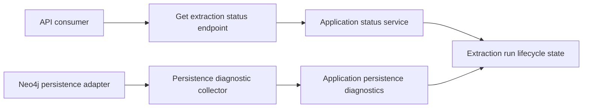

# Implementation Plan

Target output path: `docs/016-Persistence-Diagnostics/implementation-plan-wp016-persistence-diagnostics.md`

Related specification: `docs/016-Persistence-Diagnostics/spec-wp016-persistence-diagnostics.md`

This plan breaks WP016 into vertical, runnable slices that add persistence diagnostics to extraction status without changing extraction semantics, snapshot content, graph identity rules, or route paths. Each Work Item must be executed uninterrupted from implementation through validation, documentation and wiki review, and plan-record update. Status-only stopping points, confirmation pauses, or approval gates are not permitted inside an active Work Item. The only allowed stops are full Work Item completion, explicit user interruption or change of direction, or a true blocker that cannot be resolved from the specification, this plan, the codebase, or repository guidance.

Every code-writing Work Item must follow `./.github/instructions/documentation-pass.instructions.md` in full as a hard Definition of Done gate. Every Work Item must follow `./.github/instructions/wiki.instructions.md`; wiki review is mandatory even when no wiki update is ultimately required. Contributor-facing explanation must be written into `./wiki` topic pages, not into standalone implementation notes, implementation ledgers, architecture notes, or `wiki/home.md` dumping sections.

## Project Structure and Setup

WP016 should use the existing solution and Onion Architecture structure:

- Application contracts and lifecycle-facing models: `src/Archon.Application/`.
- Domain-independent diagnostic abstractions, if already established by current code conventions, should remain at the application boundary rather than inside API hosts or Neo4j driver code.
- Neo4j persistence instrumentation: `src/Archon.Infrastructure.Neo4j/`.
- Extraction status API serialization and endpoint mapping: `src/Archon.Api.Extraction/` and, where the current solution places host composition, the relevant host project under `src/`.
- Tests: corresponding projects under `test/`, especially `test/Archon.Application.Tests/`, `test/Archon.Infrastructure.Neo4j.Tests/`, and `test/Archon.Api.Extraction.Tests/`.
- Work-package planning artifact: this plan remains in `docs/016-Persistence-Diagnostics/` beside the WP016 specification.
- Wiki maintenance: topic pages under `wiki/`; do not place detailed contributor-facing content in `wiki/home.md` except concise orientation links if needed.

Before coding begins, the executor must inspect the current extraction status model, persistence handoff, run lifecycle store, timing model, test fixtures, and relevant wiki pages. The implementation must preserve existing response fields, existing top-level `Persistence` timing behavior, and compatibility for older run records without persistence diagnostics.

## Slice 1 - Application Diagnostic Contract and In-Memory End-to-End Status Path

- [x] Work Item 1: Add persistence diagnostic contracts and expose them through an application-level status path - Completed
  - **Purpose**: Establish the stable application contract for persistence diagnostics and prove that a run status can carry diagnostics from lifecycle state to a status response without involving Neo4j. This creates the smallest meaningful end-to-end path: create or update lifecycle state, attach diagnostics, retrieve status, and observe the additive diagnostics section.
  - **Acceptance Criteria**:
	- Application-layer contracts represent a persistence diagnostics container, ordered sub-stage timings, count values, and optional diagnostic warnings or warning integration according to existing conventions.
	- Diagnostic contracts support completed runs, failed runs with partial diagnostics, and runs that have not reached persistence.
	- Existing run status fields and top-level timings remain present and unchanged.
	- Older or manually seeded lifecycle records without diagnostics remain readable and are not treated as corrupt.
	- Diagnostic stage names are stable and follow the resolved WP016 convention: scoped display-style names such as `Persistence.PrepareSnapshot`, `Persistence.WriteWarnings`, `Persistence.Commit`, and `Persistence.Total`, unless existing timing conventions require a directly equivalent repository style.
  - **Definition of Done**:
	- Code implemented for models, lifecycle/status integration, serialization-ready contracts, validation, error handling, and logging where the current status path already uses logging.
	- Unit and application contract tests pass for completed, failed, and not-yet-persisting statuses.
	- Existing compatible fields remain covered by tests.
	- `./.github/instructions/documentation-pass.instructions.md` has been followed in full for every source file changed by this Work Item.
	- Developer-level comments are present for every class, record, interface, enum, method, and constructor added or modified, including internal and other non-public types and members.
	- Public APIs include XML comments with `
`, `<param>`, `<typeparam>` where applicable, `<returns>` where applicable, and meaningful nullability or cancellation remarks when relevant.
	- Every public method and constructor parameter is documented with its purpose.
	- Properties whose meaning is not obvious from their names are documented.
	- Inline or block comments explain non-obvious diagnostic flow, compatibility decisions, and partial-failure handling.
	- Wiki review is completed under `./.github/instructions/wiki.instructions.md`; relevant wiki or repository guidance is updated, or a specific no-change review result is recorded.
	- Foundational documentation uses book-like narrative depth where concepts are dense, defines technical terms on first use or links to glossary definitions, and includes examples or walkthrough fragments where they materially improve understanding.
	- No standalone implementation notes, implementation ledgers, or architecture notes are created for contributor-facing detail.
	- Can execute end-to-end via the relevant application tests that create a lifecycle status with diagnostics and retrieve the status response model.
	- Executor must not stop mid-Work Item; execution continues through implementation, validation, documentation/wiki review, and plan-record updates unless the Work Item is complete, the user explicitly interrupts, or a true blocker prevents further autonomous progress.
	- [x] Task 1: Locate and document the existing status and timing model - Completed. Existing status uses lower camel case JSON from PascalCase response records, UTC `DateTimeOffset` timing values, nullable optional fields, display-style top-level timing stages, and an in-memory lifecycle store.
	- [x] Step 1: Inspect extraction status response types, lifecycle state types, timing item types, and test fixtures.
	- [x] Step 2: Identify current casing, date/time, duration, nullable, and optional-field serialization conventions.
	- [x] Step 3: Record only concise plan-status findings in this plan if needed; route contributor-facing explanation to the wiki when it changes or materially clarifies current behavior.
  - [x] Task 2: Implement application diagnostic contracts - Completed. Added `ExtractionRunPersistenceDiagnostics`, `ExtractionRunPersistenceCounts`, status-response diagnostics contracts, and timing validation for non-empty stage names, non-negative durations, and UTC completion timestamps.
	- [x] Step 1: Add or extend application-layer types for persistence diagnostics, timing items, counts, and diagnostic warnings or warning linkage.
	- [x] Step 2: Ensure count values use zero for known empty collections and nullable or omitted values for unknown measurements according to existing serialization conventions.
	- [x] Step 3: Ensure timing items require non-empty stable stage names, non-negative elapsed milliseconds, and completed UTC values.
	- [x] Step 4: Add documentation comments and developer comments required by `./.github/instructions/documentation-pass.instructions.md`.
  - [x] Task 3: Integrate diagnostics with run lifecycle state - Completed. `ExtractionRun`, `SnapshotPersistenceResult`, orchestration terminal updates, and API status mapping now preserve optional diagnostics without erasing existing warnings, errors, progress, timings, submitted request data, or snapshot identity.
	- [x] Step 1: Add persistence diagnostics to the run lifecycle/status model without erasing warnings, errors, progress, timings, submitted request data, or snapshot identity.
	- [x] Step 2: Preserve null or empty diagnostics behavior for runs that have not reached persistence and older status records.
	- [x] Step 3: Ensure failed persistence states can retain partial diagnostics.
  - [x] Task 4: Add tests for the in-memory status path - Completed. Added application orchestration tests for completed diagnostics, failed partial diagnostics, no-diagnostics compatibility, and preservation of top-level timing separation.
	- [x] Step 1: Verify completed run status includes persistence diagnostics.
	- [x] Step 2: Verify failed run status includes available partial diagnostics and is not marked completed.
	- [x] Step 3: Verify run status without diagnostics remains readable.
	- [x] Step 4: Verify top-level timing fields remain present and detailed persistence timings are not flattened into the top-level timings collection.
  - [x] Task 5: Perform documentation and wiki review for Slice 1 - Completed. Wiki impact matrix: affected concepts were extraction status, persistence handoff diagnostics, count semantics, timing separation, and partial failure diagnostics; reviewed `wiki/api-extraction-workflow.md`, `wiki/neo4j-persistence-foundation.md`, `wiki/glossary.md`, and `wiki/home.md`; updated the first three pages; created no new pages; intentionally left `wiki/home.md` unchanged because the existing extraction workflow and Neo4j persistence foundation pages are the correct topic homes and home remains only a landing page.
	- [x] Step 1: Review likely topic pages such as persistence foundation, extraction API/status, runtime flow, and glossary pages.
	- [x] Step 2: Decide the correct wiki topic location for explaining the new diagnostic contract or record why existing pages remain sufficient.
	- [x] Step 3: Keep `wiki/home.md` concise and use it only for orientation links if a new or revised topic page requires discoverability.
  - **Completion Summary**: Implemented the application-level persistence diagnostics contract and in-memory status path across `src/Archon.Application` and `src/Archon.Api.Extraction`; added lifecycle and API response mapping support for completed, failed partial, and absent diagnostics; validated with `Archon.Application.Tests` and `Archon.Api.Extraction.Tests` in Visual Studio Test Explorer. Wiki review updated `wiki/api-extraction-workflow.md`, `wiki/neo4j-persistence-foundation.md`, and `wiki/glossary.md`; no standalone implementation notes were created.
  - **Files**:
	- `src/Archon.Application/**`: Add or extend diagnostic contracts and lifecycle/status integration at the application boundary.
	- `test/Archon.Application.Tests/**`: Add application-level lifecycle and contract tests.
	- `docs/016-Persistence-Diagnostics/implementation-plan-wp016-persistence-diagnostics.md`: Record concise completion and validation outcomes if this repository's current work-package practice requires plan-status updates.
	- `wiki/**`: Update only the correct topic pages when the wiki review determines contributor-facing guidance changed or was materially clarified.
  - **Work Item Dependencies**: None beyond the existing WP016 specification and current solution structure.
  - **Run / Verification Instructions**:
	- Run targeted application tests for extraction lifecycle/status behavior, for example the relevant `Archon.Application.Tests` filter in Visual Studio Test Explorer or the equivalent `dotnet test` invocation for `test/Archon.Application.Tests/Archon.Application.Tests.csproj`.
	- Run a build of changed projects and their dependent tests.
  - **User Instructions**: No manual setup should be required.

## Slice 2 - Diagnostic Collector and Persistence Adapter Instrumentation

- [x] Work Item 2: Capture persistence sub-stage timings and counts inside the persistence handoff - Completed
  - **Purpose**: Instrument the actual persistence path with a lightweight collector so completed and failed persistence attempts produce useful timing and count data without changing persisted snapshot content or adding costly duplicate materialization.
  - **Acceptance Criteria**:
	- Diagnostic capture begins before persistence preparation and ends after success or controlled failure.
	- The collector records a `Persistence.Total` timing and all accurately measurable logical sub-stages, including preparation, serialization or payload materialization when present, identity normalization, snapshot/header writes, repository/solution/project/file writes when separate, generalized node writes, relationship writes, evidence writes, finding writes, warning writes, metric writes, metadata writes, commit/finalization, and indexing when synchronous indexing is explicitly part of persistence.
	- Non-applicable stages may be omitted without preventing diagnostics from being returned.
	- Counts include known repository, solution, project, file/document, node, relationship, evidence, finding, warning, error, metric, generated summary, metadata, operation, batch, and serialized payload byte values when they can be measured cheaply and accurately.
	- Diagnostic capture does not record secrets, connection strings, raw Cypher statements, raw driver exceptions, unredacted environment variables, credentials, or database endpoint credentials.
	- Failure to collect optional counts does not fail an otherwise successful extraction run.
	- Diagnostic collection failure does not mask the original persistence failure.
  - **Definition of Done**:
	- Code implemented for collector behavior, persistence integration, count capture, timing capture, partial result capture, controlled warnings, and logging/error handling.
	- Unit tests and persistence integration tests pass for successful persistence, failed persistence after partial timing capture, and failure before any sub-stage completes.
	- Diagnostic overhead is kept low by using monotonic elapsed-time measurement and already-available counts where practical.
	- `./.github/instructions/documentation-pass.instructions.md` has been followed in full for every source file changed by this Work Item.
	- Developer-level comments are present for every class, method, constructor, and non-trivial local function or lambda added or modified, including internal and other non-public members.
	- Public APIs and public parameters are fully documented.
	- Inline comments explain collector lifecycle, partial failure preservation, timing ordering, and why expensive extra graph reads or duplicate payload materialization are avoided.
	- Wiki review is completed; persistence architecture or workflow pages are updated when implementation details change contributor-facing understanding.
	- Wiki content, when updated, uses long-form narrative for persistence flow and defines terms such as diagnostic collector, sub-stage timing, partial diagnostics, and durable write finalization.
	- No standalone implementation notes or `wiki/home.md` dumping are introduced.
	- Can execute end-to-end by running a representative persistence test that persists a snapshot and then observes diagnostics attached to the run status path.
	- Executor must not stop mid-Work Item; execution continues through implementation, validation, documentation/wiki review, and plan-record updates unless the Work Item is complete, the user explicitly interrupts, or a true blocker prevents further autonomous progress.
	- [x] Task 1: Locate the persistence handoff and current timing capture - Completed. Neo4j persistence validates the snapshot, initializes schema, canonicalizes evidence, writes supported records and relationships inside one write transaction, and previously returned aggregate counts without nested diagnostics.
	- [x] Step 1: Inspect Neo4j persistence implementation, snapshot persistence abstraction, transaction/commit flow, and existing top-level persistence timing capture.
	- [x] Step 2: Map existing concrete operations to WP016 logical sub-stage names.
	- [x] Step 3: Identify which requested stages are measurable, non-applicable, or too costly to measure in the current implementation.
  - [x] Task 2: Implement the diagnostic collector - Completed. Added an internal Neo4j collector that uses `Stopwatch`, records UTC completion timestamps, preserves completion order, appends `Persistence.Total`, and returns partial diagnostics on controlled failures without raw Cypher, driver details, credentials, or duplicate payload materialization.
	- [x] Step 1: Add a lightweight collector abstraction or concrete component at the application/infrastructure seam according to current dependency direction.
	- [x] Step 2: Use monotonic elapsed-time measurement for durations and UTC timestamps for completed timing items.
	- [x] Step 3: Preserve ordering by completion sequence.
	- [x] Step 4: Capture partial results when exceptions occur.
	- [x] Step 5: Convert diagnostic collection problems into controlled warnings when persistence otherwise succeeds.
  - [x] Task 3: Capture persistence counts - Completed. Counts now use already-available snapshot sections and completed writer counters; known empty values are zero, operation and batch counts are populated after successful transaction execution, and serialized payload bytes remain null because the writer does not build a separate serialized payload.
	- [x] Step 1: Populate snapshot entity counts from already-available snapshot collections.
	- [x] Step 2: Populate operation, batch, and serialized payload byte counts only when the adapter already knows them or can measure them without expensive reads or duplicate payload construction.
	- [x] Step 3: Represent known empty counts as zero and unknown optional counts as nullable or omitted values according to existing conventions.
  - [x] Task 4: Instrument persistence sub-stages - Completed. Instrumented preparation, indexing/schema initialization, materialization, identity normalization, repository, solution, snapshot header, node, metric, evidence, relationship, commit/finalization, and total timings while keeping detailed timings nested under persistence diagnostics.
	- [x] Step 1: Wrap preparation, serialization/materialization, identity normalization, write groups, commit/finalization, and indexing where applicable.
	- [x] Step 2: Ensure detailed persistence timings remain nested under persistence diagnostics and do not replace the existing top-level `Persistence` timing.
	- [x] Step 3: Ensure progress messages may identify current persistence activity where current lifecycle patterns support it, without excessive lifecycle write frequency.
  - [x] Task 5: Add collector and persistence tests - Completed. Added Neo4j writer integration coverage for successful diagnostic capture, failed validation partial diagnostics, stable safe stage names, UTC timestamps, operation counts, null serialized payload bytes, and absence of sensitive Cypher/endpoint text.
	- [x] Step 1: Verify named timings include elapsed milliseconds and completed UTC timestamps.
	- [x] Step 2: Verify stage ordering and stable names.
	- [x] Step 3: Verify partial diagnostics survive controlled persistence failure.
	- [x] Step 4: Verify diagnostic warnings do not erase existing run warnings.
	- [x] Step 5: Verify sensitive implementation details are not emitted.
  - [x] Task 6: Perform documentation and wiki review for Slice 2 - Completed. Wiki impact matrix: affected concepts were Neo4j persistence diagnostics, diagnostic collector lifecycle, sub-stage timing interpretation, count semantics, partial diagnostics, omitted-stage behavior, and durable write finalization; reviewed `wiki/neo4j-persistence-foundation.md`, `wiki/api-extraction-workflow.md`, `wiki/graph-domain-model.md`, `wiki/runtime-foundation.md`, `wiki/glossary.md`, and `wiki/home.md`; updated `wiki/neo4j-persistence-foundation.md` and `wiki/glossary.md`; created no new pages; intentionally left `wiki/api-extraction-workflow.md`, `wiki/graph-domain-model.md`, `wiki/runtime-foundation.md`, and `wiki/home.md` unchanged because persistence instrumentation belongs on the Neo4j persistence foundation page, terminology belongs in the glossary, and `home.md` remains only a landing page.
	- [x] Step 1: Review persistence foundation, graph model, extraction workflow, runtime, and glossary pages.
	- [x] Step 2: Update the correct topic page when instrumentation changes how contributors should reason about persistence execution.
	- [x] Step 3: Include practical examples or walkthrough fragments when they improve understanding of interpreting slow persistence runs.
  - **Completion Summary**: Implemented `Neo4jPersistenceDiagnosticCollector`, instrumented `Neo4jArchitectureSnapshotWriter`, and added focused integration tests in `test/Archon.Infrastructure.Neo4j.Tests`. Validation passed with targeted Neo4j writer tests, targeted Neo4j mapper tests, targeted application persistence result tests, and a workspace build. Wiki review updated `wiki/neo4j-persistence-foundation.md` and `wiki/glossary.md`; no standalone implementation notes were created.
  - **Files**:
	- `src/Archon.Infrastructure.Neo4j/**`: Instrument Neo4j persistence implementation and map implementation measurements to application contracts.
	- `src/Archon.Application/**`: Add collector abstractions or result types only where needed to preserve Onion Architecture.
	- `test/Archon.Infrastructure.Neo4j.Tests/**`: Add collector and persistence integration tests.
	- `test/Archon.Application.Tests/**`: Add focused collector or diagnostic result tests if the collector lives at the application boundary.
	- `wiki/**`: Update selected topic pages if required by wiki review.
  - **Work Item Dependencies**: Work Item 1 must be complete.
  - **Run / Verification Instructions**:
	- Run targeted persistence tests in `Archon.Infrastructure.Neo4j.Tests` that do not require the full external Aspire AppHost unless existing fixtures already provide that path.
	- Run relevant application tests for diagnostic contracts.
	- Run a build of changed projects and their dependent tests.
  - **User Instructions**: No secrets or live Neo4j credentials should be required for tests unless current repository integration fixtures already define a safe local test path.

## Slice 3 - Extraction API Response Contract and Serialization

- [x] Work Item 3: Return persistence diagnostics from get extraction status API - Completed
  - **Purpose**: Complete the API-facing vertical slice so consumers can retrieve the new diagnostic breakdown from the existing get extraction status endpoint while existing clients continue to receive current fields.
  - **Acceptance Criteria**:
	- The existing get extraction status route returns an additive `persistenceDiagnostics` or repository-equivalent property when diagnostics exist.
	- The response includes ordered sub-stage timing items with stage name, elapsed milliseconds, and completed UTC values using existing naming, casing, and date/time conventions.
	- The response includes structured count fields with stable names.
	- Runs with no diagnostics return null, omitted, or empty diagnostics according to existing API convention.
	- Existing top-level status, warning count, error count, progress, timings, and snapshot identity fields remain available and compatible.
	- Failed persistence runs return available partial diagnostics.
	- The API host serializes data returned by application services and does not compute persistence diagnostics or reference Neo4j driver details.
  - **Definition of Done**:
	- API response mapping and serialization implemented with additive compatibility.
	- API contract tests pass for completed diagnostics, failed partial diagnostics, no diagnostics, older records, stable count names, and existing top-level timing fields.
	- Error handling preserves not-found and existing failure behavior.
	- `./.github/instructions/documentation-pass.instructions.md` has been followed in full for every source file changed by this Work Item.
	- Developer-level and XML comments cover API DTOs, mapping methods, endpoint handlers, constructors, methods, parameters, and non-obvious properties.
	- Inline comments explain compatibility and why detailed timings are nested rather than flattened.
	- Wiki review is completed; extraction API or status workflow guidance is updated if API behavior or consumer interpretation changed.
	- Wiki updates include a non-sensitive sample response fragment and explain missing or null diagnostic values if this information belongs in contributor guidance.
	- No standalone implementation notes or `wiki/home.md` dumping are introduced.
	- Can execute end-to-end by invoking or testing the get extraction status path and observing persistence diagnostics in the response model or serialized JSON.
	- Executor must not stop mid-Work Item; execution continues through implementation, validation, documentation/wiki review, and plan-record updates unless the Work Item is complete, the user explicitly interrupts, or a true blocker prevents further autonomous progress.
	- [x] Task 1: Identify current API response mapping - Completed. Existing status mapping in `ExtractionEndpointRouteBuilderExtensions` already maps application-owned diagnostics to an additive `persistenceDiagnostics` response section and relies on current lower camel case JSON conventions.
	- [x] Step 1: Inspect extraction status endpoint, request/response DTOs, mapping extensions, serialization tests, and route tests.
	- [x] Step 2: Identify current JSON naming and optional-field conventions.
  - [x] Task 2: Extend response DTOs or mapping - Completed. No production mapping change was required because Work Item 1 had already added the response DTOs and `ToPersistenceDiagnosticsResponse`; Work Item 3 verified the API host serializes application diagnostics without computing infrastructure details and preserves existing fields and route behavior.
	- [x] Step 1: Add an additive diagnostics property under the current response shape.
	- [x] Step 2: Map application diagnostics without computing them in the API host.
	- [x] Step 3: Preserve existing fields and route behavior.
  - [x] Task 3: Add API serialization tests - Completed. Added endpoint tests for completed diagnostics, failed partial diagnostics, no-diagnostics compatibility, stable count field names, nested timing serialization, and separation from top-level timings.
	- [x] Step 1: Verify completed run JSON includes persistence diagnostics.
	- [x] Step 2: Verify failed run JSON includes partial diagnostics.
	- [x] Step 3: Verify no-diagnostic and older-run cases are handled cleanly.
	- [x] Step 4: Verify stable count field names and timing item serialization style.
  - [x] Task 4: Perform documentation and wiki review for Slice 3 - Completed. Wiki impact matrix: affected concepts were get extraction status response interpretation, null diagnostics compatibility, nested persistence timing serialization, stable count field names, partial failed-run diagnostics, and top-level timing separation; reviewed `wiki/api-extraction-workflow.md`, `wiki/neo4j-persistence-foundation.md`, `wiki/glossary.md`, and `wiki/home.md`; updated `wiki/api-extraction-workflow.md`; created no new pages; intentionally left `wiki/neo4j-persistence-foundation.md`, `wiki/glossary.md`, and `wiki/home.md` unchanged because API response interpretation belongs on the extraction workflow page, persistence collector concepts and glossary terms were already current, and `home.md` remains only a landing page.
	- [x] Step 1: Review API contract, extraction status, and glossary pages.
	- [x] Step 2: Update the correct page with response interpretation guidance if needed.
	- [x] Step 3: Include a non-sensitive sample response fragment and define technical terms such as sub-stage timing and count field where needed.
  - **Completion Summary**: Added API endpoint contract coverage in `test/Archon.Api.Extraction.Tests/ExtractionEndpointTests.cs` for completed diagnostics, failed partial diagnostics, null diagnostics compatibility, stable count field names, UTC nested timing serialization, and preservation of existing top-level timing fields. Confirmed existing `src/Archon.Api.Extraction` response mapping already serializes application-owned diagnostics without Neo4j details. Validation passed with targeted Work Item 3 tests, the full `Archon.Api.Extraction.Tests` project in Visual Studio Test Explorer, and a workspace build. Wiki review updated `wiki/api-extraction-workflow.md`; no standalone implementation notes were created.
  - **Files**:
	- `src/Archon.Api.Extraction/**`: Extend status response DTOs, endpoint mapping, and serialization behavior.
	- `test/Archon.Api.Extraction.Tests/**`: Add API response and serialization tests.
	- `src/Archon.Application/**`: Adjust application response contracts only if needed by API mapping.
	- `wiki/**`: Update selected API/status topic pages when required.
  - **Work Item Dependencies**: Work Items 1 and 2 must be complete.
  - **Run / Verification Instructions**:
	- Run targeted API extraction tests in `Archon.Api.Extraction.Tests`.
	- Run application and persistence tests affected by mapping changes.
	- If the repository has a lightweight local host test path, issue a get extraction status request for a seeded completed run and inspect the serialized response.
  - **User Instructions**: No route changes or client opt-in flags are required.

## Slice 4 - Progress, Failure, and Compatibility Hardening

- [x] Work Item 4: Harden progress reporting, warning preservation, and compatibility scenarios - Completed
  - **Purpose**: Ensure persistence diagnostics behave safely in operational edge cases, including in-progress persistence, diagnostic failures, controlled persistence failures, older records, warning preservation, and strict compatibility expectations.
  - **Acceptance Criteria**:
	- During persistence, progress continues to identify the run as being in the persistence stage.
	- Current persistence activity can be reflected in progress messages where existing patterns support it, without flooding lifecycle storage.
	- Diagnostic failures do not mask original persistence failures.
	- Required timing recording failures, when persistence succeeds, become controlled warnings visible through the existing warning model where appropriate.
	- Diagnostic warnings do not erase existing warnings.
	- Sensitive details are not exposed through diagnostics, warnings, errors, or serialized responses.
	- Existing status records created before WP016 remain readable.
  - **Definition of Done**:
	- Edge-case handling implemented and covered by tests.
	- Targeted unit, application, API, and persistence tests pass.
	- `./.github/instructions/documentation-pass.instructions.md` has been followed in full for every source file changed by this Work Item.
	- Developer-level comments explain progress throttling, warning merge behavior, redaction boundaries, and compatibility handling.
	- Wiki review is completed and operational/troubleshooting guidance is updated if the edge-case behavior affects contributor workflows.
	- Wiki information architecture is reviewed so dense troubleshooting or interpretation guidance goes to topic pages, not `wiki/home.md`.
	- No standalone implementation notes are created.
	- Can execute end-to-end by running tests that simulate in-progress, completed, failed, and legacy/no-diagnostic runs through status retrieval.
	- Executor must not stop mid-Work Item; execution continues through implementation, validation, documentation/wiki review, and plan-record updates unless the Work Item is complete, the user explicitly interrupts, or a true blocker prevents further autonomous progress.
	- [x] Task 1: Add progress behavior safeguards - Completed. Confirmed orchestration keeps lifecycle writes at existing stage cadence, retains top-level `Persistence` progress during persistence failure, preserves top-level `Persistence` and `Total` timings, and keeps detailed sub-stage timings nested under diagnostics instead of adding progress writes for each sub-stage.
	- [x] Step 1: Confirm current progress update frequency and lifecycle write patterns.
	- [x] Step 2: Add sub-stage activity messages only where they align with existing throttling or update cadence.
	- [x] Step 3: Ensure final completed status includes both top-level timings and nested diagnostics.
  - [x] Task 2: Add diagnostic warning and failure safeguards - Completed. Neo4j persistence now translates unexpected infrastructure failures into safe failed `SnapshotPersistenceResult` values with partial diagnostics, while application tests verify controlled persistence warnings append to existing pipeline warnings without erasing diagnostics or adding diagnostic failures as errors.
	- [x] Step 1: Preserve original persistence exception behavior.
	- [x] Step 2: Merge controlled diagnostic warnings without erasing existing warnings.
	- [x] Step 3: Redact or avoid sensitive diagnostic output.
  - [x] Task 3: Add compatibility tests - Completed. Added regression coverage for older/no-diagnostic run compatibility, failed persistence after partial diagnostics, failure before diagnostics exist, and early Neo4j initialization failure before write stages complete.
	- [x] Step 1: Test older records or manually seeded status state without diagnostics.
	- [x] Step 2: Test failed persistence after partial diagnostics.
	- [x] Step 3: Test failure before any sub-stage completes.
	- [x] Step 4: Test diagnostics absent for runs that have not reached persistence.
  - [x] Task 4: Perform documentation and wiki review for Slice 4 - Completed. Wiki impact matrix: affected concepts were persistence progress throttling, controlled diagnostic warnings, warning merge behavior, partial diagnostics, no-diagnostic compatibility, early infrastructure failure translation, redaction boundaries, and focused validation workflow; reviewed `wiki/api-extraction-workflow.md`, `wiki/neo4j-persistence-foundation.md`, `wiki/validation-and-test-workflows.md`, `wiki/glossary.md`, and `wiki/home.md`; updated `wiki/neo4j-persistence-foundation.md` and `wiki/validation-and-test-workflows.md`; created no new pages; intentionally left `wiki/api-extraction-workflow.md`, `wiki/glossary.md`, and `wiki/home.md` unchanged because the API page already describes status shape and sanitization, glossary terms remained sufficient, and `home.md` remains only a landing page.
	- [x] Step 1: Review troubleshooting, validation, extraction workflow, and persistence pages.
	- [x] Step 2: Update guidance if contributors need to understand missing diagnostics, partial diagnostics, or diagnostic warnings.
  - **Completion Summary**: Hardened `src/Archon.Infrastructure.Neo4j/Persistence/Neo4jArchitectureSnapshotWriter.cs` so unexpected infrastructure failures are logged and translated into safe failed persistence results with partial diagnostics. Added regression tests in `test/Archon.Application.Tests/Extraction/Orchestration/ExtractionOrchestratorTests.cs` and `test/Archon.Infrastructure.Neo4j.Tests/Persistence/Neo4jArchitectureSnapshotWriterTests.cs` for warning preservation, progress/timing compatibility, no-diagnostic failures, early infrastructure failures, partial diagnostics, and sensitive-detail exclusion. Validation passed with targeted edge-case tests, the full `Archon.Application.Tests` and `Archon.Infrastructure.Neo4j.Tests` projects in Visual Studio Test Explorer (151 passed), and a workspace build. Wiki review updated `wiki/neo4j-persistence-foundation.md` and `wiki/validation-and-test-workflows.md`; no standalone implementation notes were created.
  - **Files**:
	- `src/Archon.Application/**`: Lifecycle, warning, progress, or compatibility handling as needed.
	- `src/Archon.Infrastructure.Neo4j/**`: Collector failure and redaction safeguards as needed.
	- `src/Archon.Api.Extraction/**`: Serialization compatibility handling as needed.
	- `test/**`: Add cross-layer edge-case tests in the relevant existing test projects.
	- `wiki/**`: Update selected topic pages if required.
  - **Work Item Dependencies**: Work Items 1 through 3 must be complete.
  - **Run / Verification Instructions**:
	- Run targeted tests covering in-progress, failed, no-diagnostic, completed, warning, and compatibility scenarios.
	- Run a build of changed projects.
  - **User Instructions**: No manual setup should be required.

## Slice 5 - Documentation, Validation, and Work-Package Completion

- [x] Work Item 5: Complete documentation, validation, and final work-package review - Completed
  - **Purpose**: Ensure WP016 is fully validated, documented, and ready for contributor use. This slice makes the diagnostic feature demonstrable and records the required wiki outcome for the whole work package.
  - **Acceptance Criteria**:
	- Documentation explains the purpose of persistence diagnostics and their relationship to the existing top-level `Persistence` timing.
	- Documentation describes every emitted persistence sub-stage timing name.
	- Documentation describes every emitted persistence count field.
	- Documentation explains missing, omitted, zero, and null diagnostic values.
	- Documentation clarifies that WP016 adds diagnostic visibility and does not optimize persistence throughput.
	- Documentation includes a non-sensitive sample get extraction status response fragment.
	- All relevant targeted tests pass; broader validation is run according to repository guidance and practical scope.
	- The final work-package record states wiki pages reviewed, updated, created, retired, intentionally unchanged, and the page-structure decision.
  - **Definition of Done**:
	- Mandatory documentation pass is complete for all code-writing work under `./.github/instructions/documentation-pass.instructions.md`.
	- Mandatory wiki review is complete under `./.github/instructions/wiki.instructions.md`.
	- Wiki updates, if required, are written as current-state contributor guidance in the correct topic pages using long-form narrative where the subject is conceptually dense.
	- Technical terms are defined inline or linked to glossary entries.
	- Examples or walkthrough material are included where they materially improve understanding.
	- `wiki/home.md` remains a concise landing page and is not used as a catch-all for persistence diagnostic details.
	- Any stale implementation-note-style artifacts discovered during review are retired after current contributor guidance is moved to the wiki.
	- The plan contains or is updated with a concise final wiki impact matrix or equivalent prose covering affected concepts, pages reviewed, pages updated, pages created, pages intentionally unchanged, and page-structure decision.
	- Validation outcomes are recorded concisely without duplicating contributor-facing wiki content.
	- Executor must not stop mid-Work Item; execution continues through validation, documentation/wiki review, and plan-record updates unless the Work Item is complete, the user explicitly interrupts, or a true blocker prevents further autonomous progress.
	- [x] Task 1: Complete source documentation validation - Completed. Reinspected WP016-touched application, API, infrastructure, and test files; added missing XML parameter documentation in `src/Archon.Infrastructure.Neo4j/Persistence/Neo4jArchitectureSnapshotWriter.cs`, `test/Archon.Application.Tests/Extraction/Orchestration/ExtractionOrchestratorTests.cs`, and `test/Archon.Api.Extraction.Tests/ExtractionEndpointTests.cs`; file diagnostics reported no errors for the edited files.
	- [x] Step 1: Reinspect every hand-maintained `.cs` file changed by WP016.
	- [x] Step 2: Confirm every public and non-public type, method, and constructor meets the repository documentation-pass standard.
	- [x] Step 3: Confirm public parameters, generic type parameters, return values, meaningful nullability, and cancellation expectations are documented where applicable.
	- [x] Step 4: Confirm inline comments explain diagnostic flow and non-obvious choices without changing behavior.
  - [x] Task 2: Complete wiki information-architecture review - Completed. Affected concepts were extraction status, persistence diagnostics, persistence timing breakdown, diagnostic counts, partial diagnostics, diagnostic warnings, no-diagnostic compatibility, and validation scope. Reviewed `wiki/api-extraction-workflow.md`, `wiki/neo4j-persistence-foundation.md`, `wiki/validation-and-test-workflows.md`, `wiki/glossary.md`, and `wiki/home.md`; existing topic pages remain the correct homes and no dedicated persistence diagnostics page was needed.
	- [x] Step 1: Identify affected concepts: extraction status, persistence diagnostics, persistence timing breakdown, diagnostic counts, partial diagnostics, and diagnostic warnings.
	- [x] Step 2: Review relevant topic pages and glossary pages.
	- [x] Step 3: Decide whether existing pages are the correct home or whether a new persistence diagnostics topic page is needed.
	- [x] Step 4: Verify `wiki/home.md` remains concise and only links to topic pages where needed.
	- [x] Step 5: Verify cross-links and glossary entries are sufficient.
  - [x] Task 3: Update wiki or record no-change result - Completed. Updated `wiki/neo4j-persistence-foundation.md` with explicit emitted timing names, count-field semantics, and the visibility-not-throughput-optimization clarification; updated `wiki/api-extraction-workflow.md` with the complete public count-field list and interpretation guidance. The existing sample get extraction status response fragment remains non-sensitive and current. Created no new pages and left `wiki/home.md`, `wiki/validation-and-test-workflows.md`, and `wiki/glossary.md` unchanged because the topic pages and glossary terms already provide the correct reader path.
	- [x] Step 1: Update selected topic pages if contributor-facing behavior, architecture, workflows, terminology, or interpretation guidance changed.
	- [x] Step 2: Use book-like narrative prose for dense architecture, runtime, persistence, API, or troubleshooting guidance.
	- [x] Step 3: Add a sample get extraction status response fragment that contains no secrets or sensitive local paths.
	- [x] Step 4: Record why no wiki update was needed if the review determines existing wiki pages remain sufficient.
  - [x] Task 4: Run validation - Completed. Validation passed with `dotnet build D:\Dev\Archon\Archon.slnx`, `Archon.Application.Tests` in Visual Studio Test Explorer (108 passed), `Archon.Api.Extraction.Tests` in Visual Studio Test Explorer (35 passed), and `Archon.Infrastructure.Neo4j.Tests` in Visual Studio Test Explorer (43 passed). The full test suite was not run because repository guidance for this work package prohibits full-suite runs; targeted WP016-relevant projects and a full solution build were used instead.
	- [x] Step 1: Run targeted unit, application, API, and persistence tests changed or added by WP016.
	- [x] Step 2: Run project or solution build validation according to repository guidance.
	- [x] Step 3: Do not run the full test suite if repository guidance for this work package prohibits it; otherwise run the necessary broader validation required by the documentation-pass scope or explain any pre-existing unrelated failure.
  - [x] Task 5: Record final work-package outcome - Completed. Final outcome recorded here with a concise validation record and wiki impact matrix; contributor-facing details remain in `wiki/api-extraction-workflow.md` and `wiki/neo4j-persistence-foundation.md` instead of standalone implementation notes.
	- [x] Step 1: Add concise validation outcomes to this plan if the repository's work-package practice expects status updates.
	- [x] Step 2: Add a final wiki impact matrix or equivalent prose.
	- [x] Step 3: Link to wiki guidance instead of duplicating contributor-facing explanations in this plan.
  - **Completion Summary**: Completed WP016 final documentation and validation review. Source documentation gaps were corrected in the Neo4j writer and WP016 test helpers without changing behavior. Wiki review updated `wiki/neo4j-persistence-foundation.md` and `wiki/api-extraction-workflow.md` with explicit persistence diagnostic timing and count guidance, retained existing glossary and validation workflow guidance, and kept `wiki/home.md` as a concise landing page. Validation passed with full solution build and targeted WP016-relevant application, API, and Neo4j infrastructure test projects.
  - **Files**:
	- `wiki/**`: Correct topic pages for persistence diagnostics, extraction status, persistence foundation, troubleshooting, validation, or glossary updates.
	- `docs/016-Persistence-Diagnostics/implementation-plan-wp016-persistence-diagnostics.md`: Concise final validation and wiki impact record if updated during execution.
	- Changed source and test files from prior slices: final documentation-pass inspection scope.
  - **Work Item Dependencies**: Work Items 1 through 4 must be complete.
  - **Run / Verification Instructions**:
	- Run all targeted WP016 test filters and changed-project builds.
	- Run any additional validation required by `./.github/instructions/documentation-pass.instructions.md` for the final documentation-pass scope, unless a repository-specific instruction prohibits that broader run; if prohibited or blocked, record the reason and the alternative validation actually performed.
  - **User Instructions**: None expected.

## Final Wiki Impact Matrix Template

The executor must complete this matrix, or equivalent concise prose, before WP016 is considered done:

| Affected Concept | Pages Reviewed | Pages Updated | Pages Created | Pages Retired | Pages Intentionally Unchanged | Page-Structure Decision |
| --- | --- | --- | --- | --- | --- | --- |
| Extraction status diagnostics | `wiki/api-extraction-workflow.md`, `wiki/neo4j-persistence-foundation.md`, `wiki/glossary.md`, `wiki/home.md` | `wiki/api-extraction-workflow.md` | None | None | `wiki/neo4j-persistence-foundation.md`, `wiki/glossary.md`, `wiki/home.md` for API response placement | Status response interpretation belongs in the extraction workflow topic; `wiki/home.md` remains a landing page. |
| Persistence timing breakdown | `wiki/neo4j-persistence-foundation.md`, `wiki/api-extraction-workflow.md`, `wiki/validation-and-test-workflows.md`, `wiki/glossary.md` | `wiki/neo4j-persistence-foundation.md` | None | None | `wiki/validation-and-test-workflows.md`, `wiki/glossary.md` | Existing persistence foundation page is the correct home for emitted stage names and diagnostic collector semantics; no dedicated page is needed. |
| Diagnostic count fields | `wiki/api-extraction-workflow.md`, `wiki/neo4j-persistence-foundation.md`, `wiki/glossary.md` | `wiki/api-extraction-workflow.md`, `wiki/neo4j-persistence-foundation.md` | None | None | `wiki/glossary.md` | Public field interpretation lives near status guidance and persistence instrumentation guidance; glossary terms remain sufficient. |
| Partial diagnostics and failures | `wiki/api-extraction-workflow.md`, `wiki/neo4j-persistence-foundation.md`, `wiki/validation-and-test-workflows.md`, `wiki/home.md` | None for this final slice beyond the timing/count clarifications above | None | None | `wiki/api-extraction-workflow.md`, `wiki/neo4j-persistence-foundation.md`, `wiki/validation-and-test-workflows.md`, `wiki/home.md` | Existing operational and troubleshooting prose already explains partial diagnostics, missing diagnostics, safe failures, and targeted validation. |
| Glossary and terminology | `wiki/glossary.md`, `wiki/api-extraction-workflow.md`, `wiki/neo4j-persistence-foundation.md` | None | None | None | `wiki/glossary.md` | Existing terms for persistence diagnostic breakdown, diagnostic collector, sub-stage timing, and durable write finalization are sufficient and linked from topic pages. |

## Appendix A - Architecture

### Overall Technical Approach

WP016 adds observability to the existing extraction persistence flow. Observability means the system reports enough internal timing and count information for developers and operators to understand what happened, without changing the business operation itself. The implementation should add stable diagnostic contracts at the application boundary, populate those contracts from the persistence adapter, retain them in extraction run lifecycle state, and serialize them through the existing get extraction status API as an additive response section.

The design preserves Onion Architecture. Domain code remains independent of API host and Neo4j implementation details. Application-layer contracts define what persistence diagnostics mean to the rest of the system. Infrastructure code can measure Neo4j-specific work, but it must map those measurements to stable application contracts before returning them. The API host remains a serialization and endpoint layer; it must not compute diagnostics or depend on Neo4j driver types.

The diagram shows the intended direction of data flow. The persistence adapter records diagnostic measurements through a collector. The collector produces application diagnostic data that is attached to lifecycle state. The status endpoint later serializes that lifecycle state for API consumers. The client receives a top-level timing summary plus a nested persistence diagnostic breakdown.

### Frontend

WP016 has no UI or frontend scope. There are no planned pages, components, visualizations, or navigation changes in a frontend project. API consumers may use the new response data, but adding a UI visualization for persistence diagnostics is explicitly out of scope. If a future Work Package introduces a dashboard or UI, it should consume the additive `persistenceDiagnostics` response section rather than requiring changes to the diagnostic capture model.

### Backend

The backend implementation spans application contracts, persistence instrumentation, lifecycle state, and API serialization.

At the application boundary, the diagnostic model should contain a persistence diagnostics container, a timing item model, a count model, and any warning or result model needed to preserve partial data. A timing item is a completed sub-stage measurement with a stable stage name, elapsed duration in milliseconds, and a UTC completion timestamp. A count field is a numeric volume or operation measurement that explains the scale of the persisted snapshot or the persistence operation.

In infrastructure, the Neo4j persistence implementation should use a lightweight collector around existing persistence operations. The collector should use monotonic elapsed-time measurement for durations and avoid per-entity lifecycle writes. Counts should come from existing snapshot collections or adapter counters. The implementation must not read the graph back from Neo4j solely to populate diagnostics and must not materialize duplicate large payloads just to count bytes unless payload materialization is already part of the persistence operation.

In lifecycle integration, diagnostics must be associated with exactly one extraction run and retained according to the existing run-history retention model. Completed runs should expose full available diagnostics. Failed persistence runs should expose partial diagnostics collected before failure. Runs that never reached persistence, and older runs created before WP016, should remain valid without diagnostics.

In the API layer, the existing get extraction status route should return diagnostics as an additive nested section. Existing top-level fields and top-level `timings` remain stable. Detailed persistence sub-stage timings belong under `persistenceDiagnostics.timings` or the repository-equivalent property and must not be flattened into the top-level timing collection. This keeps current clients compatible while giving new consumers a clear way to distinguish the summary persistence timing from detailed persistence measurements.

## Brief Summary

This plan delivers WP016 as incremental vertical slices: first the application status contract, then real persistence instrumentation, then API serialization, then operational hardening, and finally documentation/wiki validation. The key implementation considerations are compatibility, low diagnostic overhead, strict Onion Architecture boundaries, partial diagnostics on failure, sensitive-data avoidance, mandatory source documentation, and mandatory wiki maintenance with proper topic-page information architecture.
