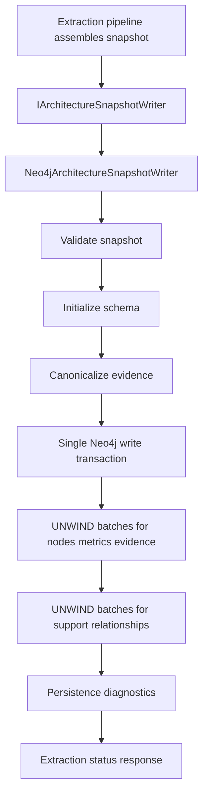

# Implementation Plan

Target output path: `docs/017-Neo4j-Persistence-Performance/implementation-plan-wp017-neo4j-persistence-performance.md`

Related specification: `docs/017-Neo4j-Persistence-Performance/spec-wp017-neo4j-persistence-performance.md`

This plan breaks WP017 into vertical, runnable slices that improve Neo4j snapshot persistence throughput while preserving stable-key graph semantics, evidence-first modeling, existing extraction status behavior, and safe persistence failure handling. Each Work Item must be executed uninterrupted from implementation through validation, documentation and wiki review, and plan-record update. Status-only stopping points, confirmation pauses, or approval gates are not permitted inside an active Work Item. The only allowed stops are full Work Item completion, explicit user interruption or change of direction, or a true blocker that cannot be resolved from the specification, this plan, the codebase, or repository guidance.

Every code-writing Work Item must follow `./.github/instructions/documentation-pass.instructions.md` in full as a hard Definition of Done gate. This includes developer-level documentation for every class, method, constructor, non-trivial local function, non-trivial lambda, public parameter, and non-obvious property touched or introduced by the Work Item, including internal and other non-public types. Every Work Item must also follow `./.github/instructions/wiki.instructions.md`; wiki review is mandatory even when no wiki update is ultimately required. Contributor-facing explanation must be written into `./wiki` topic pages, not into standalone implementation notes, implementation ledgers, architecture notes, or `wiki/home.md` dumping sections.

## Project Structure and Setup

WP017 uses the existing Archon solution and Onion Architecture structure:

- Neo4j persistence implementation and batching mechanics: `src/Archon.Infrastructure.Neo4j/`.
- Neo4j options and validation: `src/Archon.Infrastructure.Neo4j/Configuration/`.
- Application-facing persistence contracts and run diagnostics, only if additive diagnostic contract changes become necessary: `src/Archon.Application/`.
- API status mapping, only if additive diagnostics change application/API contracts: `src/Archon.Api.Extraction/`.
- Tests: corresponding projects under `test/`, especially `test/Archon.Infrastructure.Neo4j.Tests/`, `test/Archon.Application.Tests/`, and `test/Archon.Api.Extraction.Tests/` if application or API contracts change.
- Work-package planning artifact: this plan remains in `docs/017-Neo4j-Persistence-Performance/` beside the WP017 specification.
- Wiki maintenance: topic pages under `wiki/`; do not place detailed contributor-facing content in `wiki/home.md` except concise orientation links if needed.

Before coding begins, the executor must inspect the current `Neo4jArchitectureSnapshotWriter`, `Neo4jSnapshotPersistenceMapper`, `Neo4jOptions`, `Neo4jOptionsValidator`, persistence diagnostics, existing Neo4j integration tests, and relevant wiki pages. The implementation must preserve the existing public persistence port, one-transaction success semantics, stable-key merge identity, safe error translation, and backward-compatible extraction status behavior.

The resolved WP017 planning decisions are binding unless the specification is formally revised: use a default high-volume persistence batch size of 1,000 rows; add optional `Neo4jOptions.PersistenceBatchSize` validation; preserve `persistenceBatchCount` as write transaction count; use `persistenceOperationCount` for actual Cypher executions after batching; introduce relationship-family timings; and use the same real repository extraction manually for performance validation without creating a synthetic large repository or synthetic large-snapshot fixture.

## Slice 1 - Configurable Batch Size and Batching Foundation

- [ ] Work Item 1: Add configurable Neo4j persistence batch sizing and reusable batched execution support
  - **Purpose**: Establish the smallest runnable infrastructure slice for batched persistence by adding validated batch-size configuration and a focused helper path that can execute one static Cypher statement over one or more bounded parameter-list batches. This creates an end-to-end capability through options binding, validation, writer construction, and a representative small batched write path without changing graph semantics.
  - **Acceptance Criteria**:
	- `Neo4jOptions` exposes an optional persistence batch-size setting with a default of 1,000 rows when unset.
	- `Neo4jOptionsValidator` rejects invalid batch sizes and accepts the default and valid configured values.
	- The batching support skips empty inputs, executes final partial batches, and increments operation counts by actual Cypher executions rather than row count.
	- The batching support keeps Cypher static and parameterized, with user-controlled values passed only as parameters.
	- The implementation preserves the existing `IArchitectureSnapshotWriter` entry point and does not introduce Neo4j dependencies into domain or application projects.
  - **Definition of Done**:
	- Code implemented for options, validation, dependency injection consumption, batching helper behavior, logging/error handling where current patterns require it, and tests.
	- Unit tests pass for default batch size, explicit valid batch size, invalid batch sizes, empty batch behavior, exact batch-size boundaries, and final partial batches.
	- Existing Neo4j options and composition tests continue to pass.
	- `./.github/instructions/documentation-pass.instructions.md` has been followed in full for every source file changed by this Work Item.
	- Developer-level comments are present for every class, record, method, constructor, non-trivial local function, and non-trivial lambda added or modified, including internal and other non-public types and members.
	- Public APIs include XML comments with `
`, `<param>`, `<typeparam>` where applicable, `<returns>` where applicable, and meaningful nullability or validation remarks when relevant.
	- Every public method and constructor parameter is documented with its purpose.
	- Properties whose meaning is not obvious from their names are documented.
	- Inline or block comments explain batch-size validation, empty-batch skipping, partial-batch handling, and why operation count means Cypher execution count.
	- Wiki review is completed under `./.github/instructions/wiki.instructions.md`; relevant wiki or repository guidance is updated, or a specific no-change review result is recorded.
	- Foundational documentation uses book-like narrative depth where concepts are dense, defines technical terms on first use or links to glossary definitions, and includes examples or walkthrough fragments where they materially improve understanding.
	- No standalone implementation notes, implementation ledgers, or architecture notes are created for contributor-facing detail.
	- Can execute end-to-end via targeted Neo4j options and batching-helper tests.
	- Executor must not stop mid-Work Item; execution continues through implementation, validation, documentation/wiki review, and plan-record updates unless the Work Item is complete, the user explicitly interrupts, or a true blocker prevents further autonomous progress.
  - [ ] Task 1: Inspect current Neo4j configuration and writer construction
	- [ ] Step 1: Read `Neo4jOptions`, `Neo4jOptionsValidator`, dependency-injection registration, and writer tests.
	- [ ] Step 2: Identify the current validation pattern for numeric options and safe validation messages.
	- [ ] Step 3: Identify how `Neo4jArchitectureSnapshotWriter` can receive the configured batch size without changing application-facing ports.
  - [ ] Task 2: Add persistence batch-size option
	- [ ] Step 1: Add a nullable or defaulted `PersistenceBatchSize` property to `Neo4jOptions` with XML documentation describing its role in high-volume `UNWIND` persistence.
	- [ ] Step 2: Add validation for positive values and a documented practical upper bound only if existing option validation patterns support such bounds.
	- [ ] Step 3: Ensure unset values resolve to 1,000 rows in the writer or in a single configuration helper.
  - [ ] Task 3: Implement reusable batching support
	- [ ] Step 1: Add a focused internal helper or writer-private method that partitions records into configured-size batches without creating repository-wide generic abstraction layers.
	- [ ] Step 2: Ensure empty collections do not execute Cypher.
	- [ ] Step 3: Ensure exact-size and final partial batches execute once per batch.
	- [ ] Step 4: Ensure operation count increments once per executed Cypher statement.
  - [ ] Task 4: Add tests for configuration and batching behavior
	- [ ] Step 1: Extend `Neo4jOptionsValidator` tests for default, valid, and invalid batch-size scenarios.
	- [ ] Step 2: Add batching behavior tests through a suitable seam, writer helper, or existing driver mock pattern.
	- [ ] Step 3: Verify no API or application contract changes are needed for this slice.
  - [ ] Task 5: Perform documentation and wiki review for Slice 1
	- [ ] Step 1: Review `wiki/neo4j-persistence-foundation.md`, `wiki/runtime-foundation.md`, `wiki/glossary.md`, and `wiki/home.md` for configuration and persistence-batching impact.
	- [ ] Step 2: Decide whether batch-size configuration is contributor-facing enough to update the Neo4j persistence foundation page now or whether it should wait until write batching is implemented.
	- [ ] Step 3: Record the wiki impact result in this plan, including pages reviewed, pages updated or intentionally unchanged, and why `wiki/home.md` remains a landing page only.
  - **Files**:
	- `src/Archon.Infrastructure.Neo4j/Configuration/Neo4jOptions.cs`: Add persistence batch-size option and documentation.
	- `src/Archon.Infrastructure.Neo4j/Configuration/Neo4jOptionsValidator.cs`: Validate configured batch size.
	- `src/Archon.Infrastructure.Neo4j/DependencyInjection/Neo4jServiceCollectionExtensions.cs`: Adjust construction only if the writer needs additional option access.
	- `src/Archon.Infrastructure.Neo4j/Persistence/Neo4jArchitectureSnapshotWriter.cs`: Add or consume batching support without changing the public writer port.
	- `test/Archon.Infrastructure.Neo4j.Tests/Configuration/**`: Extend option validation tests.
	- `test/Archon.Infrastructure.Neo4j.Tests/Persistence/**`: Add batching support tests where practical.
	- `wiki/**`: Update selected topic pages if required by wiki review.
  - **Work Item Dependencies**: None beyond the WP017 specification and current solution structure.
  - **Run / Verification Instructions**:
	- Run targeted Neo4j configuration tests in `test/Archon.Infrastructure.Neo4j.Tests`.
	- Run targeted persistence tests covering batching helper behavior.
	- Run a build of changed projects and their dependent tests.
  - **User Instructions**: No manual setup is required for this slice.

## Slice 2 - Batched Metric Persistence End-to-End

- [ ] Work Item 2: Persist metrics through batched `UNWIND` statements while preserving graph equivalence
  - **Purpose**: Optimize the largest node-record hotspot from the observed run by replacing per-metric Cypher execution with batched metric upserts. This slice is runnable end to end because a snapshot containing metrics can be persisted to Neo4j and queried by stable key with materially fewer Cypher executions.
  - **Acceptance Criteria**:
	- Metric records are persisted through one or more bounded `UNWIND` batches rather than one statement per metric.
	- Batched metric writes preserve all properties currently set by `MetricMergeCypher`.
	- Metrics continue to merge by snapshot stable key plus metric stable key.
	- Nullable numeric, text, node-target, edge-target, and primary-evidence values behave consistently with the current writer.
	- `Persistence.WriteMetrics` remains present and measures batched metric persistence.
	- `persistenceOperationCount` reflects executed Cypher batch statements for metrics instead of metric row count.
  - **Definition of Done**:
	- Code implemented for batched metric parameter materialization, Cypher execution, operation counting, diagnostics, error handling, and logging where current patterns require it.
	- Integration tests prove metrics persist by stable key, idempotent reruns do not create duplicate metric nodes, and representative metric value shapes are preserved.
	- Tests prove metric batching reduces statement execution count for multiple metrics under a small configured batch size.
	- `./.github/instructions/documentation-pass.instructions.md` has been followed in full for every source file changed by this Work Item.
	- Developer-level and XML comments cover all changed classes, methods, constructors, parameters, and non-obvious properties, including internal types and methods.
	- Inline comments explain the batched metric Cypher shape, property preservation, operation counting, and why Neo4j internal IDs remain hidden.
	- Wiki review is completed; persistence guidance is updated if the metric write model is now contributor-facing.
	- No standalone implementation notes or `wiki/home.md` dumping are introduced.
	- Can execute end-to-end by running a Neo4j writer integration test that persists a metric-rich snapshot and queries persisted metrics by stable key.
	- Executor must not stop mid-Work Item; execution continues through implementation, validation, documentation/wiki review, and plan-record updates unless the Work Item is complete, the user explicitly interrupts, or a true blocker prevents further autonomous progress.
  - [ ] Task 1: Inspect current metric mapping and tests
	- [ ] Step 1: Read `MapMetric`, `MetricMergeCypher`, existing writer tests, and full mixed snapshot builders.
	- [ ] Step 2: Identify all metric property assertions currently covered and any missing representative shapes.
	- [ ] Step 3: Identify how operation counts and `Persistence.WriteMetrics` assertions need to change after batching.
  - [ ] Task 2: Implement batched metric Cypher
	- [ ] Step 1: Add a static parameterized `UNWIND $metrics AS metric` statement for `ArchonMetric` upserts.
	- [ ] Step 2: Use snapshot stable key plus metric stable key as the `MERGE` identity.
	- [ ] Step 3: Set all existing metric properties from each metric map.
	- [ ] Step 4: Consume each batch cursor before continuing to the next persistence stage.
  - [ ] Task 3: Update metric persistence flow
	- [ ] Step 1: Replace the per-metric loop with batched execution using the configured batch size.
	- [ ] Step 2: Preserve `Persistence.WriteMetrics` measurement around the full batched metric stage.
	- [ ] Step 3: Increment operation count once per executed metric batch.
  - [ ] Task 4: Add metric batching tests
	- [ ] Step 1: Add or update integration tests verifying metric nodes and properties after batched persistence.
	- [ ] Step 2: Add idempotency coverage for repeated metric persistence.
	- [ ] Step 3: Add diagnostic operation-count coverage using a small test batch size to force multiple metric batches.
  - [ ] Task 5: Perform documentation and wiki review for Slice 2
	- [ ] Step 1: Review `wiki/neo4j-persistence-foundation.md`, `wiki/graph-domain-model.md`, `wiki/glossary.md`, and `wiki/home.md`.
	- [ ] Step 2: Update the correct persistence topic page if metric batching materially changes contributor-facing understanding.
	- [ ] Step 3: Record pages reviewed, pages updated, pages intentionally unchanged, and page-structure decision in this plan.
  - **Files**:
	- `src/Archon.Infrastructure.Neo4j/Persistence/Neo4jArchitectureSnapshotWriter.cs`: Replace per-metric writes with batched metric persistence.
	- `src/Archon.Infrastructure.Neo4j/Persistence/Neo4jSnapshotPersistenceMapper.cs`: Adjust mapping only if batched parameter shape requires a safe helper while preserving current values.
	- `test/Archon.Infrastructure.Neo4j.Tests/Persistence/**`: Add or update metric persistence, idempotency, and operation-count tests.
	- `wiki/**`: Update selected topic pages if required by wiki review.
  - **Work Item Dependencies**: Work Item 1 must be complete.
  - **Run / Verification Instructions**:
	- Run targeted Neo4j writer metric persistence tests.
	- Run targeted mapper tests if metric mapping changed.
	- Run a build of changed projects and their dependent tests.
  - **User Instructions**: No manual performance extraction is required for this slice.

## Slice 3 - Batched Node and Evidence Persistence End-to-End

- [ ] Work Item 3: Persist architecture nodes and canonical evidence through batched `UNWIND` statements
  - **Purpose**: Extend the proven batching pattern to architecture nodes and canonical evidence records so the main record groups are set-oriented before relationship batching begins. This slice is runnable because a representative snapshot can be persisted and queried for nodes, evidence records, and node evidence references already stored as properties.
  - **Acceptance Criteria**:
	- Architecture nodes are persisted through bounded `UNWIND` batches preserving all current `NodeMergeCypher` properties.
	- Canonical evidence records are persisted through bounded `UNWIND` batches preserving all current `EvidenceMergeCypher` properties.
	- Evidence deduplication and canonical stable-key remapping occur before batched evidence writes exactly as before.
	- Nodes continue to merge by snapshot stable key plus node stable key.
	- Evidence records continue to merge by snapshot stable key plus canonical evidence stable key.
	- `Persistence.WriteNodes` and `Persistence.WriteEvidence` remain present and measure batched persistence.
  - **Definition of Done**:
	- Code implemented for batched node and evidence writes, parameter materialization, operation counting, diagnostics, error handling, and logging where current patterns require it.
	- Integration tests prove nodes and evidence persist by stable key, preserve properties, and remain idempotent under repeated writes.
	- Evidence deduplication tests still pass and explicitly cover canonical evidence remapping with batched writes.
	- Tests prove node and evidence batching operation counts under a small configured batch size.
	- `./.github/instructions/documentation-pass.instructions.md` has been followed in full for every source file changed by this Work Item.
	- Developer-level and XML comments cover all changed classes, methods, constructors, parameters, and non-obvious properties, including internal types and methods.
	- Inline comments explain evidence canonicalization before batching, stable-key merge semantics, and nullable property handling.
	- Wiki review is completed; persistence guidance is updated if node or evidence batching materially changes contributor-facing understanding.
	- No standalone implementation notes or `wiki/home.md` dumping are introduced.
	- Can execute end-to-end by running a Neo4j writer integration test that persists nodes and evidence and queries them by stable key.
	- Executor must not stop mid-Work Item; execution continues through implementation, validation, documentation/wiki review, and plan-record updates unless the Work Item is complete, the user explicitly interrupts, or a true blocker prevents further autonomous progress.
  - [ ] Task 1: Inspect current node and evidence mapping and tests
	- [ ] Step 1: Read `MapNode`, `MapEvidence`, `NodeMergeCypher`, `EvidenceMergeCypher`, and relevant writer tests.
	- [ ] Step 2: Identify nullable property cases and existing evidence deduplication coverage.
	- [ ] Step 3: Identify test fixture changes needed to assert operation counts under batching.
  - [ ] Task 2: Implement batched node writes
	- [ ] Step 1: Add a static parameterized `UNWIND $nodes AS node` statement for `ArchonNode` upserts.
	- [ ] Step 2: Use snapshot stable key plus node stable key as the `MERGE` identity.
	- [ ] Step 3: Set all existing node properties from each node map.
  - [ ] Task 3: Implement batched evidence writes
	- [ ] Step 1: Add a static parameterized `UNWIND $evidence AS evidence` statement for `ArchonEvidence` upserts.
	- [ ] Step 2: Use snapshot stable key plus evidence stable key as the `MERGE` identity.
	- [ ] Step 3: Set all existing evidence properties from each evidence map.
  - [ ] Task 4: Update node and evidence persistence flow
	- [ ] Step 1: Replace per-node and per-evidence loops with batched execution using the configured batch size.
	- [ ] Step 2: Preserve `Persistence.WriteNodes` and `Persistence.WriteEvidence` measurements around the full batched stages.
	- [ ] Step 3: Increment operation count once per executed node or evidence batch.
  - [ ] Task 5: Add node and evidence batching tests
	- [ ] Step 1: Add or update integration tests verifying node and evidence properties after batched persistence.
	- [ ] Step 2: Add idempotency coverage for repeated node and evidence persistence.
	- [ ] Step 3: Add evidence canonicalization coverage with duplicate evidence inputs.
	- [ ] Step 4: Add diagnostic operation-count coverage using a small test batch size.
  - [ ] Task 6: Perform documentation and wiki review for Slice 3
	- [ ] Step 1: Review `wiki/neo4j-persistence-foundation.md`, `wiki/graph-domain-model.md`, `wiki/glossary.md`, and `wiki/home.md`.
	- [ ] Step 2: Update the correct persistence topic page if node/evidence batching or evidence deduplication explanation needs refinement.
	- [ ] Step 3: Record pages reviewed, pages updated, pages intentionally unchanged, and page-structure decision in this plan.
  - **Files**:
	- `src/Archon.Infrastructure.Neo4j/Persistence/Neo4jArchitectureSnapshotWriter.cs`: Replace per-node and per-evidence writes with batched persistence.
	- `src/Archon.Infrastructure.Neo4j/Persistence/Neo4jSnapshotPersistenceMapper.cs`: Adjust mapping only if batched parameter shape requires safe helpers while preserving current values.
	- `test/Archon.Infrastructure.Neo4j.Tests/Persistence/**`: Add or update node, evidence, deduplication, idempotency, and operation-count tests.
	- `wiki/**`: Update selected topic pages if required by wiki review.
  - **Work Item Dependencies**: Work Items 1 and 2 must be complete.
  - **Run / Verification Instructions**:
	- Run targeted Neo4j writer node and evidence persistence tests.
	- Run targeted mapper tests if node or evidence mapping changed.
	- Run a build of changed projects and their dependent tests.
  - **User Instructions**: No manual performance extraction is required for this slice.

## Slice 4 - Batched Support Relationship Persistence End-to-End

- [ ] Work Item 4: Persist support relationships through batched `UNWIND` statements with family-level diagnostics
  - **Purpose**: Optimize the largest observed persistence hotspot by replacing per-relationship Cypher execution with batched support-relationship creation. This slice is runnable because a metric- and evidence-bearing snapshot can be persisted and then queried to prove support relationships exist without duplicates.
  - **Acceptance Criteria**:
	- Snapshot-to-solution relationships are batched where practical.
	- Node-to-evidence `SUPPORTED_BY_EVIDENCE` relationships are batched.
	- Metric-to-evidence `SUPPORTED_BY_EVIDENCE` relationships are batched.
	- Metric-to-node `MEASURES_NODE` relationships are batched.
	- Batched relationship writes match source and target records by stable-key properties and snapshot scope.
	- Batched relationship writes use idempotent `MERGE` semantics and do not create duplicates under repeated persistence attempts.
	- Missing required endpoints do not silently produce false successful writes; behavior is validated or fails according to safe persistence error conventions.
	- Relationship-family timings are introduced for snapshot-solution, node-evidence, metric-evidence, and metric-target relationship groups.
	- `Persistence.WriteRelationships` remains meaningful as an aggregate or wrapper timing if current diagnostic conventions require it.
  - **Definition of Done**:
	- Code implemented for batched relationship payload materialization, Cypher execution, endpoint validation or matched-row checks, operation counting, relationship-family diagnostics, error handling, and logging where current patterns require it.
	- Integration tests prove all support relationship families exist after persistence, no duplicates are created by repeated writes, canonical evidence remapping is honored, and operation counts reflect batched statements.
	- Tests prove relationship-family timings are emitted with stable names and remain nested under persistence diagnostics.
	- `./.github/instructions/documentation-pass.instructions.md` has been followed in full for every source file changed by this Work Item.
	- Developer-level and XML comments cover all changed classes, methods, constructors, parameters, and non-obvious properties, including internal types and methods.
	- Inline comments explain relationship endpoint matching, canonical evidence remapping, matched-row safeguards, and relationship-family timing semantics.
	- Wiki review is completed; `wiki/neo4j-persistence-foundation.md` is updated when family-level timings or batched relationship behavior change contributor-facing understanding.
	- Wiki content defines technical terms such as `UNWIND`, support relationship, relationship family, and stable-key endpoint matching when first introduced or links to glossary entries.
	- No standalone implementation notes or `wiki/home.md` dumping are introduced.
	- Can execute end-to-end by running a Neo4j writer integration test that persists a relationship-rich snapshot and queries support relationships by stable-key endpoints.
	- Executor must not stop mid-Work Item; execution continues through implementation, validation, documentation/wiki review, and plan-record updates unless the Work Item is complete, the user explicitly interrupts, or a true blocker prevents further autonomous progress.
  - [ ] Task 1: Inspect current relationship writes and counters
	- [ ] Step 1: Read current snapshot-solution, node-evidence, metric-evidence, and metric-node relationship Cypher statements.
	- [ ] Step 2: Inspect `RelationshipWriteCounts`, `SnapshotPersistenceCounts`, and diagnostic count aggregation.
	- [ ] Step 3: Identify existing tests for support relationships and idempotency.
  - [ ] Task 2: Implement batched relationship Cypher statements
	- [ ] Step 1: Add static parameterized `UNWIND` statements for each support relationship family.
	- [ ] Step 2: Match sources and targets by stable-key properties and snapshot scope.
	- [ ] Step 3: Use `MERGE` for idempotent relationship creation.
	- [ ] Step 4: Avoid returning large result sets while still supporting matched-row validation if implemented.
  - [ ] Task 3: Add endpoint validation or matched-row safeguards
	- [ ] Step 1: Decide whether pre-transaction validation or Cypher aggregate matched-count checks best preserves current behavior.
	- [ ] Step 2: Implement the selected safeguard without exposing raw Cypher or parameter payloads in API responses.
	- [ ] Step 3: Add controlled failure behavior or warnings according to the current persistence error model.
  - [ ] Task 4: Split relationship diagnostics
	- [ ] Step 1: Add `Persistence.WriteSnapshotSolutionRelationships` timing.
	- [ ] Step 2: Add `Persistence.WriteNodeEvidenceRelationships` timing.
	- [ ] Step 3: Add `Persistence.WriteMetricEvidenceRelationships` timing.
	- [ ] Step 4: Add `Persistence.WriteMetricTargetRelationships` timing.
	- [ ] Step 5: Preserve `Persistence.WriteRelationships` as an aggregate wrapper when useful for continuity with WP016 diagnostics.
  - [ ] Task 5: Add relationship batching tests
	- [ ] Step 1: Verify each relationship family is created for a representative snapshot.
	- [ ] Step 2: Verify repeated persistence does not duplicate support relationships.
	- [ ] Step 3: Verify canonical evidence stable-key remapping is used for node and metric evidence links.
	- [ ] Step 4: Verify missing endpoint behavior is controlled and documented by tests.
	- [ ] Step 5: Verify relationship-family timing names and operation counts.
  - [ ] Task 6: Perform documentation and wiki review for Slice 4
	- [ ] Step 1: Review `wiki/neo4j-persistence-foundation.md`, `wiki/api-extraction-workflow.md`, `wiki/glossary.md`, and `wiki/home.md`.
	- [ ] Step 2: Update the persistence foundation page with relationship-family diagnostic interpretation and batched support relationship behavior.
	- [ ] Step 3: Add or update glossary terms if contributors need definitions for `UNWIND`, support relationship, relationship family, or statement batch.
	- [ ] Step 4: Record pages reviewed, pages updated, pages created, pages intentionally unchanged, and page-structure decision in this plan.
  - **Files**:
	- `src/Archon.Infrastructure.Neo4j/Persistence/Neo4jArchitectureSnapshotWriter.cs`: Replace per-relationship writes with batched relationship persistence and family-level timings.
	- `test/Archon.Infrastructure.Neo4j.Tests/Persistence/**`: Add or update support relationship, idempotency, missing-endpoint, diagnostics, and operation-count tests.
	- `src/Archon.Application/**`: Change only if additive diagnostics require application contract adjustments.
	- `src/Archon.Api.Extraction/**`: Change only if additive diagnostics require API response adjustments.
	- `test/Archon.Application.Tests/**`: Add only if application diagnostic contracts change.
	- `test/Archon.Api.Extraction.Tests/**`: Add only if API diagnostic contracts change.
	- `wiki/**`: Update selected topic pages as required by wiki review.
  - **Work Item Dependencies**: Work Items 1, 2, and 3 must be complete.
  - **Run / Verification Instructions**:
	- Run targeted Neo4j writer relationship persistence tests.
	- Run targeted API/application tests if diagnostic contracts change.
	- Run a build of changed projects and their dependent tests.
  - **User Instructions**: No manual performance extraction is required for this slice.

## Slice 5 - Graph Equivalence, Diagnostics Compatibility, and Manual Performance Readiness

- [ ] Work Item 5: Harden optimized persistence behavior and prepare manual real-repository measurement
  - **Purpose**: Verify that the optimized writer remains equivalent to the pre-optimization graph behavior, that diagnostics are meaningful after batching, and that the user can rerun the same real repository extraction manually to measure the performance effect. This slice creates a demonstrable end-to-end capability: persist a mixed snapshot with optimized paths, retrieve completed status diagnostics, and compare operation counts and timings against the WP017 baseline evidence.
  - **Acceptance Criteria**:
	- Existing Neo4j persistence tests pass after batching.
	- New or updated tests prove graph equivalence for repositories, solutions, snapshots, nodes, metrics, evidence, and support relationships.
	- Diagnostics preserve top-level `Persistence`, nested `Persistence.Total`, and `Persistence.Commit` semantics.
	- `persistenceBatchCount` remains the write transaction count and is expected to remain `1` for the default single-transaction writer.
	- `persistenceOperationCount` reports actual Cypher executions after batching.
	- Performance validation instructions use the same real repository extraction manually and do not create a synthetic large repository or synthetic large-snapshot fixture.
	- No large generated benchmark payloads or temporary performance output files are committed to the repository root.
  - **Definition of Done**:
	- Code and tests are updated to cover graph equivalence, diagnostics semantics, operation-count reductions, and idempotent repeated writes.
	- Targeted Neo4j persistence tests pass.
	- Targeted application/API tests pass if diagnostics contracts changed.
	- A workspace build passes.
	- The plan records concise validation outcomes and manual measurement instructions without becoming a contributor-facing implementation ledger.
	- `./.github/instructions/documentation-pass.instructions.md` has been followed in full for every source file changed by this Work Item.
	- Developer-level and XML comments cover all changed classes, methods, constructors, parameters, and non-obvious properties, including internal types and methods.
	- Wiki review is completed; relevant wiki pages are updated or an explicit no-change result is recorded.
	- No standalone implementation notes or `wiki/home.md` dumping are introduced.
	- Can execute end-to-end by running optimized Neo4j persistence tests and retrieving diagnostics from a completed extraction status path or equivalent integration path.
	- Executor must not stop mid-Work Item; execution continues through implementation, validation, documentation/wiki review, and plan-record updates unless the Work Item is complete, the user explicitly interrupts, or a true blocker prevents further autonomous progress.
  - [ ] Task 1: Run graph-equivalence regression review
	- [ ] Step 1: Identify existing tests that prove stable-key persistence, evidence deduplication, metrics, support relationships, and idempotency.
	- [ ] Step 2: Update expected operation counts only where batching intentionally changes their meaning.
	- [ ] Step 3: Add missing assertions for properties or relationships that could be affected by batching.
  - [ ] Task 2: Verify diagnostic compatibility
	- [ ] Step 1: Assert top-level `Persistence` timing remains separate from nested diagnostics.
	- [ ] Step 2: Assert `Persistence.Total` and `Persistence.Commit` remain present and semantically consistent.
	- [ ] Step 3: Assert `persistenceBatchCount` remains transaction count.
	- [ ] Step 4: Assert `persistenceOperationCount` decreases under a multi-row test scenario with a small configured batch size.
  - [ ] Task 3: Prepare manual real-repository measurement instructions
	- [ ] Step 1: Document the exact status fields to capture before and after manual real-repository extraction: total persistence duration, write-node duration, write-metric duration, write-evidence duration, relationship-family durations, operation count, and batch count.
	- [ ] Step 2: State that the same real repository extraction will be run manually by the user to measure optimization effect.
	- [ ] Step 3: State that WP017 must not create a synthetic large repository or synthetic large-snapshot fixture.
	- [ ] Step 4: State that any temporary local measurement output must be kept outside the repository root or omitted from source control.
  - [ ] Task 4: Run targeted validation
	- [ ] Step 1: Run targeted `Archon.Infrastructure.Neo4j.Tests` persistence tests.
	- [ ] Step 2: Run targeted application/API tests if diagnostics contracts changed.
	- [ ] Step 3: Run a workspace build.
	- [ ] Step 4: Do not run the full test suite unless needed by repository guidance or unless targeted validation reveals cross-project risk.
  - [ ] Task 5: Perform documentation and wiki review for Slice 5
	- [ ] Step 1: Review `wiki/neo4j-persistence-foundation.md`, `wiki/api-extraction-workflow.md`, `wiki/validation-and-test-workflows.md`, `wiki/glossary.md`, and `wiki/home.md`.
	- [ ] Step 2: Update validation workflow guidance if manual performance measurement instructions are contributor-facing.
	- [ ] Step 3: Ensure persistence guidance explains post-optimization diagnostics without duplicating plan status history.
	- [ ] Step 4: Record pages reviewed, pages updated, pages created, pages intentionally unchanged, and page-structure decision in this plan.
  - **Files**:
	- `test/Archon.Infrastructure.Neo4j.Tests/Persistence/**`: Add or update graph-equivalence, diagnostics, idempotency, and operation-count tests.
	- `test/Archon.Application.Tests/**`: Add only if application diagnostic contracts change.
	- `test/Archon.Api.Extraction.Tests/**`: Add only if API diagnostic contracts change.
	- `docs/017-Neo4j-Persistence-Performance/implementation-plan-wp017-neo4j-persistence-performance.md`: Record concise validation outcomes and manual measurement instructions when this Work Item is executed.
	- `wiki/**`: Update selected topic pages as required by wiki review.
  - **Work Item Dependencies**: Work Items 1 through 4 must be complete.
  - **Run / Verification Instructions**:
	- Run targeted Neo4j persistence tests in `test/Archon.Infrastructure.Neo4j.Tests`.
	- Run targeted application/API tests if touched.
	- Run a workspace build.
	- User performs the manual same-repository extraction measurement outside the automated test suite.
  - **User Instructions**:
	- After implementation completes, rerun the same real repository extraction used in the WP017 source brief and compare the returned persistence diagnostics with the baseline run `3a3b116f-eb69-4a80-bf5c-06647da54a94`.

## Slice 6 - Final Wiki Review and Work Package Closure

- [ ] Work Item 6: Complete mandatory wiki review, documentation closure, and final work-package record
  - **Purpose**: Complete the non-code completion gate for WP017 by ensuring all contributor-facing behavior, architecture, workflow, terminology, and validation guidance changed by the optimized persistence implementation is captured in the correct wiki topic pages and that the final plan record states the outcome explicitly.
  - **Acceptance Criteria**:
	- Wiki review is performed across all affected concepts and pages.
	- `wiki/neo4j-persistence-foundation.md` explains the optimized batched write model, stable-key semantics, operation-count interpretation, batch-size setting, relationship-family timings, and `Persistence.Commit` semantics as current-state guidance.
	- `wiki/glossary.md` is updated if any new or clarified technical terms need definitions.
	- `wiki/validation-and-test-workflows.md` or another correct topic page is updated if manual performance validation guidance is contributor-facing.
	- `wiki/home.md` remains a concise landing page and is not used as a catch-all destination for persistence detail.
	- No standalone implementation notes, implementation ledgers, architecture notes, or similar contributor-facing completion records are created.
	- A wiki impact matrix or equivalent final record is added to this plan with affected concepts, pages reviewed, pages updated, pages created, pages intentionally unchanged, and the page-structure decision.
  - **Definition of Done**:
	- Wiki pages are updated where required by `./.github/instructions/wiki.instructions.md`.
	- The final wiki impact matrix is recorded in this plan.
	- Documentation uses long-form, book-like narrative prose for conceptually dense persistence guidance, defines technical terms on first use or links to glossary entries, and includes relevant examples or walkthrough material where it materially improves understanding.
	- The final plan record links to wiki guidance instead of duplicating contributor-facing explanations.
	- No source code is changed in this Work Item unless fixing documentation references requires it; if any source code is changed, `./.github/instructions/documentation-pass.instructions.md` applies in full.
	- Targeted documentation validation is performed by reviewing the changed markdown pages for links, topic placement, and absence of root clutter.
	- Executor must not stop mid-Work Item; execution continues through wiki review, wiki updates, validation, and plan-record update unless the Work Item is complete, the user explicitly interrupts, or a true blocker prevents further autonomous progress.
  - [ ] Task 1: Perform full wiki information-architecture review
	- [ ] Step 1: Identify affected concepts: Neo4j batched persistence, `UNWIND`, statement batch, persistence batch size, operation count, transaction batch count, relationship-family timings, stable-key endpoint matching, manual performance validation, and safe diagnostics.
	- [ ] Step 2: Review `wiki/neo4j-persistence-foundation.md`, `wiki/graph-domain-model.md`, `wiki/api-extraction-workflow.md`, `wiki/validation-and-test-workflows.md`, `wiki/glossary.md`, and `wiki/home.md`.
	- [ ] Step 3: Decide whether any new page is needed; prefer updating the Neo4j persistence foundation page unless the content becomes a separate workflow-heavy validation topic.
	- [ ] Step 4: Confirm `wiki/home.md` remains only a landing page and table of contents.
  - [ ] Task 2: Update selected wiki pages
	- [ ] Step 1: Update `wiki/neo4j-persistence-foundation.md` with current-state optimized persistence behavior and diagnostic interpretation.
	- [ ] Step 2: Update `wiki/glossary.md` for new or clarified technical terms if needed.
	- [ ] Step 3: Update validation workflow guidance if manual performance measurement should be documented for contributors.
	- [ ] Step 4: Add cross-links from related pages where they improve reader path without overloading `home.md`.
  - [ ] Task 3: Record final wiki impact matrix
	- [ ] Step 1: Record affected concepts.
	- [ ] Step 2: Record pages reviewed.
	- [ ] Step 3: Record pages updated.
	- [ ] Step 4: Record pages created, if any.
	- [ ] Step 5: Record pages intentionally unchanged and why.
	- [ ] Step 6: Record the final page-structure decision.
  - [ ] Task 4: Validate documentation closure
	- [ ] Step 1: Review changed markdown files for link correctness and current-state wording.
	- [ ] Step 2: Confirm no standalone implementation-note-style artifact was created.
	- [ ] Step 3: Confirm detailed contributor-facing content is not dumped into `wiki/home.md`.
  - **Files**:
	- `wiki/neo4j-persistence-foundation.md`: Expected primary topic page for optimized persistence guidance.
	- `wiki/glossary.md`: Update if terminology additions are needed.
	- `wiki/validation-and-test-workflows.md`: Update only if manual performance validation guidance belongs there.
	- `wiki/home.md`: Review only; update only for concise navigation if a new page is created.
	- `docs/017-Neo4j-Persistence-Performance/implementation-plan-wp017-neo4j-persistence-performance.md`: Record final wiki impact matrix and concise closure status.
  - **Work Item Dependencies**: Work Items 1 through 5 must be complete.
  - **Run / Verification Instructions**:
	- Review changed markdown files for correct links, current-state wording, and topic placement.
	- If source code was unexpectedly changed, run the required code validation for that change and apply `./.github/instructions/documentation-pass.instructions.md` in full.
  - **User Instructions**: No manual setup is required.

## Appendix A - Architecture

### Overall Technical Approach

WP017 keeps the existing .NET and Neo4j architecture intact. The application layer continues to depend on the `IArchitectureSnapshotWriter` persistence port, while `Archon.Infrastructure.Neo4j` remains the only layer that owns Neo4j driver interaction, static Cypher statements, batching mechanics, and safe infrastructure error translation. A `statement batch` means one Cypher execution that receives a bounded list parameter and expands that list inside Neo4j, typically with `UNWIND`. `UNWIND` is the Cypher construct that turns a list parameter into rows so Neo4j can apply one `MERGE` and `SET` shape to many records in one statement execution.

The optimized writer should preserve the current write order: validate the snapshot, initialize schema, canonicalize evidence, open one write transaction, write repositories and solutions, write the snapshot header, write nodes, metrics, evidence, and then write support relationships. The primary architectural change is the execution shape inside the transaction: high-volume groups use bounded list batches rather than per-record `RunAsync` calls. Stable-key `MERGE` identities remain unchanged, and Neo4j internal IDs remain implementation details only.

Diagnostics remain nested under persistence status. `Persistence.Commit` continues to describe the Neo4j write transaction wrapper unless implementation and wiki guidance are updated together. `persistenceBatchCount` remains the transaction count, while `persistenceOperationCount` becomes the count of actual Cypher executions after batching. This keeps WP016 compatibility while making WP017 improvements visible.

### Frontend

WP017 has no frontend or UI scope. There are no pages, UI components, or browser flows to implement. The consumer-facing observation path remains the existing extraction status API response and any existing tools that display that response. If future UI work visualizes persistence diagnostics, it should be specified in a separate work package.

### Backend

The backend change is isolated to the Neo4j infrastructure adapter and, if needed, additive diagnostic contracts. The optimized data flow is:

1. The API extraction workflow receives or runs an extraction request exactly as before.
2. The application layer assembles an `ExtractedArchitectureSnapshot` exactly as before.
3. The application layer invokes `IArchitectureSnapshotWriter` exactly as before.
4. The Neo4j infrastructure writer maps snapshot records to parameter payloads exactly preserving normalized properties, metadata JSON, and fingerprints.
5. The writer sends bounded list batches to static Cypher statements using `UNWIND`.
6. Neo4j matches and merges records by stable-key properties under the existing uniqueness constraints.
7. The writer records safe persistence diagnostics and returns the existing application-owned persistence result shape.
8. The extraction status path exposes completed or failed diagnostics through the existing WP016 response model.

No host project should contain persistence logic. No domain project should reference Neo4j. No application contract should expose Neo4j driver types. Any new helper types should remain narrowly scoped to the infrastructure adapter unless there is a clear application-boundary reason to expose an additive diagnostic contract.

## Appendix B - Final Wiki Impact Matrix Template

The executor must complete this matrix during Work Item 6.

| Category | Result |
| --- | --- |
| Affected concepts | To be completed during execution. |
| Pages reviewed | To be completed during execution. |
| Pages updated | To be completed during execution. |
| Pages created | To be completed during execution. |
| Pages intentionally unchanged | To be completed during execution. |
| Page-structure decision | To be completed during execution. |
| Home page decision | `wiki/home.md` must remain a concise landing page and must not receive detailed persistence guidance. |

End of File.
