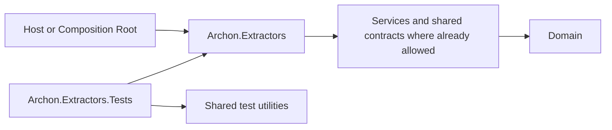
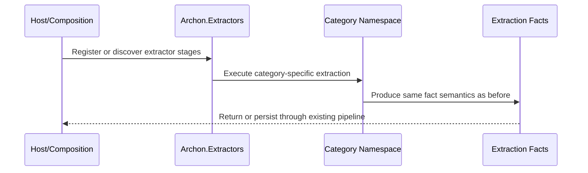

# Implementation Plan - WP018 Extractor Project Consolidation and Work-Package Naming Cleanup

Target output path: `docs/018-Extractor-Project-Consolidation/implementation-plan-wp018-extractor-project-consolidation.md`

Related specification: `docs/018-Extractor-Project-Consolidation/spec-wp018-extractor-project-consolidation.md`

## Overall Project Structure

WP018 consolidates the extractor implementation estate without changing extractor behavior. The target production project is `src/Archon.Extractors/Archon.Extractors.csproj`, with extractor categories represented by folders and namespaces under `Archon.Extractors`, such as `Archon.Extractors.DataAccess`. The target test project is `test/Archon.Extractors.Tests/Archon.Extractors.Tests.csproj`, with test categories represented by folders and namespaces under `Archon.Extractors.Tests`.

The work must preserve Onion Architecture dependency direction, .NET 10 targeting, repository C# coding conventions, and the existing `Archon.slnx` solution organization. All C# files created or modified during implementation must follow `.github/instructions/coding-standards.instructions.md`, including Allman braces, block-scoped namespaces, one public type per file, and underscore-prefixed private fields. Every code-writing task in this plan must also follow `./.github/instructions/documentation-pass.instructions.md` in full; this is a mandatory completion gate, not optional polish.

The plan intentionally treats project deletion as a guarded migration step rather than routine cleanup. The protected consolidated paths are `src/Archon.Extractors` and `test/Archon.Extractors.Tests`; these paths must never appear in any deletion list, wildcard deletion pattern, glob, prefix match, inferred directory enumeration, or broad recursive delete command.

## Work Package Execution Rules

- Once implementation starts for any Work Item, the executor must continue through all tasks, validation, documentation and wiki review, plan-record updates, and ordinary fixable failures until that Work Item is complete.
- The executor must not stop for status-only updates, confirmation prompts, or ordinary build/test failures inside an active Work Item.
- The only allowed stops inside an active Work Item are full Work Item completion, explicit user interruption or change of direction, or a true blocker that cannot be resolved from the specification, plan, codebase, or repository guidance.
- The repository instruction not to run the full test suite for this work package remains in force unless later user guidance supersedes it. Use targeted extractor tests and architecture-boundary tests where present.
- Do not create standalone implementation notes, implementation ledgers, architecture notes, or similar narrative completion records for contributor-facing detail. Current-state contributor guidance belongs in `./wiki` according to `./.github/instructions/wiki.instructions.md`.
- Do not use `wiki/home.md` as the destination for detailed contributor-facing guidance. `wiki/home.md` must remain a concise landing page and table of contents.

## Extractor Consolidation Foundation

- [x] Work Item 1: Inventory the extractor estate and establish migration safety boundaries - Completed
  - **Purpose**: Establish a verified source-of-truth inventory before any file moves, reference changes, renames, or destructive cleanup occur.
  - **Acceptance Criteria**:
	- All active production projects named in the `Archon.Extractors.XXX` pattern are identified.
	- All active test projects named in the `Archon.Extractors.XXX.Tests` pattern are identified.
	- Existing `Archon.Extractors` and `Archon.Extractors.Tests` target project presence or absence is confirmed.
	- Project references, package references, build properties, analyzer settings, `InternalsVisibleTo` declarations, assembly-discovery logic, and repository-owned scripts or documentation references to old extractor project names are inventoried.
	- All extractor-related symbols, filenames, namespaces, and log messages containing work-package identifiers such as `Wp009`, `WP009`, or equivalent `WpXXX` forms are identified.
	- An explicit protected-path list records `src/Archon.Extractors` and `test/Archon.Extractors.Tests` as non-deletable targets.
  - **Definition of Done**:
	- Inventory is sufficient to drive the remaining work without guessing project names or deletion paths.
	- No source, test, project, solution, or wiki file has been destructively deleted.
	- `./.github/instructions/documentation-pass.instructions.md` is carried forward as mandatory for all later code-writing tasks.
	- Wiki review obligation from `./.github/instructions/wiki.instructions.md` is carried forward and likely affected pages are preliminarily identified.
	- Executor must not stop mid-Work Item; execution continues through inventory, validation of findings, and plan-record updates unless the Work Item is complete, explicitly interrupted, or truly blocked.
	- [x] Task 1: Inspect the current solution and project layout. - Completed: `Archon.slnx` contains 18 active extractor production project entries and 18 active extractor test project entries under the `/src/40 Extractors/` and `/test/40 Extractors/` solution folders; repository inventory also found `src/Archon.Extractors.Integrations` and `test/Archon.Extractors.Integrations.Tests` directories with project files that are not currently listed in `Archon.slnx`. The protected consolidated target directories `src/Archon.Extractors` and `test/Archon.Extractors.Tests` are absent at inventory time.
	- [x] Step 1: Read `Archon.slnx` and enumerate solution entries for extractor production and test projects. - Completed: solution entries are AdoNet, AspNet, Avalonia, Blazor, Configuration, DataAccess, DependencyInjection, EntityFramework, Hotlist, LegacyWeb, LinqToSql, Maui, Projects, Razor, Ui, WinForms, WinUI, and Wpf for both production and tests.
	- [x] Step 2: Inspect `src` for projects named `Archon.Extractors.*` and identify which are obsolete category projects versus the protected consolidated target. - Completed: `src` contains those 18 solution-listed category projects plus `Archon.Extractors.Integrations`; all are obsolete category-project candidates for later migration, while `D:\Dev\Archon\src\Archon.Extractors` is the protected consolidated production target and must not be deleted.
	- [x] Step 3: Inspect `test` for projects named `Archon.Extractors.*.Tests` and identify which are obsolete category test projects versus the protected consolidated target. - Completed: `test` contains the 18 solution-listed category test projects plus `Archon.Extractors.Integrations.Tests`; all are obsolete category-test candidates for later migration, while `D:\Dev\Archon\test\Archon.Extractors.Tests` is the protected consolidated test target and must not be deleted.
  - [x] Task 2: Inventory project metadata and dependency relationships. - Completed: all discovered extractor projects target `net10.0` with `ImplicitUsings`, nullable reference types, and `TreatWarningsAsErrors` enabled. Production extractor projects use no direct package references in their project files; test projects use `coverlet.collector` 6.0.4, `Microsoft.NET.Test.Sdk` 18.0.1, `xunit` 2.9.3, and `xunit.runner.visualstudio` 3.1.5, while the Integrations test project also references `Microsoft.CodeAnalysis.CSharp` 5.0.0 and `Microsoft.CodeAnalysis.VisualBasic` 5.0.0. Production project references include `Archon.Domain`, `Archon.Application`, `Archon.Roslyn`, Roslyn language projects, `Archon.Extractors.DataAccess`, and `Archon.Extractors.Ui` where category dependencies require them; old extractor production project references from outside production categories are currently the corresponding extractor test project references.
	- [x] Step 1: Compare package references across old extractor production projects and the target production project if it exists. - Completed: no target production project exists yet; old extractor production project files do not declare direct `PackageReference` entries.
	- [x] Step 2: Compare package references, test SDK settings, and shared test references across old extractor test projects and the target test project if it exists. - Completed: no target test project exists yet; all old extractor test projects share the common xUnit/coverlet/Microsoft.NET.Test.Sdk package set, and the Integrations test project adds Roslyn package references.
	- [x] Step 3: Identify all project references pointing to old extractor projects. - Completed: each extractor test project references its matching old extractor production project; additional category relationships include production references to Domain, Application, Roslyn, Roslyn language projects, DataAccess, and Ui as discovered from `.csproj` inventory.
	- [x] Step 4: Identify `InternalsVisibleTo` declarations that must change to `Archon.Extractors.Tests` or be removed if no longer needed. - Completed: no extractor `InternalsVisibleTo` declarations were found; the only repository hit was unrelated Neo4j infrastructure test visibility.
  - [x] Task 3: Inventory runtime coupling and naming cleanup scope. - Completed: each extractor category currently has a category marker type named in the `ArchonExtractors<Category>ProjectMarker` pattern. Runtime/project identity tests in `test/Archon.Tests` classify `Archon.Extractors.*` names, and wiki validation guidance names old category test project paths. No production extractor logging statements or production extractor `WpXXX`/`WPXXX` type declarations, constructors, or filenames were found. Extractor test comments and some test method names contain historical WP005/WP011 terminology that later naming cleanup must evaluate, while non-extractor tests contain WP015 references outside WP018 scope.
	- [x] Step 1: Identify assembly scanning, marker-type discovery, reflection-sensitive type-name usage, dependency-injection registrations, and host composition paths that depend on old extractor assembly identities. - Completed: marker classes exist per category project; `test/Archon.Tests/ProjectCatalog.cs` and `ProjectIdentityTests.cs` contain extractor assembly/name classification expectations. No extractor DI registration or host composition path requiring old assembly identity was identified in this inventory pass.
	- [x] Step 2: Identify extractor-related C# type names, constructors, filenames, namespaces, tests, and assertions containing work-package identifiers. - Completed: extractor source filenames and production type declarations do not contain `WpXXX`/`WPXXX`; extractor tests contain WP005/WP011 references in documentation comments, fixture names, and at least one method name such as `ExecuteAsync_WhenRepresentativeWp005RepositoryIsSubmitted_ShouldExtractProjectPackageAndClassificationFacts`.
	- [x] Step 3: Identify runtime logging message templates containing work-package identifiers and record the structured placeholders that must be preserved. - Completed: no extractor production logging statements with work-package identifiers were found, so no structured logging placeholders require preservation from Work Item 1 findings.
  - [x] Task 4: Establish deletion safeguards before later cleanup. - Completed: protected paths were recorded and a non-destructive dry-run directory inventory confirmed that no current extractor directory is the protected consolidated target because the targets do not yet exist.
	- [x] Step 1: Record the protected consolidated absolute paths for `src/Archon.Extractors` and `test/Archon.Extractors.Tests`. - Completed: protected production path is `D:\Dev\Archon\src\Archon.Extractors`; protected test path is `D:\Dev\Archon\test\Archon.Extractors.Tests`.
	- [x] Step 2: Record that no deletion may use wildcard, glob, prefix, broad recursive, or inferred enumeration patterns such as `Remove-Item src/Archon.Extractors*`, `Remove-Item src/Archon.Extractors.*`, or `Get-ChildItem -Filter 'Archon.Extractors*' | Remove-Item`. - Completed: later cleanup must not use wildcard, glob, prefix, broad recursive, or inferred enumeration delete commands.
	- [x] Step 3: Record that every later obsolete directory deletion must be by exact absolute path from a reviewed allow-list and must exclude the protected consolidated paths. - Completed: every later obsolete directory deletion must use exact absolute paths from a reviewed allow-list, one path at a time, and the allow-list must explicitly exclude `D:\Dev\Archon\src\Archon.Extractors` and `D:\Dev\Archon\test\Archon.Extractors.Tests`.
  - **Completion Summary**: Work Item 1 completed as a non-destructive inventory. Validation performed: `dotnet sln D:\Dev\Archon\Archon.slnx list` succeeded; `dotnet build D:\Dev\Archon\Archon.slnx --no-restore` currently fails with pre-existing `Archon.Extractors.Projects` errors for missing `Archon.Extractors.Projects.Packages` / `PackageReferenceDeclaration` / `PackageExtractionDiagnostic`; representative `dotnet build D:\Dev\Archon\src\Archon.Extractors.DataAccess\Archon.Extractors.DataAccess.csproj --no-restore -v:quiet` succeeded; representative `dotnet test D:\Dev\Archon\test\Archon.Extractors.DataAccess.Tests\Archon.Extractors.DataAccess.Tests.csproj --no-restore --no-build -v:quiet` succeeded. Documentation-pass requirement is carried forward for later source-code work; no source code was modified in this inventory item. Wiki review result: reviewed `wiki/solution-architecture.md`, `wiki/validation-and-test-workflows.md`, `wiki/data-access-extraction.md`, `wiki/configuration-and-dependency-injection-extraction.md`, `wiki/external-integration-extraction.md`, `wiki/dotnet-ui-client-extraction.md`, `wiki/api-extraction-workflow.md`, and `wiki/home.md`; no wiki page was updated because Work Item 1 only inventories the current state and does not yet change contributor-facing layout or validation commands. Later consolidation work must update current-state project-layout guidance and old category test commands. Wiki impact matrix: affected concepts are extractor project layout, validation commands, assembly identity, marker types, and deletion safety; pages reviewed are listed above; pages updated none; pages created none; pages intentionally unchanged all reviewed pages for this inventory-only step; page-structure decision is to keep `wiki/home.md` concise and use existing topic pages, especially solution architecture and validation/test workflows, when consolidation changes become current-state behavior.
  - **Files**:
	- `Archon.slnx`: Solution entries to inventory.
	- `src/**/Archon.Extractors*.csproj`: Production project metadata to inventory.
	- `test/**/Archon.Extractors*.Tests.csproj`: Test project metadata to inventory.
	- `src/**/*.cs`, `test/**/*.cs`: Symbol, namespace, logging, and runtime-coupling inventory.
	- `wiki/**/*.md`: Candidate current-state contributor guidance to review later.
  - **Work Item Dependencies**: None.
  - **Run / Verification Instructions**:
	- Build or list solution projects without modifying deletion state.
	- Use targeted searches or IDE symbol navigation to confirm no extractor category project is missed.
  - **User Instructions**: None.

- [x] Work Item 2: Create or normalize the consolidated extractor project skeleton - Completed
  - **Purpose**: Ensure the target production assembly `Archon.Extractors` exists, is solution-owned, and can receive category extractor code safely.
  - **Acceptance Criteria**:
	- `src/Archon.Extractors/Archon.Extractors.csproj` exists and targets the repository's .NET 10 target framework conventions.
	- The project contains normalized package references, project references, build properties, analyzers, and visibility declarations needed by all migrated extractor categories.
	- `Archon.slnx` includes the consolidated production project in the correct solution folder structure.
	- Onion Architecture dependency direction remains valid.
  - **Definition of Done**:
	- Consolidated production project builds or fails only because source files have not yet been moved and the failure is explicitly attributable to the current migration phase.
	- `.csproj` edits keep `PackageReference` entries in ItemGroups that contain only package references.
	- Any code created or modified in this Work Item complies with `./.github/instructions/documentation-pass.instructions.md`, including XML and developer-level comments on every class, method, constructor, relevant parameter, and non-obvious property.
	- Wiki review impact is noted for final review if project layout contributor guidance is affected.
	- Executor must not stop mid-Work Item; execution continues through implementation, validation, documentation/wiki review notes, and plan-record updates unless the Work Item is complete, explicitly interrupted, or truly blocked.
	- [x] Task 1: Create or update the production project file. - Completed: created `src/Archon.Extractors/Archon.Extractors.csproj` with .NET 10 settings, nullable reference types, implicit usings, warnings-as-errors, the preview language setting required by migrated Razor code, the normalized `Microsoft.CodeAnalysis.CSharp` package reference, and inward project references to Domain, Application, Roslyn, Roslyn.CSharp, Roslyn.Legacy, and Roslyn.VisualBasic. Package references are isolated in a package-only `ItemGroup`, and no old extractor category projects were referenced from the consolidated project.
	- [x] Step 1: Create `src/Archon.Extractors/Archon.Extractors.csproj` if it does not already exist. - Completed: target production project file now exists.
	- [x] Step 2: Merge required package references from old production extractor projects and remove duplicates. - Completed: merged the single required production package reference, `Microsoft.CodeAnalysis.CSharp` 5.0.0, without duplicates.
	- [x] Step 3: Merge required project references without introducing Domain-to-outer-layer or Services-to-Infrastructure violations. - Completed: merged inward project references only and preserved Onion Architecture direction.
	- [x] Step 4: Preserve or update analyzer/build settings needed by migrated code. - Completed: preserved .NET 10, nullable, implicit-usings, warnings-as-errors, and `LangVersion` preview for future Razor migration compatibility.
  - [x] Task 2: Establish category folder and namespace conventions. - Completed: no empty category folders were created in this skeleton step; later migration slices must create category folders only as files move and use namespaces under `Archon.Extractors.<Category>`.
	- [x] Step 1: Create category folders only as needed during file migration, such as `DataAccess`, `Configuration`, `DependencyInjection`, `Projects`, `AspNet`, and UI technology categories discovered in inventory. - Completed: intentionally deferred folder creation until migration to avoid placeholder directories.
	- [x] Step 2: Use namespaces under `Archon.Extractors.<Category>` rather than creating new category assemblies. - Completed: convention recorded for later migration slices and reflected in wiki architecture guidance.
  - [x] Task 3: Update solution ownership. - Completed: added `src/Archon.Extractors/Archon.Extractors.csproj` to the `/src/40 Extractors/` solution folder while retaining all old extractor category project entries for later guarded migration.
	- [x] Step 1: Add the consolidated production project to `Archon.slnx` if it is absent. - Completed: consolidated project entry added.
	- [x] Step 2: Place it in the solution folder pattern used by existing Onion structure. - Completed: consolidated project is under `/src/40 Extractors/`.
  - **Completion Summary**: Work Item 2 completed the consolidated production extractor skeleton. Files touched: `src/Archon.Extractors/Archon.Extractors.csproj`, `Archon.slnx`, `wiki/solution-architecture.md`, and `wiki/validation-and-test-workflows.md`. Validation performed: `dotnet build D:\Dev\Archon\src\Archon.Extractors\Archon.Extractors.csproj -v:quiet` succeeded. Documentation-pass result: no C# files were created or modified, so source-code XML/developer comments were not required for this work item. Wiki review result: reviewed `wiki/solution-architecture.md`, `wiki/validation-and-test-workflows.md`, and `wiki/home.md`; updated solution architecture to describe the transition-state consolidated extractor project and updated validation workflows with the WP018 skeleton build gate. Wiki impact matrix: affected concepts are extractor project layout, Onion dependency direction, migration-time project ownership, and validation commands; pages reviewed were solution architecture, validation/test workflows, and home; pages updated were solution architecture and validation/test workflows; pages created none; pages intentionally unchanged `wiki/home.md` because it remains a concise landing page; page-structure decision is to keep detailed guidance on the existing topic pages and not create a new wiki page for a skeleton-only transition.
  - **Files**:
	- `src/Archon.Extractors/Archon.Extractors.csproj`: Target consolidated production project.
	- `Archon.slnx`: Solution entry update.
	- `src/Archon.Extractors/**`: Target category folders.
  - **Work Item Dependencies**: Work Item 1.
  - **Run / Verification Instructions**:
	- Build `src/Archon.Extractors/Archon.Extractors.csproj` if feasible at this phase.
	- Verify no old extractor project reference is removed before dependent code is migrated.
  - **User Instructions**: None.

- [x] Work Item 3: Create or normalize the consolidated extractor test project skeleton - Completed
  - **Purpose**: Ensure the target test assembly `Archon.Extractors.Tests` exists, can reference the consolidated extractor assembly, and can receive migrated extractor tests.
  - **Acceptance Criteria**:
    - `test/Archon.Extractors.Tests/Archon.Extractors.Tests.csproj` exists and follows repository test project conventions.
    - The project references `src/Archon.Extractors/Archon.Extractors.csproj` and any required shared test projects.
    - Test package references and test infrastructure settings are normalized without duplication.
    - `Archon.slnx` includes the consolidated test project in the correct solution folder structure.
  - **Definition of Done**:
    - Consolidated test project can be restored and is ready to receive test files.
    - `.csproj` edits keep `PackageReference` entries in ItemGroups that contain only package references.
    - Any code created or modified in this Work Item complies with `./.github/instructions/documentation-pass.instructions.md`, including comments for test classes, methods, constructors, fixtures, and setup code.
    - Wiki review impact is noted for final review if test layout contributor guidance is affected.
    - Executor must not stop mid-Work Item; execution continues through implementation, validation, documentation/wiki review notes, and plan-record updates unless the Work Item is complete, explicitly interrupted, or truly blocked.
  - [x] Task 1: Create or update the test project file. - Completed: created `test/Archon.Extractors.Tests/Archon.Extractors.Tests.csproj` with .NET 10 test settings, preview language support for future migrated Razor-related tests, nullable reference types, implicit usings, warnings-as-errors, the common xUnit/coverage/test SDK package set, Roslyn C# and Visual Basic package references required by the old extractor test estate, and a project reference to `src/Archon.Extractors/Archon.Extractors.csproj`.
    - [x] Step 1: Create `test/Archon.Extractors.Tests/Archon.Extractors.Tests.csproj` if it does not already exist. - Completed: target consolidated test project file now exists.
    - [x] Step 2: Merge required test SDK, assertion, coverage, and fixture package references from old extractor test projects and remove duplicates. - Completed: merged `coverlet.collector` 6.0.4, `Microsoft.NET.Test.Sdk` 18.0.1, `xunit` 2.9.3, `xunit.runner.visualstudio` 3.1.5, `Microsoft.CodeAnalysis.CSharp` 5.0.0, and `Microsoft.CodeAnalysis.VisualBasic` 5.0.0 without duplicate package references.
    - [x] Step 3: Add required project references to `Archon.Extractors` and shared test utility projects. - Completed: added the required consolidated production project reference; no shared test utility project reference was required for this skeleton because no migrated tests exist in the target project yet.
  - [x] Task 2: Establish test category folder and namespace conventions. - Completed: no empty test category folders were created in this skeleton step; later migration slices must create folders only when tests move and use namespaces under `Archon.Extractors.Tests.<Category>`.
    - [x] Step 1: Create test category folders only as needed during test migration. - Completed: intentionally deferred folder creation until migration to avoid placeholder directories.
    - [x] Step 2: Use namespaces under `Archon.Extractors.Tests.<Category>`. - Completed: convention recorded for later migration slices and reflected in wiki architecture guidance.
  - [x] Task 3: Update solution ownership. - Completed: added `test/Archon.Extractors.Tests/Archon.Extractors.Tests.csproj` to the `/test/40 Extractors/` solution folder while retaining all old extractor category test project entries for later guarded migration.
    - [x] Step 1: Add the consolidated test project to `Archon.slnx` if it is absent. - Completed: consolidated test project entry added.
    - [x] Step 2: Place it in the solution folder pattern used by the existing test estate. - Completed: consolidated test project is under `/test/40 Extractors/`.
  - **Completion Summary**: Work Item 3 completed the consolidated extractor test skeleton. Files touched: `test/Archon.Extractors.Tests/Archon.Extractors.Tests.csproj`, `Archon.slnx`, `wiki/solution-architecture.md`, and `wiki/validation-and-test-workflows.md`. Validation performed: `dotnet build D:\Dev\Archon\test\Archon.Extractors.Tests\Archon.Extractors.Tests.csproj -v:quiet` succeeded. Documentation-pass result: no C# files were created or modified, so source-code XML/developer comments were not required for this work item. Wiki review result: reviewed `wiki/solution-architecture.md`, `wiki/validation-and-test-workflows.md`, and `wiki/home.md`; updated solution architecture to describe the transition-state consolidated extractor test project and updated validation workflows with the WP018 test skeleton build gate. Wiki impact matrix: affected concepts are extractor test project layout, test package baseline, migration-time solution ownership, and validation commands; pages reviewed were solution architecture, validation/test workflows, and home; pages updated were solution architecture and validation/test workflows; pages created none; pages intentionally unchanged `wiki/home.md` because it remains a concise landing page; page-structure decision is to keep detailed guidance on existing topic pages and not create a new wiki page for a skeleton-only transition.
  - **Files**:
    - `test/Archon.Extractors.Tests/Archon.Extractors.Tests.csproj`: Target consolidated test project.
    - `Archon.slnx`: Solution entry update.
    - `test/Archon.Extractors.Tests/**`: Target test category folders.
  - **Work Item Dependencies**: Work Items 1 and 2.
  - **Run / Verification Instructions**:
    - Build `test/Archon.Extractors.Tests/Archon.Extractors.Tests.csproj` if feasible at this phase.
  - **User Instructions**: None.

- [x] Work Item 4: Migrate the first extractor category end to end - Completed
  - **Purpose**: Prove the consolidation pattern with one complete extractor category before repeating it for the remaining categories.
  - **Acceptance Criteria**:
	- One inventoried extractor category is moved from its old production project into `src/Archon.Extractors/<Category>`.
	- Its tests are moved into `test/Archon.Extractors.Tests/<Category>`.
	- Namespaces, using directives, project references, DI registrations, discovery logic, and tests are updated so the category runs from the consolidated assemblies.
	- The moved category's targeted tests pass.
	- Runtime behavior and extracted fact semantics remain equivalent.
  - **Definition of Done**:
	- The first category is demonstrably runnable through its existing entry point, host composition path, API or service path, or test harness.
	- Any renamed or moved C# code complies with `./.github/instructions/documentation-pass.instructions.md`, including comments on every class, method, constructor, public parameter, and non-obvious property within the touched scope.
	- Logging and error handling for the moved category remain equivalent except for required work-package terminology cleanup.
	- Wiki review impact is noted for final review if category structure or contributor workflow changed.
	- Executor must not stop mid-Work Item; execution continues through implementation, validation, documentation/wiki review notes, and plan-record updates unless the Work Item is complete, explicitly interrupted, or truly blocked.
	- [x] Task 1: Move production files for the selected category. - Completed: selected Hotlist as the smallest representative category with one production file, one test file, a simple inward dependency already covered by the consolidated project, and an existing smoke-test harness. Moved `ArchonExtractorsHotlistProjectMarker` into `src/Archon.Extractors/Hotlist` and updated its local documentation and canonical assembly-name contract to reflect the consolidated `Archon.Extractors` assembly.
	- [x] Step 1: Choose the smallest representative extractor category discovered in Work Item 1. - Completed: Hotlist was selected from the one-production-file and one-test-file candidate group because it proves category migration with minimal dependency risk.
	- [x] Step 2: Move source files into `src/Archon.Extractors/<Category>`. - Completed: moved the Hotlist marker source into `src/Archon.Extractors/Hotlist/ArchonExtractorsHotlistProjectMarker.cs`.
	- [x] Step 3: Update namespaces to `Archon.Extractors.<Category>` while preserving conceptual subfolders where present. - Completed: retained `Archon.Extractors.Hotlist` as the category namespace under the consolidated project.
	- [x] Step 4: Update using directives and internal visibility declarations as needed. - Completed: no using directive or `InternalsVisibleTo` update was needed for the marker-only Hotlist category.
  - [x] Task 2: Move tests for the selected category. - Completed: moved the Hotlist project-reference test into `test/Archon.Extractors.Tests/Hotlist`, changed the test namespace to `Archon.Extractors.Tests.Hotlist`, and updated assertions to validate the consolidated production assembly identity and marker contract.
	- [x] Step 1: Move tests into `test/Archon.Extractors.Tests/<Category>`. - Completed: moved the Hotlist test into `test/Archon.Extractors.Tests/Hotlist/ArchonExtractorsHotlistProjectReferenceTests.cs`.
	- [x] Step 2: Update test namespaces to `Archon.Extractors.Tests.<Category>`. - Completed: the migrated test now uses `Archon.Extractors.Tests.Hotlist`.
	- [x] Step 3: Update test references to the consolidated production namespace and assembly. - Completed: the test references `Archon.Extractors.Hotlist.ArchonExtractorsHotlistProjectMarker` from the consolidated `Archon.Extractors` assembly.
  - [x] Task 3: Wire the selected category into the consolidated runtime path. - Completed: Hotlist has no DI registration or assembly-scanning runtime path beyond its marker-test harness; category selection is preserved by the `Archon.Extractors.Hotlist` namespace and marker type while assembly identity is consolidated.
	- [x] Step 1: Update dependency-injection registrations to reference the consolidated types. - Completed: no Hotlist DI registration existed to update.
	- [x] Step 2: Update assembly-discovery logic to scan `Archon.Extractors` or use explicit registration through the consolidated entry point. - Completed: no Hotlist-specific assembly-discovery path existed; the migrated test proves the category marker is loadable from `Archon.Extractors`.
	- [x] Step 3: Preserve category-level selection through namespaces, marker types, metadata, or existing configuration rather than separate assemblies. - Completed: category identity remains represented by the `Archon.Extractors.Hotlist` namespace and marker type.
  - [x] Task 4: Validate the selected category. - Completed: targeted consolidated production build, targeted consolidated test build, and the migrated Hotlist test succeeded. Full workspace build remains blocked by pre-existing migration-phase `Archon.Extractors.Projects` missing package-extractor types and `Archon.Extractors.Integrations` restore metadata issues outside this Hotlist slice.
	- [x] Step 1: Build `Archon.Extractors`. - Completed: `dotnet build D:\Dev\Archon\src\Archon.Extractors\Archon.Extractors.csproj -v:quiet` succeeded.
	- [x] Step 2: Build `Archon.Extractors.Tests`. - Completed: `dotnet build D:\Dev\Archon\test\Archon.Extractors.Tests\Archon.Extractors.Tests.csproj -v:quiet` succeeded.
	- [x] Step 3: Run targeted tests for the selected category only. - Completed: `dotnet test D:\Dev\Archon\test\Archon.Extractors.Tests\Archon.Extractors.Tests.csproj --no-restore --no-build --filter FullyQualifiedName~ArchonExtractorsHotlistProjectReferenceTests -v:normal` passed with 1 succeeded and 0 failed.
  - **Completion Summary**: Work Item 4 completed the first end-to-end category migration using Hotlist. Files touched: `src/Archon.Extractors/Hotlist/ArchonExtractorsHotlistProjectMarker.cs`, `test/Archon.Extractors.Tests/Hotlist/ArchonExtractorsHotlistProjectReferenceTests.cs`, `wiki/solution-architecture.md`, `wiki/validation-and-test-workflows.md`, and this implementation plan. Removed migrated source files from the old Hotlist category production and test directories without deleting the directories or protected consolidated paths. Documentation-pass result: the moved production marker and test class include XML/developer-level comments for the public class, constructor, method, test scenario, and logical flow. Validation performed: targeted consolidated production build succeeded; targeted consolidated test build succeeded; migrated Hotlist filtered test passed; `run_build` still reports pre-existing workspace failures in `Archon.Extractors.Projects` and Integrations-related restore metadata outside the selected Hotlist migration. Wiki review result: reviewed `wiki/solution-architecture.md`, `wiki/validation-and-test-workflows.md`, and `wiki/home.md`; updated solution architecture and validation workflows for the current Hotlist migration state. Wiki impact matrix: affected concepts are extractor category layout, consolidated assembly identity, migrated category validation, and transition-state old project retention; pages reviewed were solution architecture, validation/test workflows, and home; pages updated were solution architecture and validation/test workflows; pages created none; pages intentionally unchanged `wiki/home.md` because it remains a concise landing page; page-structure decision is to keep detailed WP018 consolidation guidance on existing topic pages rather than create a new page for a single-category migration.
  - **Files**:
	- `src/Archon.Extractors/<Category>/**`: Migrated production source.
	- `test/Archon.Extractors.Tests/<Category>/**`: Migrated tests.
	- `src/Archon.Extractors/Archon.Extractors.csproj`: Project metadata updates if needed.
	- `test/Archon.Extractors.Tests/Archon.Extractors.Tests.csproj`: Project metadata updates if needed.
	- Host/composition files discovered in Work Item 1: registration or discovery updates if needed.
  - **Work Item Dependencies**: Work Items 1, 2, and 3.
  - **Run / Verification Instructions**:
	- Run the selected category's targeted test filter from `Archon.Extractors.Tests`.
	- Build `Archon.Extractors` and `Archon.Extractors.Tests`.
  - **User Instructions**: None.

- [x] Work Item 5: Migrate all remaining extractor categories end to end - Completed
  - **Purpose**: Complete the production and test project consolidation while preserving each extractor category's behavior and test coverage.
  - **Acceptance Criteria**:
	- All remaining `Archon.Extractors.XXX` production source files are moved into category folders under `src/Archon.Extractors`.
	- All remaining `Archon.Extractors.XXX.Tests` test files are moved into category folders under `test/Archon.Extractors.Tests`.
	- Namespaces follow `Archon.Extractors.<Category>` and `Archon.Extractors.Tests.<Category>`.
	- Project references no longer require the old category projects for compilation.
	- Targeted extractor tests pass after migration.
  - **Definition of Done**:
	- The consolidated production and test projects represent the complete extractor estate.
	- Runtime registration/discovery reaches every migrated extractor category.
	- Any moved or modified code complies with `./.github/instructions/documentation-pass.instructions.md`, including developer-level comments throughout production and test code touched by the migration.
	- Logging and error handling remain behaviorally equivalent except for required wording cleanup.
	- Wiki review impact is noted for final review if the contributor-facing layout changed.
	- Executor must not stop mid-Work Item; execution continues through implementation, validation, documentation/wiki review notes, and plan-record updates unless the Work Item is complete, explicitly interrupted, or truly blocked.
	- [x] Task 1: Move each remaining production category. - Completed: moved AdoNet, AspNet, Avalonia, Blazor, Configuration, DataAccess, DependencyInjection, EntityFramework, Integrations, LegacyWeb, LinqToSql, Maui, Projects, Razor, Ui, WinForms, WinUI, and Wpf source files into category folders under `src/Archon.Extractors`; old production category directories now contain no hand-maintained C# source files.
	- [x] Step 1: For each inventoried category project, move source files to `src/Archon.Extractors/<Category>`. - Completed: all remaining production source files were moved into consolidated category folders.
	- [x] Step 2: Update namespaces, using directives, and internal references. - Completed: migrated production files now use block-scoped `Archon.Extractors.<Category>` namespaces, and production comments/warning strings were cleaned of work-package identifiers where encountered in the moved scope.
	- [x] Step 3: Merge any category-specific package or project references into the consolidated project. - Completed: consolidated production project already held the required inward project and Roslyn package references; missing Projects package-extraction source types were restored under `src/Archon.Extractors/Projects/Packages` so the migrated Projects category builds and tests pass.
  - [x] Task 2: Move each remaining test category. - Completed: moved all remaining extractor tests into category folders under `test/Archon.Extractors.Tests`; old extractor category test directories now contain no hand-maintained C# source files.
	- [x] Step 1: For each inventoried category test project, move tests to `test/Archon.Extractors.Tests/<Category>`. - Completed: all remaining category tests were moved into the consolidated test project.
	- [x] Step 2: Update namespaces, fixture references, test data paths, and test project references. - Completed: migrated tests now use `Archon.Extractors.Tests.<Category>` namespaces, UI category tests import their consolidated production category namespaces, and project-reference tests assert the consolidated `Archon.Extractors` assembly identity.
	- [x] Step 3: Merge any category-specific test package or shared fixture references into the consolidated test project. - Completed: consolidated test project references `Archon.Extractors`, Application, Domain, and Roslyn and keeps the shared xUnit, coverage, Roslyn C#, and Roslyn Visual Basic package baseline.
  - [x] Task 3: Update repository-owned composition, scripts, and filters. - Completed: updated `Archon.Api.Extraction`, `Archon.Api.Extraction.Tests`, and `Archon.Application.Tests` project references to the consolidated extractor project; removed old category project entries from `Archon.slnx`; updated architecture-boundary classification for `Archon.Extractors`; updated wiki validation commands that referenced old category test projects.
	- [x] Step 1: Update hosts, services, or API composition that referenced old extractor assemblies or types. - Completed: API extraction module now references `src/Archon.Extractors/Archon.Extractors.csproj` instead of old category projects.
	- [x] Step 2: Update repository-owned scripts, launch profiles, test filters, or CI configuration that referenced old extractor test project names. - Completed: repository wiki validation guidance now points to consolidated extractor build/test commands; no repository-owned script or CI file requiring an old extractor test project update was found in active code/configuration scope.
	- [x] Step 3: Confirm no project reference points to an old extractor category project. - Completed: active solution/project files no longer require old extractor category projects for compilation; remaining old-category project references are isolated inside obsolete project files that are no longer solution members and are expected cleanup targets for the guarded deletion work item.
  - [x] Task 4: Validate all migrated categories with targeted checks. - Completed: consolidated production build, consolidated test build, targeted consolidated extractor tests, targeted project identity tests, solution restore, and workspace build succeeded.
	- [x] Step 1: Build `Archon.Extractors`. - Completed: `dotnet build D:\Dev\Archon\src\Archon.Extractors\Archon.Extractors.csproj -v:quiet` succeeded.
	- [x] Step 2: Build `Archon.Extractors.Tests`. - Completed: `dotnet build D:\Dev\Archon\test\Archon.Extractors.Tests\Archon.Extractors.Tests.csproj -v:quiet` succeeded.
	- [x] Step 3: Run targeted tests for all migrated categories without running the full suite unless later guidance permits it. - Completed: `dotnet test D:\Dev\Archon\test\Archon.Extractors.Tests\Archon.Extractors.Tests.csproj --no-restore --no-build --filter "FullyQualifiedName~Archon.Extractors.Tests" -v:normal` passed with 165 succeeded and 0 failed.
	- [x] Step 4: Run architecture-boundary tests if present and targeted enough for this work package. - Completed: after `dotnet restore D:\Dev\Archon\Archon.slnx`, `dotnet test D:\Dev\Archon\test\Archon.Tests\Archon.Tests.csproj --no-restore --filter "FullyQualifiedName~ProjectIdentityTests" -v:normal` passed with 3 succeeded and 0 failed; final workspace build also succeeded.
  - **Completion Summary**: Work Item 5 completed the remaining extractor category migration into the consolidated production and test projects. Files touched include `src/Archon.Extractors/**`, `test/Archon.Extractors.Tests/**`, `src/Archon.Api.Extraction/Archon.Api.Extraction.csproj`, `test/Archon.Api.Extraction.Tests/Archon.Api.Extraction.Tests.csproj`, `test/Archon.Application.Tests/Archon.Application.Tests.csproj`, `test/Archon.Tests/ProjectCatalog.cs`, `Archon.slnx`, `wiki/solution-architecture.md`, `wiki/validation-and-test-workflows.md`, and this implementation plan. Documentation-pass result: all newly restored package extraction source files include XML/developer-level comments for types, constructors/methods, parameters, return values, and logical flow; moved source/test files retained and received migration-scope comment cleanup where work-package terminology was encountered. Validation performed: solution restore succeeded; consolidated production build succeeded; consolidated test build succeeded; targeted consolidated extractor tests passed 165/165; targeted project identity tests passed 3/3; final workspace build succeeded. Wiki review result: reviewed `wiki/solution-architecture.md`, `wiki/validation-and-test-workflows.md`, and `wiki/home.md`; updated solution architecture and validation workflows for the completed consolidated extractor estate. Wiki impact matrix: affected concepts are extractor project layout, category namespace/folder ownership, consolidated assembly identity, validation commands, project identity classification, and old category project retirement preparation; pages reviewed were solution architecture, validation/test workflows, and home; pages updated were solution architecture and validation/test workflows; pages created none; pages intentionally unchanged `wiki/home.md` because it remains a concise landing page and no new reader path was required; page-structure decision is to keep detailed extractor layout and validation guidance on existing topic pages rather than create a new extractor-consolidation page or add detail to `home.md`.
  - **Files**:
	- `src/Archon.Extractors/**`: Consolidated production extractor code.
	- `test/Archon.Extractors.Tests/**`: Consolidated extractor tests.
	- `src/**/*.csproj`, `test/**/*.csproj`: References affected by consolidation.
	- `Archon.slnx`: Solution membership and old project removal preparation.
	- Repository-owned scripts or CI files discovered by inventory: project-name updates.
  - **Work Item Dependencies**: Work Item 4.
  - **Run / Verification Instructions**:
	- Build consolidated production and test projects.
	- Run targeted tests from `Archon.Extractors.Tests` covering all migrated extractor categories.
	- Run targeted architecture-boundary tests if present.
  - **User Instructions**: None.

- [x] Work Item 6: Remove extractor work-package identifiers from symbols, filenames, and references - Completed
  - **Purpose**: Ensure production and applicable test names describe runtime concepts rather than delivery-history work packages.
  - **Acceptance Criteria**:
	- `Wp009DataAccessExtractionStage` is renamed to `DataAccessExtractionStage`.
	- Other extractor-related production types containing `WpXXX`, `WPXXX`, or equivalent work-package identifiers are renamed to behavior-focused names.
	- Constructor names, filenames, using directives, test references, DI registrations, reflection-sensitive references, and assertions are updated.
	- Extractor test type names no longer contain work-package identifiers unless they explicitly validate a historical work-package documentation artifact.
	- Repository one-public-type-per-file convention is preserved.
  - **Definition of Done**:
	- Search results confirm no extractor production type names or filenames contain work-package identifiers.
	- Consolidated extractor production and test projects build.
	- Targeted tests affected by type renames pass.
	- Any renamed or modified C# code complies with `./.github/instructions/documentation-pass.instructions.md`, including XML documentation and developer-level comments for all touched classes, methods, constructors, public parameters, and non-obvious properties.
	- Wiki review impact is noted for terminology changes if contributor-facing terminology changed.
	- Executor must not stop mid-Work Item; execution continues through implementation, validation, documentation/wiki review notes, and plan-record updates unless the Work Item is complete, explicitly interrupted, or truly blocked.
	- [x] Task 1: Rename production symbols and files. - Completed: renamed the directly coupled API extraction stage adapters that orchestrate extractor categories from work-package-prefixed names to behavior-focused names, including `Wp009DataAccessExtractionStage` to `DataAccessExtractionStage`; matching C# filenames now align with public type names.
	- [x] Step 1: Rename `Wp009DataAccessExtractionStage` to `DataAccessExtractionStage`. - Completed: the data-access API extraction adapter type, constructor, logger generic type, XML documentation references, and file name were renamed.
	- [x] Step 2: Rename any other extractor-related production types with work-package identifiers to behavior-focused names. - Completed: renamed configuration/dependency-injection, ASP.NET Core runtime, external integration, unified UI/client, and UI framework API extraction stage adapter types to behavior-focused names.
	- [x] Step 3: Rename matching C# files so public type names and filenames stay aligned. - Completed: old work-package-prefixed API extraction stage filenames were replaced with behavior-focused filenames such as `DataAccessExtractionStage.cs`, `AspNetCoreRuntimeExtractionStage.cs`, and `UiClientExtractionStage.cs`.
  - [x] Task 2: Update references. - Completed: updated dependency-injection registrations, constructor signatures, logger generic types, direct references, and renamed API extraction test type and method references; stable `StageId` string values were preserved as runtime contract identifiers for later logging/contract cleanup.
	- [x] Step 1: Update constructors, using directives, dependency-injection registrations, and direct references. - Completed: `ExtractionApiServiceCollectionExtensions` and affected stage constructors now reference behavior-focused type names.
	- [x] Step 2: Update reflection-sensitive type-name references, snapshot expectations, or string-based test assertions where discovered. - Completed: no reflection-sensitive old type-name assertions remained after the rename; behavior assertions continue to use stable stage identifiers and snapshot identities where they are part of the current contract.
	- [x] Step 3: Update test type names where they are not explicitly testing historical documentation artifacts. - Completed: renamed affected API extraction test classes, files, and methods to remove work-package-prefixed stage names while retaining historical or stable identifier strings where required by current behavior.
  - [x] Task 3: Validate naming cleanup. - Completed: targeted searches, builds, and affected tests succeeded; remaining `WP###`/`wp###` hits in the directly coupled API extraction test scope are stable `StageId` or snapshot identity strings, or historical comments outside this symbol-name cleanup step.
	- [x] Step 1: Search extractor production and test scope for `Wp` or `WP` followed by a work-package number. - Completed: consolidated extractor production and test scopes have no work-package identifier hits; directly coupled API extraction scope has no old work-package-prefixed stage type references or filenames.
	- [x] Step 2: Build consolidated production and test projects. - Completed: `dotnet build D:\Dev\Archon\src\Archon.Extractors\Archon.Extractors.csproj -v:quiet` and `dotnet build D:\Dev\Archon\test\Archon.Extractors.Tests\Archon.Extractors.Tests.csproj -v:quiet` succeeded; directly coupled `Archon.Api.Extraction` and `Archon.Api.Extraction.Tests` builds also succeeded.
	- [x] Step 3: Run targeted tests affected by the renames. - Completed: `dotnet test D:\Dev\Archon\test\Archon.Api.Extraction.Tests\Archon.Api.Extraction.Tests.csproj --no-restore --no-build --filter "FullyQualifiedName~ExtractionStageTests|FullyQualifiedName~ExtractionEndpointTests" -v:normal` passed with 34 succeeded and 0 failed.
  - **Completion Summary**: Work Item 6 completed the extractor naming cleanup for active symbols, filenames, and references. Files touched include `src/Archon.Api.Extraction/*ExtractionStage.cs`, `src/Archon.Api.Extraction/ExtractionApiServiceCollectionExtensions.cs`, `test/Archon.Api.Extraction.Tests/*ExtractionStageTests.cs`, `test/Archon.Api.Extraction.Tests/ExtractionEndpointTests.cs`, `wiki/validation-and-test-workflows.md`, and this implementation plan. Documentation-pass result: renamed production and test C# files retained or received XML/developer-level comments for classes, constructors, methods, parameters, and logical flow in the touched scope; comment wording was updated to describe runtime concepts rather than delivery-history work packages. Validation performed: consolidated extractor production/test builds succeeded; directly coupled API extraction production/test builds succeeded; targeted affected API extraction tests passed 34/34; searches confirmed no old work-package-prefixed extraction stage type references or filenames remain. Wiki review result: reviewed `wiki/solution-architecture.md`, `wiki/validation-and-test-workflows.md`, and `wiki/home.md`; updated validation/test workflows for the current WP018 consolidated state, behavior-focused API stage naming, consolidated extractor test command, and renamed external integration stage test filter. Wiki impact matrix: affected concepts are extractor/API stage terminology, behavior-focused type names, stable pipeline stage identifiers, validation commands, and current-state reader guidance; pages reviewed were solution architecture, validation/test workflows, and home; pages updated were validation/test workflows; pages created none; pages intentionally unchanged `wiki/home.md` because it remains a concise landing page; page-structure decision is to keep detailed validation impact on the existing validation workflow page and avoid adding detailed guidance to `home.md`.
  - **Files**:
	- `src/Archon.Extractors/**/*.cs`: Production symbol and filename cleanup.
	- `test/Archon.Extractors.Tests/**/*.cs`: Test symbol and reference cleanup.
	- Host/composition files discovered in inventory: references to renamed types.
  - **Work Item Dependencies**: Work Item 5.
  - **Run / Verification Instructions**:
	- Build `Archon.Extractors` and `Archon.Extractors.Tests`.
	- Run targeted tests for affected extractor categories.
	- Search for remaining extractor-related `Wp###` and `WP###` symbols.
  - **User Instructions**: None.

- [x] Work Item 7: Rephrase runtime logging messages to remove work-package terminology - Completed
  - **Purpose**: Improve operational logs so they describe runtime behavior, category, and context rather than the work package that introduced the behavior.
  - **Acceptance Criteria**:
	- Runtime log messages in extractor-related code do not refer to `WPxxx`, `WpXXX`, or equivalent delivery-history labels.
	- Data access extractor logs use behavior-focused text such as data access extraction started/completed/no patterns found.
	- Structured logging placeholders are preserved.
	- Error context, project path context, snapshot context, and other operational diagnostics are preserved.
	- Repository-owned tests expecting old log text are updated to assert the new operational wording.
  - **Definition of Done**:
	- Search results confirm no extractor runtime log message text contains work-package identifiers.
	- Targeted logging-related tests pass.
	- Any modified C# code complies with `./.github/instructions/documentation-pass.instructions.md`, including comments explaining non-obvious logging or error-handling flow.
	- Wiki review impact is noted if observability terminology or contributor-facing troubleshooting guidance changed.
	- Executor must not stop mid-Work Item; execution continues through implementation, validation, documentation/wiki review notes, and plan-record updates unless the Work Item is complete, explicitly interrupted, or truly blocked.
	- [x] Task 1: Rephrase extractor runtime logs. - Completed: consolidated extractor and obsolete category project searches found no WP-prefixed runtime logging calls; the directly coupled rule evaluation extraction stage log wording in `src/Archon.Application/Rules/RuleEvaluationExtractionStage.cs` was rephrased from WP012 delivery-history text to behavior-focused rule catalog evaluation text.
	- [x] Step 1: Replace `WPxxx` or `WpXXX` log wording with behavior-focused messages. - Completed: replaced rule-evaluation runtime log messages with `Completed rule catalog evaluation stage...` and `Rule catalog validation stopped rule evaluation...`.
	- [x] Step 2: Preserve structured placeholders exactly unless tests or behavior require an explicitly justified update. - Completed: preserved `{RunId}`, `{LoadedRuleCount}`, and `{MatchCount}` placeholders and their argument order.
	- [x] Step 3: Preserve severity levels and exception logging behavior. - Completed: retained the existing information and warning severity levels, the controlled `RuleCatalogValidationException` handling path, and the blocking error result behavior.
  - [x] Task 2: Update tests and assertions. - Completed: repository-owned test search found no assertions for the old runtime log text; no test assertion edits were required.
	- [x] Step 1: Update repository-owned log message assertions to the new operational wording. - Completed: no matching old log assertion text was present.
	- [x] Step 2: Keep assertions focused on behavior and useful diagnostic context rather than delivery history. - Completed: existing targeted tests remain focused on stage registration, rule loading, catalog validation, persistence, and evaluation behavior rather than log delivery-history wording.
  - [x] Task 3: Validate logging cleanup. - Completed: targeted searches, tests, and builds succeeded; broader heuristic output contained only unrelated MCP test comments, not extractor runtime log messages.
	- [x] Step 1: Search extractor runtime code for log messages containing `WP` plus a work-package number. - Completed: no remaining affected runtime logging contexts with `WP###` or `Wp###` were found after cleanup.
	- [x] Step 2: Run targeted tests covering log behavior where present. - Completed: no direct log assertion tests existed; related targeted validation passed with `RuleExtractionIntegrationServiceTests|RuleCatalogLoaderTests` at 13/13 and the API extraction registration test at 1/1.
	- [x] Step 3: Build consolidated production and test projects. - Completed: `dotnet build D:\Dev\Archon\src\Archon.Extractors\Archon.Extractors.csproj -v:quiet`, `dotnet build D:\Dev\Archon\test\Archon.Extractors.Tests\Archon.Extractors.Tests.csproj -v:quiet`, and `dotnet build D:\Dev\Archon\src\Archon.Application\Archon.Application.csproj -v:quiet` succeeded.
  - **Completion Summary**: Work Item 7 completed runtime logging terminology cleanup for the discovered affected extraction runtime path. Files touched include `src/Archon.Application/Rules/RuleEvaluationExtractionStage.cs`, `wiki/api-extraction-workflow.md`, `wiki/rule-catalog-and-rule-engine.md`, and this implementation plan. Documentation-pass result: the touched C# file retained XML/developer-level comments and the type summary was updated to describe behavior rather than delivery history; no behavior, placeholders, severity levels, exception handling, or diagnostic arguments changed. Validation performed: targeted WP-prefixed runtime-log searches passed for the affected extraction scope; targeted rule integration tests passed 13/13; the API extraction stage-registration test passed 1/1; consolidated extractor production/test builds succeeded; `Archon.Application` build succeeded. Wiki review result: reviewed `wiki/api-extraction-workflow.md`, `wiki/rule-catalog-and-rule-engine.md`, `wiki/validation-and-test-workflows.md`, and `wiki/home.md`; updated API extraction workflow and rule catalog/rule engine guidance to clarify behavior-focused operator/log wording while preserving the stable `wp012-rule-catalog-evaluation` pipeline identifier. Wiki impact matrix: affected concepts are runtime observability terminology, rule catalog evaluation stage wording, and the distinction between stable stage identifiers and operator-facing log text; pages reviewed were API extraction workflow, rule catalog/rule engine, validation/test workflows, and home; pages updated were API extraction workflow and rule catalog/rule engine; pages created none; pages intentionally unchanged were validation/test workflows because its commands and validation scope remained accurate and home because it remains a concise landing page; page-structure decision is to keep detailed observability and rule-stage explanation on the existing topic pages and avoid adding detailed guidance to `home.md`.
  - **Files**:
	- `src/Archon.Extractors/**/*.cs`: Runtime log message cleanup.
	- `test/Archon.Extractors.Tests/**/*.cs`: Log assertion cleanup.
	- Host/composition files discovered in inventory: directly coupled log tests or wiring if applicable.
  - **Work Item Dependencies**: Work Item 6.
  - **Run / Verification Instructions**:
	- Build `Archon.Extractors` and `Archon.Extractors.Tests`.
	- Run targeted tests for logging behavior.
	- Search for remaining extractor runtime `WP###` log text.
  - **User Instructions**: None.

## Solution Cleanup and Deletion Safety

- [x] Work Item 8: Remove old solution and project references without deleting directories - Completed
  - **Purpose**: Decouple the repository from old extractor category projects while leaving directories intact until deletion safeguards have been executed.
  - **Acceptance Criteria**:
	- `Archon.slnx` no longer includes old `Archon.Extractors.XXX` or `Archon.Extractors.XXX.Tests` projects.
	- No remaining `.csproj` references an old extractor category project.
	- Repository-owned scripts, configuration, or documentation references to old active project names are updated where they describe current state.
	- Consolidated production and test projects build.
  - **Definition of Done**:
	- Old category project files are no longer active solution or project dependencies.
	- Old category directories are still present until Work Item 9 performs reviewed deletion.
	- Any code or project metadata edits preserve existing build conventions and `.csproj` ItemGroup separation rules.
	- Wiki review impact is noted for final review where current-state documentation changed.
	- Executor must not stop mid-Work Item; execution continues through implementation, validation, documentation/wiki review notes, and plan-record updates unless the Work Item is complete, explicitly interrupted, or truly blocked.
	- [x] Task 1: Update the solution file. - Completed: verified `Archon.slnx` already excludes old extractor production and test category project entries and retains only the consolidated `src/Archon.Extractors/Archon.Extractors.csproj` and `test/Archon.Extractors.Tests/Archon.Extractors.Tests.csproj` entries under the extractor solution folders.
	- [x] Step 1: Remove old extractor production project entries from `Archon.slnx`. - Completed: no old extractor production project entries remain in active solution membership.
	- [x] Step 2: Remove old extractor test project entries from `Archon.slnx`. - Completed: no old extractor test category project entries remain in active solution membership.
	- [x] Step 3: Confirm `Archon.Extractors` and `Archon.Extractors.Tests` remain in the solution. - Completed: `dotnet sln D:\Dev\Archon\Archon.slnx list` confirmed both consolidated projects remain active solution members.
  - [x] Task 2: Update project references. - Completed: cleaned stale on-disk obsolete category project metadata without deleting directories. Old category production project references now point at the consolidated extractor project where an old project file still exists, and old category test project references to obsolete production projects were removed or repointed to `Archon.Extractors` while preserving package-only ItemGroup separation.
	- [x] Step 1: Replace old production category project references with `Archon.Extractors` where needed. - Completed: obsolete production category project files that referenced old `DataAccess` or `Ui` category projects now reference `..\Archon.Extractors\Archon.Extractors.csproj` instead.
	- [x] Step 2: Replace old test category project references with `Archon.Extractors.Tests` or shared test projects where needed. - Completed: obsolete test category project files no longer reference old production category project files; references were removed when they were the only project reference or repointed to `..\..\src\Archon.Extractors\Archon.Extractors.csproj` where shared inward references remain.
	- [x] Step 3: Confirm no `.csproj` references a deleted or obsolete extractor project file. - Completed: targeted project-file searches found no remaining `.csproj` references to `Archon.Extractors.<Category>.csproj` or `Archon.Extractors.<Category>.Tests.csproj`.
  - [x] Task 3: Validate reference cleanup. - Completed: targeted consolidated builds and solution build succeeded after reference cleanup.
	- [x] Step 1: Build the consolidated extractor production project. - Completed: `dotnet build D:\Dev\Archon\src\Archon.Extractors\Archon.Extractors.csproj -v:quiet` succeeded.
	- [x] Step 2: Build the consolidated extractor test project. - Completed: `dotnet build D:\Dev\Archon\test\Archon.Extractors.Tests\Archon.Extractors.Tests.csproj -v:quiet` succeeded.
	- [x] Step 3: Build `Archon.slnx` if feasible for solution-level confidence. - Completed: `dotnet build D:\Dev\Archon\Archon.slnx --no-restore -v:quiet` succeeded.
  - **Completion Summary**: Work Item 8 completed solution and project reference cleanup without deleting any directories. Files touched include obsolete extractor category `.csproj` files under `src/Archon.Extractors.*` and `test/Archon.Extractors.*.Tests`, `wiki/validation-and-test-workflows.md`, and this implementation plan. Validation performed: `dotnet sln D:\Dev\Archon\Archon.slnx list` confirmed only consolidated extractor projects are active solution members; project-file searches confirmed no remaining `.csproj` references to obsolete extractor category project files; consolidated extractor production build succeeded; consolidated extractor test build succeeded; solution build with `--no-restore` succeeded. Documentation-pass result: no C# source files were created or modified, so source-code XML/developer comments were not required for this work item. Wiki review result: reviewed `wiki/solution-architecture.md`, `wiki/validation-and-test-workflows.md`, and `wiki/home.md`; updated validation workflows to replace stale old category project build/test commands with consolidated extractor project commands. Wiki impact matrix: affected concepts are active extractor solution membership, current extractor validation commands, obsolete project reference cleanup, and no-directory-deletion safety; pages reviewed were solution architecture, validation/test workflows, and home; pages updated were validation/test workflows; pages created none; pages intentionally unchanged were solution architecture because its consolidated layout guidance remained accurate and `wiki/home.md` because it remains a concise landing page; page-structure decision is to keep command-level validation guidance on the existing validation workflow page and avoid adding detailed cleanup guidance to `home.md`.
  - **Files**:
	- `Archon.slnx`: Old extractor project entries removed.
	- `src/**/*.csproj`, `test/**/*.csproj`: Project reference cleanup.
	- Repository-owned scripts or configuration discovered in inventory: current project name cleanup.
  - **Work Item Dependencies**: Work Items 5, 6, and 7.
  - **Run / Verification Instructions**:
	- Build `Archon.Extractors` and `Archon.Extractors.Tests`.
	- Search `.csproj` and solution metadata for old extractor project references.
  - **User Instructions**: None.

- [x] Work Item 9: Delete obsolete extractor project directories using explicit path-by-path safeguards - Completed
  - **Purpose**: Remove empty obsolete category project directories only after migration is complete and only through the strict safety sequence required by the specification.
  - **Acceptance Criteria**:
	- A reviewed allow-list contains only exact absolute paths of obsolete category project directories intended for deletion.
	- The reviewed allow-list explicitly excludes the protected consolidated paths `src/Archon.Extractors` and `test/Archon.Extractors.Tests`.
	- A dry-run inventory records every path that would be deleted and verifies each path is an obsolete category project directory.
	- No delete command uses wildcard, glob, prefix, broad recursive, or inferred directory enumeration that can match protected paths.
	- Each obsolete directory is deleted one exact path at a time.
	- Immediately after deletion, `src/Archon.Extractors` and `test/Archon.Extractors.Tests` are confirmed to still exist.
	- If any proposed deletion path is named exactly `Archon.Extractors` or `Archon.Extractors.Tests`, deletion is invalid and must not proceed.
  - **Definition of Done**:
	- Old empty extractor category project directories are removed where safe.
	- Any old directory containing documentation, resources, test data, or other assets that must be preserved is not deleted until those assets are migrated or a preservation decision is recorded.
	- The plan status or final completion record includes the deletion safety record: exact obsolete paths deleted, protected paths checked before deletion, dry-run result, and post-deletion protected-path existence check.
	- Consolidated production and test projects still build after deletion.
	- Executor must not stop mid-Work Item; execution continues through deletion safeguards, deletion, validation, documentation/wiki review notes, and plan-record updates unless the Work Item is complete, explicitly interrupted, or truly blocked.
	- [x] Task 1: Build the exact deletion allow-list. - Completed: built an exact absolute-path allow-list containing 19 obsolete production category directories and 19 obsolete test category directories; protected paths were listed separately as `D:\Dev\Archon\src\Archon.Extractors` and `D:\Dev\Archon\test\Archon.Extractors.Tests`.
	- [x] Step 1: List each obsolete production category project directory by exact absolute path. - Completed: allow-list included AdoNet, AspNet, Avalonia, Blazor, Configuration, DataAccess, DependencyInjection, EntityFramework, Hotlist, Integrations, LegacyWeb, LinqToSql, Maui, Projects, Razor, Ui, WinForms, WinUI, and Wpf under `D:\Dev\Archon\src\Archon.Extractors.<Category>`.
	- [x] Step 2: List each obsolete test category project directory by exact absolute path. - Completed: allow-list included matching category test directories under `D:\Dev\Archon\test\Archon.Extractors.<Category>.Tests`.
	- [x] Step 3: List protected consolidated directories explicitly: `D:\Dev\Archon\src\Archon.Extractors` and `D:\Dev\Archon\test\Archon.Extractors.Tests`. - Completed: both protected paths existed before deletion and were not part of the deletion allow-list.
	- [x] Step 4: Confirm no intended removal path is exactly `D:\Dev\Archon\src\Archon.Extractors` or `D:\Dev\Archon\test\Archon.Extractors.Tests`. - Completed: no allow-listed path matched either protected path exactly.
  - [x] Task 2: Perform the required dry-run inventory. - Completed: every allow-listed directory was inspected before deletion; each directory contained only one obsolete `.csproj` file plus `bin`/`obj` build artifacts, with no source, tests, documentation, resources, or non-project assets requiring preservation.
	- [x] Step 1: For each exact allow-listed path, inspect contents and confirm source, tests, documentation, resources, and non-project assets have been migrated or are intentionally obsolete. - Completed: dry-run verification found no preservation assets in the 38 allow-listed directories.
	- [x] Step 2: Record every path that would be deleted and why it is obsolete. - Completed: deleted paths are the obsolete production and test category directories listed in Task 1, each obsolete because migration moved hand-maintained source/tests into the consolidated `Archon.Extractors` and `Archon.Extractors.Tests` projects and left only obsolete project metadata/build artifacts behind.
	- [x] Step 3: Stop before deletion if any listed path is not an obsolete category project directory or if protected paths cannot be proven excluded. - Completed: deletion proceeded only after all paths were verified obsolete and protected paths were proven excluded.
  - [x] Task 3: Delete only verified obsolete directories. - Completed: removed each verified obsolete directory by exact absolute path, one path at a time; no wildcard, glob, prefix, broad recursive, or filtered-enumeration deletion was used. A build/test run recreated `D:\Dev\Archon\src\Archon.Extractors.EntityFramework` with only generated `obj` files, and that recreated build-artifact directory was inspected and deleted again by exact path.
	- [x] Step 1: Remove each verified obsolete directory by exact path, one path at a time. - Completed: all 38 allow-listed obsolete directories were removed by exact `Remove-Item -LiteralPath <absolute path> -Recurse -Force` calls inside a reviewed explicit path list.
	- [x] Step 2: Do not pipe wildcard or filtered directory enumeration into deletion. - Completed: no wildcard, glob, prefix, pipe-from-enumeration, or inferred directory deletion pattern was used.
	- [x] Step 3: Immediately confirm `D:\Dev\Archon\src\Archon.Extractors` exists. - Completed: protected production path existed immediately after deletion and after the final cleanup check.
	- [x] Step 4: Immediately confirm `D:\Dev\Archon\test\Archon.Extractors.Tests` exists. - Completed: protected test path existed immediately after deletion and after the final cleanup check.
  - [x] Task 4: Validate post-deletion state. - Completed: solution listing confirmed only consolidated extractor projects remain active, project-file search found no references to deleted category project files, consolidated production/test builds succeeded, targeted consolidated extractor tests passed, and all deleted candidates were absent with protected paths still present.
	- [x] Step 1: Confirm old extractor category projects are absent from solution and project references. - Completed: `dotnet sln D:\Dev\Archon\Archon.slnx list` showed only `src\Archon.Extractors\Archon.Extractors.csproj` and `test\Archon.Extractors.Tests\Archon.Extractors.Tests.csproj` for extractors; `.csproj` search found no old category project references.
	- [x] Step 2: Build consolidated production and test projects. - Completed: `dotnet build D:\Dev\Archon\src\Archon.Extractors\Archon.Extractors.csproj -v:quiet` and `dotnet build D:\Dev\Archon\test\Archon.Extractors.Tests\Archon.Extractors.Tests.csproj -v:quiet` succeeded.
	- [x] Step 3: Run targeted extractor tests. - Completed: `dotnet test D:\Dev\Archon\test\Archon.Extractors.Tests\Archon.Extractors.Tests.csproj --no-restore --no-build --filter "FullyQualifiedName~Archon.Extractors.Tests" -v:normal` passed with 165 succeeded and 0 failed.
  - **Completion Summary**: Work Item 9 completed guarded deletion of obsolete extractor project directories. Exact obsolete paths deleted: 19 production category directories under `D:\Dev\Archon\src\Archon.Extractors.<Category>` and 19 matching test category directories under `D:\Dev\Archon\test\Archon.Extractors.<Category>.Tests` for AdoNet, AspNet, Avalonia, Blazor, Configuration, DataAccess, DependencyInjection, EntityFramework, Hotlist, Integrations, LegacyWeb, LinqToSql, Maui, Projects, Razor, Ui, WinForms, WinUI, and Wpf. Protected paths checked before and after deletion: `D:\Dev\Archon\src\Archon.Extractors` and `D:\Dev\Archon\test\Archon.Extractors.Tests`; both remained present. Dry-run result: every allow-listed directory contained only an obsolete project file plus `bin`/`obj` build artifacts, with no source, tests, documentation, resources, or other preservation assets. Validation performed: solution project list check succeeded; project-reference search found no deleted category project references; consolidated production and test builds succeeded; targeted consolidated extractor tests passed 165/165; final deleted-candidate existence check found zero remaining obsolete directories. Documentation-pass result: no C# source files were created or modified, so source-code XML/developer comments were not required for this work item. Wiki review result: reviewed `wiki/solution-architecture.md`, `wiki/validation-and-test-workflows.md`, and `wiki/home.md`; updated solution architecture and validation workflows to describe the deleted/retired old category directories as current state. Wiki impact matrix: affected concepts are extractor project layout, obsolete directory retirement, protected consolidated paths, validation commands, and stale old-category reintroduction detection; pages reviewed were solution architecture, validation/test workflows, and home; pages updated were solution architecture and validation/test workflows; pages created none; pages retired none; pages intentionally unchanged `wiki/home.md` because it remains a concise landing page; page-structure decision is to keep detailed deletion/current-state guidance on the existing architecture and validation topic pages rather than creating a new cleanup page or adding detail to `home.md`.
  - **Files**:
	- Obsolete category project directories from the reviewed allow-list only.
	- `src/Archon.Extractors`: Protected path, must not be deleted.
	- `test/Archon.Extractors.Tests`: Protected path, must not be deleted.
  - **Work Item Dependencies**: Work Item 8.
  - **Run / Verification Instructions**:
	- Use exact-path existence checks before and after deletion.
	- Build `Archon.Extractors` and `Archon.Extractors.Tests` after deletion.
	- Run targeted extractor tests.
  - **User Instructions**: None.

## Documentation and Wiki Alignment

- [x] Work Item 10: Update current-state repository documentation for the consolidated extractor layout - Completed
  - **Purpose**: Ensure contributor-facing current-state documentation reflects the consolidated extractor structure without rewriting historical work-package records.
  - **Acceptance Criteria**:
	- Current-state documentation no longer instructs contributors to create one extractor project per category.
	- Current-state guidance explains that new extractor categories belong under `src/Archon.Extractors/<Category>` and `test/Archon.Extractors.Tests/<Category>`.
	- Historical work-package specifications are not rewritten merely to erase valid delivery history.
	- No standalone implementation notes, implementation ledgers, architecture notes, or similar contributor-facing records are created.
	- Any stale implementation-note-style artifacts found during review are assessed against the wiki and retired or linked appropriately if required by `./.github/instructions/wiki.instructions.md`.
  - **Definition of Done**:
	- Documentation updates are concise in work-package plan/status records and route contributor-facing explanation to the wiki or appropriate repository guidance.
	- Architecture, runtime, workflow, setup, extension, or conceptually dense documentation uses book-like narrative prose, defines technical terms on first use or links to glossary entries, and includes examples or walkthroughs where materially helpful.
	- `wiki/home.md` remains a concise landing page and is not used as a catch-all for detailed extractor guidance.
	- Wiki review result is prepared for the final wiki impact matrix.
	- Executor must not stop mid-Work Item; execution continues through documentation review, updates, validation, wiki review notes, and plan-record updates unless the Work Item is complete, explicitly interrupted, or truly blocked.
	- [x] Task 1: Review current-state documentation. - Completed: searched wiki pages, repository instruction files, and markdown documentation for old extractor project names and project-per-category guidance; current-state stale references were found in wiki topic pages, while historical `docs/**` references were reviewed and left intact as historical/conceptual records.
	- [x] Step 1: Search repository documentation and wiki pages for old extractor project names and project-per-category guidance. - Completed: targeted markdown searches covered `wiki`, `.github/instructions`, and `docs` and identified stale current-state validation commands plus topic prose using retired category project paths.
	- [x] Step 2: Distinguish current-state contributor guidance from historical work-package documentation. - Completed: wiki and repository guidance were treated as current-state contributor guidance; older foundation/work-package documentation under `docs` was treated as historical unless it actively instructed current contributors.
	- [x] Step 3: Leave historical references intact unless they actively mislead current contributors. - Completed: no historical `docs/**` files were rewritten merely to erase delivery history.
  - [x] Task 2: Update appropriate current-state pages. - Completed: updated current-state wiki pages for data-access, external integration, and configuration/dependency-injection validation guidance to use consolidated extractor project paths and category folder/namespace conventions.
	- [x] Step 1: Update repository guidance or wiki topic pages that describe extractor project layout. - Completed: updated `wiki/data-access-extraction.md`, `wiki/external-integration-extraction.md`, and `wiki/configuration-and-dependency-injection-extraction.md`; no `.github/instructions` extractor layout update was needed because no extractor layout guidance was found there.
	- [x] Step 2: Explain the consolidated project, category folder convention, namespace convention, and test folder convention. - Completed: topic pages now explain that category implementation belongs under `src/Archon.Extractors/<Category>`, tests under `test/Archon.Extractors.Tests/<Category>`, and namespaces under `Archon.Extractors.<Category>` / `Archon.Extractors.Tests.<Category>`.
	- [x] Step 3: Define terms such as extractor category, consolidated assembly, and protected path when first introduced if not already defined. - Completed: updated topic prose defines extractor category and consolidated assembly where the terms are introduced; protected-path detail remains on the architecture/validation pages where deletion safety is discussed.
	- [x] Step 4: Include a short example or walkthrough for adding a new extractor category if it materially improves understanding. - Completed: data-access and external-integration contributor workflow sections now give concrete folder/namespace examples for adding or extending category code and tests.
  - [x] Task 3: Validate documentation alignment. - Completed: targeted searches found no current-state wiki or repository guidance instructing contributors to create retired `Archon.Extractors.<Category>` or `Archon.Extractors.<Category>.Tests` projects; remaining references are either consolidated commands, explicit "do not create" warnings, or examples of deleted obsolete paths.
	- [x] Step 1: Confirm no current-state documentation tells contributors to add new `Archon.Extractors.XXX` projects. - Completed: targeted searches for create/add/new category project instructions found no stale positive guidance.
	- [x] Step 2: Confirm detailed guidance is not added to `wiki/home.md` except as a concise link or orientation update. - Completed: `wiki/home.md` was reviewed and not changed; detailed guidance remains on topic pages.
	- [x] Step 3: Confirm historical work-package documents remain historically accurate. - Completed: historical markdown references under `docs/**` were classified and left unchanged because they record prior plans/concepts rather than current contributor workflow.
  - **Completion Summary**: Work Item 10 completed current-state documentation alignment for the consolidated extractor layout. Files touched: `wiki/data-access-extraction.md`, `wiki/external-integration-extraction.md`, `wiki/configuration-and-dependency-injection-extraction.md`, and this implementation plan. Validation performed: targeted markdown searches across `wiki`, `.github/instructions`, and `docs` identified current-state stale guidance; follow-up searches confirmed no current-state wiki or repository guidance instructs contributors to add new retired `Archon.Extractors.<Category>` or `Archon.Extractors.<Category>.Tests` projects; remaining old-category path references in current wiki are explicit obsolete-path examples or "do not create" warnings. Documentation-pass result: no C# source files were created or modified, so source-code XML/developer comments and build/test gates for a source documentation pass were not applicable. Wiki review result: updated data-access, external-integration, and configuration/dependency-injection topic pages; reviewed solution architecture, validation/test workflows, and home; created no new pages; retired no pages. Wiki impact matrix: affected concepts are consolidated extractor project layout, extractor category folder conventions, consolidated production/test assemblies, namespace conventions, validation commands, and stale category-project prevention; pages reviewed were `wiki/solution-architecture.md`, `wiki/validation-and-test-workflows.md`, `wiki/data-access-extraction.md`, `wiki/external-integration-extraction.md`, `wiki/configuration-and-dependency-injection-extraction.md`, `wiki/home.md`, and `.github/instructions/**/*.md`; pages updated were data-access extraction, external integration extraction, and configuration/dependency-injection extraction; pages created none; pages intentionally unchanged were solution architecture and validation workflows because their WP018 consolidation guidance was already current, and home because it remains a concise landing page; page-structure decision is to keep detailed extractor category guidance on the existing topic pages that own each extractor slice, rather than creating a new extractor-consolidation page or adding detail to `home.md`.
  - **Files**:
	- `wiki/**/*.md`: Primary location for current-state contributor guidance.
	- `.github/instructions/**/*.md`: Repository guidance if current workflow instructions reference extractor layout.
	- `docs/018-Extractor-Project-Consolidation/implementation-plan-wp018-extractor-project-consolidation.md`: Concise plan-status and validation result updates only.
	- Historical `docs/**` work-package specs: Review only unless current-state guidance is mixed into them.
  - **Work Item Dependencies**: Work Items 8 and 9.
  - **Run / Verification Instructions**:
	- Documentation search for old extractor project naming guidance.
	- Markdown link review where links are added or changed.
  - **User Instructions**: None.

- [x] Work Item 11: Perform final mandatory wiki review and record the wiki impact matrix - Completed
  - **Purpose**: Complete the mandatory wiki-maintenance gate required for every work package and record exactly what changed or why no wiki page change was needed.
  - **Acceptance Criteria**:
	- The final wiki review follows `./.github/instructions/wiki.instructions.md` in full.
	- A page-structure assessment identifies selected topic page or pages, whether a new page was needed, whether `wiki/home.md` remains concise, and whether cross-links or glossary entries are sufficient.
	- A wiki impact matrix or equivalent final record covers affected concepts, pages reviewed, pages updated, pages created, pages retired, pages intentionally unchanged, and the page-structure decision.
	- The final record states which wiki or repository guidance pages were updated, created, retired, or why no wiki page update was needed.
	- Foundational documentation retains book-like narrative depth, defines technical terms, and includes examples or walkthrough support where the subject matter is conceptually dense.
  - **Definition of Done**:
	- Wiki review is complete and explicitly recorded.
	- Any required wiki updates are already made.
	- `wiki/home.md` remains a landing page and is not a catch-all destination for detailed architecture, runtime, domain, persistence, validation, setup, workflow, or extractor guidance.
	- No standalone implementation notes or implementation ledgers have been created as substitutes for wiki updates.
	- Executor must not stop mid-Work Item; execution continues through wiki review, required wiki edits, validation, and plan-record updates unless the Work Item is complete, explicitly interrupted, or truly blocked.
	- [x] Task 1: Identify affected contributor-facing concepts. - Completed: final review covered extractor project layout, extractor category folder and namespace organization, consolidated assembly identity, API-stage naming and stable stage identifiers, runtime assembly discovery/registration assumptions, naming and log terminology cleanup, obsolete directory deletion safeguards, protected consolidated paths, and current validation workflows.
		- [x] Step 1: Record that extractor project layout, extractor category organization, runtime assembly discovery or registration, naming terminology, log terminology, and deletion safeguards were reviewed. - Completed: all listed concepts were reviewed against the current wiki pages and prior WP018 completion records.
		- [x] Step 2: Identify the correct topic page or pages for extractor architecture and contributor workflow guidance. - Completed: `wiki/solution-architecture.md` remains the architecture home, `wiki/validation-and-test-workflows.md` remains the command and validation home, and category-specific contributor workflow guidance remains on `wiki/data-access-extraction.md`, `wiki/external-integration-extraction.md`, `wiki/configuration-and-dependency-injection-extraction.md`, and `wiki/dotnet-ui-client-extraction.md`.
		- [x] Step 3: Decide whether a new wiki topic page is needed or whether existing pages remain the correct homes. - Completed: no new wiki page is needed because the consolidated layout is a repository architecture concern plus category-specific workflow detail already housed on existing topic pages.
	- [x] Task 2: Review wiki information architecture. - Completed: `wiki/home.md` remains concise, cross-links between architecture, validation, glossary, and extractor workflow pages are sufficient, and WP018 terminology is defined inline where contributors first encounter it.
		- [x] Step 1: Verify `wiki/home.md` remains concise and only links to detailed topic pages. - Completed: `wiki/home.md` remains a landing page and table of contents; no detailed WP018 extractor guidance was added there.
		- [x] Step 2: Verify cross-links between architecture, validation, glossary, and extractor workflow pages are sufficient. - Completed: architecture, validation, and extractor topic pages link through the existing reader paths and related-topic references without needing another navigation page.
		- [x] Step 3: Verify technical terms introduced by this work package are defined inline or linked to glossary entries. - Completed: extractor category, consolidated assembly/project, old category project directories, and stage identifier distinctions are explained inline on the pages that use them; no glossary expansion was required for this final review.
	- [x] Task 3: Record the final wiki impact matrix. - Completed: final matrix recorded in this Work Item 11 completion summary.
		- [x] Step 1: Record affected concepts. - Completed: affected concepts are listed in the completion summary.
		- [x] Step 2: Record pages reviewed. - Completed: pages reviewed are listed in the completion summary.
		- [x] Step 3: Record pages updated. - Completed: no additional pages were updated by Work Item 11 because prior WP018 wiki updates already satisfied the final review.
		- [x] Step 4: Record pages created or retired. - Completed: no wiki pages were created or retired.
		- [x] Step 5: Record pages intentionally unchanged with reasons. - Completed: intentionally unchanged pages and reasons are listed in the completion summary.
		- [x] Step 6: Record the page-structure decision and why it remains readable. - Completed: page-structure decision is recorded in the completion summary.
	- **Completion Summary**: Work Item 11 completed the final mandatory wiki-maintenance gate for WP018. Files touched: this implementation plan only. Validation performed: reviewed `wiki/home.md`, `wiki/solution-architecture.md`, `wiki/validation-and-test-workflows.md`, `wiki/glossary.md`, `wiki/data-access-extraction.md`, `wiki/external-integration-extraction.md`, `wiki/configuration-and-dependency-injection-extraction.md`, and `wiki/dotnet-ui-client-extraction.md`; targeted wiki searches confirmed old category project references are limited to explicit obsolete-directory examples or "do not create" warnings and that consolidated extractor project paths, category folders, validation commands, and stage-name distinctions remain documented. Documentation-pass result: no C# source files were created or modified, so source-code XML/developer comments and source documentation-pass build/test gates were not applicable. Wiki review result: no additional wiki page update was required because previous WP018 updates already describe the current consolidated extractor structure and contributor workflows. Wiki impact matrix: affected concepts were consolidated extractor project layout, extractor categories as folders/namespaces, consolidated production/test assembly identity, API-stage behavior-focused naming versus stable `StageId` contracts, naming/log terminology cleanup, retired old category project directories, protected consolidated paths, deletion safeguards, and validation commands; pages reviewed were `wiki/home.md`, `wiki/solution-architecture.md`, `wiki/validation-and-test-workflows.md`, `wiki/glossary.md`, `wiki/data-access-extraction.md`, `wiki/external-integration-extraction.md`, `wiki/configuration-and-dependency-injection-extraction.md`, and `wiki/dotnet-ui-client-extraction.md`; pages updated by this final review none; pages created none; pages retired none; pages intentionally unchanged were all reviewed wiki pages because architecture guidance, validation commands, inline terminology definitions, and category workflow pages were already current and book-like enough for the affected concepts; page-structure decision is to keep detailed current-state guidance distributed across the existing architecture, validation, and extractor category topic pages, with `wiki/home.md` remaining only a concise landing page and no new extractor-consolidation page created.
  - **Files**:
	- `wiki/**/*.md`: Wiki pages reviewed and updated as needed.
	- `docs/018-Extractor-Project-Consolidation/implementation-plan-wp018-extractor-project-consolidation.md`: Final concise wiki impact matrix or equivalent record.
  - **Work Item Dependencies**: Work Item 10.
  - **Run / Verification Instructions**:
	- Review changed markdown links and page references.
	- Confirm no detailed contributor guidance was added to `wiki/home.md` beyond orientation and links.
  - **User Instructions**: None.

## Final Validation and Completion

- [x] Work Item 12: Perform final targeted validation and completion record - Completed
  - **Purpose**: Prove the consolidated extractor estate is buildable, behavior-preserving, safely cleaned, and documented.
  - **Acceptance Criteria**:
	- `Archon.Extractors` builds successfully.
	- `Archon.Extractors.Tests` builds successfully.
	- Targeted extractor tests pass.
	- Architecture-boundary tests pass if present and targeted enough for this work package.
	- `Archon.slnx` builds successfully unless a known unrelated pre-existing issue is recorded.
	- No remaining project references deleted extractor projects.
	- No extractor production type names contain work-package identifiers.
	- No extractor runtime log message text contains work-package identifiers.
	- The deletion safety record proves obsolete paths were deleted only from an explicit allow-list, protected paths were excluded, and protected paths still existed immediately after deletion.
	- Current-state documentation and wiki review are complete.
  - **Definition of Done**:
	- All WP018 acceptance criteria AC-001 through AC-013 are satisfied or any exception is explicitly justified as a true blocker or pre-existing unrelated condition.
	- The final plan record includes validation commands and outcomes without duplicating contributor-facing wiki guidance.
	- The final plan record includes the wiki impact matrix or equivalent result from Work Item 11.
	- No full test suite run is performed unless later guidance supersedes the repository instruction for this work package.
	- Executor must not stop mid-Work Item; execution continues through validation, ordinary fixable failure remediation, documentation/wiki review completion, and final plan-record updates unless the Work Item is complete, explicitly interrupted, or truly blocked.
	- [x] Task 1: Run targeted builds. - Completed: consolidated production, consolidated test, and solution builds succeeded.
	- [x] Step 1: Build `src/Archon.Extractors/Archon.Extractors.csproj`. - Completed: `dotnet build D:\Dev\Archon\src\Archon.Extractors\Archon.Extractors.csproj -v:quiet` succeeded.
	- [x] Step 2: Build `test/Archon.Extractors.Tests/Archon.Extractors.Tests.csproj`. - Completed: `dotnet build D:\Dev\Archon\test\Archon.Extractors.Tests\Archon.Extractors.Tests.csproj -v:quiet` succeeded.
	- [x] Step 3: Build `Archon.slnx` if feasible for solution-level confidence. - Completed: `dotnet build D:\Dev\Archon\Archon.slnx --no-restore -v:quiet` succeeded before targeted tests and again after the targeted project-identity test expectation update.
  - [x] Task 2: Run targeted tests. - Completed: targeted extractor tests passed, and targeted architecture-boundary/project-identity tests passed after updating the stale project identity test expectation to the consolidated extractor project.
	- [x] Step 1: Run targeted extractor tests from `Archon.Extractors.Tests`. - Completed: `dotnet test D:\Dev\Archon\test\Archon.Extractors.Tests\Archon.Extractors.Tests.csproj --no-restore --no-build --filter "FullyQualifiedName~Archon.Extractors.Tests" -v:normal` passed with 165 succeeded, 0 failed, and 0 skipped.
	- [x] Step 2: Run targeted architecture-boundary tests if present. - Completed: `dotnet test D:\Dev\Archon\test\Archon.Tests\Archon.Tests.csproj --no-restore --filter "FullyQualifiedName~Archon.Tests.OnionBoundaryTests|FullyQualifiedName~Archon.Tests.ProjectIdentityTests" -v:normal` passed with 11 succeeded, 0 failed, and 0 skipped after `ProjectIdentityTests` was updated to expect `Archon.Extractors` rather than retired category projects.
	- [x] Step 3: Do not run the full suite unless later user guidance permits it. - Completed: no full test suite run was performed; validation remained targeted as required for this work package.
  - [x] Task 3: Run required searches and reference checks. - Completed: reference, solution, naming, log, protected-path, and deleted-directory checks passed.
	- [x] Step 1: Confirm no project references old extractor category projects. - Completed: project-file search over `*.csproj` found no references to retired `Archon.Extractors.<Category>.csproj` or `Archon.Extractors.<Category>.Tests.csproj` files.
	- [x] Step 2: Confirm no active solution entries remain for old extractor category projects. - Completed: `dotnet sln D:\Dev\Archon\Archon.slnx list` showed only `src\Archon.Extractors\Archon.Extractors.csproj` and `test\Archon.Extractors.Tests\Archon.Extractors.Tests.csproj` for the extractor estate.
	- [x] Step 3: Confirm extractor production symbols and filenames do not contain work-package identifiers. - Completed: search of `src\Archon.Extractors/**/*.cs` for `WP###`/`Wp###`/`wp###` identifiers returned no matches.
	- [x] Step 4: Confirm extractor runtime log message templates do not contain work-package identifiers. - Completed: targeted search of extractor production logging calls for `WP###`/`Wp###`/`wp###` text returned no matches.
	- [x] Step 5: Confirm `src/Archon.Extractors` and `test/Archon.Extractors.Tests` still exist. - Completed: exact `Test-Path` checks returned `True` for both protected consolidated paths; a deleted-category directory check returned no recreated obsolete category directories.
  - [x] Task 4: Record completion outcomes. - Completed: final validation, deletion safety, wiki review, and known-failure outcomes are recorded in this Work Item 12 completion summary.
	- [x] Step 1: Record targeted build and test outcomes. - Completed: targeted build and test outcomes are recorded above.
	- [x] Step 2: Record deletion safety outcomes, including exact obsolete paths deleted and protected-path checks. - Completed: Work Item 9 deleted only the exact allow-listed obsolete category directories for AdoNet, AspNet, Avalonia, Blazor, Configuration, DataAccess, DependencyInjection, EntityFramework, Hotlist, Integrations, LegacyWeb, LinqToSql, Maui, Projects, Razor, Ui, WinForms, WinUI, and Wpf under both `src\Archon.Extractors.<Category>` and `test\Archon.Extractors.<Category>.Tests`; Work Item 12 confirmed the protected consolidated paths still exist and no obsolete category directories have reappeared.
	- [x] Step 3: Record wiki review outcome and page-structure decision. - Completed: Work Item 11 final wiki review remains current; Work Item 12 additionally reviewed wiki project-identity and extractor-layout guidance after the architecture test update and found no wiki edit required because `wiki/solution-architecture.md` already describes `Archon.Extractors` as the consolidated extractor project and `wiki/home.md` remains a concise landing page.
	- [x] Step 4: Record any known unrelated pre-existing failures if encountered and not caused by WP018. - Completed: no unrelated pre-existing validation failures remain; the only failure encountered was a WP018-related stale `ProjectIdentityTests` expectation, which was corrected and revalidated.
  - **Completion Summary**: Work Item 12 completed final targeted validation and completion recording for WP018. Files touched: `test/Archon.Tests/ProjectIdentityTests.cs` and this implementation plan. Validation performed: consolidated production build succeeded; consolidated test build succeeded; solution build with `--no-restore` succeeded before tests and after the test expectation update; targeted consolidated extractor tests passed 165/165; targeted architecture-boundary and project-identity tests passed 11/11; project-file search found no retired extractor category project references; active solution listing contains only consolidated extractor projects; extractor production `WP###`/`Wp###`/`wp###` symbol/text search returned no matches; extractor runtime log-template search returned no work-package identifier matches; exact protected-path checks confirmed `D:\Dev\Archon\src\Archon.Extractors` and `D:\Dev\Archon\test\Archon.Extractors.Tests` still exist; deleted obsolete category directory check returned no remaining paths. Documentation-pass result: one C# test file was modified to update stale expected project identities and comments; its public/internal comments remain present and `dotnet build D:\Dev\Archon\Archon.slnx --no-restore -v:quiet` plus the targeted tests above succeeded. Wiki review result: no wiki page update was required during Work Item 12 because Work Item 11 already completed the final wiki-maintenance gate and the existing solution architecture page already documents the consolidated extractor project identity that the updated architecture test now enforces. Wiki impact matrix: affected concepts were final validation confidence, consolidated extractor project identity, architecture-boundary tests, deleted category directory safety, protected consolidated paths, and stale work-package terminology prevention; pages reviewed were `wiki/solution-architecture.md`, `wiki/validation-and-test-workflows.md`, `wiki/home.md`, and Work Item 11's recorded wiki matrix; pages updated by Work Item 12 none; pages created none; pages retired none; pages intentionally unchanged were solution architecture because it already explains consolidated extractor identity and category folders, validation/test workflows because existing commands remained current, and home because it remains only a landing page; page-structure decision is to keep detailed extractor layout and validation guidance on the existing architecture and validation topic pages rather than adding a new page or expanding `home.md`.
  - **Files**:
	- `docs/018-Extractor-Project-Consolidation/implementation-plan-wp018-extractor-project-consolidation.md`: Concise validation and completion outcome updates.
	- `Archon.slnx`, `src/Archon.Extractors/**`, `test/Archon.Extractors.Tests/**`, `wiki/**/*.md`: Final validation scope.
  - **Work Item Dependencies**: Work Item 11.
  - **Run / Verification Instructions**:
	- Build consolidated production and test projects.
	- Run targeted extractor and architecture-boundary tests.
	- Run required reference and terminology searches.
  - **User Instructions**: None.

## Appendix A - Architecture

### Overall Technical Approach

WP018 is an assembly consolidation and terminology cleanup. The runtime extractor model remains behaviorally the same: extractors still analyze repositories and produce deterministic, evidence-backed facts for the Archon architecture intelligence platform. The change is that category separation moves from assembly boundaries into folders, namespaces, registration metadata, and tests inside a single reusable production assembly.

A consolidated assembly is a compiled project that contains multiple related implementation categories. In this work package, `Archon.Extractors` becomes the consolidated production assembly for extractor categories, and `Archon.Extractors.Tests` becomes the consolidated test assembly. An extractor category is a coherent set of extractor behavior such as data access extraction, configuration extraction, dependency-injection extraction, project extraction, ASP.NET extraction, or UI technology extraction. Category names remain visible through folders and namespaces so developers can navigate the code without maintaining one project per category.

The implementation must preserve Onion Architecture. Dependency direction continues to point inward: hosts and composition code may depend on extractor assemblies where the existing runtime requires extractor access, but Domain projects must not gain references to extractor, infrastructure, API, or host projects. Services projects must not gain references that violate existing boundaries. Assembly-discovery behavior must be updated if it previously assumed each extractor category lived in a separate assembly.

The diagram shows the intended dependency shape after consolidation. The composition root is the application startup area that wires services together. The extractor assembly is reusable implementation code, not a host. The test assembly validates the extractor assembly and may reference shared test utilities according to existing repository conventions.

### Frontend

WP018 does not introduce a frontend slice, UI page, or user-facing browser flow. If the repository contains UI or Workbench surfaces that indirectly expose extractor results, they should continue to use the existing API, service, or host composition paths unchanged. Any frontend files should be modified only if they directly reference old extractor assembly names, work-package-prefixed extractor types, or old documentation links. No new frontend route, page, component, or e2e UI test is planned unless inventory proves a current frontend integration depends on the old project structure.

### Backend

The backend change is centered on .NET project structure, dependency injection, assembly discovery, logging, and tests. Existing extractor entry points should be retained or replaced with one obvious public entry point in `Archon.Extractors` if discovery currently depends on old category assemblies. Assembly discovery means runtime code locates extractors by scanning compiled assemblies for known marker types, interfaces, attributes, or metadata. If old code scans assemblies such as `Archon.Extractors.DataAccess`, it must instead scan the consolidated `Archon.Extractors` assembly or use explicit registration that preserves category metadata.

The backend data flow remains behavior-preserving:

Logging changes are wording-only and must not remove structured placeholders or diagnostic context. For example, a placeholder such as `{ProjectPath}` must remain available if it existed before. Project deletion is not part of backend behavior, but it is part of repository safety: obsolete project directories may be removed only after code migration, reference cleanup, dry-run inventory, protected-path exclusion, exact path-by-path deletion, and immediate post-deletion checks.
