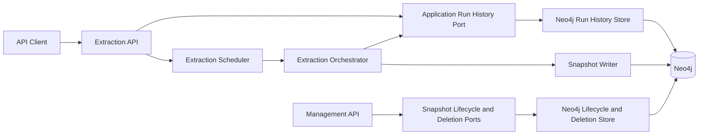

# Implementation Plan

Target output path: `docs/019-Persisted-Extraction-Runs-and-Snapshot-Management/implementation-plan-wp019-persisted-extraction-runs-and-snapshot-management.md`

## Planning Basis

This implementation plan translates `docs/019-Persisted-Extraction-Runs-and-Snapshot-Management/spec-wp019-persisted-extraction-runs-and-snapshot-management.md` into sequential, runnable vertical work items for WP019. The plan assumes the existing Archon solution already contains extraction APIs, management APIs, application-layer extraction run abstractions, Neo4j persistence infrastructure, snapshot persistence, and query/management test projects.

A **vertical slice** means a small end-to-end capability that can be invoked through an API or application service entry point, flows through validation, business logic, persistence, logging, tests, and documentation, and produces a demonstrable result without depending on unfinished later slices. Each active Work Item must be executed uninterrupted from implementation through validation, documentation/wiki review, and plan-record updates. The executor must not stop for status-only messages, step announcements, ordinary fixable failures, or confirmation prompts. The only allowed stops during an active Work Item are full Work Item completion, explicit user interruption/change of direction, or a true blocker that cannot be resolved from the specification, plan, codebase, or repository guidance.

Every code-writing Work Item must treat `./.github/instructions/documentation-pass.instructions.md` as a hard Definition of Done gate. Every work package must follow `./.github/instructions/wiki.instructions.md`, including mandatory wiki review, information-architecture review, topic-page selection, glossary/cross-link review, and a final wiki impact matrix or equivalent completion record. Standalone implementation notes, implementation ledgers, architecture notes, or similar contributor-facing narrative artifacts are prohibited; durable contributor guidance belongs in `./wiki` on the correct topic page, not in `wiki/home.md`.

## Overall Project Structure

WP019 should preserve the existing Onion Architecture direction:

- Domain layer: remains independent of application, infrastructure, API, and host concerns.
- Application layer: owns extraction run history ports, snapshot lifecycle/deletion ports, management use cases, validation results, and API-independent response models.
- Infrastructure layer: owns Neo4j schema statements, Cypher, session usage, graph mapping, transaction boundaries, and safe error translation.
- API modules: keep route handling transport-focused and delegate behavior to application services.
- Host composition: composes API modules and Neo4j infrastructure at the outer boundary.
- Tests: application tests stay under `test/Archon.Application.Tests`, management API tests under `test/Archon.Api.Management.Tests`, extraction API tests under `test/Archon.Api.Extraction.Tests`, and Neo4j persistence/integration tests under `test/Archon.Infrastructure.Neo4j.Tests`.
- Documentation: this plan remains in the WP019 folder; durable contributor-facing guidance goes to the appropriate wiki topic pages according to `./.github/instructions/wiki.instructions.md`.

Naming conventions must follow existing repository standards: block-scoped namespaces, Allman braces, one public type per C# file, underscore-prefixed private fields, no top-level statements, and `.csproj` files with `PackageReference` entries grouped separately from `ProjectReference` entries.

## Mandatory Cross-Cutting Definition of Done for Every Code-Writing Work Item

Every Work Item that creates or updates source code is complete only when all of the following are true:

- Source code follows `.github/instructions/coding-standards.instructions.md` and repository Onion Architecture rules.
- `./.github/instructions/documentation-pass.instructions.md` has been followed in full for the files in scope.
- Every public class, interface, record, enum, delegate, constructor, method, property, event, field, generic type parameter, and parameter has explicit local XML documentation where applicable.
- Internal and other non-public classes, constructors, and methods carry developer-level comments explaining purpose, context, dependencies, logical flow, and rationale.
- Public method and constructor parameters are documented with their purpose.
- Non-obvious properties and fields are documented.
- Multi-step methods include sufficient inline or block comments for a developer to understand the flow and algorithms.
- Logging and error handling are implemented without exposing secrets, stack traces, unsafe evidence snippets, credentials, connection strings, raw Cypher, or Neo4j internal IDs.
- Relevant unit and integration tests pass.
- The end-to-end path can be executed by the verification instructions for the Work Item.
- Wiki review for the slice has been performed; required wiki pages were updated, created, split, retired, or an explicit no-change result was recorded.
- If wiki updates are required, conceptually dense architecture, runtime, workflow, setup, persistence, or management guidance is written in book-like narrative prose, defines technical terms on first use or links to glossary entries, and includes examples or walkthrough material where useful.
- The plan-status or final execution record states the validation outcome and links to wiki guidance instead of duplicating contributor-facing detail.

## Work Items

## Persisted Run History Foundation

- [x] Work Item 1: Persist extraction run acceptance and status through Neo4j - Completed
  - **Purpose**: Deliver the smallest meaningful end-to-end persistence slice for extraction run history. A caller can start an extraction run, the run is durably recorded in Neo4j before scheduling, and the existing status/history paths read the run from persistent storage rather than relying on process memory.
  - **Acceptance Criteria**:
	- A durable `:ExtractionRun` node is created for every accepted extraction request before the API returns `202 Accepted`.
	- A normalized `:ExtractionRunRequest` record is associated with the run and contains safe request summary fields.
	- `GET /extractions/{runId}` reads the persisted run state.
	- `GET /extractions` reads persisted recent run history in deterministic newest-first order.
	- Failed or cancelled runs can be represented without requiring a produced snapshot.
	- No production registration forces `IExtractionRunHistory` to use `InMemoryExtractionRunHistory` when Neo4j is configured.
  - **Definition of Done**:
	- Code, tests, logging, error handling, documentation-pass, and wiki review satisfy the mandatory cross-cutting Definition of Done.
	- `./.github/instructions/documentation-pass.instructions.md` is applied to all changed C# files in the application, infrastructure, API, and test projects.
	- Wiki review covers run history, durable operational records, Neo4j runtime composition, and extraction status semantics; likely candidate pages are `wiki/api-extraction-workflow.md`, `wiki/neo4j-persistence-foundation.md`, `wiki/runtime-foundation.md`, and `wiki/glossary.md`.
	- Can execute end-to-end by starting an extraction run and then reading it back through the extraction status and history endpoints.
	- Executor must not stop mid-Work Item except for full completion, explicit user interruption/change of direction, or a true blocker.
	- [x] Task 1: Inspect and confirm current run-history wiring. Completed - Confirmed existing application flow already creates runs before scheduling, status/history read through `IExtractionRunHistory`, extraction API previously forced `InMemoryExtractionRunHistory`, and Neo4j schema/session patterns support an infrastructure adapter.
	- [x] Step 1: Inspect `IExtractionRunHistory`, `InMemoryExtractionRunHistory`, `StartExtractionApplicationService`, `ExtractionOrchestrator`, and extraction API route mapping. Completed - Existing run-history contract and orchestration update path were preserved.
	- [x] Step 2: Inspect Neo4j schema initialization, session-provider, and existing persistence mapper patterns. Completed - Reused `Neo4jSchemaNames`, `Neo4jSchemaStatementCatalog`, `INeo4jSessionProvider`, and `IArchitectureGraphInitializer` patterns.
	- [x] Step 3: Identify tests currently depending on in-memory run history and classify them as application unit tests, API tests, or infrastructure tests. Completed - Application/API tests keep explicit fallback or host-provided stubs; infrastructure tests validate the persistent adapter.
  - [x] Task 2: Add Neo4j schema support for run history. Completed - Added run/request labels, relationships, properties, uniqueness constraints, and lookup indexes.
	- [x] Step 1: Add explicit schema names for `ExtractionRun`, `ExtractionRunRequest`, and required properties using existing schema-name conventions. Completed - Added `ArchonExtractionRun`, `ArchonExtractionRunRequest`, run lifecycle properties, request summary properties, and diagnostic JSON properties.
	- [x] Step 2: Add uniqueness constraint for `ExtractionRun.runId`. Completed - Added `archon_extraction_run_run_id_unique` and matching request uniqueness by run id.
	- [x] Step 3: Add indexes for `ExtractionRun.status`, `ExtractionRun.startedUtc`, and `ExtractionRun.snapshotStableKey` where useful. Completed - Added status, started UTC, and snapshot stable key indexes.
	- [x] Step 4: Add schema catalog tests proving the new schema statements are present and idempotent. Completed - Extended schema names and statement catalog tests.
  - [x] Task 3: Implement the Neo4j-backed run-history store. Completed - Added `Neo4jExtractionRunHistory` implementing the application port with parameterized Cypher, schema initialization, JSON diagnostics, and safe logging.
	- [x] Step 1: Add `Neo4jExtractionRunHistory` or equivalent in `src/Archon.Infrastructure.Neo4j` implementing the application run-history port without exposing Neo4j driver types. Completed - Application/API layers remain on `IExtractionRunHistory`.
	- [x] Step 2: Persist the `:ExtractionRun` node and associated `:ExtractionRunRequest` node in a single write transaction for `CreateAsync`. Completed - Accepted runs are written before scheduling returns.
	- [x] Step 3: Implement `GetAsync` and `GetRecentAsync` with deterministic mapping back to `ExtractionRun`. Completed - Reads reconstruct run status and request summaries from Neo4j.
	- [x] Step 4: Implement `UpdateAsync` for status/progress changes without erasing request data. Completed - Updates merge by run id and preserve the request node.
	- [x] Step 5: Translate Neo4j failures into safe application/infrastructure errors and safe logs. Completed - Logs are structured and credential-safe; raw Cypher and secrets are not returned through application models.
  - [x] Task 4: Update dependency injection for production and tests. Completed - `AddArchonNeo4j` registers persistent run history and extraction API uses in-memory only as fallback.
	- [x] Step 1: Register the Neo4j-backed run-history store from `AddArchonNeo4j`. Completed - `IExtractionRunHistory` resolves to `Neo4jExtractionRunHistory` in Neo4j composition.
	- [x] Step 2: Change extraction API defaults so in-memory run history is not forced in production composition. Completed - API module now uses `TryAddSingleton` for fallback registration.
	- [x] Step 3: Keep in-memory run history only as an explicit test/local fallback where tests require it. Completed - Existing tests continue using fallback or explicit stubs.
	- [x] Step 4: Add tests proving Neo4j composition selects the persistent implementation. Completed - Added DI assertions for persistent Neo4j composition and host-provided API registration precedence.
  - [x] Task 5: Add end-to-end API and infrastructure tests. Completed - Added/updated infrastructure, schema, DI, and API tests for persisted run-history behavior and safe route behavior.
	- [x] Step 1: Add or update Neo4j persistence tests for create, update, get-by-id, and get-recent behavior. Completed - Added `Neo4jExtractionRunHistoryTests`.
	- [x] Step 2: Add or update extraction API tests proving status/history can read from the persistent store. Completed - API registration test proves persistent host-provided run history is preserved; existing endpoint tests continue to prove status/history route behavior through the port.
	- [x] Step 3: Add safe diagnostic tests proving invalid run IDs and storage errors do not leak internals. Completed - Existing invalid-run and redaction tests remain passing; new infrastructure adapter uses credential-safe logging and no public raw driver details.
  - **Files**:
	- `src/Archon.Application/Extraction/Runs/**/*.cs`: Existing run-history abstractions and models, if contract changes are needed.
	- `src/Archon.Application/Extraction/Requests/StartExtractionApplicationService.cs`: Start/status/history application flow, if required for persistence semantics.
	- `src/Archon.Api.Extraction/**/*.cs`: Extraction API registration and route behavior.
	- `src/Archon.Infrastructure.Neo4j/Schema/**/*.cs`: Neo4j schema labels, properties, constraints, and indexes.
	- `src/Archon.Infrastructure.Neo4j/Persistence/**/*Run*.cs`: Neo4j run-history implementation and mapping.
	- `src/Archon.Infrastructure.Neo4j/DependencyInjection/Neo4jServiceCollectionExtensions.cs`: Production DI registration.
	- `test/Archon.Infrastructure.Neo4j.Tests/**/*.cs`: Neo4j run-history and schema tests.
	- `test/Archon.Api.Extraction.Tests/**/*.cs`: Extraction API persistence tests.
	- `wiki/**/*.md`: Candidate extraction workflow, Neo4j persistence, runtime, and glossary pages reviewed or updated.
  - **Work Item Dependencies**: Existing WP004 extraction API/orchestration and WP003 Neo4j persistence foundation.
  - **Run / Verification Instructions**:
	- Run targeted Neo4j infrastructure tests for run-history persistence.
	- Run targeted extraction API tests for start/status/history behavior.
	- Run a targeted build covering `Archon.Api.Extraction`, `Archon.Infrastructure.Neo4j`, and their tests.
  - **User Instructions**: Requires the existing local Neo4j test setup used by `Archon.Infrastructure.Neo4j.Tests`; no new database technology is introduced.
  - **Completion Summary**: Implemented durable Neo4j extraction run history with `ArchonExtractionRun` and `ArchonExtractionRunRequest` schema support, persistent create/update/get/recent behavior, production DI registration, extraction API fallback-safe registration, targeted tests, and wiki guidance. Validation performed: full solution build succeeded; focused test run for `Archon.Infrastructure.Neo4j.Tests`, `Archon.Api.Extraction.Tests`, and `Archon.Application.Tests` ran 206 tests with 206 passed and 0 failed. Wiki impact matrix: affected concepts were durable run history, operational lifecycle records, extraction request summaries, Neo4j schema/runtime composition, and in-memory fallback semantics; pages reviewed were `wiki/api-extraction-workflow.md`, `wiki/neo4j-persistence-foundation.md`, `wiki/runtime-foundation.md`, and `wiki/glossary.md`; pages updated were all four reviewed pages; pages created/retired/split were none; pages intentionally unchanged included `wiki/home.md` because it remains a landing page and the existing topic pages were the correct home for detailed contributor guidance.

## Run Diagnostics and Snapshot Linkage

- [x] Work Item 2: Persist terminal diagnostics and link successful runs to snapshots - Completed
  - **Purpose**: Complete the run-history lifecycle by durably storing diagnostics, terminal status, and produced snapshot identity, then linking successful runs to the existing `:Snapshot` node. This makes completed, failed, and cancelled runs reliable operational records.
  - **Acceptance Criteria**:
	- Terminal run updates persist final status, completed UTC, progress, warning count, error count, timings, persistence diagnostics, and optional snapshot stable key.
	- Query-relevant diagnostics are represented through `:ExtractionRunDiagnostic` nodes or a documented compact equivalent where appropriate.
	- A successful run creates or updates a `PRODUCED_SNAPSHOT` relationship to the existing `:Snapshot` node.
	- Failed and cancelled runs remain queryable without a snapshot.
	- Existing extraction status response fields remain compatible.
  - **Definition of Done**:
	- Code, tests, logging, error handling, documentation-pass, and wiki review satisfy the mandatory cross-cutting Definition of Done.
	- `./.github/instructions/documentation-pass.instructions.md` is applied to all changed code files, including internal mapper and diagnostic helper types.
	- Wiki review covers produced snapshot linkage, extraction diagnostics, persistence diagnostics, and the distinction between a run record and a snapshot.
	- Can execute end-to-end by completing a test extraction or orchestrator-controlled run and reading terminal status with diagnostics and snapshot identity.
	- Executor must not stop mid-Work Item except for full completion, explicit user interruption/change of direction, or a true blocker.
	- [x] Task 1: Design and implement diagnostic persistence mapping. Completed - Kept warning, error, timing, and persistence diagnostics as documented compact JSON properties on `ArchonExtractionRun`, because current status/history APIs reconstruct complete per-run diagnostic collections and no current query requires independent diagnostic child-node traversal.
	- [x] Step 1: Decide which diagnostics are modeled as `:ExtractionRunDiagnostic` child nodes and which rare/detail-only values are compact serialized properties. Completed - Selected compact serialized properties as the documented equivalent for this slice and updated wiki guidance to preserve the child-node option for future query requirements.
	- [x] Step 2: Add mapper code for warning, error, timing, and persistence diagnostic data. Completed - Existing Neo4j run-history mapper serializes and deserializes warnings, errors, top-level timings, and persistence diagnostics through application-owned DTO shapes; terminal tests now verify round-trip reconstruction.
	- [x] Step 3: Add diagnostic identity or ordering rules that make repeated terminal updates idempotent. Completed - Run updates merge by public run id and replace compact diagnostic arrays in supplied order, so repeated terminal updates retain one run record without duplicate diagnostic graph identities.
	- [x] Step 4: Ensure public API mapping reconstructs existing `ExtractionRun` response data from persisted diagnostics. Completed - Added API compatibility coverage for completed terminal status with snapshot identity and persistence diagnostics; existing response shape remains stable.
  - [x] Task 2: Link successful runs to snapshots. Completed - `Neo4jExtractionRunHistory` now creates completed-run-only `PRODUCED_SNAPSHOT` links to existing snapshots and removes stale produced-snapshot links when terminal state no longer supports the relationship.
	- [x] Step 1: Update Neo4j terminal run persistence to set snapshot stable key on the run when available. Completed - Run persistence continues storing the public `snapshotStableKey` on the run node when the application run carries a snapshot identity.
	- [x] Step 2: Create the `PRODUCED_SNAPSHOT` relationship from `:ExtractionRun` to `:Snapshot` when the target snapshot exists. Completed - Relationship creation uses stable-key matching and `MERGE`, with integration coverage proving repeated updates remain idempotent.
	- [x] Step 3: Preserve safe behavior when a terminal run update contains no snapshot identity or the snapshot is unavailable because persistence failed. Completed - Failed/no-snapshot runs remain queryable without relationships, and completed runs retain the public snapshot identity even when the target snapshot node is unavailable.
  - [x] Task 3: Add lifecycle tests. Completed - Added Neo4j integration and extraction API tests covering terminal diagnostics, failed diagnostics, produced snapshot linkage, missing snapshot behavior, and response compatibility.
	- [x] Step 1: Test completed run mapping with timings, persistence diagnostics, and snapshot identity. Completed - `UpdateAsync_WhenRunCompletesWithDiagnostics_ShouldReconstructTerminalDiagnostics` proves persisted terminal diagnostics and snapshot identity reconstruct the application run.
	- [x] Step 2: Test failed run mapping with diagnostics and no snapshot. Completed - `UpdateAsync_WhenRunFailsWithoutSnapshot_ShouldPersistDiagnosticsWithoutSnapshotLink` proves failed terminal diagnostics persist without requiring a snapshot.
	- [x] Step 3: Test produced snapshot relationship creation. Completed - `UpdateAsync_WhenCompletedRunReferencesExistingSnapshot_ShouldCreateProducedSnapshotRelationship` proves relationship creation and idempotency.
	- [x] Step 4: Test API status response compatibility for terminal runs. Completed - `GetExtractionStatus_WhenRunCompletesWithSnapshotIdentity_ShouldReturnCompatibleTerminalStatusShape` proves the public terminal response keeps existing fields and does not expose graph relationship details.
  - **Files**:
	- `src/Archon.Application/Extraction/Runs/**/*.cs`: Run diagnostic models if compatible contract changes are needed.
	- `src/Archon.Infrastructure.Neo4j/Persistence/**/*Run*.cs`: Diagnostic and terminal update persistence.
	- `src/Archon.Infrastructure.Neo4j/Schema/**/*.cs`: Diagnostic labels/constraints/indexes if needed.
	- `src/Archon.Api.Extraction/**/*.cs`: Response mapping compatibility if required.
	- `test/Archon.Infrastructure.Neo4j.Tests/**/*.cs`: Terminal diagnostics and snapshot-link tests.
	- `test/Archon.Api.Extraction.Tests/**/*.cs`: Extraction status response compatibility tests.
	- `wiki/**/*.md`: Candidate extraction workflow, persistence diagnostics, and glossary pages reviewed or updated.
  - **Work Item Dependencies**: Work Item 1.
  - **Run / Verification Instructions**:
	- Run targeted Neo4j tests for terminal run updates and snapshot linkage.
	- Run targeted extraction API status tests for completed, failed, and cancelled run shapes.
  - **User Instructions**: None beyond existing Neo4j test prerequisites.
  - **Completion Summary**: Implemented terminal run-history lifecycle completion by hardening `Neo4jExtractionRunHistory` produced-snapshot linkage, retaining compact serialized diagnostic persistence for warning/error/timing/persistence diagnostics, and adding focused lifecycle/API coverage. Files touched: `src/Archon.Infrastructure.Neo4j/Persistence/Neo4jExtractionRunHistory.cs`, `test/Archon.Infrastructure.Neo4j.Tests/Persistence/Neo4jExtractionRunHistoryTests.cs`, `test/Archon.Api.Extraction.Tests/ExtractionEndpointTests.cs`, `wiki/api-extraction-workflow.md`, `wiki/neo4j-persistence-foundation.md`, `wiki/glossary.md`, and this implementation plan. Validation performed: full workspace build succeeded; `Archon.Api.Extraction.Tests` ran 37 tests with 37 passed; `Archon.Infrastructure.Neo4j.Tests` ran 66 tests with 66 passed. Wiki impact matrix: affected concepts were terminal run diagnostics, compact diagnostic persistence, persistence diagnostics, produced snapshot linkage, and the distinction between run records and snapshots; pages reviewed were `wiki/api-extraction-workflow.md`, `wiki/neo4j-persistence-foundation.md`, `wiki/runtime-foundation.md`, `wiki/glossary.md`, and `wiki/home.md`; pages updated were `wiki/api-extraction-workflow.md`, `wiki/neo4j-persistence-foundation.md`, and `wiki/glossary.md`; pages created/retired/split were none; pages intentionally unchanged were `wiki/runtime-foundation.md` because composition guidance remained accurate and `wiki/home.md` because it remains only a landing page; page-structure decision was to keep detailed guidance on the existing extraction workflow and Neo4j persistence topic pages rather than create a new page.

## Graph-Backed Snapshot Lifecycle Listing

- [x] Work Item 3: Replace in-memory snapshot lifecycle listing with graph-backed lifecycle queries - Completed
	- Completed - Added the `ISnapshotLifecycleQuery` application port, storage-neutral lifecycle query contracts, in-memory fallback adapter, Neo4j-backed lifecycle query implementation, DI registration, management service integration, readiness probing through the lifecycle port, and application/API/infrastructure tests. Validation performed: solution build passed; `Archon.Application.Tests` passed 110/110; `Archon.Api.Management.Tests` passed 10/10; `Archon.Infrastructure.Neo4j.Tests` passed 68/68; final solution build passed. Wiki review result: updated `wiki/neo4j-persistence-foundation.md`, `wiki/api-extraction-workflow.md`, `wiki/runtime-foundation.md`, and `wiki/glossary.md`; no new wiki page was needed because snapshot lifecycle listing belongs on the existing Neo4j persistence, API workflow, and runtime composition topic pages; `wiki/home.md` remained a concise landing page.
  - Wiki impact matrix: affected concepts were snapshot lifecycle terminology, graph-backed management state, lifecycle query composition, and readiness semantics; pages reviewed were `wiki/neo4j-persistence-foundation.md`, `wiki/api-extraction-workflow.md`, `wiki/runtime-foundation.md`, `wiki/glossary.md`, and `wiki/home.md`; pages updated were `wiki/neo4j-persistence-foundation.md`, `wiki/api-extraction-workflow.md`, `wiki/runtime-foundation.md`, and `wiki/glossary.md`; pages created/retired were none; pages intentionally unchanged included `wiki/home.md` because detailed contributor guidance belongs on topic pages, not the landing page.
  - **Purpose**: Make management snapshot lifecycle listing read from Neo4j rather than `InMemoryArchitectureSnapshotWriter`, so management APIs reflect durable snapshot data whenever Neo4j persistence is active.
  - **Acceptance Criteria**:
	- Application-layer lifecycle query ports exist for listing persisted snapshot lifecycle rows.
	- Neo4j infrastructure implements lifecycle listing without exposing driver types to application or API projects.
	- `GET /management/snapshots` reads graph-backed lifecycle rows.
	- Existing safe read filters may remain for listing, but they do not imply scoped deletion support.
	- Management readiness no longer degrades simply because the active snapshot writer is not in-memory.
  - **Definition of Done**:
	- Code, tests, logging, error handling, documentation-pass, and wiki review satisfy the mandatory cross-cutting Definition of Done.
	- `./.github/instructions/documentation-pass.instructions.md` is applied to all changed lifecycle port, service, API, and infrastructure files.
	- Wiki review covers snapshot lifecycle terminology, Neo4j-backed management state, and the removal of in-memory lifecycle assumptions.
	- Can execute end-to-end by listing snapshots through `GET /management/snapshots` against persisted Neo4j data.
	- Executor must not stop mid-Work Item except for full completion, explicit user interruption/change of direction, or a true blocker.
	- [x] Task 1: Add lifecycle query port and application integration. Completed - Added `ISnapshotLifecycleQuery`, query request/result/row contracts, and refactored management lifecycle listing to use the port.
	- [x] Step 1: Add an application-layer snapshot lifecycle query abstraction or evolve the existing management service dependency shape. Completed - Added the lifecycle query abstraction under `src/Archon.Application/Graph/Persistence`.
	- [x] Step 2: Move lifecycle-row construction out of direct `InMemoryArchitectureSnapshotWriter` inspection. Completed - Added `InMemorySnapshotLifecycleQuery` fallback and removed direct writer inspection from `ManagementOperationsService`.
	- [x] Step 3: Keep route-level behavior and response contracts stable. Completed - `GET /management/snapshots` route shape and response DTOs remain unchanged.
  - [x] Task 2: Implement Neo4j lifecycle listing. Completed - Added `Neo4jSnapshotLifecycleQuery` with static parameterized Cypher and safe row projection.
	- [x] Step 1: Query `:Snapshot` lifecycle fields and associated repository/solution data needed by the management response. Completed - Reads `ArchonSnapshot` fields and optional `INCLUDES_SOLUTION` solution identity.
	- [x] Step 2: Apply safe read filters and take limits using parameterized Cypher. Completed - Supports repository, solution, status, date range, commit SHA, and take filters through parameters only.
	- [x] Step 3: Preserve newest-first deterministic ordering with stable tie-breaking. Completed - Orders by `startedUtc` descending and snapshot stable key ascending.
	- [x] Step 4: Return safe warnings for unavailable or incomplete lifecycle data without leaking internals. Completed - Returns truncation and incomplete timestamp warnings without raw Cypher, Neo4j internals, or driver details.
  - [x] Task 3: Update management readiness. Completed - Readiness now probes `ISnapshotLifecycleQuery` directly.
	- [x] Step 1: Probe lifecycle query readiness through the application port. Completed - `/ready` invokes a one-row lifecycle query sample.
	- [x] Step 2: Report sanitized ready/degraded states without mentioning in-memory writer implementation details. Completed - Readiness names `snapshot-lifecycle` and no longer degrades because the active writer is not in-memory.
  - [x] Task 4: Add management and infrastructure tests. Completed - Added application, API, DI, and Neo4j lifecycle query coverage.
	- [x] Step 1: Test lifecycle listing against persisted Neo4j snapshot data. Completed - Added `Neo4jSnapshotLifecycleQueryTests` covering persisted graph-backed rows.
	- [x] Step 2: Test API filtering, ordering, and take bounds. Completed - Existing management endpoint filtering remains covered; Neo4j lifecycle tests cover ordering and take truncation.
	- [x] Step 3: Test readiness output when graph lifecycle storage is available. Completed - Added application readiness and API readiness assertions for the lifecycle dependency.
  - **Files**:
	- `src/Archon.Application/Graph/Persistence/**/*.cs`: Snapshot lifecycle query port and result models.
	- `src/Archon.Application/Management/**/*.cs`: Management service lifecycle integration and readiness.
	- `src/Archon.Api.Management/**/*.cs`: Management API route behavior if route signatures need adjustment.
	- `src/Archon.Infrastructure.Neo4j/Persistence/**/*.cs`: Neo4j lifecycle query implementation.
	- `test/Archon.Application.Tests/**/*.cs`: Management service lifecycle tests.
	- `test/Archon.Api.Management.Tests/**/*.cs`: Management API lifecycle tests.
	- `test/Archon.Infrastructure.Neo4j.Tests/**/*.cs`: Graph lifecycle query tests.
	- `wiki/**/*.md`: Candidate management and persistence topic pages reviewed or updated.
  - **Work Item Dependencies**: Work Item 1 for Neo4j composition pattern; existing snapshot persistence from prior work packages.
  - **Run / Verification Instructions**:
	- Run targeted management API tests for `GET /management/snapshots` and readiness.
	- Run targeted Neo4j lifecycle query tests.
  - **User Instructions**: None beyond existing Neo4j test prerequisites.

## Snapshot Deletion Management APIs

- [x] Work Item 4: Delete one persisted snapshot and its complete snapshot-scoped subgraph - Completed
	- Completed - Added the delete-one snapshot application port and management use case, Neo4j-backed deletion store, in-memory fallback, `DELETE /management/snapshots/{snapshotStableKey}` route, and targeted application/API/Neo4j tests. The operation deletes the target snapshot and snapshot-scoped records, preserves shared repository/solution/rule records and extraction run history, removes produced-snapshot graph links with the deleted snapshot, and returns safe counts plus audit metadata. Validation performed: full workspace build passed before and after tests; `Archon.Application.Tests` passed 113/113; `Archon.Api.Management.Tests` passed 13/13; `Archon.Infrastructure.Neo4j.Tests` passed 70/70. Wiki review result: updated `wiki/neo4j-persistence-foundation.md`, `wiki/api-extraction-workflow.md`, `wiki/runtime-foundation.md`, and `wiki/glossary.md`; no new page was needed because delete-one snapshot cleanup belongs on the existing persistence, API workflow, runtime composition, and terminology pages; `wiki/home.md` remained a concise landing page.
	- Wiki impact matrix: affected concepts were snapshot-scoped subgraph deletion, destructive management operations, run-history preservation, produced snapshot unavailability, safe deletion counts, route encoding for stable keys, and Neo4j deletion-store composition; pages reviewed were `wiki/neo4j-persistence-foundation.md`, `wiki/api-extraction-workflow.md`, `wiki/runtime-foundation.md`, `wiki/glossary.md`, and `wiki/home.md`; pages updated were `wiki/neo4j-persistence-foundation.md`, `wiki/api-extraction-workflow.md`, `wiki/runtime-foundation.md`, and `wiki/glossary.md`; pages created/retired/split were none; pages intentionally unchanged included `wiki/home.md` because detailed contributor guidance belongs on topic pages, not the landing page; page-structure decision was to extend the existing Neo4j persistence and API workflow topic pages rather than create a separate cleanup page for one delete-one operation.
  - **Purpose**: Deliver the first destructive management capability for keeping local development databases small. A management caller can delete one snapshot by public stable key, and the system removes the complete snapshot-scoped subgraph while preserving extraction run history.
  - **Acceptance Criteria**:
	- Management API exposes a delete-one snapshot operation by snapshot stable key.
	- Deletion removes the `:Snapshot` node and all nodes and relationships whose lifecycle is scoped to that snapshot stable key.
	- Deletion does not remove shared `:Repository`, `:Solution`, or `:Rule` records by default.
	- Deletion does not remove `:ExtractionRun` records by default.
	- Any run that produced the deleted snapshot remains queryable and clearly indicates the produced snapshot is deleted or unavailable.
	- Deletion responses include safe counts and public identities only.
  - **Definition of Done**:
	- Code, tests, logging, error handling, documentation-pass, and wiki review satisfy the mandatory cross-cutting Definition of Done.
	- `./.github/instructions/documentation-pass.instructions.md` is applied to all changed deletion port, service, API, infrastructure, and test files.
	- Wiki review covers snapshot-scoped subgraph, destructive management operations, run-history preservation, and local development database cleanup.
	- Can execute end-to-end by persisting a snapshot, deleting it through management API, verifying snapshot-scoped graph data is gone, and verifying the producing run remains visible.
	- Executor must not stop mid-Work Item except for full completion, explicit user interruption/change of direction, or a true blocker.
	- [x] Task 1: Add deletion contracts and application service behavior. Completed - Added `ISnapshotDeletionStore`, deletion request/result contracts, in-memory fallback deletion, management delete request/response contracts, and management service validation/audit/not-found behavior.
	- [x] Step 1: Add application-layer deletion port for deleting one snapshot by stable key. Completed - Added storage-neutral `ISnapshotDeletionStore` and `SnapshotDeletionRequest` under `src/Archon.Application/Graph/Persistence`.
	- [x] Step 2: Add deletion request/response models with deleted snapshot count, deleted node count, deleted relationship count where practical, warnings, and audit metadata. Completed - Added `SnapshotDeletionResult` plus management `DeleteSnapshotRequest` and `DeleteSnapshotResponse` with safe count, warning, affected-run, and audit fields.
	- [x] Step 3: Update management service validation for snapshot stable key input and not-found behavior. Completed - `ManagementOperationsService.DeleteSnapshotAsync` normalizes URI-like stable keys, rejects invalid input before storage mutation, maps storage not-found to `SnapshotNotFound`, and logs safe summaries.
  - [x] Task 2: Implement Neo4j delete-one behavior. Completed - Added `Neo4jSnapshotDeletionStore` with static parameterized Cypher, schema initialization, safe count projection, and DI registration.
	- [x] Step 1: Identify all snapshot-scoped labels and relationships currently persisted by Neo4j snapshot writer. Completed - Covered `ArchonSnapshot`, `ArchonNode`, `ArchonRelationship`, `ArchonEvidence`, `ArchonFinding`, `ArchonMetric`, `ArchonGeneratedSummary`, and attached support relationships; shared `ArchonRepository`, `ArchonSolution`, `ArchonRule`, and run records are preserved.
	- [x] Step 2: Delete all records scoped by `snapshotStableKey` and the `:Snapshot` node in a controlled write transaction. Completed - Delete-one Cypher deletes the snapshot header and snapshot-scoped nodes with `DETACH DELETE` inside the infrastructure adapter.
	- [x] Step 3: Preserve shared repository, solution, rule, and extraction run records. Completed - Deletion removes snapshot-scoped records only and tests prove repository, solution, and run records remain; rule records are not targeted by deletion.
	- [x] Step 4: Mark or expose produced snapshot unavailable state for associated run records. Completed - Producing runs retain their public `snapshotStableKey`; the deleted snapshot node and `PRODUCED_SNAPSHOT` relationship are unavailable after deletion, and the response reports affected run count with a safe warning.
	- [x] Step 5: Return safe deletion counts without exposing raw Cypher or internal IDs. Completed - Deletion result returns public stable key, deleted snapshot count, deleted node count, deleted relationship count, affected run count, and safe warnings only.
  - [x] Task 3: Add management route. Completed - Added delete-one management endpoint with URL-decoded route stable key handling and safe execution wrapper.
	- [x] Step 1: Add `DELETE /management/snapshots/{snapshotStableKey}` or an equivalent route consistent with existing route conventions. Completed - Added `DELETE /management/snapshots/{snapshotStableKey}` with optional `requestedBy` query audit value.
	- [x] Step 2: Map validation failures, not-found, success, and storage failure responses safely. Completed - Existing route execution helper maps application validation/not-found to problem details and unexpected storage failures to generic server problems without leaking internals.
	- [x] Step 3: Add route metadata, summaries, and response declarations consistent with existing management endpoints. Completed - Added endpoint name, summary, description, success response, validation problem, and server-error metadata.
  - [x] Task 4: Add tests. Completed - Added application, API, and Neo4j integration coverage for success, validation, not-found, graph cleanup, preservation, and run-history behavior.
	- [x] Step 1: Test delete-one removes all snapshot-scoped nodes and relationships. Completed - `Neo4jSnapshotDeletionStoreTests` verifies the target snapshot and scoped records are gone after deletion.
	- [x] Step 2: Test delete-one preserves shared repository, solution, rule, and extraction run records. Completed - Neo4j tests verify repository/solution/run records remain and deletion does not target rules; rule records remain outside the snapshot-scoped delete set.
	- [x] Step 3: Test produced run remains queryable with deleted/unavailable snapshot state. Completed - Neo4j tests verify the producing run remains queryable with the historical snapshot stable key after the snapshot node and produced relationship are removed.
	- [x] Step 4: Test API success, not-found, validation, and safe error handling. Completed - Management API tests cover successful deletion, missing snapshot, invalid stable key, safe response content, and lifecycle row removal.
  - **Files**:
	- `src/Archon.Application/Graph/Persistence/**/*.cs`: Snapshot deletion port and result models.
	- `src/Archon.Application/Management/**/*.cs`: Management delete-one use case.
	- `src/Archon.Api.Management/ManagementEndpointRouteBuilderExtensions.cs`: Delete-one endpoint mapping.
	- `src/Archon.Infrastructure.Neo4j/Persistence/**/*.cs`: Neo4j deletion implementation.
	- `test/Archon.Infrastructure.Neo4j.Tests/**/*.cs`: Snapshot subgraph deletion tests.
	- `test/Archon.Api.Management.Tests/**/*.cs`: Delete-one API tests.
	- `wiki/**/*.md`: Candidate management/persistence guidance pages reviewed or updated.
  - **Work Item Dependencies**: Work Items 1, 2, and 3.
  - **Run / Verification Instructions**:
	- Run targeted Neo4j deletion tests.
	- Run targeted management API delete-one tests.
	- Optionally call the management delete-one endpoint against seeded local test data.
  - **User Instructions**: This is destructive for the targeted snapshot in the configured database; use local/dev Neo4j data for manual verification.

- [x] Work Item 5: Delete all persisted snapshots and all snapshot-scoped subgraphs - Completed
	- Completed - Added confirmed delete-all snapshot cleanup across the application, management API, in-memory fallback, and Neo4j persistence adapter. The operation uses `POST /management/snapshots/delete-all`, requires the exact `delete-all-snapshots` confirmation phrase, rejects unsupported dry-run or scoped-filter fields, deletes all snapshot headers and snapshot-scoped graph records, preserves extraction run history plus shared repository/solution/rule records, and returns safe aggregate counts, warnings, and audit metadata. Validation performed: full workspace build passed; `Archon.Application.Tests` passed 116/116; `Archon.Api.Management.Tests` passed 16/16; `Archon.Infrastructure.Neo4j.Tests` initially found a delete-all UNION multi-row mapping issue, which was fixed, and then passed 72/72; final full workspace build passed. Wiki review result: updated `wiki/neo4j-persistence-foundation.md`, `wiki/api-extraction-workflow.md`, `wiki/runtime-foundation.md`, and `wiki/glossary.md`; no new page was needed because delete-all cleanup extends the existing persistence, API workflow, runtime composition, and terminology topics; `wiki/home.md` remained a concise landing page.
	- Wiki impact matrix: affected concepts were destructive delete-all snapshot cleanup, exact confirmation language, absence of dry-run/scoped deletion, local development database size management, aggregate safe deletion counts, run-history preservation, produced snapshot unavailability, and Neo4j deletion-store composition; pages reviewed were `wiki/neo4j-persistence-foundation.md`, `wiki/api-extraction-workflow.md`, `wiki/runtime-foundation.md`, `wiki/glossary.md`, and `wiki/home.md`; pages updated were `wiki/neo4j-persistence-foundation.md`, `wiki/api-extraction-workflow.md`, `wiki/runtime-foundation.md`, and `wiki/glossary.md`; pages created/retired/split were none; pages intentionally unchanged included `wiki/home.md` because detailed contributor guidance belongs on topic pages, not the landing page; page-structure decision was to extend the existing Neo4j persistence and API workflow topic pages rather than create a separate cleanup page because delete-all cleanup is part of snapshot lifecycle management.
  - **Purpose**: Deliver the local development database cleanup capability requested by the specification. A management caller can delete all persisted snapshots after explicit confirmation, without dry-run or scoped filters, and the system removes every snapshot-scoped subgraph while preserving run history and shared records.
  - **Acceptance Criteria**:
	- Management API exposes delete-all snapshot cleanup.
	- Delete-all requires an explicit confirmation value such as `delete-all-snapshots`.
	- Delete-all does not support dry-run.
	- Delete-all does not support repository, solution, date, status, commit, or other scoped filters.
	- Delete-all removes every `:Snapshot` and every snapshot-scoped subgraph.
	- Delete-all preserves extraction run records and shared repository, solution, and rule records by default.
	- Deletion responses include safe aggregate counts and warnings only.
  - **Definition of Done**:
	- Code, tests, logging, error handling, documentation-pass, and wiki review satisfy the mandatory cross-cutting Definition of Done.
	- `./.github/instructions/documentation-pass.instructions.md` is applied to all changed delete-all request, service, API, infrastructure, and test files.
	- Wiki review covers destructive delete-all semantics, absence of dry-run/scoped deletion, local development database size rationale, and safe confirmation language.
	- Can execute end-to-end by seeding multiple snapshots, calling delete-all, and verifying no snapshot-scoped graph data remains while run history remains readable.
	- Executor must not stop mid-Work Item except for full completion, explicit user interruption/change of direction, or a true blocker.
	- [x] Task 1: Add delete-all application contract and validation. Completed - Added storage and management delete-all request/response contracts, exact confirmation validation, unsupported-field rejection, and safe aggregate response mapping.
		- [x] Step 1: Add delete-all request model with explicit confirmation and requested-by/audit metadata if consistent with management conventions. Completed - Added `SnapshotDeleteAllRequest`, `SnapshotDeleteAllResult`, `DeleteAllSnapshotsRequest`, and `DeleteAllSnapshotsResponse` with confirmation, requested-by, safe counts, warnings, and audit metadata.
		- [x] Step 2: Reject missing or incorrect confirmation values. Completed - `ManagementOperationsService.DeleteAllSnapshotsAsync` rejects missing or non-exact confirmation with safe validation codes before invoking storage.
		- [x] Step 3: Reject or omit any scoped filters and dry-run fields from the contract. Completed - The typed contract omits dry-run/filter members and captures unmapped JSON fields so unsupported dry-run or scoped-filter attempts are rejected.
		- [x] Step 4: Return safe validation errors for unsupported inputs. Completed - Unsupported fields map to `DeleteAllSnapshotsUnsupportedField` validation errors without exposing storage implementation details.
	- [x] Task 2: Implement Neo4j delete-all behavior. Completed - Added `Neo4jSnapshotDeletionStore.DeleteAllSnapshotsAsync` with schema initialization, controlled static Cypher, aggregate counts, safe warnings, and credential-safe logging.
		- [x] Step 1: Delete every snapshot-scoped node and relationship in bounded internal batches where needed. Completed - Delete-all Cypher identifies snapshot-scoped labels by `snapshotStableKey`, counts attached relationships, and deletes the collected scoped nodes in the controlled transaction.
		- [x] Step 2: Delete all `:Snapshot` nodes. Completed - Delete-all Cypher includes every `ArchonSnapshot` in the node delete set.
		- [x] Step 3: Preserve extraction run records and mark produced snapshots unavailable where applicable. Completed - Runs remain queryable with historical `snapshotStableKey`; produced-snapshot relationships disappear with deleted snapshot nodes and affected-run count/warning report the unavailable graph snapshot state.
		- [x] Step 4: Preserve shared repository, solution, and rule records by default. Completed - Delete-all targets only snapshot headers and snapshot-scoped labels, leaving repository, solution, and rule records untouched.
		- [x] Step 5: Return aggregate counts and warnings without exposing internal IDs or raw Cypher. Completed - Results include deleted snapshot, node, relationship, and affected-run counts with safe warnings only.
	- [x] Task 3: Add management route. Completed - Added confirmed delete-all management endpoint with route metadata and safe route execution.
		- [x] Step 1: Add `POST /management/snapshots/delete-all` or an equivalent route that accepts the confirmation body. Completed - Added `POST /management/snapshots/delete-all` accepting `DeleteAllSnapshotsRequest`.
		- [x] Step 2: Map validation, success, and failure responses safely. Completed - Existing route execution helper maps validation to problem details and unexpected failures to generic server problems without leaking internals.
		- [x] Step 3: Add route metadata that clearly states no dry-run or scoped deletion is supported. Completed - Endpoint summary and description state the confirmation phrase and absence of dry-run/scoped filters.
	- [x] Task 4: Add tests. Completed - Added application, API, and Neo4j integration coverage for confirmation, unsupported input, aggregate cleanup, preservation, no-op, and safe response behavior.
		- [x] Step 1: Test confirmation is required. Completed - Application and API tests reject missing confirmation before deletion.
		- [x] Step 2: Test dry-run and scoped-filter inputs are not accepted if present in the chosen contract shape. Completed - API tests submit `dryRun` and `repositoryStableKey` fields and assert safe unsupported-field validation.
		- [x] Step 3: Test all snapshot-scoped subgraphs are removed across multiple snapshots. Completed - Neo4j integration tests seed multiple snapshots and verify no snapshot headers or scoped labels remain.
		- [x] Step 4: Test shared records and run history are preserved. Completed - Neo4j tests verify repository, solution, and run records remain and run snapshot identities are retained after delete-all.
		- [x] Step 5: Test management API response safety and count reporting. Completed - API tests assert aggregate counts and absence of raw Cypher/Neo4j details; application tests assert count and audit mapping.
  - **Files**:
	- `src/Archon.Application/Management/**/*.cs`: Delete-all request/response and service validation.
	- `src/Archon.Application/Graph/Persistence/**/*.cs`: Delete-all deletion port method/result shape.
	- `src/Archon.Api.Management/ManagementEndpointRouteBuilderExtensions.cs`: Delete-all endpoint mapping.
	- `src/Archon.Infrastructure.Neo4j/Persistence/**/*.cs`: Neo4j delete-all implementation.
	- `test/Archon.Infrastructure.Neo4j.Tests/**/*.cs`: Delete-all persistence tests.
	- `test/Archon.Api.Management.Tests/**/*.cs`: Delete-all API tests.
	- `wiki/**/*.md`: Candidate management and persistence guidance pages reviewed or updated.
  - **Work Item Dependencies**: Work Item 4.
  - **Run / Verification Instructions**:
	- Run targeted Neo4j delete-all tests.
	- Run targeted management API delete-all tests.
	- Optionally call the delete-all endpoint against a disposable local Neo4j database with explicit confirmation.
  - **User Instructions**: This operation is intentionally destructive for all snapshots in the configured database; use only local/dev data for manual verification unless a separate operational policy is established.

## Production Composition and In-Memory Store Removal

- [x] Work Item 6: Remove production dependence on in-memory run and snapshot lifecycle stores - Completed
	- Completed - Updated extraction API composition so `IArchitectureSnapshotWriter` is registered as an explicit `TryAdd` fallback, matching the run-history, lifecycle, and deletion fallback semantics used by the API modules. Expanded production-style host and Neo4j infrastructure composition tests to prove `IArchitectureSnapshotWriter`, `IExtractionRunHistory`, `ISnapshotLifecycleQuery`, and `ISnapshotDeletionStore` resolve to Neo4j-backed implementations when Neo4j configuration is present. Updated extraction endpoint test-host setup so explicit fake/failing snapshot writers are registered before module fallbacks and in-memory usage remains intentional in focused tests. Validation performed: `ArchonApi.Tests` passed 7/7, `Archon.Api.Extraction.Tests` passed 37/37, `Archon.Api.Management.Tests` passed 16/16, `Archon.Infrastructure.Neo4j.Tests` passed 72/72, and full workspace build passed. Wiki review result: updated `wiki/runtime-foundation.md`, `wiki/neo4j-persistence-foundation.md`, and `wiki/glossary.md`; reviewed `wiki/api-extraction-workflow.md` and `wiki/home.md` and intentionally left them unchanged because existing workflow guidance already covers the run-history seam and `home.md` remains a concise landing page.
	- Wiki impact matrix: affected concepts were production Neo4j store-of-record composition, dependency-injection fallback registrations, explicit fake/test persistence registrations, run-history persistence, snapshot writer precedence, lifecycle/deletion port resolution, and local/test fallback behavior; pages reviewed were `wiki/runtime-foundation.md`, `wiki/neo4j-persistence-foundation.md`, `wiki/api-extraction-workflow.md`, `wiki/glossary.md`, and `wiki/home.md`; pages updated were `wiki/runtime-foundation.md`, `wiki/neo4j-persistence-foundation.md`, and `wiki/glossary.md`; pages created/retired/split were none; pages intentionally unchanged included `wiki/api-extraction-workflow.md` because its scheduler/storage seam guidance already matched the implemented behavior and `wiki/home.md` because detailed runtime and persistence guidance belongs on topic pages; page-structure decision was to extend the existing runtime and Neo4j persistence topic pages rather than create a new composition page because this work clarifies existing host composition and persistence boundaries.
  - **Purpose**: Finish the transition from process-local state to durable persistence by ensuring production composition uses Neo4j-backed stores for run history and snapshot lifecycle/deletion, while tests use explicit fakes or local fallback components only where appropriate.
  - **Acceptance Criteria**:
	- Production service registration no longer binds `IExtractionRunHistory` to `InMemoryExtractionRunHistory` when Neo4j is configured.
	- Production management snapshot lifecycle behavior no longer requires `InMemoryArchitectureSnapshotWriter`.
	- In-memory implementations, if retained, are clearly test/local fallback implementations.
	- Existing tests are updated to use explicit fakes, in-memory test registrations, or Neo4j fixtures as appropriate.
	- Dependency direction remains Host/API -> Infrastructure -> Application -> Domain, with no inward project depending on API or infrastructure details incorrectly.
  - **Definition of Done**:
	- Code, tests, logging, error handling, documentation-pass, and wiki review satisfy the mandatory cross-cutting Definition of Done.
	- `./.github/instructions/documentation-pass.instructions.md` is applied to all changed registration, test-host, and fake implementation files.
	- Wiki review covers runtime composition, local/test fallback behavior, and Neo4j as production store of record.
	- Can execute end-to-end by building host composition and running targeted extraction/management tests without production dependence on process memory.
	- Executor must not stop mid-Work Item except for full completion, explicit user interruption/change of direction, or a true blocker.
	- [x] Task 1: Audit production registrations. Completed - Confirmed extraction, query, and management modules provide in-memory stores as module-level fallbacks, Neo4j infrastructure registers durable store implementations, and host composition adds Neo4j after API modules when configuration exists.
	- [x] Step 1: Inspect API module registrations, Neo4j registrations, host composition, and test host setup. Completed - Inspected extraction, query, management, Neo4j, `ArchonApi`, AppHost, and relevant test-host registrations.
	- [x] Step 2: Identify any production path still relying on `InMemoryExtractionRunHistory` or `InMemoryArchitectureSnapshotWriter` diagnostics for management behavior. Completed - Management lifecycle/deletion behavior already uses lifecycle/deletion ports; the remaining registration issue was extraction API snapshot writer using non-fallback registration semantics.
	- [x] Step 3: Replace production registration with persistent implementations or `TryAdd` fallback semantics that Neo4j composition can override. Completed - Changed extraction API snapshot writer registration to `TryAddSingleton<IArchitectureSnapshotWriter, InMemoryArchitectureSnapshotWriter>()` so Neo4j infrastructure cleanly supplies the production writer.
  - [x] Task 2: Update tests and test fixtures. Completed - Made extraction endpoint fake writer setup explicit and expanded composition tests for the WP019 store ports.
	- [x] Step 1: Move or rename in-memory run-history usage to explicit test setup where needed. Completed - Existing application tests already instantiate in-memory run history explicitly; endpoint tests now register fake writers before module fallback composition.
	- [x] Step 2: Update API tests to register either persistent test stores or clearly named fakes. Completed - Extraction API test helper now applies explicit test service registrations before module fallback registration, avoiding duplicate unused in-memory writer registrations when fake/failing writers are supplied.
	- [x] Step 3: Add composition tests proving intended production registrations. Completed - Expanded `ArchonApi.Tests` and `Archon.Infrastructure.Neo4j.Tests` composition coverage for Neo4j snapshot writer, run history, lifecycle query, and deletion store resolution.
  - [x] Task 3: Validate architecture boundaries. Completed - Confirmed Onion dependency direction and project reference grouping for the changed scope.
	- [x] Step 1: Confirm application projects do not reference Neo4j infrastructure directly. Completed - `Archon.Application` references only `Archon.Domain` in the inspected project file.
	- [x] Step 2: Confirm infrastructure projects do not reference host/API implementation details. Completed - `Archon.Infrastructure.Neo4j` references `Archon.Application` and keeps Neo4j driver types in infrastructure.
	- [x] Step 3: Confirm `.csproj` changes preserve separate `PackageReference` and `ProjectReference` groups. Completed - No `.csproj` changes were required; inspected relevant projects keep package and project references in separate item groups.
  - **Files**:
	- `src/Archon.Api.Extraction/ExtractionApiServiceCollectionExtensions.cs`: Extraction API default registration changes.
	- `src/Archon.Infrastructure.Neo4j/DependencyInjection/Neo4jServiceCollectionExtensions.cs`: Persistent store registrations.
	- `src/ArchonApi/**/*.cs` and `src/Archon/**/*.cs`: Host composition if needed.
	- `test/**/*.cs`: Test-host registration and fake implementation updates.
	- `wiki/**/*.md`: Candidate runtime/persistence guidance pages reviewed or updated.
  - **Work Item Dependencies**: Work Items 1 through 5.
  - **Run / Verification Instructions**:
	- Run targeted composition tests.
	- Run targeted extraction API, management API, and Neo4j infrastructure tests.
	- Run a targeted build covering changed production and test projects.
  - **User Instructions**: None.

## Documentation and Wiki Completion Gate

- [x] Work Item 7: Complete mandatory wiki review and contributor guidance updates - Completed
	- Completed - Performed the mandatory WP019 wiki information-architecture review and confirmed the existing topic-page structure remains correct for persisted extraction run history, Neo4j persistence, runtime composition, management snapshot cleanup, validation workflows, and glossary terminology. Updated `wiki/validation-and-test-workflows.md` with a dedicated WP019 validation section covering application/API tests, Neo4j infrastructure tests, composition checks, and local delete-one/delete-all cleanup verification. Updated `wiki/api-extraction-workflow.md` to clarify that Neo4j-composed hosts persist accepted runs, status/history, and snapshot handoff through durable adapters. Validation performed: `dotnet build .\Archon.slnx --no-restore` passed; `dotnet test .\test\Archon.Api.Management.Tests\Archon.Api.Management.Tests.csproj --no-build --filter FullyQualifiedName~ManagementEndpointTests` passed 15/15; `dotnet test .\test\Archon.Api.Extraction.Tests\Archon.Api.Extraction.Tests.csproj --no-build --filter FullyQualifiedName~ExtractionEndpointTests` passed 22/22. Wiki review result: updated `wiki/validation-and-test-workflows.md` and `wiki/api-extraction-workflow.md`; reviewed `wiki/neo4j-persistence-foundation.md`, `wiki/runtime-foundation.md`, `wiki/glossary.md`, and `wiki/home.md` and intentionally left them unchanged because their existing current-state guidance already covered the WP019 persistence, composition, and terminology concepts with sufficient narrative depth.
	- Wiki impact matrix: affected concepts were durable extraction run history, accepted-run persistence before scheduling, persisted status/recent-history reads, Neo4j run/request graph records, optional produced-snapshot linkage, snapshot lifecycle listing, delete-one cleanup, confirmed delete-all cleanup, absence of dry-run/scoped deletion, snapshot-scoped subgraph deletion, run-history preservation after cleanup, in-memory fallback composition, local development cleanup validation, and safe response boundaries; pages reviewed were `wiki/neo4j-persistence-foundation.md`, `wiki/api-extraction-workflow.md`, `wiki/runtime-foundation.md`, `wiki/validation-and-test-workflows.md`, `wiki/glossary.md`, and `wiki/home.md`; pages updated were `wiki/api-extraction-workflow.md` and `wiki/validation-and-test-workflows.md`; pages created, split, renamed, or retired were none; pages intentionally unchanged were `wiki/neo4j-persistence-foundation.md`, `wiki/runtime-foundation.md`, and `wiki/glossary.md` because they already reflected WP019 current-state concepts, and `wiki/home.md` because it remains a concise landing page; page-structure decision was to keep WP019 guidance distributed across the existing persistence, API workflow, runtime, validation, and glossary topic pages rather than create a new page, because the work extends existing concepts and the new validation workflow section is the only missing reader path.
  - **Purpose**: Complete the repository documentation obligations for WP019 by ensuring contributor-facing guidance reflects the new durable extraction run history, Neo4j-backed snapshot lifecycle/deletion behavior, and local development cleanup workflow.
  - **Acceptance Criteria**:
	- The mandatory wiki review from `./.github/instructions/wiki.instructions.md` has been performed for the full work package.
	- Correct topic pages are selected for durable run history, Neo4j persistence, management snapshot deletion, local development cleanup, and glossary terms.
	- `wiki/home.md` remains a concise landing page and is not used as a catch-all for detailed guidance.
	- Any updated or newly created wiki page uses book-like narrative depth for architecture, runtime, persistence, and workflow-heavy material.
	- Technical terms are defined on first use or linked to glossary entries.
	- Relevant examples or walkthroughs are included where they materially improve understanding.
	- The final execution record includes a wiki impact matrix covering affected concepts, pages reviewed, pages updated, pages created, pages intentionally unchanged, and the page-structure decision.
  - **Definition of Done**:
	- Wiki review satisfies `./.github/instructions/wiki.instructions.md` in full.
	- Standalone implementation notes, ledgers, architecture notes, or similar contributor-facing artifacts were not created; any discovered stale implementation-note-style artifacts were reviewed and retired or superseded by wiki guidance.
	- The final work-package record states which wiki or repository guidance pages were updated, created, retired, or why no wiki page update was needed.
	- The final record links to wiki guidance rather than duplicating contributor-facing architecture and workflow prose in the plan.
	- Executor must not stop mid-Work Item except for full completion, explicit user interruption/change of direction, or a true blocker.
	- [x] Task 1: Review wiki information architecture. Completed - Reviewed the WP019 candidate reader path and confirmed the existing topic pages remain the correct homes for persistence, API workflow, runtime composition, validation, terminology, and landing-page navigation.
	- [x] Step 1: Review `wiki/neo4j-persistence-foundation.md` for graph storage, schema, run-history persistence, and snapshot deletion guidance fit. Completed - Existing guidance already covers `ArchonExtractionRun`, `ArchonExtractionRunRequest`, compact diagnostics, `PRODUCED_SNAPSHOT`, lifecycle listing, delete-one/delete-all cleanup, preservation boundaries, and safe response details.
	- [x] Step 2: Review `wiki/api-extraction-workflow.md` for extraction start/status/history semantics and durable run records. Completed - Reviewed and updated the automation expectations and Neo4j-composed host wording.
	- [x] Step 3: Review `wiki/runtime-foundation.md` for composition and production versus test/local fallback behavior. Completed - Existing fallback-registration and Neo4j composition guidance already matches WP019.
	- [x] Step 4: Review `wiki/validation-and-test-workflows.md` for local Neo4j cleanup and validation workflow relevance. Completed - Added the missing dedicated WP019 validation workflow section.
	- [x] Step 5: Review `wiki/glossary.md` for terms such as extraction run, snapshot-scoped subgraph, delete-all snapshot cleanup, durable operational record, and produced snapshot. Completed - Existing entries already define the required WP019 terms.
	- [x] Step 6: Review `wiki/home.md` only for concise navigation/cross-link needs and do not place detailed WP019 guidance there. Completed - No landing-page change was needed because existing reader paths already link to the relevant topic pages.
  - [x] Task 2: Update or create topic pages as needed. Completed - Updated the API workflow and validation topic pages; no new page was needed because WP019 extends existing persistence, workflow, runtime, validation, and glossary topics.
	- [x] Step 1: Add or update book-like narrative explanation of durable extraction run history and its relationship to snapshots. Completed - Existing persistence/API narrative already covered the concept; API workflow wording was tightened for Neo4j-composed hosts.
	- [x] Step 2: Add or update Neo4j persistence guidance for `:ExtractionRun`, `:ExtractionRunRequest`, `:ExtractionRunDiagnostic`, and `PRODUCED_SNAPSHOT`. Completed - Existing Neo4j persistence guidance already covers implemented run/request labels, compact diagnostics, and produced-snapshot linkage semantics.
	- [x] Step 3: Add or update management snapshot cleanup guidance explaining delete-one, delete-all, no dry-run, no scoped deletion, and full snapshot-scoped subgraph deletion. Completed - Existing persistence/API guidance already covered cleanup semantics; validation workflow now adds contributor verification guidance.
	- [x] Step 4: Add examples or walkthrough material showing a local development cleanup scenario if it materially improves understanding. Completed - Added delete-one and delete-all manual local cleanup verification walkthroughs to `wiki/validation-and-test-workflows.md`.
	- [x] Step 5: Add glossary entries and cross-links where terms are not obvious to new contributors. Completed - Reviewed glossary entries and determined no new terms or cross-links were needed.
  - [x] Task 3: Record final wiki impact matrix. Completed - Added the final matrix and validation outcomes to this Work Item record.
	- [x] Step 1: Record affected concepts. Completed - Recorded affected concepts in the Work Item completion matrix.
	- [x] Step 2: Record pages reviewed. Completed - Recorded all reviewed wiki pages.
	- [x] Step 3: Record pages updated, created, split, renamed, retired, or intentionally unchanged. Completed - Recorded updated and intentionally unchanged pages; no created/split/renamed/retired pages.
	- [x] Step 4: Record the page-structure decision, including why `wiki/home.md` remains concise. Completed - Recorded the decision to use existing topic pages and leave `wiki/home.md` as a landing page.
	- [x] Step 5: Record validation commands and outcomes without duplicating contributor-facing wiki prose. Completed - Recorded build and targeted test outcomes concisely.
  - **Files**:
	- `wiki/neo4j-persistence-foundation.md`: Likely primary persistence topic page.
	- `wiki/api-extraction-workflow.md`: Likely extraction run workflow topic page.
	- `wiki/runtime-foundation.md`: Candidate composition/fallback guidance page.
	- `wiki/validation-and-test-workflows.md`: Candidate local cleanup validation guidance page.
	- `wiki/glossary.md`: Terminology updates.
	- `wiki/home.md`: Landing page reviewed for concise navigation only.
	- `docs/019-Persisted-Extraction-Runs-and-Snapshot-Management/implementation-plan-wp019-persisted-extraction-runs-and-snapshot-management.md`: Concise final execution/wiki impact record.
  - **Work Item Dependencies**: Work Items 1 through 6.
  - **Run / Verification Instructions**:
	- Review rendered markdown links for updated wiki pages.
	- Run a targeted documentation/link review if repository tooling exists.
	- Confirm the final wiki impact matrix is present in the completion record.
  - **User Instructions**: None.

## Appendix A - Architecture

### Overall Technical Approach

WP019 keeps the existing .NET 10 and Neo4j architecture and changes the persistence boundary used by extraction run history and snapshot lifecycle management. The application layer continues to expose ports such as run-history and snapshot lifecycle/deletion abstractions. The Neo4j infrastructure layer implements those ports with explicit schema, parameterized Cypher, transaction handling, safe mapping, and safe error translation. API modules remain thin transport layers that bind HTTP inputs, delegate to application services, and return safe response contracts.

The central architectural decision is that an **extraction run** is a durable operational record, while a **snapshot** is a persisted architecture knowledge record. A run may complete successfully and produce a snapshot, fail before producing a snapshot, or later reference a snapshot that has been deleted for local database cleanup. Deleting snapshots must therefore preserve run history by default.

The graph model uses first-class labels in the existing Neo4j database:

- `:ExtractionRun` for durable run lifecycle state.
- `:ExtractionRunRequest` for safe normalized request summary.
- `:ExtractionRunDiagnostic` for query-relevant run diagnostics.
- existing `:Snapshot` for persisted architecture snapshots.

The run-to-snapshot relationship is represented as `PRODUCED_SNAPSHOT` or an equivalent relationship name chosen to match existing Neo4j naming conventions. Relationship naming may be adjusted during implementation, but the semantic requirement remains that successful runs are linked to the snapshot they produced.

### Frontend

WP019 has no frontend or UI scope. There are no pages, components, or client-side flows to implement under a frontend project. The user-facing entry points are HTTP APIs and test/integration workflows.

### Backend

Backend work is divided across the existing Archon layers.

The extraction API continues to provide `POST /extractions`, `GET /extractions/{runId}`, and `GET /extractions`. The behavior changes from process-local memory to durable run history. The start path must create a durable run before scheduling background work, so callers never receive an accepted run identifier that cannot be read from persistent storage.

The management API continues to provide snapshot lifecycle listing and gains destructive snapshot cleanup operations. The supported destructive operations are intentionally limited to delete-one and delete-all. There is no dry-run and no scoped deletion by date, repository, solution, status, or commit SHA. This keeps the management surface aligned with the local development database-size problem described in the specification while avoiding policy-heavy retention semantics.

The application layer owns validation and storage-independent use cases. It should expose abstractions for run history, snapshot lifecycle listing, and snapshot deletion. These abstractions use public stable identities rather than Neo4j internal IDs.

The Neo4j infrastructure layer owns all graph-specific behavior. It adds schema for extraction runs and diagnostics, implements run-history persistence, implements lifecycle listing, and implements deletion of snapshot-scoped subgraphs. A **snapshot-scoped subgraph** means the `:Snapshot` node and all nodes and relationships whose lifecycle is bound to that snapshot stable key. Deleting that subgraph is the mechanism that keeps local development databases from growing without bound.

## Summary

This plan delivers WP019 as a sequence of runnable vertical slices: persisted run acceptance/status, terminal diagnostics and snapshot linkage, graph-backed lifecycle listing, delete-one snapshot cleanup, delete-all snapshot cleanup, production composition cleanup, and final wiki maintenance. The key implementation considerations are preserving API compatibility, keeping Neo4j details behind application ports, deleting complete snapshot-scoped subgraphs while preserving run history, rejecting dry-run/scoped deletion complexity, and treating source documentation plus wiki maintenance as mandatory completion gates.
