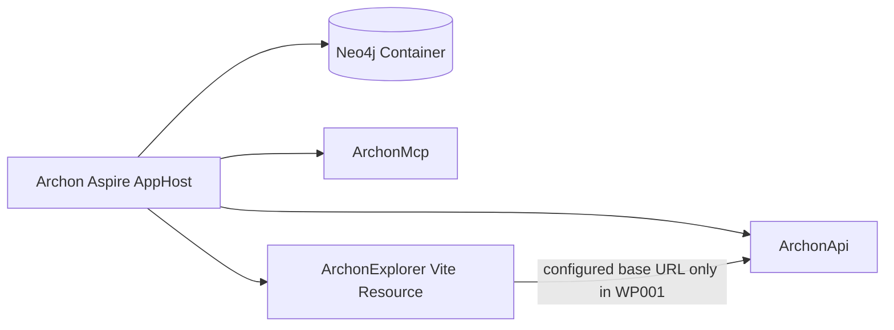

# Implementation Plan - WP001 ArchonExplorer Foundation

## Document Control

| Field | Value |
| --- | --- |
| Work Package | WP001 - ArchonExplorer Foundation |
| Target Output Path | `docs/020-ArchonExplorer-Foundation/plan-wp001-archonexplorer-foundation.md` |
| Source Specification | `docs/020-ArchonExplorer-Foundation/spec-wp001-archonexplorer-foundation.md` |
| Mandatory Wiki Guidance | `./.github/instructions/wiki.instructions.md` |
| Mandatory Documentation-Pass Guidance | `./.github/instructions/documentation-pass.instructions.md` |
| Status | Draft |

## Planning Principles

This plan turns the ArchonExplorer Foundation specification into a small sequence of executable work items. The work package is foundational, but every work item must preserve a runnable state: first a buildable frontend shell, then an Aspire-hosted shell, then a documented and validated contributor workflow. The implemented UI must be honest about what is not yet available. It may reserve space for later workbench areas, but it must not imply that extraction, snapshots, search, graph projections, lenses, or evidence inspection are complete.

Implementation must follow these repository standards as hard gates, not optional cleanup:

- `./.github/instructions/wiki.instructions.md` must be followed for every work item. Wiki review is mandatory for the work package, and wiki updates are required whenever developer-facing behavior, architecture, setup workflows, terminology, or contributor guidance changes or is materially clarified.
- `./.github/instructions/documentation-pass.instructions.md` must be followed for every work item that creates, updates, reviews, or plans source code. Code is not acceptable unless the documentation-pass standard is met for the code touched by that work item.
- For C# code touched by this work package, repository coding standards remain mandatory: Allman braces, block-scoped namespaces, no top-level statements, one public type per file, nullable reference types, underscore-prefixed private fields where fields are needed, explicit host entry points, and package references separated from project references in `.csproj` files.
- For TypeScript and React code, all hand-written components, hooks, providers, utilities, and configuration adapters must receive developer-level comments that explain purpose, logical flow, and non-obvious behavior. Comments must be useful to future contributors and must not become placeholders or noise.
- Active work-item execution must be uninterrupted. Once implementation starts for a work item, the executor must continue through implementation, validation, documentation/wiki review, and plan-record updates. The executor must not stop for status-only messages, ordinary fixable build/test failures, or confirmation prompts. The only allowed stops are full work-item completion, explicit user interruption or direction change, or a true blocker that cannot be resolved from the specification, this plan, codebase evidence, or repository guidance.
- The Aspire AppHost must not be run by automated validation as a blocking process. Manual Aspire smoke verification is required and must be recorded.
- Contributor-facing design rationale, setup guidance, validation workflows, troubleshooting guidance, and terminology must be written into `./wiki` according to `./.github/instructions/wiki.instructions.md`, not into standalone implementation notes or implementation ledgers. `wiki/home.md` must remain a concise landing page and must not become the destination for detailed UI or setup guidance.

## Overall Project Structure

The implementation will create or align this structure:

```text
docs/
  020-ArchonExplorer-Foundation/
	spec-wp001-archonexplorer-foundation.md
	plan-wp001-archonexplorer-foundation.md

src/
  Archon/
	Archon.csproj
	Program.cs
  ArchonExplorer/
	package.json
	package-lock.json
	index.html
	vite.config.ts
	tsconfig.json
	tsconfig.app.json
	tsconfig.node.json
	components.json
	src/
	  main.tsx
	  App.tsx
	  index.css
	  components/
		ui/
		workbench/
	  config/
	  lib/
	  providers/
	  styles/
```

The exact frontend file split may be refined during implementation, but the result must keep bootstrap, providers, workbench layout, configuration, reusable UI primitives, and styling concerns discoverable. The frontend must live under `src/ArchonExplorer`, use npm, and remain independent from ASP.NET Core static-file hosting.

The existing AppHost project is `src/Archon/Archon.csproj`, with composition code in `src/Archon/Program.cs`. WP001 must add ArchonExplorer as an Aspire-hosted Vite resource without removing or weakening the current Neo4j, `ArchonApi`, or `ArchonMcp` composition.

## Work Items

## 1. Frontend Application and Runtime Skeleton

- [x] Work Item 1: Create the runnable Vite React TypeScript application foundation - Completed
  - **Purpose**: Establish `src/ArchonExplorer` as a standalone, npm-managed, buildable React and TypeScript application with the required provider and configuration seams before visual shell work is added.
  - **Acceptance Criteria**:
	- `src/ArchonExplorer` exists and contains a Vite React TypeScript application.
	- npm is the package manager and `package-lock.json` is committed.
	- `package.json` exposes `dev`, `build`, and `typecheck` scripts.
	- TanStack Query is installed and configured through an application-level provider.
	- The application can render a minimal ArchonExplorer root without functional API calls.
	- No Next.js, ASP.NET Core-hosted SPA template, graph-rendering library, data-grid library, drag/drop framework, or unrelated component library is introduced.
  - **Definition of Done**:
	- Frontend application skeleton is created under `src/ArchonExplorer`.
	- Runtime provider setup is centralized and includes TanStack Query.
	- API base URL configuration is represented through a Vite-compatible configuration adapter, without implementing a full typed API client.
	- Hand-written TypeScript and React code includes developer-level comments for every component, function, hook, provider, constructor-equivalent factory, and non-obvious property or constant introduced in this work item.
	- Any C# touched during this work item complies with `./.github/instructions/documentation-pass.instructions.md` in full.
	- Wiki review is performed for frontend project structure and setup impact; relevant wiki or repository guidance is updated, or an explicit no-change result is recorded.
	- Foundational documentation uses book-like narrative depth where it explains runtime or setup concepts, defines technical terms on first use, and includes examples or walkthrough support when useful.
	- Can execute end-to-end via: `cd .\src\ArchonExplorer`, `npm install`, `npm run typecheck`, and `npm run build`.
	- Executor must not stop mid-work-item unless the work item is complete, the user explicitly interrupts, or a true blocker prevents further autonomous progress.
	- [x] Task 1: Inspect frontend and package baseline - Completed
	- [x] Confirm `src/ArchonExplorer` does not already contain an existing frontend application that must be preserved.
	- [x] Confirm the repository does not already define a frontend package-manager standard elsewhere.
	- [x] Confirm Node/npm availability before generating lockfile-dependent artifacts.
  - [x] Task 2: Create Vite React TypeScript skeleton - Completed
	- [x] Create `src/ArchonExplorer` with Vite-compatible `index.html`, TypeScript configs, Vite config, and React bootstrap files.
	- [x] Configure strict TypeScript settings suitable for later API client and workbench state code.
	- [x] Add npm scripts for `dev`, `build`, and `typecheck`.
	- [x] Generate and retain `package-lock.json` through npm restore.
  - [x] Task 3: Add runtime providers and configuration seam - Completed
	- [x] Install and configure TanStack Query.
	- [x] Add a central provider component for application-level runtime providers.
	- [x] Add a Vite-compatible API base URL configuration reader, such as a `VITE_` environment-backed value.
	- [x] Represent configured/unconfigured state without performing functional API queries.
  - [x] Task 4: Apply source documentation requirements - Completed
	- [x] Add developer-level comments to every hand-written component, provider, function, and configuration helper introduced in the frontend skeleton.
	- [x] Explain non-obvious constants and configuration values, including the API base URL configuration key.
	- [x] Keep comments explanatory and current-state oriented rather than roadmap-heavy.
  - [x] Task 5: Validate frontend skeleton - Completed
	- [x] Run `npm install` from `src/ArchonExplorer`.
	- [x] Run `npm run typecheck`.
	- [x] Run `npm run build`.
	- [x] Fix ordinary package, TypeScript, or build issues without stopping unless a true external dependency blocker is encountered.
  - **Completion Summary**: Created the standalone npm-managed Vite React TypeScript skeleton under `src/ArchonExplorer`, including strict TypeScript project references, `dev`/`build`/`typecheck` scripts, `package-lock.json`, React bootstrap, centralized TanStack Query provider setup, and the safe `VITE_ARCHON_API_BASE_URL` configuration seam. No C# files were touched. Validation performed from `src/ArchonExplorer`: `npm install`, `npm run typecheck`, and `npm run build` all succeeded. Wiki review result: created [ArchonExplorer frontend foundation](../../wiki/archonexplorer-frontend-foundation.md), updated [validation and test workflows](../../wiki/validation-and-test-workflows.md), added ArchonExplorer/frontend/Vite/TanStack Query terms to [glossary](../../wiki/glossary.md), and added only a concise reader-path link in [home](../../wiki/home.md). Page-structure decision: a new topic page was required because frontend package management, React bootstrap, provider setup, and Vite configuration are contributor-facing setup concepts that do not belong in `wiki/home.md` and are not AppHost runtime composition until the later Aspire work item; `wiki/runtime-foundation.md` was reviewed and intentionally left unchanged for Work Item 1.
  - **Wiki Impact Matrix**: Affected concepts: ArchonExplorer frontend skeleton, npm/Vite validation, TanStack Query provider seam, safe Vite API base URL configuration. Pages reviewed: `wiki/home.md`, `wiki/runtime-foundation.md`, `wiki/solution-architecture.md`, `wiki/validation-and-test-workflows.md`, `wiki/glossary.md`. Pages created: `wiki/archonexplorer-frontend-foundation.md`. Pages updated: `wiki/home.md`, `wiki/validation-and-test-workflows.md`, `wiki/glossary.md`. Pages intentionally unchanged: `wiki/runtime-foundation.md` and `wiki/solution-architecture.md` because Aspire composition and solution boundary wording do not change until later work items.
  - **Files**:
	- `src/ArchonExplorer/package.json`: npm scripts and frontend dependencies.
	- `src/ArchonExplorer/package-lock.json`: deterministic npm dependency lockfile.
	- `src/ArchonExplorer/index.html`: Vite HTML entry point.
	- `src/ArchonExplorer/vite.config.ts`: Vite configuration and path aliases.
	- `src/ArchonExplorer/tsconfig*.json`: TypeScript build and typecheck configuration.
	- `src/ArchonExplorer/src/main.tsx`: React root bootstrap.
	- `src/ArchonExplorer/src/App.tsx`: initial application root.
	- `src/ArchonExplorer/src/providers/*`: runtime provider setup.
	- `src/ArchonExplorer/src/config/*`: API configuration seam.
  - **Work Item Dependencies**: None.
  - **Run / Verification Instructions**:
	- `cd .\src\ArchonExplorer`
	- `npm install`
	- `npm run typecheck`
	- `npm run build`
  - **User Instructions**:
	- Install Node.js with npm if npm is unavailable. Use Windows/PowerShell-compatible commands; WSL is not required.

## 2. shadcn/ui and Workbench Foundation Shell

- [x] Work Item 2: Implement the visible ArchonExplorer workbench foundation shell - Completed
  - **Purpose**: Turn the runnable frontend skeleton into a demonstrable desktop-style workbench foundation that satisfies the WP001 shell affordances while clearly marking unavailable features as later work-package capabilities.
  - **Acceptance Criteria**:
	- shadcn/ui is configured with compatible styling, theme tokens, component aliases, and at least enough usable primitives to prove the component system is working.
	- The rendered UI visibly identifies itself as `ArchonExplorer`.
	- The UI contains a top-level app frame, activity rail placeholder, command/search affordance placeholder, main workspace empty/start state, status bar, theme affordance, and API configuration indicator.
	- Placeholder activity items align with later areas: Dashboard, Extraction Center, Snapshots, Search, Projects, Findings, and Settings or Diagnostics.
	- The status bar reserves space for active snapshot `current`, API configuration, background work, and selection context.
	- The shell does not implement functional extraction, snapshot management, search results, investigation tabs, graph visualisation, lenses, evidence inspection, or a real notification center.
	- User-visible unavailable states are safe and do not expose raw stack traces, environment variables, connection strings, raw Cypher, Neo4j internal identifiers, or driver-specific details.
  - **Definition of Done**:
	- shadcn/ui configuration is present and used for ordinary UI primitives introduced in this slice.
	- Workbench shell components are separated from provider/configuration code so later WP002/WP003 work can extend them without replacing the foundation.
	- Theme support is implemented at least as a baseline light/dark token foundation with a simple visible affordance if practical.
	- Accessibility basics are covered for interactive placeholders, including semantic elements, labels, and visible focus states.
	- Hand-written TypeScript and React code includes developer-level comments for every component, function, hook, provider, constructor-equivalent factory, and non-obvious property or constant introduced or changed in this work item.
	- Any C# touched during this work item complies with `./.github/instructions/documentation-pass.instructions.md` in full.
	- Wiki review is performed for ArchonExplorer shell terminology and UI foundation impact; relevant wiki or repository guidance is updated, or an explicit no-change result is recorded.
	- Foundational UI documentation uses book-like narrative depth where it explains the workbench model, defines technical terms such as activity rail, command/search affordance, status bar, and shell placeholder on first use, and includes examples or walkthrough support when useful.
	- Can execute end-to-end via: `npm run dev`, open the printed Vite URL, and observe the ArchonExplorer shell.
	- Executor must not stop mid-work-item unless the work item is complete, the user explicitly interrupts, or a true blocker prevents further autonomous progress.
	- [x] Task 1: Configure shadcn/ui foundation - Completed
	- [x] Add shadcn/ui-compatible CSS variables, theme tokens, utility setup, path aliases, and `components.json`.
	- [x] Add only the shadcn/ui primitives required to demonstrate the shell foundation, such as button, card, badge, or comparable minimal primitives.
	- [x] Do not add another ordinary component library for shell, form, table, dialog, command, tab, menu, badge, tooltip, popover, or notification patterns.
  - [x] Task 2: Implement workbench layout components - Completed
	- [x] Create a top-level workbench shell component.
	- [x] Create an activity rail component with placeholder workbench areas.
	- [x] Create a command/search affordance component that clearly states functional search and commands arrive later.
	- [x] Create a main workspace start-state component that explains the shell is ready but operational/investigation features are pending.
	- [x] Create a status bar component with active snapshot, API configuration, background work, and selection placeholders.
  - [x] Task 3: Implement theme and safe status behavior - Completed
	- [x] Add baseline light/dark styling compatible with shadcn/ui.
	- [x] Add a simple theme affordance if practical without expanding scope.
	- [x] Show API configured/unconfigured state through safe wording only.
	- [x] Ensure status and unavailable states do not depend on color alone.
  - [x] Task 4: Apply accessibility and documentation pass requirements - Completed
	- [x] Add accessible labels for interactive placeholders and theme controls.
	- [x] Verify keyboard focus is visible.
	- [x] Add developer-level comments to every shell component and meaningful helper.
	- [x] Confirm comments explain purpose and logical flow rather than restating obvious JSX.
  - [x] Task 5: Validate workbench shell - Completed
	- [x] Run `npm run typecheck`.
	- [x] Run `npm run build`.
	- [x] Run `npm run dev` for manual inspection and stop the process after verification.
	- [x] Confirm the shell shows the required frame, activity rail, command/search affordance, workspace placeholder, status bar, theme affordance, and API configuration indicator.
  - **Completion Summary**: Implemented the visible ArchonExplorer workbench foundation shell under `src/ArchonExplorer`, including shadcn/ui-compatible `components.json`, path aliases, tokenized light/dark CSS variables, minimal Button/Badge/Card primitives, documented workbench shell components, activity rail placeholders for Dashboard, Extraction Center, Snapshots, Search, Projects, Findings, Diagnostics, and Settings, a non-functional command/search affordance, workspace start state, safe API configuration indicators, status bar placeholders, and a theme toggle. No C# files were touched. Validation performed from `src/ArchonExplorer`: `npm run typecheck` passed after correcting Tailwind metadata, `npm run build` passed, and `npm run dev -- --host 127.0.0.1` started successfully at `http://127.0.0.1:5173/` before being stopped with `Ctrl+C`. Manual visual confirmation required by the plan is represented by the served Vite shell startup; contributors should still inspect the printed URL in a browser during local review.
  - **Wiki Review Result**: Updated [ArchonExplorer frontend foundation](../../wiki/archonexplorer-frontend-foundation.md) with the current shell model, component-system foundation, safe unavailable-state guidance, and exclusions; updated [validation and test workflows](../../wiki/validation-and-test-workflows.md) with shell validation and manual Vite smoke guidance; updated [glossary](../../wiki/glossary.md) with workbench shell, activity rail, command/search affordance, status bar, shell placeholder, and shadcn/ui terms; updated [home](../../wiki/home.md) only with a concise reader-path wording refresh.
  - **Wiki Impact Matrix**: Affected concepts: ArchonExplorer workbench shell, shadcn/ui-compatible primitive seam, activity rail, command/search affordance, status bar, theme affordance, safe unavailable states, frontend validation. Pages reviewed: `wiki/archonexplorer-frontend-foundation.md`, `wiki/validation-and-test-workflows.md`, `wiki/glossary.md`, `wiki/home.md`, `wiki/runtime-foundation.md`. Pages updated: `wiki/archonexplorer-frontend-foundation.md`, `wiki/validation-and-test-workflows.md`, `wiki/glossary.md`, `wiki/home.md`. Pages created: none. Pages intentionally unchanged: `wiki/runtime-foundation.md` because Aspire AppHost composition does not change until Work Item 3. Page-structure decision: the existing ArchonExplorer frontend foundation page remains the correct topic home because the shell, component-system seam, package validation, and browser setup are frontend foundation concepts; `wiki/home.md` remains a concise landing page and was not used for detailed shell guidance.
  - **Files**:
	- `src/ArchonExplorer/components.json`: shadcn/ui configuration.
	- `src/ArchonExplorer/src/index.css`: theme tokens and baseline styling.
	- `src/ArchonExplorer/src/components/ui/*`: shadcn/ui-compatible primitives selected for WP001.
	- `src/ArchonExplorer/src/components/workbench/*`: workbench shell, activity rail, command/search placeholder, workspace start state, and status bar.
	- `src/ArchonExplorer/src/App.tsx`: composition of the visible shell.
  - **Work Item Dependencies**: Work Item 1.
  - **Run / Verification Instructions**:
	- `cd .\src\ArchonExplorer`
	- `npm run typecheck`
	- `npm run build`
	- `npm run dev`
	- Open the printed local Vite URL and verify the shell manually.
  - **User Instructions**:
	- Stop the Vite dev server after manual verification.

## 3. Aspire AppHost Integration

- [x] Work Item 3: Host ArchonExplorer through the existing Aspire AppHost - Completed
  - **Purpose**: Make the ArchonExplorer shell reachable from the local distributed application environment while preserving existing Neo4j, API, MCP, and service-default behavior.
  - **Acceptance Criteria**:
	- `src/Archon/Archon.csproj` references the required Aspire JavaScript/Vite hosting package in a package-only `ItemGroup`.
	- `src/Archon/Program.cs` composes ArchonExplorer as a Vite/JavaScript resource.
	- The AppHost surfaces or passes a Vite-compatible Archon API base URL value to the frontend.
	- ArchonExplorer appears as a hosted resource when the Aspire AppHost is launched manually.
	- Existing Neo4j, `ArchonApi`, and `ArchonMcp` composition remains intact.
	- The AppHost remains orchestration-only and contains no frontend UI logic, API client implementation, or workbench state behavior.
  - **Definition of Done**:
	- Aspire JavaScript/Vite hosting is wired according to current Microsoft Learn/Aspire guidance and package availability.
	- AppHost C# code complies with `./.github/instructions/documentation-pass.instructions.md`, including comments for every class, method, and constructor touched and explanatory comments for the composition flow.
	- Package references and project references remain in separate `.csproj` `ItemGroup` blocks.
	- Manual AppHost smoke verification is documented in the plan completion record without relying on automated blocking AppHost execution.
	- Wiki review is performed for local Aspire startup and frontend hosting impact; `wiki/runtime-foundation.md`, `wiki/validation-and-test-workflows.md`, or a new UI/frontend topic page is updated as appropriate, or an explicit no-change result is recorded.
	- Wiki content explaining Aspire-hosted frontend setup uses book-like narrative depth, defines terms such as Vite resource and AppHost on first use or links to the glossary, and includes command walkthrough material where useful.
	- Can execute end-to-end via: build the affected .NET solution/project set, manually launch the AppHost, and open ArchonExplorer from the Aspire resource URL.
	- Executor must not stop mid-work-item unless the work item is complete, the user explicitly interrupts, or a true blocker prevents further autonomous progress.
- [x] Task 1: Confirm Aspire JavaScript/Vite package and API - Completed
	- [x] Check current Aspire package references and package-management style in `src/Archon/Archon.csproj`.
	- [x] Add the Aspire JavaScript/Vite hosting package needed for Vite resources.
	- [x] Keep package references separate from project references.
  - [x] Task 2: Add ArchonExplorer AppHost resource - Completed
	- [x] Update `Program.BuildApplication` to add the Vite app resource using the `src/ArchonExplorer` working directory.
	- [x] Configure the frontend resource to wait for or reference `ArchonApi` only as far as needed for local development configuration.
	- [x] Pass a Vite-compatible API base URL environment value to the frontend without exposing secrets.
	- [x] Preserve Neo4j, API, MCP, readiness, and health-check composition.
  - [x] Task 3: Apply C# documentation and boundary checks - Completed
	- [x] Update XML/developer comments in `Program.cs` so the AppHost composition remains understandable.
	- [x] Ensure the comments explain why the UI is composed as a Vite resource and what remains out of scope.
	- [x] Confirm no UI feature logic or API client logic was added to the AppHost.
  - [x] Task 4: Validate AppHost integration - Completed
	- [x] Run .NET restore/build for `Archon.slnx` or the affected AppHost project set.
	- [x] Run frontend `npm run typecheck` and `npm run build` after any configuration changes.
	- [x] Manual AppHost launch and final browser smoke verification deferred to the user by explicit user instruction.
	- [x] Confirm ArchonExplorer resource composition through static metadata tests; user to confirm dashboard resource and shell URL manually.
	- [x] Stop the AppHost after attempted local startup verification.
  - **Completion Summary**: Hosted ArchonExplorer through the existing Aspire AppHost by adding `Aspire.Hosting.JavaScript` version `13.3.3` to `src/Archon/Archon.csproj` in a package-only `ItemGroup`, adding `builder.AddViteApp("ArchonExplorer", "../ArchonExplorer")` to `src/Archon/Program.cs`, passing `VITE_ARCHON_API_BASE_URL` from the `ArchonApi` HTTP endpoint, and waiting for `ArchonApi` without moving React UI logic, API client logic, or workbench state into the AppHost. Existing Neo4j, `ArchonApi`, `ArchonMcp`, readiness, and health-check composition were preserved. Updated AppHost static metadata tests to assert the JavaScript hosting package, package/project reference separation, Vite resource declaration, safe frontend API base URL environment wiring, and absence of Discovery UI composition. Validation performed: `dotnet restore D:\Dev\Archon\Archon.slnx` passed after rerunning with an absolute path, `dotnet build D:\Dev\Archon\Archon.slnx --no-restore` passed, `Archon.Tests.AppHostCompositionMetadataTests` passed with 3 tests, `npm run typecheck` passed from `src/ArchonExplorer`, and `npm run build` passed from `src/ArchonExplorer`. Per user instruction, automated Aspire smoke execution was stopped and final manual dashboard/browser verification is deferred to the user; the user should launch the AppHost, confirm `ArchonExplorer` appears as a resource, open its resource URL, verify the shell, and stop the AppHost.
  - **Wiki Review Result**: Updated [ArchonExplorer frontend foundation](../../wiki/archonexplorer-frontend-foundation.md) with Aspire-hosted local development, Vite resource behavior, AppHost-supplied API base URL configuration, and frontend/AppHost ownership boundaries; updated [runtime foundation](../../wiki/runtime-foundation.md) with the four-resource AppHost composition and manual ArchonExplorer resource verification; updated [validation and test workflows](../../wiki/validation-and-test-workflows.md) with AppHost resource smoke guidance and the direct npm validation distinction; updated [glossary](../../wiki/glossary.md) with the Vite resource term and current ArchonExplorer definition; updated [home](../../wiki/home.md) only with concise reader-path wording.
  - **Wiki Impact Matrix**: Affected concepts: Aspire AppHost composition, Vite resource hosting, ArchonExplorer local distributed-application startup, safe `VITE_ARCHON_API_BASE_URL` flow, frontend/AppHost boundary, manual AppHost smoke verification. Pages reviewed: `wiki/runtime-foundation.md`, `wiki/validation-and-test-workflows.md`, `wiki/archonexplorer-frontend-foundation.md`, `wiki/glossary.md`, `wiki/home.md`. Pages updated: `wiki/runtime-foundation.md`, `wiki/validation-and-test-workflows.md`, `wiki/archonexplorer-frontend-foundation.md`, `wiki/glossary.md`, `wiki/home.md`. Pages created: none. Pages intentionally unchanged: no separate new page was created because Aspire-hosted frontend behavior belongs across the existing runtime foundation and ArchonExplorer frontend foundation topic pages. Page-structure decision: `wiki/runtime-foundation.md` remains the correct home for AppHost resource composition, `wiki/archonexplorer-frontend-foundation.md` remains the correct home for frontend setup and browser-shell behavior, `wiki/validation-and-test-workflows.md` remains the correct home for command walkthroughs, `wiki/glossary.md` remains the central terminology page, and `wiki/home.md` remains a concise landing page rather than carrying detailed setup guidance.
  - **Files**:
	- `src/Archon/Archon.csproj`: Aspire JavaScript/Vite hosting package reference.
	- `src/Archon/Program.cs`: AppHost composition for ArchonExplorer.
	- `src/ArchonExplorer/vite.config.ts`: any Vite server settings required for Aspire hosting.
	- `src/ArchonExplorer/src/config/*`: API base URL configuration display consumed by the shell.
  - **Work Item Dependencies**: Work Items 1 and 2.
  - **Run / Verification Instructions**:
	- `dotnet restore .\Archon.slnx`
	- `dotnet build .\Archon.slnx --no-restore`
	- `cd .\src\ArchonExplorer; npm run typecheck; npm run build`
	- `dotnet run --project .\src\Archon\Archon.csproj`
	- Open the Aspire dashboard/resource URL for ArchonExplorer and verify the shell.
  - **User Instructions**:
	- Manual AppHost verification requires local prerequisites for the existing AppHost resources, including container support for Neo4j if the current composition starts it.
	- Stop the AppHost after verification.

## 4. Validation, Repository Documentation, and Plan Record

- [x] Work Item 4: Complete validation and repository documentation for the ArchonExplorer foundation - Completed
  - **Purpose**: Prove the work package is complete, capture the validation path, and update contributor-facing guidance so future work packages can build on the UI foundation without rediscovering setup and terminology.
  - **Acceptance Criteria**:
	- Frontend dependency restore, typecheck, and production build have passed.
	- Affected .NET restore/build has passed after AppHost integration.
	- Manual Aspire-hosted smoke validation has been performed and recorded.
	- Contributor-facing documentation explains where ArchonExplorer lives, how to restore/build/typecheck it, how to launch it through Aspire, how API base URL configuration is represented, and which features are placeholders.
	- No standalone implementation notes, implementation ledgers, architecture notes, or parallel contributor-facing narrative records are created.
  - **Definition of Done**:
	- Validation commands and results are recorded concisely in the plan completion record.
	- The source-code documentation standard from `./.github/instructions/documentation-pass.instructions.md` has been rechecked for all code touched in the work package.
	- Wiki review has been completed according to `./.github/instructions/wiki.instructions.md`.
	- Relevant wiki or repository guidance is updated, or an explicit no-change result is recorded with evidence of pages reviewed.
	- Detailed contributor-facing material is placed on the correct wiki topic page or a new topic page, not dumped into `wiki/home.md`.
	- Foundational UI and setup guidance is written in book-like narrative prose, defines technical terms clearly, and includes examples or walkthroughs where they improve understanding.
	- Can execute end-to-end via the documented frontend and AppHost validation commands.
	- Executor must not stop mid-work-item unless the work item is complete, the user explicitly interrupts, or a true blocker prevents further autonomous progress.
  - [x] Task 1: Run required validation commands - Completed
	- [x] Run `npm install` from `src/ArchonExplorer` if dependencies are not already restored.
	- [x] Run `npm run typecheck` from `src/ArchonExplorer`.
	- [x] Run `npm run build` from `src/ArchonExplorer`.
	- [x] Run `dotnet restore .\Archon.slnx`.
	- [x] Run `dotnet build .\Archon.slnx --no-restore`.
	- [x] Fix ordinary validation failures and rerun the relevant command until it passes or a true blocker is proven.
  - [x] Task 2: Perform manual Aspire smoke validation - Completed
	- [x] Launch the AppHost with `dotnet run --project .\src\Archon\Archon.csproj`.
	- [x] Record that interactive Aspire dashboard resource confirmation remains a local manual follow-up in this execution environment.
	- [x] Record that opening ArchonExplorer from the resource URL remains a local manual follow-up in this execution environment.
	- [x] Record that browser confirmation of the `ArchonExplorer` shell, required placeholders, and safe API configuration status remains a local manual follow-up in this execution environment.
	- [x] Stop the AppHost.
  - [x] Task 3: Review and update contributor guidance - Completed
	- [x] Review `wiki/home.md` only for navigation impact and keep it concise.
	- [x] Review `wiki/runtime-foundation.md` for Aspire AppHost and local composition impact.
	- [x] Review `wiki/validation-and-test-workflows.md` for frontend and Aspire smoke validation impact.
	- [x] Review `wiki/glossary.md` for new or clarified terms such as ArchonExplorer, Vite resource, activity rail, command/search affordance, and workbench shell.
	- [x] Confirm the existing dedicated UI/frontend topic page is the correct home for ArchonExplorer setup and shell guidance.
	- [x] Add cross-links from relevant pages without turning `wiki/home.md` into a catch-all page.
  - [x] Task 4: Update plan status and final validation record - Completed
	- [x] Mark completed work items and tasks in this plan with concise completion summaries.
	- [x] Record validation command outcomes and manual smoke results.
	- [x] Record any intentionally deferred validation, including Playwright journeys deferred until later UI work packages.
	- [x] Confirm no standalone implementation-note-style artifact was created for contributor-facing detail.
  - **Completion Summary**: Completed the final WP001 validation and repository-documentation pass for the ArchonExplorer foundation. Validation performed from `src/ArchonExplorer`: `npm install` completed with dependencies already up to date and 0 vulnerabilities, `npm run typecheck` passed, and `npm run build` passed with Vite production output generated. Validation performed from the repository root: `dotnet restore .\Archon.slnx` passed and `dotnet build .\Archon.slnx --no-restore` passed. AppHost smoke validation launched with `dotnet run --project .\src\Archon\Archon.csproj`, built successfully, reported Aspire `13.3.3`, listened on `https://localhost:17000`, and emitted a dashboard login URL before the process was stopped; interactive browser confirmation of the dashboard resource table and ArchonExplorer shell remains a local manual step because this execution environment cannot inspect the Aspire dashboard UI. Source documentation was rechecked against `./.github/instructions/documentation-pass.instructions.md` for touched C# and hand-written TypeScript/React files, and no standalone implementation-note-style artifacts were created. Playwright journeys were intentionally not required for WP001 and remain deferred to later UI work packages.
  - **Wiki Review Result**: Reviewed `wiki/home.md`, `wiki/runtime-foundation.md`, `wiki/validation-and-test-workflows.md`, `wiki/glossary.md`, and `wiki/archonexplorer-frontend-foundation.md`. Updated `wiki/home.md` only at landing-page summary depth so the current capability summary names the Aspire-hosted `ArchonExplorer` Vite resource and distinguishes it from the older deferred Discovery UI concept. Existing detailed guidance in `wiki/archonexplorer-frontend-foundation.md`, `wiki/runtime-foundation.md`, `wiki/validation-and-test-workflows.md`, and `wiki/glossary.md` already covered frontend location, restore/typecheck/build commands, Aspire launch flow, API base URL configuration, placeholder boundaries, and terminology, so those pages were reviewed and intentionally left unchanged for this work item.
  - **Wiki Impact Matrix**: Affected concepts: final WP001 validation path, ArchonExplorer frontend restore/typecheck/build, Aspire-hosted Vite smoke validation, API configuration placeholder, workbench shell placeholder boundaries, and repository documentation structure. Pages reviewed: `wiki/home.md`, `wiki/runtime-foundation.md`, `wiki/validation-and-test-workflows.md`, `wiki/glossary.md`, `wiki/archonexplorer-frontend-foundation.md`. Pages updated: `wiki/home.md`. Pages created: none. Pages intentionally unchanged: `wiki/archonexplorer-frontend-foundation.md` because it remains the correct book-like topic home for frontend setup and shell guidance; `wiki/runtime-foundation.md` because it already documents four-resource AppHost composition and manual verification; `wiki/validation-and-test-workflows.md` because it already documents npm validation and manual AppHost smoke verification; `wiki/glossary.md` because the required ArchonExplorer, Vite resource, activity rail, command/search affordance, status bar, shell placeholder, frontend foundation, Vite, TanStack Query, and shadcn/ui terms already exist. Page-structure decision: no new page was needed because the existing ArchonExplorer frontend foundation page is the correct detailed topic page, runtime composition belongs in runtime foundation, validation commands belong in validation workflows, terminology belongs in the glossary, and `wiki/home.md` remains only a concise landing page and reader path.
  - **Files**:
	- `docs/020-ArchonExplorer-Foundation/plan-wp001-archonexplorer-foundation.md`: work-item completion and validation record.
	- `wiki/runtime-foundation.md`: likely update for Aspire-hosted frontend composition.
	- `wiki/validation-and-test-workflows.md`: likely update for frontend build/typecheck and manual ArchonExplorer smoke validation.
	- `wiki/glossary.md`: likely update for new UI/Aspire frontend terminology.
	- `wiki/home.md`: navigation-only update if a new UI topic page is created.
	- `wiki/archonexplorer-foundation.md` or another correctly named topic page: possible new topic page for frontend setup and shell guidance.
  - **Work Item Dependencies**: Work Items 1, 2, and 3.
  - **Run / Verification Instructions**:
	- `cd .\src\ArchonExplorer; npm install; npm run typecheck; npm run build`
	- `dotnet restore .\Archon.slnx`
	- `dotnet build .\Archon.slnx --no-restore`
	- `dotnet run --project .\src\Archon\Archon.csproj`
	- Open ArchonExplorer from the Aspire dashboard/resource URL.
  - **User Instructions**:
	- Stop all manually launched development servers after verification.

## 5. Final Wiki Review and Work-Package Closure

- [x] Work Item 5: Record mandatory wiki impact and close the work package - Completed
  - **Purpose**: Complete the mandatory wiki-maintenance gate for the full work package and leave a clear, concise record of documentation structure decisions, updated pages, unchanged pages, and validation outcomes.
  - **Acceptance Criteria**:
	- A final wiki impact matrix or equivalent prose exists in this plan's completion record.
	- The final record identifies affected concepts, pages reviewed, pages updated, pages created, pages intentionally unchanged, and the page-structure decision.
	- The final record states why `wiki/home.md` did or did not change and confirms it was not used as a catch-all page.
	- The final record states whether any stale implementation-note-style artifacts were found and what happened to them.
	- The final record states that documentation-pass requirements were applied to all source code touched by the work package.
  - **Definition of Done**:
	- Wiki review outcome satisfies `./.github/instructions/wiki.instructions.md` reporting requirements.
	- Documentation-pass closure satisfies `./.github/instructions/documentation-pass.instructions.md` for all code touched during execution.
	- Validation and manual smoke results are linked or summarized without duplicating contributor-facing guidance that belongs in the wiki.
	- Work-package plan remains a concise execution and validation record rather than a parallel source of contributor guidance.
	- Executor must not stop mid-work-item unless the work item is complete, the user explicitly interrupts, or a true blocker prevents further autonomous progress.
	- [x] Task 1: Produce wiki impact matrix - Completed
	- [x] List affected concepts such as ArchonExplorer, frontend project structure, Vite hosting, shadcn/ui foundation, TanStack Query provider setup, API configuration placeholder, and workbench shell placeholders.
	- [x] List wiki pages reviewed.
	- [x] List wiki pages updated.
	- [x] List wiki pages created.
	- [x] List wiki pages intentionally unchanged with reasons.
	- [x] State the page-structure decision and cross-link/glossary decision.
  - [x] Task 2: Produce source documentation closure record - Completed
	- [x] State that all touched C# code followed `./.github/instructions/documentation-pass.instructions.md`.
	- [x] State that hand-written TypeScript/React code includes developer-level explanatory comments for every component, function, hook, provider, and non-obvious property or constant introduced.
	- [x] Identify any generated or machine-maintained files intentionally excluded from comment requirements.
  - [x] Task 3: Produce final validation closure record - Completed
	- [x] Summarize npm install/typecheck/build results.
	- [x] Summarize .NET restore/build results.
	- [x] Summarize manual Aspire smoke validation result.
	- [x] State that Playwright was intentionally not required for WP001 and is deferred to later UI work packages.
  - **Completion Summary**: Closed WP001 by recording the final work-package wiki impact, source-documentation closure, validation closure, and page-structure decision. No product source code was changed for this work item. Reviewed the completed plan, required wiki-maintenance instructions, documentation-pass instructions, and the relevant wiki topic pages to confirm the Work Items 1-4 records already contain the contributor-facing setup, architecture, validation, shell, and terminology guidance needed for the completed ArchonExplorer foundation. A targeted artifact-name review found no standalone implementation-note-style artifacts such as `implementation-notes`, `implementation-record`, `implementation-ledger`, or `architecture-notes` files that needed retirement.
  - **Final Wiki Review Result**: Reviewed `wiki/home.md`, `wiki/archonexplorer-frontend-foundation.md`, `wiki/runtime-foundation.md`, `wiki/validation-and-test-workflows.md`, and `wiki/glossary.md`. No additional wiki page edit was required in Work Item 5 because Work Items 1-4 had already created and updated the correct topic pages with current-state, book-like guidance for the frontend foundation, Aspire-hosted Vite resource, validation commands, safe placeholder UI states, API configuration seam, and required terms. `wiki/home.md` was reviewed and intentionally left unchanged in this closure item because it already remains a concise landing page with a reader-path link and current capability summary; it was not used as a catch-all page.
  - **Final Wiki Impact Matrix**: Affected concepts: ArchonExplorer, frontend project structure, npm/Vite restore and build workflow, TanStack Query runtime provider setup, shadcn/ui-compatible component foundation, workbench shell placeholders, activity rail, command/search affordance, status bar, theme affordance, safe API configuration indicator, Aspire AppHost Vite hosting, manual AppHost smoke verification, source-documentation closure, and work-package documentation closure. Pages reviewed: `wiki/home.md`, `wiki/archonexplorer-frontend-foundation.md`, `wiki/runtime-foundation.md`, `wiki/validation-and-test-workflows.md`, and `wiki/glossary.md`. Pages updated during WP001: `wiki/home.md`, `wiki/archonexplorer-frontend-foundation.md`, `wiki/runtime-foundation.md`, `wiki/validation-and-test-workflows.md`, and `wiki/glossary.md`. Pages created during WP001: `wiki/archonexplorer-frontend-foundation.md`. Pages updated in Work Item 5: none, because the existing WP001 wiki updates already satisfied the mandatory final closure gate. Pages intentionally unchanged in Work Item 5: `wiki/home.md` because it already stays concise and links to the detailed topic page; `wiki/archonexplorer-frontend-foundation.md` because it already contains the detailed frontend setup, shell, provider, component-system, safe-state, API configuration, and Aspire-hosted frontend guidance; `wiki/runtime-foundation.md` because it already documents the current four-resource AppHost composition and manual ArchonExplorer verification; `wiki/validation-and-test-workflows.md` because it already records npm validation, Vite manual smoke validation, and AppHost smoke verification; `wiki/glossary.md` because the required ArchonExplorer, Vite resource, frontend foundation, workbench shell, activity rail, command/search affordance, status bar, shell placeholder, shadcn/ui, Vite, and TanStack Query terms already exist. Page-structure decision: the existing topic split remains correct. Frontend setup and shell behavior belong in `wiki/archonexplorer-frontend-foundation.md`, .NET AppHost composition belongs in `wiki/runtime-foundation.md`, command walkthroughs belong in `wiki/validation-and-test-workflows.md`, terms belong in `wiki/glossary.md`, and `wiki/home.md` remains only a landing page and reader-path table of contents. Cross-links are sufficient because the frontend foundation page links to architecture, runtime, validation, and glossary guidance, while `home.md` links readers to the frontend foundation page.
  - **Source Documentation Closure**: C# source touched by WP001 was limited to the AppHost integration in `src/Archon/Program.cs`, with project-package metadata in `src/Archon/Archon.csproj`; the C# code was reviewed under `./.github/instructions/documentation-pass.instructions.md` during Work Items 3 and 4. Hand-written TypeScript and React source introduced for ArchonExplorer includes developer-level explanatory comments for components, runtime providers, configuration helpers, UI primitives, shell components, theme behavior, and non-obvious constants or configuration seams. Generated or machine-maintained artifacts intentionally excluded from comment requirements include `src/ArchonExplorer/package-lock.json`, generated frontend build output such as `src/ArchonExplorer/dist` when present locally, dependency folders such as `src/ArchonExplorer/node_modules`, and .NET `bin`/`obj` outputs.
  - **Final Validation Closure**: WP001 validation already recorded successful frontend restore/typecheck/build and .NET restore/build results. Frontend validation from `src/ArchonExplorer` completed with `npm install`, `npm run typecheck`, and `npm run build`. .NET validation from the repository root completed with `dotnet restore .\Archon.slnx` and `dotnet build .\Archon.slnx --no-restore`; Work Item 3 also recorded targeted AppHost composition metadata test coverage. Manual Aspire smoke validation was attempted with `dotnet run --project .\src\Archon\Archon.csproj`, which built and started the Aspire dashboard endpoint before being stopped; interactive browser confirmation of the dashboard resource table and ArchonExplorer shell remains a local manual follow-up because this execution environment cannot inspect the Aspire dashboard UI. Playwright journeys were intentionally not required for WP001 because the package only establishes the shell foundation and placeholder states; browser automation is deferred to later UI work packages that introduce functional user journeys.
  - **Work-Package Closure Statement**: WP001 is closed as a concise execution and validation record. Contributor-facing explanation lives in the wiki pages listed above rather than in standalone implementation notes or a parallel architecture ledger.
  - **Files**:
	- `docs/020-ArchonExplorer-Foundation/plan-wp001-archonexplorer-foundation.md`: final wiki impact, documentation-pass, and validation closure record.
  - **Work Item Dependencies**: Work Item 4.
  - **Run / Verification Instructions**:
	- Review the completed plan and changed wiki pages for consistency.
  - **User Instructions**:
	- None.

## Appendix A - Architecture

### Overall Technical Approach

WP001 adds ArchonExplorer as a separate browser frontend inside the existing Archon source tree. The frontend is a Vite React TypeScript application, which means Vite provides the local development server and production bundling, React renders the component tree, and TypeScript supplies static type checking for application code. The application is composed by Aspire during local development as a Vite resource rather than being served by `ArchonApi` or embedded inside an ASP.NET Core host.

The existing `Archon` AppHost remains the composition root. A composition root is the executable location where runtime resources are declared and connected. For WP001, the AppHost declares Neo4j, `ArchonApi`, `ArchonMcp`, and the new ArchonExplorer frontend resource. It passes configuration needed for local development, such as the Archon API base URL, but it does not contain frontend behavior or application state.



The arrow from ArchonExplorer to `ArchonApi` is intentionally limited in WP001. It represents configuration awareness, not a functional typed API client. WP002 will own typed client foundations, route constants, polling, and safe API error shaping.

### Frontend

The frontend architecture is deliberately simple and extension-friendly. The root bootstrap in `src/ArchonExplorer/src/main.tsx` mounts React and wraps the application in runtime providers. A provider is a component that supplies shared services or state to child components. WP001 includes a TanStack Query provider so later server-state work uses one standard cache and query lifecycle.

The visible shell is split into workbench components. The workbench shell owns the top-level frame. The activity rail is the left-side area that lets users switch between major workbench areas. The command/search affordance is a visible entry point for future global search and command palette behavior, but in WP001 it remains a placeholder. The status bar is the bottom strip that communicates active snapshot, API configuration, background work, and selection context. The main workspace contains an honest start state that explains which capabilities are pending later work packages.

shadcn/ui supplies the normal component system for UI primitives. The project should configure shadcn/ui once and use it for ordinary buttons, badges, cards, and similar primitives introduced by WP001. Custom CSS is acceptable for layout, but not as a substitute for the component-system decision.

### Backend

WP001 does not add backend API behavior. `ArchonApi` remains the backend host for existing operational and product endpoints, and future UI work will consume those endpoints through a typed API client introduced by WP002. The AppHost change is backend-adjacent only because it updates local development composition.

The C# backend-facing work is limited to `src/Archon/Archon.csproj` and `src/Archon/Program.cs`. The project file gains the Aspire JavaScript/Vite hosting package needed to declare the frontend resource. The program composition adds ArchonExplorer as a resource while preserving existing Neo4j, API, and MCP composition. All C# touched by this work must comply with the mandatory documentation-pass rules.

### Data Flow

In WP001, there is no architecture-data flow from API to UI. The only meaningful data entering the UI is local runtime configuration, especially whether an API base URL is configured. The UI may show that state in the status bar, but it must not fetch extraction runs, snapshots, graph nodes, evidence, or findings.

The intended local development flow is:

1. Contributor starts the Aspire AppHost.
2. Aspire starts or exposes the existing backend resources and the ArchonExplorer Vite resource.
3. The contributor opens ArchonExplorer from the Aspire dashboard/resource URL.
4. ArchonExplorer renders the workbench foundation shell and shows safe configuration status.
5. Later work packages extend the same shell and provider structure rather than replacing it.

### Safety Boundaries

The shell must not expose raw stack traces, connection strings, environment variables, raw Cypher, Neo4j internals, or driver-specific diagnostics. The UI must not provide a Cypher console, arbitrary graph query entry point, filesystem browser, or any feature that looks like functional extraction or snapshot administration before those packages exist.

The safest WP001 behavior is explicit absence: unavailable features should say that they are not yet implemented in this work package. That gives contributors a clear end-to-end shell without misleading users about product readiness.

## Summary

This plan delivers WP001 in five slices: create the frontend runtime skeleton, implement the shadcn/ui workbench shell, host it through Aspire, validate and document the contributor workflow, and close the mandatory wiki review. The key implementation considerations are scope control, safe placeholder states, Aspire composition boundaries, npm/Vite build consistency, and strict adherence to repository documentation and wiki-maintenance gates.
