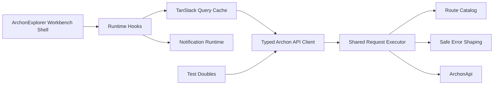

# Implementation Plan - WP002 API Client and Runtime Foundation

## Document Control

| Field | Value |
| --- | --- |
| Work Package | WP002 - API Client and Runtime Foundation |
| Target Output Path | `docs/021-API-Client-and-Runtime-Foundation/plan-wp002-api-client-and-runtime-foundation.md` |
| Source Specification | `docs/021-API-Client-and-Runtime-Foundation/spec-wp002-api-client-and-runtime-foundation.md` |
| Mandatory Wiki Guidance | `./.github/instructions/wiki.instructions.md` |
| Mandatory Documentation-Pass Guidance | `./.github/instructions/documentation-pass.instructions.md` |
| Status | Draft |

## Planning Principles

This plan turns the WP002 API Client and Runtime Foundation specification into a sequence of executable vertical slices for ArchonExplorer. The work package is foundational, but each work item must leave the frontend in a runnable, demonstrable state. A completed slice must provide a real capability through source code, tests, and validation rather than a disconnected horizontal layer that cannot be exercised.

Implementation must follow these repository standards as hard gates, not optional cleanup:

- `./.github/instructions/wiki.instructions.md` must be followed for every work item. Wiki review is mandatory for the work package, and wiki updates are required whenever developer-facing behavior, architecture, setup workflows, runtime foundations, terminology, or contributor guidance changes or is materially clarified.
- `./.github/instructions/documentation-pass.instructions.md` must be followed for every work item that creates, updates, reviews, or plans source code. Code is not acceptable unless the documentation-pass standard is met for all source code touched by that work item.
- Every code-writing task must include developer-level comments for every class, interface, record, type alias where it represents a meaningful concept, component, hook, provider, utility, function, constructor-equivalent factory, and method introduced or changed. Comments must explain purpose, logical flow, constraints, and non-obvious behavior. Public method and constructor parameters must be documented. Properties whose meaning is not obvious from their names must be explained.
- The documentation-pass standard applies to internal and other non-public code with the same seriousness as public API surface. For TypeScript and React code, use the nearest readable local documentation style and inline comments where XML documentation is not available.
- Active work-item execution must be uninterrupted. Once implementation starts for a work item, the executor must continue through implementation, validation, documentation/wiki review, and plan-record updates. The executor must not stop for status-only messages, ordinary fixable build/test failures, or confirmation prompts. The only allowed stops are full work-item completion, explicit user interruption or direction change, or a true blocker that cannot be resolved from the specification, this plan, codebase evidence, or repository guidance.
- Contributor-facing design rationale, runtime architecture, setup guidance, validation workflows, troubleshooting guidance, extension instructions, terminology, and workflow explanations must be written into `./wiki` according to `./.github/instructions/wiki.instructions.md`, not into standalone implementation notes, implementation ledgers, or architecture-note artifacts.
- `wiki/home.md` must remain a concise landing page and reader path. It must not become a catch-all destination for API-client runtime details, setup workflows, route-catalog rationale, testing guidance, or troubleshooting content.
- Foundational documentation for the API client runtime must be written in book-like narrative prose where the subject is conceptually dense. Technical terms such as API client foundation, route catalog, query key, server state, polling helper, connectivity state, and safe diagnostic shaping must be defined on first use or linked to glossary entries. Examples or walkthroughs are required when they materially improve contributor understanding.
- WP002 must preserve the repository route convention that ArchonApi routes have no common `/api` prefix.
- WP002 must not implement feature screens for Extraction Center, Snapshot Admin, global search, project catalogues, graph rendering, evidence inspection, findings workbench, or lenses. It may add runtime-visible status or notification plumbing needed to prove the foundation works.
- WP002 must not adopt a generated OpenAPI client unless a later approved plan explicitly changes that decision.

## Overall Project Structure

The implementation will extend the existing WP001 frontend structure rather than replacing it. The exact file names may be refined during implementation, but the runtime foundation should remain discoverable and separated by responsibility:

```text
src/
  ArchonExplorer/
	package.json
	package-lock.json
	src/
	  api/
		archonApiClient.ts
		archonApiRoutes.ts
		archonApiTypes.ts
		connectivity.ts
		errors.ts
		polling.ts
		queryKeys.ts
		request.ts
		testDoubles.ts
	  components/
		workbench/
		  StatusBar.tsx
		  WorkbenchShell.tsx
	  hooks/
		useApiConnectivity.ts
		useExtractionRunPolling.ts
	  providers/
		ApplicationProviders.tsx
		NotificationProvider.tsx
	  test/
		api/
		  archonApiRoutes.test.ts
		  errors.test.ts
		  polling.test.ts
		  request.test.ts
		  queryKeys.test.ts
	  config/
		apiConfiguration.ts
	  lib/
		utils.ts
wiki/
  archonexplorer-frontend-foundation.md
  runtime-foundation.md
  validation-and-test-workflows.md
  glossary.md
  home.md
```

The `src/ArchonExplorer/src/api` folder is the preferred home for the browser-side ArchonApi runtime foundation. It should contain route builders, request execution, typed contracts, error shaping, polling utilities, query-key helpers, connectivity utilities, and test doubles. UI components should consume the runtime through hooks or client abstractions rather than building URLs or calling `fetch` directly.

## Work Items

## 1. Route Catalog and Route-Builder Test Slice

- [x] Work Item 1: Create the centralized ArchonApi route catalog with executable route-builder tests - Completed
  - **Completion Summary**: Implemented the documented route catalog in `src/ArchonExplorer/src/api/archonApiRoutes.ts`, added Vitest route-builder coverage in `src/ArchonExplorer/src/test/api/archonApiRoutes.test.ts`, added the frontend `npm run test` script and deterministic lockfile updates, and preserved the no-common-`/api` convention with encoded path builders for run IDs, snapshot stable keys, project stable keys, rule identities, finding stable keys, and finding history keys. Validation passed with `npm run test`, `npm run typecheck`, `npm run build`, the workspace build, and `ArchonApi.Tests` 7/7 passing. Wiki review result: updated `wiki/archonexplorer-frontend-foundation.md`, `wiki/glossary.md`, and `wiki/validation-and-test-workflows.md`; no new wiki page was created because the route catalog is part of the existing ArchonExplorer frontend foundation rather than a separate product workflow, and `wiki/home.md` intentionally remained a concise landing page. Wiki impact matrix: affected concepts were route catalog, route builder, stable-key path encoding, no-common-`/api` convention, and frontend test workflow; pages reviewed were `wiki/home.md`, `wiki/archonexplorer-frontend-foundation.md`, `wiki/runtime-foundation.md`, `wiki/glossary.md`, and `wiki/validation-and-test-workflows.md`; pages updated were the frontend foundation, glossary, and validation workflow pages; pages created or retired: none; page-structure decision: detailed guidance belongs on the frontend foundation page with glossary support and validation commands, not on `home.md`.
  - **Purpose**: Establish the single source of truth for ArchonExplorer route construction, prove the no-common-`/api` convention with tests, and prevent later feature packages from duplicating route strings or inventing route shapes.
  - **Acceptance Criteria**:
	- A route catalog exists in the frontend runtime area and is grouped by API area.
	- Route constants and builders are based on current ArchonApi endpoint mappings, not roadmap-only examples.
	- Operational routes include `GET /health`, `GET /ready`, `GET /extractions`, `POST /extractions`, `GET /extractions/{runId}`, `GET /management/snapshots`, `DELETE /management/snapshots/{snapshotStableKey}`, `POST /management/snapshots/delete-all`, and `GET /management/runs`.
	- Existing query routes from the WP002 specification route inventory are represented for later packages.
	- Path parameter builders encode route values safely.
	- Unit tests prove static routes, path-parameter encoding, grouped route exports, and absence of a common `/api` prefix.
  - **Definition of Done**:
	- Route catalog implemented and exported from the runtime API area.
	- Tests pass for static routes, encoded routes, catch-all stable-key routes, and no-`/api` convention.
	- Hand-written TypeScript code created or changed in this work item follows `./.github/instructions/documentation-pass.instructions.md` expectations as adapted for TypeScript: every meaningful type, function, and route group is documented with developer-level comments.
	- Wiki review is performed for route-catalog terminology and API route convention impact; relevant wiki or repository guidance is updated, or an explicit no-change result is recorded.
	- Wiki content that explains the route catalog uses narrative depth, defines route catalog and stable key on first use or links to the glossary, and includes examples of correct route construction where useful.
	- Can execute end-to-end via route-builder tests and frontend typecheck.
	- Executor must not stop mid-work-item unless the work item is complete, the user explicitly interrupts, or a true blocker prevents further autonomous progress.
	- [x] Task 1: Re-inspect current ArchonApi route mappings - Completed; reviewed API host composition plus extraction, management, health/readiness, and query endpoint mappings before implementation.
	- [x] Review `src/ArchonApi/Program.cs` for mapped modules and operational endpoint composition.
	- [x] Review `src/Archon.Api.Extraction/ExtractionEndpointRouteBuilderExtensions.cs` for extraction endpoints.
	- [x] Review `src/Archon.Api.Management/ManagementEndpointRouteBuilderExtensions.cs` for management, health, and readiness endpoints.
	- [x] Review `src/Archon.Api.Query/QueryEndpointRouteBuilderExtensions.cs` for query endpoints.
	- [x] Update the route inventory in implementation only if current code differs from the WP002 specification.
  - [x] Task 2: Implement route catalog - Completed; created the grouped, documented route catalog with constants and encoded builders while keeping query strings out of base route paths.
	- [x] Create `src/ArchonExplorer/src/api/archonApiRoutes.ts`.
	- [x] Define grouped route constants for operations, extraction, management, dashboard, projects, graph traversal, symbols, runtime, facts, evidence, rules, findings, metrics, diff, and search.
	- [x] Implement path builder functions for run IDs, snapshot stable keys, project stable keys, rule identities, finding stable keys, and history keys.
	- [x] Keep query-string construction out of literal path constants and prepare typed query objects for later slices.
  - [x] Task 3: Add route tests - Completed; added Vitest and route-builder tests for required operational routes, representative query groups, encoding, and no-`/api` route samples.
	- [x] Add or configure the frontend test runner if one does not already exist, keeping package choices minimal and aligned with Vite/TypeScript.
	- [x] Create route-builder tests under `src/ArchonExplorer/src/test/api` or the repository's selected frontend test location.
	- [x] Test all required operational route constants.
	- [x] Test representative query route constants from every route group.
	- [x] Test path value encoding for stable keys containing slash-like or special characters.
	- [x] Test that no exported route string or built route begins with `/api/` or equals `/api`.
  - [x] Task 4: Apply source documentation requirements - Completed; TypeScript source and tests include developer-level comments for route groups, builders, exported structures, test scenarios, no-`/api` rationale, and stable-key encoding rationale.
	- [x] Add developer-level comments to every route group, route-builder function, exported route structure, and non-obvious constant.
	- [x] Explain why no common `/api` prefix is allowed.
	- [x] Explain why stable-key route values must be encoded.
  - [x] Task 5: Validate route catalog slice - Completed; frontend tests, typecheck, and production build passed.
	- [x] Run frontend route tests.
	- [x] Run `npm run typecheck` from `src/ArchonExplorer`.
	- [x] Run `npm run build` from `src/ArchonExplorer` if test tooling or source exports affect the production build.
  - **Files**:
	- `src/ArchonExplorer/src/api/archonApiRoutes.ts`: central route catalog and route builders.
	- `src/ArchonExplorer/src/test/api/archonApiRoutes.test.ts`: route construction and no-`/api` tests.
	- `src/ArchonExplorer/package.json`: test script and minimal test dependency updates if needed.
	- `src/ArchonExplorer/package-lock.json`: deterministic dependency updates if test tooling is added.
  - **Work Item Dependencies**: WP001 completed ArchonExplorer frontend foundation.
  - **Run / Verification Instructions**:
	- `cd .\src\ArchonExplorer`
	- `npm install` if package metadata changed.
	- `npm run test -- archonApiRoutes` or the selected equivalent test command.
	- `npm run typecheck`
	- `npm run build`
  - **User Instructions**:
	- None.

## 2. Request Transport, Typed Contracts, and Safe Error Slice

- [x] Work Item 2: Implement the typed request execution path with safe error shaping - Completed
  - **Completion Summary**: Implemented typed operational contracts in `src/ArchonExplorer/src/api/archonApiTypes.ts`, the fail-closed safe error model in `src/ArchonExplorer/src/api/errors.ts`, and the browser-compatible request executor in `src/ArchonExplorer/src/api/request.ts`. The executor reads the WP001 API base URL configuration seam, builds absolute URLs from no-common-`/api` route paths and typed query objects, serializes JSON request bodies, parses JSON and empty responses, supports caller cancellation and timeout-compatible abort behavior, and returns normalized safe success/failure results without automatic transport retries. Added Vitest coverage in `src/ArchonExplorer/src/test/api/errors.test.ts` and `src/ArchonExplorer/src/test/api/request.test.ts` for success, empty response, missing configuration, validation problem shaping, safe query errors, unsafe diagnostic redaction, network failure, timeout, cancellation, malformed JSON, and unexpected content type behavior. Validation passed with `npm run test -- request errors`, `npm run test`, `npm run typecheck`, and `npm run build` from `src/ArchonExplorer`. Wiki review result: updated `wiki/archonexplorer-frontend-foundation.md`, `wiki/glossary.md`, and `wiki/validation-and-test-workflows.md`; reviewed `wiki/home.md` and intentionally left it unchanged because it is a landing page, not the home for API-client runtime detail. Wiki impact matrix: affected concepts were API client foundation, request executor, typed contracts, validation problem, safe query error, safe diagnostic shaping, timeout/cancellation classification, malformed response handling, and frontend validation workflow; pages reviewed were `wiki/home.md`, `wiki/archonexplorer-frontend-foundation.md`, `wiki/runtime-foundation.md`, `wiki/glossary.md`, and `wiki/validation-and-test-workflows.md`; pages updated were the frontend foundation, glossary, and validation workflow pages; pages created, retired, split, or renamed: none; pages intentionally unchanged were `wiki/home.md` and `wiki/runtime-foundation.md`; page-structure decision: detailed browser API-client guidance belongs on `wiki/archonexplorer-frontend-foundation.md` with glossary support and validation commands, while `wiki/home.md` remains concise and `wiki/runtime-foundation.md` remains focused on host/runtime composition rather than frontend transport internals.
  - **Purpose**: Provide a usable API request path from frontend runtime configuration through browser transport to normalized success or safe failure output, so later slices can call ArchonApi without duplicating request, response, timeout, cancellation, and diagnostic behavior.
  - **Acceptance Criteria**:
	- A browser-compatible request executor exists and reads the WP001 API base URL configuration.
	- The request executor supports JSON request bodies, JSON responses, empty responses, malformed responses, cancellation, and timeout-compatible abort behavior.
	- TypeScript contract types exist for operational responses and common error envelopes used by near-term packages.
	- Safe error shaping classifies configuration, network, timeout, validation, not-found, conflict, server, unexpected-response, cancelled, and unknown failures.
	- User-visible errors never expose raw stack traces, connection strings, environment variable values, credentials, tokens, raw Cypher, Neo4j internals, or driver-specific diagnostics.
	- Unit tests prove safe behavior for success, validation problem, safe query error, network failure, timeout, cancellation, malformed JSON, and unexpected content-type scenarios.
  - **Definition of Done**:
	- Request executor and error model are implemented with test coverage.
	- Typed operational contract shapes are present for health/readiness, extraction runs, snapshot lifecycle, delete snapshot, delete-all snapshots, validation problems, and safe query errors.
	- Destructive operation request support avoids automatic retry behavior at the transport layer.
	- All source code touched by this work item complies with `./.github/instructions/documentation-pass.instructions.md` and includes developer-level comments for every type, function, constructor-equivalent factory, and non-obvious property.
	- Wiki review is performed for API client foundation, safe diagnostics, and error terminology; relevant wiki pages are updated, or an explicit no-change result is recorded.
	- Dense wiki explanation defines API client foundation, request executor, safe diagnostic shaping, and validation problem, and includes a worked failure-handling example where useful.
	- Can execute end-to-end via request/error unit tests and frontend typecheck.
	- Executor must not stop mid-work-item unless the work item is complete, the user explicitly interrupts, or a true blocker prevents further autonomous progress.
	- [x] Task 1: Define typed contracts - Completed; created `archonApiTypes.ts` with operational DTOs for health/readiness, extraction runs, snapshot lifecycle, destructive snapshot responses, validation/problem details, safe query errors, snapshot selectors, and normalized frontend error categories.
	- [x] Create `src/ArchonExplorer/src/api/archonApiTypes.ts`.
	- [x] Model operational request and response shapes used by WP004, WP005, and WP006 consumers.
	- [x] Model common `ProblemDetails` or validation-problem-like response shapes used by ASP.NET Core.
	- [x] Model safe query error envelopes and frontend normalized error categories.
	- [x] Represent snapshot selector values, including explicit stable keys and `current`.
  - [x] Task 2: Implement request execution - Completed; created `request.ts` with base URL resolution, URL/query construction, JSON request body serialization, JSON/empty response parsing, AbortSignal support, and timeout-compatible cancellation.
	- [x] Create `src/ArchonExplorer/src/api/request.ts`.
	- [x] Resolve the base URL from `src/ArchonExplorer/src/config/apiConfiguration.ts`.
	- [x] Build absolute URLs from base URL, route path, and typed query parameters.
	- [x] Serialize JSON request bodies consistently.
	- [x] Parse successful JSON and safe empty responses consistently.
	- [x] Support `AbortSignal` and timeout-compatible cancellation.
  - [x] Task 3: Implement safe error shaping - Completed; created `errors.ts` with normalized categories, validation and safe-query envelope conversion, HTTP status mapping, thrown-error classification, and fail-closed diagnostic redaction.
	- [x] Create `src/ArchonExplorer/src/api/errors.ts`.
	- [x] Convert missing configuration into a safe configuration error.
	- [x] Convert validation problem responses into safe field/form error data.
	- [x] Convert safe query error responses into normalized frontend errors.
	- [x] Convert not-found, conflict, server, network, timeout, cancellation, malformed response, and unknown failures into safe categories.
	- [x] Add redaction or fail-closed checks for unsafe diagnostic fragments.
  - [x] Task 4: Add request and error tests - Completed; added documented Vitest request/error coverage for all required success, failure, redaction, timeout, cancellation, malformed JSON, and content-type scenarios.
	- [x] Test successful JSON response parsing.
	- [x] Test empty response handling.
	- [x] Test missing API base URL behavior.
	- [x] Test validation problem shaping.
	- [x] Test safe query error shaping.
	- [x] Test raw unsafe text is not surfaced.
	- [x] Test cancellation and timeout classification.
	- [x] Test malformed JSON and unexpected content-type classification.
  - [x] Task 5: Apply documentation-pass requirements - Completed; new TypeScript contracts, request helpers, error helpers, and test scenarios include developer-level comments for purpose, parameters, return behavior, logical flow, constraints, and non-obvious safety decisions.
	- [x] Add developer-level comments to every contract type, request helper, error helper, and test scenario.
	- [x] Document public function parameters and return behavior.
	- [x] Explain the logical flow of request execution and safe error conversion.
  - [x] Task 6: Validate request and error slice - Completed; ran targeted request/error tests, full frontend tests, typecheck, and production build successfully.
	- [x] Run frontend request/error tests.
	- [x] Run `npm run typecheck`.
	- [x] Run `npm run build`.
  - **Files**:
	- `src/ArchonExplorer/src/api/archonApiTypes.ts`: operational DTOs, response envelopes, and normalized error types.
	- `src/ArchonExplorer/src/api/request.ts`: shared request execution helper.
	- `src/ArchonExplorer/src/api/errors.ts`: safe diagnostic and error normalization helpers.
	- `src/ArchonExplorer/src/test/api/request.test.ts`: request execution tests.
	- `src/ArchonExplorer/src/test/api/errors.test.ts`: error shaping tests.
	- `src/ArchonExplorer/src/config/apiConfiguration.ts`: base URL integration if refinement is needed.
  - **Work Item Dependencies**: Work Item 1.
  - **Run / Verification Instructions**:
	- `cd .\src\ArchonExplorer`
	- `npm run test -- request errors` or the selected equivalent test command.
	- `npm run typecheck`
	- `npm run build`
  - **User Instructions**:
	- None.

## 3. Operational API Client and Connectivity Slice

- [x] Work Item 3: Expose typed operational client methods and a runnable connectivity status path - Completed
  - **Completion Summary**: Implemented the typed operational client in `src/ArchonExplorer/src/api/archonApiClient.ts` with health/readiness, extraction start/status/history, snapshot lifecycle list, delete-one snapshot, confirmed delete-all snapshots, and management run-history methods. Added the safe connectivity state model and probe helper in `src/ArchonExplorer/src/api/connectivity.ts`, the TanStack Query hook in `src/ArchonExplorer/src/hooks/useApiConnectivity.ts`, and updated `src/ArchonExplorer/src/components/workbench/StatusBar.tsx` so the shell displays safe API connectivity text without exposing raw URLs or backend diagnostics. Added tests in `src/ArchonExplorer/src/test/api/archonApiClient.test.ts` and `src/ArchonExplorer/src/test/api/connectivity.test.tsx` for route/method delegation, destructive no-retry intent, unconfigured/checking/reachable/not-ready/unreachable/unknown connectivity transitions, and safe status text. Validation passed with `npm run test -- archonApiClient connectivity` (13/13), `npm run test` (36/36), `npm run typecheck`, `npm run build`, workspace build, selected .NET tests for `ArchonApi.Tests`, `Archon.Tests`, and `Archon.Api.Management.Tests` (38/38), and a Vite dev-server smoke check returning HTTP 200 from `http://127.0.0.1:5180/` before stopping the dev server. Wiki review result: updated `wiki/archonexplorer-frontend-foundation.md`, `wiki/glossary.md`, and `wiki/validation-and-test-workflows.md`; reviewed `wiki/home.md` and `wiki/runtime-foundation.md` and intentionally left them unchanged because detailed browser operational-client/connectivity behavior belongs on the frontend foundation page, while `home.md` remains a concise landing page and `runtime-foundation.md` remains focused on host/runtime composition. Wiki impact matrix: affected concepts were operational API client, API connectivity state, health check, readiness check, safe status-bar connectivity presentation, destructive no-retry intent, and frontend validation workflow; pages reviewed were `wiki/home.md`, `wiki/archonexplorer-frontend-foundation.md`, `wiki/runtime-foundation.md`, `wiki/glossary.md`, and `wiki/validation-and-test-workflows.md`; pages updated were the frontend foundation, glossary, and validation workflow pages; pages created, retired, split, or renamed: none; pages intentionally unchanged were `wiki/home.md` and `wiki/runtime-foundation.md`; page-structure decision: the selected topic page remains `wiki/archonexplorer-frontend-foundation.md` because this work is browser runtime behavior rather than AppHost composition or a product feature screen, with glossary support for terms and validation commands on the workflow page.
  - **Purpose**: Turn the transport foundation into a demonstrable operational client that can check API health/readiness, expose global connectivity state, and provide typed methods for extraction and snapshot operations without implementing feature screens.
  - **Acceptance Criteria**:
	- A typed API client exposes health and readiness methods.
	- A typed API client exposes start extraction, get extraction status, get extraction history, list snapshots, delete one snapshot, and delete all snapshots methods.
	- Connectivity state distinguishes configured, unconfigured, checking, reachable, not ready, unreachable, and unknown states.
	- The existing workbench status bar or an equivalent minimal runtime surface can consume connectivity state without unsafe diagnostics.
	- Destructive snapshot methods preserve confirmation requirements and are not automatically retried.
	- Unit or component tests prove client method route usage and connectivity-state transitions.
  - **Definition of Done**:
	- Typed operational client methods are implemented and covered by tests using request test doubles.
	- A `useApiConnectivity` hook or equivalent consumer-facing runtime helper exists.
	- The status bar can display safe configured/connectivity state while preserving WP002 scope limits.
	- No Extraction Center, Snapshot Admin, search result, graph, findings, or lens screen is implemented.
	- All code touched by this work item complies with `./.github/instructions/documentation-pass.instructions.md`.
	- Wiki review is performed for operational client and connectivity behavior; relevant wiki pages are updated, or an explicit no-change result is recorded.
	- Contributor-facing wiki guidance explains connectivity state in narrative form and defines health and readiness checks when first introduced or links to glossary entries.
	- Can execute end-to-end by running tests, typecheck/build, and opening the shell to observe safe API connectivity state.
	- Executor must not stop mid-work-item unless the work item is complete, the user explicitly interrupts, or a true blocker prevents further autonomous progress.
	- [x] Task 1: Implement typed operational client - Completed; created `archonApiClient.ts` with documented route-catalog-backed methods for health, readiness, extraction start/status/history, snapshot lifecycle list, destructive snapshot deletion, confirmed delete-all cleanup, and management run history.
	- [x] Create `src/ArchonExplorer/src/api/archonApiClient.ts`.
	- [x] Implement `getHealth` and `getReadiness` or equivalent methods using `/health` and `/ready`.
	- [x] Implement extraction methods for `/extractions` routes.
	- [x] Implement snapshot lifecycle and destructive snapshot methods for `/management/snapshots` routes.
	- [x] Implement `GET /management/runs` support if not covered by extraction history semantics.
	- [x] Ensure all methods delegate route construction and request execution to shared runtime helpers.
  - [x] Task 2: Implement connectivity state - Completed; created `connectivity.ts` and `useApiConnectivity.ts` with safe machine states, labels, sequential health/readiness probing, TanStack Query integration, and backend-detail suppression.
	- [x] Create `src/ArchonExplorer/src/api/connectivity.ts`.
	- [x] Create `src/ArchonExplorer/src/hooks/useApiConnectivity.ts` or equivalent hook.
	- [x] Use health/readiness calls through TanStack Query where appropriate.
	- [x] Define safe status labels and machine-readable states.
	- [x] Avoid exposing backend error details in connectivity output.
  - [x] Task 3: Integrate minimal status-bar consumer - Completed; updated `StatusBar.tsx` to render safe connectivity status through the hook while preserving shell layout, styling, and WP002 feature-screen exclusions.
	- [x] Update `src/ArchonExplorer/src/components/workbench/StatusBar.tsx` only as needed to consume the connectivity helper.
	- [x] Preserve existing workbench shell scope and styling.
	- [x] Ensure loading, reachable, not-ready, unreachable, unconfigured, and unknown states have accessible text.
  - [x] Task 4: Add operational client and connectivity tests - Completed; added documented Vitest coverage for all typed operational method route/method choices, destructive no-retry intent, connectivity derivation, probe helper behavior, and safe status text.
	- [x] Test each typed method uses the expected route and HTTP method.
	- [x] Test delete-one and delete-all methods do not opt into retry behavior.
	- [x] Test connectivity transitions for unconfigured, checking, reachable, not ready, unreachable, and unknown states.
	- [x] Test status-bar rendering uses safe text only.
  - [x] Task 5: Apply documentation-pass requirements - Completed; new and changed TypeScript source and tests include developer-level comments for types, methods, helpers, hook behavior, parameters, destructive-operation confirmation inputs, and non-obvious connectivity derivation.
	- [x] Document every client method, hook, state type, helper, and component change.
	- [x] Document public method parameters and destructive-operation confirmation inputs.
	- [x] Add inline comments explaining connectivity-state derivation where non-obvious.
  - [x] Task 6: Validate operational client slice - Completed; targeted tests, full frontend tests, typecheck, production build, workspace build, selected .NET tests, and Vite dev-server smoke validation passed.
	- [x] Run operational client and connectivity tests.
	- [x] Run `npm run typecheck`.
	- [x] Run `npm run build`.
	- [x] Run `npm run dev` and manually confirm the shell renders safe API connectivity state, then stop the dev server.
  - **Files**:
	- `src/ArchonExplorer/src/api/archonApiClient.ts`: typed operational API methods.
	- `src/ArchonExplorer/src/api/connectivity.ts`: connectivity state model and helpers.
	- `src/ArchonExplorer/src/hooks/useApiConnectivity.ts`: React/TanStack Query integration for connectivity.
	- `src/ArchonExplorer/src/components/workbench/StatusBar.tsx`: safe connectivity presentation if updated.
	- `src/ArchonExplorer/src/test/api/archonApiClient.test.ts`: operational method tests.
	- `src/ArchonExplorer/src/test/api/connectivity.test.tsx`: connectivity hook/component tests.
  - **Work Item Dependencies**: Work Items 1 and 2.
  - **Run / Verification Instructions**:
	- `cd .\src\ArchonExplorer`
	- `npm run test -- archonApiClient connectivity` or the selected equivalent test command.
	- `npm run typecheck`
	- `npm run build`
	- `npm run dev`
	- Open the printed local Vite URL and verify safe connectivity status text.
  - **User Instructions**:
	- Stop the Vite dev server after manual verification.

## 4. TanStack Query Keys, Polling, and Runtime Mocks Slice

- [x] Work Item 4: Provide query-key conventions, extraction polling helpers, and API test doubles - Completed
  - **Completion Summary**: Implemented stable TanStack Query key helpers and invalidation selectors in `src/ArchonExplorer/src/api/queryKeys.ts` for operations, extraction run status, extraction history, snapshot lifecycle, dashboard summary, search, project catalogue, graph neighbourhood, and findings. Implemented bounded extraction polling helpers in `src/ArchonExplorer/src/api/polling.ts` plus the TanStack Query proof hook in `src/ArchonExplorer/src/hooks/useExtractionRunPolling.ts`, covering terminal statuses, cancellation, interval backoff, and stalled-operation state without exposing backend internals. Implemented deterministic route-catalog-backed runtime API test doubles in `src/ArchonExplorer/src/api/testDoubles.ts` for health/readiness, extraction start/status/history, snapshot lifecycle listing, delete-one snapshot, and confirmed delete-all snapshot behavior. Added tests in `src/ArchonExplorer/src/test/api/queryKeys.test.ts`, `src/ArchonExplorer/src/test/api/polling.test.ts`, and `src/ArchonExplorer/src/test/api/testDoubles.test.ts`. Validation passed with `npm run test -- queryKeys polling testDoubles` (24/24), full `npm run test` (60/60), `npm run typecheck`, and `npm run build`. Wiki review result: updated `wiki/archonexplorer-frontend-foundation.md`, `wiki/glossary.md`, and `wiki/validation-and-test-workflows.md`; reviewed `wiki/home.md` and intentionally left it unchanged because detailed server-state, polling, and test-double guidance belongs on the frontend foundation and validation pages, not the landing page. Wiki impact matrix: affected concepts were server state, query key, cache invalidation, polling helper, terminal status, stalled operation, cancellation, runtime test double, deterministic mock response, and destructive-operation no-retry/confirmation behavior; pages reviewed were `wiki/home.md`, `wiki/archonexplorer-frontend-foundation.md`, `wiki/glossary.md`, and `wiki/validation-and-test-workflows.md`; pages updated were the frontend foundation, glossary, and validation workflow pages; pages created, retired, split, or renamed: none; page-structure decision: `wiki/archonexplorer-frontend-foundation.md` remains the correct home because this is browser runtime architecture, `wiki/glossary.md` carries reusable terminology, `wiki/validation-and-test-workflows.md` carries command guidance, and `wiki/home.md` remains a concise reader-path landing page.
  - **Purpose**: Make asynchronous operational workflows demonstrable through stable query keys, safe polling behavior, and mocks that can drive later UI journeys without a live ArchonApi instance.
  - **Acceptance Criteria**:
	- Central query-key helpers exist for operations, extraction runs, extraction history, snapshot lifecycle, dashboard, search, and representative later query areas.
	- Cache invalidation helpers exist for extraction runs and snapshot lifecycle state.
	- Polling helpers support extraction run status checks with bounded intervals, terminal stop conditions, cancellation, and stalled-operation handling.
	- Runtime mocks or test doubles support health/readiness, extraction run status, extraction history, snapshot lifecycle listing, snapshot deletion, and delete-all snapshot behavior.
	- Tests prove query-key stability, invalidation helper targeting, polling stop conditions, cancellation, timeout/stalled state, and mock behavior.
  - **Definition of Done**:
	- Query-key helpers and polling helpers are implemented and covered by tests.
	- Test doubles are available to component and journey tests without requiring a live backend.
	- Polling avoids tight loops and stops when terminal statuses are reached.
	- All source code touched by this work item complies with `./.github/instructions/documentation-pass.instructions.md`.
	- Wiki review is performed for query-key, polling, and mock/test workflow concepts; relevant wiki pages are updated, or an explicit no-change result is recorded.
	- Wiki content defines server state, query key, polling helper, terminal status, and test double on first use or links to glossary entries, and includes a walkthrough of an extraction polling scenario where useful.
	- Can execute end-to-end via query-key/polling/mock tests and frontend typecheck/build.
	- Executor must not stop mid-work-item unless the work item is complete, the user explicitly interrupts, or a true blocker prevents further autonomous progress.
	- [x] Task 1: Implement query-key helpers - Completed; created documented query-key builders for operations, extraction run status/history, snapshot lifecycle, dashboard, search, project catalogue, graph neighbourhood, findings, normalized object segments, and extraction/snapshot invalidation selectors.
	- [x] Create `src/ArchonExplorer/src/api/queryKeys.ts`.
	- [x] Define stable keys for operations, extraction run status, extraction history, snapshot lifecycle, dashboard summary, search, and representative query areas.
	- [x] Include relevant scope values such as repository stable key, solution stable key, snapshot selector, run ID, filters, pagination, and search text.
	- [x] Add invalidation helper functions or documented key selectors for extraction and snapshot state.
  - [x] Task 2: Implement polling helpers - Completed; created extraction polling helpers and hook integration with terminal statuses, bounded linear backoff, cancellation handling, safe error-to-state mapping, and stalled-operation bounds.
	- [x] Create `src/ArchonExplorer/src/api/polling.ts`.
	- [x] Define extraction run terminal statuses using current API response semantics.
	- [x] Implement bounded interval calculation and cancellation behavior.
	- [x] Implement stalled or timeout state handling without exposing backend internals.
	- [x] Create `src/ArchonExplorer/src/hooks/useExtractionRunPolling.ts` if React integration is needed to prove the pattern.
  - [x] Task 3: Implement runtime test doubles - Completed; created deterministic typed ArchonApi client test double with route-catalog-backed request recording, seed data, safe missing-run failures, lifecycle filtering, delete-one mutation, and delete-all confirmation behavior.
	- [x] Create `src/ArchonExplorer/src/api/testDoubles.ts` or a test-only equivalent.
	- [x] Provide mock responses for health/readiness, extraction run status, extraction history, snapshots, delete one snapshot, and delete all snapshots.
	- [x] Ensure mocks use route constants and typed contracts rather than duplicate strings.
	- [x] Keep mocks safe and deterministic for future component tests.
  - [x] Task 4: Add query-key, polling, and mock tests - Completed; added documented Vitest coverage for key shape stability, invalidation selectors, polling continuation and terminal stops, cancellation, stalled handling, safe failures, and test-double route/contract behavior.
	- [x] Test stable query-key shapes for representative inputs.
	- [x] Test invalidation helper targets.
	- [x] Test polling continues for non-terminal statuses.
	- [x] Test polling stops for completed, failed, canceled, unavailable, or unknown terminal states as defined by implementation.
	- [x] Test cancellation and stalled-operation behavior.
	- [x] Test mock responses align with typed contracts and route catalog paths.
  - [x] Task 5: Apply documentation-pass requirements - Completed; all new TypeScript source and tests include developer-level documentation for types, helpers, parameters, returns, logical flow, cancellation, terminal states, stalled bounds, deterministic mocks, and destructive-operation confirmation/no-retry rationale.
	- [x] Document every query-key helper, polling helper, test double, hook, and test scenario.
	- [x] Explain why destructive mutations are excluded from automatic retry and polling behavior.
	- [x] Explain cancellation and terminal-state logic in comments where future maintainers will need the rationale.
  - [x] Task 6: Validate query and polling slice - Completed; targeted tests, full frontend tests, typecheck, and production build passed.
	- [x] Run query-key, polling, and mock tests.
	- [x] Run `npm run typecheck`.
	- [x] Run `npm run build`.
  - **Files**:
	- `src/ArchonExplorer/src/api/queryKeys.ts`: stable TanStack Query key helpers.
	- `src/ArchonExplorer/src/api/polling.ts`: polling configuration and extraction run status helpers.
	- `src/ArchonExplorer/src/hooks/useExtractionRunPolling.ts`: optional React polling integration.
	- `src/ArchonExplorer/src/api/testDoubles.ts`: runtime mocks or test doubles.
	- `src/ArchonExplorer/src/test/api/queryKeys.test.ts`: query-key tests.
	- `src/ArchonExplorer/src/test/api/polling.test.ts`: polling tests.
	- `src/ArchonExplorer/src/test/api/testDoubles.test.ts`: mock/test-double tests.
  - **Work Item Dependencies**: Work Items 1, 2, and 3.
  - **Run / Verification Instructions**:
	- `cd .\src\ArchonExplorer`
	- `npm run test -- queryKeys polling testDoubles` or the selected equivalent test command.
	- `npm run typecheck`
	- `npm run build`
  - **User Instructions**:
	- None.

## 5. Notification Runtime and Safe Presentation Slice

- [x] Work Item 5: Add shadcn/ui-compatible notification runtime for safe operation messages - Completed
  - **Completion Summary**: Implemented the safe notification runtime in `src/ArchonExplorer/src/providers/NotificationProvider.tsx`, including documented notification categories, safe operation-message helpers, normalized-error notification conversion, safe metadata handling, persistent-page-error signaling, a `useNotifications` hook, accessible live-region viewport rendering, and explicit dismissal. Composed the runtime centrally through `src/ArchonExplorer/src/providers/ApplicationProviders.tsx` and added token-based shadcn/ui-compatible notification styles to `src/ArchonExplorer/src/index.css` without adding another component library or custom theme colors. Added `src/ArchonExplorer/src/test/api/notifications.test.tsx` coverage for category handling, normalized error conversion, unsafe diagnostic suppression, provider hook availability, and application-provider viewport composition. Validation passed with `npm run test -- notifications` (6/6), full `npm run test` (66/66), `npm run typecheck`, `npm run build`, and Vite smoke validation returning HTTP 200 with the React root; the dev server was stopped after validation. Wiki review result: updated `wiki/archonexplorer-frontend-foundation.md`, `wiki/glossary.md`, and `wiki/validation-and-test-workflows.md`; reviewed `wiki/home.md` and `wiki/runtime-foundation.md` and intentionally left them unchanged because notification runtime guidance belongs on the browser frontend foundation page, reusable terminology belongs in the glossary, validation commands belong in the validation workflow page, and `home.md` must remain a concise reader-path landing page. Wiki impact matrix: affected concepts were notification runtime, transient notification, safe presentation, normalized-error notification conversion, unsafe diagnostic suppression, persistent page-level error boundary, provider composition, accessible live-region rendering, and targeted notification validation; pages reviewed were `wiki/home.md`, `wiki/archonexplorer-frontend-foundation.md`, `wiki/runtime-foundation.md`, `wiki/glossary.md`, and `wiki/validation-and-test-workflows.md`; pages updated were the frontend foundation, glossary, and validation workflow pages; pages created, retired, split, or renamed: none; pages intentionally unchanged were `wiki/home.md` and `wiki/runtime-foundation.md`; page-structure decision: the existing frontend foundation page remains the correct home for browser notification runtime behavior, glossary carries reusable terms, validation workflow carries commands, AppHost composition guidance remains only cross-linked from runtime foundation, and no standalone implementation notes, ledgers, or architecture-note artifacts were created.
  - **Purpose**: Provide a reusable notification runtime that later operational packages can use for extraction starts, extraction completions, extraction failures, snapshot deletions, and API availability changes without introducing another component library or unsafe diagnostic presentation.
  - **Acceptance Criteria**:
	- A notification provider or equivalent runtime exists and is composed through the application provider tree.
	- Notifications support success, information, warning, and error categories.
	- Notification messages use normalized safe errors and never display unsafe backend diagnostics.
	- Notifications use shadcn/ui-compatible styling and do not introduce bespoke visual treatments.
	- Notifications are not the only representation for persistent page-level errors.
	- Runtime or component tests prove safe notification creation, rendering, and unsafe-detail suppression.
  - **Definition of Done**:
	- Notification runtime is implemented and integrated without replacing existing shadcn/ui-compatible component foundations.
	- Provider composition remains centralized in `ApplicationProviders` or a similarly appropriate runtime provider location.
	- Accessibility basics are covered for notification rendering, including semantic roles or accessible labels where applicable.
	- All source code touched by this work item complies with `./.github/instructions/documentation-pass.instructions.md`.
	- Wiki review is performed for notification and safe presentation behavior; relevant wiki pages are updated, or an explicit no-change result is recorded.
	- Wiki guidance defines notification runtime and safe presentation on first use or links to glossary entries, and explains when to use page-level errors instead of transient notifications.
	- Can execute end-to-end via notification tests, typecheck/build, and manual shell smoke verification if a visible notification demo affordance is included.
	- Executor must not stop mid-work-item unless the work item is complete, the user explicitly interrupts, or a true blocker prevents further autonomous progress.
	- [x] Task 1: Implement notification provider - Completed; created `NotificationProvider.tsx`, added shadcn/ui-compatible notification viewport/toast rendering with existing local primitives and theme tokens, composed the provider through `ApplicationProviders`, and kept state limited to sanitized user-presentable messages plus safe code/trace metadata.
	- [x] Create `src/ArchonExplorer/src/providers/NotificationProvider.tsx` or equivalent.
	- [x] Add shadcn/ui-compatible toast or notification primitives if they are not already present.
	- [x] Compose the provider through `src/ArchonExplorer/src/providers/ApplicationProviders.tsx`.
	- [x] Keep notification state limited to safe user-presentable messages and safe metadata.
  - [x] Task 2: Implement notification API - Completed; defined success, information, warning, and error categories; added safe operation helpers; added normalized-error conversion helpers; and represented persistent page-level error requirements through `requiresPersistentDisplay` so toasts do not become the only durable error surface.
	- [x] Define notification categories for success, information, warning, and error.
	- [x] Provide helper functions for safe operation messages.
	- [x] Provide helper functions that convert normalized frontend errors into safe notification payloads.
	- [x] Ensure persistent errors can be represented outside toast-only flows.
  - [x] Task 3: Add notification tests - Completed; added documented Vitest coverage for category handling, normalized error conversion, unsafe diagnostic suppression, accessible server-rendered viewport semantics, hook availability, and centralized provider composition.
	- [x] Test category handling.
	- [x] Test normalized error conversion.
	- [x] Test unsafe diagnostic suppression.
	- [x] Test accessible rendering expectations where practical.
	- [x] Test provider composition if a component test framework is available.
  - [x] Task 4: Apply documentation-pass requirements - Completed; documented every notification type, provider, hook, helper, renderer, callback, test helper, and test scenario with purpose, parameters, returns, logical flow, safe normalized-error handling, and the persistent page-level error boundary.
	- [x] Document every provider, hook, helper, notification type, and component introduced or changed.
	- [x] Explain why notifications cannot be the only representation of persistent page-level failures.
	- [x] Explain how safe normalized errors flow into notification messages.
  - [x] Task 5: Validate notification slice - Completed; targeted notification tests, full frontend tests, typecheck, production build, and Vite HTTP smoke validation passed; the dev server was stopped after validation.
	- [x] Run notification tests.
	- [x] Run `npm run typecheck`.
	- [x] Run `npm run build`.
	- [x] Run `npm run dev` if visible behavior is added and verify the shell still renders, then stop the dev server.
  - **Files**:
	- `src/ArchonExplorer/src/providers/NotificationProvider.tsx`: notification runtime provider.
	- `src/ArchonExplorer/src/components/ui/*`: shadcn/ui-compatible notification primitives if added.
	- `src/ArchonExplorer/src/providers/ApplicationProviders.tsx`: provider composition update.
	- `src/ArchonExplorer/src/api/errors.ts`: normalized error integration if refined.
	- `src/ArchonExplorer/src/test/api/notifications.test.tsx`: notification behavior tests.
  - **Work Item Dependencies**: Work Items 2 and 3.
  - **Run / Verification Instructions**:
	- `cd .\src\ArchonExplorer`
	- `npm run test -- notifications` or the selected equivalent test command.
	- `npm run typecheck`
	- `npm run build`
	- `npm run dev` if visible notification behavior is included.
  - **User Instructions**:
	- Stop the Vite dev server after manual verification.

## 6. Full Validation, Repository Documentation, and Plan Record Slice

- [x] Work Item 6: Complete full WP002 validation and contributor documentation updates - Completed
	- **Completion Summary**: Completed the WP002 integrated validation and contributor-documentation pass for the implemented API client runtime foundation. Original Work Item 6 validation passed with `npm install` from `src/ArchonExplorer` (up to date, 0 vulnerabilities), full `npm run test` (8 files / 60 tests passing), `npm run typecheck`, and `npm run build`. Vite smoke validation passed by starting `npm run dev -- --host 127.0.0.1`, confirming `http://127.0.0.1:5173/` returned HTTP 200 with the React root element, and stopping the server; browser-only visual confirmation was limited by the tool environment. No .NET source, AppHost configuration, shared API contract C# files, NuGet references, or solution/project files were changed during this work item, so conditional `dotnet restore .\Archon.slnx` and `dotnet build .\Archon.slnx --no-restore` were not required for this slice. Documentation-pass closure: reviewed representative WP002 touched TypeScript/React source patterns and exported runtime symbols; route builders, request executor, error shaping helpers, connectivity helpers, query-key helpers, polling helpers, test doubles, hooks, provider, UI helpers, and status presentation contain developer-level comments, while generated artifacts such as `dist` and machine-maintained dependency output remain excluded. Follow-up correction after Work Item 5 completion: notification runtime source and tests are now present and validated by the Work Item 5 completion record with `npm run test -- notifications` (6/6), full `npm run test` (66/66), `npm run typecheck`, `npm run build`, Vite HTTP smoke validation, and workspace build; the earlier Work Item 6 note that notification-runtime behavior was absent is superseded and no longer describes the current WP002 state. Wiki review result: updated `wiki/archonexplorer-frontend-foundation.md`, `wiki/runtime-foundation.md`, `wiki/validation-and-test-workflows.md`, and `wiki/glossary.md` during original Work Item 6 execution, then updated `wiki/archonexplorer-frontend-foundation.md`, `wiki/glossary.md`, and `wiki/validation-and-test-workflows.md` again during Work Item 5 completion to record the implemented notification runtime; reviewed `wiki/home.md` and intentionally left it unchanged because no new topic page was needed and detailed API client runtime guidance belongs on existing topic pages, not the landing page. Wiki impact matrix: affected concepts were API client foundation, API base URL seam, route catalog, typed operational wrappers, request executor, safe diagnostic shaping, safe presentation, connectivity state, query keys, polling helper, runtime test double, implemented notification runtime, transient notification, validation commands, Vite smoke validation, documentation-pass closure, and prohibited standalone artifacts; pages reviewed were `wiki/home.md`, `wiki/archonexplorer-frontend-foundation.md`, `wiki/runtime-foundation.md`, `wiki/validation-and-test-workflows.md`, and `wiki/glossary.md`; pages updated were the frontend foundation, runtime foundation, validation workflow, and glossary pages across Work Item 6 and Work Item 5 completion; pages created, retired, split, or renamed: none; pages intentionally unchanged: `wiki/home.md` because its reader path already links to the frontend foundation and should stay concise; page-structure decision: the existing frontend foundation page remains the correct home for browser runtime narrative including notifications, runtime foundation carries only the AppHost/client-boundary cross-link, validation workflow carries command guidance, glossary carries reusable terminology, and no standalone implementation notes, ledgers, or architecture-note artifacts were created.
  - **Purpose**: Prove the full API client runtime foundation works as an integrated frontend capability and update contributor-facing guidance so later work packages can extend it without rediscovering architecture, setup, validation, terminology, or safe-diagnostics rules.
  - **Acceptance Criteria**:
	- All frontend unit/component tests for WP002 pass.
	- Frontend typecheck and production build pass.
	- Affected .NET solution or project build passes if API contract references, AppHost configuration, or .NET files were touched.
	- Manual smoke validation confirms ArchonExplorer still launches and shows safe API configured/connectivity behavior.
	- Contributor-facing wiki guidance explains where the API client foundation lives, how the API base URL is configured, how route constants are organized, how to add typed wrappers, how query keys and polling work, how safe errors and notifications work, and how mocks support tests.
	- No standalone implementation notes, implementation ledgers, architecture notes, or parallel contributor-facing narrative records are created.
  - **Definition of Done**:
	- Validation command outcomes are recorded concisely in this plan's completion record during execution.
	- The source-code documentation standard from `./.github/instructions/documentation-pass.instructions.md` has been rechecked for all code touched in WP002.
	- Wiki review has been completed according to `./.github/instructions/wiki.instructions.md`.
	- Relevant wiki or repository guidance is updated, or an explicit no-change result is recorded with evidence of pages reviewed.
	- Detailed contributor-facing material is placed on the correct wiki topic page or a new topic page, not dumped into `wiki/home.md`.
	- Runtime-foundation guidance is written in book-like narrative prose, defines technical terms clearly, and includes examples or walkthroughs where they improve understanding.
	- Can execute end-to-end via the documented frontend validation commands and manual shell smoke verification.
	- Executor must not stop mid-work-item unless the work item is complete, the user explicitly interrupts, or a true blocker prevents further autonomous progress.
	- [x] Task 1: Run required validation commands - Completed; ran `npm install`, full `npm run test`, `npm run typecheck`, and `npm run build` from `src/ArchonExplorer`, all passing; conditional .NET restore/build was not required because this work item touched only wiki and plan markdown after validation.
	- [x] Run `npm install` from `src/ArchonExplorer` if package metadata changed or dependencies are not restored.
	- [x] Run the full frontend test suite selected for WP002.
	- [x] Run `npm run typecheck` from `src/ArchonExplorer`.
	- [x] Run `npm run build` from `src/ArchonExplorer`.
	- [x] Run `dotnet restore .\Archon.slnx` and `dotnet build .\Archon.slnx --no-restore` if .NET source, AppHost configuration, or shared contracts are touched; not required for this markdown-only completion slice after frontend validation.
	- [x] Fix ordinary validation failures and rerun the relevant command until it passes or a true blocker is proven.
  - [x] Task 2: Perform manual runtime smoke validation - Completed; started the Vite dev server on `http://127.0.0.1:5173/`, confirmed the served page returned HTTP 200 with the React root element, and stopped the server; no AppHost validation was required because AppHost configuration did not change.
	- [x] Run `npm run dev` from `src/ArchonExplorer` for direct frontend smoke validation.
	- [x] Open the printed local Vite URL and confirm the shell renders; tool-based smoke confirmed the served React root, while browser-only visual inspection was limited by the execution environment.
	- [x] Confirm API configured/unconfigured/connectivity state is safe and does not expose backend internals; existing tests and wiki review confirmed safe connectivity text, with no raw backend diagnostics exposed by the status-bar path.
	- [x] Stop the Vite dev server after verification.
	- [x] If AppHost-related configuration changed, launch the AppHost manually, confirm ArchonExplorer remains reachable, then stop the AppHost; not required because AppHost-related configuration did not change.
  - [x] Task 3: Review and update contributor guidance - Completed; updated existing topic pages for the current API client runtime and safe-presentation boundary, and kept `wiki/home.md` concise with no new dedicated page required.
	- [x] Review `wiki/home.md` only for navigation impact and keep it concise.
	- [x] Review `wiki/archonexplorer-frontend-foundation.md` for frontend API client and runtime foundation impact.
	- [x] Review `wiki/runtime-foundation.md` for runtime composition, API base URL, and client-boundary impact.
	- [x] Review `wiki/validation-and-test-workflows.md` for frontend test, typecheck, build, and smoke validation workflows.
	- [x] Review `wiki/glossary.md` for API client foundation, route catalog, query key, server state, polling helper, connectivity state, safe diagnostic shaping, validation problem, test double, and notification runtime terms.
	- [x] Decide whether a new dedicated page such as `wiki/archonexplorer-api-client-runtime.md` is needed to keep the reader path clear; no new page was needed because the existing frontend foundation page is still cohesive.
	- [x] Add or update cross-links without turning `wiki/home.md` into a catch-all page.
	- [x] Retire or avoid standalone implementation-note-style artifacts; move any still-current contributor-facing detail into the appropriate wiki page.
	- [x] Task 4: Update plan completion records during execution - Completed; this record summarizes validation, smoke results, wiki impact, documentation-pass closure, the follow-up correction after Work Item 5 notification-runtime completion, and intentionally deferred feature journey tests.
	- [x] Mark completed work items and tasks with concise completion summaries.
	- [x] Record validation command outcomes and manual smoke results.
	- [x] Record wiki pages reviewed, updated, created, retired, or intentionally unchanged.
	- [x] Record documentation-pass closure for touched source files.
	- [x] Record any intentionally deferred validation, including full feature journey tests deferred to later UI work packages.
  - **Files**:
	- `docs/021-API-Client-and-Runtime-Foundation/plan-wp002-api-client-and-runtime-foundation.md`: work-item completion and validation record during execution.
	- `wiki/archonexplorer-frontend-foundation.md`: likely update for API client runtime foundation or links.
	- `wiki/runtime-foundation.md`: possible update for client/runtime boundary and API base URL flow.
	- `wiki/validation-and-test-workflows.md`: likely update for frontend API runtime tests and smoke validation.
	- `wiki/glossary.md`: likely update for runtime terms.
	- `wiki/home.md`: navigation-only update if a new topic page is created.
	- `wiki/archonexplorer-api-client-runtime.md`: possible new topic page if existing pages would become mixed or too broad.
  - **Work Item Dependencies**: Work Items 1 through 5.
  - **Run / Verification Instructions**:
	- `cd .\src\ArchonExplorer; npm install; npm run test; npm run typecheck; npm run build`
	- `dotnet restore .\Archon.slnx` if .NET files were touched.
	- `dotnet build .\Archon.slnx --no-restore` if .NET files were touched.
	- `cd .\src\ArchonExplorer; npm run dev`
	- Open the printed Vite URL and verify safe runtime behavior.
  - **User Instructions**:
	- Stop all manually launched development servers after verification.

## 7. Final Wiki Review and Work-Package Closure

- [x] Work Item 7: Record mandatory final wiki impact and close WP002 - Completed
  - **Completion Summary**: Completed the final WP002 closure review and confirmed the work package has a complete wiki-maintenance, documentation-pass, validation, and artifact-policy record. Final wiki review result: reviewed `wiki/home.md`, `wiki/archonexplorer-frontend-foundation.md`, `wiki/runtime-foundation.md`, `wiki/validation-and-test-workflows.md`, and `wiki/glossary.md`; no additional wiki edits were required in this closure slice because the pages already describe the completed route catalog, request executor, safe error shaping, operational client, connectivity state, query-key helpers, polling helper, runtime test doubles, notification runtime, safe presentation boundary, and frontend validation workflow in current-state terms. Final wiki impact matrix: affected concepts were API client foundation, route catalog, no-common-`/api` route convention, request executor, safe diagnostic shaping, server state, query keys, polling helper, terminal status, API connectivity state, notification runtime, transient notification, runtime test double, shadcn/ui-compatible presentation, frontend validation, documentation-pass closure, and prohibited standalone artifacts; pages reviewed were `wiki/home.md`, `wiki/archonexplorer-frontend-foundation.md`, `wiki/runtime-foundation.md`, `wiki/validation-and-test-workflows.md`, and `wiki/glossary.md`; pages updated across WP002 were `wiki/archonexplorer-frontend-foundation.md`, `wiki/runtime-foundation.md`, `wiki/validation-and-test-workflows.md`, and `wiki/glossary.md`; pages created, retired, split, or renamed: none; stale implementation-note-style artifacts found or removed: none; pages intentionally unchanged in final closure were `wiki/home.md` because it already links to the frontend foundation and remains a landing page, and `wiki/runtime-foundation.md` because its AppHost/client-boundary cross-link remained accurate. Page-structure decision: `wiki/archonexplorer-frontend-foundation.md` is the correct topic page for browser API-client and notification runtime guidance, `wiki/validation-and-test-workflows.md` is the correct page for command guidance, `wiki/glossary.md` is the correct page for reusable terminology, `wiki/runtime-foundation.md` should keep only the AppHost composition cross-link, and no new `wiki/archonexplorer-api-client-runtime.md` page was needed because the existing frontend foundation page remains cohesive. Documentation-pass closure: all WP002-touched TypeScript/React source and tests were implemented with developer-level comments for route groups, helpers, request execution, error shaping, typed client methods, connectivity helpers, hooks, query-key helpers, polling helpers, test doubles, notification provider/hook/helpers/renderers, UI primitives, and non-obvious constants or properties; generated or machine-maintained artifacts such as `dist`, `node_modules`, package manager output, and TypeScript build info remain excluded. Validation closure: per-slice validation records show route/request/error/connectivity/query/polling/test-double/notification tests passed; final Work Item 5 validation passed with full `npm run test` (66/66), `npm run typecheck`, `npm run build`, Vite HTTP smoke validation, and workspace build; Work Item 6 integrated validation passed before notification runtime completion and was subsequently corrected to reference the Work Item 5 validation. No .NET source, AppHost configuration, shared C# API contracts, NuGet references, or solution/project files were changed by the final closure slice, so additional .NET restore/build beyond the final workspace build sanity check was not required. Feature journey tests for extraction submission, snapshot administration, search, graph rendering, evidence inspection, findings workflows, and lenses remain intentionally deferred to their respective feature work packages. Active work-item execution completed through closure without status-only stopping points, user interruption, or true blockers.
  - **Purpose**: Complete the mandatory wiki-maintenance gate for the full work package and leave a concise record of documentation structure decisions, updated pages, unchanged pages, validation outcomes, and documentation-pass closure.
  - **Acceptance Criteria**:
	- A final wiki impact matrix or equivalent prose exists in this plan's completion record.
	- The final record identifies affected concepts, pages reviewed, pages updated, pages created, pages retired, pages intentionally unchanged, and the page-structure decision.
	- The final record states why `wiki/home.md` did or did not change and confirms it was not used as a catch-all page.
	- The final record states whether any stale implementation-note-style artifacts were found and what happened to them.
	- The final record states that `./.github/instructions/documentation-pass.instructions.md` requirements were applied to all source code touched by WP002.
	- The final record states that active work-item execution was completed without status-only stopping points except for full completion, user interruption, or true blockers.
  - **Definition of Done**:
	- Wiki review outcome satisfies `./.github/instructions/wiki.instructions.md` reporting requirements.
	- Documentation-pass closure satisfies `./.github/instructions/documentation-pass.instructions.md` for all code touched during execution.
	- Validation and manual smoke results are summarized without duplicating contributor-facing guidance that belongs in the wiki.
	- Work-package plan remains a concise execution and validation record rather than a parallel source of contributor guidance.
	- Executor must not stop mid-work-item unless the work item is complete, the user explicitly interrupts, or a true blocker prevents further autonomous progress.
	- [x] Task 1: Produce final wiki impact matrix - Completed; recorded affected concepts, pages reviewed, pages updated across WP002, pages created/retired, intentionally unchanged pages, stale artifact findings, and the page-structure/cross-link/glossary decision in this Work Item 7 completion summary.
	- [x] List affected concepts such as API client foundation, route catalog, no-`/api` route convention, request executor, safe diagnostic shaping, query keys, polling, connectivity state, notification runtime, and API test doubles.
	- [x] List wiki pages reviewed.
	- [x] List wiki pages updated.
	- [x] List wiki pages created.
	- [x] List wiki pages retired or stale artifacts removed.
	- [x] List wiki pages intentionally unchanged with reasons.
	- [x] State the page-structure decision and cross-link/glossary decision.
  - [x] Task 2: Produce source documentation closure record - Completed; recorded that all WP002-touched TypeScript/React source and tests followed the documentation-pass standard and identified generated or machine-maintained artifacts as intentionally excluded.
	- [x] State that all touched code followed `./.github/instructions/documentation-pass.instructions.md`.
	- [x] State that TypeScript/React code includes developer-level explanatory comments for every component, function, hook, provider, route group, client method, polling helper, test double, and non-obvious property or constant introduced or changed.
	- [x] Identify generated or machine-maintained files intentionally excluded from comment requirements.
  - [x] Task 3: Produce final validation closure record - Completed; summarized frontend tests, typecheck, build, Vite smoke validation, workspace build sanity check, .NET conditional validation status, and intentionally deferred feature journey tests.
	- [x] Summarize frontend test results.
	- [x] Summarize frontend typecheck and build results.
	- [x] Summarize .NET restore/build results if applicable.
	- [x] Summarize manual Vite and any AppHost smoke validation results.
	- [x] State that feature journey tests for extraction, snapshots, search, graph, evidence, findings, and lenses are intentionally deferred to their respective work packages.
  - [x] Task 4: Confirm prohibited artifact rules - Completed; confirmed no standalone implementation notes, implementation ledgers, architecture notes, or parallel contributor-facing narrative artifacts were found; `wiki/home.md` remains a concise landing page; detailed guidance lives on selected topic pages.
	- [x] Confirm no standalone implementation notes, implementation ledgers, architecture notes, or parallel contributor-facing narrative artifacts were created.
	- [x] Confirm `wiki/home.md` remains a concise landing page.
	- [x] Confirm detailed contributor-facing guidance lives on the selected topic page or pages.
  - **Files**:
	- `docs/021-API-Client-and-Runtime-Foundation/plan-wp002-api-client-and-runtime-foundation.md`: final wiki impact, documentation-pass, and validation closure record.
  - **Work Item Dependencies**: Work Item 6.
  - **Run / Verification Instructions**:
	- Review the completed plan and changed wiki pages for consistency.
  - **User Instructions**:
	- None.

## Appendix A - Architecture

### Overall Technical Approach

WP002 adds a browser-side runtime foundation between ArchonExplorer React components and ArchonApi. The foundation is hand-authored TypeScript rather than generated from OpenAPI. It centralizes route construction, request execution, response parsing, safe error shaping, query-key conventions, polling behavior, connectivity state, notifications, and test doubles.

The central architectural rule is that feature components should not know how ArchonApi routes are assembled or how low-level transport failures are converted into user-facing messages. A component or hook should ask the client for a typed operation, such as checking readiness or reading an extraction run, and then receive either typed data or a normalized safe error. A normalized safe error is a frontend error object that preserves useful category and support metadata while preventing unsafe backend details from being displayed.



The route catalog must be built from the current ArchonApi mappings and must preserve the no-common-`/api` prefix convention. This keeps route construction consistent with the backend and prevents later packages from adding divergent client-side route strings. The same catalog should be used by client methods and tests so that test doubles do not become a second source of route truth.

TanStack Query owns server state. Server state means data fetched from ArchonApi whose freshness, caching, refetching, cancellation, and error lifecycle should be managed consistently. Local workbench state remains separate and should only represent UI-level concerns such as selected shell area, notification queue, and API connectivity display state.

### Frontend

The frontend implementation lives under `src/ArchonExplorer`. WP002 should add a clear runtime API area, preferably `src/ArchonExplorer/src/api`, and keep feature-independent hooks under `src/ArchonExplorer/src/hooks`. Existing provider composition in `src/ArchonExplorer/src/providers/ApplicationProviders.tsx` remains the place to attach runtime providers such as TanStack Query and notifications.

The user-visible flow is intentionally small. The shell may show safe API connectivity status and notification behavior, but it must not become the Extraction Center, Snapshot Admin, or Search UI. A typical runtime flow after WP002 is:

1. The workbench shell mounts inside the existing provider tree.
2. The connectivity hook reads the configured API base URL and calls health/readiness through the typed client.
3. TanStack Query manages the request lifecycle and cancellation.
4. The request executor calls ArchonApi using route-catalog paths.
5. Successful responses become typed data; failures become safe normalized errors.
6. The status bar or notification runtime presents safe status text without raw backend diagnostics.

Frontend tests should prove this flow without requiring a live backend. Test doubles provide deterministic responses for health/readiness, extraction status, extraction history, snapshot listing, and snapshot deletion operations.

### Backend

WP002 does not add or change backend API behavior by default. ArchonApi remains the backend host, and its current endpoint mappings are the source of truth for frontend route constants. If implementation discovers that route mappings have changed, the route catalog must be updated to match the code, and the work-package completion record must state that the implementation re-inspected ArchonApi.

The relevant backend source areas for route inspection are:

- `src/ArchonApi/Program.cs` for module composition and operational endpoint registration.
- `src/Archon.Api.Extraction/ExtractionEndpointRouteBuilderExtensions.cs` for extraction run routes.
- `src/Archon.Api.Management/ManagementEndpointRouteBuilderExtensions.cs` for management, health, readiness, snapshot, and operational routes.
- `src/Archon.Api.Query/QueryEndpointRouteBuilderExtensions.cs` for dashboard, project, graph traversal, symbol, runtime, fact, evidence, rule, finding, metric, diff, and search routes.

If .NET files are touched unexpectedly, they must comply with repository C# standards and `./.github/instructions/documentation-pass.instructions.md`, and the full affected .NET validation path must be run.

### Data Flow

The primary WP002 data flow starts with a typed runtime call and ends with either typed data or a safe normalized error:

1. A runtime hook or feature-independent helper requests an operation such as API readiness or extraction run status.
2. A query-key helper builds a stable TanStack Query key from route area and scope values.
3. The typed API client selects the correct route builder and request contract.
4. The request executor combines the configured base URL with the route path and query parameters.
5. ArchonApi returns a response or the browser reports a transport failure.
6. The response parser returns typed data for successful responses.
7. The error shaper converts failures into a safe frontend error category and message.
8. The consumer presents loading, success, empty, retry, notification, or page-level failure state using safe text.

Polling extends this flow for extraction runs by repeating status reads at bounded intervals until a terminal status or cancellation condition is reached. Terminal status means the run no longer needs periodic status checks, such as completed, failed, canceled, unavailable, or another explicitly modeled final state. Polling must stop on terminal conditions and must not create tight request loops.

### Safety Boundaries

WP002 must never expose raw stack traces, connection strings, environment variable values, credentials, tokens, raw Cypher, Neo4j internal identifiers, driver-specific diagnostics, or arbitrary exception text in user-visible UI. When the runtime cannot determine whether details are safe, it must fail closed and show a generic safe message with limited support metadata such as category, endpoint area, HTTP status, or safe trace identifier where available.

The runtime must not introduce an arbitrary graph query console, SQL console, shell command surface, filesystem command surface, or feature-specific screen. Destructive snapshot methods must preserve explicit confirmation contracts and must not be automatically retried unless a later approved plan proves retry safety.

## Summary

This plan delivers WP002 in seven slices: create the route catalog, implement request transport and safe errors, expose typed operational methods and connectivity state, add TanStack Query keys with polling and mocks, add notification runtime, complete validation and contributor documentation, and close the mandatory wiki review. The key implementation considerations are route accuracy from ArchonApi, no common `/api` prefix, safe diagnostics, uninterrupted work-item execution, strong TypeScript test coverage, shadcn/ui-compatible presentation, and strict adherence to repository documentation and wiki-maintenance gates.
