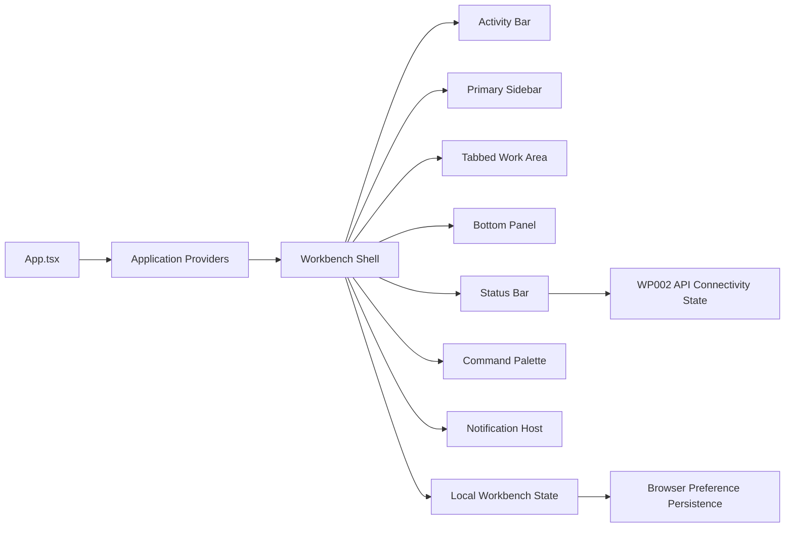

# Implementation Plan - WP003 Workbench Desktop Shell

## Document Control

| Field | Value |
| --- | --- |
| Work Package | WP003 - Workbench Desktop Shell |
| Target Output Path | `docs/022-Workbench-Desktop-Shell/plan-wp003-workbench-desktop-shell.md` |
| Source Specification | `docs/022-Workbench-Desktop-Shell/spec-wp003-workbench-desktop-shell.md` |
| Mandatory Wiki Guidance | `./.github/instructions/wiki.instructions.md` |
| Mandatory Documentation-Pass Guidance | `./.github/instructions/documentation-pass.instructions.md` |
| Status | Draft |

## Planning Principles

This plan turns the WP003 Workbench Desktop Shell specification into a sequence of executable vertical slices for ArchonExplorer. The work package is a UI foundation package, but every work item must leave the frontend runnable and demonstrable. The shell must become progressively more capable without drifting into later work packages for extraction submission, snapshot administration, search results, graph rendering, evidence inspection, or lens execution.

Implementation must follow these repository standards as hard gates, not optional cleanup:

- `./.github/instructions/wiki.instructions.md` must be followed for every work item. Wiki review is mandatory for the work package, and wiki updates are required whenever developer-facing behavior, architecture, setup workflows, runtime foundations, terminology, extension points, validation workflows, or contributor guidance changes or is materially clarified.
- `./.github/instructions/documentation-pass.instructions.md` must be followed for every work item that creates, updates, reviews, or plans source code. Code is not acceptable unless the documentation-pass standard is met for all source code touched by that work item.
- Every code-writing task must include developer-level comments for every class, interface, record, type alias where it represents a meaningful concept, React component, hook, provider, utility, function, constructor-equivalent factory, and method introduced or changed. Comments must explain purpose, logical flow, constraints, and non-obvious behavior. Public method and constructor parameters must be documented. Properties whose meaning is not obvious from their names must be explained.
- The documentation-pass standard applies to internal and other non-public code with the same seriousness as public API surface. For TypeScript and React code, use the nearest readable local documentation style and inline comments where XML documentation is not available.
- Active work-item execution must be uninterrupted. Once implementation starts for a work item, the executor must continue through implementation, validation, documentation/wiki review, and plan-record updates. The executor must not stop for status-only messages, ordinary fixable build/test failures, or confirmation prompts. The only allowed stops are full work-item completion, explicit user interruption or direction change, or a true blocker that cannot be resolved from the specification, this plan, codebase evidence, or repository guidance.
- Contributor-facing design rationale, runtime architecture, setup guidance, validation workflows, troubleshooting guidance, extension instructions, terminology, and workflow explanations must be written into `./wiki` according to `./.github/instructions/wiki.instructions.md`, not into standalone implementation notes, implementation ledgers, architecture-note artifacts, or similar narrative completion records.
- `wiki/home.md` must remain a concise landing page and reader path. It must not become a catch-all destination for workbench shell details, frontend runtime details, setup workflows, route-catalog rationale, testing guidance, or troubleshooting content.
- Foundational documentation for the workbench shell must be written in book-like narrative prose where the subject is conceptually dense. Technical terms such as workbench shell, activity bar, activity, primary sidebar, tabbed work area, bottom panel, status bar, command palette, notification host, shell command, local workbench state, persisted layout preference, and resizable panel must be defined on first use or linked to glossary entries. Examples or walkthroughs are required when they materially improve contributor understanding.
- WP003 must preserve the mandatory UI styling constraint: use standard shadcn/ui-compatible coloring, text sizing, spacing, and control styling; do not introduce custom theme colors, custom type scales, custom button/control treatments, card-like marketing treatments, or an alternative ordinary component library unless the active implementation request explicitly changes that constraint.
- WP003 must not implement real extraction submission, extraction run history, snapshot listing, snapshot selection, snapshot deletion, global search results, node overview, graph rendering, graph projection rendering, evidence inspection, lens execution, arbitrary Cypher input, or authentication/authorization.
- For this work package, do not run the full test suite unless focused validation reveals a cross-cutting problem that requires broader verification.

## Overall Project Structure

The implementation will extend the existing `src/ArchonExplorer` frontend structure rather than replacing it. The exact file split may be refined during implementation, but the shell foundation should remain discoverable and separated by responsibility:

```text
src/
  ArchonExplorer/
	package.json
	package-lock.json
	src/
	  App.tsx
	  components/
		ui/
		  badge.tsx
		  button.tsx
		  card.tsx
		  command.tsx
		  tabs.tsx
		  toast.tsx
		workbench/
		  ActivityBar.tsx
		  ActivityRail.tsx
		  BottomPanel.tsx
		  CommandPalette.tsx
		  NotificationHost.tsx
		  PrimarySidebar.tsx
		  StatusBar.tsx
		  TabbedWorkArea.tsx
		  WorkbenchShell.tsx
		  WorkspaceStartState.tsx
		  workbenchActivities.ts
		  workbenchCommands.ts
	  hooks/
		useApiConnectivity.ts
		useWorkbenchKeyboardShortcuts.ts
	  lib/
		workbenchPersistence.ts
		utils.ts
	  state/
		workbenchStore.tsx
	  test/
		workbench/
		  activityNavigation.test.tsx
		  commandPalette.test.tsx
		  layoutPersistence.test.ts
		  shellRendering.test.tsx
		  statusBar.test.tsx
	  test-e2e/
		workbench-shell.spec.ts
wiki/
  archonexplorer-frontend-foundation.md
  validation-and-test-workflows.md
  glossary.md
  home.md
```

The preferred source organization is intentionally frontend-local. Workbench shell state belongs in `src/ArchonExplorer/src/state` or an equivalent frontend state folder; shell components belong in `src/ArchonExplorer/src/components/workbench`; shell-specific persistence helpers belong in `src/ArchonExplorer/src/lib`; and tests should live close to the frontend test estate. If implementation finds the existing project has a different test convention, follow that convention while preserving the same separation of responsibilities.

WP003 may add minimal dependencies needed for the specified shell, such as shadcn/ui-compatible command, tab, toast, and resizable panel primitives. It must not add graph rendering libraries, visualization libraries, heavy data-grid libraries, or an alternative component library.

## Work Items

## 1. Workbench State, Activity Navigation, and Default Runnable Shell

- [x] Work Item 1: Implement a runnable workbench shell with local activity and tab state - Completed
  - **Purpose**: Replace the placeholder shell foundation with a durable local workbench state model and a demonstrable frame containing activity navigation, contextual sidebar content, and a default tabbed work area while keeping ArchonExplorer runnable after the first slice.
  - **Acceptance Criteria**:
	- A local workbench state model tracks active activity, open tabs, active tab, sidebar state, bottom panel visibility placeholder, command palette visibility placeholder, and panel layout defaults.
	- The activity bar or activity rail exposes roadmap-aligned placeholder activities for Dashboard, Extraction Center, Snapshots, Search, Projects, Findings, and Settings or Diagnostics.
	- Selecting an activity updates the primary sidebar and does not navigate away from the workbench frame.
	- A tabbed work area renders at least one default start tab with stable tab identity and readable title.
	- Placeholder content is honest and does not show fabricated architecture facts, extraction runs, snapshots, graph data, or search results.
	- The frontend remains runnable through typecheck, tests, and production build.
  - **Definition of Done**:
	- Code implemented for local workbench state, activity registration, primary sidebar placeholders, and default tabbed work area.
	- Unit or component tests pass for activity switching, default tab state, and placeholder rendering.
	- Logging is not required for browser-local shell state unless existing frontend conventions already provide safe diagnostic logging; any added diagnostics must be safe.
	- Error handling is present for invalid local state transitions where they can occur, using safe fallback behavior.
	- All source code touched by this work item complies with `./.github/instructions/documentation-pass.instructions.md`.
	- Developer-level comments are present for every component, hook, provider, type, meaningful constant, function, constructor-equivalent factory, and method introduced or changed; comments explain purpose, logical flow, constraints, and non-obvious behavior.
	- Wiki review is performed for workbench shell terminology, activity navigation, tab model, and local shell state; relevant wiki or repository guidance is updated, or an explicit no-change result is recorded.
	- Wiki content uses book-like narrative depth for the workbench shell model, defines technical terms on first use or links to `wiki/glossary.md`, and includes a short contributor walkthrough when useful.
	- Can execute end-to-end via: start the frontend, open ArchonExplorer, select an activity, and observe the sidebar and default tab remain inside the frame.
	- Executor must not stop mid-work-item; execution continues through implementation, validation, documentation/wiki review, and plan-record updates unless the work item is complete, the user explicitly interrupts, or a true blocker prevents further autonomous progress.
	- [x] Task 1: Inspect current shell and runtime seams - Completed
	- [x] Review `src/ArchonExplorer/src/App.tsx`, `src/ArchonExplorer/src/components/workbench/WorkbenchShell.tsx`, `ActivityRail.tsx`, `StatusBar.tsx`, `WorkspaceStartState.tsx`, and `workbenchAreas.ts`.
	- [x] Review `src/ArchonExplorer/src/providers/NotificationProvider.tsx` and `src/ArchonExplorer/src/hooks/useApiConnectivity.ts` so the shell integrates existing runtime seams rather than duplicating them.
	- [x] Confirm existing frontend test conventions and test runner configuration before adding new tests.
  - [x] Task 2: Implement local workbench state model - Completed
	- [x] Create `src/ArchonExplorer/src/state/workbenchStore.tsx` or the selected equivalent.
	- [x] Define documented activity, tab, panel, and shell-state types with stable identifiers.
	- [x] Implement actions for selecting activities, opening or focusing placeholder tabs, selecting active tabs, closing closable tabs if included, toggling sidebar collapsed state if included, and toggling bottom panel visibility placeholder state.
	- [x] Ensure invalid tab or activity identifiers recover to safe defaults rather than crashing the shell.
  - [x] Task 3: Implement activity and sidebar registration - Completed
	- [x] Create or replace the roadmap-aligned activity catalog in `workbenchActivities.ts` or the selected equivalent.
	- [x] Implement an activity bar component with accessible names, keyboard-reachable controls, selected state, and standard toolkit styling.
	- [x] Implement a primary sidebar component that renders contextual placeholder content for the active activity.
	- [x] Ensure activity placeholders explicitly state that functional extraction, snapshots, search, projects, findings, and diagnostics arrive in later packages.
  - [x] Task 4: Implement tabbed work area - Completed
	- [x] Add a shadcn/ui-compatible tab primitive if not already present and needed.
	- [x] Create `TabbedWorkArea.tsx` or equivalent shell component.
	- [x] Render a default start tab with stable tab ID, title, accessible tab semantics, and safe placeholder content.
	- [x] Add shell-level actions that can open or focus placeholder tabs without simulating real feature data.
  - [x] Task 5: Add focused tests - Completed
	- [x] Add component tests for initial shell rendering.
	- [x] Add tests for activity selection updating sidebar context.
	- [x] Add tests for default tab state and tab selection behavior.
	- [x] Add tests confirming placeholder text does not expose unsafe diagnostics or imply unavailable features are complete.
  - [x] Task 6: Validate first slice - Completed
	- [x] Run frontend tests for shell rendering and activity navigation.
	- [x] Run `npm run typecheck` from `src/ArchonExplorer`.
	- [x] Run `npm run build` from `src/ArchonExplorer`.
	- **Completion Summary**: Implemented a documented local workbench store in `src/ArchonExplorer/src/state/workbenchStore.tsx`; added roadmap-aligned activity metadata in `src/ArchonExplorer/src/components/workbench/workbenchActivities.ts`; updated `ActivityRail.tsx`, `WorkbenchShell.tsx`, `StatusBar.tsx`, `workbenchAreas.ts`, `WorkspaceStartState.tsx`, and `index.css`; added `PrimarySidebar.tsx`, `TabbedWorkArea.tsx`, and focused tests in `src/ArchonExplorer/src/test/workbench/workbenchShell.test.tsx`. The shell now supports local activity selection, contextual sidebar placeholders, a required `Workbench Start` tab, safe invalid activity/tab fallback behavior, and placeholder panel state seams without loading extraction, snapshot, search, graph, evidence, or finding data.
	- **Validation Performed**: `npm run test -- workbench` passed with 10 tests; `npm run typecheck` passed; `npm run build` passed. An initial focused test failure revealed that deterministic `StatusBar` rendering still invoked the API connectivity hook without a query provider; this was corrected by moving hook usage into a child component and honoring the controlled connectivity override.
	- **Wiki Review Result**: Updated `wiki/archonexplorer-frontend-foundation.md` with book-like current-state guidance for the workbench shell model, activity rail, primary sidebar, tabbed work area, local workbench state, and contributor walkthrough. Updated `wiki/glossary.md` for activity rail, primary sidebar, tabbed work area, workbench tab, and local workbench state. Updated `wiki/validation-and-test-workflows.md` with the focused `npm run test -- workbench` workflow and manual shell verification expectations. Updated `wiki/home.md` only with concise reader-path wording; detailed guidance remains on topic pages.
	- **Wiki Impact Matrix**: Affected concepts: workbench shell, activity navigation, primary sidebar, tabbed work area, local workbench state, safe placeholders, and frontend validation. Pages reviewed: `wiki/archonexplorer-frontend-foundation.md`, `wiki/glossary.md`, `wiki/validation-and-test-workflows.md`, and `wiki/home.md`. Pages updated: all four reviewed pages. Pages created: none; existing topic pages were the correct homes. Pages intentionally unchanged: unrelated architecture, persistence, API, MCP, and extraction pages. Page-structure decision: `archonexplorer-frontend-foundation.md` remains the correct detailed topic page because this behavior is frontend runtime and shell guidance; `validation-and-test-workflows.md` remains the correct command page; `glossary.md` remains the central terminology page; `home.md` remains a concise landing page and was not used as a catch-all destination.
  - **Files**:
	- `src/ArchonExplorer/src/App.tsx`: compose the updated workbench shell if needed.
	- `src/ArchonExplorer/src/state/workbenchStore.tsx`: local workbench state model and actions.
	- `src/ArchonExplorer/src/components/workbench/WorkbenchShell.tsx`: top-level shell composition.
	- `src/ArchonExplorer/src/components/workbench/ActivityBar.tsx` or `ActivityRail.tsx`: activity navigation.
	- `src/ArchonExplorer/src/components/workbench/PrimarySidebar.tsx`: contextual sidebar placeholders.
	- `src/ArchonExplorer/src/components/workbench/TabbedWorkArea.tsx`: default tabbed work area.
	- `src/ArchonExplorer/src/components/workbench/workbenchActivities.ts`: activity catalog.
	- `src/ArchonExplorer/src/test/workbench/*`: focused unit/component tests.
  - **Work Item Dependencies**: WP001 and WP002 completed foundations.
  - **Run / Verification Instructions**:
	- `cd .\src\ArchonExplorer`
	- `npm run test -- workbench`
	- `npm run typecheck`
	- `npm run build`
	- `npm run dev`
	- Open the printed Vite URL, select activities, and confirm the sidebar and tabbed work area update inside the shell.
  - **User Instructions**:
	- Stop the Vite dev server after manual verification.

## 2. Resizable Layout, Bottom Panel, Status Bar Slots, and Preference Persistence

- [x] Work Item 2: Add demonstrable shell layout persistence and contextual workbench regions - Completed
  - **Purpose**: Make the shell behave like a desktop workbench by adding resizable regions, a controllable bottom panel, durable status-bar slots, and recoverable browser-local layout preferences without requiring API-backed feature data.
  - **Acceptance Criteria**:
	- The shell contains a resizable layout for sidebar/main and main/bottom-panel regions where practical.
	- Panel sizes and selected shell preferences persist locally and recover to safe defaults when stored data is invalid.
	- A bottom panel can be opened or hidden and contains safe placeholders for background work, extraction runs, and diagnostics.
	- The status bar renders slots for active snapshot, API connectivity, background work, and selected context.
	- Status indicators do not rely on color alone and do not expose unsafe diagnostics.
	- Layout reset behavior is available through a shell action or command seam and confirms with safe user feedback if notifications are available.
  - **Definition of Done**:
	- Resizable panel layout and bottom panel are implemented with shadcn/ui-compatible or accepted React primitives without introducing a competing UI component library.
	- Browser-local preference persistence is implemented with versioning or fallback logic and excludes secrets, raw diagnostics, API values that should not be stored, and architecture facts.
	- Tests pass for preference load/save/reset, invalid stored-data recovery, bottom-panel toggling, and status-bar safe rendering.
	- All source code touched by this work item complies with `./.github/instructions/documentation-pass.instructions.md`.
	- Developer-level comments are present for every component, hook, helper, type, function, constructor-equivalent factory, and non-obvious property introduced or changed.
	- Wiki review is performed for layout persistence, bottom panel, status-bar terminology, and validation workflow impact; relevant wiki pages are updated, or an explicit no-change result is recorded.
	- Dense wiki explanations define persisted layout preference, bottom panel, and status bar when first introduced or link to the glossary, and include a short reset/recovery walkthrough where useful.
	- Can execute end-to-end via: open ArchonExplorer, resize or toggle regions, reload the page, and observe safe persistence or fallback behavior.
	- Executor must not stop mid-work-item; execution continues through implementation, validation, documentation/wiki review, and plan-record updates unless the work item is complete, the user explicitly interrupts, or a true blocker prevents further autonomous progress.
	- [x] Task 1: Select and configure layout primitives - Completed
	- [x] Prefer existing shadcn/ui-compatible primitives and minimal packages.
	- [x] If `react-resizable-panels` or equivalent is needed, add the smallest dependency required and update lockfile deterministically.
	- [x] Do not add graph, visualization, data-grid, or alternate UI component libraries.
  - [x] Task 2: Implement persisted shell preferences - Completed
	- [x] Create `src/ArchonExplorer/src/lib/workbenchPersistence.ts` or equivalent.
	- [x] Define a versioned preference shape for panel sizes, sidebar collapsed state if present, active activity if persisted, and bottom-panel visibility.
	- [x] Implement safe parse, validate, save, load, and reset helpers.
	- [x] Ensure invalid, missing, or future-version values recover to defaults.
  - [x] Task 3: Implement resizable shell regions - Completed
	- [x] Update `WorkbenchShell.tsx` to use the selected panel layout.
	- [x] Persist panel size changes using the persistence helper.
	- [x] Preserve plain desktop-IDE-style layout and standard toolkit styling.
	- [x] Ensure layout controls remain keyboard and screen-reader reasonable where the selected primitives support it.
  - [x] Task 4: Implement bottom panel - Completed
	- [x] Create `BottomPanel.tsx` or equivalent.
	- [x] Add safe placeholder sections for Background Work, Extraction Runs, and Diagnostics.
	- [x] Add user controls and state actions to open, hide, and focus the bottom panel.
	- [x] Ensure diagnostics placeholders never display raw stack traces, connection strings, environment variables, raw Cypher, Neo4j internals, or driver details.
  - [x] Task 5: Strengthen status bar slots - Completed
	- [x] Update `StatusBar.tsx` to render active snapshot `current`, API connectivity state from WP002, background work placeholder state, and selected context placeholder state.
	- [x] Use accessible text labels and avoid color-only state communication.
	- [x] Avoid adding a second API connectivity implementation.
  - [x] Task 6: Add persistence and region tests - Completed
	- [x] Test preference defaults, save/load, invalid JSON recovery, incompatible-shape recovery, and reset behavior.
	- [x] Test bottom-panel visibility state and safe placeholder labels.
	- [x] Test status-bar slot rendering and safe API connectivity text.
  - [x] Task 7: Validate layout slice - Completed
	- [x] Run focused layout, persistence, bottom-panel, and status-bar tests.
	- [x] Run `npm run typecheck`.
	- [x] Run `npm run build`.
	- **Completion Summary**: Implemented versioned browser-local shell preference persistence in `src/ArchonExplorer/src/lib/workbenchPersistence.ts`; extended `src/ArchonExplorer/src/state/workbenchStore.tsx` with persisted active activity, panel sizes, bottom-panel visibility, reset behavior, and safe state-to-preference conversion; updated `src/ArchonExplorer/src/components/workbench/WorkbenchShell.tsx` and `src/ArchonExplorer/src/index.css` with percentage-based resizable shell regions and layout controls; added `src/ArchonExplorer/src/components/workbench/BottomPanel.tsx` with safe Background Work, Extraction Runs, and Diagnostics placeholders; strengthened `src/ArchonExplorer/src/components/workbench/StatusBar.tsx` with active snapshot, WP002 API connectivity, background work/bottom-panel, and selected-context slots.
	- **Validation Performed**: `npm run test -- workbench` passed with 19 tests; `npm run typecheck` passed; `npm run build` passed. A local in-repository separator strategy was selected instead of adding `react-resizable-panels`, so `package.json` and `package-lock.json` were not changed.
	- **Wiki Review Result**: Updated `wiki/archonexplorer-frontend-foundation.md` with book-like current-state guidance for persisted layout preferences, resizable panel seams, bottom panel behavior, status-bar context, and reset/reload walkthrough. Updated `wiki/glossary.md` for persisted layout preference, resizable panel, bottom panel, local workbench state, status bar, and ArchonExplorer definitions. Updated `wiki/validation-and-test-workflows.md` with focused workbench persistence/bottom-panel/status validation and manual smoke-check expectations. Updated `wiki/home.md` only with concise reader-path wording; detailed guidance remains on topic pages.
	- **Wiki Impact Matrix**: Affected concepts: persisted layout preference, resizable panel, bottom panel, status bar slots, local workbench state, safe diagnostics placeholders, layout reset/recovery, and frontend validation. Pages reviewed: `wiki/archonexplorer-frontend-foundation.md`, `wiki/glossary.md`, `wiki/validation-and-test-workflows.md`, and `wiki/home.md`. Pages updated: all four reviewed pages. Pages created: none; existing topic pages were the correct homes. Pages intentionally unchanged: unrelated solution architecture, runtime foundation, persistence, API extraction, MCP, and domain pages. Page-structure decision: `archonexplorer-frontend-foundation.md` remains the correct detailed topic page because these changes are frontend runtime and shell behavior; `validation-and-test-workflows.md` remains the correct validation command page; `glossary.md` remains the central terminology page; `home.md` remains a concise landing page and was not used as a catch-all destination.
  - **Files**:
	- `src/ArchonExplorer/package.json`: minimal dependency updates if a resizable panel package is required.
	- `src/ArchonExplorer/package-lock.json`: deterministic dependency updates if package metadata changes.
	- `src/ArchonExplorer/src/lib/workbenchPersistence.ts`: preference persistence helpers.
	- `src/ArchonExplorer/src/components/workbench/WorkbenchShell.tsx`: resizable shell composition.
	- `src/ArchonExplorer/src/components/workbench/BottomPanel.tsx`: bottom panel placeholders.
	- `src/ArchonExplorer/src/components/workbench/StatusBar.tsx`: status slots.
	- `src/ArchonExplorer/src/state/workbenchStore.tsx`: bottom-panel and layout state integration.
	- `src/ArchonExplorer/src/test/workbench/*`: focused persistence, layout, and status tests.
  - **Work Item Dependencies**: Work Item 1.
  - **Run / Verification Instructions**:
	- `cd .\src\ArchonExplorer`
	- `npm install` if package metadata changed.
	- `npm run test -- workbench`
	- `npm run typecheck`
	- `npm run build`
	- `npm run dev`
	- Open the printed Vite URL, resize or toggle shell regions, reload, and verify preferences persist or recover safely.
  - **User Instructions**:
	- Stop the Vite dev server after manual verification.

## 3. Command Palette, Shell Commands, Notification Placement, and Keyboard Flow

- [x] Work Item 3: Implement keyboard-driven shell commands and notification placement - Completed
  - **Purpose**: Provide the global command palette shell and notification host required for later work packages, proving that users can operate shell actions from a keyboard without pretending architecture search is implemented.
  - **Acceptance Criteria**:
	- A command palette using shadcn/ui `Command` / cmdk opens by keyboard shortcut and by an on-screen affordance.
	- The command palette contains grouped shell-level commands for switching activities, toggling the bottom panel, opening or focusing the start tab, resetting layout preferences, and focusing shell regions where practical.
	- Command execution updates local workbench state rather than performing browser page navigation.
	- Palette focus moves into the palette on open and returns to a sensible location on close.
	- Placeholder search wording clearly states that global architecture search arrives in a later work package.
	- The notification host is placed in the shell and can show safe shell-level feedback without becoming the only representation of persistent errors.
  - **Definition of Done**:
	- Command model, command palette component, keyboard shortcut hook, and notification host placement are implemented.
	- Focus behavior and keyboard shortcut behavior are covered by focused tests.
	- Shell-level notifications are safe, shadcn/ui-compatible, and limited to appropriate transient feedback such as layout reset or unavailable placeholder actions.
	- All source code touched by this work item complies with `./.github/instructions/documentation-pass.instructions.md`.
	- Developer-level comments are present for every component, hook, command type, command registration, function, constructor-equivalent factory, and non-obvious property introduced or changed.
	- Wiki review is performed for command palette, shell command, keyboard workflow, notification host, and extension-point terminology; relevant wiki pages are updated, or an explicit no-change result is recorded.
	- Wiki content defines command palette, shell command, and notification host on first use or links to glossary entries, and includes a short walkthrough of adding or invoking shell commands where useful.
	- Can execute end-to-end via: open ArchonExplorer, press the documented shortcut, run a shell command, and observe the shell state change.
	- Executor must not stop mid-work-item; execution continues through implementation, validation, documentation/wiki review, and plan-record updates unless the work item is complete, the user explicitly interrupts, or a true blocker prevents further autonomous progress.
	- [x] Task 1: Add command and notification primitives - Completed
	- [x] Added a local shadcn/ui-compatible `Command` primitive family without adding a new package.
	- [x] Reused the existing WP002 notification runtime and added a shell notification host marker rather than creating a second toast runtime.
	- [x] No package metadata or lockfile changes were required.
  - [x] Task 2: Implement shell command registry - Completed
	- [x] Created `workbenchCommands.ts` with documented command IDs, labels, groups, keyboard hints, unavailable states, and command actions.
	- [x] Wired commands to existing workbench state actions for activity switching, bottom-panel toggling/show/hide, start-tab focusing, layout reset, and focus-oriented shell state.
	- [x] Added a clearly unavailable future architecture search command that publishes safe explanatory feedback and never fabricates results.
  - [x] Task 3: Implement command palette component - Completed
	- [x] Created `CommandPalette.tsx` using the local shadcn-compatible command primitive.
	- [x] Rendered grouped shell commands with command filtering only over command metadata.
	- [x] Added safe placeholder text explaining that architecture search arrives later.
	- [x] Command execution closes the palette after handling the selected command.
  - [x] Task 4: Implement keyboard shortcut and focus management - Completed
	- [x] Created `useWorkbenchKeyboardShortcuts.ts`.
	- [x] Supported documented `Ctrl+K` and `Meta+K` command-palette shortcuts without broad modifier capture.
	- [x] Moved focus into the command palette input when opened.
	- [x] Returned focus to the visible command-palette trigger when the palette closes where browser focus is available.
  - [x] Task 5: Place notification host - Completed
	- [x] Added `NotificationHost.tsx` as the shell notification placement marker.
	- [x] Triggered safe shell-level feedback for layout reset and unavailable future architecture search through the existing notification runtime.
	- [x] Kept persistent shell errors conceptually outside transient notifications and documented that boundary in code and wiki guidance.
  - [x] Task 6: Add command and keyboard tests - Completed
	- [x] Tested command shortcut recognition, command-palette rendering, shell command grouping/execution, disabled future-search safety, and notification-host placement.
	- [x] Updated the shell render test provider composition to include the existing notification runtime.
	- [x] Focus behavior is covered through shortcut recognition and command-palette focus code paths feasible in the current server-rendered Vitest setup.
  - [x] Task 7: Validate command slice - Completed
	- [x] Ran focused command palette and workbench tests.
	- [x] Ran `npm run typecheck`.
	- [x] Ran `npm run build`.
	- **Completion Summary**: Implemented the Workbench command palette and shell command slice with `src/ArchonExplorer/src/components/ui/command.tsx`, `src/ArchonExplorer/src/components/workbench/workbenchCommands.ts`, `src/ArchonExplorer/src/components/workbench/CommandPalette.tsx`, `src/ArchonExplorer/src/components/workbench/NotificationHost.tsx`, and `src/ArchonExplorer/src/hooks/useWorkbenchKeyboardShortcuts.ts`. Updated `src/ArchonExplorer/src/components/workbench/WorkbenchShell.tsx` to expose the command-palette trigger, register `Ctrl+K`/`Meta+K`, wire local shell commands, place the notification host, and use safe notification feedback for layout reset and unavailable future search. Updated `src/ArchonExplorer/src/components/ui/button.tsx` for focus-restoration refs, `src/ArchonExplorer/src/index.css` for token-based command palette and notification-host styling, and focused workbench tests for command behavior.
	- **Validation Performed**: `npm run test -- workbench` passed with 27 tests from `D:\Dev\Archon\src\ArchonExplorer`; `npm run typecheck` passed; `npm run build` passed. No package installation or lockfile update was required because the local command primitive and existing notification runtime satisfied the slice without adding `cmdk`, Radix dialog, or a toast package.
	- **Wiki Review Result**: Updated `wiki/archonexplorer-frontend-foundation.md` with book-like current-state guidance for the command palette, shell commands, keyboard workflow, future-search boundary, and notification host placement. Updated `wiki/glossary.md` with command palette, shell command, notification host, command/search affordance, ArchonExplorer, workbench shell, and shadcn/ui terminology. Updated `wiki/validation-and-test-workflows.md` with focused validation coverage and manual smoke-check instructions for command palette and notification-host behavior. `wiki/home.md` was reviewed and intentionally left unchanged because it remains a concise landing page and reader path.
	- **Wiki Impact Matrix**: Affected concepts: command palette, shell command, keyboard shortcut, command/search affordance, future architecture search boundary, notification host, transient shell feedback, local workbench state, and frontend validation. Pages reviewed: `wiki/archonexplorer-frontend-foundation.md`, `wiki/glossary.md`, `wiki/validation-and-test-workflows.md`, and `wiki/home.md`. Pages updated: `wiki/archonexplorer-frontend-foundation.md`, `wiki/glossary.md`, and `wiki/validation-and-test-workflows.md`. Pages created: none. Pages intentionally unchanged: `wiki/home.md` and unrelated solution architecture, runtime foundation, persistence, API extraction, MCP, domain, and extractor topic pages. Page-structure decision: `archonexplorer-frontend-foundation.md` remains the correct detailed topic page because command palette and notification placement are frontend shell runtime behavior; `validation-and-test-workflows.md` remains the correct command page for validation workflow; `glossary.md` remains the terminology index; `home.md` stays concise and was not used as a catch-all destination.
  - **Files**:
	- `src/ArchonExplorer/package.json`: minimal dependency updates for command/toast primitives if required.
	- `src/ArchonExplorer/package-lock.json`: deterministic dependency updates if package metadata changes.
	- `src/ArchonExplorer/src/components/ui/command.tsx`: shadcn/ui-compatible command primitive if needed.
	- `src/ArchonExplorer/src/components/ui/toast.tsx`: shadcn/ui-compatible toast primitive if needed.
	- `src/ArchonExplorer/src/components/workbench/CommandPalette.tsx`: command palette shell.
	- `src/ArchonExplorer/src/components/workbench/NotificationHost.tsx`: shell notification placement if needed.
	- `src/ArchonExplorer/src/components/workbench/workbenchCommands.ts`: shell command registry.
	- `src/ArchonExplorer/src/hooks/useWorkbenchKeyboardShortcuts.ts`: command-palette shortcut and focus behavior.
	- `src/ArchonExplorer/src/state/workbenchStore.tsx`: command-palette visibility and command actions.
	- `src/ArchonExplorer/src/test/workbench/*`: focused command, keyboard, and notification tests.
  - **Work Item Dependencies**: Work Items 1 and 2.
  - **Run / Verification Instructions**:
	- `cd .\src\ArchonExplorer`
	- `npm install` if package metadata changed.
	- `npm run test -- workbench`
	- `npm run typecheck`
	- `npm run build`
	- `npm run dev`
	- Open the printed Vite URL, use the documented keyboard shortcut, run shell commands, and confirm state changes in the shell.
  - **User Instructions**:
	- Stop the Vite dev server after manual verification.

## 4. Focused End-to-End Validation and Accessibility Hardening

- [x] Work Item 4: Validate the shell through focused Playwright and accessibility-oriented checks - Completed
  - **Purpose**: Prove the completed WP003 shell is usable through a browser journey and keyboard interaction, and close accessibility gaps before later operational features depend on the frame.
  - **Acceptance Criteria**:
	- Focused Playwright coverage opens the workbench shell.
	- Focused Playwright coverage opens the command palette by keyboard shortcut.
	- Focused Playwright coverage switches activities.
	- Focused Playwright coverage toggles the bottom panel if implemented as a user action.
	- Focused checks verify visible focus, accessible names or labels for major shell controls, tab semantics, and command palette behavior.
	- Validation confirms frontend typecheck and production build pass.
	- Manual smoke guidance records that the Aspire AppHost should not be run by the agent; the user should perform Aspire smoke validation if needed.
  - **Definition of Done**:
	- Playwright or the repository-selected browser e2e test setup exists for ArchonExplorer if not already present, placed alongside the frontend project rather than cluttering the repository root.
	- Focused e2e tests cover shell opening, command palette shortcut, activity switching, and bottom panel toggling where applicable.
	- Accessibility-oriented checks are added using available tooling or explicit test assertions for labels, roles, focus, and non-color-only state.
	- No full test suite is run unless focused validation reveals a cross-cutting issue requiring it.
	- All source code and test code touched by this work item complies with `./.github/instructions/documentation-pass.instructions.md`, including developer-level comments on test scenarios, helpers, setup code, and non-obvious assertions.
	- Wiki review is performed for frontend validation workflow, browser test setup, accessibility expectations, and manual smoke guidance; relevant wiki pages are updated, or an explicit no-change result is recorded.
	- Wiki validation guidance includes command examples and explains what success looks like; conceptually dense guidance is narrative rather than a terse command dump.
	- Can execute end-to-end via: run the focused browser tests, frontend tests, typecheck, and build.
	- Executor must not stop mid-work-item; execution continues through implementation, validation, documentation/wiki review, and plan-record updates unless the work item is complete, the user explicitly interrupts, or a true blocker prevents further autonomous progress.
	- [x] Task 1: Inspect existing frontend validation setup - Completed
	- [x] Confirmed no existing Playwright configuration or `src/test-e2e` folder was present for `src/ArchonExplorer`.
	- [x] Added minimal Playwright configuration next to the frontend project and kept generated artifacts frontend-local.
	- [x] Added an npm script for focused e2e execution.
  - [x] Task 2: Add shell e2e tests - Completed
	- [x] Added a browser journey that opens the workbench shell and verifies activity rail, sidebar, tabbed work area, bottom-panel affordance, status bar, command affordance, and notification host presence.
	- [x] Added a browser journey that uses the keyboard shortcut to open the command palette.
	- [x] Added a browser journey that switches activities and verifies contextual sidebar and status text changes.
	- [x] Added a browser journey that toggles the bottom panel through visible controls and shell commands.
  - [x] Task 3: Add accessibility-oriented checks - Completed
	- [x] Asserted accessible labels or roles for activity controls, command palette trigger, tab list/tab panel, resize separators, bottom-panel controls, and status bar regions.
	- [x] Asserted keyboard focus reaches the command trigger and moves into the command palette filter when opened.
	- [x] Asserted status text includes non-color state descriptions for current snapshot and bottom-panel visibility.
  - [x] Task 4: Run focused validation - Completed
	- [x] Ran frontend unit/component tests for workbench slices.
	- [x] Ran focused Playwright tests for the shell.
	- [x] Ran `npm run typecheck`.
	- [x] Ran `npm run build`.
	- [x] Did not run unrelated .NET test suites because package metadata changed only for the frontend and no C# AppHost integration was changed.
  - [x] Task 5: Record manual smoke expectations - Completed
	- [x] Updated this completion record to state that the user should perform Aspire-hosted smoke validation because the agent must not run the Aspire AppHost as a blocking smoke test.
	- [x] Updated wiki validation guidance to explain Vite-focused Playwright validation and manual Aspire smoke expectations.
  - **Completion Summary**: Added frontend-local Playwright validation for ArchonExplorer with `src/ArchonExplorer/playwright.config.ts`, the `npm run test:e2e` script, `@playwright/test` in `src/ArchonExplorer/package.json` and `package-lock.json`, and focused shell browser journeys in `src/ArchonExplorer/src/test-e2e/workbench-shell.spec.ts`. Updated `src/ArchonExplorer/vite.config.ts` to exclude e2e specs from Vitest collection and use Vitest config typing, updated `src/ArchonExplorer/tsconfig.node.json` to typecheck the Playwright config, hardened `src/ArchonExplorer/src/components/workbench/WorkbenchShell.tsx` with accessible separator semantics and command shortcut metadata, and made `src/ArchonExplorer/src/components/workbench/NotificationHost.tsx` expose explicit safe readiness text for browser validation.
  - **Validation Performed**: `npm run test -- workbench` passed with 27 tests; `npm run test:e2e -- workbench-shell` passed with 5 Chromium browser tests; `npm run typecheck` passed; `npm run build` passed. `npx playwright install chromium` was run once because Playwright reported the Chromium browser executable was missing after package installation. No full repository or unrelated .NET test suite was run.
  - **Wiki Review Result**: Updated `wiki/validation-and-test-workflows.md` with the focused Playwright command sequence, one-time Chromium installation guidance, expected browser-validation success behavior, generated-artifact boundaries, and the existing manual Aspire smoke expectation. Updated `wiki/archonexplorer-frontend-foundation.md` with current-state browser-validation guidance and shell accessibility validation boundaries. Updated `wiki/glossary.md` with `Browser validation` and `Playwright`. Reviewed `wiki/home.md` and intentionally left it unchanged because it remains a concise landing page and already links to the detailed frontend and validation topic pages.
  - **Wiki Impact Matrix**: Affected concepts: Playwright browser validation, focused shell e2e journey, accessibility-oriented shell checks, command-palette keyboard flow, bottom-panel browser flow, generated validation artifacts, and manual Aspire smoke boundaries. Pages reviewed: `wiki/validation-and-test-workflows.md`, `wiki/archonexplorer-frontend-foundation.md`, `wiki/glossary.md`, and `wiki/home.md`. Pages updated: `wiki/validation-and-test-workflows.md`, `wiki/archonexplorer-frontend-foundation.md`, and `wiki/glossary.md`. Pages created, split, renamed, or retired: none. Pages intentionally unchanged: `wiki/home.md` and unrelated architecture, persistence, extraction, MCP, domain, and API workflow pages because Work Item 4 changed frontend validation and shell accessibility guidance only. Page-structure decision: `validation-and-test-workflows.md` remains the correct command and expected-outcome page; `archonexplorer-frontend-foundation.md` remains the correct detailed browser-shell topic page; `glossary.md` remains the terminology index; `home.md` remains a concise reader path and was not used as a catch-all destination.
  - **Files**:
	- `src/ArchonExplorer/package.json`: e2e test script if needed.
	- `src/ArchonExplorer/package-lock.json`: deterministic dependency updates if Playwright is added.
	- `src/ArchonExplorer/playwright.config.ts`: frontend-local Playwright configuration if needed.
	- `src/ArchonExplorer/src/test-e2e/workbench-shell.spec.ts`: focused shell journeys.
	- `src/ArchonExplorer/src/test/workbench/*`: accessibility-oriented component tests if needed.
	- `wiki/validation-and-test-workflows.md`: validation workflow updates if implementation changes or clarifies commands.
  - **Work Item Dependencies**: Work Items 1, 2, and 3.
  - **Run / Verification Instructions**:
	- `cd .\src\ArchonExplorer`
	- `npm install` if package metadata changed.
	- `npm run test -- workbench`
	- `npm run test:e2e -- workbench-shell` or the selected focused Playwright command.
	- `npm run typecheck`
	- `npm run build`
  - **User Instructions**:
	- After the work item is complete, manually launch the Aspire AppHost and open ArchonExplorer from the Aspire dashboard/resource URL if Aspire-hosted smoke validation is desired.

## 5. Mandatory Documentation, Wiki Review, and Final Work-Package Record

- [x] Work Item 5: Complete the documentation pass, wiki information-architecture review, and final plan record - Completed
  - **Purpose**: Close WP003 by ensuring source documentation, contributor-facing wiki guidance, validation workflow documentation, glossary terminology, and plan traceability accurately describe the completed workbench shell without creating prohibited standalone implementation notes.
  - **Acceptance Criteria**:
	- Every source-code file touched during WP003 has been reviewed against `./.github/instructions/documentation-pass.instructions.md`.
	- Wiki review covers affected concepts, pages reviewed, pages updated, pages created, pages intentionally unchanged, and page-structure decision.
	- Contributor-facing guidance is updated in appropriate wiki topic pages when implementation changes or materially clarifies workbench shell architecture, workflows, setup, validation, extension points, or terminology.
	- `wiki/home.md` remains a concise landing page and is not used for detailed shell guidance.
	- No standalone implementation notes, implementation ledgers, architecture notes, or similar substitute artifacts are created.
	- The final execution record in this plan states validation outcomes and wiki review outcomes explicitly.
  - **Definition of Done**:
	- Documentation-pass review completed for all touched source and test files, including comments for all classes, components, hooks, functions, methods, constructor-equivalent factories, test helpers, and non-obvious properties.
	- Wiki information-architecture review completed under `./.github/instructions/wiki.instructions.md`.
	- Relevant wiki pages are updated, created, split, retired, or intentionally left unchanged with a clear explanation.
	- The final wiki impact matrix or equivalent prose is recorded in this plan's completion record.
	- Architecture, runtime, workflow, setup, extension, and validation documentation uses long-form, book-like narrative explanation where conceptually dense; technical terms are defined on first use or linked to glossary entries; examples or walkthrough material are included where useful.
	- The final plan record links to wiki guidance rather than duplicating contributor-facing explanations.
	- Final focused validation commands are recorded with pass/fail outcome. Failures must be fixed and rerun unless they are proven pre-existing and unrelated.
	- Executor must not stop mid-work-item; execution continues through documentation/wiki review, final validation, and plan-record updates unless the work item is complete, the user explicitly interrupts, or a true blocker prevents further autonomous progress.
	- [x] Task 1: Perform source documentation-pass audit - Completed
	- [x] Reviewed the WP003 hand-maintained frontend source, test, and browser-validation files against `./.github/instructions/documentation-pass.instructions.md`.
	- [x] Improved `src/ArchonExplorer/src/components/workbench/StatusBar.tsx` parameter documentation without changing behavior.
	- [x] Confirmed comments explain purpose, logical flow, dependencies, constraints, safe placeholder boundaries, and non-obvious behavior for the audited WP003 files.
  - [x] Task 2: Perform wiki information-architecture review - Completed
	- [x] Reviewed `wiki/home.md`, `wiki/archonexplorer-frontend-foundation.md`, `wiki/validation-and-test-workflows.md`, and `wiki/glossary.md`.
	- [x] Confirmed `wiki/archonexplorer-frontend-foundation.md` remains the correct detailed topic page for the workbench shell; no separate workbench-shell page was required.
	- [x] Identified that `wiki/home.md` had accumulated detailed capability prose and needed correction back to concise landing-page form.
	- [x] Confirmed cross-links and glossary coverage remain sufficient after the final page-structure correction.
  - [x] Task 3: Update wiki and repository guidance as needed - Completed
	- [x] Updated `wiki/home.md` to keep only high-level orientation, reader paths, and concise capability summary while leaving detailed shell guidance on topic pages.
	- [x] Reviewed existing `wiki/archonexplorer-frontend-foundation.md`, `wiki/validation-and-test-workflows.md`, and `wiki/glossary.md`; their WP003 shell, Playwright, command-palette, notification-host, and terminology guidance remained current.
	- [x] No implementation-note-style substitute artifacts were created or needed.
  - [x] Task 4: Record final wiki impact matrix - Completed
	- [x] Affected concepts: workbench shell, activity rail, primary sidebar, tabbed work area, local workbench state, persisted layout preference, resizable panel, bottom panel, status bar, command palette, shell command, notification host, browser validation, Playwright, frontend validation workflow, safe placeholder boundaries, and wiki landing-page structure.
	- [x] Pages reviewed: `wiki/home.md`, `wiki/archonexplorer-frontend-foundation.md`, `wiki/validation-and-test-workflows.md`, and `wiki/glossary.md`.
	- [x] Pages updated: `wiki/home.md`.
	- [x] Pages created, split, renamed, or retired: none.
	- [x] Pages intentionally unchanged: `wiki/archonexplorer-frontend-foundation.md`, `wiki/validation-and-test-workflows.md`, and `wiki/glossary.md` because they already contained current, book-like WP003 shell guidance, focused validation commands, and terminology definitions; unrelated architecture, persistence, extraction, MCP, domain, and API workflow pages were not changed because WP003 closure did not alter those areas.
	- [x] Page-structure decision: `wiki/archonexplorer-frontend-foundation.md` remains the correct detailed topic page for ArchonExplorer shell architecture, command palette, notification placement, browser validation, and frontend setup; `wiki/validation-and-test-workflows.md` remains the correct command and expected-outcome page; `wiki/glossary.md` remains the terminology index; `wiki/home.md` was restored to a concise landing page and was not used as a catch-all destination.
  - [x] Task 5: Run final focused validation - Completed
	- [x] `npm run test -- workbench` passed from `src/ArchonExplorer` with 27 tests.
	- [x] `npm run test:e2e -- workbench-shell` passed from `src/ArchonExplorer` with 5 Chromium browser tests.
	- [x] `npm run typecheck` passed from `src/ArchonExplorer`.
	- [x] `npm run build` passed from `src/ArchonExplorer`.
	- [x] Full repository test suite was not run because final changes were limited to frontend documentation comments, wiki page structure, and invalid root package metadata discovered by focused validation.
  - [x] Task 6: Update the plan completion record - Completed
	- [x] Marked Work Item 5 complete with this concise completion summary.
	- [x] Recorded validation commands and outcomes.
	- [x] Recorded wiki review outcome and linked pages through the file paths below.
	- [x] Recorded remaining manual Aspire smoke-test instruction.
	- **Completion Summary**: Completed the WP003 final documentation and wiki closure pass. Audited the hand-maintained WP003 frontend source and tests, updated `src/ArchonExplorer/src/components/workbench/StatusBar.tsx` comments to satisfy the documentation pass, restored `wiki/home.md` to concise landing-page form, and fixed invalid root `package.json` metadata that blocked Vite/esbuild during validation. No product behavior was changed and no standalone implementation notes, implementation ledgers, architecture notes, or substitute artifacts were created.
	- **Validation Performed**: `npm run test -- workbench` passed with 27 tests; `npm run test:e2e -- workbench-shell` passed with 5 Chromium tests; `npm run typecheck` passed; `npm run build` passed. The first focused test attempt exposed an invalid empty root `package.json`; it was corrected to valid `{}` metadata and validation was rerun successfully.
	- **Wiki Review Result**: Updated `wiki/home.md` to remove detailed capability prose and keep only high-level orientation, reader paths, and concise capability summary. Reviewed `wiki/archonexplorer-frontend-foundation.md`, `wiki/validation-and-test-workflows.md`, and `wiki/glossary.md`; they were intentionally left unchanged because prior WP003 slices had already captured current-state workbench shell guidance, browser-validation workflow, command-palette behavior, notification-host boundaries, and glossary terminology with sufficient narrative depth. No wiki pages were created, split, renamed, or retired.
	- **Wiki Impact Matrix**: Affected concepts: workbench shell, activity rail, primary sidebar, tabbed work area, local workbench state, persisted layout preference, resizable panel, bottom panel, status bar, command palette, shell command, notification host, browser validation, Playwright, frontend validation workflow, safe placeholder boundaries, and wiki landing-page structure. Pages reviewed: `wiki/home.md`, `wiki/archonexplorer-frontend-foundation.md`, `wiki/validation-and-test-workflows.md`, and `wiki/glossary.md`. Pages updated: `wiki/home.md`. Pages created, split, renamed, or retired: none. Pages intentionally unchanged: `wiki/archonexplorer-frontend-foundation.md`, `wiki/validation-and-test-workflows.md`, `wiki/glossary.md`, and unrelated architecture, persistence, extraction, MCP, domain, and API workflow pages. Page-structure decision: `archonexplorer-frontend-foundation.md` remains the correct detailed shell topic page; `validation-and-test-workflows.md` remains the validation command page; `glossary.md` remains the terminology index; `home.md` remains a concise landing page and was not used as a catch-all destination.
  - **Files**:
	- `docs/022-Workbench-Desktop-Shell/plan-wp003-workbench-desktop-shell.md`: final execution record and wiki impact matrix.
	- `wiki/archonexplorer-frontend-foundation.md`: likely topic page for workbench shell architecture and extension guidance.
	- `wiki/validation-and-test-workflows.md`: validation workflow guidance if commands or browser checks are added.
	- `wiki/glossary.md`: terminology updates.
	- `wiki/home.md`: concise reader-path link only if information architecture changes require it.
  - **Work Item Dependencies**: Work Items 1, 2, 3, and 4.
  - **Run / Verification Instructions**:
	- `cd .\src\ArchonExplorer`
	- `npm run test -- workbench`
	- `npm run test:e2e -- workbench-shell` or the selected focused Playwright command if configured.
	- `npm run typecheck`
	- `npm run build`
  - **User Instructions**:
	- If desired, perform the Aspire-hosted smoke test manually after implementation: launch the Aspire AppHost, open ArchonExplorer from the Aspire dashboard/resource URL, and confirm the WP003 shell renders with activity bar, sidebar, tabbed work area, bottom panel, status bar, command palette, and notification host.

## Appendix A - Architecture

### Overall Technical Approach

WP003 is a frontend shell architecture slice. It extends the existing Vite React TypeScript ArchonExplorer application under `src/ArchonExplorer` and uses the WP002 runtime foundation for API connectivity state and notifications. The implementation should make the shell a stable composition surface rather than a page-specific implementation. A composition surface is the top-level structure that later features plug into; in WP003 that means activities, sidebar content, tabs, bottom-panel content, status items, commands, and notifications.

The architecture keeps server state and local UI state separate. Server state means API-backed state owned by TanStack Query, such as health checks, extraction runs, snapshot lists, search results, graph slices, evidence, and findings. Local workbench state means browser-only interaction state, such as which activity is selected, which tabs are open, whether the bottom panel is visible, and what panel sizes the user prefers. WP003 may consume API connectivity state from WP002, but it must not create new API-backed feature state.



The diagram shows the intended dependency direction inside the frontend. `App.tsx` composes providers and the shell. The shell owns the visual regions. The local workbench state coordinates shell interaction. Browser preference persistence stores only safe shell preferences. Status-bar API connectivity reads from the WP002 runtime rather than inventing a second health model.

### Frontend

The frontend architecture is organized around stable shell regions. The activity bar lets users switch major workbench areas. The primary sidebar shows contextual navigation for the selected activity. The tabbed work area hosts workbench documents, starting with an honest default tab. The bottom panel hosts background work, extraction-run, and diagnostics placeholders. The status bar keeps snapshot, API connectivity, background work, and selection context visible. The command palette gives a keyboard-first entry point for shell actions, while clearly marking architecture search as later functionality.

Components should remain small enough that later packages can replace placeholder content without rewriting the shell. For example, WP004 should be able to add Extraction Center content to an existing activity and bottom-panel source, while WP005 should be able to add Snapshot Admin content and destructive-action commands. The WP003 shell should therefore prefer documented registration data for activities and commands over deeply hard-coded conditional rendering.

The user flow after WP003 should be demonstrable:

1. A contributor starts the Vite dev server from `src/ArchonExplorer`.
2. The user opens ArchonExplorer in a browser.
3. The shell renders with activity bar, sidebar, tabbed work area, bottom panel, status bar, command palette affordance, and notification host.
4. The user selects an activity and sees sidebar context update without leaving the frame.
5. The user opens the command palette with the documented shortcut and runs a shell command.
6. The user toggles or resets layout preferences and can reload to see safe persistence or fallback behavior.

### Backend

WP003 does not add backend APIs, persistence, domain logic, or host composition. The backend relationship is limited to consuming the WP002 API connectivity state for status-bar presentation. That state is already responsible for safe health/readiness behavior and diagnostic shaping.

The implementation must not add new ArchonApi routes, change extraction or snapshot endpoints, introduce server-side persistence for layout preferences, or alter Aspire AppHost composition unless a later explicit implementation discovery proves a small configuration adjustment is required. If C# files are touched unexpectedly, the executor must apply repository C# standards and `./.github/instructions/documentation-pass.instructions.md` in full, then run focused .NET validation for the affected project set.

## Summary

This plan delivers WP003 as a sequence of runnable frontend slices: first the local workbench state and activity/tab shell, then resizable layout and persisted preferences, then command palette and notification placement, then focused browser/accessibility validation, and finally mandatory documentation/wiki closure. The key implementation constraints are to keep the shell honest, safe, and plain desktop-IDE-style; to use shadcn/ui-compatible primitives without adding another component library; to keep server state separate from local shell state; and to complete the wiki and documentation-pass gates before the work package is considered done.
