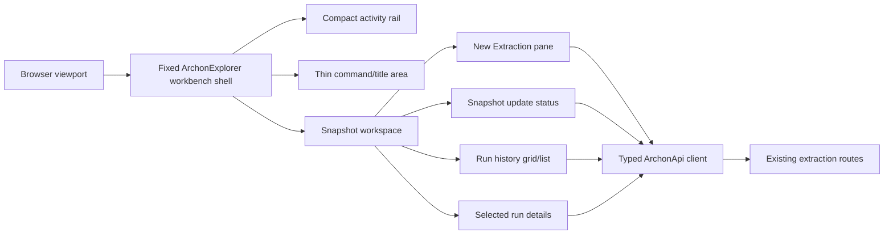

# Implementation Plan

## Document Control

| Field | Value |
| --- | --- |
| Work Package | WP005 - ArchonExplorer Visual System Remediation |
| Plan Output Path | `docs/024-ArchonExplorer-Visual-System-Remediation/plan-wp005-archonexplorer-visual-system-remediation.md` |
| Related Specification | `docs/024-ArchonExplorer-Visual-System-Remediation/spec-wp005-archonexplorer-visual-system-remediation.md` |
| Required Foundation Guidance Review | `docs/foundation/work-packages-ui.md`, `docs/foundation/archon_ui_brief.md` |
| Mandatory Wiki Standard | `./.github/instructions/wiki.instructions.md` |
| Mandatory Documentation-Pass Standard | `./.github/instructions/documentation-pass.instructions.md` |
| Status | Draft |

## Overall Project Structure

WP005 remediates the existing ArchonExplorer frontend visual system into a compact, fixed-viewport, IDE-like workbench. The work is expected to occur primarily in the existing ArchonExplorer frontend under `src/ArchonExplorer`, while preserving the Aspire/Vite hosting model and the existing typed ArchonApi client integration. The implementation must not create a new backend capability, must not alter extraction routes, and must not introduce a custom shadcn/ui color palette.

The plan assumes the implementation will use the repository's existing project structure and naming conventions rather than creating a parallel application shell. Work should be organized around vertical slices that each leave ArchonExplorer runnable and demonstrable from UI entry point through API-client interaction, state handling, error handling, validation, tests, and documentation/wiki review.

Planning artifacts for this work package remain in `docs/024-ArchonExplorer-Visual-System-Remediation/`. Architecture planning content is included in Appendix A of this document. Contributor-facing architecture, workflow, setup, terminology, or validation guidance must be written into the appropriate `./wiki` topic pages according to `./.github/instructions/wiki.instructions.md`; standalone implementation notes, implementation ledgers, architecture notes, or similar narrative completion records are prohibited for contributor-facing detail.

The implementation must explicitly review and update `docs/foundation/work-packages-ui.md` and `docs/foundation/archon_ui_brief.md` whenever WP005 changes, supersedes, or materially clarifies styling, layout, workbench, Snapshot workspace, Extraction Center, activity navigation, card/panel, icon/badge, tooltip/help, or shadcn/ui guidance. These foundation documents must not remain as stale sources that accidentally reintroduce page-like layout, card-heavy visual treatment, custom styling, outdated Extraction Center framing, or contradictory workbench terminology. If either document remains unchanged, the final record must state the sections reviewed and why the existing wording remains current.

## Mandatory Execution Rules for Every Work Item

Each active Work Item must be executed without stopping for status-only updates, ordinary confirmation prompts, or fixable intermediate failures. Once implementation starts for a Work Item, the executor must continue through implementation, validation, documentation/wiki review, and plan-record updates until the Work Item is complete. The only permitted stops during an active Work Item are explicit user interruption/change of direction or a true blocker that cannot be resolved from the specification, this plan, the codebase, or repository guidance.

For every Work Item that creates or updates source code, implementation must follow `./.github/instructions/documentation-pass.instructions.md` in full as a hard Definition of Done gate. Code-writing tasks must include developer-level comments for every class, component, hook, reducer, helper, callback, method, constructor, and non-public/internal type touched or introduced. Public methods and constructors must document every parameter. Properties whose meaning is not obvious from their names must be commented. Inline or block comments must explain purpose, logical flow, and algorithms where needed. Documentation-pass compliance is not optional polish.

For every Work Item, wiki review is mandatory under `./.github/instructions/wiki.instructions.md`. If the slice changes or materially clarifies developer-facing behaviour, architecture, workflows, terminology, setup, validation, runtime composition, or contributor guidance, the implementation must update the appropriate wiki topic page before the Work Item is complete. If no wiki update is needed, the implementation must explicitly record what was reviewed and why no update was required. Detailed contributor-facing material must not be dumped into `wiki/home.md`; `home.md` remains a concise landing page and table of contents. The mandatory documentation review for affected slices must also include `docs/foundation/work-packages-ui.md` and `docs/foundation/archon_ui_brief.md` so foundation roadmap and UI brief guidance remains aligned with the remediated visual system.

## Slice 1 - Fixed Workbench Shell and Scroll Containment

- [x] Work Item 1: Establish the fixed viewport workbench frame - Completed
  - **Purpose**: Convert ArchonExplorer from a browser-page-like layout into a fixed desktop-style workbench shell that keeps navigation, workspace tabs or command surfaces, and the active workspace visible without browser-level scrolling.
  - **Acceptance Criteria**:
	- App root fills the browser viewport and prevents the document body from becoming the primary scrolling surface.
	- Activity navigation, shell header/title area, and active workspace region remain visible during normal use.
	- Scrolling is contained inside explicit workbench regions such as panes, lists, grids, forms, or details areas.
	- The shell uses standard shadcn/ui theme tokens and does not introduce custom brand colors.
	- Existing Aspire/Vite hosting and ArchonExplorer startup remain compatible.
  - **Definition of Done**:
	- Workbench shell implemented through existing frontend entry points, layout components, and styling conventions.
	- Source-code changes comply with `./.github/instructions/documentation-pass.instructions.md`, including comments on every class/component/function/constructor touched or introduced and parameter comments where applicable.
	- Layout-level error states and accessible focus behaviour are preserved.
	- Unit, integration, and e2e tests relevant to the app shell are added or updated.
	- Type checking, frontend tests, production build, and relevant e2e shell tests pass or unrelated pre-existing failures are recorded.
	- Wiki review completed under `./.github/instructions/wiki.instructions.md`; workbench-shell terminology and architecture guidance are updated in the appropriate wiki topic page, or a no-change result is explicitly recorded.
	- Wiki review result includes selected topic page, whether a new page was needed, confirmation that `wiki/home.md` remains concise, and whether glossary/cross-links are sufficient.
	- Can execute end-to-end via the ArchonExplorer browser app: app launches to a fixed workbench frame with no normal browser document scrolling.
	- Executor must not stop mid-Work Item except for explicit user interruption or a true blocker.
	- [x] Task 1: Locate the current frontend shell composition and root styling - Completed.
	- [x] Step 1: Identified `src/ArchonExplorer/src/App.tsx`, `src/components/workbench/WorkbenchShell.tsx`, `src/components/workbench/**`, and `src/index.css` as the active shell composition and styling surface.
	- [x] Step 2: Identified `body`, `#root`, `.workbench-shell`, `.workbench-shell__main`, `.workbench-shell__work-region`, `.workbench-primary-sidebar`, and `.workbench-workspace` as the root and internal overflow boundaries that needed fixed-height containment.
	- [x] Step 3: Identified `src/test/workbench/workbenchShell.test.tsx` and `src/test-e2e/workbench-shell.spec.ts` as the shell validation surfaces to update; no obsolete marketing/page-section assertions were retained.
  - [x] Task 2: Implement fixed viewport shell composition - Completed.
	- [x] Step 1: Applied viewport-height root layout through existing React/Vite root and shell CSS without changing Aspire/Vite hosting.
	- [x] Step 2: Preserved the existing grid workbench regions while removing page-level expansion from the shell root and main frame.
	- [x] Step 3: Confined overflow to named internal regions using `data-scroll-root="workbench"` and `data-scroll-region` markers for activity rail, primary sidebar, and workspace.
	- [x] Step 4: Preserved semantic landmarks, keyboard-reachable controls, separator accessibility, command-palette focus behavior, and visible focus indicators.
  - [x] Task 3: Update validation coverage for shell behavior - Completed.
	- [x] Step 1: Updated Vitest shell rendering coverage to assert fixed shell and named scroll-region markers.
	- [x] Step 2: Updated Playwright coverage to assert the document/body is not the primary scrolling surface and the workbench root fills the viewport.
	- [x] Step 3: Confirmed shell tests target workbench landmarks and scroll containment rather than obsolete marketing/page-section DOM shape.
  - [x] Task 4: Complete documentation and wiki review - Completed.
	- [x] Step 1: Source files touched in this task retained or received developer-level comments consistent with the existing TypeScript documentation style; the new Playwright scenario includes purpose and logical-flow comments.
	- [x] Step 2: Reviewed `wiki/archonexplorer-frontend-foundation.md`, `wiki/glossary.md`, and `wiki/home.md`; updated the frontend foundation and glossary pages for fixed viewport and scroll-containment guidance, and left `wiki/home.md` unchanged as a concise landing page.
	- [x] Step 3: Explained `workbench shell` and `scroll containment` in the wiki with current-state narrative guidance and glossary entries.
  - **Completion Summary**: Implemented fixed viewport scroll containment in `src/ArchonExplorer/src/index.css` and marked the shell and internal regions in `WorkbenchShell.tsx`, `ActivityRail.tsx`, `PrimarySidebar.tsx`, and `TabbedWorkArea.tsx`. Updated `src/test/workbench/workbenchShell.test.tsx` and `src/test-e2e/workbench-shell.spec.ts` to verify the fixed workbench frame and browser document scroll containment. Updated `wiki/archonexplorer-frontend-foundation.md`, `wiki/glossary.md`, `docs/foundation/work-packages-ui.md`, and `docs/foundation/archon_ui_brief.md` so current contributor and foundation guidance matches the remediated shell behavior.
  - **Validation Performed**: `cd .\src\ArchonExplorer`; `npm run typecheck`; `npm run test` (128 passed); `npm run build`; `npm run test:e2e -- src/test-e2e/workbench-shell.spec.ts` (6 passed).
  - **Wiki Review Result / Impact Matrix**: Affected concepts were fixed viewport workbench shell, scroll containment, shell chrome visibility, and internal pane overflow ownership. Pages reviewed: `wiki/archonexplorer-frontend-foundation.md`, `wiki/glossary.md`, `wiki/home.md`, `docs/foundation/work-packages-ui.md`, and `docs/foundation/archon_ui_brief.md`. Pages updated: `wiki/archonexplorer-frontend-foundation.md`, `wiki/glossary.md`, `docs/foundation/work-packages-ui.md`, and `docs/foundation/archon_ui_brief.md`. Pages created or retired: none. Pages intentionally unchanged: `wiki/home.md`, because it remains only a landing page and already links to the correct frontend foundation topic page. Page-structure decision: the existing frontend foundation page is the correct home for current-state shell architecture and validation guidance; the glossary is the correct home for concise terminology; no new wiki page was needed.
  - **Files**:
	- `src/ArchonExplorer/src/**`: Existing frontend root, shell, layout, and style files to be updated in place.
	- `src/ArchonExplorer/src/test-e2e/workbench-shell.spec.ts`: Shell e2e tests to update or create if this is the repository's current test location.
	- `wiki/**`: Relevant workbench or frontend architecture topic pages to update if the shell model changes contributor guidance.
  - **Work Item Dependencies**: None. This is the foundational visual slice for all later work.
  - **Run / Verification Instructions**:
	- `cd .\src\ArchonExplorer`
	- `npm run typecheck`
	- `npm run test`
	- `npm run build`
	- `npm run test:e2e -- src/test-e2e/workbench-shell.spec.ts`
	- Manual UI path: launch ArchonExplorer and verify the app opens into a fixed workbench frame without browser-level scrolling.
  - **User Instructions**: No manual setup beyond the repository's existing ArchonExplorer startup requirements.

## Slice 2 - Compact Activity Rail and Command Surface

- [x] Work Item 2: Replace page-style navigation with compact workbench navigation - Completed
  - **Purpose**: Establish compact IDE-like activity navigation and command/header surfaces so the application reads as a technical workbench rather than a dashboard or website.
  - **Acceptance Criteria**:
	- Activity rail is compact, stable, and does not behave like a large sidebar by default.
	- Activity items have meaningful labels, accessible names, and tooltips for icon-only controls.
	- Decorative or random icons are removed.
	- Selected activity state is clear using standard shadcn/ui affordances, not custom colors.
	- Header/title/command area is visibly thinner and more operational.
  - **Definition of Done**:
	- Navigation and header changes are integrated into the runnable shell from Work Item 1.
	- Code-writing tasks comply with `./.github/instructions/documentation-pass.instructions.md` for all touched components, hooks, helpers, constructors, and functions.
	- Accessibility tests or e2e checks cover keyboard reachability and accessible names for icon-only controls.
	- Decorative icon/badge use is removed or justified as meaningful state/action affordance.
	- Wiki review completed under `./.github/instructions/wiki.instructions.md`; navigation terminology or workbench usage guidance updated or no-change result recorded with reviewed pages named.
	- Contributor-facing explanation, if needed, is written to a topic page with book-like narrative depth for conceptual material and not placed in `wiki/home.md`.
	- Can execute end-to-end via: open app, switch workspaces through compact rail, confirm the selected workspace changes without browser-page navigation.
	- Executor must not stop mid-Work Item except for explicit user interruption or a true blocker.
	- [x] Task 1: Inventory navigation labels, icons, badges, and command/header content - Completed.
	- [x] Step 1: Identified `src/ArchonExplorer/src/components/workbench/ActivityRail.tsx`, `workbenchActivities.ts`, `WorkbenchShell.tsx`, and `src/ArchonExplorer/src/index.css` as the active navigation, icon catalog, header, and styling surfaces.
	- [x] Step 2: Identified non-actionable `Later` rail badges for removal and replaced the decorative diagnostics `Sparkles` icon with the more meaningful `Wrench` icon.
	- [x] Step 3: Identified that icon-only activity controls needed exact accessible names, title text, visible tooltip text, and selected-state text/structure so the compact rail did not rely on color alone.
  - [x] Task 2: Implement compact rail and command surface - Completed.
	- [x] Step 1: Reduced the activity rail to a narrow icon-first workbench strip and removed the previous large-sidebar label-and-badge presentation.
	- [x] Step 2: Preserved meaningful activity icons and replaced the decorative diagnostics icon with a tooling-oriented icon.
	- [x] Step 3: Added exact activity accessible names, native `title` tooltip text, visible hover/focus tooltip text, hidden selected-state text, and a structural selected indicator for icon-only activity items.
	- [x] Step 4: Compactly restyled the header/title/command area with existing theme tokens and without introducing custom colors or promotional styling.
  - [x] Task 3: Update tests for navigation behavior - Completed.
	- [x] Step 1: Updated Vitest and Playwright coverage to verify keyboard-reachable activity buttons through exact accessible names.
	- [x] Step 2: Added assertions that selected activity state includes text and marker semantics rather than relying on color alone.
	- [x] Step 3: Removed obsolete rail badge/sidebar-style assumptions and added focused e2e coverage proving the compact rail stays narrow and hides visible rail labels.
  - [x] Task 4: Complete documentation and wiki review - Completed.
	- [x] Step 1: Source files touched in this task retained or received developer-level comments consistent with the existing TypeScript documentation style; modified tests include scenario comments and helper comments.
	- [x] Step 2: Updated `wiki/archonexplorer-frontend-foundation.md` and `wiki/glossary.md` for compact workbench navigation terminology, icon-only accessibility, selected-state semantics, and command-surface expectations.
	- [x] Step 3: Reviewed `wiki/home.md` and left it unchanged as a concise landing page; reviewed and updated `docs/foundation/work-packages-ui.md` and `docs/foundation/archon_ui_brief.md` so foundation guidance no longer suggests page-sidebar or hero-header treatment.
  - **Completion Summary**: Reworked ArchonExplorer navigation into a compact IDE-like rail in `ActivityRail.tsx` and `index.css`, removed non-actionable rail badges, added accessible/title/tooltip text for icon-only controls, added text-and-structure selected-state semantics, replaced the decorative diagnostics icon in `workbenchActivities.ts`, and compacted the WorkbenchShell title/command surface. Updated `workbenchShell.test.tsx` and `workbench-shell.spec.ts` to verify compact rail width, accessible activity names, keyboard-reachable activity buttons, selected-state semantics, and removal of obsolete rail badge assumptions. Updated `wiki/archonexplorer-frontend-foundation.md`, `wiki/glossary.md`, `docs/foundation/work-packages-ui.md`, and `docs/foundation/archon_ui_brief.md` so current contributor and foundation guidance matches the remediated compact navigation model.
  - **Validation Performed**: `cd .\src\ArchonExplorer`; `npm run typecheck`; `npm run test` (129 passed); `npm run build`; `npm run test:e2e -- src/test-e2e/workbench-shell.spec.ts` (7 passed).
  - **Wiki Review Result / Impact Matrix**: Affected concepts were compact activity rail, icon-only activity navigation accessibility, non-color selected activity state, meaningful icon use, command/header compactness, and removal of page-sidebar/hero-header treatment. Pages reviewed: `wiki/archonexplorer-frontend-foundation.md`, `wiki/glossary.md`, `wiki/home.md`, `docs/foundation/work-packages-ui.md`, and `docs/foundation/archon_ui_brief.md`. Pages updated: `wiki/archonexplorer-frontend-foundation.md`, `wiki/glossary.md`, `docs/foundation/work-packages-ui.md`, and `docs/foundation/archon_ui_brief.md`. Pages created or retired: none. Pages intentionally unchanged: `wiki/home.md`, because it remains only a landing page and already links to the correct frontend foundation topic page. Page-structure decision: the existing frontend foundation page is the correct home for current-state workbench navigation and command-surface guidance; the glossary is the correct home for concise terminology; foundation documents were updated because their roadmap guidance would otherwise be stale; no new wiki page was needed.
  - **Files**:
	- `src/ArchonExplorer/src/**`: Existing navigation, activity rail, shell header, tooltip, and test files.
	- `wiki/**`: Relevant frontend workbench or contributor workflow pages if navigation concepts change.
  - **Work Item Dependencies**: Work Item 1.
  - **Run / Verification Instructions**:
	- `cd .\src\ArchonExplorer`
	- `npm run typecheck`
	- `npm run test`
	- `npm run build`
	- `npm run test:e2e -- src/test-e2e/workbench-shell.spec.ts`
	- Manual UI path: launch ArchonExplorer, navigate through the compact activity rail using mouse and keyboard, and confirm no large sidebar/page-navigation feel remains.
  - **User Instructions**: None.

## Slice 3 - Snapshot Workspace Landing Context

- [x] Work Item 3: Promote Snapshot workspace as the primary operational context - Completed
  - **Purpose**: Make the Snapshot workspace the default or clearly primary ArchonExplorer operational surface, preparing it for current extraction state, snapshot state, run history, and future architecture investigation without implementing graph visualization.
  - **Acceptance Criteria**:
	- Snapshot workspace is the default landing context or clearly promoted as primary.
	- Workspace avoids dashboard cards, hero copy, and stacked page sections.
	- Empty/current/unavailable states use terse operational language.
	- The layout prepares regions for New Extraction, run history, selected details, and update status without requiring browser document scrolling.
	- No CodeSee-style graph canvas implementation is introduced in this work item.
  - **Definition of Done**:
	- Snapshot workspace renders inside the fixed workbench shell and is runnable after completion.
	- Code-writing tasks comply with `./.github/instructions/documentation-pass.instructions.md` for all touched components, helpers, hooks, and callbacks.
	- Snapshot terminology is used consistently across UI, tests, and developer-facing documentation where changed.
	- Tests verify the Snapshot workspace is reachable and no longer depends on old Extraction Center page layout.
	- Wiki review completed under `./.github/instructions/wiki.instructions.md`; if terminology shifts from Extraction Center to Snapshot workspace, the relevant wiki topic page and glossary/cross-links are updated.
	- Conceptually dense wiki content uses longer, book-like narrative prose, defines terms at first use, and includes a walkthrough if helpful.
	- Can execute end-to-end via: open app to Snapshot workspace and see compact operational regions without browser-page scrolling.
	- Executor must not stop mid-Work Item except for explicit user interruption or a true blocker.
	- [x] Task 1: Map existing Extraction Center and snapshot-related UI responsibilities - Completed.
	- [x] Step 1: Identified `src/ArchonExplorer/src/components/extraction-center/ExtractionCenter.tsx`, `TabbedWorkArea.tsx`, `workbenchActivities.ts`, `workbenchCommands.ts`, `workbenchStore.tsx`, and `StatusBar.tsx` as the current extraction landing, tab, activity, command, state, and status surfaces.
	- [x] Step 2: Identified `Extraction Center`, `Workbench Start`, dashboard fallback, and separate `Snapshots` placeholder terminology as the obsolete product-level landing terminology to replace with Snapshot Workspace while preserving extraction API terms and route semantics.
	- [x] Step 3: Identified the stacked header/form/summary/detail/history flow and long empty-history copy as page-like/prose-heavy states to compact into named workbench regions.
  - [x] Task 2: Implement Snapshot workspace layout skeleton - Completed.
	- [x] Step 1: Promoted `Snapshot Workspace` to the default workbench activity and required default tab so ArchonExplorer opens directly into the operational context.
	- [x] Step 2: Composed the workspace into named workbench regions for New Extraction, update status, run history, and run details using `data-snapshot-region` markers and contained overflow.
	- [x] Step 3: Replaced verbose history state and status copy with terse operational language such as `No runs yet.`, `Submit an explicit extraction request.`, `No active update.`, and `Current`.
	- [x] Step 4: Preserved the explicit no-graph/no-canvas boundary; no graph visualization, dashboard query, search result, lens, visualization, or snapshot lifecycle behavior was introduced.
  - [x] Task 3: Update tests for landing and terminology - Completed.
	- [x] Step 1: Updated Vitest and Playwright coverage so Snapshot Workspace is the default/primary context, default tab, fallback tab, selected activity, and accessible main landmark.
	- [x] Step 2: Updated obsolete Extraction Center command/tab/activity wording in tests to Snapshot Workspace terminology while retaining extraction API, form, history, polling, duplicate-request, and produced-snapshot behavior assertions.
	- [x] Step 3: Verified primary controls and region markers are visible in the fixed workbench without browser-page scrolling through shell and extraction e2e coverage.
  - [x] Task 4: Complete documentation and wiki review - Completed.
	- [x] Step 1: Source files touched in this task retained or received developer-level comments consistent with the existing TypeScript documentation style; comments were updated where terminology changed from Extraction Center/Workbench Start to Snapshot Workspace.
	- [x] Step 2: Updated `wiki/archonexplorer-frontend-foundation.md`, `wiki/archonexplorer-extraction-center.md`, and `wiki/glossary.md` for Snapshot Workspace terminology, default landing behavior, compact region model, command terminology, and workflow guidance.
	- [x] Step 3: Reviewed `wiki/home.md` and kept it concise with only reader-path/current-summary wording updated; reviewed and updated `docs/foundation/work-packages-ui.md` and `docs/foundation/archon_ui_brief.md` to prevent stale dashboard, standalone Extraction Center, page-like, or stacked-section guidance from re-entering future UI work.
  - **Completion Summary**: Promoted Snapshot Workspace to the default ArchonExplorer operational context by updating the activity catalog, workbench default tab/state recovery, tab rendering, command palette registration, status bar defaults, and extraction workspace composition. The existing extraction workflow now renders inside compact named regions for New Extraction, update status, run history, and details while preserving the typed ArchonApi client and existing extraction routes. Updated unit and e2e tests to assert Snapshot Workspace landing, command terminology, compact region markers, terse empty-state copy, accessible main landmark naming, and continued extraction workflow behavior.
  - **Validation Performed**: `cd .\src\ArchonExplorer`; `npm run typecheck`; `npm run test` (129 passed); `npm run build`; `npm run test:e2e -- src/test-e2e/workbench-shell.spec.ts` (7 passed); `npm run test:e2e -- src/test-e2e/extraction-center.spec.ts` (8 passed).
  - **Wiki Review Result / Impact Matrix**: Affected concepts were Snapshot Workspace as default landing context, Extraction Center terminology demotion to workflow/API context, compact Snapshot workspace regions, terse empty/current/unavailable states, command palette terminology, fixed-workbench landing validation, and foundation UI roadmap wording. Pages reviewed: `wiki/archonexplorer-frontend-foundation.md`, `wiki/archonexplorer-extraction-center.md`, `wiki/glossary.md`, `wiki/home.md`, `docs/foundation/work-packages-ui.md`, and `docs/foundation/archon_ui_brief.md`. Pages updated: all reviewed pages received either terminology, reader-path, workflow, glossary, or foundation guidance updates. Pages created, retired, split, or renamed: none. Pages intentionally unchanged in structure: `wiki/home.md` remains a concise landing page and was not used for detailed guidance; `wiki/archonexplorer-extraction-center.md` remains the correct topic page because the workflow is still the extraction/snapshot operational journey even though its current title and narrative now identify Snapshot Workspace. Page-structure decision: the frontend foundation page remains the correct home for shell/runtime/provider guidance; the dedicated extraction workflow page remains the correct home for operational workflow guidance; the glossary is the correct home for concise terminology; foundation documents remain roadmap/product guidance and now point future work away from dashboard or standalone page treatment.
  - **Files**:
	- `src/ArchonExplorer/src/**`: Existing workspace, routing, extraction center, snapshot, and shell files.
	- `src/ArchonExplorer/src/test-e2e/**`: E2E tests for workspace landing and extraction flow.
	- `wiki/**`: Workbench, Snapshot workspace, Extraction Center, and glossary pages as applicable.
  - **Work Item Dependencies**: Work Items 1 and 2.
  - **Run / Verification Instructions**:
	- `cd .\src\ArchonExplorer`
	- `npm run typecheck`
	- `npm run test`
	- `npm run build`
	- `npm run test:e2e -- src/test-e2e/workbench-shell.spec.ts`
	- Manual UI path: launch app and confirm Snapshot workspace is the primary operational context.
  - **User Instructions**: None.

## Slice 4 - Compact New Extraction Pane

- [x] Work Item 4: Remediate extraction submission into a docked New Extraction pane - Completed
  - **Purpose**: Move the existing extraction start form into a compact docked workbench pane that supports fast repeated extraction requests without page scrolling or large explanatory sections.
  - **Acceptance Criteria**:
	- Existing extraction submission still uses the typed ArchonApi client and `POST /extractions`.
	- No `/api/extractions` prefix, recursive solution discovery, filesystem browsing, or new backend behavior is introduced.
	- Repository root, explicit solution paths, and submit action are prioritized.
	- Optional branch, commit SHA, requested-by, and metadata fields are grouped compactly.
	- Repeated solution path entry uses compact rows.
	- API-unconfigured or API-unavailable states show concise operational feedback.
  - **Definition of Done**:
	- A valid mocked extraction request can be submitted end to end from the New Extraction pane.
	- Code-writing tasks comply with `./.github/instructions/documentation-pass.instructions.md`, including comments on all modified form components, validation helpers, callbacks, and hooks.
	- Validation and error handling preserve safe diagnostic boundaries and do not expose raw secrets, stack traces, connection strings, raw Cypher, tokens, or arbitrary backend exception text.
	- Tests cover valid submission, unavailable API feedback, solution-path rows, and route correctness.
	- Wiki review completed under `./.github/instructions/wiki.instructions.md`; contributor guidance for extraction workflow terminology is updated or an explicit no-change review is recorded.
	- Any detailed workflow explanation is routed to the correct wiki topic page, not a standalone implementation note and not `wiki/home.md`.
	- Can execute end-to-end via: Snapshot workspace > New Extraction pane > submit mocked extraction > accepted run status is visible.
	- Executor must not stop mid-Work Item except for explicit user interruption or a true blocker.
	- [x] Task 1: Inventory the existing extraction form behavior - Completed.
	- [x] Step 1: Identified request model mapping and validation in `extractionFormState.ts`, including repository root trimming, explicit solution path normalization, optional field normalization, metadata parsing, duplicate-request mapping, and safe server validation issue mapping.
	- [x] Step 2: Identified the existing TanStack Query mutation path `useStartExtraction` -> `ArchonApiClient.startExtraction` -> `archonApiRoutes.extraction.start`, preserving typed-client submission through `POST /extractions`.
	- [x] Step 3: Identified existing explanatory form copy, broad optional-field layout, and current tests in `src/test/extraction-center/extractionCenter.test.tsx` and `src/test-e2e/extraction-center.spec.ts` as the validation surfaces to update.
  - [x] Task 2: Implement compact pane layout - Completed.
	- [x] Step 1: Remediated the start form into the docked `New Extraction` pane inside the existing Snapshot Workspace left region without introducing new routes, backend behavior, or a separate page destination.
	- [x] Step 2: Prioritized repository root directory, compact repeated explicit solution path rows, and the submit action with terse `POST /extractions with explicit paths.` operational copy.
	- [x] Step 3: Grouped branch name, commit SHA, requested-by, and metadata under compact optional context so required repeated-submission controls remain dominant.
	- [x] Step 4: Kept submit as a standard small toolkit button without promotional styling, custom color, custom type scale, or card-heavy treatment.
	- [x] Step 5: Added concise operational guarded-submit text for unconfigured and unavailable API states while preserving persistent safe connectivity details for correction context.
  - [x] Task 3: Preserve request semantics - Completed.
	- [x] Step 1: Continued using the existing typed ArchonApi client and `useStartExtraction` mutation rather than introducing direct `fetch` calls in form components.
	- [x] Step 2: Preserved direct route `POST /extractions` and strengthened e2e coverage to assert that `/api/extractions` is not used.
	- [x] Step 3: Avoided recursive solution discovery, filesystem browsing, route prefix changes, API shape changes, and new backend behavior assumptions.
  - [x] Task 4: Update validation coverage - Completed.
	- [x] Step 1: Updated Vitest rendering coverage for `New Extraction` pane terminology, required-field grouping, compact submit button rendering, and concise API-unconfigured feedback while keeping existing request mapping and validation helper coverage.
	- [x] Step 2: Updated Playwright mocked submission coverage to exercise repeated solution-path rows and accepted-run feedback through the compact pane.
	- [x] Step 3: Added a focused e2e route assertion preventing `/api/extractions` regression during the mocked `POST /extractions` submission path.
  - [x] Task 5: Complete documentation and wiki review - Completed.
	- [x] Step 1: Source and test files touched in this task retained or received developer-level comments consistent with the existing TypeScript documentation style; no undocumented new helper, hook, class, or callback surface was introduced.
	- [x] Step 2: Updated `wiki/archonexplorer-extraction-center.md`, `wiki/archonexplorer-frontend-foundation.md`, and `wiki/glossary.md` for docked New Extraction pane terminology, primary/optional form grouping, compact repeated solution-path rows, safe API feedback, and route-preserving submission workflow.
	- [x] Step 3: Reviewed `wiki/home.md` and left it unchanged as a concise landing page; reviewed and updated `docs/foundation/work-packages-ui.md` and `docs/foundation/archon_ui_brief.md` so foundation guidance reflects the docked New Extraction pane and does not reintroduce page-scrolling or standalone Extraction Center treatment.
  - **Completion Summary**: Remediated extraction submission into a compact docked `New Extraction` pane by updating `ExtractionRequestForm.tsx`, `ExtractionCenter.tsx`, and `index.css`. The pane now prioritizes repository root directory, explicit solution-path rows, and a small standard submit action, groups optional branch/commit/requested-by/metadata context compactly, keeps required controls visible within the fixed Snapshot Workspace split, and uses concise guarded API feedback. Preserved typed-client semantics through `useStartExtraction` and `ArchonApiClient.startExtraction`, preserved direct `POST /extractions`, and did not add recursive discovery, filesystem browsing, `/api` route prefixes, or backend behavior. Updated Vitest and Playwright coverage for New Extraction pane rendering, repeated solution rows, mocked accepted submission, safe unconfigured feedback, and `/api/extractions` regression prevention.
  - **Validation Performed**: `cd .\src\ArchonExplorer`; `npm run typecheck`; `npm run test` (129 passed); `npm run build`; `npm run test:e2e -- src/test-e2e/extraction-center.spec.ts` (8 passed). During validation, a compact-pane overlap issue that blocked the `Add solution path` button in Playwright was fixed by constraining optional context as the internal form scroll region.
  - **Wiki Review Result / Impact Matrix**: Affected concepts were docked New Extraction pane, extraction start form terminology, compact required/optional request grouping, repeated explicit solution-path rows, safe API-unconfigured/unavailable feedback, direct `POST /extractions` route preservation, and Snapshot Workspace workflow validation. Pages reviewed: `wiki/archonexplorer-extraction-center.md`, `wiki/archonexplorer-frontend-foundation.md`, `wiki/glossary.md`, `wiki/home.md`, `docs/foundation/work-packages-ui.md`, and `docs/foundation/archon_ui_brief.md`. Pages updated: `wiki/archonexplorer-extraction-center.md`, `wiki/archonexplorer-frontend-foundation.md`, `wiki/glossary.md`, `docs/foundation/work-packages-ui.md`, and `docs/foundation/archon_ui_brief.md`. Pages created, retired, split, or renamed: none. Pages intentionally unchanged: `wiki/home.md`, because it remains only a landing page and already links to the correct Snapshot Workspace and frontend foundation topic pages. Page-structure decision: the existing Snapshot Workspace topic page is the correct home for current extraction workflow guidance; the frontend foundation page is the correct home for shell/layout/runtime implications; the glossary is the correct home for the new concise `New Extraction pane` term; foundation documents were updated because their roadmap guidance would otherwise remain too generic about the extraction form; no new wiki page was needed.
  - **Files**:
	- `src/ArchonExplorer/src/**`: Existing extraction form, API client usage, mutation hooks, workspace layout, and validation helpers.
	- `src/ArchonExplorer/src/test-e2e/extraction-center.spec.ts`: Existing extraction e2e test to update for Snapshot/New Extraction terminology or replace with equivalent current test path.
	- `wiki/**`: Relevant extraction workflow and glossary pages if terminology or workflow guidance changes.
  - **Work Item Dependencies**: Work Items 1, 2, and 3.
  - **Run / Verification Instructions**:
	- `cd .\src\ArchonExplorer`
	- `npm run typecheck`
	- `npm run test`
	- `npm run build`
	- `npm run test:e2e -- src/test-e2e/extraction-center.spec.ts`
	- Manual UI path: Snapshot workspace > New Extraction pane > enter repository root and solution paths > submit > observe accepted run feedback.
  - **User Instructions**: None.

## Slice 5 - Compact Snapshot Update Status

- [x] Work Item 5: Show extraction progress as focused Snapshot update status - Completed
  - **Purpose**: Present active extraction progress inside the Snapshot workspace as a small operational status surface using existing accepted-run and polling feedback, without creating a global output pane or log console.
  - **Acceptance Criteria**:
	- Snapshot update status uses existing API feedback from accepted run status and polling.
	- Queued, running, completed, failed, cancelled, unavailable, and unknown states are represented when applicable.
	- Current progress stage, progress message, warning count, error count, and produced snapshot identity are shown when available.
	- Active work has a clear but non-dominant working indication.
	- No global output/log pane, event stream, build-output clone, or verbose diagnostic console is introduced.
	- Polling cadence remains bounded and is not tightened solely because status is visible.
  - **Definition of Done**:
	- Submitted extraction status flows from API client/TanStack Query state into the Snapshot update status surface.
	- Code-writing tasks comply with `./.github/instructions/documentation-pass.instructions.md`, including comments on status derivation helpers, hooks, callbacks, and components.
	- Safe diagnostic boundaries are preserved; raw stack traces, secrets, raw Cypher, driver details, tokens, and arbitrary backend exception text are not displayed.
	- Accessibility is addressed with appropriate status exposure/announcement where applicable and color is not the only state indicator.
	- Tests cover status states, snapshot identity display, warning/error count display, and safe diagnostic rendering.
	- Wiki review completed under `./.github/instructions/wiki.instructions.md`; Snapshot update status terminology and workflow guidance are updated or no-change result recorded.
	- Can execute end-to-end via: submit mocked extraction and observe compact Snapshot update status progress through accepted/running/completed or failure state.
	- Executor must not stop mid-Work Item except for explicit user interruption or a true blocker.
	- [x] Task 1: Identify current polling and status data flow - Completed.
	- [x] Step 1: Located accepted-run handling in `ExtractionCenter.tsx`, where `useStartExtraction` stores the accepted response, selects the run, invalidates extraction query keys, and starts shared selected-run tracking.
	- [x] Step 2: Located selected-run polling in `useExtractionRunPolling`, which reads `GET /extractions/{runId}` through TanStack Query, uses existing bounded polling defaults from `api/polling.ts`, and stops for terminal states.
	- [x] Step 3: Identified available safe status fields on `ExtractionRunStatusResponse`: run ID, lifecycle status, progress stage, progress message, warning count, error count, and optional produced snapshot identity; identified raw diagnostics, stack traces, secrets, connection strings, raw Cypher, tokens, driver details, metadata values, and arbitrary backend exception text as unsafe fields that must not be rendered.
  - [x] Task 2: Implement compact status surface - Completed.
	- [x] Step 1: Reworked the existing Snapshot workspace `update-status` region to render a focused `Update status` surface from accepted-run, selected polling, refresh, and safe error state rather than a separate output or log pane.
	- [x] Step 2: Mapped queued, running, completed, failed, cancelled, unavailable, stalled, and unknown states to compact visible text labels using the existing polling helper semantics.
	- [x] Step 3: Displayed stage, message, warning count, error count, and produced snapshot identity when safe API fields are available.
	- [x] Step 4: Added polite status semantics, explicit text labels, and non-color-only badge text while preserving compact shadcn-compatible styling.
  - [x] Task 3: Preserve polling and safety behavior - Completed.
	- [x] Step 1: Reused existing TanStack Query server state from the accepted mutation and selected-run polling hook rather than copying status responses into local workbench state.
	- [x] Step 2: Kept polling bounded at the existing `useExtractionRunPolling` cadence and did not tighten intervals because status is visible.
	- [x] Step 3: Rendered only normalized safe errors and API-approved aggregate status fields; no raw diagnostics, metadata values, `/api` route prefix, output pane, log console, event stream, or build-output clone was introduced.
  - [x] Task 4: Update tests - Completed.
	- [x] Step 1: Added mocked Vitest coverage for Snapshot update status lifecycle mapping, selected polling overriding accepted status, snapshot identity display, warning/error counts, unavailable status, and unsafe diagnostic omission.
	- [x] Step 2: Updated Playwright extraction coverage so the selected running-to-completed journey verifies the compact update status follows active and terminal polling state, and the valid submission journey verifies accepted-run update status feedback.
	- [x] Step 3: Added regression assertions that no global output pane, log console, or event stream appears in the status workflow.
  - [x] Task 5: Complete documentation and wiki review - Completed.
	- [x] Step 1: Source and test files touched in this task retained or received developer-level comments consistent with the existing TypeScript documentation style; no undocumented helper, callback, or component surface was introduced.
	- [x] Step 2: Updated `wiki/archonexplorer-extraction-center.md`, `wiki/archonexplorer-frontend-foundation.md`, and `wiki/glossary.md` for Snapshot update status terminology, selected/accepted status flow, bounded polling, safe diagnostic boundaries, and no-output-pane expectations.
	- [x] Step 3: Reviewed `wiki/home.md` and left it unchanged as a concise landing page; reviewed and updated `docs/foundation/work-packages-ui.md` and `docs/foundation/archon_ui_brief.md` so foundation guidance explicitly preserves focused update status rather than global log/output treatment.
  - **Completion Summary**: Implemented focused Snapshot update status by wiring the `update-status` region to existing accepted-run data, selected-run polling data, refresh state, and normalized safe polling errors. Reworked `ExtractionRunSummary.tsx` into a compact status surface that maps queued, running, completed, failed, cancelled, unavailable, stalled, and unknown states; displays stage, message, warning count, error count, and produced snapshot identity when available; exposes text and polite status semantics; and avoids global output/log/event-stream behavior. Updated `ExtractionCenter.tsx` to prefer polling-backed selected status when available while preserving TanStack Query server-state ownership and existing bounded polling cadence. Updated Vitest and Playwright coverage for status mapping, accepted submission feedback, selected polling progress, safe diagnostic rendering, snapshot identity, warning/error counts, and no output/log pane regression.
	- **Validation Performed**: `cd .\src\ArchonExplorer`; `npm run typecheck`; `npm run test` (132 passed); `npm run build`; `npm run test:e2e -- src/test-e2e/extraction-center.spec.ts` (8 passed). During validation, an unsafe-fixture wording regression in compact status safe-note copy was corrected so the UI explains diagnostic safety without rendering forbidden raw-diagnostic terms.
  - **Wiki Review Result / Impact Matrix**: Affected concepts were compact Snapshot update status, accepted-run versus selected polling status precedence, lifecycle status labels, warning/error aggregate display, produced snapshot identity display, bounded polling expectations, safe unavailable status presentation, and no global output/log/event-stream treatment. Pages reviewed: `wiki/archonexplorer-extraction-center.md`, `wiki/archonexplorer-frontend-foundation.md`, `wiki/glossary.md`, `wiki/home.md`, `docs/foundation/work-packages-ui.md`, and `docs/foundation/archon_ui_brief.md`. Pages updated: `wiki/archonexplorer-extraction-center.md`, `wiki/archonexplorer-frontend-foundation.md`, `wiki/glossary.md`, `docs/foundation/work-packages-ui.md`, and `docs/foundation/archon_ui_brief.md`. Pages created, retired, split, or renamed: none. Pages intentionally unchanged: `wiki/home.md`, because it remains only a landing page and already links to the correct Snapshot Workspace and frontend foundation topic pages. Page-structure decision: the existing Snapshot Workspace topic page is the correct home for workflow guidance; the frontend foundation page is the correct home for shell/runtime/provider implications; the glossary is the correct home for concise `Snapshot update status` terminology; foundation documents were updated because their high-level guidance needed to explicitly prevent global output/log treatment; no new wiki page was needed.
  - **Files**:
	- `src/ArchonExplorer/src/**`: Existing extraction polling hooks, Snapshot workspace components, status helpers, tests.
	- `wiki/**`: Relevant extraction/Snapshot workflow and glossary pages.
  - **Work Item Dependencies**: Work Item 4.
  - **Run / Verification Instructions**:
	- `cd .\src\ArchonExplorer`
	- `npm run typecheck`
	- `npm run test`
	- `npm run build`
	- `npm run test:e2e -- src/test-e2e/extraction-center.spec.ts`
	- Manual UI path: Snapshot workspace > submit extraction > observe compact update status and resulting snapshot identity when mocked/completed.
  - **User Instructions**: None.

## Slice 6 - Dense Run History Grid

- [x] Work Item 6: Convert recent extraction runs to a dense workbench grid/list - Completed
  - **Purpose**: Replace card-heavy run history with a compact scannable grid or workbench list that supports power-user review of recent extraction runs.
  - **Acceptance Criteria**:
	- Recent runs display in a dense grid, table, or workbench list rather than large cards.
	- Rows support scanning run ID, status, repository, solution count, started/completed time, warning count, error count, and snapshot identity where available.
	- Status is shown with terse text and compact meaningful state treatment; oversized or decorative badges are removed.
	- Grid/list is structured so future virtualization can be added if run counts grow.
	- Missing/unavailable data uses concise operational messages.
  - **Definition of Done**:
	- Run history remains loaded through existing `GET /extractions` typed API client behavior.
	- Code-writing tasks comply with `./.github/instructions/documentation-pass.instructions.md` for all grid/list components, row helpers, formatting functions, and callbacks.
	- Tests cover dense history rendering, status representation, fields shown, and no unsafe diagnostics.
	- Accessibility of table/list semantics and row selection/focus is preserved.
	- Wiki review completed under `./.github/instructions/wiki.instructions.md`; history-grid terminology or contributor guidance is updated or no-change result recorded.
	- Can execute end-to-end via: Snapshot workspace > view recent runs in dense history grid/list loaded from mocked API data.
	- Executor must not stop mid-Work Item except for explicit user interruption or a true blocker.
	- [x] Task 1: Inventory existing run history display and data fields - Completed.
	- [x] Step 1: Located current `GET /extractions` query usage in `ExtractionCenter.tsx` through `useExtractionHistory`, TanStack Query, and the typed `ArchonApiClient.getExtractionHistory` path.
	- [x] Step 2: Identified the existing history surface as a semantic table already integrated with selected-run polling, with compacting needed around grid naming, scroll ownership, status treatment, row-selection accessibility, and explicit no-card validation.
	- [x] Step 3: Identified available `ExtractionRunSummaryResponse` fields and helpers: run ID, lifecycle status, started/completed UTC, repository root directory, solution count, warning count, error count, snapshot identity, `formatStatus`, `formatTimestamp`, and `formatCount`.
  - [x] Task 2: Implement dense grid/list - Completed.
	- [x] Step 1: Reworked the populated history surface into `HistoryGrid` with `aria-label="Dense recent extraction runs"` while preserving semantic table structure.
	- [x] Step 2: Kept compact scan columns for run ID, status, started/completed timestamps, repository root, solution count, diagnostics counts, snapshot identity, and action.
	- [x] Step 3: Replaced oversized/decorative row status badge treatment with terse text inside a compact status affordance and retained text as the primary state signal.
	- [x] Step 4: Added a named internal scroll boundary with `data-scroll-region="run-history-grid"` and CSS containment so overflow remains inside the history region.
  - [x] Task 3: Add selection integration hook for details - Completed.
	- [x] Step 1: Preserved local UI selection as the existing row action callback that records only the selected run identifier.
	- [x] Step 2: Avoided duplicating server state into local stores; history remains TanStack Query server state and selected-run detail remains polling-backed server state.
	- [x] Step 3: Updated row action accessible names to select specific run identifiers, keeping selected runs ready for the details region and current runnability intact.
  - [x] Task 4: Update tests and accessibility checks - Completed.
	- [x] Step 1: Updated Vitest and Playwright coverage to verify the named dense recent-runs table and populated scan fields.
	- [x] Step 2: Updated row-selection coverage to use explicit accessible names such as `Select run run-e2e-001 for details`, selected state, and existing keyboard-reachable button semantics.
	- [x] Step 3: Added no-card-heavy regression coverage and updated e2e journeys that previously targeted generic `View details` labels.
  - [x] Task 5: Complete documentation and wiki review - Completed.
	- [x] Step 1: Source and test files touched in this task retained or received developer-level comments consistent with the existing TypeScript documentation style; new/renamed helpers and callbacks are documented in place.
	- [x] Step 2: Updated `wiki/archonexplorer-extraction-center.md`, `wiki/archonexplorer-frontend-foundation.md`, and `wiki/glossary.md` for dense run history grid terminology, scan fields, selected-run flow, scroll ownership, safety boundaries, and validation guidance.
	- [x] Step 3: Reviewed `wiki/home.md` and left it unchanged as a concise landing page; reviewed and updated `docs/foundation/work-packages-ui.md` and `docs/foundation/archon_ui_brief.md` so foundation guidance explicitly preserves dense run-history grid/list treatment and avoids card-heavy presentation.
  - **Completion Summary**: Converted recent extraction runs into a dense workbench grid/list by updating `ExtractionCenter.tsx` and `index.css`. The populated history surface now renders as `HistoryGrid` with a named dense recent-runs table, required scan columns, compact text-based status treatment, an internal scroll region for future larger histories, explicit row-selection accessible names, and preserved local-only selected-run ID integration with existing polling-backed details. Updated Vitest and Playwright coverage for dense grid semantics, scan fields, selected-row accessibility, safe diagnostics, and no card-heavy history rendering.
	- **Validation Performed**: `cd .\src\ArchonExplorer`; `npm run typecheck`; `npm run test` (132 passed after correcting an overly strict class-order assertion); `npm run build`; `npm run test:e2e -- src/test-e2e/extraction-center.spec.ts` (8 passed after updating e2e selectors to the new explicit row-selection accessible names and adding accepted-run polling data).
  - **Wiki Review Result / Impact Matrix**: Affected concepts were dense run history grid, recent-run scan fields, text-based compact status, row-level selected-run integration, internal history overflow, future virtualization seam, and removal of card-heavy/decorative history treatment. Pages reviewed: `wiki/archonexplorer-extraction-center.md`, `wiki/archonexplorer-frontend-foundation.md`, `wiki/glossary.md`, `wiki/home.md`, `docs/foundation/work-packages-ui.md`, and `docs/foundation/archon_ui_brief.md`. Pages updated: `wiki/archonexplorer-extraction-center.md`, `wiki/archonexplorer-frontend-foundation.md`, `wiki/glossary.md`, `docs/foundation/work-packages-ui.md`, and `docs/foundation/archon_ui_brief.md`. Pages created, retired, split, or renamed: none. Pages intentionally unchanged: `wiki/home.md`, because it remains only a landing page and already links to the correct Snapshot Workspace and frontend foundation topic pages. Page-structure decision: the existing Snapshot Workspace page is the correct home for detailed run-history workflow guidance; the frontend foundation page is the correct home for shell/runtime validation implications; the glossary is the correct home for concise `run history grid` terminology; no new page was needed.
  - **Files**:
	- `src/ArchonExplorer/src/**`: Run history components, extraction query hooks, formatting helpers, tests.
	- `wiki/**`: Relevant Snapshot/extraction workflow pages if history behaviour is documented.
  - **Work Item Dependencies**: Work Items 3 and 5.
  - **Run / Verification Instructions**:
	- `cd .\src\ArchonExplorer`
	- `npm run typecheck`
	- `npm run test`
	- `npm run build`
	- `npm run test:e2e -- src/test-e2e/extraction-center.spec.ts`
	- Manual UI path: Snapshot workspace > Recent runs > scan dense grid/list and select a run.
  - **User Instructions**: None.

## Slice 7 - Selected Run Details Pane

- [x] Work Item 7: Render selected run details as compact workbench properties - Completed
  - **Purpose**: Replace large prose details panels with a compact property-grid, definition-list, or dense table presentation for the selected extraction run.
  - **Acceptance Criteria**:
	- Selecting a run shows details in a docked or split details region.
	- Details use compact property-style presentation rather than large prose cards.
	- Details continue to use existing `GET /extractions/{runId}` typed API client behavior where needed.
	- Missing or unavailable detail state uses concise operational messages.
	- Unsafe diagnostics are not displayed.
  - **Definition of Done**:
	- End-to-end selection from history to details works in the Snapshot workspace.
	- Code-writing tasks comply with `./.github/instructions/documentation-pass.instructions.md` for all details components, hooks, helper functions, callbacks, and properties whose meaning is not obvious.
	- Tests cover row selection, details loading, compact property rendering, missing/unavailable state, and safe diagnostic boundaries.
	- Accessibility supports keyboard selection and details region naming where applicable.
	- Wiki review completed under `./.github/instructions/wiki.instructions.md`; contributor guidance for run details or extraction inspection is updated or no-change result recorded.
	- Can execute end-to-end via: Snapshot workspace > recent runs grid/list > select run > details appear in compact region.
	- Executor must not stop mid-Work Item except for explicit user interruption or a true blocker.
	- [x] Task 1: Inventory current run detail behavior - Completed.
	- [x] Step 1: Located selected-run state in `ExtractionCenter.tsx`, where history row selection stores only the selected run identifier and `useExtractionRunPolling` reads `GET /extractions/{runId}`.
	- [x] Step 2: Identified `ExtractionRunDetail.tsx` as the verbose detail display surface; unsafe diagnostic boundaries already excluded stack traces, secrets, raw Cypher, driver details, and metadata values.
	- [x] Step 3: Identified `src/test/extraction-center/extractionCenter.test.tsx` and `src/test-e2e/extraction-center.spec.ts` as the selected-run detail validation surfaces.
  - [x] Task 2: Implement compact details presentation - Completed.
	- [x] Step 1: Kept selected run details in the existing docked/split `run-details` Snapshot workspace region and constrained it as an internal workbench pane.
	- [x] Step 2: Rendered run, request, progress, timing, produced snapshot, and persistence diagnostics as compact property groups and dense timing rows.
	- [x] Step 3: Replaced the long typed-client explanatory paragraph and broad action copy with terse operational labels and state text.
	- [x] Step 4: Shortened missing detail states such as persistence diagnostics and timing absence while preserving honest unavailable status.
  - [x] Task 3: Preserve API and state semantics - Completed.
	- [x] Step 1: Continued to use the existing typed API client route `GET /extractions/{runId}` through `useExtractionRunPolling`; no direct component fetch calls or route changes were introduced.
	- [x] Step 2: Kept selected-run status as TanStack Query server state and did not copy status payloads into local shell or feature stores.
	- [x] Step 3: Kept local state limited to selected run identity, follow-up action callbacks, and browser-owned form workflow state.
  - [x] Task 4: Update tests - Completed.
	- [x] Step 1: Updated selection-to-details unit and e2e coverage to assert `Selected run properties`, property-grid structure, and details-pane behavior.
	- [x] Step 2: Preserved safe-diagnostics regression assertions for unsafe backend terms, `/api/extractions`, metadata values, and raw diagnostic language.
	- [x] Step 3: Updated the Playwright details flow to verify the compact details region renders selected-run properties and no longer depends on the old prose monitor paragraph.
  - [x] Task 5: Complete documentation and wiki review - Completed.
	- [x] Step 1: Source and test files touched in this task retained or received developer-level comments consistent with the existing TypeScript documentation style; newly added helper property documentation was included for the nested timing-section option.
	- [x] Step 2: Updated `wiki/archonexplorer-extraction-center.md`, `wiki/archonexplorer-frontend-foundation.md`, and `wiki/glossary.md` for selected-run properties terminology, compact property groups, internal detail-pane overflow, terse missing states, and safe run inspection workflow.
	- [x] Step 3: Reviewed `wiki/home.md` and left it unchanged as a concise landing page; reviewed and updated `docs/foundation/work-packages-ui.md` and `docs/foundation/archon_ui_brief.md` so foundation guidance preserves compact property-grid details rather than long prose panels or stacked cards.
  - **Completion Summary**: Remediated selected run details into compact workbench properties by updating `ExtractionRunDetail.tsx` and `index.css`. The selected run details pane now uses `Selected run properties`, groups run/request/progress/timing/persistence facts inside a named `selected-run-properties` scroll region, keeps follow-up actions below the property grid, shortens unavailable and missing-data copy, preserves produced-snapshot and duplicate-request boundaries, and keeps unsafe diagnostics out of the UI. Updated Vitest and Playwright coverage for compact selected-run property rendering, selection-to-details behavior, safe diagnostics, and removal of the old prose monitor paragraph.
	- **Validation Performed**: `cd .\src\ArchonExplorer`; `npm run typecheck`; `npm run test` (132 passed); `npm run build`; `npm run test:e2e -- src/test-e2e/extraction-center.spec.ts` (8 passed).
  - **Wiki Review Result / Impact Matrix**: Affected concepts were selected run properties, selected-run detail inspection, internal details-pane overflow, compact property-grid presentation, dense timing/persistence rows, concise unavailable detail states, typed `GET /extractions/{runId}` preservation, TanStack Query server-state ownership, safe diagnostic boundaries, and foundation UI guidance. Pages reviewed: `wiki/archonexplorer-extraction-center.md`, `wiki/archonexplorer-frontend-foundation.md`, `wiki/glossary.md`, `wiki/home.md`, `docs/foundation/work-packages-ui.md`, and `docs/foundation/archon_ui_brief.md`. Pages updated: `wiki/archonexplorer-extraction-center.md`, `wiki/archonexplorer-frontend-foundation.md`, `wiki/glossary.md`, `docs/foundation/work-packages-ui.md`, and `docs/foundation/archon_ui_brief.md`. Pages created, retired, split, or renamed: none. Pages intentionally unchanged: `wiki/home.md`, because it remains only a landing page and already links to the correct Snapshot Workspace and frontend foundation topic pages. Page-structure decision: the existing Snapshot Workspace page is the correct home for detailed selected-run inspection workflow guidance; the frontend foundation page is the correct home for shell/runtime validation implications; the glossary is the correct home for concise `selected run properties` terminology; foundation documents were updated because they must prevent later work from reintroducing prose-heavy detail panels; no new page was needed.
  - **Files**:
	- `src/ArchonExplorer/src/**`: Run details components, selection state, API hooks, formatting helpers, tests.
	- `wiki/**`: Extraction/Snapshot workflow topic pages if details behaviour is documented.
  - **Work Item Dependencies**: Work Item 6.
  - **Run / Verification Instructions**:
	- `cd .\src\ArchonExplorer`
	- `npm run typecheck`
	- `npm run test`
	- `npm run build`
	- `npm run test:e2e -- src/test-e2e/extraction-center.spec.ts`
	- Manual UI path: Snapshot workspace > Recent runs > select run > verify compact details.
  - **User Instructions**: None.

## Slice 8 - Text, Help, Tooltips, Icons, and Badge Remediation

- [x] Work Item 8: Remove web-page prose and decorative visual noise from primary work areas - Completed
  - **Purpose**: Enforce the workbench text and affordance policy by reducing visible prose to operational labels/statuses, moving explanations into tooltips/docs where useful, and removing decorative icons/badges.
  - **Acceptance Criteria**:
	- Primary workspace text is terse and operational.
	- Long explanations are moved to tooltips, documentation links, or help affordances where still useful.
	- Tooltips supplement but do not replace accessible names or form labels.
	- Decorative icons are removed; icon-only actions have accessible names and should have tooltips.
	- Badges are removed or compacted unless they communicate actionable state.
	- Color is not the only signal for status, selection, validation, or progress.
  - **Definition of Done**:
	- Prose-heavy primary UI regions are remediated across the shell, Snapshot workspace, New Extraction pane, status, history, and details surfaces touched by WP005.
	- Code-writing tasks comply with `./.github/instructions/documentation-pass.instructions.md` for all touched components and helper functions.
	- Accessibility tests or e2e checks verify icon-only accessible names/tooltips where applicable.
	- Tests are updated to assert behavior and accessible labels rather than obsolete prose blocks.
	- Wiki review completed under `./.github/instructions/wiki.instructions.md`; if UI terminology or contributor usage guidance changes, relevant pages/glossary are updated.
	- Conceptually dense wiki updates use book-like narrative prose, term definitions, and examples/walkthroughs when helpful.
	- Can execute end-to-end via: use the Snapshot workflow with concise visible UI and tooltip/help support.
	- Executor must not stop mid-Work Item except for explicit user interruption or a true blocker.
	- [x] Task 1: Audit visible text, icons, and badges - Completed.
	- [x] Step 1: Identified remaining long explanatory text in primary workbench surfaces: Snapshot Workspace header, New Extraction route/help copy, Snapshot update status safety note, selected-run detail safe notes, produced-snapshot placeholder explanation, command palette boundary text, sidebar placeholders, bottom-panel placeholders, and future-tab placeholders.
	- [x] Step 2: Identified decorative notice icons in form feedback, update status, history notices, and selected-run notices; retained meaningful activity and action icons where they support navigation or concrete actions.
	- [x] Step 3: Identified non-actionable placeholder badges in contextual sidebar, bottom panel, future-tab placeholders, and legacy start-state placeholders; retained meaningful state, setup, lifecycle, keyboard-hint, and retry/action badges.
  - [x] Task 2: Remediate text and help affordances - Completed.
	- [x] Step 1: Replaced prose blocks with terse visible labels and statuses such as `Route: POST /extractions`, `Extraction operations.`, `Recent runs.`, `Running: <runId>.`, `Counts only. Details stay out of status.`, `Counts and metadata keys only.`, and `Snapshot handoff is pending WP006.`.
	- [x] Step 2: Moved useful route, safety, placeholder, and workflow explanation into `title` help affordances and wiki guidance rather than leaving it as primary pane prose.
	- [x] Step 3: Preserved workflow-completing labels, accessible names, form labels, validation messages, status text, and button text so title/help affordances supplement rather than replace the primary workflow.
  - [x] Task 3: Remediate icons and badges - Completed.
	- [x] Step 1: Removed decorative notice icons from feedback, update-status, history, and selected-run notice surfaces.
	- [x] Step 2: Added title help to icon-leading or compact actions such as add/remove solution path, duplicate request, produced-snapshot handoff, refresh history, and row selection while preserving accessible names.
	- [x] Step 3: Removed decorative placeholder badges from sidebar, bottom panel, future-tab, and legacy start-state placeholders; replaced the required-tab badge with compact text and retained only badges that communicate meaningful state, setup, lifecycle, retry/action availability, or keyboard hints.
  - [x] Task 4: Update tests - Completed.
	- [x] Step 1: Updated Vitest and Playwright assertions for title/help presence on route, command-palette, produced-snapshot, submit, sidebar, and bottom-panel surfaces.
	- [x] Step 2: Replaced assertions that depended on old prose-heavy content with terse visible text and supplemental help checks.
	- [x] Step 3: Preserved and extended non-color state assertions for selected activity, status badges with text, row selection text, and action accessibility.
  - [x] Task 5: Complete documentation and wiki review - Completed.
	- [x] Step 1: Source and test files touched in this task retained developer-level comments consistent with the existing TypeScript documentation style; no undocumented helper, component, or callback surface was introduced.
	- [x] Step 2: Updated `wiki/archonexplorer-frontend-foundation.md`, `wiki/archonexplorer-extraction-center.md`, and `wiki/glossary.md` for workbench text policy, title/help affordances, meaningful badges, icon/action expectations, tooltip accessibility boundaries, and terse Snapshot Workspace copy.
	- [x] Step 3: Reviewed `wiki/home.md` and left it unchanged as a concise landing page; reviewed and updated `docs/foundation/work-packages-ui.md` and `docs/foundation/archon_ui_brief.md` so foundation guidance now prevents prose-heavy primary panes, decorative notice icons, and non-actionable placeholder badges from re-entering future work.
  - **Completion Summary**: Remediated Work Item 8 text, help, icon, and badge treatment across the shell and Snapshot Workspace by updating `ExtractionRequestForm.tsx`, `ExtractionRunSummary.tsx`, `ExtractionRunDetail.tsx`, `ExtractionCenter.tsx`, `CommandPalette.tsx`, `PrimarySidebar.tsx`, `BottomPanel.tsx`, `TabbedWorkArea.tsx`, `WorkspaceStartState.tsx`, `workbenchActivities.ts`, and `index.css`. Primary UI copy is now terse and operational; longer explanation moved to title/help affordances and wiki guidance; decorative notice icons and non-actionable placeholder badges were removed; meaningful activity/action icons and state badges were retained with accessible names, text, or title support. Updated Vitest and Playwright coverage to assert terse visible text, help affordances, accessible action names, and non-color state signals.
	- **Validation Performed**: `cd .\src\ArchonExplorer`; `npm run typecheck`; `npm run test` (132 passed); `npm run build`; `npm run test:e2e -- src/test-e2e/workbench-shell.spec.ts` (7 passed); `npm run test:e2e -- src/test-e2e/extraction-center.spec.ts` (8 passed after increasing the selected-run polling wait to tolerate the existing 5-second bounded polling cadence).
  - **Wiki Review Result / Impact Matrix**: Affected concepts were workbench text policy, title/help affordances, tooltip accessibility boundaries, meaningful badges, decorative icon removal, terse Snapshot Workspace route/status/action copy, placeholder sidebar/bottom-panel treatment, produced-snapshot handoff wording, and foundation UI guidance. Pages reviewed: `wiki/archonexplorer-frontend-foundation.md`, `wiki/archonexplorer-extraction-center.md`, `wiki/glossary.md`, `wiki/home.md`, `docs/foundation/work-packages-ui.md`, and `docs/foundation/archon_ui_brief.md`. Pages updated: `wiki/archonexplorer-frontend-foundation.md`, `wiki/archonexplorer-extraction-center.md`, `wiki/glossary.md`, `docs/foundation/work-packages-ui.md`, and `docs/foundation/archon_ui_brief.md`. Pages created, retired, split, or renamed: none. Pages intentionally unchanged: `wiki/home.md`, because it remains only a concise landing page and already links to the correct frontend foundation and Snapshot Workspace topic pages. Page-structure decision: the existing frontend foundation page is the correct home for shell-wide visual-system policy; the Snapshot Workspace page is the correct home for extraction workflow text/help/action guidance; the glossary is the correct home for concise `workbench text policy` and `meaningful badge` terms; foundation documents were updated as product/roadmap guidance rather than duplicating detailed contributor workflow; no new wiki page was needed.
  - **Files**:
	- `src/ArchonExplorer/src/**`: Shell, Snapshot workspace, extraction pane, status, history, details, tooltip/help, and test files.
	- `wiki/**`: Relevant topic pages and glossary if terminology or contributor guidance changes.
  - **Work Item Dependencies**: Work Items 1 through 7.
  - **Run / Verification Instructions**:
	- `cd .\src\ArchonExplorer`
	- `npm run typecheck`
	- `npm run test`
	- `npm run build`
	- `npm run test:e2e -- src/test-e2e/workbench-shell.spec.ts`
	- `npm run test:e2e -- src/test-e2e/extraction-center.spec.ts`
	- Manual UI path: run the Snapshot extraction workflow and confirm primary UI text is terse, tooltips/help are available where useful, and decorative icons/badges are absent.
  - **User Instructions**: None.

## Slice 9 - Full Validation, Regression Hardening, and Manual Review

- [x] Work Item 9: Validate the remediated visual system end to end - Completed
  - **Purpose**: Prove that the complete WP005 workbench remediation satisfies functional, non-functional, accessibility, API-safety, and theme constraints without regressing extraction behavior.
  - **Acceptance Criteria**:
	- Type checking, frontend tests, production build, and targeted e2e tests pass.
	- Extraction submission, history, polling/status, and selected details continue to work through the typed API client.
	- No `/api/extractions` route prefix is introduced.
	- No custom shadcn/ui palette or bespoke product colors are introduced.
	- Browser document scrolling is not required for normal workbench use.
	- Manual review confirms the UI feels materially closer to Visual Studio/Rider compact workbench density than to a dashboard or marketing site.
  - **Definition of Done**:
	- All planned validation commands are run and outcomes recorded in the plan-status or final execution record.
	- Code-writing tasks, if any, comply with `./.github/instructions/documentation-pass.instructions.md`.
	- Full solution/frontend validation succeeds or unrelated pre-existing failures are documented with evidence.
	- Accessibility, safe diagnostics, route correctness, bounded polling, and theme constraints are explicitly checked.
	- Wiki review completed under `./.github/instructions/wiki.instructions.md`; final validation guidance updates are made where developer-facing workflows changed.
	- Can execute end-to-end via: open app, submit extraction, observe update status, inspect history, select details, and verify compact workbench behavior.
	- Executor must not stop mid-Work Item except for explicit user interruption or a true blocker.
  - [x] Task 1: Run automated validation - Completed.
	- [x] Step 1: Ran `npm run typecheck`; TypeScript checking completed successfully. The first relative `cd .\src\ArchonExplorer` attempt reported that the terminal was already inside the frontend directory, and the command still completed from that directory.
	- [x] Step 2: Ran `npm run test`; Vitest completed with 12 test files and 132 tests passed.
	- [x] Step 3: Ran `npm run build`; TypeScript build and Vite production build completed successfully.
	- [x] Step 4: Ran `npm run test:e2e -- src/test-e2e/workbench-shell.spec.ts`; Playwright completed with 7 tests passed.
	- [x] Step 5: Ran `npm run test:e2e -- src/test-e2e/extraction-center.spec.ts`; Playwright completed with 8 tests passed.
  - [x] Task 2: Perform manual visual and interaction review - Completed.
	- [x] Step 1: Confirmed by CSS/source review and Playwright scroll-containment coverage that the app root and shell fill the viewport and normal workflow overflow is routed into named internal regions rather than the browser document.
	- [x] Step 2: Confirmed header, activity rail, New Extraction pane, dense run history grid, selected-run properties, bottom panel, and workbench regions use compact desktop-style density rather than dashboard-card or marketing-page treatment.
	- [x] Step 3: Confirmed primary controls and Snapshot workflow regions are visible in the fixed workbench frame, with forms, grids, and details owning internal overflow instead of requiring page-section scrolling.
	- [x] Step 4: Confirmed focus indicators, keyboard-reachable command palette, activity controls, bottom-panel controls, and resize separators remain covered by accessibility-oriented unit and Playwright checks.
	- [x] Step 5: Confirmed visible text is terse and operational, with longer explanation moved to title/help affordances and wiki guidance.
  - [x] Task 3: Perform API and safety regression review - Completed.
	- [x] Step 1: Confirmed typed-client routes remain `POST /extractions`, `GET /extractions`, and `GET /extractions/{runId}` through `archonApiRoutes` and `ArchonApiClient`.
	- [x] Step 2: Confirmed no new backend routes or extraction behavior are assumed by the Snapshot Workspace validation; produced-snapshot handoff remains a placeholder and graph/search routes are not called.
	- [x] Step 3: Confirmed unsafe diagnostics are not rendered through existing safe-error code review and Vitest/Playwright assertions excluding `/api/extractions`, stack traces, connection strings, raw Cypher, Neo4j driver text, and password-like values.
	- [x] Step 4: Confirmed polling cadence remains bounded through `defaultExtractionPollingOptions`, polling helper tests, and selected-run browser coverage.
  - [x] Task 4: Perform theme and architecture review - Completed.
	- [x] Step 1: Confirmed standard shadcn/ui-compatible CSS variables remain the visual basis for backgrounds, foregrounds, borders, inputs, rings, cards, popovers, buttons, and badges.
	- [x] Step 2: Confirmed no bespoke product palette, marketing color system, brand variables, direct hex colors, or custom theme-color family was introduced; remaining direct HSL usages are existing warning/shadow affordances rather than a product palette.
	- [x] Step 3: Confirmed the implementation continues to use existing workbench components, shared UI primitives, typed API client hooks, TanStack Query server state, and CSS limited to layout, density, overflow, and compact workbench behavior.
  - [x] Task 5: Record validation outcomes - Completed.
	- [x] Step 1: Recorded commands and outcomes in this Work Item 9 completion record.
	- [x] Step 2: Linked contributor-facing guidance to existing wiki pages instead of duplicating workflow explanation in this plan record.
	- [x] Step 3: No accepted unrelated failures were recorded; all required validation commands completed successfully.
  - **Completion Summary**: Validated the completed WP005 visual-system remediation end to end without requiring source-code fixes. Automated validation passed for TypeScript type checking, Vitest unit/component/runtime coverage, production build, targeted workbench-shell Playwright coverage, and targeted Snapshot Workspace extraction Playwright coverage. Manual/static review confirmed fixed viewport scroll containment, compact IDE-like workbench density, accessible keyboard/focus behavior, terse operational text, typed API-client route correctness, unsafe diagnostic boundaries, bounded polling, shadcn-compatible theme-token usage, and no new backend or bespoke palette assumptions.
	- **Validation Performed**: `cd D:\Dev\Archon\src\ArchonExplorer; npm run typecheck` (passed after the initial relative directory attempt revealed the terminal was already in the frontend directory); `cd D:\Dev\Archon\src\ArchonExplorer; npm run test` (12 files, 132 tests passed); `cd D:\Dev\Archon\src\ArchonExplorer; npm run build` (TypeScript and Vite production build passed); `cd D:\Dev\Archon\src\ArchonExplorer; npm run test:e2e -- src/test-e2e/workbench-shell.spec.ts` (7 passed); `cd D:\Dev\Archon\src\ArchonExplorer; npm run test:e2e -- src/test-e2e/extraction-center.spec.ts` (8 passed).
  - **Wiki Review Result / Impact Matrix**: Affected concepts were final WP005 validation workflow, fixed workbench shell behavior, scroll containment, compact Snapshot Workspace workflow, typed extraction API route safety, safe diagnostic boundaries, bounded polling, shadcn-compatible theme constraints, and manual visual review expectations. Pages reviewed: `wiki/archonexplorer-frontend-foundation.md`, `wiki/archonexplorer-extraction-center.md`, `wiki/validation-and-test-workflows.md`, `wiki/glossary.md`, `wiki/home.md`, `docs/foundation/work-packages-ui.md`, and `docs/foundation/archon_ui_brief.md`. Pages updated: none, because this validation-only work item did not change developer-facing behavior, architecture, workflow, terminology, setup, or validation commands beyond what those pages already describe. Pages created, retired, split, or renamed: none. Pages intentionally unchanged: `wiki/home.md`, because it remains a concise landing page and already links to the frontend foundation, Snapshot Workspace, and validation workflow pages; `docs/foundation/work-packages-ui.md` and `docs/foundation/archon_ui_brief.md`, because their current workbench, Snapshot Workspace, shadcn/ui, text/help, icon/badge, route, dense grid, and selected-detail guidance already matches the remediated system. Page-structure decision: existing topic pages remain the correct homes for detailed contributor guidance; no new wiki page was needed for a validation record, and this plan keeps only concise historical validation evidence.
  - **Files**:
	- `src/ArchonExplorer/src/**`: Test and source files only if validation reveals required fixes.
	- `wiki/**`: Validation or workflow pages if developer-facing validation guidance changes.
  - **Work Item Dependencies**: Work Items 1 through 8.
  - **Run / Verification Instructions**:
	- `cd .\src\ArchonExplorer`
	- `npm run typecheck`
	- `npm run test`
	- `npm run build`
	- `npm run test:e2e -- src/test-e2e/extraction-center.spec.ts`
	- `npm run test:e2e -- src/test-e2e/workbench-shell.spec.ts`
	- Manual UI path: complete the Snapshot extraction workflow and visual review checklist from the specification.
  - **User Instructions**: None.

## Slice 10 - Final Wiki Review and Work Package Closure

- [x] Work Item 10: Complete mandatory wiki review and final work-package record - Completed
  - **Purpose**: Close WP005 by ensuring the repository wiki accurately reflects the current workbench model, Snapshot workflow, extraction pane, status, history/details behavior, terminology, and contributor validation path after implementation.
  - **Acceptance Criteria**:
	- Relevant wiki topic pages, appendix pages, glossary entries, and reader paths are reviewed.
	- `docs/foundation/work-packages-ui.md` and `docs/foundation/archon_ui_brief.md` are reviewed for stale or contradictory styling, layout, workbench, Snapshot workspace, Extraction Center, shadcn/ui, icon/badge, card/panel, and tooltip/help guidance.
	- Required updates to `docs/foundation/work-packages-ui.md` and `docs/foundation/archon_ui_brief.md` are made before closure, or unchanged sections are explicitly justified in the final record.
	- Required wiki updates are made before the work package is considered complete.
	- No contributor-facing detail is stored in standalone implementation notes, implementation ledgers, architecture notes, or similar substitute artifacts.
	- `wiki/home.md` remains a concise landing page and does not become a catch-all page.
	- Final record includes a wiki impact matrix or equivalent prose.
	- Final record states which wiki, foundation, or repository guidance pages were updated, created, retired, intentionally unchanged, or why no update was needed.
  - **Definition of Done**:
	- `./.github/instructions/wiki.instructions.md` has been followed in full.
	- If source code was changed in closure fixes, `./.github/instructions/documentation-pass.instructions.md` has also been followed in full.
	- `docs/foundation/work-packages-ui.md` has been updated so its roadmap, work-package descriptions, and mandatory UI toolkit styling constraint do not conflict with the remediated WP005 visual-system direction, or the final record explains why no edits were required.
	- `docs/foundation/archon_ui_brief.md` has been updated so its product brief, workbench requirement, UI patterns, and styling/layout guidance do not conflict with the remediated WP005 visual-system direction, or the final record explains why no edits were required.
	- Final wiki review result identifies affected concepts, pages reviewed, pages updated, pages created, pages retired/split/renamed if any, pages intentionally unchanged, and page-structure decision.
	- Final foundation guidance review result identifies sections reviewed in `docs/foundation/work-packages-ui.md` and `docs/foundation/archon_ui_brief.md`, sections updated, and any sections intentionally left unchanged.
	- Long-form narrative standards are satisfied for architecture, runtime, workflow, setup, extension, or other conceptually dense documentation.
	- Technical terms are defined at first use inline or linked to a glossary entry.
	- Relevant examples or walkthrough material are added where they materially improve understanding.
	- Can execute end-to-end via: follow the final wiki-linked validation path and complete the remediated Snapshot extraction workflow.
	- Executor must not stop mid-Work Item except for explicit user interruption or a true blocker.
	- [x] Task 1: Identify affected concepts and reader paths - Completed.
	- [x] Step 1: Listed WP005 closure concepts: fixed workbench shell, activity rail, primary sidebar, Snapshot Workspace, New Extraction pane, Snapshot update status, dense run history grid, selected run properties, bottom-panel background monitor, command palette integration, duplicate request, produced-snapshot placeholder, text/help policy, meaningful badge/icon policy, safe diagnostic boundaries, bounded polling, shadcn-compatible theme constraints, and validation workflow.
	- [x] Step 2: Identified relevant wiki reader paths in `wiki/home.md`, `wiki/archonexplorer-frontend-foundation.md`, `wiki/archonexplorer-extraction-center.md`, `wiki/validation-and-test-workflows.md`, `wiki/glossary.md`, and `wiki/work-package-documentation-workflow.md`.
	- [x] Step 3: Identified relevant foundation sections in `docs/foundation/work-packages-ui.md` sections 1.3, 1.4, 1.6, WP003, WP004, first-tranche deferral/ordering, and `docs/foundation/archon_ui_brief.md` binding mandate, workbench requirement, Extraction Center/Snapshot Workspace guidance, visual language, testing expectations, shadcn/ui primitive mapping, and implementation roadmap.
	- [x] Step 4: Searched for prohibited implementation-note-style artifact names and found none requiring migration or retirement.
  - [x] Task 2: Perform information-architecture review - Completed.
	- [x] Step 1: Confirmed `wiki/archonexplorer-frontend-foundation.md` remains the correct home for shell, provider, route/client, command-palette, notification, visual-system, accessibility, and browser-validation guidance.
	- [x] Step 2: Confirmed `wiki/archonexplorer-extraction-center.md` remains the correct dedicated topic for Snapshot Workspace extraction workflow guidance and no new topic page is needed.
	- [x] Step 3: Confirmed `wiki/home.md` remains concise and link-oriented with existing reader-path links to the frontend foundation and Snapshot Workspace topic pages.
	- [x] Step 4: Confirmed cross-links and glossary entries were sufficient after minor terminology refreshes to remove stale product-level Extraction Center wording from validation/glossary guidance.
	- [x] Step 5: Confirmed foundation roadmap/product guidance belongs in the existing foundation documents, with current-state contributor workflow detail remaining in wiki topic pages.
  - [x] Task 3: Update wiki guidance where required - Completed.
	- [x] Step 1: Updated present-tense wiki wording in `wiki/glossary.md` for background run monitor, duplicate request, polling helper, and TanStack Query entries so they consistently name Snapshot Workspace rather than the older Extraction Center surface.
	- [x] Step 2: Updated `wiki/validation-and-test-workflows.md` with narrative clarification that existing `extraction-center` test path names are historical file/package names while the browser journey validates Snapshot Workspace behavior.
	- [x] Step 3: Confirmed the relevant topic pages define or link terms at first use through `wiki/glossary.md`; no new glossary page structure was needed.
	- [x] Step 4: Preserved existing walkthrough-style validation examples and command snippets; no additional examples were needed beyond the Snapshot Workspace terminology clarification.
	- [x] Step 5: Removed stale product-level Extraction Center wording from the reviewed wiki guidance while leaving historically useful component/test-path names explicitly scoped.
  - [x] Task 4: Update foundation guidance where required - Completed.
	- [x] Step 1: Reviewed `docs/foundation/work-packages-ui.md`; sections 1.3, 1.4, 1.6, WP003, WP004, and first-tranche deferral/ordering already reflected the remediated compact workbench direction, so no edit was required there.
	- [x] Step 2: Updated `docs/foundation/archon_ui_brief.md` section 14.6 so the roadmap names the remediated `Snapshot Workspace extraction workflow` and includes compact update status, dense history, selected-run properties, background monitoring, duplicate request, and placeholder handoff inside the fixed workbench frame.
	- [x] Step 3: Preserved foundation documents as roadmap/product guidance and kept detailed current-state contributor workflow guidance in `wiki/archonexplorer-frontend-foundation.md`, `wiki/archonexplorer-extraction-center.md`, and `wiki/validation-and-test-workflows.md`.
	- [x] Step 4: Recorded unchanged foundation sections as current because they already prohibit page-like, card-heavy, custom-styled, global-output/log-console, and obsolete standalone Extraction Center treatment.
  - [x] Task 5: Create final wiki and foundation guidance impact matrix - Completed.
	- [x] Step 1: Recorded affected concepts in the final impact matrix below.
	- [x] Step 2: Recorded wiki pages reviewed in the final impact matrix below.
	- [x] Step 3: Recorded wiki pages updated in the final impact matrix below.
	- [x] Step 4: Recorded foundation document sections reviewed and updated in the final foundation guidance review below.
	- [x] Step 5: Recorded pages created, retired, split, renamed, and intentionally unchanged in the final impact matrix below.
	- [x] Step 6: Recorded the page-structure decision in the final impact matrix below.
  - [x] Task 6: Finalize work-package closure record - Completed.
	- [x] Step 1: Recorded validation commands and results concisely below.
	- [x] Step 2: Linked contributor-facing guidance to the existing wiki pages rather than duplicating detailed workflow explanations in this plan.
	- [x] Step 3: Recorded the outcome of the `docs/foundation/work-packages-ui.md` and `docs/foundation/archon_ui_brief.md` reviews below.
	- [x] Step 4: Confirmed no prohibited standalone implementation notes or home-page dumping were introduced.
  - **Completion Summary**: Completed the final WP005 wiki and foundation guidance closure. Refreshed terminology in `wiki/glossary.md` and `wiki/validation-and-test-workflows.md` so contributor guidance consistently treats Snapshot Workspace as the current product-level extraction context while preserving existing `extraction-center` file/test path names as scoped historical names. Updated `docs/foundation/archon_ui_brief.md` roadmap wording so future work-package planning does not reintroduce a standalone Extraction Center page framing. Reviewed `docs/foundation/work-packages-ui.md` and found its WP005-relevant sections already aligned with fixed workbench, compact Snapshot Workspace, no-card-heavy, no-global-output, and standard shadcn/ui guidance.
	- **Validation Performed**: Documentation-only closure validation used `Select-String` over `docs/foundation/work-packages-ui.md` and `docs/foundation/archon_ui_brief.md` for stale visual-system and Extraction Center wording, plus targeted markdown review of updated wiki/foundation files. No source code changed, so `./.github/instructions/documentation-pass.instructions.md` source-code validation gates did not apply. Full frontend validation remains the Work Item 9 passed gate: `npm run typecheck`, `npm run test` (132 passed), `npm run build`, `npm run test:e2e -- src/test-e2e/workbench-shell.spec.ts` (7 passed), and `npm run test:e2e -- src/test-e2e/extraction-center.spec.ts` (8 passed).
  - **Wiki Review Result / Impact Matrix**: Affected concepts were final WP005 closure, Snapshot Workspace terminology, fixed workbench shell, activity rail, New Extraction pane, compact Snapshot update status, dense run history grid, selected run properties, bottom-panel background monitor, command palette integration, duplicate request, produced-snapshot placeholder, workbench text/help policy, meaningful badge/icon policy, safe diagnostic boundaries, bounded polling, shadcn-compatible theme constraints, and frontend validation workflow. Pages reviewed: `wiki/home.md`, `wiki/archonexplorer-frontend-foundation.md`, `wiki/archonexplorer-extraction-center.md`, `wiki/validation-and-test-workflows.md`, `wiki/glossary.md`, and `wiki/work-package-documentation-workflow.md`. Pages updated: `wiki/glossary.md` and `wiki/validation-and-test-workflows.md`. Pages created, retired, split, or renamed: none. Pages intentionally unchanged: `wiki/home.md`, because it remains a concise landing page and already links to the frontend foundation and Snapshot Workspace pages; `wiki/archonexplorer-frontend-foundation.md`, because it already carries the shell/runtime/visual-system guidance with book-like narrative depth; `wiki/archonexplorer-extraction-center.md`, because it already carries the current Snapshot Workspace workflow guidance; `wiki/work-package-documentation-workflow.md`, because the required wiki impact matrix and page-structure workflow already matched this closure. Page-structure decision: existing topic pages remain readable and correctly scoped; the frontend foundation page owns shell/runtime/provider guidance, the Snapshot Workspace page owns extraction workflow guidance, the validation page owns command walkthroughs, the glossary owns concise terms, and `wiki/home.md` remains only the reader-path landing page. No new page was needed because WP005 did not introduce a separate concept beyond those established topics.
  - **Foundation Guidance Review Result**: Reviewed `docs/foundation/work-packages-ui.md` sections 1.3 Repository route convention, 1.4 Workbench, not admin console, 1.6 Mandatory UI toolkit styling constraint, WP003 Workbench Desktop Shell, WP004 Extraction Center, Explicit Deferral of Visualisation Work, and First Tranche Recommendation. Those sections were intentionally unchanged because they already require no common `/api` prefix, fixed workbench shell behavior, Snapshot Workspace landing context, docked New Extraction pane, compact update status, dense run history, selected-run properties, no global output/log/event-stream treatment, no card-heavy styling, and standard shadcn/ui usage. Reviewed and updated `docs/foundation/archon_ui_brief.md` binding/workbench guidance, Extraction Center section, visual language, testing expectations, shadcn/ui primitive mapping, and section 14.6 roadmap; only section 14.6 required an edit to replace stale standalone Extraction Center roadmap wording with Snapshot Workspace extraction workflow wording. Foundation documents remain roadmap/product guidance and link-compatible with the wiki topic pages for detailed contributor workflow.
  - **Prohibited Artifact / Home Page Review**: No `implementation-notes`, `implementation-record`, `implementation-ledger`, or equivalent substitute artifacts were found by filename search, and none were created. `wiki/home.md` was reviewed and left unchanged as a concise landing page; detailed guidance remains in topic pages.
	- **Post-Closure Visual Remediation Update**: After user screenshot review, flattened the Snapshot Workspace visual structure to remove nested card/panel treatment and cramped subsection scrollbars. Updated `src/ArchonExplorer/src/index.css` to replace nested rounded region borders with split-pane dividers, make New Extraction scroll as one pane rather than giving optional context a tiny scrollbar, compact form controls, reduce history grid minimum width, and present update status/run detail facts as flat property rows. Updated `ExtractionCenter.tsx` to remove the redundant semantic wrapper around update status. Added Vitest and Playwright regression coverage in `src/test/extraction-center/extractionCenter.test.tsx` and `src/test-e2e/extraction-center.spec.ts` for the flat split-pane layout and absence of nested status wrappers. Updated `wiki/archonexplorer-extraction-center.md` with current-state guidance that Snapshot Workspace uses flat split panes rather than nested rounded cards and avoids tiny subsection scrollbars.
	- **Post-Closure Validation Performed**: `cd D:\Dev\Archon\src\ArchonExplorer; npm run test -- extraction-center` (36 passed); `cd D:\Dev\Archon\src\ArchonExplorer; npm run test:e2e -- src/test-e2e/extraction-center.spec.ts` (9 passed after correcting form grid row sizing and viewport-dependent assertion thresholds); `cd D:\Dev\Archon\src\ArchonExplorer; npm run typecheck` (passed).
	- **Post-Closure Wiki Review Result**: Updated `wiki/archonexplorer-extraction-center.md` because the user-facing workbench layout guidance materially changed from bordered nested panels to flat split panes. Reviewed `wiki/home.md` by scope and left it unchanged because reader paths did not change. No wiki pages were created, retired, split, or renamed; the Snapshot Workspace topic remains the correct home for this contributor-facing layout guidance.
  - **Files**:
	- `wiki/**`: Topic pages, glossary, and home page links as required by the review.
	- `docs/foundation/work-packages-ui.md`: Required review/update target for foundation UI work-package guidance.
	- `docs/foundation/archon_ui_brief.md`: Required review/update target for foundation product UI guidance.
	- `docs/024-ArchonExplorer-Visual-System-Remediation/plan-wp005-archonexplorer-visual-system-remediation.md`: Concise plan-status or final execution record updates if the repository workflow uses this plan as the traceability record.
	- `src/ArchonExplorer/src/**`: Only if final closure reveals code/test fixes required for consistency.
  - **Work Item Dependencies**: Work Items 1 through 9.
  - **Run / Verification Instructions**:
	- If wiki-only closure changes are made, review markdown links and formatting using the repository's normal documentation validation if available.
	- If any source code changes are made during closure, run:
	  - `cd .\src\ArchonExplorer`
	  - `npm run typecheck`
	  - `npm run test`
	  - `npm run build`
	  - relevant targeted e2e tests.
	- Manual review: follow wiki-linked guidance to confirm it describes the final current-state workbench model.
  - **User Instructions**: None.

## Cross-Slice Test Strategy

Automated validation should remain behavior-oriented rather than preserving obsolete DOM shape. Tests should assert the new workbench model: fixed viewport shell, contained scroll regions, compact activity rail, Snapshot workspace landing, New Extraction pane submission through the typed API client, compact Snapshot update status, dense history grid/list, compact details region, safe diagnostics, accessible names/tooltips, route correctness, and standard shadcn/ui theme constraints.

Suggested baseline commands for implementation slices are:

```powershell
cd .\src\ArchonExplorer
npm run typecheck
npm run test
npm run build
npm run test:e2e -- src/test-e2e/extraction-center.spec.ts
npm run test:e2e -- src/test-e2e/workbench-shell.spec.ts
```

Specific test file names may change if the repository refactors e2e coverage from Extraction Center terminology to Snapshot workspace terminology. Any rename must preserve equivalent behavior coverage and must be reflected in wiki or repository guidance if it changes developer-facing validation workflows.

## Cross-Slice Documentation and Wiki Requirements

Every code-writing slice must explicitly apply `./.github/instructions/documentation-pass.instructions.md`. The standard applies to public and non-public code, including classes, components, hooks, reducers, callbacks, helpers, methods, constructors, properties whose meaning is not obvious, test fixtures, test methods, and meaningful lambdas/local functions. Public methods and constructors must document each parameter. Multi-step logic must include inline or block comments that explain purpose, flow, and rationale.

Every slice must perform wiki review under `./.github/instructions/wiki.instructions.md`. If the slice changes developer-facing behaviour, architecture, workflows, terminology, setup, validation, or contributor guidance, the appropriate wiki topic page must be updated. Architecture, runtime foundations, setup flows, workflow-heavy guidance, extension guidance, and other dense concepts must be written as longer book-like narrative prose rather than terse bullet-heavy summaries. Technical terms must be explained when first introduced or linked to glossary definitions. Examples or walkthrough material must be included where they materially improve understanding.

Every slice that changes or materially clarifies ArchonExplorer visual-system guidance must also review `docs/foundation/work-packages-ui.md` and `docs/foundation/archon_ui_brief.md` for stale or contradictory product guidance. The review must ensure the foundation documents continue to direct future work toward the compact desktop-IDE-style workbench, standard shadcn/ui theme usage, contained scrolling, reduced prose, non-card-heavy surfaces, meaningful icons/badges, and Snapshot-centered extraction workflow established by WP005. Foundation document edits should keep those documents as roadmap/product guidance and should link to wiki topic pages for detailed current-state contributor instructions when detail would otherwise duplicate wiki content.

Standalone implementation notes, implementation ledgers, architecture notes, or similar substitute artifacts are prohibited for contributor-facing detail. The plan may record concise status and validation outcomes, but contributor-facing rationale, setup guidance, validation workflows, troubleshooting, terminology, and architecture guidance must live in `./wiki`. `wiki/home.md` must remain a landing page and table of contents rather than the default destination for detailed guidance.

## Appendix A - Architecture

### Overall Technical Approach

WP005 is a frontend visual-system remediation over the existing ArchonExplorer stack. The implementation should keep the current React, TypeScript, Vite, TanStack Query, shadcn/ui-compatible component model, and Aspire-hosted delivery path. The workbench shell becomes the stable frame for the application: a fixed viewport root contains a compact activity rail, a thin title/command/tab area, docked panes, contained scroll regions, and the active Snapshot workspace.

The backend remains unchanged. Extraction operations continue to use the existing typed ArchonApi client and the existing routes `POST /extractions`, `GET /extractions`, and `GET /extractions/{runId}`. TanStack Query remains the source of server state. Local frontend state should remain limited to UI concerns such as selected run, pane visibility, acknowledgement state, and transient workflow state.

The architecture should favor reusable workbench layout primitives over one-off CSS. Compactness should be achieved first by eliminating page-flow layout, stacked cards, large headers, oversized gaps, decorative icons, and prose-heavy panels. shadcn/ui default component sizing should be used in the first pass where practical; smaller custom variants should be deferred unless a specific surface remains too spacious after structural remediation.



The diagram shows the intended current-state responsibility split after remediation. The shell owns viewport structure and workbench navigation. The Snapshot workspace owns the extraction/snapshot workflow presentation. The typed API client owns communication with existing backend routes. No new backend route, graph canvas, global output pane, or custom theme palette is part of WP005.

### Frontend

The frontend architecture should center on a persistent workbench shell. The shell should expose a compact activity rail and thin command/header surface. The Snapshot workspace should be the primary operational workspace and should contain the New Extraction pane, Snapshot update status, run history grid/list, and selected details region. These surfaces should compose around existing ArchonExplorer API hooks and state conventions rather than introducing a parallel state model.

User flow starts when a contributor opens ArchonExplorer and lands in the Snapshot workspace. The user enters repository root and explicit solution paths in the New Extraction pane, submits the request through the existing typed API client, observes compact update status derived from accepted-run and polling feedback, scans recent runs in the dense history grid/list, and selects a run to inspect compact details. All core controls should remain visible inside the fixed workbench without requiring browser-page scrolling.

Frontend implementation should preserve shadcn/ui-compatible components and standard theme tokens. Visual hierarchy should come from layout, spacing, borders, muted foreground/background tokens, typography scale, and component state. Decorative icons and non-actionable badges should be removed. Tooltips and documentation links may carry field explanation and workflow clarification, but the primary workflow must remain understandable through labels, accessible names, validation messages, and terse status text.

### Backend

WP005 does not change backend architecture, backend routes, extraction server behavior, persistence, authentication, authorization, graph querying, snapshot deletion, or diagnostics. The backend remains the provider of existing extraction request, history, and detail data through the current ArchonApi contract.

The frontend must continue to use:

```http
POST /extractions
GET  /extractions
GET  /extractions/{runId}
```

The plan explicitly prohibits inventing a common `/api` prefix or adding new server-side extraction behavior. API feedback may be rendered in compact workbench surfaces only after preserving safe diagnostic boundaries. The UI must not display raw stack traces, connection strings, environment variables, raw Cypher, Neo4j internal identifiers, driver details, access tokens, or arbitrary backend exception text.

### Data and State Flow

Server state should flow through TanStack Query and the typed ArchonApi client. The New Extraction pane submits a mutation, the Snapshot update status observes accepted-run and polling state, the run history grid/list reads recent runs, and selected run details retrieve detail data when a row is selected. Local component state should not duplicate server data. It should be limited to UI selection, pane visibility, collapsible/pinned state if supported, acknowledgement state, and transient form/workflow state.

### Documentation Architecture

Contributor-facing documentation for the final workbench model belongs in `./wiki` topic pages, not in standalone implementation notes and not as detailed content in `wiki/home.md`. The wiki should explain the current-state workbench mental model, Snapshot workspace terminology, extraction workflow, validation path, and any relevant glossary terms. Dense conceptual pages must use book-like narrative prose that explains what the concept is, why it exists, how contributors interact with it, and how it relates to the rest of the repository.

The foundation roadmap and product brief documents remain important upstream guidance. `docs/foundation/work-packages-ui.md` and `docs/foundation/archon_ui_brief.md` must be kept aligned with the remediated visual system so future work packages do not accidentally reintroduce stale layout or styling ideas. These documents should describe the durable product direction and roadmap constraints, while detailed current-state contributor guidance should live in the appropriate wiki topic pages with cross-links where needed.

### Security, Accessibility, and Compatibility Constraints

WP005 must preserve safe diagnostic boundaries and must not expose secrets or raw backend internals in the UI. Compact density must not remove keyboard access, visible focus indicators, accessible names, table/list semantics, or status exposure where appropriate. Color must not be the only state indicator. The app remains browser-delivered through Aspire and Vite and must remain compatible with Chromium-based Playwright execution.

## Summary

This plan delivers WP005 as a sequence of vertical, runnable slices. The implementation starts by establishing the fixed workbench shell, then remediates navigation, Snapshot workspace structure, extraction submission, update status, run history, details, text/help/icon/badge policy, validation, and final wiki closure. Each Work Item preserves the existing extraction API contract and typed client usage while incrementally replacing page-like UI structure with compact professional workbench surfaces.

The key implementation considerations are strict scope control, preservation of existing backend behavior, standard shadcn/ui theme usage, contained scrolling, accessible compact density, safe diagnostics, behavior-focused tests, mandatory source-code documentation-pass compliance for code changes, and mandatory wiki review/update completion for the work package.
