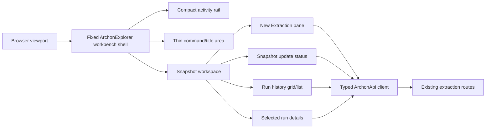

# Implementation Plan

## Document Control

| Field | Value |
| --- | --- |
| Work Package | WP005 - ArchonExplorer Visual System Remediation |
| Plan Output Path | `docs/024-ArchonExplorer-Visual-System-Remediation/plan-wp005-archonexplorer-visual-system-remediation.md` |
| Related Specification | `docs/024-ArchonExplorer-Visual-System-Remediation/spec-wp005-archonexplorer-visual-system-remediation.md` |
| Mandatory Wiki Standard | `./.github/instructions/wiki.instructions.md` |
| Mandatory Documentation-Pass Standard | `./.github/instructions/documentation-pass.instructions.md` |
| Status | Draft |

## Overall Project Structure

WP005 remediates the existing ArchonExplorer frontend visual system into a compact, fixed-viewport, IDE-like workbench. The work is expected to occur primarily in the existing ArchonExplorer frontend under `src/ArchonExplorer`, while preserving the Aspire/Vite hosting model and the existing typed ArchonApi client integration. The implementation must not create a new backend capability, must not alter extraction routes, and must not introduce a custom shadcn/ui color palette.

The plan assumes the implementation will use the repository's existing project structure and naming conventions rather than creating a parallel application shell. Work should be organized around vertical slices that each leave ArchonExplorer runnable and demonstrable from UI entry point through API-client interaction, state handling, error handling, validation, tests, and documentation/wiki review.

Planning artifacts for this work package remain in `docs/024-ArchonExplorer-Visual-System-Remediation/`. Architecture planning content is included in Appendix A of this document. Contributor-facing architecture, workflow, setup, terminology, or validation guidance must be written into the appropriate `./wiki` topic pages according to `./.github/instructions/wiki.instructions.md`; standalone implementation notes, implementation ledgers, architecture notes, or similar narrative completion records are prohibited for contributor-facing detail.

## Mandatory Execution Rules for Every Work Item

Each active Work Item must be executed without stopping for status-only updates, ordinary confirmation prompts, or fixable intermediate failures. Once implementation starts for a Work Item, the executor must continue through implementation, validation, documentation/wiki review, and plan-record updates until the Work Item is complete. The only permitted stops during an active Work Item are explicit user interruption/change of direction or a true blocker that cannot be resolved from the specification, this plan, the codebase, or repository guidance.

For every Work Item that creates or updates source code, implementation must follow `./.github/instructions/documentation-pass.instructions.md` in full as a hard Definition of Done gate. Code-writing tasks must include developer-level comments for every class, component, hook, reducer, helper, callback, method, constructor, and non-public/internal type touched or introduced. Public methods and constructors must document every parameter. Properties whose meaning is not obvious from their names must be commented. Inline or block comments must explain purpose, logical flow, and algorithms where needed. Documentation-pass compliance is not optional polish.

For every Work Item, wiki review is mandatory under `./.github/instructions/wiki.instructions.md`. If the slice changes or materially clarifies developer-facing behaviour, architecture, workflows, terminology, setup, validation, runtime composition, or contributor guidance, the implementation must update the appropriate wiki topic page before the Work Item is complete. If no wiki update is needed, the implementation must explicitly record what was reviewed and why no update was required. Detailed contributor-facing material must not be dumped into `wiki/home.md`; `home.md` remains a concise landing page and table of contents.

## Slice 1 - Fixed Workbench Shell and Scroll Containment

- [ ] Work Item 1: Establish the fixed viewport workbench frame
  - **Purpose**: Convert ArchonExplorer from a browser-page-like layout into a fixed desktop-style workbench shell that keeps navigation, workspace tabs or command surfaces, and the active workspace visible without browser-level scrolling.
  - **Acceptance Criteria**:
	- App root fills the browser viewport and prevents the document body from becoming the primary scrolling surface.
	- Activity navigation, shell header/title area, and active workspace region remain visible during normal use.
	- Scrolling is contained inside explicit workbench regions such as panes, lists, grids, forms, or details areas.
	- The shell uses standard shadcn/ui theme tokens and does not introduce custom brand colors.
	- Existing Aspire/Vite hosting and ArchonExplorer startup remain compatible.
  - **Definition of Done**:
	- Workbench shell implemented through existing frontend entry points, layout components, and styling conventions.
	- Source-code changes comply with `./.github/instructions/documentation-pass.instructions.md`, including comments on every class/component/function/constructor touched or introduced and parameter comments where applicable.
	- Layout-level error states and accessible focus behaviour are preserved.
	- Unit, integration, and e2e tests relevant to the app shell are added or updated.
	- Type checking, frontend tests, production build, and relevant e2e shell tests pass or unrelated pre-existing failures are recorded.
	- Wiki review completed under `./.github/instructions/wiki.instructions.md`; workbench-shell terminology and architecture guidance are updated in the appropriate wiki topic page, or a no-change result is explicitly recorded.
	- Wiki review result includes selected topic page, whether a new page was needed, confirmation that `wiki/home.md` remains concise, and whether glossary/cross-links are sufficient.
	- Can execute end-to-end via the ArchonExplorer browser app: app launches to a fixed workbench frame with no normal browser document scrolling.
	- Executor must not stop mid-Work Item except for explicit user interruption or a true blocker.
  - [ ] Task 1: Locate the current frontend shell composition and root styling.
	- [ ] Step 1: Identify the app entry point, root layout component, global styles, and existing workbench shell components.
	- [ ] Step 2: Identify current body/document scrolling sources and oversized page containers.
	- [ ] Step 3: Identify tests that assert old page-like shell structure.
  - [ ] Task 2: Implement fixed viewport shell composition.
	- [ ] Step 1: Apply viewport-height root layout using existing React/Vite structure.
	- [ ] Step 2: Replace page-flow containers with flex/grid workbench regions.
	- [ ] Step 3: Confine overflow to named internal regions.
	- [ ] Step 4: Preserve keyboard focus indicators and accessible landmark structure.
  - [ ] Task 3: Update validation coverage for shell behavior.
	- [ ] Step 1: Add or update tests that verify the app shell renders as a fixed workbench.
	- [ ] Step 2: Add or update e2e checks that browser document scrolling is not required for core controls.
	- [ ] Step 3: Ensure no test depends on obsolete marketing/page-section DOM shape.
  - [ ] Task 4: Complete documentation and wiki review.
	- [ ] Step 1: Apply documentation-pass comments to all modified source files.
	- [ ] Step 2: Review relevant wiki pages for workbench-shell architecture and update or explicitly record no update.
	- [ ] Step 3: Explain first-use technical terms such as "workbench", "shell", and "scroll containment" inline or through glossary links where wiki updates are made.
  - **Files**:
	- `src/ArchonExplorer/src/**`: Existing frontend root, shell, layout, and style files to be updated in place.
	- `src/ArchonExplorer/src/test-e2e/workbench-shell.spec.ts`: Shell e2e tests to update or create if this is the repository's current test location.
	- `wiki/**`: Relevant workbench or frontend architecture topic pages to update if the shell model changes contributor guidance.
  - **Work Item Dependencies**: None. This is the foundational visual slice for all later work.
  - **Run / Verification Instructions**:
	- `cd .\src\ArchonExplorer`
	- `npm run typecheck`
	- `npm run test`
	- `npm run build`
	- `npm run test:e2e -- src/test-e2e/workbench-shell.spec.ts`
	- Manual UI path: launch ArchonExplorer and verify the app opens into a fixed workbench frame without browser-level scrolling.
  - **User Instructions**: No manual setup beyond the repository's existing ArchonExplorer startup requirements.

## Slice 2 - Compact Activity Rail and Command Surface

- [ ] Work Item 2: Replace page-style navigation with compact workbench navigation
  - **Purpose**: Establish compact IDE-like activity navigation and command/header surfaces so the application reads as a technical workbench rather than a dashboard or website.
  - **Acceptance Criteria**:
	- Activity rail is compact, stable, and does not behave like a large sidebar by default.
	- Activity items have meaningful labels, accessible names, and tooltips for icon-only controls.
	- Decorative or random icons are removed.
	- Selected activity state is clear using standard shadcn/ui affordances, not custom colors.
	- Header/title/command area is visibly thinner and more operational.
  - **Definition of Done**:
	- Navigation and header changes are integrated into the runnable shell from Work Item 1.
	- Code-writing tasks comply with `./.github/instructions/documentation-pass.instructions.md` for all touched components, hooks, helpers, constructors, and functions.
	- Accessibility tests or e2e checks cover keyboard reachability and accessible names for icon-only controls.
	- Decorative icon/badge use is removed or justified as meaningful state/action affordance.
	- Wiki review completed under `./.github/instructions/wiki.instructions.md`; navigation terminology or workbench usage guidance updated or no-change result recorded with reviewed pages named.
	- Contributor-facing explanation, if needed, is written to a topic page with book-like narrative depth for conceptual material and not placed in `wiki/home.md`.
	- Can execute end-to-end via: open app, switch workspaces through compact rail, confirm the selected workspace changes without browser-page navigation.
	- Executor must not stop mid-Work Item except for explicit user interruption or a true blocker.
  - [ ] Task 1: Inventory navigation labels, icons, badges, and command/header content.
	- [ ] Step 1: Identify current activity/navigation components.
	- [ ] Step 2: Mark decorative icons and non-actionable badges for removal or replacement.
	- [ ] Step 3: Identify accessible names and tooltip gaps.
  - [ ] Task 2: Implement compact rail and command surface.
	- [ ] Step 1: Reduce navigation width and remove large-sidebar behavior.
	- [ ] Step 2: Use meaningful icons only where they improve workspace recognition.
	- [ ] Step 3: Add accessible names and tooltips for icon-only activity items.
	- [ ] Step 4: Compact the header/title/command area without changing shadcn/ui theme colors.
  - [ ] Task 3: Update tests for navigation behavior.
	- [ ] Step 1: Verify keyboard navigation reaches activity items.
	- [ ] Step 2: Verify selected state is visible and not color-only.
	- [ ] Step 3: Verify obsolete page-sidebar assertions are removed.
  - [ ] Task 4: Complete documentation and wiki review.
	- [ ] Step 1: Apply documentation-pass requirements to modified source.
	- [ ] Step 2: Update or review wiki guidance for workbench navigation terminology.
	- [ ] Step 3: Record page-structure decision and cross-link/glossary outcome.
  - **Files**:
	- `src/ArchonExplorer/src/**`: Existing navigation, activity rail, shell header, tooltip, and test files.
	- `wiki/**`: Relevant frontend workbench or contributor workflow pages if navigation concepts change.
  - **Work Item Dependencies**: Work Item 1.
  - **Run / Verification Instructions**:
	- `cd .\src\ArchonExplorer`
	- `npm run typecheck`
	- `npm run test`
	- `npm run build`
	- `npm run test:e2e -- src/test-e2e/workbench-shell.spec.ts`
	- Manual UI path: launch ArchonExplorer, navigate through the compact activity rail using mouse and keyboard, and confirm no large sidebar/page-navigation feel remains.
  - **User Instructions**: None.

## Slice 3 - Snapshot Workspace Landing Context

- [ ] Work Item 3: Promote Snapshot workspace as the primary operational context
  - **Purpose**: Make the Snapshot workspace the default or clearly primary ArchonExplorer operational surface, preparing it for current extraction state, snapshot state, run history, and future architecture investigation without implementing graph visualization.
  - **Acceptance Criteria**:
	- Snapshot workspace is the default landing context or clearly promoted as primary.
	- Workspace avoids dashboard cards, hero copy, and stacked page sections.
	- Empty/current/unavailable states use terse operational language.
	- The layout prepares regions for New Extraction, run history, selected details, and update status without requiring browser document scrolling.
	- No CodeSee-style graph canvas implementation is introduced in this work item.
  - **Definition of Done**:
	- Snapshot workspace renders inside the fixed workbench shell and is runnable after completion.
	- Code-writing tasks comply with `./.github/instructions/documentation-pass.instructions.md` for all touched components, helpers, hooks, and callbacks.
	- Snapshot terminology is used consistently across UI, tests, and developer-facing documentation where changed.
	- Tests verify the Snapshot workspace is reachable and no longer depends on old Extraction Center page layout.
	- Wiki review completed under `./.github/instructions/wiki.instructions.md`; if terminology shifts from Extraction Center to Snapshot workspace, the relevant wiki topic page and glossary/cross-links are updated.
	- Conceptually dense wiki content uses longer, book-like narrative prose, defines terms at first use, and includes a walkthrough if helpful.
	- Can execute end-to-end via: open app to Snapshot workspace and see compact operational regions without browser-page scrolling.
	- Executor must not stop mid-Work Item except for explicit user interruption or a true blocker.
  - [ ] Task 1: Map existing Extraction Center and snapshot-related UI responsibilities.
	- [ ] Step 1: Identify current extraction landing route or workspace.
	- [ ] Step 2: Identify current snapshot terminology and state display.
	- [ ] Step 3: Identify obsolete prose-heavy empty states.
  - [ ] Task 2: Implement Snapshot workspace layout skeleton.
	- [ ] Step 1: Compose the workspace into workbench regions rather than stacked page sections.
	- [ ] Step 2: Reserve compact regions for extraction pane, update status, run history, and details.
	- [ ] Step 3: Use terse empty/unavailable/current state language.
	- [ ] Step 4: Avoid graph/canvas features that are explicitly out of scope.
  - [ ] Task 3: Update tests for landing and terminology.
	- [ ] Step 1: Verify Snapshot workspace is the default or clearly primary context.
	- [ ] Step 2: Update tests that refer to obsolete page-like Extraction Center wording where product terminology changes.
	- [ ] Step 3: Verify primary controls are visible without page scroll.
  - [ ] Task 4: Complete documentation and wiki review.
	- [ ] Step 1: Apply documentation-pass comments.
	- [ ] Step 2: Update wiki topic pages for Snapshot workspace terminology and workflow if contributor-facing guidance changes.
	- [ ] Step 3: Record pages reviewed, pages updated/unchanged, and the page-structure decision.
  - **Files**:
	- `src/ArchonExplorer/src/**`: Existing workspace, routing, extraction center, snapshot, and shell files.
	- `src/ArchonExplorer/src/test-e2e/**`: E2E tests for workspace landing and extraction flow.
	- `wiki/**`: Workbench, Snapshot workspace, Extraction Center, and glossary pages as applicable.
  - **Work Item Dependencies**: Work Items 1 and 2.
  - **Run / Verification Instructions**:
	- `cd .\src\ArchonExplorer`
	- `npm run typecheck`
	- `npm run test`
	- `npm run build`
	- `npm run test:e2e -- src/test-e2e/workbench-shell.spec.ts`
	- Manual UI path: launch app and confirm Snapshot workspace is the primary operational context.
  - **User Instructions**: None.

## Slice 4 - Compact New Extraction Pane

- [ ] Work Item 4: Remediate extraction submission into a docked New Extraction pane
  - **Purpose**: Move the existing extraction start form into a compact docked workbench pane that supports fast repeated extraction requests without page scrolling or large explanatory sections.
  - **Acceptance Criteria**:
	- Existing extraction submission still uses the typed ArchonApi client and `POST /extractions`.
	- No `/api/extractions` prefix, recursive solution discovery, filesystem browsing, or new backend behavior is introduced.
	- Repository root, explicit solution paths, and submit action are prioritized.
	- Optional branch, commit SHA, requested-by, and metadata fields are grouped compactly.
	- Repeated solution path entry uses compact rows.
	- API-unconfigured or API-unavailable states show concise operational feedback.
  - **Definition of Done**:
	- A valid mocked extraction request can be submitted end to end from the New Extraction pane.
	- Code-writing tasks comply with `./.github/instructions/documentation-pass.instructions.md`, including comments on all modified form components, validation helpers, callbacks, and hooks.
	- Validation and error handling preserve safe diagnostic boundaries and do not expose raw secrets, stack traces, connection strings, raw Cypher, tokens, or arbitrary backend exception text.
	- Tests cover valid submission, unavailable API feedback, solution-path rows, and route correctness.
	- Wiki review completed under `./.github/instructions/wiki.instructions.md`; contributor guidance for extraction workflow terminology is updated or an explicit no-change review is recorded.
	- Any detailed workflow explanation is routed to the correct wiki topic page, not a standalone implementation note and not `wiki/home.md`.
	- Can execute end-to-end via: Snapshot workspace > New Extraction pane > submit mocked extraction > accepted run status is visible.
	- Executor must not stop mid-Work Item except for explicit user interruption or a true blocker.
  - [ ] Task 1: Inventory the existing extraction form behavior.
	- [ ] Step 1: Identify request model mapping, validation rules, TanStack Query mutation, and typed API client usage.
	- [ ] Step 2: Identify current explanatory copy and card-like form containers to remove or relocate.
	- [ ] Step 3: Identify existing tests for extraction submission and API route assertions.
  - [ ] Task 2: Implement compact pane layout.
	- [ ] Step 1: Move form into a docked left pane or equivalent workbench pane.
	- [ ] Step 2: Prioritize repository root, explicit solution paths, and submit action.
	- [ ] Step 3: Group optional fields compactly.
	- [ ] Step 4: Keep submit visible without promotional styling.
	- [ ] Step 5: Add concise operational unavailable/unconfigured states.
  - [ ] Task 3: Preserve request semantics.
	- [ ] Step 1: Continue using the typed ArchonApi client.
	- [ ] Step 2: Preserve route `POST /extractions` without adding `/api`.
	- [ ] Step 3: Avoid new backend behavior or route assumptions.
  - [ ] Task 4: Update validation coverage.
	- [ ] Step 1: Add or update unit tests for form validation and request mapping.
	- [ ] Step 2: Add or update integration/e2e tests for mocked submission.
	- [ ] Step 3: Add route assertion preventing `/api/extractions` regression.
  - [ ] Task 5: Complete documentation and wiki review.
	- [ ] Step 1: Apply documentation-pass comments.
	- [ ] Step 2: Review wiki pages for extraction workflow guidance and update if New Extraction pane terminology changes contributor-facing workflow.
	- [ ] Step 3: Record wiki impact for affected extraction workflow concepts.
  - **Files**:
	- `src/ArchonExplorer/src/**`: Existing extraction form, API client usage, mutation hooks, workspace layout, and validation helpers.
	- `src/ArchonExplorer/src/test-e2e/extraction-center.spec.ts`: Existing extraction e2e test to update for Snapshot/New Extraction terminology or replace with equivalent current test path.
	- `wiki/**`: Relevant extraction workflow and glossary pages if terminology or workflow guidance changes.
  - **Work Item Dependencies**: Work Items 1, 2, and 3.
  - **Run / Verification Instructions**:
	- `cd .\src\ArchonExplorer`
	- `npm run typecheck`
	- `npm run test`
	- `npm run build`
	- `npm run test:e2e -- src/test-e2e/extraction-center.spec.ts`
	- Manual UI path: Snapshot workspace > New Extraction pane > enter repository root and solution paths > submit > observe accepted run feedback.
  - **User Instructions**: None.

## Slice 5 - Compact Snapshot Update Status

- [ ] Work Item 5: Show extraction progress as focused Snapshot update status
  - **Purpose**: Present active extraction progress inside the Snapshot workspace as a small operational status surface using existing accepted-run and polling feedback, without creating a global output pane or log console.
  - **Acceptance Criteria**:
	- Snapshot update status uses existing API feedback from accepted run status and polling.
	- Queued, running, completed, failed, cancelled, unavailable, and unknown states are represented when applicable.
	- Current progress stage, progress message, warning count, error count, and produced snapshot identity are shown when available.
	- Active work has a clear but non-dominant working indication.
	- No global output/log pane, event stream, build-output clone, or verbose diagnostic console is introduced.
	- Polling cadence remains bounded and is not tightened solely because status is visible.
  - **Definition of Done**:
	- Submitted extraction status flows from API client/TanStack Query state into the Snapshot update status surface.
	- Code-writing tasks comply with `./.github/instructions/documentation-pass.instructions.md`, including comments on status derivation helpers, hooks, callbacks, and components.
	- Safe diagnostic boundaries are preserved; raw stack traces, secrets, raw Cypher, driver details, tokens, and arbitrary backend exception text are not displayed.
	- Accessibility is addressed with appropriate status exposure/announcement where applicable and color is not the only state indicator.
	- Tests cover status states, snapshot identity display, warning/error count display, and safe diagnostic rendering.
	- Wiki review completed under `./.github/instructions/wiki.instructions.md`; Snapshot update status terminology and workflow guidance are updated or no-change result recorded.
	- Can execute end-to-end via: submit mocked extraction and observe compact Snapshot update status progress through accepted/running/completed or failure state.
	- Executor must not stop mid-Work Item except for explicit user interruption or a true blocker.
  - [ ] Task 1: Identify current polling and status data flow.
	- [ ] Step 1: Locate accepted-run status handling and polling query configuration.
	- [ ] Step 2: Identify available progress fields, warning/error counts, and snapshot identity fields.
	- [ ] Step 3: Identify unsafe diagnostic fields that must never be rendered raw.
  - [ ] Task 2: Implement compact status surface.
	- [ ] Step 1: Add Snapshot workspace status region with terse state text.
	- [ ] Step 2: Map all applicable statuses to compact visible labels.
	- [ ] Step 3: Display stage, message, warning/error counts, and snapshot identity when available.
	- [ ] Step 4: Provide accessible status semantics without relying only on color.
  - [ ] Task 3: Preserve polling and safety behavior.
	- [ ] Step 1: Reuse existing TanStack Query server state.
	- [ ] Step 2: Keep polling bounded at existing cadence unless current code already defines a safe cadence.
	- [ ] Step 3: Sanitize or omit unsafe diagnostics.
  - [ ] Task 4: Update tests.
	- [ ] Step 1: Add mocked status-state tests.
	- [ ] Step 2: Add e2e or integration coverage for accepted extraction status appearing in Snapshot update UI.
	- [ ] Step 3: Add regression coverage that no global output/log pane appears.
  - [ ] Task 5: Complete documentation and wiki review.
	- [ ] Step 1: Apply documentation-pass comments.
	- [ ] Step 2: Update or review wiki guidance for Snapshot update status and polling expectations.
	- [ ] Step 3: Record reviewed pages, updated pages, intentionally unchanged pages, and page-structure decision.
  - **Files**:
	- `src/ArchonExplorer/src/**`: Existing extraction polling hooks, Snapshot workspace components, status helpers, tests.
	- `wiki/**`: Relevant extraction/Snapshot workflow and glossary pages.
  - **Work Item Dependencies**: Work Item 4.
  - **Run / Verification Instructions**:
	- `cd .\src\ArchonExplorer`
	- `npm run typecheck`
	- `npm run test`
	- `npm run build`
	- `npm run test:e2e -- src/test-e2e/extraction-center.spec.ts`
	- Manual UI path: Snapshot workspace > submit extraction > observe compact update status and resulting snapshot identity when mocked/completed.
  - **User Instructions**: None.

## Slice 6 - Dense Run History Grid

- [ ] Work Item 6: Convert recent extraction runs to a dense workbench grid/list
  - **Purpose**: Replace card-heavy run history with a compact scannable grid or workbench list that supports power-user review of recent extraction runs.
  - **Acceptance Criteria**:
	- Recent runs display in a dense grid, table, or workbench list rather than large cards.
	- Rows support scanning run ID, status, repository, solution count, started/completed time, warning count, error count, and snapshot identity where available.
	- Status is shown with terse text and compact meaningful state treatment; oversized or decorative badges are removed.
	- Grid/list is structured so future virtualization can be added if run counts grow.
	- Missing/unavailable data uses concise operational messages.
  - **Definition of Done**:
	- Run history remains loaded through existing `GET /extractions` typed API client behavior.
	- Code-writing tasks comply with `./.github/instructions/documentation-pass.instructions.md` for all grid/list components, row helpers, formatting functions, and callbacks.
	- Tests cover dense history rendering, status representation, fields shown, and no unsafe diagnostics.
	- Accessibility of table/list semantics and row selection/focus is preserved.
	- Wiki review completed under `./.github/instructions/wiki.instructions.md`; history-grid terminology or contributor guidance is updated or no-change result recorded.
	- Can execute end-to-end via: Snapshot workspace > view recent runs in dense history grid/list loaded from mocked API data.
	- Executor must not stop mid-Work Item except for explicit user interruption or a true blocker.
  - [ ] Task 1: Inventory existing run history display and data fields.
	- [ ] Step 1: Locate current `GET /extractions` query usage.
	- [ ] Step 2: Identify current card containers, badges, icons, and prose to remove or compact.
	- [ ] Step 3: Identify available run fields and formatting helpers.
  - [ ] Task 2: Implement dense grid/list.
	- [ ] Step 1: Replace card layout with semantic table/list surface.
	- [ ] Step 2: Add compact columns or row cells for required scan fields.
	- [ ] Step 3: Use terse status text and compact meaningful state affordances.
	- [ ] Step 4: Keep overflow contained in the history region.
  - [ ] Task 3: Add selection integration hook for details.
	- [ ] Step 1: Preserve local UI selection state only.
	- [ ] Step 2: Avoid duplicating server state into local stores.
	- [ ] Step 3: Ensure selected run can feed the details region in the next slice without breaking current runnability.
  - [ ] Task 4: Update tests and accessibility checks.
	- [ ] Step 1: Verify table/list roles or accessible names.
	- [ ] Step 2: Verify rows can be scanned and selected with keyboard where applicable.
	- [ ] Step 3: Verify old card-heavy assertions are retired.
  - [ ] Task 5: Complete documentation and wiki review.
	- [ ] Step 1: Apply documentation-pass comments.
	- [ ] Step 2: Review wiki pages for run history workflow guidance and update where needed.
	- [ ] Step 3: Record wiki impact matrix entries for history-grid concepts.
  - **Files**:
	- `src/ArchonExplorer/src/**`: Run history components, extraction query hooks, formatting helpers, tests.
	- `wiki/**`: Relevant Snapshot/extraction workflow pages if history behaviour is documented.
  - **Work Item Dependencies**: Work Items 3 and 5.
  - **Run / Verification Instructions**:
	- `cd .\src\ArchonExplorer`
	- `npm run typecheck`
	- `npm run test`
	- `npm run build`
	- `npm run test:e2e -- src/test-e2e/extraction-center.spec.ts`
	- Manual UI path: Snapshot workspace > Recent runs > scan dense grid/list and select a run.
  - **User Instructions**: None.

## Slice 7 - Selected Run Details Pane

- [ ] Work Item 7: Render selected run details as compact workbench properties
  - **Purpose**: Replace large prose details panels with a compact property-grid, definition-list, or dense table presentation for the selected extraction run.
  - **Acceptance Criteria**:
	- Selecting a run shows details in a docked or split details region.
	- Details use compact property-style presentation rather than large prose cards.
	- Details continue to use existing `GET /extractions/{runId}` typed API client behavior where needed.
	- Missing or unavailable detail state uses concise operational messages.
	- Unsafe diagnostics are not displayed.
  - **Definition of Done**:
	- End-to-end selection from history to details works in the Snapshot workspace.
	- Code-writing tasks comply with `./.github/instructions/documentation-pass.instructions.md` for all details components, hooks, helper functions, callbacks, and properties whose meaning is not obvious.
	- Tests cover row selection, details loading, compact property rendering, missing/unavailable state, and safe diagnostic boundaries.
	- Accessibility supports keyboard selection and details region naming where applicable.
	- Wiki review completed under `./.github/instructions/wiki.instructions.md`; contributor guidance for run details or extraction inspection is updated or no-change result recorded.
	- Can execute end-to-end via: Snapshot workspace > recent runs grid/list > select run > details appear in compact region.
	- Executor must not stop mid-Work Item except for explicit user interruption or a true blocker.
  - [ ] Task 1: Inventory current run detail behavior.
	- [ ] Step 1: Locate current selected-run state and detail query.
	- [ ] Step 2: Identify unsafe or verbose fields in current display.
	- [ ] Step 3: Identify current details tests.
  - [ ] Task 2: Implement compact details presentation.
	- [ ] Step 1: Add docked/split details region in Snapshot workspace.
	- [ ] Step 2: Render operational facts as properties or dense rows.
	- [ ] Step 3: Keep copy terse and avoid long explanatory paragraphs.
	- [ ] Step 4: Render unavailable/missing detail states concisely.
  - [ ] Task 3: Preserve API and state semantics.
	- [ ] Step 1: Use existing typed API client route `GET /extractions/{runId}`.
	- [ ] Step 2: Keep server state in TanStack Query.
	- [ ] Step 3: Keep local state limited to selection and pane/workflow state.
  - [ ] Task 4: Update tests.
	- [ ] Step 1: Add selection-to-details coverage.
	- [ ] Step 2: Add safe-diagnostics regression tests.
	- [ ] Step 3: Update e2e flow for details region.
  - [ ] Task 5: Complete documentation and wiki review.
	- [ ] Step 1: Apply documentation-pass comments.
	- [ ] Step 2: Review/update wiki pages for run inspection workflow if contributor-facing guidance changes.
	- [ ] Step 3: Record wiki impact and page-structure decision.
  - **Files**:
	- `src/ArchonExplorer/src/**`: Run details components, selection state, API hooks, formatting helpers, tests.
	- `wiki/**`: Extraction/Snapshot workflow topic pages if details behaviour is documented.
  - **Work Item Dependencies**: Work Item 6.
  - **Run / Verification Instructions**:
	- `cd .\src\ArchonExplorer`
	- `npm run typecheck`
	- `npm run test`
	- `npm run build`
	- `npm run test:e2e -- src/test-e2e/extraction-center.spec.ts`
	- Manual UI path: Snapshot workspace > Recent runs > select run > verify compact details.
  - **User Instructions**: None.

## Slice 8 - Text, Help, Tooltips, Icons, and Badge Remediation

- [ ] Work Item 8: Remove web-page prose and decorative visual noise from primary work areas
  - **Purpose**: Enforce the workbench text and affordance policy by reducing visible prose to operational labels/statuses, moving explanations into tooltips/docs where useful, and removing decorative icons/badges.
  - **Acceptance Criteria**:
	- Primary workspace text is terse and operational.
	- Long explanations are moved to tooltips, documentation links, or help affordances where still useful.
	- Tooltips supplement but do not replace accessible names or form labels.
	- Decorative icons are removed; icon-only actions have accessible names and should have tooltips.
	- Badges are removed or compacted unless they communicate actionable state.
	- Color is not the only signal for status, selection, validation, or progress.
  - **Definition of Done**:
	- Prose-heavy primary UI regions are remediated across the shell, Snapshot workspace, New Extraction pane, status, history, and details surfaces touched by WP005.
	- Code-writing tasks comply with `./.github/instructions/documentation-pass.instructions.md` for all touched components and helper functions.
	- Accessibility tests or e2e checks verify icon-only accessible names/tooltips where applicable.
	- Tests are updated to assert behavior and accessible labels rather than obsolete prose blocks.
	- Wiki review completed under `./.github/instructions/wiki.instructions.md`; if UI terminology or contributor usage guidance changes, relevant pages/glossary are updated.
	- Conceptually dense wiki updates use book-like narrative prose, term definitions, and examples/walkthroughs when helpful.
	- Can execute end-to-end via: use the Snapshot workflow with concise visible UI and tooltip/help support.
	- Executor must not stop mid-Work Item except for explicit user interruption or a true blocker.
  - [ ] Task 1: Audit visible text, icons, and badges.
	- [ ] Step 1: Identify long explanatory text in primary workbench surfaces.
	- [ ] Step 2: Identify decorative or non-obvious icons.
	- [ ] Step 3: Identify badges that are decorative, oversized, or non-actionable.
  - [ ] Task 2: Remediate text and help affordances.
	- [ ] Step 1: Replace prose blocks with terse operational labels/statuses.
	- [ ] Step 2: Move useful explanations to tooltips, documentation links, or concise help affordances.
	- [ ] Step 3: Ensure tooltips are not required to complete the primary workflow.
  - [ ] Task 3: Remediate icons and badges.
	- [ ] Step 1: Remove decorative icons.
	- [ ] Step 2: Add accessible names and tooltips for icon-only actions.
	- [ ] Step 3: Replace decorative badges with text or compact meaningful state treatment.
  - [ ] Task 4: Update tests.
	- [ ] Step 1: Assert accessible names and tooltip presence where relevant.
	- [ ] Step 2: Remove tests that require old prose-heavy content.
	- [ ] Step 3: Verify state is not communicated by color alone.
  - [ ] Task 5: Complete documentation and wiki review.
	- [ ] Step 1: Apply documentation-pass comments.
	- [ ] Step 2: Review wiki pages for terminology and usage changes.
	- [ ] Step 3: Record wiki impact with pages reviewed, updated, created, intentionally unchanged, and page-structure decision.
  - **Files**:
	- `src/ArchonExplorer/src/**`: Shell, Snapshot workspace, extraction pane, status, history, details, tooltip/help, and test files.
	- `wiki/**`: Relevant topic pages and glossary if terminology or contributor guidance changes.
  - **Work Item Dependencies**: Work Items 1 through 7.
  - **Run / Verification Instructions**:
	- `cd .\src\ArchonExplorer`
	- `npm run typecheck`
	- `npm run test`
	- `npm run build`
	- `npm run test:e2e -- src/test-e2e/workbench-shell.spec.ts`
	- `npm run test:e2e -- src/test-e2e/extraction-center.spec.ts`
	- Manual UI path: run the Snapshot extraction workflow and confirm primary UI text is terse, tooltips/help are available where useful, and decorative icons/badges are absent.
  - **User Instructions**: None.

## Slice 9 - Full Validation, Regression Hardening, and Manual Review

- [ ] Work Item 9: Validate the remediated visual system end to end
  - **Purpose**: Prove that the complete WP005 workbench remediation satisfies functional, non-functional, accessibility, API-safety, and theme constraints without regressing extraction behavior.
  - **Acceptance Criteria**:
	- Type checking, frontend tests, production build, and targeted e2e tests pass.
	- Extraction submission, history, polling/status, and selected details continue to work through the typed API client.
	- No `/api/extractions` route prefix is introduced.
	- No custom shadcn/ui palette or bespoke product colors are introduced.
	- Browser document scrolling is not required for normal workbench use.
	- Manual review confirms the UI feels materially closer to Visual Studio/Rider compact workbench density than to a dashboard or marketing site.
  - **Definition of Done**:
	- All planned validation commands are run and outcomes recorded in the plan-status or final execution record.
	- Code-writing tasks, if any, comply with `./.github/instructions/documentation-pass.instructions.md`.
	- Full solution/frontend validation succeeds or unrelated pre-existing failures are documented with evidence.
	- Accessibility, safe diagnostics, route correctness, bounded polling, and theme constraints are explicitly checked.
	- Wiki review completed under `./.github/instructions/wiki.instructions.md`; final validation guidance updates are made where developer-facing workflows changed.
	- Can execute end-to-end via: open app, submit extraction, observe update status, inspect history, select details, and verify compact workbench behavior.
	- Executor must not stop mid-Work Item except for explicit user interruption or a true blocker.
  - [ ] Task 1: Run automated validation.
	- [ ] Step 1: Run `npm run typecheck`.
	- [ ] Step 2: Run `npm run test`.
	- [ ] Step 3: Run `npm run build`.
	- [ ] Step 4: Run targeted workbench shell e2e tests.
	- [ ] Step 5: Run targeted extraction workflow e2e tests.
  - [ ] Task 2: Perform manual visual and interaction review.
	- [ ] Step 1: Confirm no normal browser-level scrollbar is needed for the primary workflow.
	- [ ] Step 2: Confirm header, rail, pane, table/list, and details density are compact.
	- [ ] Step 3: Confirm primary controls and workflow are visible without scrolling through page sections.
	- [ ] Step 4: Confirm focus indicators and keyboard reachability remain usable.
	- [ ] Step 5: Confirm text is terse and operational.
  - [ ] Task 3: Perform API and safety regression review.
	- [ ] Step 1: Confirm routes remain `POST /extractions`, `GET /extractions`, and `GET /extractions/{runId}`.
	- [ ] Step 2: Confirm no new backend routes or extraction behavior are assumed.
	- [ ] Step 3: Confirm unsafe diagnostics are not rendered.
	- [ ] Step 4: Confirm polling cadence remains bounded.
  - [ ] Task 4: Perform theme and architecture review.
	- [ ] Step 1: Confirm standard shadcn/ui theme tokens remain the visual basis.
	- [ ] Step 2: Confirm no bespoke product palette or marketing colors were introduced.
	- [ ] Step 3: Confirm shared layout primitives are used where practical and one-off CSS is limited to layout/density/workbench behavior.
  - [ ] Task 5: Record validation outcomes.
	- [ ] Step 1: Record commands run and outcomes concisely in the plan-status or final execution record.
	- [ ] Step 2: Link to updated wiki guidance instead of duplicating contributor-facing explanation.
	- [ ] Step 3: Record any accepted unrelated failures with evidence.
  - **Files**:
	- `src/ArchonExplorer/src/**`: Test and source files only if validation reveals required fixes.
	- `wiki/**`: Validation or workflow pages if developer-facing validation guidance changes.
  - **Work Item Dependencies**: Work Items 1 through 8.
  - **Run / Verification Instructions**:
	- `cd .\src\ArchonExplorer`
	- `npm run typecheck`
	- `npm run test`
	- `npm run build`
	- `npm run test:e2e -- src/test-e2e/extraction-center.spec.ts`
	- `npm run test:e2e -- src/test-e2e/workbench-shell.spec.ts`
	- Manual UI path: complete the Snapshot extraction workflow and visual review checklist from the specification.
  - **User Instructions**: None.

## Slice 10 - Final Wiki Review and Work Package Closure

- [ ] Work Item 10: Complete mandatory wiki review and final work-package record
  - **Purpose**: Close WP005 by ensuring the repository wiki accurately reflects the current workbench model, Snapshot workflow, extraction pane, status, history/details behavior, terminology, and contributor validation path after implementation.
  - **Acceptance Criteria**:
	- Relevant wiki topic pages, appendix pages, glossary entries, and reader paths are reviewed.
	- Required wiki updates are made before the work package is considered complete.
	- No contributor-facing detail is stored in standalone implementation notes, implementation ledgers, architecture notes, or similar substitute artifacts.
	- `wiki/home.md` remains a concise landing page and does not become a catch-all page.
	- Final record includes a wiki impact matrix or equivalent prose.
	- Final record states which wiki or repository guidance pages were updated, created, retired, intentionally unchanged, or why no wiki page update was needed.
  - **Definition of Done**:
	- `./.github/instructions/wiki.instructions.md` has been followed in full.
	- If source code was changed in closure fixes, `./.github/instructions/documentation-pass.instructions.md` has also been followed in full.
	- Final wiki review result identifies affected concepts, pages reviewed, pages updated, pages created, pages retired/split/renamed if any, pages intentionally unchanged, and page-structure decision.
	- Long-form narrative standards are satisfied for architecture, runtime, workflow, setup, extension, or other conceptually dense documentation.
	- Technical terms are defined at first use inline or linked to a glossary entry.
	- Relevant examples or walkthrough material are added where they materially improve understanding.
	- Can execute end-to-end via: follow the final wiki-linked validation path and complete the remediated Snapshot extraction workflow.
	- Executor must not stop mid-Work Item except for explicit user interruption or a true blocker.
  - [ ] Task 1: Identify affected concepts and reader paths.
	- [ ] Step 1: List concepts changed by WP005, including workbench shell, activity rail, Snapshot workspace, New Extraction pane, Snapshot update status, dense run history, selected run details, text/help policy, icon/badge policy, and validation workflow.
	- [ ] Step 2: Identify existing wiki pages, glossary entries, and home-page links relevant to those concepts.
	- [ ] Step 3: Identify any stale implementation-note-style artifacts and route still-current guidance into wiki pages before retiring redundant artifacts.
  - [ ] Task 2: Perform information-architecture review.
	- [ ] Step 1: Choose the correct topic page for each affected concept.
	- [ ] Step 2: Decide whether any new topic page is needed.
	- [ ] Step 3: Confirm `wiki/home.md` remains concise and link-oriented.
	- [ ] Step 4: Confirm cross-links and glossary entries are sufficient.
  - [ ] Task 3: Update wiki guidance where required.
	- [ ] Step 1: Write current-state contributor guidance in present tense.
	- [ ] Step 2: Use book-like narrative prose for dense architecture, workflow, validation, or setup guidance.
	- [ ] Step 3: Define terms when first introduced or link to glossary entries.
	- [ ] Step 4: Add examples or walkthroughs where they materially improve understanding.
	- [ ] Step 5: Remove or rewrite stale phase-oriented or roadmap-oriented wording unless explicitly useful as labelled historical context.
  - [ ] Task 4: Create final wiki impact matrix.
	- [ ] Step 1: Record affected concepts.
	- [ ] Step 2: Record pages reviewed.
	- [ ] Step 3: Record pages updated.
	- [ ] Step 4: Record pages created, retired, split, renamed, or intentionally unchanged.
	- [ ] Step 5: Record page-structure decision and why the selected structure remains readable.
  - [ ] Task 5: Finalize work-package closure record.
	- [ ] Step 1: Record validation commands and results concisely.
	- [ ] Step 2: Link to wiki guidance instead of duplicating contributor-facing detail.
	- [ ] Step 3: Confirm no prohibited standalone implementation notes or home-page dumping were introduced.
  - **Files**:
	- `wiki/**`: Topic pages, glossary, and home page links as required by the review.
	- `docs/024-ArchonExplorer-Visual-System-Remediation/plan-wp005-archonexplorer-visual-system-remediation.md`: Concise plan-status or final execution record updates if the repository workflow uses this plan as the traceability record.
	- `src/ArchonExplorer/src/**`: Only if final closure reveals code/test fixes required for consistency.
  - **Work Item Dependencies**: Work Items 1 through 9.
  - **Run / Verification Instructions**:
	- If wiki-only closure changes are made, review markdown links and formatting using the repository's normal documentation validation if available.
	- If any source code changes are made during closure, run:
	  - `cd .\src\ArchonExplorer`
	  - `npm run typecheck`
	  - `npm run test`
	  - `npm run build`
	  - relevant targeted e2e tests.
	- Manual review: follow wiki-linked guidance to confirm it describes the final current-state workbench model.
  - **User Instructions**: None.

## Cross-Slice Test Strategy

Automated validation should remain behavior-oriented rather than preserving obsolete DOM shape. Tests should assert the new workbench model: fixed viewport shell, contained scroll regions, compact activity rail, Snapshot workspace landing, New Extraction pane submission through the typed API client, compact Snapshot update status, dense history grid/list, compact details region, safe diagnostics, accessible names/tooltips, route correctness, and standard shadcn/ui theme constraints.

Suggested baseline commands for implementation slices are:

```powershell
cd .\src\ArchonExplorer
npm run typecheck
npm run test
npm run build
npm run test:e2e -- src/test-e2e/extraction-center.spec.ts
npm run test:e2e -- src/test-e2e/workbench-shell.spec.ts
```

Specific test file names may change if the repository refactors e2e coverage from Extraction Center terminology to Snapshot workspace terminology. Any rename must preserve equivalent behavior coverage and must be reflected in wiki or repository guidance if it changes developer-facing validation workflows.

## Cross-Slice Documentation and Wiki Requirements

Every code-writing slice must explicitly apply `./.github/instructions/documentation-pass.instructions.md`. The standard applies to public and non-public code, including classes, components, hooks, reducers, callbacks, helpers, methods, constructors, properties whose meaning is not obvious, test fixtures, test methods, and meaningful lambdas/local functions. Public methods and constructors must document each parameter. Multi-step logic must include inline or block comments that explain purpose, flow, and rationale.

Every slice must perform wiki review under `./.github/instructions/wiki.instructions.md`. If the slice changes developer-facing behaviour, architecture, workflows, terminology, setup, validation, or contributor guidance, the appropriate wiki topic page must be updated. Architecture, runtime foundations, setup flows, workflow-heavy guidance, extension guidance, and other dense concepts must be written as longer book-like narrative prose rather than terse bullet-heavy summaries. Technical terms must be explained when first introduced or linked to glossary definitions. Examples or walkthrough material must be included where they materially improve understanding.

Standalone implementation notes, implementation ledgers, architecture notes, or similar substitute artifacts are prohibited for contributor-facing detail. The plan may record concise status and validation outcomes, but contributor-facing rationale, setup guidance, validation workflows, troubleshooting, terminology, and architecture guidance must live in `./wiki`. `wiki/home.md` must remain a landing page and table of contents rather than the default destination for detailed guidance.

## Appendix A - Architecture

### Overall Technical Approach

WP005 is a frontend visual-system remediation over the existing ArchonExplorer stack. The implementation should keep the current React, TypeScript, Vite, TanStack Query, shadcn/ui-compatible component model, and Aspire-hosted delivery path. The workbench shell becomes the stable frame for the application: a fixed viewport root contains a compact activity rail, a thin title/command/tab area, docked panes, contained scroll regions, and the active Snapshot workspace.

The backend remains unchanged. Extraction operations continue to use the existing typed ArchonApi client and the existing routes `POST /extractions`, `GET /extractions`, and `GET /extractions/{runId}`. TanStack Query remains the source of server state. Local frontend state should remain limited to UI concerns such as selected run, pane visibility, acknowledgement state, and transient workflow state.

The architecture should favor reusable workbench layout primitives over one-off CSS. Compactness should be achieved first by eliminating page-flow layout, stacked cards, large headers, oversized gaps, decorative icons, and prose-heavy panels. shadcn/ui default component sizing should be used in the first pass where practical; smaller custom variants should be deferred unless a specific surface remains too spacious after structural remediation.



The diagram shows the intended current-state responsibility split after remediation. The shell owns viewport structure and workbench navigation. The Snapshot workspace owns the extraction/snapshot workflow presentation. The typed API client owns communication with existing backend routes. No new backend route, graph canvas, global output pane, or custom theme palette is part of WP005.

### Frontend

The frontend architecture should center on a persistent workbench shell. The shell should expose a compact activity rail and thin command/header surface. The Snapshot workspace should be the primary operational workspace and should contain the New Extraction pane, Snapshot update status, run history grid/list, and selected details region. These surfaces should compose around existing ArchonExplorer API hooks and state conventions rather than introducing a parallel state model.

User flow starts when a contributor opens ArchonExplorer and lands in the Snapshot workspace. The user enters repository root and explicit solution paths in the New Extraction pane, submits the request through the existing typed API client, observes compact update status derived from accepted-run and polling feedback, scans recent runs in the dense history grid/list, and selects a run to inspect compact details. All core controls should remain visible inside the fixed workbench without requiring browser-page scrolling.

Frontend implementation should preserve shadcn/ui-compatible components and standard theme tokens. Visual hierarchy should come from layout, spacing, borders, muted foreground/background tokens, typography scale, and component state. Decorative icons and non-actionable badges should be removed. Tooltips and documentation links may carry field explanation and workflow clarification, but the primary workflow must remain understandable through labels, accessible names, validation messages, and terse status text.

### Backend

WP005 does not change backend architecture, backend routes, extraction server behavior, persistence, authentication, authorization, graph querying, snapshot deletion, or diagnostics. The backend remains the provider of existing extraction request, history, and detail data through the current ArchonApi contract.

The frontend must continue to use:

```http
POST /extractions
GET  /extractions
GET  /extractions/{runId}
```

The plan explicitly prohibits inventing a common `/api` prefix or adding new server-side extraction behavior. API feedback may be rendered in compact workbench surfaces only after preserving safe diagnostic boundaries. The UI must not display raw stack traces, connection strings, environment variables, raw Cypher, Neo4j internal identifiers, driver details, access tokens, or arbitrary backend exception text.

### Data and State Flow

Server state should flow through TanStack Query and the typed ArchonApi client. The New Extraction pane submits a mutation, the Snapshot update status observes accepted-run and polling state, the run history grid/list reads recent runs, and selected run details retrieve detail data when a row is selected. Local component state should not duplicate server data. It should be limited to UI selection, pane visibility, collapsible/pinned state if supported, acknowledgement state, and transient form/workflow state.

### Documentation Architecture

Contributor-facing documentation for the final workbench model belongs in `./wiki` topic pages, not in standalone implementation notes and not as detailed content in `wiki/home.md`. The wiki should explain the current-state workbench mental model, Snapshot workspace terminology, extraction workflow, validation path, and any relevant glossary terms. Dense conceptual pages must use book-like narrative prose that explains what the concept is, why it exists, how contributors interact with it, and how it relates to the rest of the repository.

### Security, Accessibility, and Compatibility Constraints

WP005 must preserve safe diagnostic boundaries and must not expose secrets or raw backend internals in the UI. Compact density must not remove keyboard access, visible focus indicators, accessible names, table/list semantics, or status exposure where appropriate. Color must not be the only state indicator. The app remains browser-delivered through Aspire and Vite and must remain compatible with Chromium-based Playwright execution.

## Summary

This plan delivers WP005 as a sequence of vertical, runnable slices. The implementation starts by establishing the fixed workbench shell, then remediates navigation, Snapshot workspace structure, extraction submission, update status, run history, details, text/help/icon/badge policy, validation, and final wiki closure. Each Work Item preserves the existing extraction API contract and typed client usage while incrementally replacing page-like UI structure with compact professional workbench surfaces.

The key implementation considerations are strict scope control, preservation of existing backend behavior, standard shadcn/ui theme usage, contained scrolling, accessible compact density, safe diagnostics, behavior-focused tests, mandatory source-code documentation-pass compliance for code changes, and mandatory wiki review/update completion for the work package.
